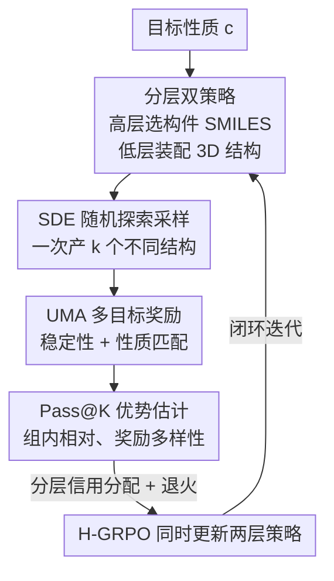

# PRO-MOF: Policy Optimization with Universal Atomistic Models for Controllable MOF Generation

**会议**: ICLR 2026  
**OpenReview**: [https://openreview.net/forum?id=BIzrFlp0hv](https://openreview.net/forum?id=BIzrFlp0hv)  
**代码**: 无  
**领域**: AI for Science / 材料生成 / 强化学习  
**关键词**: 金属有机框架, 分层强化学习, 流匹配, 通用原子势, Pass@K

## 一句话总结
PRO-MOF 把金属有机框架（MOF）的逆向设计拆成「先选化学构件、再装配三维结构」的两层策略，用预训练通用原子势（UMA）当高保真物理环境给奖励，并把确定性流匹配生成器改写成随机微分方程以支持探索、配上 Pass@K 版 GRPO 抑制多样性坍缩，在 CO₂ 吸附、孔径定向、最低能量三类逆向设计任务上成功率和最优材料质量都显著超过扩散模型与遗传算法。

## 研究背景与动机
**领域现状**：MOF 因为巨大的内表面积和可调孔环境，是碳捕集、气体存储、催化的明星材料，但其构件与拓扑的组合空间天文数字般大，穷举不可行。近年生成式方法（粗粒化扩散的 DiffCSP、MOFDiff，以及柔性装配框架 MOFFlow-2）能学到原子排布与连接的统计分布，生成几何上看似合理的新结构。

**现有痛点**：几何合理掩盖了一个致命缺陷——缺乏内在的物理可行性。作者用通用机器学习原子间势 UMA 评估了上千个生成结构的形成能，发现生成 MOF 的能量分布相比真实可合成材料整体明显偏高、偏宽，存在一道「物理现实鸿沟」（Energy Gap）：大量看着结构完整的样本其实物理上不稳定。

**核心矛盾**：把物理真实性直接塞进训练回路（用 UMA 当奖励做 RL）看似自然，却引出更隐蔽的陷阱。标准策略优化奖励的是「单个成功样本」（Pass@1 奖励），天然偏向利用而非探索：生成器很快学会龟缩到化学空间里几个能稳定产出的「安全区」，停止探索新拓扑，导致多样性急剧坍缩（mode collapse）。对一个目标本就是「发现新材料」的任务，收敛到局部最优是根本性失败。

**本文目标**：同时解决物理现实鸿沟与多样性坍缩两个问题，做到可控、从头（de novo）的 MOF 逆向设计，让生成结构既稳定又满足用户给定的性能目标，还保持多样。

**切入角度**：MOF 的设计天然可分层——离散的化学组成空间和高维连续的几何装配空间性质迥异，硬塞进一个策略既难优化也难分配信用。于是把生成显式拆成「高层选构件 + 低层装结构」两个专精策略，再用一个闭环把物理奖励回传给两层。

**核心 idea**：分层强化学习 + 高保真物理环境（UMA）+ Pass@K 奖励，三者合一——用两层策略协同设计化学与几何，用 UMA 提供物理奖励填平能量鸿沟，用 Pass@K 的组内多样性奖励对抗坍缩。

## 方法详解

### 整体框架
PRO-MOF 把从头 MOF 生成建模成一个两阶段的分层策略优化问题，在一个闭环里同时优化「选什么构件」和「怎么装配」。一次迭代里：高层策略（"化学家"）针对目标性质 $c$ 自回归地吐出一串 MOF 构件序列；低层策略（"结构工程师"）拿到这些构件后，用随机采样器一次性探索出 $k$ 个不同的三维装配方案；通用原子势 UMA 把这 $k$ 个结构逐一评估，给出物理奖励；H-GRPO 模块据此算出组内相对优势，同时回传更新两层策略，闭合回路。最终结构 $S = f(a^{chem}, a^{geom})$ 是两层动作的确定性函数。

### 关键设计

**1. 分层双策略解耦化学与几何：高层"化学家" + 低层"结构工程师"**

针对化学空间离散、几何空间连续这两类截然不同的搜索难题，PRO-MOF 把生成拆成两层，让每层专精一种空间。高层策略 $\pi^{chem}_\theta$ 是一个自回归 Transformer，动作 $a^{chem}$ 是生成一串规范化的构件 SMILES 序列，格式为 `<BOS> m1.m2... <SEP> o1.o2... <EOS>`：金属簇 $m_i$ 在前、有机连接体 $o_j$ 在后，组内按分子量排序，得到一套 2D 化学构件 $B_{2D}$。低层策略 $\pi^{geom}_\phi$ 是条件流匹配模型，先用预定义金属簇库和 RDKit 把构件初始化成 3D 块 $B_{3D}$，其动作 $a^{geom}$ 是确定最优装配——生成刚体平移 $\tau$、旋转 $q$、连接体柔性扭转 $\phi$ 和全局晶格 $\ell$ 的连续参数，网络是非等变 Transformer，学一个随时间变化的速度场 $v_\phi$ 把噪声搬到正确的结构参数。两层若各自用最大似然单独训练就会重蹈物理鸿沟与坍缩的覆辙，所以必须联合用 RL 训练。

**2. 把确定性流匹配改写成 SDE 以支持随机探索**

低层流匹配生成器本质是解一个确定性 ODE $\mathrm{d}x_t = v_t(x_t)\,\mathrm{d}t$，高效但完全确定，没法给在线 RL 提供探索所需的随机性——同样的构件每次只会装出同一个结构。作者沿用 Flow-GRPO 的思路，把概率流 ODE 转写成等价的逆时随机微分方程。对 rectified flow（$p_t$ 是 $p_0$ 与 $p_1$ 的插值），score 项 $\nabla\log p_t(x_t)$ 可由速度场 $v_t$ 表达，得到可处理的 SDE：

$$\mathrm{d}x_t = \left[v_\phi(x_t,t) + \frac{\sigma_t^2}{2t}\big(x_t + (1-t)v_\phi(x_t,t)\big)\right]\mathrm{d}t + \sigma_t\,\mathrm{d}w,$$

其中 $\sigma_t$ 是控制随机性强度的时变扩散系数、$\mathrm{d}w$ 是标准维纳过程。这样低层策略就变成一个高斯策略 $\pi_\phi(x_{t-1}\mid x_t, c)$，能从同一组构件随机采样出多个不同的 3D 结构，这正是 GRPO 做组内对比、有效探索的前提。

**3. UMA 多目标物理奖励：同时管稳定性和性质匹配**

要填平能量鸿沟，奖励信号必须来自高保真的物理评估。PRO-MOF 用 UMA（一个 SOTA 的通用机器学习原子间势，可当 DFT 的快速代理）定义多目标奖励，对结构 $S$ 在目标 $c$ 下为：

$$R_{total}(S,c) = w_{stability}R_{stability}(S) + w_{property}R_{property}(S,c).$$

稳定性奖励来自 UMA 算出的弛豫后势能 $E_{UMA}(S)$，取 $R_{stability} = -\log(E_{UMA}(S) - E_{min})$，鼓励低能、物理可行的构型；性质匹配奖励 $R_{property}$ 衡量 UMA 预测的结构性质（如 CO₂ 吸附量、孔径）与目标条件 $c$ 的贴合程度。把物理稳定性直接写进奖励，是它和那些只学几何分布的生成器的根本区别。

**4. Pass@K 优势估计 + 分层信用分配，对抗坍缩并把奖励回传两层**

针对 Pass@1 把策略逼向重复产出单一高奖励结构的坍缩问题，低层几何策略改用 Pass@K 版 GRPO：对一组构件 $a^{chem}$ 生成 $k$ 个候选 $\{S_1,\dots,S_k\}$，用组内相对优势

$$\hat A_l = \frac{R_l - \mu_R}{\sigma_R + \epsilon}$$

去更新（$\mu_R,\sigma_R$ 为组内奖励均值与标准差）。因为优势是组内相对的，某一个样本得高分不会压制其它有潜力候选的学习信号，于是策略被内在地激励去探索「多样但都成功」的几何构型。关键的分层信用分配是：这 $k$ 个结构的奖励直接更新低层策略；而高层（化学）动作 $a^{chem}$ 的奖励定义为这组构件能达到的最好结果 $R_{chem} = \max(R_1,\dots,R_k)$——它告诉高层「你选的这套构件潜力有多大」，再用裁剪策略梯度目标更新离散动作的高层策略。两层都带 KL 正则 $-\beta D_{KL}(\pi\|\pi_{ref})$ 防止偏离预训练分布太远。此外引入**奖励退火**：训练早期低层策略可能产出 UMA 没见过的离群非物理构型，导致奖励噪声大、梯度不稳，于是用随迭代增长的权重 $w_{anneal}(i) = \min(1, i/I_{warmup})$ 调制总奖励 $R_{effective}(i) = w_{anneal}(i)\cdot R_{total}(S,c)$，早期给温和信号、逐步放开探索，保证稳定收敛。

### 训练策略
两层策略均从预训练的 MLE 模型（来自 MOFFlow-2）初始化，参考策略锁定为初始权重。每个训练迭代采一批目标性质 $\{c_1,\dots,c_B\}$，对每个 $c_j$ 用 SDE 采样器生成 $k$ 个结构、UMA 评估并退火、取 $\max$ 作为高层奖励；随后用裁剪 + KL 正则的目标分别更新高层和低层策略。计算预算统一为 10,000 次 UMA 评估。

## 实验关键数据

### 主实验
三类逆向设计任务：最大化 CO₂ 工作吸附量、定向孔径（PLD 落在如 $6.0\pm0.2$ Å 的窄区间）、纯探索式寻找最低形成能的超稳定新拓扑。指标为成功率（既稳定又满足目标）与 Top-1 最优性质值，固定算力预算。

| 方法 | CO₂ 成功率 | CO₂ Top-1 | 孔径成功率 | 孔径 Top-1 | 最低能成功率 | 能量 Top-1 |
|------|-----------|-----------|-----------|-----------|------------|-----------|
| MOFDiff (Latent Opt.) | 2.1% | 4.9 | 0.8% | 6.5 Å | 1.5% | -0.95 eV |
| MOFFlow-2 (S&F) | 3.5% | 5.1 | 1.2% | 5.9 Å | 2.8% | -1.02 eV |
| MOFFlow-2 (Release) | 4.0% | 5.2 | 2.2% | 5.9 Å | 3.6% | -1.05 eV |
| GA+UMA | 6.2% | 5.4 | 2.5% | 6.1 Å | 5.5% | -1.15 eV |
| PRO-MOF (Pass@1) | 8.1% | 5.6 | 3.1% | 6.0 Å | 7.2% | -1.21 eV |
| **PRO-MOF (Pass@3)** | **10.3%** | **5.9** | **7.8%** | **6.0 Å** | **12.4%** | **-1.35 eV** |

PRO-MOF (Pass@3) 在每个任务上成功率与 Top-1 都全面领先：相比 GA+UMA，孔径任务成功率从 2.5% 提到 7.8%，最低能任务从 5.5% 提到 12.4%。

### 消融实验
在孔径定向任务（目标 6.0 Å）上拆解组件：

| 配置 | 成功率 ↑ | Top-1 (越接近 6.0 Å 越好) | 多样性 ↑ | 说明 |
|------|---------|--------------------------|---------|------|
| PRO-MOF (Full) | 7.8% | 6.0 Å | 0.65 | 完整模型 |
| w/o Pass@K（退回 Pass@1） | 3.1% | 6.0 Å | 0.31 | 多样性近乎砍半，成功率掉 4.7 个点 |
| w/o UMA（用更弱代理） | 1.9% | 6.4 Å | 0.45 | 失去高保真物理环境，成功率最低、性质偏离目标 |

### 关键发现
- **两大组件缺一不可**：去掉 Pass@K 多样性从 0.65 暴跌到 0.31、成功率近乎腰斩，证实 Pass@1 确实诱发坍缩；去掉 UMA 成功率掉到 1.9%、Top-1 偏到 6.4 Å，说明高保真物理环境是命中目标性质的关键。
- **Pass@K 是质变而非微调**：从 Pass@1 到 Pass@3，孔径成功率翻倍多（3.1%→7.8%）、最低能成功率近翻倍（7.2%→12.4%），训练曲线显示 Pass@K 能在维持高多样性的同时拿到更高奖励，而 Pass@1 奖励涨但多样性骤降。
- **填平能量鸿沟**：优化后生成 MOF 的形成能分布明显左移，从原始 MOFFlow-2 的高能区贴近真实 MOF 分布；Pareto 前沿上 PRO-MOF 同时拿到更低能量与更高 CO₂ 吸附，且发现训练集中没有的新拓扑。

## 亮点与洞察
- **把"流匹配确定性"这个 RL 死穴用 SDE 改写化解**：确定性 ODE 没法探索，转成等价 SDE 后同一组构件能随机装出多个结构，这个 trick 可迁移到任何想用流匹配做在线 RL 的生成任务。
- **Pass@K 从大模型推理搬到材料发现**：把"一批里至少有一个成功"的奖励引入材料域，本质是把"发现"目标显式编码进奖励——只要组里有亮点就不惩罚其它探索，天然对抗坍缩。
- **分层信用分配的 max 设计很妙**：高层构件奖励取组内最大值 $\max(R_1,\dots,R_k)$，恰好回答"这套构件的上限有多高"，而非平均值（会被差装配拖累），让化学层学到的是构件潜力。
- **非等变 Transformer 也能学势能面**：顺着 AlphaFold3、Orb 等趋势，PRO-MOF 不强加 SE(3) 等变约束也能有效装配 MOF，说明严格等变并非必需。

## 局限与展望
- **奖励完全依赖 UMA 的准确度与覆盖面**：UMA 势能面的盲区可能被 RL agent 钻空子，生成"伪稳定"结构——奖励黑客风险。
- **尚非端到端**：当前只优化"对预生成构件的装配"，化学空间探索（生成构件 SMILES 本身）还没进 RL 回路，真正端到端需要把 SMILES 生成也纳入优化。
- **任务横向比较需谨慎**：三类任务难度与目标不同，成功率绝对值不可直接互比；评测用模拟数据（如 CO₂ 沿用 Fu et al. 的仿真管线），与真实可合成性仍有差距。
- **缺代码与更大规模验证**：未开源，且未在更多性质目标 / 更大构件库上验证泛化。

## 相关工作与启发
- **vs MOFDiff / MOFFlow-2**：它们用扩散或刚体装配学结构分布，擅长几何真实但不保证物理稳定、也不为特定性质优化；PRO-MOF 直接把 UMA 物理奖励和性质目标塞进 RL 闭环，从"复现分布"升级到"目标导向逆向设计"。
- **vs GA+UMA**：遗传算法同样用 UMA 当适应度函数，但靠种群进化盲搜，效率与多样性都受限；PRO-MOF 用可学习的分层策略 + Pass@K 引导探索，成功率与 Top-1 全面更优。
- **vs Flow-GRPO**：借用其 ODE→SDE 的随机化思想，但把它落到分层材料生成里，并叠加 Pass@K 与分层信用分配解决材料域特有的坍缩与信用问题。

## 评分
- 新颖性: ⭐⭐⭐⭐⭐ 首个把在线 RL + 通用原子势 + Pass@K 用于可控从头 MOF 设计，SDE 改写与分层 max 信用分配都很扎实。
- 实验充分度: ⭐⭐⭐⭐ 三任务 + 消融 + 训练动态 + Pareto 分析较完整，但缺真实合成验证与开源代码。
- 写作质量: ⭐⭐⭐⭐⭐ 动机（两张 motivation 图）清晰，方法层次分明，公式与算法伪代码齐全。
- 价值: ⭐⭐⭐⭐⭐ 为计算材料发现提供了"高保真物理环境 + 分层 RL"的可复用范式，填能量鸿沟的效果实在。

<!-- RELATED:START -->

## 相关论文

- [\[ICLR 2026\] Physics-Constrained Fine-Tuning of Flow-Matching Models for Generation and Inverse Problems](physics-constrained_fine-tuning_of_flow-matching_models_for_generation_and_inver.md)
- [\[ICLR 2026\] Accelerating Eigenvalue Dataset Generation via Chebyshev Subspace Filter](accelerating_eigenvalue_dataset_generation_via_chebyshev_subspace_filter.md)
- [\[ICLR 2026\] VisionLaw: Inferring Interpretable Intrinsic Dynamics from Visual Observations via Bilevel Optimization](visionlaw_inferring_interpretable_intrinsic_dynamics_from_visual_observations_vi.md)
- [\[ICML 2025\] The Dark Side of the Forces: Assessing Non-Conservative Force Models for Atomistic Machine Learning](../../ICML2025/physics/the_dark_side_of_the_forces_assessing_non-conservative_force_models_for_atomisti.md)
- [\[ICLR 2026\] Advancing Universal Deep Learning for Electronic-Structure Hamiltonian Prediction of Materials](advancing_universal_deep_learning_for_electronic-structure_hamiltonian_predictio.md)

<!-- RELATED:END -->
