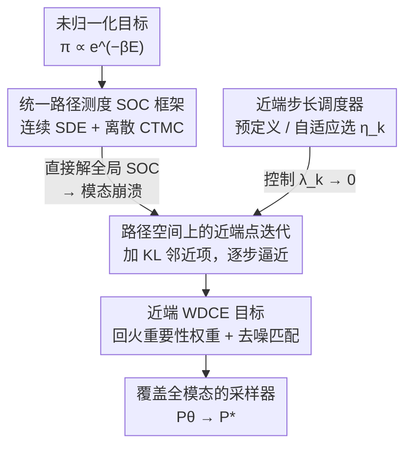

# Proximal Diffusion Neural Sampler

**会议**: ICLR 2026  
**OpenReview**: [https://openreview.net/forum?id=XTHQqS7ObC](https://openreview.net/forum?id=XTHQqS7ObC)  
**代码**: https://github.com/AlexandreGUO2001/PDNS  
**领域**: 扩散模型 / 神经采样器 / 统计物理  
**关键词**: 玻尔兹曼采样, 随机最优控制, 近端点方法, 模态崩溃, 路径测度

## 一句话总结
本文提出 PDNS（近端扩散神经采样器），把"从未归一化目标分布采样"建模成路径测度空间上的随机最优控制问题，再用**近端点方法**把一次性全局优化拆成一串带 KL 邻近约束的子问题，让采样器沿着 $\pi$ 与参考分布的几何插值路径逐步逼近目标，从而在强多模态（分子动力学、Ising/Potts 等统计物理）任务上缓解模态崩溃，多个连续与离散基准上达到 SOTA。

## 研究背景与动机
**领域现状**：从形如 $\pi(x)\propto e^{-\beta E(x)}$ 的未归一化玻尔兹曼分布中采样，是计算统计、贝叶斯推断、统计力学里的基础任务。经典 MCMC 在高维或强多模态时混合很慢，于是近年兴起"神经采样器"——用基于分数的扩散或归一化流，把一个简单的参考分布"运输"到目标 $\pi$。这类扩散采样器普遍被写成一个**随机最优控制（SOC）**问题：参数化一个受控扩散过程的控制项 $u^\theta_t$，让它的终端边缘分布等于 $\pi$。

**现有痛点**：SOC 类采样器虽然理论扎实，但在训练早期 $P_\theta$ 离目标 $P^*$ 很远时极易**模态崩溃**。原因是训练只能用当前模型 $P_\theta$ 自己 roll out 出来的轨迹来估计目标，分布失配大时只有极少数轨迹携带有意义的信号（高似然 / 高重要性权重），损失被这几条高权重路径主导，更新方向不稳；同时由于缺乏对整个状态空间的探索，模型只会把已经踩到的几个模态反复强化，对其余模态视而不见。论文用一个 $24\times24$ 低温 Ising 模型（$\beta=0.6$，目标是全正/全负两个铁磁态、被高能垒隔开）做实验：WDCE 采样器迅速塌进单一模态，并用自生成样本继续强化它。

**核心矛盾**：一次性求解全局 SOC 目标（"one-shot global minimization"）在强多模态、模态间有大势垒时，与"保持模态覆盖"之间存在根本冲突——全局损失天然奖励"把质量集中到已找到的模态"。

**核心 idea**：用一串**渐进、受约束**的局部优化步骤替代一次性全局最小化。具体做法是在路径测度空间上施加**近端点方法**：每步只在"离上一轮解不太远"的约束下改进控制，使终端边缘缓慢地、保覆盖地朝 $\pi$ 推进。

## 方法详解

### 整体框架
PDNS 要解决的是"如何训练一个扩散神经采样器，使它逼近 $\pi$ 又不丢模态"。整体思路分三层：先把连续（SDE）和离散（CTMC）采样器**统一**成路径测度上的同一个 SOC 问题；再不去直接解这个难的全局问题，而是用**近端点迭代**把它切成一串带 KL 邻近项的子问题，每个子问题的最优解恰好是参考测度 $P_{ref}$ 与最优测度 $P^*$ 的**几何插值**，于是采样器沿一条逐步精化的路径收敛；最后把每个近端子问题落地成一个可高效计算的**近端 WDCE 损失**，并用**步长调度器** $\{\eta_k\}$ 控制每步迈多大。

记参考路径测度 $P_{ref}$（满足无记忆条件 $P^{ref}_{0,T}=\mu\cdot\nu$）、终端边缘 $\nu$，目标 $\pi$，并令 $r:=-\beta E-\log\nu$。统一 SOC 问题的最优解为 $P^*\propto P_{ref}\,e^{r(X_T)}$，其终端分布正是 $\pi$。

### 关键设计

**1. 统一路径测度 SOC 框架：把连续与离散采样器收进同一个最优控制问题**

以往连续扩散采样器（PIS、DDS、AS 等）和离散掩码扩散采样器各自为政，难以共享理论与算法。本文用**路径测度**这一统一语言把两者写成同一个变分问题：在 $P_\theta$ 起点固定为 $\mu$ 的约束下，
$$P^* = \arg\min_{P_\theta}\Big[-\mathbb{E}_{P_\theta}\,r(X_T) + \mathrm{KL}(P_\theta\,\|\,P_{ref})\Big],\qquad P^*\propto P_{ref}\,e^{r(X_T)}.$$
连续情形里 $P_\theta$ 由受控 SDE $dX_t=(b_t+\sigma_t u^\theta_t)dt+\sigma_t dW_t$ 诱导，借 Girsanov 定理把上式化简为对控制项 $u^\theta$ 的 SOC 问题 $\min_\theta \mathbb{E}_{P_\theta}[\int_0^T \tfrac12\|u^\theta_t\|^2dt - r(X_T)]$；离散情形把状态空间扩成带掩码符号 $\mathsf{M}$ 的 $\{1,\dots,N,\mathsf{M}\}^d$，用连续时间马尔可夫链（CTMC）的生成元 $Q^\theta$ 参数化，得到结构完全对应的目标。统一框架的价值在于：后面的近端点迭代只需在"路径测度"这一层推导一次，就能同时适配连续与离散两套实现。

**2. 路径空间上的近端点迭代：用 KL 邻近项把全局优化拆成保覆盖的子问题序列**

这是 PDNS 的核心，直接针对"一次性全局优化 → 模态崩溃"这一痛点。不去直接解难的全局 SOC（对应步长无穷大），而是在每一步给目标加一个相对上一轮迭代 $P_{\theta_{k-1}}$ 的 KL 邻近项，步长 $\eta_k\in(0,\infty]$：
$$P_{\theta^*_k} = \arg\min_{P_\theta}\Big[-\mathbb{E}_{P_\theta}\,r(X_T) + \mathrm{KL}(P_\theta\,\|\,P_{ref}) + \tfrac{1}{\eta_k}\mathrm{KL}(P_\theta\,\|\,P_{\theta_{k-1}})\Big].$$
这个邻近项强迫每步解都待在上一轮解附近，使更新更稳、优化更易（正则项占主导）。论文证明（Prop. 3.1）子问题的最优解是上一轮解与 $P^*$ 的几何插值，且当 $P_{\theta_0}\leftarrow P_{ref}$ 时整条序列写成
$$P_k \propto (P_{ref})^{\lambda_k}(P^*)^{1-\lambda_k},\qquad \lambda_k:=\prod_{i=1}^{k}\frac{1}{\eta_i+1},$$
对应的终端分布 $P_k^T\propto \pi^{\,1-\lambda_k}\nu^{\,\lambda_k}$ 是 $\nu$ 与 $\pi$ 之间的几何插值。只要 $\lambda_k\to 0$，序列就收敛到 $P^*$。直观上，近端项**回火（temper）**了重要性权重——把非近端情形里 $\tfrac{dP^*}{dP_{\theta_{k-1}}}$ 这种容易爆炸、被单一模态主导的权重，软化成
$$\frac{dP_{\theta^*_k}}{dP_{\theta_{k-1}}}\propto\Big(\frac{dP^*}{dP_{\theta_{k-1}}}\Big)^{\frac{\eta_k}{\eta_k+1}},$$
指数 $\tfrac{\eta_k}{\eta_k+1}<1$ 削弱了高权重路径的统治力，从而保住模态覆盖。

**3. 近端 WDCE 目标：把抽象的近端子问题落地成可高效训练的去噪匹配损失**

近端子问题虽优雅，但直接按相对熵 / 交叉熵（CE）训练需要存整条轨迹、内存开销大。本文先把近端目标反转 KL 的方向得到**近端 CE**，它化简为"在上一轮 detached 测度 $\bar P_{\theta_{k-1}}$ 下、用回火权重加权的负对数似然"；再仿照 WDCE 把负对数似然替换成（去噪 / 桥）分数匹配，得到**近端 WDCE**。连续情形借 Diffusion Schrödinger Bridge Matching 写成
$$\mathrm{KL}(P_{k^*}\|P_\theta)=\mathbb{E}_{t\sim\mathrm{Unif}(0,T),\,X\sim \bar P_{\theta_{k-1}}}\Big[\tfrac{dP_{k^*}}{d\bar P_{\theta_{k-1}}}(X)\cdot\tfrac12\big\|u^\theta_t(X_t)-\sigma_t\nabla\log P^{ref}_{T|t}(X_T|X_t)\big\|^2\Big],$$
关键好处是**只需保留终端样本 $X_T$ 与一个在线累积的标量权重 $w(X)$**（按 (15) 由 Girsanov 闭式计算），把 $(X_T,w)$ 存进 buffer 即可训练，无需存全轨迹。离散情形同样用掩码去噪交叉熵 + (16) 的 CTMC Girsanov 权重，复用同一套回火权重 (15)。这样近端框架在连续 / 离散两边都拿到了一个内存友好、收敛快的具体损失。

**4. 近端步长调度器：在收敛速度与模态覆盖之间逐步调权**

步长 $\eta_k$ 是 PDNS 的关键超参，决定 KL 正则的相对强度：$\eta_k$ 小 → 正则更强、更新更保守、模态覆盖更好但收敛慢；$\eta_k$ 大 → 正则弱、收敛快但更易模态崩溃。论文给两种调度：一是**预定义**调度，直接对 $\eta_k$ 或 $\lambda_k$ 排一个让 $\lambda_k\to0$ 的序列，并借助每个子问题最优解的解析形式（Prop. 3.1）来监控样本对局部目标的拟合；二是**自适应**调度，根据模型当前状态自动选 $\eta_k$，核心是保证下一目标 $P_{k^*}$ 离当前 $P_{\theta_{k-1}}$ 不太远（如约束估计的 $\widehat{\mathrm{KL}}(P_{\theta_{k-1}}\|P_{k^*})\le\epsilon$），从而既不让步子大到失稳，也不让步子小到原地踏步。

### 损失函数 / 训练策略
整体训练按 Alg. 1 的双层循环进行：外层 $k=1,2,\dots$ 每轮按 (8)/(10) 设定当前子问题的最优目标 $P_{k^*}\in\{P_{\theta^*_k},P_k\}$；内层用从 $P_{\theta_{k-1}}$ 采的样本计算近端 WDCE 损失 $F(P_\theta;P_{k^*})$ 并更新 $\theta$，迭代若干步后令 $P_{\theta_k}\leftarrow P_\theta$ 进入下一轮。本文主推**近端 WDCE 变体**，因为它兼顾"不存整轨迹"与"（离散）分数匹配的高效"。

## 实验关键数据

### 主实验
连续合成能量函数（Sinkhorn ↓ / MMD ↓）与粒子势能（$W_2$ ↓ / 能量 $W_2$ ↓）上，PDNS 在 7 个基准中 5 个取得最佳，仅 Funnel、DW-4 略逊于最新基线但相当。

| 任务 | 指标 | PDNS | 最强基线 | 说明 |
|------|------|------|----------|------|
| GMM40 (d=50) | Sinkhorn ↓ | **327.83** | 496.48 (NAAS) | 50 维 40 组分高斯混合 |
| MoS (d=50) | Sinkhorn ↓ | **353.05** | 394.55 (NAAS) | 重尾 Student-t 混合 |
| MW54 (d=5) | Sinkhorn ↓ | **0.08** | 0.10 (NAAS) | 多井势 |
| LJ-13 (d=39) | 能量 $W_2$ ↓ | **1.01** | 1.28 (ASBS) | Lennard-Jones 13 粒子 |
| LJ-55 (d=165) | 能量 $W_2$ ↓ | **21.97** | 27.69 (ASBS) | 高维粗糙能量面 |

离散统计物理（Ising / Potts，磁化误差 Mag.↓、2 点相关 Corr.↓、ESS↑）上，PDNS 大幅领先 LEAPS；原始 WDCE 因模态崩溃无法学到正确分布故不参评。

| 分布 | 温度 | 指标 | PDNS | LEAPS | MH |
|------|------|------|------|-------|-----|
| Ising L=24 | $\beta_{low}=0.6$ | Mag. ↓ | **9.0e−3** | 3.0e−2 | 1.6e−3 |
| Potts L=16,q=4 | $\beta_{low}=1.3$ | Mag. ↓ | **8.4e−4** | 3.6e−1 | 7.6e−1 |
| Potts L=16,q=4 | $\beta_{crit}=1.0986$ | ESS ↑ | **0.948** | 0.112 | / |

此外在 Alanine Dipeptide 分子（60 维内坐标）上，5 个扭转角的 1D 边缘 KL 与当前 SOTA ASBS 持平（如 $\gamma_1$：PDNS 0.03 vs ASBS 0.03），能量直方图与扭转图也复现了主要构象结构；组合优化（Max-Cut，BA/ER 随机图）上 PDNS 达到与 Gurobi 真值相当的解。

### 消融实验

| 配置 | 现象 | 说明 |
|------|------|------|
| Full PDNS | 保持模态覆盖 | 近端项回火权重，逐步探索 |
| w/o 近端项 | 模态崩溃 | 退化为原 WDCE，迅速塌进单模态（Fig. 1） |
| $\eta_k$ 偏大 | 收敛快但易崩 | 正则弱、分布间隙大 |
| $\eta_k$ 偏小 | 稳但慢 | 正则强、保守更新 |

### 关键发现
- 去掉近端项是导致模态崩溃的直接原因——这与第 3.1 节用低温 Ising 复现的失败现象一致，验证了"近端约束 → 保覆盖"的因果。
- PDNS 在**更难**的目标上优势最明显：重尾的 MoS、能量面陡峭崎岖的 LJ-13/LJ-55，正是模态崩溃高发区，说明回火权重 + 局部移动的设计对"硬采样"特别有效。
- 步长 $\eta_k$ 体现了收敛速度与模态覆盖的清晰 trade-off，自适应调度通过约束相邻子问题的 KL 距离来稳健地平衡两者。

## 亮点与洞察
- **把"采样"重写成路径测度上的近端点优化**：近端点方法是凸优化里的经典工具，本文把它搬到无穷维路径测度空间，并证明每步解恰是 $P_{ref}$ 与 $P^*$ 的几何插值——这个解析结构既给了收敛保证，又能用来监控训练，相当漂亮。
- **"回火重要性权重"是缓解模态崩溃的通用钥匙**：把 $\tfrac{dP^*}{dP_{\theta_{k-1}}}$ 软化成 $(\cdot)^{\eta_k/(\eta_k+1)}$ 这一指数压缩，思路可迁移到任何用自生成样本 + 重要性加权训练、容易被高权重样本主导的场景（如某些 RL / GFlowNet 训练）。
- **连续与离散一套理论通吃**：用路径测度统一 SDE 与 CTMC，避免了为离散域单独造轮子，这种"先抽象统一、再分别实例化"的范式很值得借鉴。

## 局限与展望
- 论文主推近端 WDCE 一种实例化，其余 PDNS 实例（如近端 CE、近端 RE）只在理论上提及，未系统比较，实际最优选择仍待探索。
- 引入了额外的步长调度超参 $\eta_k/\lambda_k$ 及其调度策略，虽给了自适应方案，但调度对不同任务的鲁棒性、以及自适应阈值 $\epsilon$ 的选取仍需经验。
- 收敛性证明依赖"每个子问题都解到最优"的理想假设，实际内层只迭代有限步，理论与实现之间存在 gap。
- 多步近端迭代相比一次性优化引入了串行的外层循环，计算 / 时间成本可能更高，论文未给出明确的开销对比。

## 相关工作与启发
- **vs 原始 WDCE / CE 采样器（Phillips 2024, Zhu 2025）**：它们一次性最小化全局 reverse-KL，强多模态低温下迅速模态崩溃；PDNS 把同一目标拆成带 KL 邻近项的近端序列，回火权重保住覆盖，离散统计物理任务上直接把"学不出来"变成 SOTA。
- **vs DDS / PIS / AS 等 SOC 扩散采样器**：它们都在解 (3) 或其等价问题，对应近端步长 $\eta_k=\infty$；PDNS 把它们纳为特例，并通过有限步长换取稳定性与模态覆盖。
- **vs ASBS（Liu 2025）**：当前粒子系统 / 分子任务的强基线，PDNS 在 LJ-13/LJ-55 的能量 $W_2$ 上反超、在 Alanine Dipeptide 上持平，但思路不同——ASBS 走桥匹配，PDNS 的增益主要来自近端正则而非更强的网络。
- **vs LEAPS / MH（离散基线）**：MH 在简单 Ising 上尚可但在多态 Potts 上显著退化，LEAPS 整体精度低；PDNS 在两者上都保持高 ESS 与低误差。

## 评分
- 新颖性: ⭐⭐⭐⭐⭐ 把近端点方法系统地搬到路径测度采样、并给出几何插值收敛性，角度新且理论扎实
- 实验充分度: ⭐⭐⭐⭐ 覆盖连续 / 离散、合成 / 分子 / 物理 / 组合优化多类任务，但缺近端 WDCE 与其他实例的横向比较和开销分析
- 写作质量: ⭐⭐⭐⭐ 统一框架 → 近端迭代 → 实用损失的推导链清晰，公式较密集
- 价值: ⭐⭐⭐⭐⭐ 模态崩溃是神经采样器的核心痛点，回火权重 + 近端迭代提供了通用且可迁移的解法

<!-- RELATED:START -->

## 相关论文

- [\[ICLR 2026\] Incomplete Data, Complete Dynamics: A Diffusion Approach](incomplete_data_complete_dynamics_a_diffusion_approach.md)
- [\[ICML 2026\] Generative Neural Operators Through Diffusion Last Layer](../../ICML2026/physics/generative_neural_operators_through_diffusion_last_layer.md)
- [\[CVPR 2025\] DiffFNO: Diffusion Fourier Neural Operator](../../CVPR2025/physics/difffno_diffusion_fourier_neural_operator.md)
- [\[ICLR 2026\] OXtal: An All-Atom Diffusion Model for Organic Crystal Structure Prediction](oxtal_an_all-atom_diffusion_model_for_organic_crystal_structure_prediction.md)
- [\[CVPR 2026\] Spatial-Spectral Residuals Informed Diffusion Neural Operator for Pan-sharpening](../../CVPR2026/physics/spatial-spectral_residuals_informed_diffusion_neural_operator_for_pan-sharpening.md)

<!-- RELATED:END -->
