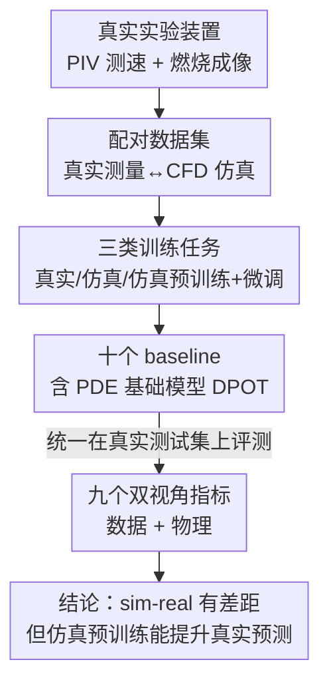

# RealPDEBench: A Benchmark for Complex Physical Systems with Real-World Data

**会议**: ICLR 2026  
**OpenReview**: [https://openreview.net/forum?id=y3oHMcoItR](https://openreview.net/forum?id=y3oHMcoItR)  
**代码**: https://realpdebench.github.io/  
**领域**: 科学机器学习 / PDE 代理模型 / Benchmark  
**关键词**: 真实世界数据, sim-to-real, PDE 求解, 流体动力学, 燃烧

## 一句话总结
RealPDEBench 是首个把**真实实验测量数据与配对数值仿真数据**一起打包的科学机器学习基准，覆盖 5 个复杂物理系统、3 类任务、9 个指标和 10 个 baseline，系统揭示了仿真数据与真实数据之间的巨大差距，并证明"先用仿真预训练、再用真实数据微调"能稳定提升精度与收敛速度。

## 研究背景与动机
**领域现状**：用神经网络预测复杂物理系统（流体、燃烧、等离子体等）的演化，是科学机器学习（Scientific ML）近年最火的方向之一。主流做法是用神经算子（FNO、DeepONet）、U-Net 类架构，甚至大规模预训练的 PDE 基础模型（如 DPOT），从数据或控制方程里学习系统的时空动力学，相比传统数值求解器（FVM、IBM）效率高出很多。

**现有痛点**：几乎所有这些模型都**只在数值仿真数据上训练和验证**。但仿真数据和真实测量数据之间存在巨大鸿沟——仿真有数值误差（来自 LES 建模、二阶离散化等简化），真实数据有测量噪声、来流不均匀、相机噪点，而且真实测量能观测到的模态（physical modalities）通常比仿真少。结果是：我们根本无法知道这些 SOTA 模型在真实世界里相对传统数值方法究竟表现如何。

**核心矛盾**：真实数据"准确但贵、噪、可观测变量少"，仿真数据"便宜、模态全、参数密集但有系统性数值误差"。两者各有长短，而获取真实数据成本极高（要搭实验台、要丰富的测量经验），导致面向 ML 的真实物理数据集长期稀缺，sim-to-real transfer、从噪声数据中学习等关键任务都被卡住。

**本文目标**：构建一个**配对**了真实测量与数值仿真的基准，让研究者能（1）量化两类数据的差距，（2）公平评测各类 ML 模型在真实数据上的能力，（3）研究如何把仿真的优势迁移到真实预测上。

**切入角度**：作者亲自搭建循环水槽（PIV 测速）和旋流燃烧器（OH* 化学发光成像）等实验装置，对**同一组物理参数**同时采集真实数据和对应的 CFD 仿真数据，从而第一次让"真实 vs 仿真"具备逐参数可比性。

**核心 idea**：用一套"配对真实+仿真数据 + 三类训练任务 + 数据/物理双视角指标"的基准，把 sim-to-real gap 变成可测量、可优化的研究对象。

## 方法详解

### 整体框架
RealPDEBench 不是一个模型，而是一套基准，由四大组件构成：**数据（5 个配对数据集）→ 任务（3 类训练范式）→ 指标（9 个数据/物理双视角度量）→ baseline（10 个代表性模型）**。核心约束是"评测一律在真实数据上做"，因为科学 ML 的终极目标是建模真实系统；训练侧则允许多种范式，从而把"仿真到底有没有用"做成可控对照实验。整条管线的逻辑是：先用配对数据量化仿真与真实的差距，再用三类任务对照检验"纯真实训练 / 纯仿真训练 / 仿真预训练+真实微调"谁更强，最后用双视角指标从局部像素误差和全局物理特征两个维度刻画每个模型的强弱。

### 关键设计

**1. 配对真实-仿真数据集：让"两类数据"逐参数可比**

基准最根本的贡献是亲手采集了 5 个复杂物理系统的真实数据，并为每个系统在**完全相同的物理参数**下生成配对仿真数据，共 736 条轨迹、每条超过 2000 帧。5 个场景按物理挑战难度递进选取：Cylinder（圆柱绕流，经典卡门涡街、层流到湍流转捩）、Controlled Cylinder（加周期正弦主动控制，考验学习"受控动力学"）、FSI（流固耦合，圆柱因流体力振动，含锁频与驰振失稳）、Foil（从 3D 仿真/实验提取的翼型截面，引入三维效应和小尺度涡）、Combustion（NH₃/CH₄/空气旋流火焰，多物理多尺度耦合，仿真极难，最凸显真实数据价值）。真实流体数据用循环水槽 + 荧光粒子 + 连续激光层 + 高速相机经 PIVLab 处理得到速度场；燃烧数据用 OH* 化学发光相机测光强。仿真侧 2D 用 Lilypad、3D 用 GPU 上的 Waterlily（FVM + IBM），燃烧用三维隐式非定常 LES + EDC 模型。所有数据统一存为 HDF5，每条轨迹是形如 $(T, X, Y)$ 的 $C$ 通道 NumPy 数组并附带系统参数（Re、振荡频率、当量比等）。这种"同参数配对"是后续一切对照实验的基础——没有它，真实与仿真就只能粗略比平均统计量，无法逐条对齐。

**2. 三类训练任务：把 sim-to-real 做成可控对照实验**

为了回答"仿真数据到底有没有价值"，作者把预测问题（学映射 $F: \mathcal{A}\times\Gamma\to\mathcal{U}$，输入初始状态 $a$ 和系统参数 $\gamma$、输出后续时序演化 $u$）统一拆成三类训练范式：**(i) 真实训练**——只在 $n$ 个真实样本上训；**(ii) 仿真训练**——在全部 $N$ 个仿真样本上训；**(iii) 仿真预训练 + 真实微调**——先在 $N$ 个仿真样本上预训练，再用 $n$ 个真实样本微调。关键设计是**三类任务共享同一套固定的真实验证/测试集**（那 $N-n$ 个真实样本，按 $(N-n)/2$ 划验证和测试），保证评测协议完全一致、结果可直接横比。这套对照直接对应现实场景：真实数据稀缺、仿真数据廉价丰富，第三类范式正是工程里最常用的做法。为了让仿真训练更贴近真实分布，作者还给仿真数据**加噪声**逼近真实噪声分布、并**随机 mask 掉真实侧观测不到的模态**，让模型学会利用仿真独有的额外动态信息。

**3. 数据视角 + 物理视角的九指标体系：单看 RMSE 会骗人**

作者指出仅用像素级误差评测物理系统会漏掉全局物理特征，于是设计了两类共 9 个指标。**数据视角**：RMSE、MAE、相对 L2 误差、决定系数 $R^2 = 1 - \frac{\sum_k (y_k-\hat y_k)^2}{\sum_k (y_k-\bar y)^2}$，以及专门衡量预训练效率的 **Update Ratio**——设 $N_1, N_2$ 分别为"真实微调"和"从头真实训练"达到同一最优 RMSE 所需的更新步数，比值 $N_1/N_2 < 1$ 就说明预训练加速了收敛。**物理视角**：fRMSE（对预测和真值做 3D FFT 后按频段分低/中/高比误差，看模型在不同频率上的还原能力）、FE（频率误差，先把场对空间求和得到时序信号再做 1D FFT 比 MAE，衡量周期性捕捉）、KE（动能误差 $\mathrm{KE}=|e-\hat e|$，$e=\frac{(u')^2+(v')^2}{2}$，针对速度场脉动）、MVPE（平均速度剖面误差，用于自回归长期评测，刻画尾流区时均速度的衰减）。这套"数据 + 物理"双视角是基准最有价值的方法论：它让"局部准但物理不真"的模型无所遁形。

### 损失函数 / 训练策略
基准本身不引入新损失，沿用各 baseline 自带的训练目标（多数是 MSE 类数据驱动损失）。训练/验证/测试在**参数层级**划分，避免同一参数的轨迹泄漏。评测除常规单步预测外，提供**自回归评测**选项：给定 $T$ 步输入输出，$N$ 轮自回归把每次预测的 $T$ 步反馈为下一轮输入，得到 $NT$ 步的长期预测，在 1/2/3/5/10 轮上考察误差累积。

## 实验关键数据

### 主实验
在真实测试集上对比 10 个 baseline 在三类任务下的表现（RMSE / Rel L2 / fRMSE / Update Ratio），核心发现集中在"仿真 vs 真实训练"和"预训练增益"两点。下表给出各数据集的 ML 平均 Rel L2（越低越好）：

| 数据集 | 仿真训练 Rel L2 | 真实训练 Rel L2 | 真实微调 Rel L2 | 平均 Update Ratio |
|--------|------|------|------|------|
| Cylinder | 0.2356 | 0.1106 | 0.0997 | 0.567 |
| Controlled Cylinder | 0.1947 | 0.0910 | 0.0875 | 0.650 |
| FSI | 0.2434 | 0.1036 | 0.0999 | 0.496 |
| Foil | 0.0505 | 0.0261 | 0.0213 | 0.557 |
| Combustion | 0.8408 | 0.6169 | 0.6063 | 0.756 |

可以看到：(1) **仿真训练的误差全面高于真实训练**，跨模型在 Rel L2 上真实训练有 9.39%~78.91% 的提升，说明纯仿真模型即便参数一致也难直接泛化到真实；(2) **真实微调列普遍优于真实训练列**，且 Update Ratio 大多 <1，证明仿真预训练既提精度又加快收敛；(3) Combustion 误差量级最大，印证多物理多尺度燃烧系统的建模难度。

### 消融 / 分析实验

| 配置 / 分析 | 关键发现 | 说明 |
|------|---------|------|
| 仿真训练 vs 真实训练 | FE 显著更高 | 仿真无法很好还原真实系统的周期性（Fig 3a） |
| 真实微调收敛曲线 | RMSE 下降更快 | Combustion 上微调远快于从头真实训练（Fig 3b） |
| RMSE–FE 权衡 | DPOT-L-FT 最接近原点 | 大规模 PDE 预训练 + 大参数量综合最优（Fig 4） |
| 卷积类（U-Net/CNO） | RMSE 更低但物理指标弱 | 任务像图像处理，卷积擅长局部特征 |
| MWT | 周期性学习更好 | 多小波变换天然利于捕捉周期 |
| CNO 自回归 | 误差增长更快 | 单步好但长期误差累积严重（Fig 3c） |
| CNO 高频 fRMSE | 相对优势随频率升高 | 与其消除混叠误差的设计原理相关（Fig 6） |

### 关键发现
- **仿真预训练几乎总有正收益**：既提升真实数据上的精度，又因为更大数据量和 mask 训练利用了仿真独有模态，使收敛更快（Update Ratio < 1）。
- **没有全能模型**：数据视角强的模型（卷积类局部 RMSE 低）未必物理视角强（频率/周期捕捉弱），必须按任务目标选架构与训练策略。
- **大基础模型 DPOT-L-FT 综合最优**，但单步与长期、局部与全局之间普遍存在 trade-off，CNO 单步好却长期发散。

## 亮点与洞察
- **"同参数配对真实+仿真"是这篇最硬核的贡献**：自己搭水槽、燃烧器去测 736 条真实轨迹，把 sim-to-real 从口号变成逐参数可对齐的定量研究，复现成本极高但价值极大。
- **数据视角 / 物理视角双指标体系可直接迁移**：任何物理场预测任务都可以借用 fRMSE 分频段、FE、MVPE 这套思路，避免"RMSE 很低但涡街周期全错"的假象。
- **Update Ratio 这个指标设计很巧**：把"预训练值不值"量化成"达到同一精度所需更新步数之比"，比单纯比最终误差更能说明预训练的工程收益。
- **燃烧数据集尤其有价值**：多物理多尺度让 CFD 仿真本身就不准，正好凸显真实数据不可替代。

## 局限与展望
- 作者将局限放在附录 F，正文未充分展开；从内容看，5 个场景集中在流体与燃烧，尚未覆盖等离子体、固体力学等其他复杂物理系统。
- 真实数据受测量技术限制，可观测模态有限（如只测速度场、光强），与仿真的全模态仍不对称，mask 训练只是缓解而非根治。
- 数据规模虽大（736 条轨迹）但参数工况覆盖仍有限，且 2D 截面为主，真三维真实测量稀缺。
- 改进方向：基准已铺好评测协议，后续可在其上发展专门的 sim-to-real 域适配、噪声鲁棒学习、以及融合两类数据优势的新训练范式。

## 相关工作与启发
- **vs PDEBench / The Well**: 它们提供海量、高分辨率的**纯仿真**数据，覆盖多种 PDE；本文最大区别是**首次引入配对的真实测量数据**并统一在真实数据上评测，把焦点从"仿真上谁强"转到"真实世界里谁可用"。
- **vs 传统流体/燃烧实验数据集**（Casey & Wintergerste 等）: 那些有真实观测但**不是为 ML 设计**，数据量少、工况稀疏；本文按 ML 需求规模化采集、配对、标准化为 HDF5，并配套 baseline 框架。
- **vs 并发工作 REALM**: REALM 聚焦多物理反应流的真实工况神经代理评测；本文覆盖更广（5 个物理系统、700+ 配对实验）且强调真实-仿真配对与 sim-to-real 迁移。

## 评分
- 新颖性: ⭐⭐⭐⭐⭐ 首个配对真实+仿真的科学 ML 基准，填补了领域长期空白
- 实验充分度: ⭐⭐⭐⭐⭐ 5 数据集 × 3 任务 × 9 指标 × 10 baseline，分析维度全面
- 写作质量: ⭐⭐⭐⭐ 结构清晰、动机有力，部分指标定义偏附录
- 价值: ⭐⭐⭐⭐⭐ 把 sim-to-real gap 变成可测量对象，对科学 ML 落地有长期价值

<!-- RELATED:START -->

## 相关论文

- [\[ICLR 2026\] ComPhy: Composing Physical Models with end-to-end Alignment](comphy_composing_physical_models_with_end-to-end_alignment.md)
- [\[ICLR 2026\] Spectral-Guided Physical Dynamics Distillation](spectral-guided_physical_dynamics_distillation.md)
- [\[ICML 2025\] Erwin: A Tree-based Hierarchical Transformer for Large-scale Physical Systems](../../ICML2025/physics/erwin_a_tree-based_hierarchical_transformer_for_large-scale_physical_systems.md)
- [\[ICLR 2026\] DGNet: Discrete Green Networks for Data-Efficient Learning of Spatiotemporal PDEs](dgnet_discrete_green_networks_for_data-efficient_learning_of_spatiotemporal_pdes.md)
- [\[ICLR 2026\] Self-Supervised Evolution Operator Learning for High-Dimensional Dynamical Systems](self-supervised_evolution_operator_learning_for_high-dimensional_dynamical_syste.md)

<!-- RELATED:END -->
