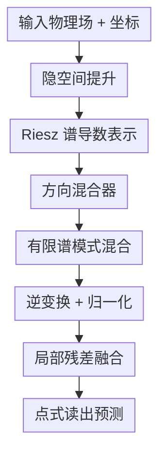

# Riesz Neural Operator for Solving Partial Differential Equations

**会议**: ICLR 2026  
**OpenReview**: [https://openreview.net/forum?id=Vjw7q1quNt](https://openreview.net/forum?id=Vjw7q1quNt)  
**代码**: 未公开  
**领域**: 神经算子 / PDE 求解 / 科学机器学习  
**关键词**: Riesz 变换, 神经算子, PDE 求解, 局部导数, 频谱建模  

## 一句话总结
RNO 把 Riesz 变换引入神经算子，用频域中的方向导数通道补足 FNO/LNO 对局部非平稳细节的建模不足，在多类 PDE、Navier-Stokes 和 ERA5 天气数据上同时提升精度、鲁棒性与效率。

## 研究背景与动机
**领域现状**：神经算子的目标是直接学习从输入函数到解函数的映射，常见做法是用 DeepONet 的分支-主干结构、FNO 的 Fourier 频域卷积，或 LNO 的 Laplace 域表示来近似 PDE 解算子。它们的共同优势是能把离散网格上的训练推广到函数空间层面的预测，因此在流体、材料、天气等科学计算任务里很适合作为传统数值求解器的快速替代。

**现有痛点**：这些算子往往更擅长抓全局、平滑、低频的结构，而 PDE 里的很多难点恰好出现在局部变化处。比如高 Reynolds 数 Navier-Stokes 会产生涡旋、剪切层和细丝状结构，反应扩散系统会有局部模式突变，天气场里也有局部环流和高频异常。只用全局 Fourier/Laplace 模式时，这些局部非平稳信息容易被压缩成低频近似；即使额外加 CNN 或局部模块，也常常只是把局部特征作为外接补丁，破坏了神经算子原本的连续算子视角和分辨率泛化优势。

**核心矛盾**：PDE 本身是通过局部导数来约束物理场的，例如 $F(x,u,\partial_{x_1}u,\ldots,\partial_{x_n}u)=0$。也就是说，控制系统演化的关键信息并不只是函数值本身，还包括不同方向上的变化率、相位方向和高频扰动。经典神经算子用全局基函数建模积分算子很高效，但如果没有显式的方向导数表示，就很难同时做到全局稳定、局部敏感和物理可解释。

**本文目标**：作者希望设计一种仍然保留神经算子连续积分结构的方法，但让模型能直接看到局部方向导数。具体来说，它需要解决三个子问题：第一，如何在频域里稳定地表示空间导数；第二，如何把全局频谱模式和方向导数通道融合，而不是简单堆模块；第三，如何证明这种设计在复杂非线性 PDE、真实天气场和噪声输入下确实带来收益。

**切入角度**：论文从 Taylor 展开出发看局部变化。若信号在位置 $x$ 附近有小位移 $\gamma(t)$，则 $I(x,t)\approx f(x)+\gamma(t)f'(x)$，其中一阶导数项正是局部动态和细节变化的来源。Riesz 变换又可以被看作多维 Hilbert 变换，在频域中用归一化的方向乘子提取导数和相位方向，因此它天然适合把 PDE 的局部导数结构嵌进神经算子。

**核心 idea**：用 Riesz 变换在频谱空间构造方向导数通道，再用轻量方向混合器把这些局部导数与全局神经算子模式相加融合，从而让算子同时保留全局积分建模能力和局部各向异性细节。

## 方法详解
### 整体框架
Riesz Neural Operator (RNO) 仍然沿用神经算子的基本骨架：输入物理场先被提升到高维隐空间，然后经过一个谱域算子层，最后用点式读出层还原为目标物理场。和 FNO 只在 Fourier 空间学习全局模式不同，RNO 在谱域里额外构造每个空间方向的 Riesz 导数分量，用方向混合器把全局谱表示、局部方向导数和线性残差合成，再经逆变换回到坐标空间。

从算子组合看，论文把整体映射写成 $F_\theta=F_{\theta,\mathrm{RieszToCoord}}\circ (\prod_i F_{\theta_i^R})\circ F_{\theta,\mathrm{CoordToRiesz}}$。其中坐标到 Riesz 空间的映射负责提取谱域方向信息，中间的 Riesz 层学习方向相关的非线性映射，最后再回到原始物理场。实现上，每层先对隐特征做 FFT，乘上 Riesz 方向乘子 $R_i(\xi)$，再用 learnable scale 和复权重做模式混合。

这个框架图里的前后端提升、读出和残差属于神经算子脚手架；真正的贡献集中在 Riesz 谱导数表示、方向混合器，以及它们如何与有限谱模式共同构成一个仍然连续、轻量的积分算子。

### 关键设计
**1. Riesz 谱导数表示：把 PDE 的局部导数写成频域里的方向通道**

普通 Fourier 变换能把全局频率模式分离出来，但它本身不会告诉模型某个局部结构沿哪个方向变化。RNO 的第一步是把 PDE 中的导数约束转成谱域里的方向特征：对 $d$ 维空间信号，Riesz 变换的第 $i$ 个方向使用乘子 $-j\xi_i/\|\xi\|$。这相当于一个尺度归一化的一阶方向导数，既保留频域计算的高效性，又显式暴露局部方向变化。

论文把这种关系和 Taylor 展开联系起来：平滑背景主要由低阶、低频成分表达，而位移、突变、涡旋边界等细节进入 $f'(x)$ 或更高阶导数项。Riesz 变换不会像普通高通滤波那样任意放大高频幅值，因为各方向乘子满足能量守恒性质，直观上是把同一份谱能量按方向重分配。这样模型获得的是“哪里沿哪个方向在变”的信息，而不是噪声式地把所有高频都抬高。

**2. 方向混合器：用可学习权重融合全局模式和局部各向异性**

只把 Riesz 特征算出来还不够，因为 PDE 的解算子既依赖全局耦合，也依赖局部导数。RNO 在 Riesz 空间里构造一个轻量方向混合器，形式上可以理解为 $\mathrm{Mixer}=R_{\mathrm{global}}+w_iR_i+w_jR_j$，多维时自然扩展到 $d$ 个方向。这里的 $R_{\mathrm{global}}$ 负责稳定的全局谱统计，$R_i$ 负责第 $i$ 个方向的局部变化，$w_i$ 是可学习的方向权重。

这个设计的关键不在于“多加几个分支”，而在于它让不同方向的局部导数以近似正交的方式进入同一个算子层。训练时，损失对方向权重的梯度相当于把预测残差投影到对应的 Riesz 通道上；如果某个方向的涡旋、边界或传播结构对误差贡献更大，对应权重就会被放大。论文还用理论上界约束方向缩放因子，避免过强的局部扰动引入伪影，这解释了为什么它在噪声输入下没有出现明显高频失控。

**3. 连续算子结构：补局部细节但不退化成 FNO + CNN**

很多“全局 + 局部”的神经算子会在 FNO 后面接 CNN 或局部卷积分支，这确实能补一些空间细节，但卷积核通常定义在像素网格上，跨分辨率时有效连续核会变化，容易削弱神经算子的分辨率不变性。RNO 的局部性来自频域中的 Riesz 乘子，而不是固定像素尺度卷积，因此它仍可写成一个 Green 函数风格的积分算子。

论文在附录里说明，若原神经算子对应一个学习核 $\kappa_\theta(x,y)$，加入 Riesz 项后仍能整理成新的积分核 $\tilde G_\theta(x,z)$。频域里看，它只是把原乘子 $M_\theta(\xi)$ 改成 $M_\theta(\xi)(1+\sum_i w_im_i(\xi))$。这点很重要：RNO 不是在算子外面贴一个局部网络，而是在同一个谱-积分框架内重新加权方向导数，因此同时保留物理解释、网格无关性和较小参数量。

**4. 正交方向选择：按数据维度而不是任意堆方向**

RNO 的方向数不是越多越好。论文默认把方向数设为数据维度：二维数据用两个正交方向，三维数据用三个正交方向。原因是 Riesz 分量在各向同性内容上近似正交，按自然坐标轴拆分可以最大化非冗余信息；方向太少会漏掉局部变化，方向太多则会引入非正交冗余，增加混合难度却未必增加有效表达。

这个设计在实验中被单独验证。作者把方向数从 1 扫到 5，在 Beam、Reaction-Diffusion 和 Brusselator 上比较，发现二维任务中 2 个方向最好，4 个方向作为维度倍数时通常还能保持竞争力，而 3 或 5 个非正交方向没有额外收益。这个现象支持论文的主张：RNO 的收益来自物理上有意义的方向导数分解，而不是简单扩大模型容量。

### 一个完整示例
以二维 Navier-Stokes 预测为例，输入是一段速度场或涡量场快照。普通 FNO 会把这个场变到 Fourier 空间，用有限个低频模式学习全局演化，再变回空间域；当 Reynolds 数升高到 $Re=5000$ 时，很多细长涡丝和剪切层落在高波数、强方向性的局部结构里，低频主导的表示就会变得模糊或出现 ringing。

RNO 处理同一输入时，会先把隐特征变到频域，然后为 $x$ 和 $y$ 两个方向分别计算 Riesz 通道。若某个局部涡旋边界主要沿 $x$ 方向变化，$R_x$ 通道会捕捉到强响应；若某段剪切层沿斜向展开，两个正交通道会以不同权重共同表示该方向。方向混合器再把这些响应和全局谱模式合成，输出到有限谱模式混合层。

最终，模型预测的不只是下一步的平滑速度场，还能更好恢复高频涡旋结构。论文在导数保真分析中进一步比较了 vorticity $\omega=\partial_xu_y-\partial_yu_x$ 和 divergence $\delta=\partial_xu_x+\partial_yu_y$：RNO 的涡量细丝更接近真值，同时散度残差更接近零，这说明方向导数通道确实帮助它学到更物理的局部结构。

### 损失函数 / 训练策略
论文没有引入复杂的新损失，主要用标准监督学习训练神经算子。一般 PDE 与 ERA5 benchmark 使用 relative $\ell_2$ error 作为评估指标，Navier-Stokes 使用 MSE；训练优化器统一为 Adam。为了公平比较，作者在相同数据集上重跑基线，并对经典神经算子类方法对齐 modes、width、训练轮数等配置。

RNO 的实现包含一个谱层，先用点式映射把输入和坐标提升到宽度为 $C$ 的隐空间，再做 $d$ 维 FFT。谱层中使用 $R_i(\xi)=i\xi_i/\|\xi\|^2$ 形式的 Riesz multiplier，零频处置零；随后用 $\alpha_0,\alpha_1,\ldots,\alpha_d$ 混合 identity 与方向通道，只保留设定的低频 modes 做复权重乘法，再逆变换、归一化并加上 $1\times\cdots\times1$ 的局部残差。读出层是 pointwise MLP，论文实现中使用 $\sin$ 作为默认激活，但也测试了 GELU、ReLU、Leaky ReLU、Sigmoid、Tanh 和无激活。

不同 benchmark 的超参差别较小：Duffing 和 Beam 训练 500 epochs、学习率 0.002；Diffusion 训练 500 epochs、学习率 0.002；Reaction-Diffusion 训练 300 epochs、学习率 0.002；Brusselator 训练 300 epochs、学习率 0.005。实验重复三次，在单张 RTX 3090 上运行，ERA5 使用两张 RTX 3090。

## 实验关键数据

### 主实验
论文覆盖三组主实验：五个标准 PDE benchmark、不同 Reynolds 数的二维 Navier-Stokes，以及真实 ERA5 天气再分析数据。指标越低越好。

| 任务 | 指标 | RNO | 之前最佳 / 强基线 | 提升或现象 |
|------|------|-----|------------------|------------|
| Duffing | relative $\ell_2$ | 0.1663 | LSM 0.1699 | 相对第二名提升 2.1% |
| Beam | relative $\ell_2$ | 0.0219 | LNO 0.0452 | 相对第二名提升 51.6% |
| Diffusion | relative $\ell_2$ | 0.0079 | LNO 0.0081 | 小幅优于 LNO |
| Reaction-Diffusion | relative $\ell_2$ | 0.0899 | ONO 0.0989 | 相对第二名提升 10.3% |
| Brusselator | relative $\ell_2$ | 0.1317 | ONO 0.1545 | 相对第二名提升 14.7% |

| 数据集 | 指标 | RNO | 对比方法 | 关键结论 |
|--------|------|-----|----------|----------|
| Navier-Stokes $Re=40$ | MSE | 0.0049 | LNO 0.0060 / FNO 0.0078 | 低复杂度流场也稳定领先 |
| Navier-Stokes $Re=500$ | MSE | 0.4861 | WNO 0.9388 / LNO 1.2117 | 非线性增强后优势扩大 |
| Navier-Stokes $Re=5000$ | MSE | 0.9121 | LNO 2.3139 / WNO 2.5914 | 高湍流下显著保持细节 |
| ERA5 | relative $\ell_2$ | 0.0022 | LNO 0.0062 / WNO 0.0085 | 真实天气场上大幅优于基线 |

这些结果和论文的核心假设比较一致：越需要局部方向细节的任务，RNO 的优势越明显。Beam 的结构响应、Brusselator 的模式形成、高 Reynolds 数流体和 ERA5 中的高频环流，都不是纯低频平滑外推能轻松处理的场景。

### 消融实验
作者主要分析了全局/局部分支、方向数、激活函数、效率和噪声鲁棒性。最直接的架构消融如下：

| 配置 | Duffing relative $\ell_2$ | Reaction-Diffusion relative $\ell_2$ | 说明 |
|------|--------------------------|--------------------------------------|------|
| global-only, no mixer | 0.2098 | 0.0953 | 只有全局谱信息，局部动态不足 |
| local-only, no mixer | 0.2262 | 0.1189 | 只有局部方向信息，全局耦合不足 |
| global + local, no mixer | 0.1801 | 0.0903 | 两类信息相加后明显改善 |
| global + local, with mixer | 0.1663 | 0.0899 | 方向混合器进一步带来最优结果 |

| 分析项 | 结果 | 含义 |
|--------|------|------|
| 方向数 | 二维任务用 2 个方向最好，4 个方向通常次优 | 正交方向比任意增加方向更重要 |
| 激活函数 | Duffing 上 RNO 在所有激活下都最低；Reaction-Diffusion 中 Sigmoid/Tanh 会变差 | RNO 自身已有较强非线性表达，过强激活可能冗余 |
| 高频基线 | Reaction-Diffusion: RNO 0.0899 vs loglo-FNO 0.1009；Brusselator: RNO 0.1317 vs loglo-FNO 0.1679 | 相比其他高频增强算子，方向导数建模更有效 |
| 噪声鲁棒性 | Reaction-Diffusion 噪声 0 到 0.2 SNR 时 RNO 从 0.0899 只升到 0.0958 | Riesz 通道未造成高频噪声爆炸 |
| 效率 | Reaction-Diffusion 中 RNO 0.052 s/epoch、111.17 MB、172k 参数 | 比 FNO 更快、更小，比 LNO 显著省内存 |

### 关键发现
- RNO 的收益不是来自单纯增大模型。Reaction-Diffusion 上它只有约 172k 参数，却比 311k 参数的 FNO 和 64k 参数但很慢的 LNO 更准、更快，说明 Riesz 方向通道提供了更高效的结构偏置。
- 局部与全局缺一不可。global-only 和 local-only 都比完整模型差，说明 PDE 解算子不能被简化成纯全局谱拟合或纯局部导数拟合；RNO 的有效性来自二者在同一谱层里的融合。
- 高复杂度流体是最能体现差异的场景。$Re=5000$ 时 RNO 的 MSE 为 0.9121，而 LNO 为 2.3139、FNO 为 2.9314，说明方向导数对涡旋和高波数结构确实关键。
- 噪声实验消除了一个潜在担忧：既然 RNO 强调导数和高频，它是否会放大噪声？结果显示它在 0.2 SNR 噪声下仅小幅退化，这和 Riesz multiplier 的能量守恒以及 mixer 的可学习门控相符。

## 亮点与洞察
- RNO 最有价值的地方是把“PDE 由局部导数支配”这件事直接做进神经算子结构里。它不是额外加 PDE residual loss，而是在表示层面让模型看到方向导数，因此和数据驱动的 operator learning 很自然地兼容。
- Riesz 变换的选择很巧妙。Fourier 变换擅长全局频率，CNN 擅长局部邻域，但 Riesz 变换恰好位于二者之间：它在频域计算，却表达局部方向导数，这让 RNO 能补局部性而不丢掉谱算子的网格泛化心智模型。
- 方向数消融给了一个实用经验：科学机器学习里的“更多方向/更多分支”不一定更好，和数据空间维度匹配的正交分解往往更稳定。这个思路可以迁移到弹性力学、气象、医学物理等需要方向各向异性的算子学习任务。
- 噪声鲁棒性结果值得注意。很多高频增强方法容易把噪声也当作细节，但 RNO 的归一化 Riesz 乘子和方向权重让它更像“方向重分配”而非“高频增益器”，这对真实传感器数据尤其重要。
- 从方法写法看，论文把 Taylor 展开、principal symbol、monogenic signal、Green function 这些理论线索串到一个实现里，虽然有些论证偏直觉化，但整体给出了比普通 architecture tweak 更强的物理解释。

## 局限与展望
- RNO 当前主要使用一阶 Riesz 导数通道。很多 PDE 的高阶结构也很重要，例如 Beam 方程有四阶空间导数，Navier-Stokes 中还涉及扩散项 $\Delta u$；未来可以探索更高阶 Riesz / steerable derivative 表示，而不是只靠一阶方向信息间接拟合。
- 方向混合器虽然有理论上界和可学习权重，但对局部成分的控制仍比较粗。作者也在讨论中承认，有些设置下局部组件控制精度不足；如果能引入空间自适应或频带自适应的方向权重，可能进一步改善局部突变处的预测。
- 实验覆盖了多类 benchmark，但主要仍是规则网格上的谱实现。对非结构网格、复杂边界、稀疏观测和多物理耦合系统，RNO 的频域假设和 FFT 实现是否仍然方便，需要额外验证。
- ERA5 实验展示了真实天气数据优势，但论文主要报告 Z500/Z850 类场的误差和 PSD，可进一步评估长期 rollout、极端事件、物理守恒量和跨区域泛化，否则还不能直接说明它能替代业务天气模型。
- 和 PINN / physics-informed operator 的结合还没有展开。RNO 提供局部导数表示，如果再配合 PDE residual、边界条件约束或守恒正则，可能更适合小样本或外推场景。

## 相关工作与启发
- **vs FNO**: FNO 在 Fourier 空间学习全局模式，擅长连续算子和分辨率泛化，但容易低估局部高频和方向变化；RNO 保留谱算子结构，同时用 Riesz 通道提供归一化方向导数，因此在复杂流体和高频重建上更强。
- **vs LNO**: LNO 用 Laplace 变换改善非周期和稳定性，对平滑系统很有解释力，但容易牺牲细节；RNO 的目标更偏向局部动态和方向相位，因此在 Beam、Navier-Stokes 和 ERA5 这类细节敏感任务上优势明显。
- **vs WNO / high-frequency FNO variants**: WNO、E-FNO、loglo-FNO 等也试图增强局部或高频信息，但常常是换基函数或加局部增强；RNO 的不同点是用物理上对应导数的 Riesz multiplier，让高频增强与 PDE 局部导数形式对齐。
- **vs FNO + CNN / 局部卷积分支**: CNN 分支能补局部纹理，但核大小依赖离散网格，且可能和谱特征重复；RNO 的局部表示仍在谱域内完成，复杂度随空间维度线性增加，更接近连续算子而非图像网络补丁。
- **对后续工作的启发**: 如果某个科学任务的关键误差来自方向性局部结构，比如裂纹尖端、冲击波、锋面、血流剪切或材料纹理，可以优先考虑“可解释方向基 + 轻量混合器”的表示，而不是直接堆更深的 Transformer 或 CNN。

## 评分
- 新颖性: ⭐⭐⭐⭐⭐ 首次把 Riesz 方向导数系统嵌入神经算子，概念上比常规频域换基或局部分支更有辨识度。
- 实验充分度: ⭐⭐⭐⭐⭐ 覆盖标准 PDE、Navier-Stokes、ERA5、架构消融、方向数、激活、效率、噪声和导数保真，证据链比较完整。
- 写作质量: ⭐⭐⭐⭐ 方法直觉和实验很清楚，但部分理论说明略分散，个别术语和符号表述需要读附录才能完全对齐实现。
- 价值: ⭐⭐⭐⭐⭐ 对神经算子/PDE surrogate 很有参考价值，尤其适合局部非平稳、各向异性和高频细节重要的科学计算场景。

<!-- RELATED:START -->

## 相关论文

- [\[ICLR 2026\] Disentangled Representation Learning for Parametric Partial Differential Equations](disentangled_representation_learning_for_parametric_partial_differential_equatio.md)
- [\[ICLR 2026\] Physics-Informed Inference Time Scaling for Solving High-Dimensional Partial Differential Equations via Defect Correction](physics-informed_inference_time_scaling_for_solving_high-dimensional_partial_dif.md)
- [\[AAAI 2026\] Towards a Foundation Model for Partial Differential Equations Across Physics Domains](../../AAAI2026/physics/towards_a_foundation_model_for_partial_differential_equations_across_physics_dom.md)
- [\[ICML 2025\] Closed-form Symbolic Solutions: A New Perspective on Solving Partial Differential Equations](../../ICML2025/physics/closed-form_solutions_a_new_perspective_on_solving_differential_equations.md)
- [\[ICLR 2026\] KANO: Kolmogorov–Arnold Neural Operator](kano_kolmogorov-arnold_neural_operator.md)

<!-- RELATED:END -->
