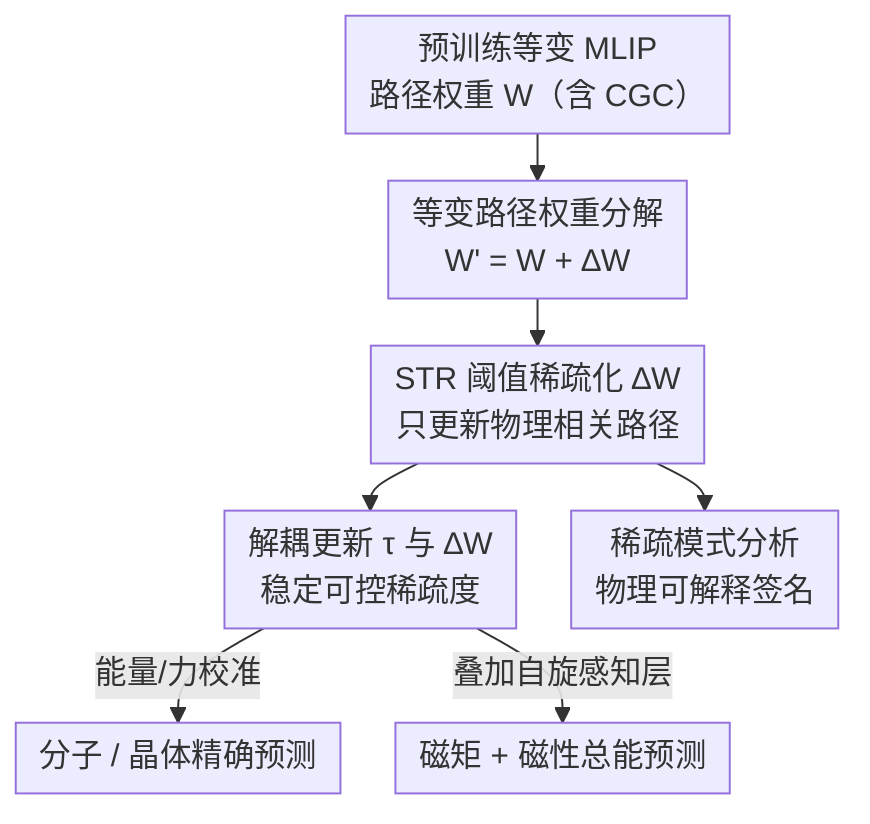

# Robust and Interpretable Adaptation of Equivariant Materials Foundation Models via Sparsity-promoting Fine-tuning

**会议**: ICLR 2026  
**OpenReview**: [https://openreview.net/forum?id=moBqB1CUym](https://openreview.net/forum?id=moBqB1CUym)  
**代码**: 见补充材料（Supplementary Materials）  
**领域**: 材料基础模型 / 等变图神经网络 / 参数高效微调 / 可解释性  
**关键词**: 机器学习原子间势, E(3) 等变, 稀疏微调, STR, 磁性预测

## 一句话总结
本文提出一种**稀疏促进（sparsity-promoting）微调**方法，在严格保持等变性的前提下，只更新材料基础模型（MLIP）中约 0.5–3% 的路径权重参数，就能在分子、晶体、磁性体系上达到或超过全量微调与 ELoRA 的能量/力预测精度，并且稀疏出来的更新模式还自带物理可解释性（如过渡金属体系中 d 轨道通道被重点修改）。

## 研究背景与动机

**领域现状**：机器学习原子间势（MLIP）用神经网络拟合材料的势能面（PES），是密度泛函理论（DFT）的高效代理。近年借鉴 CV/NLP 的基础模型范式，出现了在大规模 DFT 数据上预训练的「材料基础模型」（MACE-MP-0、CHGNet、SevenNet 等），它们多基于 E(3) 等变图神经网络，能在严格保持平移/旋转/镜像对称性的同时建模多体相互作用。

**现有痛点**：材料体系极其多样，再大的预训练集也无法覆盖所有元素、晶型与物理化学条件（压强、温度），而且下游应用常用与预训练数据不同的理论级别或交换关联泛函，引入系统性偏差。因此把预训练模型直接套用到新场景往往失效，必须做领域特定的微调（校准）。但全量微调在「小数据 + 巨大构型/化学空间」下极易过拟合，还有算力和显存开销；现有参数高效方法（GeoAda、ELoRA）虽然为等变结构重设计了 Adapter/LoRA，但它们都聚焦于「**怎么参数化更新**」（低秩、受限幅度）。

**核心矛盾**：低秩这类做法会让 ∆W 变成**稠密更新**——每一条相互作用路径都被或多或少地扰动。这既不利于针对性校准（很多路径本不该动），也破坏了科学 ML 追求的可解释性目标。一个互补但尚未被探索的视角是：不去约束「怎么更新」，而是直接控制「**更新哪些参数**」，让模型只改与目标域最相关的少数路径、其余保持不变。

**本文目标**：在等变 MLIP 上实现一种既保持对称性、又只选择性更新极少数参数的微调方法，同时让稀疏模式本身携带物理意义。

**切入角度**：等变网络的内部权重天然挂在有物理含义的基函数（球谐、Clebsch–Gordan 张量积路径）上。如果对这些「路径权重」施加稀疏约束，就能精确读出微调到底改了哪些通道、哪些保持不变——这正好把「稀疏 = 减少冗余自由度 = 可解释」（呼应 SINDy、奥卡姆剃刀）和 MLIP 的物理结构结合起来。

**核心 idea**：把可微调的路径权重拆成「冻结部分 + 稀疏增量 ∆W」，用 STR 阈值机制在训练中动态剪枝 ∆W，只保留少量物理相关路径的更新，从而用 ~0.5–3% 参数实现等变、精准且可解释的领域适配。

## 方法详解

### 整体框架

方法建立在等变图神经网络（EGNN）之上。EGNN 把节点/边特征表示为旋转群的不可约表示（irreps），按阶数 $\ell$ 索引（$\ell=0$ 标量、$\ell=1$ 矢量、$\ell=2$ 二阶张量），两组 irreps 耦合时输出阶数须满足 $|\ell_{in1}-\ell_{in2}|\le\ell_{out}\le\ell_{in1}+\ell_{in2}$。这些「对称性允许的相互作用路径」由预定义、不可训练的 Clebsch–Gordan 系数（CGC）实现，**等变性完全由 CGC 保证**，而模型的全部学习能力都落在调制每条路径强度的**可学习标量权重张量 $W$** 上。

由此得到一个关键观察：**微调时唯一该动的、且动了也不破坏等变的，就是这个路径权重张量**。本文据此把待微调权重拆为冻结分量与稀疏增量 $W' = W + \Delta W$，再用 STR 阈值机制在训练中把 $\Delta W$ 压成稀疏——只让少数物理相关路径的权重被更新。推理时 $\Delta W$ 会被合并回 $W$，速度与显存与原模型完全一致。此外，为把方法推广到磁性任务，框架还能在基础模型顶部叠加一组从零训练的「自旋感知层」，预测每个原子的非共线磁矩与自旋交换能量修正。

### 关键设计

**1. 等变路径权重分解：把微调限制在唯一安全的旋钮上**

现有等变微调（如 ELoRA）虽保持对称性，但把 $\Delta W$ 写成两个低秩矩阵之积 $\Delta W=AB$，导致每条相互作用路径都被扰动，是稠密更新。本文的出发点是认清等变网络里「哪里能动」：CGC 是预定义常数、负责强制等变，真正可学的只有调制各路径强度的标量权重 $W$。因此微调的自然介入点就是这个路径权重张量，把它分解为 $W' = W + \Delta W$（$W$ 冻结、$\Delta W$ 承载适配）。从这个视角看，微调本质上是在「重新加权各相互作用路径的相对贡献」，以适配目标数据集的成分、压强/温度区间或 DFT 理论级别。由于 $\Delta W$ 只乘在单条张量路径的 CGC 上，对称性约束被天然保持、等变性严格成立；同时直接把 $\Delta W$ 注入路径权重张量，几乎不引入额外计算开销。注意这里的稀疏**不是**为了省训练算力（$W$ 仍稠密），而是为了诱导「选择性、物理上有意义」的更新。

**2. STR 阈值稀疏化：让模型自己决定改哪几条路径**

要实现「只更新最关键路径」，本文借用计算机视觉里的软阈值权重重参数化（STR），用一个**逐层可学习标量 $\tau$** 控制剪枝阈值 $\delta = g(\tau)$（$g$ 为 sigmoid）。训练每步前向前，对 $\Delta W$ 施加软阈值算子，把幅度低于阈值的项剪掉：

$$\Delta W_t \leftarrow S(\Delta W_t, \delta_t) := \mathrm{sign}(\Delta W_t)\odot \mathrm{ReLU}(|\Delta W_t| - \delta_t)$$

其中 $\odot$ 为逐元素 Hadamard 积。$\Delta W$ 不能初始化为 0（否则阈值机制会让梯度消失、学不到东西），而是从窄高斯 $\mathcal{N}(0,\sigma^2 I)$ 初始化（$\sigma=0.01$）。这样在适配过程中只有对应特定相互作用路径的少数权重会被更新，凸显物理相关的相互作用、压制对称性平凡（symmetry-trivial）的路径。最终一个数据集上往往只有约 0.5–3% 的参数被真正修改。

**3. 解耦 $\tau$ 与 $\Delta W$ 的更新：把朴素 STR 的不稳定治好**

作者发现把朴素 STR 直接搬到等变 MLIP 会因为 $\tau$ 与 $\Delta W$ **共享衰减**而在微调中出现不稳定。本文的修法是把两者的更新解耦，各用各的学习率与权重衰减。$\Delta W$ 的更新只让梯度流过未被剪枝的元素：

$$\Delta W_{t+1} \leftarrow (1-\eta_t\lambda_\Delta)\Delta W_t - \eta_t\nabla_{\Delta W_t}L_{total}\odot \mathrm{Mask}\{|\Delta W_t|>0\}$$

而阈值参数 $\tau$ 独立更新，用自己的学习率 $\eta_{\tau,t}$ 和权重衰减 $\lambda_\tau$：

$$\tau_{t+1} \leftarrow (1-\eta_{\tau,t}\lambda_\tau)\tau_t - \eta_{\tau,t}\nabla_{\tau_t}L_{total}$$

这里 $\lambda_\tau$ 成了控制最终稀疏度的核心旋钮：实验中取 $\lambda_\tau=0.01$ 得到「低稀疏/高性能」配置（记为 L），取 $\lambda_\tau=0.3$ 得到「高稀疏/稳定」配置（记为 H）。解耦后微调既稳定又能对稀疏度做细粒度控制。

**4. 自旋感知扩展：把基础模型推到磁性任务**

为证明方法不止能校准能量/力，作者在 MACE-MP-0b3 顶部叠加一组从零训练的自旋感知层（+8.6% 参数），它接收最终节点/边嵌入，预测每个原子的矢量非共线磁矩 $\hat\mu_i$ 与来自自旋交换的边能量修正 $\epsilon_{ij}$；总能量 = 基础模型能量 + 自旋贡献。稀疏促进微调**只作用于原基础模型参数**，自旋层照常训练。总损失是四项的加权和：

$$L_{total} = \alpha_E L_E + \alpha_F L_F + \alpha_V L_V + \alpha_\mu L_\mu$$

各项均用 Huber 损失，磁性体系下能量/力/应力/磁矩权重取 1:1:1:1。这一设计让「非磁性基础模型 + 少量稀疏更新 + 自旋层」就能捕捉约 10 meV/atom 量级的磁性能量差，复用了预训练知识、避免从零训练。

### 损失函数 / 训练策略
统一使用 schedule-free AdamW 优化器，batch size 64，权重衰减 $1\times10^{-8}$，单 GPU 训练、三个随机种子取平均。初始学习率按数据集网格搜索：rMD17 取 $1\times10^{-2}$、LAM 取 $1\times10^{-3}$、MP-mag 取 $5\times10^{-3}$；$\Delta W$ 初始化 $\sigma=0.01$、阈值参数 $\delta=0.001$。能量/力等损失项除磁性体系外沿用 MACE 基础模型的权重比例。

## 实验关键数据

### 主实验

四个基准：rMD17（10 种有机分子，MACE-OFF23）、LAM（9 个无机晶体子集，MACE-MP-0b3）、自建 TM-O-Spin（过渡金属及其氧化物，含磁序）、MP-mag（Materials Project 磁性子集）。对比 Zero-shot、从零训练（Scratch）、全量微调（Full）、ELoRA。指标为能量 MAE（meV/atom）、力 MAE（meV/Å）与总稀疏度 Sp.（%）。

| 数据集 | 体系 | Full | ELoRA | Ours (L) | Ours (H) | Ours 稀疏度 |
|--------|------|------|-------|----------|----------|-------------|
| rMD17 Aspirin | E | 0.19 | 0.21 | **0.17** | 0.20 | 96.84% (H) |
| rMD17 Aspirin | F | 8.09 | 8.52 | **7.56** | 8.22 | — |
| LAM Cu | E | 32.74 | 9.33 | **2.18** | 2.49 | 99.58% (H) |
| LAM Cu | F | 25.82 | 32.46 | **23.92** | 25.39 | — |
| LAM Ag∪Au | E | 11.67 | 4.98 | **3.67** | 4.84 | 99.41% (H) |

- 在 rMD17 标准配置（L）下，本文在 10 个分子里有 8 个超过 Full 与 ELoRA；高稀疏配置（H）在全部 10 个分子上都胜过 ELoRA。
- 无机晶体上，对「zero-shot 误差大、分布漂移强」的体系（如 Sn、H2O-PD、Cu）优势尤其明显，且这是只改约 3% 参数（L）或仅 0.5–0.7% 参数（H）实现的。
- 换到 NequIP-OAM-L 架构同样达到可比或更优精度，说明方法不绑定 MACE。

### 磁性体系（TM-O-Spin）

| 指标 | Scratch | Full | ELoRA | Ours (L) | Ours (H) |
|------|---------|------|-------|----------|----------|
| 能量 (meV/atom) | 27.28 | 11.58 | 12.44 | **9.50** | 10.57 |
| 力 (meV/Å) | 174.70 | 96.89 | 116.31 | **70.46** | 74.15 |
| 磁矩 (µ) | 0.035 | 0.029 | 0.038 | **0.028** | 0.030 |
| 总稀疏度 (%) | — | — | — | 90.21 | 91.83 |

Ours (L) 在能量、力、磁矩三项上全面领先，且只更新约 10% 参数。

### 消融实验

| 配置 | 关键发现 | 说明 |
|------|---------|------|
| 仅 Linear 层 | 与 All 几乎相同 | 适配能力主要由线性层承载 |
| 仅 FCTP 层 | 一致最差 | FCTP 路径对适配贡献小 |
| Linear vs All 稀疏度 | All 稀疏度在小 $\lambda_\tau$ 就骤升 | 线性参数更关键、模型更「舍不得」剪 |
| $\lambda_\tau$ 两区间 | L($\lambda_\tau{=}0.01$) 高性能 / H($\lambda_\tau{=}0.3$) 高稀疏稳定 | 能量曲线呈现两个有效适配区间 |

### 计算成本与可解释性

- **开销小**：训练单步比 Full 慢约 3–11%，但比 ELoRA 快（ELoRA 需矩阵乘重构 $\Delta W$）；Linear 配置显存几乎无额外开销，FCTP/All 与 ELoRA 相当。推理时 $\Delta W$ 合并回 $W$，速度/显存与原模型一致。
- **物理可解释**：用 $1-R^2$ 量化路径权重变化。在 TM-O-Spin 上，本方法主要更新过渡金属的 p、d 轨道样通道与氧的 s、p 样通道——恰好对应过渡金属价电子在 d 轨道、氧价电子在 s/p 轨道的化学键合规律。而 ELoRA 因 $\Delta W=AB$ 低秩共享，更新会沿整行/整列扩散到训练集外元素与所有层，模式弥散、难以解读。

### 关键发现
- **稀疏更新反而更准**：选择性更新少数物理相关路径，在多数体系上优于稠密的全量微调与 ELoRA，尤其在分布漂移大的体系上。
- **线性层是适配主力**：FCTP 层贡献小，模型在稀疏化时优先保留线性层参数。
- **数据越大稠密越有竞争力**：在大规模 MP-mag 上各方法差距缩小，Full 在力预测上最好，提示存在「数据规模 × 微调策略」的实际权衡。

## 亮点与洞察
- **把「改哪些参数」当成一等公民**：现有等变 PEFT 都在改「怎么参数化更新」，本文转而约束「更新哪些路径」，这个视角切换让等变结构里隐含的物理基函数直接变成可读的稀疏签名，是最「啊哈」的地方。
- **稀疏 = 可解释的天然耦合**：因为 $\Delta W$ 挂在球谐/CGC 路径上，稀疏出来的非零项天然对应物理轨道通道，可解释性不是额外加的探针，而是方法的副产品。
- **解耦 $\tau$ 与 $\Delta W$ 这个工程细节很可迁移**：朴素 STR 在等变 MLIP 上不稳，把阈值与权重的衰减解耦即可治好，这一招对其他「阈值剪枝 + 微调」场景都有借鉴意义。
- **基础模型可向新物理量扩展**：自旋感知层 + 稀疏微调的组合说明 MLIP 基础模型能被推到能量/力之外（磁矩、磁性总能），为「一模型多物理属性」提供了范式。

## 局限与展望
- **不省训练算力**：作者明确指出，由于 $W$ 仍稠密、稀疏只在 $\Delta W$ 上，方法**不带来**稀疏网络常见的训练加速；这是 fine-tuning 范式的固有限制。展望里提出「结构化稀疏预训练」才能换来真正的硬件加速。
- **大数据下优势收窄**：在 MP-mag 上稠密更新变得更有竞争力，说明本方法的相对收益与「域内数据规模/多样性」有关，并非全场景占优。
- **可解释性偏定性**：物理签名分析（轨道通道、$1-R^2$ 热图）是有说服力的定性对照，但尚未给出定量的可解释性指标或下游验证。
- **自旋层从零训练**：磁性扩展额外引入 +8.6% 从零训练参数，若目标域磁性数据稀缺，自旋层本身可能成为新的过拟合点。

## 相关工作与启发
- **vs ELoRA / GeoAda（等变 PEFT）**：它们用低秩或受限幅度参数化 $\Delta W$，得到稠密、弥散的更新；本文用稀疏阈值得到选择性、可解释更新，精度可比或更好，且更新模式物理上更干净。
- **vs 全量微调**：Full 改全部参数、易过拟合且开销大；本文只改 0.5–3% 参数即达到或超过 Full，尤其在小数据/分布漂移场景更稳。
- **vs STR（CV 领域稀疏）**：直接搬 STR 会在等变 MLIP 上不稳定，本文通过解耦 $\tau$ 与 $\Delta W$ 的衰减使其适配等变微调，是对 STR 在科学 ML 场景的非平凡迁移。
- **vs SINDy 等科学 ML 稀疏方法**：共享「少数核心变量主导物理现象」的奥卡姆剃刀信念，但本文把稀疏作用于基础模型的等变路径权重，落点是「可解释的领域适配」而非方程发现。

## 评分
- 新颖性: ⭐⭐⭐⭐⭐ 首次把「更新哪些参数」的稀疏视角引入等变 MLIP 微调，并让稀疏自带物理可解释性
- 实验充分度: ⭐⭐⭐⭐ 覆盖分子/晶体/磁性四基准 + 两种架构 + 消融与成本分析，磁性数据集为自建
- 写作质量: ⭐⭐⭐⭐⭐ 动机推导清晰，等变结构与稀疏的耦合讲得透
- 价值: ⭐⭐⭐⭐⭐ 为材料基础模型的领域适配提供了高效、稳健且可解释的实用方案

<!-- RELATED:START -->

## 相关论文

- [\[ICLR 2026\] Physics-Constrained Fine-Tuning of Flow-Matching Models for Generation and Inverse Problems](physics-constrained_fine-tuning_of_flow-matching_models_for_generation_and_inver.md)
- [\[ICML 2026\] Interpretable Equivariant Marks for Contrastive Cosmological Inference](../../ICML2026/physics/interpretable_neural_marked_statistics_for_cosmological_inference.md)
- [\[ICLR 2026\] Advancing Universal Deep Learning for Electronic-Structure Hamiltonian Prediction of Materials](advancing_universal_deep_learning_for_electronic-structure_hamiltonian_predictio.md)
- [\[ICLR 2026\] VisionLaw: Inferring Interpretable Intrinsic Dynamics from Visual Observations via Bilevel Optimization](visionlaw_inferring_interpretable_intrinsic_dynamics_from_visual_observations_vi.md)
- [\[ICML 2026\] Foundation Inference Models for Ordinary Differential Equations](../../ICML2026/physics/foundation_inference_models_for_ordinary_differential_equations.md)

<!-- RELATED:END -->
