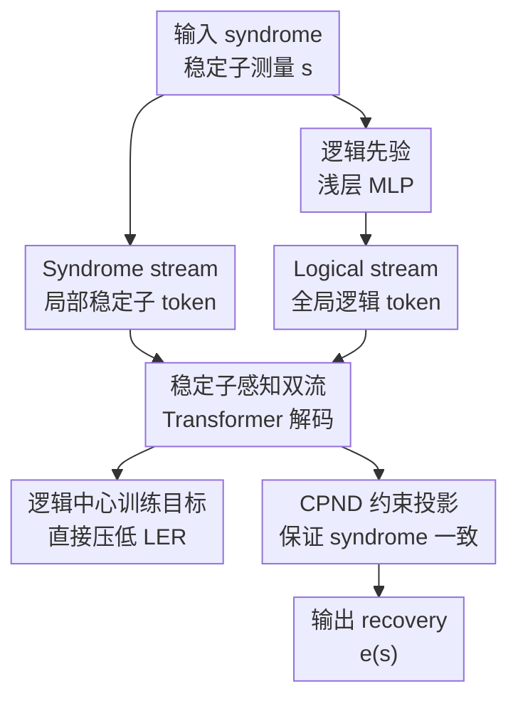

# SAQ: Stabilizer-Aware Quantum Error Correction Decoder

**会议**: ICLR2026  
**OpenReview**: [https://openreview.net/forum?id=ySp8faVj6k](https://openreview.net/forum?id=ySp8faVj6k)  
**代码**: https://github.com/DavidZenati/SAQ-Decoder/tree/main  
**领域**: 量子纠错 / 物理  
**关键词**: 量子纠错, 稳定子码, 神经解码器, Transformer, 逻辑错误率

## 一句话总结
SAQ-Decoder 用稳定子结构感知的双流 Transformer 学习 syndrome 到逻辑错误类别和物理纠错操作的映射，再用约束投影的 CPND 后处理保证 syndrome 一致性，在 toric code 上把独立噪声和退相干噪声阈值分别推到 10.99% 和 18.6%，接近最大似然解码上界。

## 研究背景与动机
**领域现状**：量子纠错（Quantum Error Correction, QEC）的核心任务，是从稳定子测量得到的 syndrome 中推断物理量子比特上发生了什么错误，并给出一个恢复操作，使编码后的逻辑量子态不被破坏。经典方法里，MWPM 是 surface code / toric code 上最常用的强基线，BP-OSD 在稀疏校验矩阵上也很有代表性，tensor network decoder 能做到很高精度但代价很大。近几年神经解码器开始进入这个问题，尝试用 CNN、Transformer 或 recurrent model 学习 syndrome 到 recovery 的映射。

**现有痛点**：QEC 解码最难的地方不只是预测每个物理 qubit 是否翻转，而是要在量子退化性（quantum degeneracy）下预测正确的逻辑等价类。多个不同物理错误可以产生同一个 syndrome，其中有些错误虽然不同，但相差一个稳定子操作，逻辑上等价；另一些错误则会导致逻辑 qubit 翻转，真正造成失败。因此，只优化 bit error rate 的神经解码器可能在物理错误层面看起来不错，却没有直接压低逻辑错误率（Logical Error Rate, LER）。同时，纯神经网络输出通常不能保证 $He=s$ 这种 GF(2) 上的 syndrome 一致性，最后还要靠后处理修正。

**核心矛盾**：高精度经典解码器往往需要较高的多项式复杂度，甚至接近最大似然的 tensor network 解码器计算成本更重；而快速神经解码器虽然推理便宜，但如果不显式尊重稳定子码的局部几何、逻辑算符约束和 syndrome 一致性，就很难接近最大似然阈值。换句话说，这篇论文面对的是“实时解码所需的线性/近线性复杂度”和“容错量子计算所需的 near-ML 逻辑精度”之间的矛盾。

**本文目标**：作者希望构造一个可扩展的 learned decoder：输入 syndrome，输出满足稳定子约束的 recovery operator；训练目标直接关注逻辑错误而不是只关注物理 bit flip；推理阶段的复杂度随 syndrome 长度线性增长；并且能在 toric code、rotated surface code、color code、repetition code 等不同稳定子码族和不同噪声模型下泛化。

**切入角度**：论文的关键观察是，稳定子码的 syndrome 带有明显局部几何结构，哪些 syndrome 之间应该交互可以从校验矩阵 $H$ 里读出来；而逻辑错误类别又是全局性质，需要整合远距离 syndrome 信息。于是作者把问题拆成两个信息流：一个 syndrome stream 负责局部稳定子相关性，一个 logical stream 负责全局逻辑类别推断，并让二者通过非对称 attention 交互。

**核心 idea**：用稳定子拓扑 mask 限制 syndrome attention、用 logical stream 汇聚全局信息，再用逻辑中心损失和 CPND 约束投影把神经预测变成 syndrome 一致的恢复操作。

## 方法详解

### 整体框架
SAQ-Decoder 的输入是稳定子测量得到的 syndrome $s$，输出是一个 recovery operator $e(s)$，要求它不仅概率上接近真实错误，还必须满足给定 syndrome 与预测逻辑类别的约束。整体流程可以看成四步：先用浅层 MLP 从 syndrome 估计逻辑类别先验，再把 syndrome 和逻辑类别先验分别变成两条 token stream；随后用 Syndrome-Logical Transformer Decoder（SLTD）做局部-全局联合推理；最后用 Constraint-Projected Nullspace Descent（CPND）把神经网络的软预测投影到满足 GF(2) 约束的可行解空间。

这里的关键不是简单把 Transformer 套到 QEC 上，而是让网络结构和 QEC 的代数结构对齐。syndrome token 只在由 $HH^T$ 指示的邻域内交互，从而尊重哪些稳定子共享物理 qubit；logical token 则可以跨全局 syndrome 表示做 cross-attention，因为逻辑错误类别本来就是全局量。网络训练时同时监督初始逻辑先验、最终逻辑类别和 differentiable 的逻辑 parity 约束，推理时再用 CPND 做 exact projection，避免输出一个 syndrome 不一致的 recovery。

### 关键设计
**1. 双流表示：把局部 syndrome 约束和全局逻辑类别分开建模**

传统神经解码器常把 syndrome 当作一串输入，直接预测物理错误或 recovery，但这会把两个性质不同的问题混在一起：局部稳定子违例告诉你“错误可能在哪里”，逻辑等价类告诉你“这个错误是否真的破坏编码信息”。SAQ 先用浅层 MLP $b_\phi(s)$ 从 syndrome 得到初始逻辑类别 logits $\tilde{\ell}\in\mathbb{R}^{4k}$，其中 $4k$ 对应 $k$ 个逻辑 qubit 的逻辑等价类数量；这一步不是为了替代 decoder，而是给后续 logical stream 一个全局先验。

syndrome stream 的构造更像稳定子测量的几何编码：每个 syndrome 分量 $s_i\in\{-1,+1\}$ 乘上可学习位置向量 $w_i^S$ 得到 token，同时加入一个全局 token $g$ 汇总远距离信息。logical stream 则把 $\tilde{\ell}_j$ 与类别专属向量 $w_j^L$ 相乘，形成逻辑类别 token。这样一来，模型从输入层就承认“局部错误模式”和“逻辑 coset 判断”不是同一种表示，后面的 attention 也可以按这两种语义分别设计。

**2. 稳定子感知非对称 attention：syndrome 局部传播，logical 全局汇聚**

SAQ 的 Syndrome-Logical Transformer Decoder 使用共享权重的多层 Transformer，但 attention 模式不是标准全连接。syndrome self-attention 加入 mask $M_S$，只有三类连接被允许：同一个 syndrome 自身、共享物理 qubit 的 syndrome 对、以及所有 syndrome 与 global token 的连接。论文用校验矩阵写成：当 $(HH^T+I_m)_{i,j}>0$ 或涉及全局 token 时，$M_S[i,j]=0$，否则置为 $-\infty$。这相当于把稳定子码的拓扑邻接关系直接写进 attention 图里。

logical stream 采用另一种信息流：logical token 对更新后的 syndrome 表示做 unrestricted cross-attention。这样设计很贴合 QEC 的因果结构：物理错误先在局部稳定子上留下 syndrome 痕迹，但是否形成 logical error 要看跨越整个码距离的全局模式。与双向 cross-attention 相比，论文的消融显示非对称流向更好，因为它避免 logical token 和 syndrome token 互相过度搅拌，让 syndrome 侧保持局部约束，让 logical 侧负责全局判别。

**3. 逻辑中心损失：训练目标直接对准 logical error，而不是只预测 qubit flip**

QEC 的最终失败标准是逻辑信息是否被破坏，因此 SAQ 不满足于只监督物理错误 $\hat e$。训练目标由三项组成：初始 MLP 的逻辑先验交叉熵 $L_{LP}=CE(\tilde{\ell},y_{class})$，Transformer 输出的逻辑类别交叉熵 $L_{LC}=CE(\hat{\ell},y_{class})$，以及逻辑最小熵损失 $L_{Entropy}$。前两项分别让先验和 refined logical output 都学会判断逻辑 coset，第三项则把离散 GF(2) 逻辑约束变成可微近似。

更具体地，解码成功要求残差 $r=e_{true}\oplus e_{pred}$ 不触发任何 logical operator，即 $Lr=0$ over GF(2)。由于 $\oplus$ 和 hard decision 不可微，作者把每个残差 bit 的出错概率写成 $q_i=\sigma((1-2e_i^{true})\hat e_i)$，再用 Bernoulli parity 的闭式形式估计第 $i$ 个 logical operator 被违反的概率：

$$
Pr(L_i\cdot r=1)=\frac{1}{2}\left[1-\prod_{j\in\chi_i}(1-2q_j)\right].
$$

随后最小化

$$
L_{Entropy}=-\frac{1}{2k}\sum_{i=1}^{2k}\log(1-Pr(L_i\cdot r=1)).
$$

这项损失的价值在于，它不是让网络“尽量逐 bit 对齐真实错误”，而是让网络学习“不要落到会产生逻辑翻转的等价类”。这正好击中量子退化性带来的训练错位问题。

**4. CPND 后处理：把神经预测投影到满足稳定子和逻辑约束的可行解**

即便网络学到了很好的概率，直接阈值化得到的 $e_{pred}$ 也未必满足 $He=s$，更未必同时满足预测逻辑类别。CPND 把校验矩阵和逻辑算符矩阵堆叠成增广矩阵 $\hat H=[H;L]$，把目标约束写成 $\hat H e=b$，其中 $b=[s;\ell]$。先预计算一个左逆 $B$，对任意神经预测 $e_{pred}$ 计算残差 $y=b\oplus \hat H e_{pred}$，再令 $e'=e_{pred}\oplus By$。这样得到的 $e'$ 按构造一定满足约束。

只做投影还不够，因为 $B$ 是代数构造，不会考虑哪个 qubit 更可能出错。CPND 进一步在 $\ker(\hat H)$ 的零空间里做贪心下降：取 nullspace basis $v_j$，用 Transformer 输出的 flip probability $p_q=\sigma(\hat e_q)$ 构造 log-likelihood ratio 权重 $w_q=-\log(p_q/(1-p_q))$，如果沿某个 $v_j$ 翻转能降低加权 Hamming cost，就接受这一步。由于所有移动都在零空间内，$\hat H e=b$ 始终保持成立；由于每步只接受负增量，恢复操作的概率代价被逐步压低。它比 naive projection 更接近 OSD-0 的低权重解，但在线推理复杂度是 $O(m)$，更适合实时 QEC。

### 一个完整示例
以一个 toric code 的 syndrome 为例，输入 $s$ 中若干稳定子测量为 $-1$，表示局部存在反对易错误痕迹。SAQ 首先用浅层 MLP 粗略判断这些 syndrome 更可能属于哪个逻辑 coset，比如它倾向于某个 $X$ 型逻辑错误类别。与此同时，每个 syndrome token 只和自己、共享物理 qubit 的邻居以及 global token 交互，所以局部错误链的几何形状会在 syndrome stream 内逐层传播。

进入 logical stream 后，logical token 不再只看邻域，而是通过 cross-attention 读取所有 syndrome 表示，判断这些局部违例是否连成了跨越码距离的全局链。Transformer 输出两类信息：一类是 logical class $\hat{\ell}$，一类是每个 qubit 的 flip logits $\hat e$。如果直接取 hard decision 得到的 $e_{pred}$ 不满足 $He=s$，CPND 会先把它投影到满足 $[H;L]e=[s;\ell]$ 的可行集合，再沿零空间方向尝试降低权重。最终输出的 recovery operator 不一定逐 bit 等于真实错误，但只要残差是 stabilizer，它就能成功恢复逻辑态。

### 损失函数 / 训练策略
总损失写成 $L=\lambda_{LP}L_{LP}+\lambda_{LC}L_{LC}+\lambda_{Entropy}L_{Entropy}$，实验中主要采用 $\lambda_{LP}=0.2$、$\lambda_{LC}=1.0$、$\lambda_{Entropy}=1.0$。模型通常使用 6 到 8 层 Transformer，embedding dimension 为 128，attention heads 为 16。训练时在测试物理错误率范围内随机采样噪声，以提升跨噪声强度的泛化能力。

优化器使用 Adam，batch size 在 128 到 512 之间，训练 200 到 600 epoch，每个训练运行约处理 $2.56\times 10^6$ 个错误样本。学习率从 $3\times 10^{-4}$ 或 $1\times 10^{-4}$ 起步，使用 cosine annealing 衰减到 $1\times 10^{-6}$。surface code / toric code 主要在独立噪声和退相干噪声下评估，color code 与 repetition code 则使用 stim 构造 circuit-level noise，以测试更现实的多轮测量噪声场景。

## 实验关键数据

### 主实验
论文主要用 LER 和 threshold 衡量效果。SAQ 在 toric code、rotated surface code 上均优于 MWPM、BPOSD-2、QECCT，并且 No CPND 版本本身也常常强于这些基线，说明双流结构已经贡献很大；CPND 则进一步把输出推向 syndrome 一致和低权重恢复。

| 代码族 / 噪声模型 | 指标 | SAQ-Decoder | 代表性基线 | 结果解读 |
|--------|------|------|----------|------|
| Toric / independent | threshold | 10.99% | MWPM 10.3%, BPOSD-2 10.8%, ML 约 10.9%-11.0% | 基本贴近 ML 阈值 |
| Toric / depolarizing | threshold | 18.6% | QECCT 17.8%, MWPM/BPOSD-2 约 16%, ML 18.9% | 接近理论 ML 上界 |
| Rotated surface / independent | threshold | 10.7% | QECCT 10.3%, BPOSD-2 10.2%, MWPM 10.6% | 小幅但稳定超过强基线 |
| Rotated surface / depolarizing | threshold | 18.3% | QECCT 17.2%, BPOSD-2 14.1%, MWPM 14.0% | 在退相干噪声下优势明显 |

在更细的 LER 对比中，SAQ 对近期 neural decoder 也有优势。例如 toric code $L_{code}=6$、$p=0.09$ 时，SAQ 的 LER 为 0.0363，QuantumSMoE 为 0.0492，BP-OSD-2 和 MWPM 分别为 0.1143 和 0.1238。到 $p=0.15$ 时，SAQ 为 0.2489，QuantumSMoE 为 0.2560，仍保持领先。另一个对比中，toric code $L_{code}=7$、$p=0.09$ 时，SAQ 的 LER 为 0.019，SU-NetQD 为 0.028，BP-OSD-2 为 0.072，MWPM 为 0.069。

| 场景 | p | SAQ | 对比方法 | 相对表现 |
|------|---|------|---------|---------|
| Toric $L_{code}=6$ vs QuantumSMoE | 0.09 | 0.0363 | QuantumSMoE 0.0492 | 低错误率区域更稳 |
| Toric $L_{code}=6$ vs QuantumSMoE | 0.15 | 0.2489 | QuantumSMoE 0.2560 | 高噪声下仍略优 |
| Toric $L_{code}=7$ vs SU-NetQD | 0.09 | 0.019 | SU-NetQD 0.028 | 约 29% 相对降低 |
| Toric $L_{code}=7$ vs MWPM | 0.09 | 0.019 | MWPM 0.069 | 明显降低逻辑错误率 |

### 消融实验
| 配置 | 关键指标 | 说明 |
|------|---------|------|
| Full loss $(0.2,1.0,1.0)$ | final average LER $1.972\times 10^{-1}$ | 逻辑先验、逻辑分类、最小熵三项都保留 |
| w/o logical classification | $2.113\times 10^{-1}$ | 去掉 $L_{LC}$ 后上升 7.2%，是最关键损失项 |
| w/o logical prior | $2.055\times 10^{-1}$ | 去掉 $L_{LP}$ 后上升 4.2%，说明 MLP 先验有帮助 |
| w/o entropy regularization | $2.047\times 10^{-1}$ | 去掉 $L_{Entropy}$ 后上升 3.8%，逻辑 parity 近似确有贡献 |
| Mask + global token | 约 0.19 average LER | 收敛快且最终 LER 低 |
| Mask only | 约 0.21 average LER | 局部拓扑 mask 有效，但缺全局汇聚 |
| No mask, no global | 高于 mask-only | 不注入稳定子邻接结构会变差 |

### 关键发现
- 双流结构不是装饰性模块。单独只保留 logical stream 最差，单独 syndrome stream 也不如完整模型；双向 cross-attention 反而不如非对称 attention，说明 QEC 中“局部 syndrome 先组织、logical token 再全局读取”的方向性很重要。
- CPND 的价值在于把 learned prior 和 exact constraint 拼起来。No CPND 版本已经强，但 CPND 进一步保证 $He=s$ 和预测逻辑类别约束，避免神经输出在 GF(2) 约束上失效。
- 复杂度和参数效率是这篇论文的强卖点。SAQ 的 forward pass 复杂度约为 $O(Nmd^2)$，CPND 在线阶段为 $O(m)$；toric code $L=10$ depolarizing 场景下，SAQ 约 0.80G FLOPs、4.5ms 推理，而 QECCT 约 4.10G FLOPs、20.1ms 推理。
- 参数量随 code distance 增长很慢。toric code 上 SAQ 大致保持在 1.2M 到 1.9M 参数，而 QECCT 在 $L_{code}=10$ depolarizing 下达到约 6.7M，说明 SAQ 没有把 full qubit-syndrome 空间直接膨胀进 Transformer。

## 亮点与洞察
- 这篇论文最核心的亮点，是把 QEC 的代数约束和神经网络结构真正接上了。syndrome mask 来自 $HH^T$，逻辑损失来自 $L(e_{true}\oplus e_{pred})=0$，CPND 来自 $[H;L]e=b$ 的可行空间，这些都不是通用深度学习 trick，而是稳定子码结构的直接嵌入。
- 逻辑中心损失很有启发性。它提醒我们，在有等价类的结构化预测问题中，逐元素监督未必等于任务成功；更好的训练目标应直接对齐最终失败事件。这个思路也可迁移到 classical coding、组合优化或其他“多个解都可接受，但某些等价类会失败”的问题。
- CPND 是一个务实的 hybrid 设计。它没有试图让神经网络自己学会所有 GF(2) 线性约束，而是让网络提供概率和逻辑类别，再用可解释的代数投影保证合法性。这种 learned prior + exact projection 的组合，很适合需要物理一致性或安全约束的科学机器学习场景。
- 全局 token 在这里不是 NLP 里的普通 CLS token，而是补偿局部 mask 的必要汇聚通道。局部 mask 保证稳定子邻接归纳偏置，全局 token 则让远距离 correlated syndrome pattern 有机会被识别，这对跨越码距离的 logical error 判断尤其关键。

## 局限与展望
- 论文主要展示了 toric code、rotated surface code、color code 和 repetition code 上的结果，但大规模 QLDPC code、更复杂设备噪声、带 leakage / biased noise / time-correlated noise 的情况仍需要进一步验证。作者声称框架适用于任意 stabilizer code，但实际工程表现可能依赖 $H$、$L$ 的结构和训练数据质量。
- CPND 是线性复杂度、很实用，但它做的是单 pass nullspace greedy descent，不能保证全局最小权重 recovery。附录中它接近 OSD-0，但 OSD-0 仍能得到更低权重；在某些复杂噪声分布下，局部最优可能会限制最终 LER。
- 训练成本不低。虽然推理高效，训练配置包含 200-600 epoch、每轮大量 mini-batch，并使用 48GB NVIDIA L40S GPU。对真实设备频繁重训或在线校准时，训练成本和数据生成成本仍是需要考虑的问题。
- 论文报告的推理时间是神经网络和实现环境下的指标，距离真实容错量子计算所需的微秒级控制闭环还有工程差距。后续如果要落到硬件 decoder，需要进一步做模型压缩、量化、并行实现或 FPGA/ASIC 部署。

## 相关工作与启发
- **vs MWPM**: MWPM 是 surface code 上长期使用的经典解码器，优势是理论和工程都成熟，尤其在独立噪声下表现强；SAQ 的区别是直接学习 syndrome 到逻辑类别和 recovery 的映射，并用 CPND 保证约束一致，在 depolarizing 噪声和高 code distance 下明显降低 LER，同时复杂度随 syndrome 长度线性扩展。
- **vs BP-OSD**: BP-OSD 对稀疏校验矩阵有效，但 quantum degeneracy 会让 belief propagation 的消息传递变难，OSD 后处理也带来较高复杂度。SAQ 借助 Transformer 表示学习处理局部-全局模式，再用轻量 nullspace descent 替代更重的 OSD，精度和速度之间更均衡。
- **vs QECCT**: QECCT 是强 neural baseline，但主要预测 qubit-level flips，论文认为它没有直接优化 QEC 的核心目标 LER，也不能天然保证 syndrome 一致性。SAQ 通过 logical stream、逻辑中心损失和 CPND，把“预测物理错误”升级为“预测正确逻辑等价类并生成合法 recovery”。
- **vs AlphaQubit**: AlphaQubit 代表更大型的神经 QEC decoder，处理 analog measurement data 且使用 recurrent 结构。SAQ 更偏 feed-forward、输入是离散 binary syndrome，重点在 stabilizer-aware 架构和线性复杂度后处理，两者面向的工程设定不同。
- **启发**: 对科学计算里的神经求解器来说，最可靠的路线往往不是纯黑盒替代传统算法，而是把问题的守恒律、约束矩阵、等价类和可行域写进模型与后处理。SAQ 正是这个范式在量子纠错解码上的一个清晰例子。

## 评分
- 新颖性: ⭐⭐⭐⭐⭐ 双流稳定子感知 Transformer、逻辑中心损失和 CPND 的组合很完整，尤其是把逻辑 coset 约束显式纳入训练和推理。
- 实验充分度: ⭐⭐⭐⭐⭐ 覆盖多种 topological code、噪声模型、近期 neural baseline、复杂度和消融，证据链比较扎实。
- 写作质量: ⭐⭐⭐⭐ 方法主线清楚，公式推导完整，但部分表述略密，读者需要一定 QEC 背景才能顺畅理解。
- 价值: ⭐⭐⭐⭐⭐ 如果结果能在更真实硬件噪声和更大码族上延续，它为实时 learned QEC decoder 提供了很有竞争力的结构化路线。

<!-- RELATED:START -->

## 相关论文

- [\[ICML 2026\] Rethink the Role of Neural Decoders in Quantum Error Correction](../../ICML2026/physics/rethink_the_role_of_neural_decoders_in_quantum_error_correction.md)
- [\[ICML 2026\] Score-Based Error Correcting Code Decoder](../../ICML2026/physics/score_based_error_correcting_code_decoder.md)
- [\[ICLR 2026\] Uncertainty-Aware Diagnostics for Physics-Informed Machine Learning](uncertainty-aware_diagnostics_for_physics-informed_machine_learning.md)
- [\[ICLR 2026\] Sublinear Time Quantum Algorithm for Attention Approximation](sublinear_time_quantum_algorithm_for_attention_approximation.md)
- [\[ICLR 2026\] Feedback-driven Recurrent Quantum Neural Network Universality](feedback-driven_recurrent_quantum_neural_network_universality.md)

<!-- RELATED:END -->
