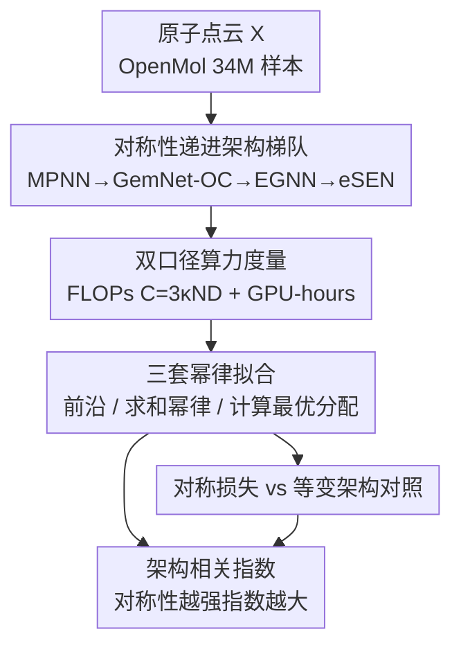

# Scaling Laws and Symmetry, Evidence from Neural Force Fields

**会议**: ICLR 2026  
**OpenReview**: [https://openreview.net/forum?id=qyjaVda7t2](https://openreview.net/forum?id=qyjaVda7t2)  
**代码**: https://github.com/nnkhang19/scaling-laws-and-symmetry  
**领域**: 神经网络力场 / 标度律 / 几何深度学习  
**关键词**: 标度律, 等变性, 对称性, 原子间势, 计算最优

## 一句话总结
这篇论文在「神经网络原子间势（NNIP）」这个几何任务上做了一套系统的标度律实验，发现幂律指数是**架构相关**的——架构编码的旋转/置换对称性越强、张量阶越高，随数据/参数/算力增长的标度指数就越大，因此性能差距会随规模**扩大**而非缩小，从而对「规模够大就该抛弃等变性、让模型自己学对称」的流行观点给出了反证。

## 研究背景与动机
**领域现状**：神经标度律（neural scaling law）在语言、视觉等领域已被广泛验证——验证误差随训练数据量 $D$、模型参数量 $N$、算力 $C$ 呈幂律下降。一个被理论与经验共同支持的主流信念是：对同一个任务，不同（足够表达）架构的标度行为是一致的，架构选择只会把损失乘上一个**跨尺度恒定的常数因子**，并不会改变幂律的斜率（指数）。这一信念又被 Sutton 的「苦涩的教训」强化：显式编码归纳偏置（如对称性）短期有用，长期会被「规模 + 让模型自己学」打败。

**现有痛点**：在分子力场这类几何任务上，等变网络（equivariant network）虽然以泛化好、对分布外鲁棒著称，但它依赖张量积、球谐函数、高阶消息传递等专用算子，计算昂贵、GPU 利用率低，被认为「难以扩展」。与此同时，蛋白质折叠、构象生成、NNIP 等领域不断出现「非等变网络配合数据增强也能打平等变网络」的证据，把舆论推向「干脆放弃等变、只扩简单的非等变模型」。

**核心矛盾**：上述「架构只改常数因子、不改指数」的论断几乎全部来自语言/视觉，从未在**对称性是任务内禀结构**的几何任务上被严格检验过。如果对称性真的改变了任务的**内在难度**，那它改变的就不该只是常数因子，而是幂律的**指数本身**——这正是被忽略的关键。

**本文目标**：在统一、公平的实验条件下，测量若干主流可扩展 NNIP 架构（对称性编码程度各异）在 $C$、$D$、$N$ 三个轴上的标度指数，回答两个子问题：(1) 不同对称性强度的架构，幂律指数是否不同？(2) 若不同，随规模增长性能差距是扩大还是缩小？

**切入角度**：把 NNIP 任务当成一个干净的「对称性可控变量」实验台——同一数据集、同一硬件、同一拟合协议，只改架构编码对称性的程度（从无约束到低阶到高阶），看指数怎么变。

**核心 idea**：对称性不是「可被规模替代的可选项」，而是会**改变任务内禀难度、从而改变标度指数**的根本归纳偏置；规模越大越该显式编码它，而不是留给模型自己去发现。

## 方法详解

### 整体框架
本文不是提出新模型，而是一项**实证标度律研究**，整体可分为四步：先搭一个「对称性递进的架构梯队」作为唯一自变量，再在统一协议下分别拟合三类幂律（算力前沿、参数×数据的求和幂律、计算最优分配），最后用一个「对称损失 vs 等变架构」的对照实验回答「能否用损失项廉价替代等变结构」。任务本身是：把原子点云 $X=\{(z_i,x_i)\}$（原子序数 + 三维坐标）映射到势能（标量，平移旋转不变）和原子受力（向量，平移不变、旋转等变），直接预测受力以获得训练期的稠密信号；损失为逐原子能量 MAE 加受力 MSE：

$$L(\phi_\theta, X) = \frac{\lambda_e}{n}\big\|e_\theta(X)-e(X)\big\|_1 + \frac{\lambda_f}{n}\sum_{i=1}^{n}\big\|f_{\theta,i}(X)-f_i(X)\big\|_2,\quad \lambda_e=\lambda_f.$$

### 关键设计

**1. 对称性递进的架构梯队：把「对称性强度」做成唯一自变量**

要证明「指数随对称性变化」，就必须有一把能连续调节对称性、其余尽量可比的「梯队」。作者放弃了在该任务上训练不稳定的 vanilla Transformer，统一用消息传递架构，按 Joshi 等人的分类挑了四个覆盖不同**体阶**（body order $\nu$，即一条消息由几个节点的状态决定，对应 $S_n$ 置换表示）和**张量阶**（tensor order $\ell$，处理的几何张量嵌入的阶数，对应 $SO(3)$ 旋转表示）的代表：① **unconstrained MPNN**——直接处理相对位置向量、无任何对称约束（$\ell=0$）；② **GemNet-OC**——用原子间距和角度等不变量（$\ell=0$），但因为引入二面角信息、一条二跳消息同时依赖四个节点，被归为**四体**，且能从边不变特征逼近等变函数；③ **EGNN**（多向量通道扩展版 MC-EGNN）——用笛卡尔向量（$\ell=1$）；④ **eSEN**——用高阶球张量不可约表示（$\ell\ge2$，最高到 4），靠帧对齐（frame alignment）稀疏化张量积、省掉 Clebsch–Gordan 系数从而更可扩展。这条梯队让「对称性表达力」成为近乎唯一的变量，后续所有指数差异才能归因到对称性。

**2. 双口径算力度量 + 可比训练协议：让等变网络的「GPU 不友好」无所遁形**

理论 FLOPs 是硬件无关的，但等变网络的专用算子常常 GPU 利用率低，单看 FLOPs 会**低估**其实际代价。作者因此同时用两套算力口径拟合：理论 FLOPs $C\approx 3\kappa N D$（其中 $\kappa$ 是每架构每 token 单次前向的 FLOPs 常数，经验拟合得 MPNN $\kappa\approx2.33$、EGNN $\approx28.09$、GemNet-OC $\approx35.18$、eSEN $\approx74.36$，等变架构 $\kappa$ 明显更大），以及**墙钟训练时间**（GPU-hours），所有模型跑在同一硬件上。为让标度律稳健、避免学习率调度带来的混淆，他们采用 scheduler-free 的 AdamW 类优化器——不必调衰减步、单次运行内即可捕捉训练动态、还能直接对训练时间求标度律；并用最大更新参数化（$\mu$P）把 $\approx$1M 参数下调好的最优学习率按 $\eta(w)=\eta^*\cdot w_{base}/w$ 迁移到各宽度，固定深度与批大小、只把宽度扩到单卡显存上限。正是这套协议，才让「FLOPs 上 eSEN 指数最高」与「GPU-hours 上同样最高」两个结论都站得住。

**3. 三套相互印证的幂律拟合：从前沿、求和到计算最优分配**

作者没有只测一条曲线，而是拟合三类幂律并验证它们彼此自洽。其一是**算力前沿幂律**：对每个算力预算取跨运行的最低验证损失得到 Pareto 前沿，拟合 $L(C)=L_\infty+F_c C^{-\gamma_c}$、$L(H)=L_\infty+F_h H^{-\gamma_h}$（力场任务无明确理论基线，故取 $L_\infty\approx0$）。其二是**参数×数据求和幂律**：对三元组 $(N,D,L)$ 拟合 $L(N,D)=L_\infty+A N^{-\alpha}+B D^{-\beta}$，分别得到数据指数 $\beta$ 和参数指数 $\alpha$。其三是**计算最优分配**：在 $3\kappa ND=C$ 约束下最小化 $L(N,D)$，解得 $N^*(C)\propto C^{a}$、$D^*(C)\propto C^{b}$，其中 $a=\tfrac{\beta}{\alpha+\beta}$、$b=\tfrac{\alpha}{\alpha+\beta}$，并回代出 $\gamma_c=\tfrac{\alpha\beta}{\alpha+\beta}$。两条独立路径（前沿直接拟合 vs 由 $\alpha,\beta$ 推导）算出的 $\gamma_c$ 高度吻合（见主实验表），这种交叉印证让「架构相关指数」不是某一种拟合方式的伪影。

**4. 对称损失 vs 等变架构的对照：廉价替代行不行**

一个自然的便宜方案是：不改架构，只在无约束模型上加一个惩罚对称性偏差的损失项 $L_{sym}=\tfrac{1}{M}\sum_{i=1}^{M} L\big(\phi_\theta(\rho_{in}(g_i)x),\,\rho_{out}(g_i)y\big)$（$g_i$ 从 Haar 测度采样，本文 $M=5$、$\lambda=1$，平移部分用质心居中处理、只对旋转群加约束），看能否换来等变架构的标度收益。作者用同样的拟合协议对照后发现：对称损失只是**轻微**提高数据指数 $\beta$（$0.31\to0.40$）、同时**降低**参数指数 $\alpha$（$0.28\to0.25$），两者方向相反，导致随算力的 $\gamma_c$ 基本**不变**（$\approx0.14$）；而且该采样式正则等价于数据增强，训练 FLOPs 变为 $(M{+}1)$ 倍，把计算最优前沿向右平移 $\Delta\approx\gamma\log(M{+}1)$。结论很直接：靠损失项强加的近似对称性，**换不来**等变架构那种指数级的标度优势——对称性必须长在结构里。

### 损失函数 / 训练策略
训练目标即上文能量 MAE + 受力 MSE 的加权和（$\lambda_e=\lambda_f$）；数据用 OpenMol 中性分子子集（34M 训练样本、27K 验证、$D\approx9.2\times10^8$ tokens），主实验遵循 LLM 式**单轮**（single-epoch）训练，每个样本恰好见一次以贴合既有标度律方法论、避免重复数据的混淆。优化用 scheduler-free AdamW，丢弃前 1%–10% 步后拟合中间 checkpoint 的验证损失。

## 实验关键数据

### 主实验
四类架构在算力（FLOPs $\gamma_c$、GPU-hours $\gamma_h$）、数据（$\beta$）、参数（$\alpha$）四个轴上的标度指数（指数越大越好），随对称性增强单调上升：

| 架构 | 对称性 | $\gamma_c$ (FLOPs) | $\gamma_h$ (GPU-h) | $\beta$ (数据) | $\alpha$ (参数) |
|------|--------|------|------|------|------|
| Unconstrained MPNN | 无约束, $\ell=0$ | 0.14 | 0.21 | 0.31 | 0.28 |
| EGNN (MC-EGNN) | 笛卡尔向量, $\ell=1$ | 0.17 | 0.27 | 0.39 | 0.39 |
| GemNet-OC | 不变量, 四体 | 0.25 | 0.33 | 0.50 | 0.52 |
| eSEN | 高阶球张量, $\ell\ge2$ | 0.40 | 0.45 | 0.75 | 0.82 |

两套独立拟合路径得到的算力指数高度一致，印证幂律自洽：

| 架构 | $\gamma_c$（前沿直接拟合 eq.4） | $\gamma_c$（由 $\alpha,\beta$ 推导 eq.7） |
|------|------|------|
| MPNN | 0.142 | 0.146 |
| MC-EGNN | 0.173 | 0.195 |
| GemNet-OC | 0.255 | 0.256 |
| eSEN | 0.403 | 0.392 |

### 消融实验
| 配置 | 关键指标 | 说明 |
|------|---------|------|
| eSEN $\ell_{max}=2$ | $\gamma_c=0.35$ | 架构内调低张量阶 |
| eSEN $\ell_{max}=4$ | $\gamma_c=0.40$ | **同架构内**提高张量阶，指数也升 |
| 无约束 + 对称损失 | $\beta:0.31\to0.40,\ \alpha:0.28\to0.25,\ \gamma_c\approx0.14$ | 数据/参数指数反向变化，算力指数不变 |
| 计算最优分配 | $a\approx b\approx0.5$ | $N$ 与 $D$ 应等比例放大（呼应 Chinchilla） |
| 1% 数据 × 100 epoch | 增强后 $\gamma_c\approx0.14,\ F_c\approx0.96$ | 多轮 + 数据增强可恢复单轮幂律 |

### 关键发现
- **架构相关指数是核心结论**：对称性表达力越强，三个轴的标度指数都越大，意味着性能差距随规模**扩大**——这与「架构只改常数因子」的主流信念相反。
- **高阶表示的收益随规模增长是新发现**：不仅跨架构成立，在 **eSEN 内部**把 $\ell_{max}$ 从 2 提到 4，算力指数从 0.35 升到 0.40，说明「越大越该用高阶表示」。
- **计算最优分配与架构无关**：所有架构都满足 $a\approx b\approx0.5$，即参数与数据应等比例放大，与 Chinchilla 在语言上的结论一致。
- **对称损失换不来等变结构**：它让 $\beta$、$\alpha$ 反向移动而 $\gamma_c$ 不变，且额外耗 $(M{+}1)$ 倍算力，对计算最优标度可能是「不必要」的。
- **多轮训练的幂律稳健性**：即便只用 1% 数据重复 100 轮，规模一上来过拟合可忽略；非等变模型需靠数据增强稳住曲线并恢复同一幂律，而等变网络与「增强后非等变」的差距随算力**持续拉大**。

## 亮点与洞察
- **把「对称性」做成可控变量去测指数**：以往标度律研究多在固定架构内测指数，本文用一条「对称性递进梯队 + 统一协议」把架构对称性变成自变量，干净地分离出「指数随对称性变」这一信号——这套实验设计本身就可迁移到其他「任务内禀结构是否改变标度律」的问题。
- **双口径算力度量戳破 FLOPs 幻觉**：同时报告 GPU-hours，使「等变网络 GPU 不友好」不再能成为反驳其标度优势的借口——即便算上墙钟时间，eSEN 的指数依旧最高。
- **指数 vs 常数因子的概念校正**：作者强调对称性改变的是幂律的**斜率**而非截距，且这一效应「之大」暗示对称性的作用不止是降低数据维度（输入输出自由度 $\approx3n$，而旋转群仅三维），为后续理论留了一个明确缺口。

## 局限与展望
- **作者承认的局限**：(1) 分析局限于单轮、学术规模设置，扩到多轮训练、更大模型、更多样的数据/架构是自然下一步；(2) 对称损失只试了一种简单形式，其他（若可扩展）定义可能给出不同标度；(3) 完全没覆盖架构无关的等变方法（帧平均、canonicalization）；(4) 未系统评估去噪预训练对等变/非等变模型的影响。
- **自己发现的局限**：跨架构的 $\alpha$、$\beta$ 比较依赖 $L_\infty\approx0$ 的假设（力场任务无理论基线），不同架构间的绝对指数比较需谨慎；GemNet-OC 学习曲线高方差、需指数滑动平均平滑，拟合稳健性弱于其余三者。
- **改进思路**：发展能解释「为何三维旋转群却带来如此大指数变化」的理论；把这套梯队实验扩到含去噪预训练的工业级规模，验证结论在 foundation-model 体量下是否依旧。

## 相关工作与启发
- **vs Brehmer et al. (2025)**：他们报告非等变模型有更大的参数指数 $\alpha$、并认为足够算力下非等变可追平等变；本文相反，等变模型 $\alpha$ 更大（但作者指出两者任务不完全可比）——核心分歧在于「等变性随规模是收益递减还是递增」。
- **vs Kaplan / Hoffmann（语言标度律）**：本文沿用其拟合协议与计算最优框架，并复现「$N$、$D$ 应等比例放大」的 Chinchilla 结论；区别在于本文证明在几何任务上**架构会改变指数**，打破了语言/视觉里「架构只改常数因子」的经验。
- **vs Batzner et al. (2022)**：此前几何域的架构相关标度只在**数据维度**上被观察到；本文给出 $C$、$D$、$N$ 三轴 + FLOPs/GPU-hours 双口径的完整可比图景。

## 评分
- 新颖性: ⭐⭐⭐⭐⭐ 用干净实验正面挑战「规模可替代对称性」的主流叙事，并给出「指数随对称性变化」这一反直觉结论。
- 实验充分度: ⭐⭐⭐⭐⭐ 四架构 × 三轴 × 双算力口径 + 对称损失/多轮/高阶消融，两套拟合交叉印证。
- 写作质量: ⭐⭐⭐⭐ 逻辑清晰、图表密集，但符号与拟合细节较多，需对标度律有背景才好读。
- 价值: ⭐⭐⭐⭐⭐ 为几何任务/科学 AI 的大规模建模提供了「该显式编码对称性」的实证依据与扩参配方。

<!-- RELATED:START -->

## 相关论文

- [\[NeurIPS 2025\] Scaling Laws and Pathologies of Single-Layer PINNs: Network Width and PDE Nonlinearity](../../NeurIPS2025/physics/scaling_laws_and_pathologies_of_single-layer_pinns_network_width_and_pde_nonline.md)
- [\[ICLR 2026\] FM4NPP: A Scaling Foundation Model for Nuclear and Particle Physics](fm4npp_a_scaling_foundation_model_for_nuclear_and_particle_physics.md)
- [\[NeurIPS 2025\] Symbolic Regression Is All You Need: From Simulations to Scaling Laws in Binary Neutron Star Mergers](../../NeurIPS2025/physics/symbolic_regression_is_all_you_need_from_simulations_to_scaling_laws_in_binary_n.md)
- [\[ICLR 2026\] Physics-Informed Inference Time Scaling for Solving High-Dimensional Partial Differential Equations via Defect Correction](physics-informed_inference_time_scaling_for_solving_high-dimensional_partial_dif.md)
- [\[CVPR 2025\] Accurate Differential Operators for Hybrid Neural Fields](../../CVPR2025/physics/accurate_differential_operators_for_hybrid_neural_fields.md)

<!-- RELATED:END -->
