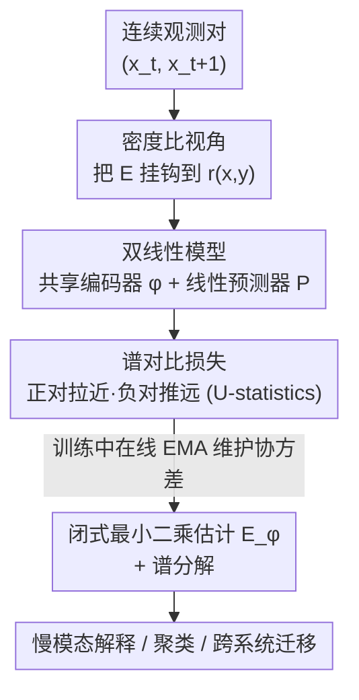

# Self-Supervised Evolution Operator Learning for High-Dimensional Dynamical Systems

**会议**: ICLR 2026  
**OpenReview**: [https://openreview.net/forum?id=Ku3kLJle7Q](https://openreview.net/forum?id=Ku3kLJle7Q)  
**代码**: https://github.com/pietronvll/encoderops  
**领域**: 动力系统 / 算子学习 / 自监督表示学习  
**关键词**: 演化算子, Koopman/迁移算子, 谱分解, 对比学习, 可迁移表示

## 一句话总结
本文把"学习高维动力系统的演化算子"重写成一个**只用编码器的自监督对比学习问题**：用双线性相似度 $\langle\phi(x_t), P\phi(x_{t+1})\rangle$ 去拟合状态转移的密度比，证明它在最优预测器下等价于最小二乘算子估计与负 VAMP-2 分数，从而在蛋白质折叠、药物分子结合、全球气候 ENSO 三类大规模科学系统上自动抽出可解释的慢模态，并能跨系统迁移表示。

## 研究背景与动机
**领域现状**：科学界研究复杂动力系统（蛋白折叠、分子结合、气候）时，传统是从第一性原理写微分方程，但系统一大就算不动也看不懂。随着 TB 级气象数据和每天百万步的分子动力学模拟变成"日用品"，数据驱动方法成主流——其中**演化算子**（确定系统的 Koopman 算子、随机系统的迁移算子）这一范式格外适合"可解释"：它把非线性动力学**线性化**成一个把函数映射到函数的线性算子 $E$，再做**谱分解**，把复杂动力学拆成一组带衰减率 $\rho_i$ 和振荡频率 $\omega_i$ 的相干时空模态，每个模态对应系统内在的一种慢/快过程。

**现有痛点**：现有学习 $E$ 的方法各有短板。核方法（kernel/DMD 家族）有统计保证但难扩展到高维、结构化数据；深度方法里的**编码器-解码器**方案要同时最小化预测误差和重构误差，可强化学习与表示学习的近期工作都表明——重构损失会把特征偏向"近未来预测"，对长程行为和迁移**有害**；而直接最大化 VAMP 分数的编码器方案（如 VAMPNets）需要在损失里做**矩阵求逆**，在大规模场景下数值不稳、反传时梯度容易爆炸。

**核心矛盾**：人们想要的是"既能扩展到高维结构化系统、又数值稳定、还能跨系统迁移"的算子学习，但现有方案在"可扩展性 / 数值稳定 / 可迁移"三者间总是顾此失彼，根子在于损失函数的形式（重构项、矩阵求逆）。

**本文目标**：给出一个端到端、可 GPU 训练、不需要解码器也不需要矩阵求逆的协议，去逼近 $E$ 及其谱分解，并让学到的编码器能迁移到相关系统。

**切入角度**：作者发现演化算子学习与**自监督对比表示学习**之间存在一个深刻联系——把条件期望用重要性采样改写后，$E$ 直接挂钩到状态转移的**密度比** $r(x_t,x_{t+1})=p(x_{t+1}|x_t)/p(x_{t+1})$，而密度比正好可以用对比学习里的双线性相似度去估计。

**核心 idea**：用一个**共享编码器 + 线性预测器**的双线性模型 $\langle\phi(x_t),P\phi(x_{t+1})\rangle$ 去拟合密度比，借助 HaoChen 等人提出的谱对比损失训练；理论上证明它等价于最小二乘算子估计和负 VAMP-2 分数，从而把"算子学习"和"自监督学习"两套机器对齐起来。

## 方法详解

### 整体框架
方法要解决的是：给定动力系统的一串连续观测对 $\{(x_i,y_i)\}$（$y_i\sim p(\cdot|x_i)$ 是 $x_i$ 的下一步），学一个编码器 $\phi$ 和线性预测器 $P$，使得 $\langle\phi(x),P\phi(y)\rangle$ 逼近演化算子作用下的转移结构，训练完再用闭式公式把 $E$ 在 $\phi$ 张成的有限维空间上估计出来、做特征分解拿到谱模态。整体上它就是一套标准自监督流程的"动力系统版"：正样本对是**时间上相邻的一对观测**，负样本对是随机配对的两个观测，编码器学到的特征空间天然对齐到 $E$ 的主奇异子空间。

整条 pipeline 是：原始高维状态 → 图/卷积编码器 $\phi$ + 单纯形归一化 → 双线性相似度 $\langle z_i, q_j\rangle$（$z=\phi(x)$，$q=P\phi(y)$）→ 谱对比 U-statistics 损失 → 训练中在线维护协方差缓冲 → 收尾用最小二乘闭式估计 $E_\phi$ → 特征分解得谱模态 → 下游解释/聚类/迁移。

### 关键设计

**1. 密度比改写：把演化算子接到对比学习的接口上**

痛点是演化算子 $E$ 定义在"对任意函数取条件期望"上，直接学很抽象。作者把条件期望用对未来分布 $P(X_{t+1})$ 的重要性采样估计改写：

$$(Ef)(x_t)=\mathbb{E}_{y\sim X_{t+1}}\!\left[\frac{p(y|x_t)}{p(y)}f(y)\right],$$

这一步把 $E$ 和密度比 $r(x_t,x_{t+1})=p(x_{t+1}|x_t)/p(x_{t+1})$ 直接绑定。密度比的意义很直观：它衡量"已知现在是 $x_t$，未来出现 $x_{t+1}$ 比随机出现一个未来状态高多少倍"，正是相邻 vs 随机这对"正/负样本"的相对权重。于是学算子被转译成"估计密度比"，而密度比恰好是对比学习的拿手好戏——这就是全文打通两个领域的关键一招。

**2. 共享编码器 + 线性预测器的双线性参数化：让 P 直接就是算子在 φ 子空间上的限制**

把密度比建模成双线性形式 $r(x,y)\approx\langle\phi(x),P\phi(y)\rangle$，最小化 L2 误差并用 U-statistics 估计平方项，得到经验损失

$$\hat\varepsilon(\phi,P)=\frac{1}{N(N-1)}\sum_{i\ne j}\langle\phi(x_i),P\phi(y_j)\rangle^2-\frac{2}{N}\sum_{i=1}^N\langle\phi(x_i),P\phi(y_i)\rangle.$$

第一项压低随机配对（负对）的相似度，第二项拉高相邻配对（正对）的相似度——形式上就是 HaoChen 等人的谱对比损失。本文刻意做了两个选择：**两端共享同一个编码器** $\phi$（而非更宽松的 $\langle\phi(x_t),\psi(x_{t+1})\rangle$），并保留一个**线性预测器** $P$。这两点不是随意的：作者证明 $P$ 恰好把 $E$ 限制到 $\phi$ 张成的有限维函数空间上，$(Ef)(x_t)=\langle\phi(x),PC_Yw\rangle$（$C_Y$ 是未来态的协方差）。换句话说，预测器 $P$ 不是辅助 trick，它**就是**待学的算子矩阵本身——这让对比训练完直接拿到算子，而不是再额外拟合。

**3. 与最小二乘 / VAMP-2 的等价：理论保证 + 免矩阵求逆的稳定性**

作者给出三条桥接定理把这套损失钉在算子学习理论上。Lemma 1：当 $E$ 是 Hilbert-Schmidt 算子时，损失等价于算子回归损失 $\varepsilon(\phi,P)=\|E-\sum_{i,j}\phi_i\otimes P_{ij}\phi_j\|_{HS}^2$。Lemma 2：固定 $\phi$ 时最优预测器有闭式 $P^*=C_X^{-1}C_{XY}C_Y^{-1}$，代回去得到的算子估计 $E_\phi=P^*C_Y=C_X^{-1}C_{XY}$，正是 $\lambda\to0$ 的最小二乘估计 (3)。Lemma 3：在最优 $P^*$ 下，$\varepsilon(\phi,P^*)=-\|C_X^{-1/2}C_{XY}C_Y^{-1/2}\|_{HS}^2=-\text{VAMP2}(\phi)$，即损失等于**负 VAMP-2 分数**。关键差别在于：VAMPNets 这类直接最大化 VAMP 的方法，损失里带矩阵求逆 $C^{-1/2}$，大规模下不稳、反传易梯度爆炸；而本文损失 (8) 只含简单的矩阵乘法，天生适合 GPU。它既拿到了 VAMP 的理论目标，又绕开了求逆的数值病。

### 损失函数 / 训练策略
训练就是 Alg. 1 的标准 SSL 循环：每步采一个 batch 的相邻观测对，过编码器得 $z_i=\phi(x_i)$、$q_i=P\phi(y_i)$，算相似度矩阵 $r_{ij}=\langle z_i,q_j\rangle$，对损失 $\frac{1}{B(B-1)}\sum_{i\ne j}r_{ij}^2-\frac{2}{B}\sum_i r_{ii}$ 求梯度更新 $\phi,P$。实现细节：编码器输出做**单纯形归一化**（simplicial normalization）；为贴近理论，**不额外接投影头**；$P$ 保持线性（因 Lemma 2 的等价性，理论上够用，但也可换成小 MLP）。收尾估计 $E_\phi$ 时，不在训练后对全数据集再做一次前向（大问题下不现实），而是训练中用**指数滑动平均在线维护协方差缓冲 $C_X,C_{XY}$**，结束时直接用缓冲算闭式 (3)——附录验证在线协方差能收敛到准确值、结果与重算持平甚至略好。

## 实验关键数据

实验跨分子动力学与气候两大域，重点是"能否分解复杂动力学 + 表示能否泛化迁移"，评估偏定性（作者也坦言谱分解精度尚无标准 benchmark）。

### 主实验

| 实验 | 系统 / 数据 | 编码器 | 关键结果 |
|------|------------|--------|----------|
| 蛋白折叠 | Trp-Cage（全 144 重原子，非 20 个 Cα 粗粒化） | SchNet 图网络 | 主特征函数 $\Psi_1$ 与 RMSD 强相关，清晰分开折叠/未折叠态；implied timescale 高于 LoRA / VAMP / DPNets 基线（越高=越好地逼近真实慢动力学） |
| 分子结合 | Calixarene 主-客系统，配体 G1/G2/G3 | SchNet | $\Psi_1$ 捕到半结合↔全结合、$\Psi_2$ 捕到未结合↔结合；定位到"水分子占据结合口袋"这一动力学瓶颈，与已知文献吻合 |
| 全球气候 | SST* 海温异常（ORAS5/ChaosBench 仅 540 帧 + CESM 仿真 12,598 帧） | CNN | 第二主模态自动还原 ENSO，右特征函数与 ONI 指数 $r=0.82\,(p<.001)$，并在验证集成功检出 2023 El Niño |

### 迁移 / 消融分析

| 配置 | 关键指标 | 说明 |
|------|---------|------|
| 结合-迁移 | 冻结编码器 (G1+G3 训练) → 分析 G2 | 未见过 G2 仍还原其进入空腔与最终锁定的关键模态，迁移特征几乎贴合 from-scratch |
| 气候-直接训练真实数据 | ENSO 右特征函数 vs ONI $r=0.71$ | 真实数据样本太少（540 帧），相关性弱于迁移方案的 $r=0.82$ |
| 气候-vs 基线 | 与 VAMPNets / DPNets 比 | 本文在捕捉 ENSO 模态上相关性更强（附录 B.4） |
| 在线协方差 vs 重算 | 谱估计结果 | 在线 EMA 缓冲收敛准确，结果持平或略优于训练后重算 |

### 关键发现
- **去掉解码器反而更好**：纯编码器 + 谱对比损失，专注逼近 $E$ 的主奇异子空间，比编码器-解码器方案更利于长程结构和迁移——印证了 RL/感知领域"重构特征不可迁移"的观察。
- **迁移学习是稀缺数据下的救星**：气候只有 540 帧观测时直接训练效果弱（$r=0.71$），改用 12,598 帧仿真预训练再迁移到真实数据，相关性升到 $r=0.82$，说明"用大规模高质量仿真补观测数据之缺"这条路走得通。
- **高维表示带来更细的物理解释**：把 Trp-Cage 从 20 个 Cα 升到全 144 重原子后，对 $\Psi_1$ 做稀疏 LASSO 回归到氢键描述子，能识别出粗粒化模型看不见的侧链氢键网络。

## 亮点与洞察
- **一个等式连起两个世界**：把演化算子的条件期望用重要性采样改写成密度比，瞬间让对比学习损失变成算子学习损失——这是"借力"思路的范本，把成熟的 SSL 工程（GPU 友好、无求逆）直接搬过来。
- **预测器 P 不是配角而是主角**：刻意保留线性 $P$ 并证明它就是 $E$ 在 $\phi$ 子空间上的限制矩阵，使得"训练对比模型"和"得到算子"是同一件事，省掉额外的算子拟合步骤。
- **免矩阵求逆拿到 VAMP-2**：等价于负 VAMP-2 但损失只含矩阵乘法，这个 trick 可迁移到任何"想最大化 VAMP/做线性算子 SVD 又怕求逆不稳"的场景。
- **在线 EMA 协方差**：避免大数据集训练后再全量前向算协方差，是把闭式估计工程化落地的实用细节。

## 局限与展望
- 作者承认评估**偏定性**：缺少专门针对谱分解精度的标准 benchmark，难做严格量化横评。
- 三个实验的迁移结论建立在"源系统与目标系统动力学相近"的假设上（同类配体、同源气候仿真），跨度更大时的迁移性未验证。
- 方法假设动力学是 Markov 的；非 Markov 时需先用历史窗口 $c_t^H=f(x_t,\dots,x_{t-H})$ 构造上下文状态，这部分本文没深入。
- 作者把控制/RL 应用列为未来工作——谱分解对降阶建模和控制天然有用，但本文未实测。

## 相关工作与启发
- **vs 编码器-解码器 Koopman 自编码器**（Lusch et al. / Azencot et al.）：他们靠重构损失训特征、偏向近未来预测；本文纯编码器、靠谱对比损失逼近主奇异子空间，长程与迁移更好。
- **vs VAMPNets**（Mardt et al. 2018）：同样冲着 VAMP 分数，但 VAMPNets 损失含矩阵求逆、数值不稳；本文等价于负 VAMP-2 却只用矩阵乘法，GPU 友好。
- **vs LoRA 算子方法**（Jeong et al. 2025）：用相似损失但**不共享** $x_t,x_{t+1}$ 的编码器；本文共享编码器 + 线性预测器，理论上恢复最小二乘估计，implied timescale 更高。
- **vs DPNets**（Kostic et al. 2024b）：最小化不同损失；气候实验里本文捕捉 ENSO 的相关性更强。

## 评分
- 新颖性: ⭐⭐⭐⭐⭐ 把演化算子学习与自监督谱对比损失通过密度比严格等价起来，理论与工程双赢
- 实验充分度: ⭐⭐⭐⭐ 跨蛋白/分子/气候三域且验证迁移，但评估偏定性、缺谱精度量化 benchmark
- 写作质量: ⭐⭐⭐⭐⭐ 从动机到三条桥接定理逻辑清晰，理论铺垫扎实
- 价值: ⭐⭐⭐⭐⭐ 给科学动力系统的可解释数据驱动分析提供了稳定可扩展可迁移的统一工具

<!-- RELATED:START -->

## 相关论文

- [\[ICLR 2026\] Physics-Informed Inference Time Scaling for Solving High-Dimensional Partial Differential Equations via Defect Correction](physics-informed_inference_time_scaling_for_solving_high-dimensional_partial_dif.md)
- [\[ICML 2026\] Unbiased and Second-Order-Free Training for High-Dimensional PDEs](../../ICML2026/physics/unbiased_and_second-order-free_training_for_high-dimensional_pdes.md)
- [\[AAAI 2026\] Just Few States are Enough: Randomized Sparse Feedback for Stability of Dynamical Systems](../../AAAI2026/physics/just_few_states_are_enough_randomized_sparse_feedback_for_stability_of_dynamical.md)
- [\[NeurIPS 2025\] AstroCo: Self-Supervised Conformer-Style Transformers for Light-Curve Embeddings](../../NeurIPS2025/physics/astroco_self-supervised_conformer-style_transformers_for_light-curve_embeddings.md)
- [\[ICLR 2026\] Operator Learning with Domain Decomposition for Geometry Generalization in PDE Solving](operator_learning_with_domain_decomposition_for_geometry_generalization_in_pde_s.md)

<!-- RELATED:END -->
