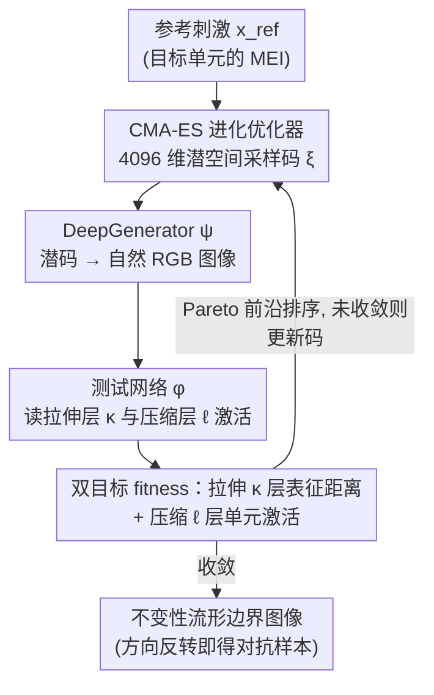

# Stretching Beyond the Obvious: A Gradient-Free Framework to Unveil the Hidden Landscape of Visual Invariance

**会议**: ICLR 2026  
**arXiv**: [2506.17040](https://arxiv.org/abs/2506.17040)  
**代码**: [GitHub](https://github.com/zoccolan-lab/SnS)  
**领域**: 可解释性  
**关键词**: visual invariance, gradient-free optimization, adversarial examples, feature visualization, CNN interpretability, robust models

## 一句话总结

提出 Stretch-and-Squeeze（SnS）算法，一个无梯度、模型无关的双目标优化框架，通过在不同处理层级"拉伸"表征同时"压缩"目标单元激活来系统性地探测视觉系统的不变性流形，揭示了标准与鲁棒 CNN 之间不变性可解释性的分层差异。

## 研究背景与动机

理解视觉处理单元（无论是生物神经元还是 CNN 单元）编码了哪些特征组合，是视觉科学和深度学习的核心问题。现有方法的局限：

**最大激励图像（MEI）**方法只能找到少量强激活刺激，无法揭示单元在哪些变换下保持不变——而不变性对泛化至关重要

**Metamers**（表征匹配）方法在给定层严格匹配表征，只探索目标图像附近的窄邻域

**预定义变换测试**（旋转、平移、缩放等）无法发现单元实际学习到的不变轴
4. 基于梯度的方法无法应用于"黑箱"系统（如生物神经元）

SnS 的核心创新在于：通过**最大化**某个表征层的刺激距离同时**保持**目标单元激活，系统性地采样不变性流形的边界。

## 方法详解

### 整体框架

SnS 把"探测不变性"重写成一个双目标搜索问题：固定一个参考刺激（通常取目标单元的最大激励图像 MEI），让搜索同时拉开某一表征层的距离、又压住目标单元的激活，逼近的解就落在不变性流形（invariance manifold）的边界上。整个流程是一条闭环 pipeline，跑在预训练深度生成器 DeepGenerator $\psi$ 的 4096 维潜在空间里：进化优化器 CMA-ES 在潜空间里采样一批码 $\xi$，$\psi$ 把每个码映射成自然 RGB 图像，被分析的视觉系统 $\phi$ 对图像给出拉伸层 $\kappa$ 和压缩层 $\ell$ 的激活，双目标 fitness 据此打分，优化器按 Pareto 前沿排序再生成下一批码，迭代直到收敛。全程不碰 $\phi$ 的梯度，因此对生物神经元这类黑箱同样适用；把双目标的方向一交换，同一套搜索就从找不变图像变成造对抗样本。

### 关键设计

**1. 双目标"拉伸—压缩"：把不变性变成一对对抗目标**

单目标地"保持激活不变"只会停在参考点附近，看不到不变性能延伸多远。SnS 给两层分别定义方向相反的目标：在拉伸层 $\kappa$ 用 $\mathcal{L}_{\text{stretch}}^{\kappa}=-\|\mathbf{a}^{\kappa}-\mathbf{a}_{\text{ref}}^{\kappa}\|_2$ 把表征推远，在压缩层 $\ell$ 用 $|a_u^{\ell}-a_{\text{ref}}^{\ell}|$ 把目标单元激活钉住。不变性搜索就是这对目标的 Pareto 最优化：

$$\Xi_{\text{inv}} = \arg\min_{\mathbf{x}} \left[\mathcal{L}_{\text{stretch}}^{\kappa}\bigl(\Gamma(\mathbf{x}, \phi^{\kappa}), \Gamma(\mathbf{x}^{\star}, \phi^{\kappa})\bigr), \; |a_u^{\ell} - a_{\text{ref}}^{\ell}|\right]$$

即在层 $\kappa$ 尽量远离 MEI 的表征、同时让层 $\ell$ 的单元激活几乎不动，得到的就是"看起来很不一样、单元却照样发放"的不变图像。把两个目标的方向一交换——最小化 $\kappa$ 层距离、最大化 $\ell$ 层激活变化——同一套搜索立刻变成对抗攻击：图像几乎没变、单元却被骗到失活。不变性和对抗这对看似对立的现象，被收进了同一个优化框架的两个角落。

**2. 选择拉伸层 $\kappa$：在哪一层拉，决定看到哪种不变性**

不变性不是单一的，它依抽象层级而不同。SnS 把框架图里那个"拉伸层 $\kappa$"当成一个可调旋钮：$\kappa=0$ 直接在像素空间拉伸，搜出来的主要是亮度、对比度这类低层变化；$\kappa$ 取中间卷积层时，得到的是纹理和颜色的改写；$\kappa$ 取深层卷积层时，则浮现视角、姿态这类高层不变。同一个单元换不同的 $\kappa$ 反复探测，就能把它从亮度到姿态的整条不变性谱系展开，这也是后续用 PCA+SVM 区分"不同层不变图像"的基础。

**3. 无梯度 + 生成先验：既能进黑箱，又不退化成噪声**

框架图里"CMA-ES 优化器"和"DeepGenerator $\psi$"这两环，正是 SnS 同时做到模型无关又不塌成噪声的关键。搜索完全交给 CMA-ES，按 Pareto 支配关系对解集排序、维护前沿，不需要 $\phi$ 可微，因而能直接套到不可导的系统上。同时搜索被约束在 DeepGenerator 的 4096 维潜空间内，自然图像先验充当正则项，使解保持在"像照片"的流形上，避免像无约束像素优化那样塌成对抗噪声。这两点合起来，让 SnS 既保住了真正的模型无关性，又保证产出的不变图像对人和网络都还有可观察的语义。

## 实验关键数据

### 主实验

**SnS 有效性验证**（77 个 $L_2$-鲁棒 ResNet50 读出单元）：

| 指标 | 对抗图像 | 不变图像 |
|------|---------|---------|
| 激活下降（相对 MEI） | 111% ± 7% | 34% ± 11% |
| $L_2$ 像素距离 | 72 ± 12 | 271 ± 32 |
| 对比仿射变换 | — | 显著超越旋转/平移/缩放 |

SnS 发现的不变图像比仿射变换更"极端"（像素距离更大），同时对目标单元的激活影响更小。

**分层不变性的可区分性**：

使用 PCA + SVM 分类器区分不同拉伸层产生的不变图像：
- 标准 ResNet50：几十个主成分即可达到近完美分类
- 鲁棒 ResNet50：达到 80%+ 准确率

### 消融实验

**人类与观察者网络的可解释性评估**（12-AFC 分类任务）：

| 条件 | 鲁棒 ResNet50 不变图像 | 标准 ResNet50 不变图像 |
|------|----------------------|----------------------|
| 像素空间拉伸 | 人类可识别（最高） | 人类难识别（最低） |
| 中层拉伸 | 人类可识别（中等） | 人类可识别（中等） |
| 深层拉伸 | 人类可识别（最低） | 人类可识别（最高） |

**关键发现**：鲁棒网络和标准网络的可解释性趋势**完全相反**！

- 鲁棒网络：拉伸越深层，可解释性越低
- 标准网络：拉伸越深层，可解释性越高

### 关键发现

1. **$L_2$ 对抗训练未能增加高层不变性的可解释性**：虽然 MEI 和像素级不变图像的人类识别率很高，但深层不变图像的可解释性差距在逐步缩小
2. **$L_{\infty}$ 鲁棒化效果不同**：其不变图像在所有观察者网络上的可解释性保持稳定甚至随深度增加
3. **ViT 的不变性呈现不同模式**：中层和深层的不变图像非常相似且可解释性高，符合 ViT 学习更全局化特征的观点
4. **对表征子采样鲁棒**：即使只用中间层少量神经元（类比神经科学实验的稀疏记录），SnS 仍能产生有效的不变图像
5. **不变性流形的内在维度**：低层最低、中层最高、深层次之，与已知的 CNN 表征维度趋势一致

## 亮点与洞察

1. **统一框架**：不变性和对抗攻击在同一双目标优化中通过交换拉伸/压缩方向实现，概念上非常优雅
2. **无梯度 = 真正模型无关**：可以直接应用于生物神经元，这是其他方法无法做到的
3. **超越 Metamers**：SnS 推向不变性流形的边界，而 metamers 只在目标图像附近探索；两者互补
4. **分层不变性揭示视觉系统本质**：从亮度→纹理→姿态的渐进不变性，本质上是特征选择性和特征不变性的同一过程的两面
5. **$L_2$ vs $L_{\infty}$ 鲁棒化的差异**为理解对抗训练的本质提供了新视角

## 局限性

1. 依赖预训练生成模型的表达能力——生成模型的先验限制了可探索的图像空间
2. 进化算法的计算成本较高，每个单元需要大量迭代
3. 仅在 ResNet50/ResNet18/VGG16/ViT 上验证，更大规模模型（如 DINO、ViT-22B）未探索
4. 尚未在真实生物神经元上进行闭环验证
5. 生成的不变图像描述过于丰富复杂，难以用简短文本概括

## 相关工作与启发

- 与 XDREAM（Ponce et al., 2019）共享进化优化思路，但扩展到不变性探测
- 与 Feather et al. (2023) 的 metamers 工作互补：metamers 在近距离探索，SnS 在远距离探索
- 对抗训练的视觉系统（robustified CNNs）与人类视觉的对齐在 MEI 层面良好，但在深层不变性层面出现分歧——这为未来的对齐方法提供了新的优化目标
- 启发：可以用 SnS 产生的"好/坏"不变图像来改进训练数据，使网络学习更人类化的不变性

## 评分

- **创新性**: ⭐⭐⭐⭐⭐ — 首个系统性的无梯度不变性探测框架，双目标优化设计优雅
- **实验充分性**: ⭐⭐⭐⭐ — 覆盖标准/鲁棒 CNN、ViT、人类实验，分析全面
- **实用性**: ⭐⭐⭐⭐ — 对计算神经科学有直接价值，对 AI 可解释性研究启发性强
- **写作质量**: ⭐⭐⭐⭐ — 方法描述清晰，图表质量高
- **综合评分**: ⭐⭐⭐⭐ (4/5)

<!-- RELATED:START -->

## 相关论文

- [\[ICML 2026\] Loss Landscape Diagnosis for Gradient-Based Gray-Scott System Inversion: Disentangling the Roles of PINN Components](../../ICML2026/physics/loss_landscape_diagnosis_for_gradient-based_gray-scott_system_inversion_disentan.md)
- [\[ICLR 2026\] VisionLaw: Inferring Interpretable Intrinsic Dynamics from Visual Observations via Bilevel Optimization](visionlaw_inferring_interpretable_intrinsic_dynamics_from_visual_observations_vi.md)
- [\[ICLR 2026\] MoMa: A Simple Modular Learning Framework for Material Property Prediction](moma_a_simple_modular_learning_framework_for_material_property_prediction.md)
- [\[ICLR 2026\] From Cheap Geometry to Expensive Physics: A Physics-agnostic Pretraining Framework for Neural Operators](from_cheap_geometry_to_expensive_physics_a_physics-agnostic_pretraining_framewor.md)
- [\[ICLR 2026\] Beyond Structure: Invariant Crystal Property Prediction with Pseudo-Particle Ray Diffraction](beyond_structure_invariant_crystal_property_prediction_with_pseudo-particle_ray_.md)

<!-- RELATED:END -->
