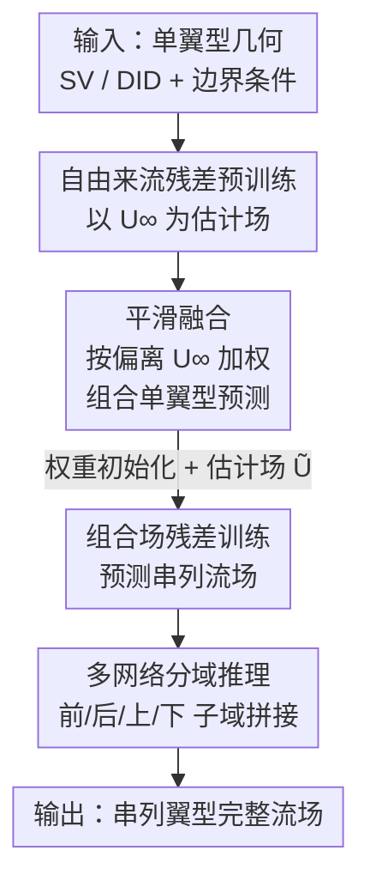

# TandemFoilSet: Datasets for Flow Field Prediction of Tandem-Airfoil Through the Reuse of Single Airfoils

**会议**: ICLR 2026  
**OpenReview**: [https://openreview.net/forum?id=4Z0P4Nbosn](https://openreview.net/forum?id=4Z0P4Nbosn)  
**领域**: 科学机器学习 / CFD 流场预测 / 数据集  
**关键词**: 串列翼型, 流场预测, 课程学习, 残差训练, 图神经网络

## 一句话总结
本文发布了首个**串列翼型（tandem-airfoil）流场预测数据集 TandemFoilSet**（8104 个 CFD 算例，其中 4152 个为串列构型，并配对了对应的单翼型数据），并提供了一套以"复用单翼型数据"为核心的课程学习 benchmark——用自由来流（freestream）作物理先验做残差预训练、把多个单翼型预测做平滑融合（smooth-combining）当估计场、再用多网络（multi-NN）分域推理，平均把 GNN baseline 的预测误差降低约 65%。

## 研究背景与动机
**领域现状**：用神经网络（尤其是图神经网络 GNN）加速 CFD 流场预测已经是成熟方向，编码器-处理器-解码器架构、多尺度图卷积等都被反复验证。但这些工作几乎全部聚焦于**单物体**场景（单个翼型、单个水翼），并且依赖大量仿真数据。

**现有痛点**：真实工程里的复杂几何（高升力机翼缝翼、风场尾流、压气机叶片、赛车尾翼）大多由多个简单形状**串联组装**而成，也就是"串列构型"——前后两个翼型的流场会强烈相互作用。可串列构型的网络预测几乎无人研究，更关键的是**没有公开数据集**：现有公开数据要么只有单体流，要么虽是多几何但**没有配对对应的单体算例**，导致"复用已有单体数据来加速多体预测"这件事根本无从下手。

**核心矛盾**：工业界其实已经积累了海量单翼型/单水翼仿真数据，这是一笔现成资产；但多体串列的高保真仿真（需要更高网格分辨率、更大计算域）极其昂贵。如何**把廉价的单体数据迁移过来、撬动昂贵的多体预测**，既缺数据支撑也缺方法范式。

**本文目标**：(1) 造出第一个串列翼型数据集，且**单体与串列成对**，让"复用单体"成为可研究的问题；(2) 给出一套能真正利用单体数据 + 物理先验的 benchmark 流程。

**切入角度**：作者抓住流体力学的一个基本分解——任意流速可写成 $U = U^\infty + U'$，即"自由来流 $U^\infty$ + 物体引起的扰动 $U'$"。这意味着**自由来流是一个几乎免费、却对大部分流场都成立的好估计**，而单翼型的预测结果又可以被组合起来逼近串列流场。

**核心 idea**：先在单翼型上做"以自由来流为估计场"的残差预训练，再把多个单翼型预测**按"偏离自由来流的程度"加权平滑融合**成串列流场的廉价估计，最后用这个估计做残差训练 + 多网络分域推理，把单体知识层层迁移到串列预测。

## 方法详解

### 整体框架
整个 benchmark 是一条"单翼型 → 串列翼型"的课程学习管线，把廉价的单体知识分四步迁移到昂贵的多体预测：

1. **单翼型残差预训练**：训一个 GNN 从几何表示（SV/DID）+ 边界条件预测单翼型流场，并以自由来流 $U^\infty$ 作为残差训练的估计场（estimate field）。
2. **平滑融合（smooth-combining）**：用预训好的网络分别预测两个单翼型的流场，再按"各自偏离自由来流的程度"加权融合，得到串列流场的初步估计 $\tilde{U}$。
3. **权重迁移**：把单几何模型的权重用来初始化多几何（串列）模型。
4. **组合场残差训练 + 多网络推理**：以平滑融合场 $\tilde{U}$ 为估计场，对串列模型做残差训练；推理时把整个计算域切成前/后/上/下子域，每个子域用一个专门的 NN 预测，重叠区由最新预测覆盖。

几何输入沿用并扩展了 SV（shortest vector，节点到几何的最短向量）和 DID（directional integrated distance，按角度分段统计节点到几何的平均距离）两种表示——这是 DID **首次**用于多物体场景。

### 关键设计

**1. 平滑融合：用"偏离自由来流的程度"把多个单翼型流场拼成串列估计**

要把单体预测变成多体的廉价估计，最朴素的做法是简单平均，但这会抹掉每个翼型在其主导区域的真实影响。作者的做法是给参与融合的 $L$ 个场逐节点加权：$\tilde{y}(i) = \sum_l \gamma_l(i)\, y_l(i)$，权重按各场对参考场 $y_0$ 的绝对偏离归一化，$\gamma_l(i) = \frac{|y_0(i) - y_l(i)|}{\sum_k |y_0(i) - y_k(i)|}$。融合流场时取 $y_0 = U^\infty$（无内部几何的自由来流），于是权重退化为 $\gamma_l(i) = \frac{|U'_l(i)|}{\sum_k |U'_k(i)|}$，即**谁对自由来流的扰动越大，谁在该节点的话语权越重**。

这个设计直接呼应 $U = U^\infty + U'$ 的物理分解：靠近前翼的节点扰动主要来自前翼，融合后自然偏向前翼的预测；远场两者都接近自由来流时权重趋于 $1/L$、融合场精确回到 $U^\infty$。它几乎零额外成本（自由来流是解析已知的），却保留了两个翼型各自的影响，是后续残差训练估计场的来源。

**2. 自由来流残差预训练：把"免费的物理先验"当作残差基准**

残差训练（源自图像超分）的思路是让网络只学"真值减去某个估计场"的残差，从而降低学习难度，损失为 $\tilde{L} = \alpha\, L(U^{gt}, \hat{U} + \tilde{U}^{est})|_{\text{boundary}} + L(U^{gt}, \hat{U} + \tilde{U}^{est})|_{\text{internal}}$，其中 $\alpha$ 加权边界单元。以往 CFD 残差学习的估计场 $\tilde{U}^{est}$ 是一张**低分辨率仿真**——但低分辨率结果仍要跑物理求解器，并不便宜。

本文创新地令 $\tilde{U}^{est} = U^\infty$：直接用自由来流当估计场。因为 $U = U^\infty + U'$ 决定了自由来流在绝大部分远场区域都是可靠近似，网络只需补上物体附近的扰动 $U'$。自由来流无需任何仿真、成本极低。这套预训练既产出用于平滑融合的单翼型预测，其权重又用来初始化串列模型——把物理先验一次性注入到两个环节。

**3. 多网络分域推理：让每个网络只面对"至多一个翼型"**

直接让一个网络在只见过单翼型的前提下去预测串列流场，难度过大（分布外、两体耦合）。作者借鉴 CFD 的区域分解思想，把计算域切成**前、后、上、下**四个带重叠的子域，每个子域训一个专门 NN：先预测前场（入口值作为入口节点特征，其余置零），再把前/后重叠区的预测作为输入特征去预测后场，依次推进到上下场，最后拼接、重叠区用最新预测覆盖。

这样每个 NN 实际只需处理"至多一个翼型"的局部流场，大幅缓解了单体到多体的跨域困难，也省内存。子域之间通过重叠区传递信息，类似 CFD 的域分解保证跨域一致性；上下场还可用自由来流/插值等更省的策略代替，甚至按需省略某些子域，灵活适配不同应用。

**4. 多物体 DID：用"偏离最大值"近似复杂的方向距离编码**

DID 把节点到几何的方向距离编码进节点特征，但其精确数值计算随物体数增加而急剧变复杂、耗时。作者复用了平滑融合的同一套加权思路来近似多物体 DID：令参考场 $y_0 = d_{max}$（最大距离上限），各单物体 DID 场作为 $y_l$ 按偏离 $d_{max}$ 加权组合，从而在显著更短的时间内得到多几何的 DID 估计表示，保证了多物体设置下几何编码的计算效率。

### 损失函数 / 训练策略
核心损失即上文残差损失 $\tilde{L}$，对边界单元用 $\alpha$ 加权、内部单元正常计权；两处残差训练分别采用不同估计场——单翼型阶段用自由来流 $U^\infty$，串列阶段用平滑融合场 $\tilde{U}$，二者都不依赖低分辨率仿真。数据集按 8:1:1 划分训练/验证/测试。

## 实验关键数据
评测用了 TandemFoilSet 的 5 个数据集，两种代表性 GNN 架构：MeshGraphNet（MGN）和 invariant edge-GCNN（IVE），通过四组实验分别验证 DID、各训练方案、多网络推理与整体框架。

### 主实验（消融，MSE ×10⁻²，相对 baseline 提升）

| 模型 / 数据集 | Cruise AOA=0° | Cruise AOA=5° | Takeoff | 平均提升 |
|--------------|--------------|--------------|---------|---------|
| MGN (baseline) | 1.03 | 1.34 | 3.74 | - |
| MGN + PRE（仅预训练初始化） | 1.04 | 1.21 | 3.69 | 3.6% |
| MGN + PRE-FREE + COMB | 0.42 | 0.74 | 1.31 | 56.3% |
| MGN + RES-FREE + RES-COMB | 0.49 | 0.68 | 1.24 | 55.9% |
| MGN + PRE-RES-FREE + RES-COMB（完整） | 0.45 | 0.67 | 1.12 | **58.5%** |
| IVE (baseline) | 0.85 | 1.05 | 2.53 | - |
| IVE + PRE-RES-FREE + RES-COMB（完整） | 0.52 | 0.63 | 0.83 | 48.8% |

### 其它关键实验

| 实验 | 设置 | 关键结果 |
|------|------|---------|
| Exp1：DID 有效性 | MGN ± DID，Cruise AOA=0° | 加 DID 使 MSE 降 **91.1%**（1.03 vs 11.51）；Takeoff 降 54.2% |
| Exp3：多网络推理 | 单 NN vs 多 NN，Cruise AOA=0° | 多 NN 把误差降 **70%**（0.45 vs 1.51） |
| Exp4：变流况泛化 | Cruise Random / Race Car | MSE 分别降最高 **94%** 和 **65%** |
| Tab4：气动量 | Cl/Cd/边界单元 MSE | 完整模型把误差降最高近 **80%**，复杂的 Takeoff 流场增益最大 |

### 关键发现
- **平滑融合场是增益主力**：无论作输入特征还是残差估计场，后三个用到 COMB/RES-COMB 的方案都显著优于只做权重初始化的 PRE，单做 PRE 几乎无提升（MGN +3.6%，IVE 甚至 -7.9%）。
- **两套残差训练联合最稳**：自由来流残差与组合场残差单独都有效，但合用（PRE-RES-FREE + RES-COMB）在三数据集上表现最一致。
- **MGN 比 IVE 更吃这套方案**（平均提升 >55%），故后续实验聚焦 MGN。
- **越复杂越受益**：含地面效应的 Takeoff、高雷诺数变流况的场景提升幅度最大，说明方法在真正困难的耦合流场上更有价值。

## 亮点与洞察
- **把物理分解 $U = U^\infty + U'$ 同时变成三件武器**：自由来流既当残差估计场（省掉低分辨率仿真）、又当平滑融合的参考场（决定加权）、还隐含在数据集设计里——一个物理原理贯穿全流程，非常优雅。
- **"复用单体数据"被做成可复现的范式**：单体/串列成对发布 + 平滑融合，给"已有单物体仿真资产 → 多物体预测"提供了第一个可 benchmark 的路径，可迁移到水翼系统、风场尾流等任何"简单形状组装成复杂几何"的工程场景。
- **同一套"按偏离参考量加权"的 trick 复用两次**：既拼流场（偏离 $U^\infty$）又拼 DID（偏离 $d_{max}$），说明这个加权融合是个通用、低成本的组合算子。

## 局限与展望
- **仅限两体串列、2D**：数据集和方法目前都围绕前后两个翼型的 2D 构型，三体以上、3D 真实几何的扩展尚未验证，DID 的多物体数值计算也随物体数继续变难。
- **多网络分域依赖几何先验**：前/后/上/下的切分与入口边界绑定在预设几何布局上，换一类几何排布可能需要重新设计分域策略；实验中上下场还因显存被裁掉。
- **变流况下误差明显上升**：Cruise Random / Race Car 的 MSE 显著高于固定低雷诺数场景（作者归因于未同步扩大数据集/模型规模），高雷诺数湍流的泛化仍有空间。
- **改进方向**：把平滑融合 + 残差训练推广到多体、3D，并探索自适应的域分解；用更大模型/数据补齐变流况差距。

## 相关工作与启发
- **vs 传统 CFD 残差学习（Jessica et al. 2024 等）**：他们用低分辨率仿真当残差估计场，仍需跑物理求解器；本文用解析的自由来流当估计场，成本几乎为零，且首次落到串列两体场景。
- **vs 公开单体数据集（Bonnet et al. 2022 等）**：现有公开数据只有单体流，或多几何但不配对单体；TandemFoilSet 首次提供单体↔串列成对数据，使"复用单体"成为可研究问题。
- **vs 物理先验注入（PINN / Raissi et al. 2019）**：PINN 把物理方程塞进损失、且多在无内部物体场景验证；本文不改损失而是把物理（自由来流分解）做成估计场与几何编码，直面两体耦合。

## 评分
- 新颖性: ⭐⭐⭐⭐⭐ 首个串列翼型成对数据集 + 首次把自由来流当残差估计场、DID 首次用于多物体
- 实验充分度: ⭐⭐⭐⭐ 四组实验覆盖 DID/训练方案/多网络/变流况，两种 GNN 架构，但仅限 2D 两体
- 写作质量: ⭐⭐⭐⭐ 物理动机贯穿、流程清晰，部分细节散落附录
- 价值: ⭐⭐⭐⭐⭐ 为"复用单体数据加速多体 CFD 预测"提供数据集与 benchmark，工程意义明确

<!-- RELATED:START -->

## 相关论文

- [\[NeurIPS 2025\] High-order Equivariant Flow Matching for Density Functional Theory Hamiltonian Prediction](../../NeurIPS2025/physics/high-order_equivariant_flow_matching_for_density_functional_theory_hamiltonian_p.md)
- [\[ICLR 2026\] MoMa: A Simple Modular Learning Framework for Material Property Prediction](moma_a_simple_modular_learning_framework_for_material_property_prediction.md)
- [\[ICLR 2026\] Physics vs Distributions: Pareto Optimal Flow Matching with Physics Constraints](physics_vs_distributions_pareto_optimal_flow_matching_with_physics_constraints.md)
- [\[ICLR 2026\] OXtal: An All-Atom Diffusion Model for Organic Crystal Structure Prediction](oxtal_an_all-atom_diffusion_model_for_organic_crystal_structure_prediction.md)
- [\[ICLR 2026\] Advancing Universal Deep Learning for Electronic-Structure Hamiltonian Prediction of Materials](advancing_universal_deep_learning_for_electronic-structure_hamiltonian_predictio.md)

<!-- RELATED:END -->
