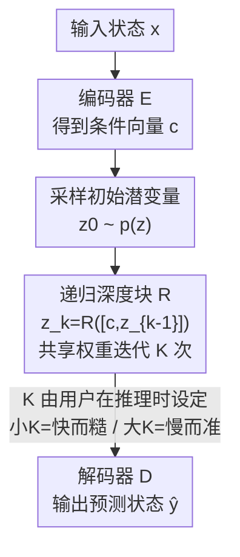

# Test-Time Accuracy-Cost Control in Neural Simulators via Recurrent-Depth

**会议**: ICLR 2026  
**OpenReview**: [https://openreview.net/forum?id=U2j9ZNgHqw](https://openreview.net/forum?id=U2j9ZNgHqw)  
**代码**: 无（论文承诺开源，发表时未给链接）  
**领域**: AI for Science / 神经 PDE 模拟器  
**关键词**: 神经模拟器, 精度-成本权衡, 递归深度, 自适应计算, 不动点

## 一句话总结
本文提出 RecurrSim（Recurrent-Depth Simulator）——一个与具体网络结构无关的"编码器 + 递归深度块 + 解码器"框架，让训练好的神经 PDE 模拟器**在推理时只用一个旋钮 $K$（递归迭代次数）就能滑动地换取精度与计算成本**，无需重训或改结构；在多个流体力学基准上，用更少参数/显存就达到甚至超过更大的基线和扩散类自适应方法。

## 研究背景与动机
**领域现状**：科学计算里"精度换成本"是天经地义的——经典数值方法只要把网格加细、阶数提高、容差降低，就能算得更准但更慢；遗传算法、模拟退火等启发式方法也能靠扩大搜索空间来调这个权衡。神经模拟器（用学到的算子 $G_\theta$ 逼近 PDE 的演化算子 $G$）近年在天气预报、空气动力学等领域展现出"同等精度下更省算力"的潜力。

**现有痛点**：但神经模拟器几乎都是"训练时定死一个精度-成本档位"——模型一旦训完，每次前向都给出同样的期望精度、花同样的成本，用户在推理时**没有旋钮可调**。想要快一点的草稿模拟、或准一点的关键模拟，往往得重新训一个模型。

**核心矛盾**：训练时确实有很多旋钮（数据量、模型大小、训练步数、精度），但这些都"锁死"在了部署之后；而推理时现有的几条自适应路线各有硬伤：Deep Equilibrium（DEQ）靠迭代逼近不动点，但常出现潜变量在不动点附近**震荡而非收敛**，多迭代也不涨分；扩散类模型（ACDM、PDE-Refiner）靠加去噪步数提质，但**很早就 plateau**、对超出训练分布的步数泛化差、且参数/显存开销大，高维问题上直接算不动。

**本文目标**：做一个(1) 推理时可显式、连续调精度-成本，(2) 不挑骨干网络、即插即用，(3) 在高维大规模问题上仍省显存的神经模拟器框架。

**切入角度**：作者观察到经典数值求解（不动点迭代、牛顿法）有个好性质——**前几步修正最大、后续步越来越小但仍有益**。如果让神经模拟器也按这种"逐步收敛到不动点"的方式运转，那么迭代次数 $K$ 就天然成了精度-成本旋钮，并且自带适合科学计算的归纳偏置。

**核心 idea**：把"算多深"从训练期固定改成**推理期可选的递归次数 $K$**——用一个共享权重的递归块反复细化潜变量，训练时随机暴露给各种 $K$，推理时用户自己挑 $K$ 来换精度与成本。

## 方法详解

### 整体框架
RecurrSim 把一个神经模拟器拆成三件套：**编码器 $E$、递归深度块 $R$、解码器 $D$**。给定当前物理状态 $x$，编码器先把它压成一个条件向量 $c = E(x,\theta_E)$；再从固定分布 $p(z)$ 采一个初始潜变量 $z_0$（默认标准正态 $\mathcal{N}(0,I)$）。随后递归块以 $c$ 为条件，**反复迭代 $K$ 次**细化潜变量：

$$z_k = R([c, z_{k-1}], \theta_R),\quad k = 1,\dots,K.$$

迭代完后解码器把最终的 $z_K$ 映回物理状态 $\hat{y} = D(z_K, \theta_D)$。整个东西就是一个标准的端到端监督模型，没有自定义 loss、调度器或 trick。关键在于：**$R$ 的权重在 $K$ 步之间共享**，所以 $K$ 不改变参数量、只改变"算多深"；用户在推理时把 $K$ 调小得到快而糙的模拟、调大得到慢而准的模拟，而前几步的修正量最大、后续步逐渐变小——正是不动点迭代的味道。

### 关键设计

**1. 递归深度块 + 推理期 $K$ 旋钮：把"算多深"交还给用户**

这是全文的支点，直接解决"训练后没有旋钮可调"的痛点。作者不在网络里堆固定层数，而是用**一个权重共享的递归块 $R$** 把潜变量一遍遍喂回自己：$z_k = R([c, z_{k-1}], \theta_R)$。由于每步都把同一个条件向量 $c$ 拼进去再更新，迭代越多、潜变量被细化得越充分。推理时 $K$ 是个自由参数（论文里扫 $K\in\{1,\dots,32\}$），$K$ 小则成本低、精度略糙，$K$ 大则成本高、精度更好。和靠堆层数加深的网络相比，这里**加深不加参数**；和 DEQ 靠"迭代到收敛"相比，RecurrSim 不要求真收敛，而是把任意中间步 $z_k$ 都当作一个合法的"anytime"输出——所以它具备 DEQ 缺的随时可取、随时可停的能力。

**2. 训练时随机采样迭代数 $K$：逼出不动点归纳偏置**

如果训练时只用固定的 $K$，模型就只在那个深度上好用，换个 $K$ 立刻崩。本文的做法是**每个训练样本都从一个分布 $p(K)$ 里现采一个 $K$**，用 Poisson log-normal：

$$\upsilon \sim \mathcal{N}\!\left(\log\bar{K} - \tfrac{1}{2}\sigma^2,\ \sigma\right),\qquad K \sim \mathrm{Poisson}(e^{\upsilon}) + 1,$$

其中 $\bar{K}+1$ 是期望迭代数。这个分布正偏、绝大多数采样落在 $\bar{K}$ 附近，但偶尔会采到很小或很大的 $K$，于是递归块被迫**在浅展开和深展开上都保持稳定**。这样训练出来的块会主动收缩到一个不动点——浅展开给出粗解、深展开持续逼近，前几步修正大、后续步修正小，正好复刻了数值迭代法的行为。经验上 $\bar{K}=32$（$\sigma=0.5$）后性能就饱和，再大边际收益递减。这一设计也是 RecurrSim 能"对 OOD 的 $K$ 泛化"的根源——PDE-Refiner 等方法的步数一旦超出训练范围就退化，而这里见过的 $K$ 谱足够宽。

**3. 截断深度反传（窗口 $B$）：让显存与 $K$ 解耦**

朴素地展开 $K$ 步反传会把每一步的中间激活都存下来，$K$ 大时显存爆炸——这正是高维 3D 问题上扩散类方法算不动的原因。本文用**截断的 backpropagation-through-depth**：只在最后 $B$ 步上传梯度，更早的迭代当作常量不回传。这样显存被钉在 $O(B)$，**与 $K$ 无关**，既能在训练时用大 $K$，又不会撑爆显存。经验上 $B=4$ 就足够，再大只增显存、不涨精度。正是靠这条，0.8B 参数的 RecurrFNO 才能在 26.2 万点的 3D 可压缩 Navier-Stokes 上，用比 1.6B 基线更少的显存（64GB vs 73GB）跑赢对方。

**4. 模块无关 + 条件融合：即插即用**

框架对三件套各自的实现不做限定——编码器/递归块/解码器都可以换成最适合该问题的原语（欧拉网格用卷积、拉格朗日点云用图卷积、规则域用 Fourier 层、Transformer 也行），而训练和推理算法一字不改。论文据此造出 RecurrFNO、RecurrViT、RecurrUPT 三个实例。递归块内部如何把条件 $c$ 融进当前潜变量 $z_k$，作者也做了消融：最简单是直接相加 $z'_k = c + z_k$，更丰富的是带可学习标量权重 $z'_k = \alpha c + \beta z_k$、乃至逐元素权重 $z'_k = \alpha\odot c + \beta\odot z_k$；经验上**逐元素加权相加**在参数效率和性能间最平衡。

### 损失函数 / 训练策略
端到端监督，单步损失就是预测与真值的差 $l_i = \lVert y_i - \hat{y}_i\rVert$，没有任何自定义损失或正则。训练时对每个样本：编码得 $c$ → 采 $z_0$ → 采 $K$ → 展开 $K$ 步递归 → 解码 → 算 loss → 截断窗口 $B$ 内回传。初始潜变量分布 $p(z)$ 影响仅限早期迭代（后期都收敛到不动点附近），为与 DEQ/扩散模型对齐取标准正态。默认配置 $\bar{K}=32$、$B=4$。

## 实验关键数据

### 主实验
在 Burgers、KdV、Kuramoto-Sivashinsky（KS）等流体基准上，RecurrFNO 的轨迹误差随 $K$ 增大而稳步下降并 plateau（Burgers 约 $K=16$、KdV 约 $K=8$），证明 $K$ 是有效的精度-成本旋钮。与其他**推理可调**的自适应模拟器横向比，RecurrFNO 用更少参数拿到最好的精度-成本曲线和最低 plateau：

| 任务 | 对比方法 | 参数对比 | 关键现象 |
|------|---------|---------|---------|
| Burgers | FNO-DEQ / ACDM / PDE-Refiner | RecurrFNO 仅用扩散类一半参数 | 三个对手在 $K\approx4$ 就 plateau；RecurrFNO 持续改进到 $K\approx16$ |
| 长程 KdV | 同上 | 同上 | FNO-DEQ 在不动点附近震荡不收敛；PDE-Refiner 到 $K=11$ 后因 OOD 退化；RecurrFNO 误差最低 |
| KS（混沌） | 同上（对手参数 7×） | RecurrFNO 参数仅 1/7 | 用平均/最差相关时域衡量，ACDM 早早 plateau、PDE-Refiner 最差时域波动剧烈 |

高维与跨架构上（参数/显存效率是亮点）：

| 数据集 | 模型 | 参数 | 关键指标 | 对比 |
|--------|------|------|---------|------|
| 3D 可压 NS（262k 点） | RecurrFNO（$\bar K=8$） | 0.8B / 64GB | Density MSE 7.57e-2 | 胜过 1.6B FNO（7.61e-2），少 13.5% 显存 |
| Active Matter | RecurrViT | 75M（ViT 的 58%） | Steps 0:12 MSE 5.68e-2 | ViT(130M) 为 43.16e-2，误差累积降约 87% |
| ShapeNet-Car | RecurrUPT | 92M（UPT 的 56%） | MSE 2.19e-2 | 优于 UPT(164M) 的 2.31e-2，完美 drop-in |

### 消融实验

| 配置 | 关键发现 | 说明 |
|------|---------|------|
| 反传窗口 $B$ | $B=4$ 后饱和 | 再大只增显存不涨精度，故 $B$ 与 $K$ 解耦控显存 |
| 期望迭代数 $\bar K$ | $\bar K=32,\sigma=0.5$ 后饱和 | 训练 $K$ 谱够宽才换来对 OOD $K$ 的泛化 |
| 条件融合方式 | 逐元素加权相加最优 | 纯相加 / 标量加权 / 投影 / 拼接降维之间折中 |
| 有无 EncDec | RecurrFNO w/ EncDec 更优 | 在编/解码各加一层 Fourier，轨迹误差一致更低 |

### 关键发现
- **不动点归纳偏置是关键**：前几步迭代修正最大、后续递减，与数值迭代法同构；这让小 $K$ 也能给出物理上忠实的解，而非垃圾草稿。
- **省显存的核心是截断反传**：把显存钉在 $O(B)$ 是 0.8B 模型能在 3D NS 上跑赢 1.6B 基线的前提。
- **扩散/DEQ 的硬伤被一一规避**：早 plateau、对 OOD 步数泛化差、不动点震荡、参数敏感——RecurrSim 在这四点上都更好。

## 亮点与洞察
- **把"训练时定死的深度"变成"推理时可选的迭代数"**：一个模型覆盖整条精度-成本曲线，这对需要"先草稿后精修"的科学计算工作流极实用，是最让人"啊哈"的点。
- **截断深度反传让显存与算力深度解耦**：训练敢用大 $K`、显存却只跟 $B$ 走，这个 trick 可直接迁到任何"递归/迭代细化"类模型上控显存。
- **架构无关的三件套设计**：FNO/ViT/UPT 都能无痛包成 Recurr- 版本，说明这是个正交于骨干的"能力插件"，复用性强。

## 局限与展望
- 作者承认相关方法可能被部署在关键应用，但本文不在此类场景部署，回避了安全论证。
- $K$ 旋钮虽连续可调，但**最优 $K$ 仍需用户经验/扫描确定**，论文没给"按输入难度自动选 $K$"的机制——这与 LLM 自适应计算（按 prompt 难度分配算力）相比仍是手动档。
- 横向比较的 plateau 位置（$K\approx4$ vs $16$）跨任务/跨方法不可直接比大小，不同 PDE 的难度与预算不同。
- 改进方向：把 $K$ 做成输入自适应（按局部 stiffness / 误差估计动态分配迭代），或把不动点收敛性给出理论保证。

## 相关工作与启发
- **vs Deep Equilibrium（FNO-DEQ）**: DEQ 求解到不动点、靠最大迭代数/容差控成本，但常在不动点附近震荡不收敛、多迭代不涨分；RecurrSim 不要求真收敛、任意中间步皆可作 anytime 输出，且训练时随机 $K$ 逼出稳定收缩。
- **vs 扩散类（ACDM / PDE-Refiner）**: 它们靠去噪/精修步数控质量，但很早 plateau、对 OOD 步数泛化差、参数/显存重，高维算不动；RecurrSim 用更少参数拿更好曲线，并靠截断反传省显存。
- **vs LLM 自适应计算（recurrent-depth、CoT）**: 借鉴了"按需分配深度"的思想（$p(K)$ 采样也沿用 Geiping et al. 的设定），但落到 PDE 模拟、并加入不动点归纳偏置与截断深度反传这两个科学计算特化。

## 评分
- 新颖性: ⭐⭐⭐⭐ 把"递归深度 = 推理旋钮"干净地引入神经 PDE 模拟器，归纳偏置选得贴合科学计算。
- 实验充分度: ⭐⭐⭐⭐ 覆盖 5 数据集 × 3 骨干 + 与三类自适应方法横向比 + 多组消融，但缺自动选 $K$ 的实验。
- 写作质量: ⭐⭐⭐⭐ 框架清晰、算法伪代码完整，动机与数值方法的类比讲得透。
- 价值: ⭐⭐⭐⭐ 即插即用 + 省显存 + 单模型覆盖整条精度-成本曲线，对 AI for Science 工程落地实用。

<!-- RELATED:START -->

## 相关论文

- [\[ICLR 2026\] Feedback-driven Recurrent Quantum Neural Network Universality](feedback-driven_recurrent_quantum_neural_network_universality.md)
- [\[ICML 2026\] TINNs: Time-Induced Neural Networks for Solving Time-Dependent PDEs](../../ICML2026/physics/tinns_time-induced_neural_networks_for_solving_time-dependent_pdes.md)
- [\[ICLR 2026\] CFO: Learning Continuous-Time PDE Dynamics via Flow-Matched Neural Operators](cfo_learning_continuous-time_pde_dynamics_via_flow-matched_neural_operators.md)
- [\[ICLR 2026\] Orbital Transformers for Predicting Wavefunctions in Time-Dependent Density Functional Theory](orbital_transformers_for_predicting_wavefunctions_in_time-dependent_density_func.md)
- [\[ICLR 2026\] Sublinear Time Quantum Algorithm for Attention Approximation](sublinear_time_quantum_algorithm_for_attention_approximation.md)

<!-- RELATED:END -->
