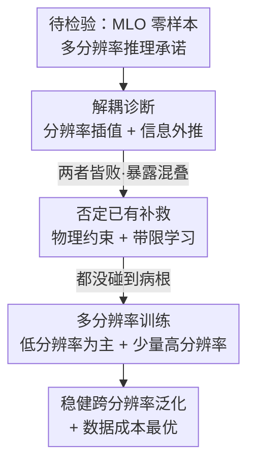

# The False Promise of Zero-Shot Super-Resolution in Machine-Learned Operators

**会议**: ICLR 2026  
**OpenReview**: [https://openreview.net/forum?id=hkF7ZM7fEp](https://openreview.net/forum?id=hkF7ZM7fEp)  
**代码**: https://github.com/msakarvadia/operator_aliasing  
**领域**: 科学机器学习 / 神经算子 / PDE 建模  
**关键词**: Fourier 神经算子, 零样本超分辨, 混叠, 多分辨率推理, PDE 求解算子

## 一句话总结
这篇论文系统证伪了 Fourier 神经算子（FNO）一类机器学习算子（MLO）"零样本超分辨"的承诺——把多分辨率推理拆成"分辨率插值"和"频率信息外推"两个子能力后，发现 FNO 两个都做不到、反而严重混叠，物理约束和带限学习也救不回来；最后提出一个朴素但有效的多分辨率训练协议，用极少的高分辨率数据就能换来稳健的跨分辨率泛化。

## 研究背景与动机

**领域现状**：科学计算的核心难题是用离散采样去建模本质连续的物理系统（如 PDE 描述的流体、扩散）。传统数值方法可以在任意离散化网格上求解，但计算昂贵。机器学习算子（MLO，如 FNO、DeepONet）作为数据驱动的替代品被提出，它们参数化 PDE 解算子 $S_2 = M(S_1)$，并且号称可以在**任意分辨率**上做推理——尤其 FNO 被反复宣称具备"零样本超分辨"能力：在分辨率 $m$ 上训练，就能在更高分辨率 $n > m$ 上准确推理，无需额外高分辨率数据。

**现有痛点**：这个"零样本超分辨"承诺如果成立，吸引力巨大——因为生成和训练高分辨率数据极其昂贵。但作者指出，能在任意离散化上**跑得动**（架构允许）不等于**跑得准**（推理正确）。此前社区把"架构上的连续性"和"实际泛化能力"混为一谈，缺乏对这一承诺的系统性、解耦式检验。

**核心矛盾**：根本症结在于，所有机器学习模型（MLO 也不例外）通常无法泛化到训练数据分布之外。改变测试分辨率本质上就是制造分布外（OOD）输入：模型在固定分辨率上训练，从未见过宽频带或不同采样率的数据，自然无法凭空正确推断这些未见频率——表现为**混叠（aliasing）**，即高频信息被错误地投影到低频基函数上。

**本文目标**：把"多分辨率推理"这个含糊的整体能力拆解成两个可独立验证的子问题——(1) **分辨率插值**：频率信息不变、采样率改变时，模型能否泛化；(2) **信息外推**：采样率不变、频率成分改变时，模型能否外推到未见频率。

**切入角度**：从信号处理和 Whittaker–Nyquist–Shannon 采样定理出发——采样率 $r$ 只能解析到 $r/2$ 的最大频率，高于 $r/2$ 的频率天然是 OOD 任务。用能量谱（energy spectrum）和归一化残差谱作为诊断工具，定量观测模型在不同分辨率/频率下到底错在哪。

**核心 idea**：先用诊断实验证伪零样本超分辨这个"虚假承诺"，再否定两个看似合理的补救方案（物理约束、带限学习），最后回到最朴素的数据驱动思路——**既然测试分辨率是 OOD，那就让它进训练集**：用大量廉价低分辨率数据 + 极少昂贵高分辨率数据混合训练，以极小代价换取稳健的多分辨率泛化。

## 方法详解

### 整体框架

本文不是提出一个新模型，而是一套"先诊断、再否定补救、最后给解药"的研究方法论。整体分三步走：**第一步**把多分辨率推理解耦为分辨率插值 + 信息外推两个子能力，用受控实验（低通滤波 + 下采样隔离变量）证明 FNO 两者皆败、表现为混叠；**第二步**评测两个社区已有的"alias-free"补救方案（物理信息约束、带限学习），证明它们都没碰到真正的病根；**第三步**提出多分辨率训练，并系统刻画"数据成本 vs. 测试损失"的帕累托前沿，找到最省钱的混合配比。

### 关键设计

**1. 解耦诊断：把"多分辨率推理"拆成插值与外推两个可控变量**

证伪一个含糊的能力，首先得把它拆成可单独证伪的子能力。作者基于信号处理给出两个正交的子任务：**分辨率插值**——保持频率信息恒定（对所有数据施加同一低通滤波，比如限制在 $8f$，$f = 2\pi/N$ 为频率单位），只改变测试数据的采样率/分辨率（如 16→32→64→128），看模型能否把"已经完整解析的信号"重采样到新分辨率；**信息外推**——保持采样率/分辨率恒定（如固定 128），只改变低通滤波上限（如 $8f \to 16f \to 32f \to 64f$），看模型能否预测训练时没见过的更高频成分。

这套解耦的价值在于它把"为什么超分辨失败"定位到了机制层面：真正的空间超分辨（同时提高采样率和捕获更高频信息）需要插值与外推**同时**成立。诊断结果显示，在 Darcy / Burgers / Navier-Stokes 三个标准数据集上，FNO 一旦测试分辨率偏离训练分辨率，残差能量谱在高频（信息外推）或低频（分辨率插值）出现急剧上升，且**无论测试数据是否真的含高频信息，模型都会顽固地在高频塞入错误能量**。结论是：改变测试分辨率 ≈ OOD 推理，FNO 零样本既不能可靠插值也不能可靠外推。

**2. 否定已有补救：物理约束与带限学习都没碰到病根**

社区曾提出两类"看上去能救"的方案，作者逐一证明它们治标不治本。**物理信息约束**用双目标损失 $L(\theta) = (1-w)\,\ell_{\text{data}}(\theta) + w\,\ell_{\text{phys}}(\theta)$，强制预测满足控制方程。但实验扫了 $w \in \{0, 0.1, 0.25, 0.5\}$，发现纯数据驱动（$w=0$）始终最好，且物理权重越低性能越好——物理约束反而让模型更难优化（与已有"PINN 难训"的发现一致），甚至连训练分辨率本身都拟合不好。**带限学习**（CNO、CROP+FNO）号称 alias-free：CNO 确实学到了训练数据的带限表示、频谱在 $8f$ 后干净地骤降不混叠，但**代价是它根本预测不了高于训练频率的成分**；CROP 能拟合低频却拟合不好跨分辨率的高频。

把这两个反例放在一个设计点里讲，是因为它们暴露了同一个深层洞察：带限模型"不混叠"是靠**牺牲高频预测能力**换来的，而多分辨率推理的目标恰恰是要准确建模宽频带——所以带限学习与目标本身是矛盾的。两类补救都绕开了真正的病根（OOD 泛化），因此都失败。

**3. 多分辨率训练：让 OOD 变成 ID，且用最省钱的配比**

既然病根是"测试分辨率对固定分辨率训练数据而言是 OOD"，最直接的解药就是把多种分辨率塞进训练集，把 OOD 变成 ID。作者按比例 $\{r_1, \dots, r_n\}$（$n=4$，$r_x$ 为分辨率 $x$ 数据的占比）混合采样训练数据。先验证**双分辨率训练**：两两组合分辨率、变化配比 $p$，发现模型只在**参与训练的那两个分辨率**上变好，另外两个非训练分辨率没有一致增益——再次印证"模型只在训练过的分辨率上表现最好"。

真正的解法是**纳入全部分辨率**。先用各分辨率等量采样，测试损失在所有分辨率上一致改善，确认多分辨率训练有效。关键的成本优化在于：低分辨率数据既便宜生成又便宜训练，于是作者构造以低分辨率为主的偏斜配比（如 $(0.7, 0.1, 0.1, 0.1)$、$(0.9, 0.5, 0.3, 0.2)$），发现即便大幅削减高分辨率数据，模型在各测试分辨率上仍保持竞争力。"All Res."混合数据集在"平均数据规模 vs. 跨分辨率损失"图上构成帕累托前沿——即用最小的数据/计算代价拿到最优的多分辨率泛化。这正是本文的建设性贡献：一个朴素、计算高效、数据驱动的训练协议。

### 损失函数 / 训练策略

主干仍是标准的数据驱动 MSE 损失 $\ell_{\text{data}}$；物理约束实验额外引入 $\ell_{\text{phys}}$ 组成 $(1-w)\ell_{\text{data}} + w\ell_{\text{phys}}$（结论是去掉它更好）。多分辨率训练不改损失函数，只改**训练数据的分辨率分布**——按设定比例混采 4 种分辨率的样本，FNO 超参经网格搜索调优。核心训练策略一句话：用偏向低分辨率的混合数据集替换单一分辨率训练集。

## 实验关键数据

数据集：Darcy（稳态扩散）、Burgers（一维波）、Navier-Stokes（时变流体）。诊断指标主要是归一化残差能量谱和跨分辨率测试损失。

### 主实验：零样本多分辨率推理失败

| 现象 | 观测 | 含义 |
|--------|------|------|
| 分辨率插值（频率固定、变采样率） | 残差谱在低频急剧上升，所有训练分辨率（16/32/64/128）一致失败 | FNO 无法零样本插值到新分辨率 |
| 信息外推（采样率固定、变频率） | 残差谱在高频急剧上升，且无论测试含不含高频都错塞高频能量 | FNO 无法零样本外推未见频率 |
| 空间超分辨（同时变两者） | 出现条纹/高频混叠伪影；时变 PDE 上伪影逐时间步累积 | 零样本超/子分辨率不可靠 |
| 跨分辨率损失波动 | Darcy / Burgers / Navier-Stokes 分别波动约 $1\times$ / $2\times$ / $10\times$ | 系统越复杂、失败越严重 |

### 补救方案与多分辨率训练对比

| 方案 | 能否多分辨率泛化 | 关键发现 |
|------|------|------|
| 纯数据驱动 FNO（baseline） | 否 | 零样本严重混叠 |
| + 物理信息约束 | 否 | $w$ 越大越差，$w=0$ 最优；连训练分辨率都拟合不好 |
| 带限学习 CNO | 否 | 不混叠但预测不了高于训练频率的成分 |
| 带限学习 CROP+FNO | 否 | 拟合低频可，跨分辨率高频差 |
| **多分辨率训练（All Res.）** | **是** | 各分辨率损失一致下降，构成数据成本–损失帕累托前沿 |

### 关键发现
- **多分辨率推理 = OOD 推理**：这是贯穿全文的统一解释。FNO 不是"架构不够好"，而是和所有 ML 模型一样泛化不出训练分布；改变分辨率/频率就是制造 OOD。
- **双分辨率训练只惠及参与的两个分辨率**：印证模型只在见过的分辨率上准，必须纳入全部分辨率才有全局增益。
- **低分辨率为主的配比几乎免费午餐**：把高分辨率数据砍到 10%~20% 量级，多分辨率性能几乎不掉，但训练/数据成本大幅下降——这是最有实操价值的结论。
- **物理约束帮倒忙**：在多分辨率场景下，物理损失不仅没用还更难优化，权重越低越好。

## 亮点与洞察
- **解耦诊断框架本身就是可复用的方法论**：把一个含糊的"能力承诺"拆成插值/外推两个用信号处理严格定义的正交子能力，再用低通滤波 + 下采样隔离变量逐一证伪——这套"先解耦再证伪"的思路可迁移到任何号称"零样本泛化"的架构宣称上。
- **用能量谱/残差谱当显微镜**：不只看 MSE 高低，而是看错误发生在哪些频率，从而把"超分辨失败"定位到"高频被混叠"这一具体机制，比单一标量指标信息量大得多。
- **"啊哈"点：带限不混叠是靠放弃高频换来的**。CNO 看似解决了混叠，实则把目标（建模宽频带）一并丢掉了——揭示"alias-free"和"多分辨率"之间存在隐藏的张力。
- **最朴素的解法最有效**：绕过花哨的物理约束和带限设计，回到"把测试分布塞进训练集"，并进一步把它做成成本最优的配比——提醒科学 ML 社区不要高估架构归纳偏置、低估数据分布的作用。

## 局限与展望
- **作者承认**：跨分辨率配比的最优化仍是开放问题，目前只是手工试了几组偏斜比例，未做系统优化。
- **仍需高分辨率数据**：多分辨率训练虽便宜，但并非真正"零样本"——仍要少量昂贵高分辨率样本，对完全无法获取高分辨率数据的场景不适用。
- **主要围绕 FNO 与规则网格 PDE**：结论对 FNO 类、规则离散化最扎实；对更广义的非结构网格、其他算子族（如 DeepONet、Transformer 算子）的外推性需进一步验证。
- **改进思路**：把配比优化做成可学习/自适应（如主动学习决定在哪个分辨率多采样），或设计真正能外推频率的归纳偏置，而非靠数据覆盖。

## 相关工作与启发
- **vs FNO 原始宣称**：FNO 主张架构连续性 ⇒ 零样本超分辨；本文实证否定，指出"能在任意分辨率推理"≠"准确推理"，把承诺拆穿到混叠机制层面。
- **vs 物理信息约束（Li et al. 2024b）**：他们用 PDE 残差损失试图约束超分辨；本文证明在多分辨率场景下物理损失反而有害（更难优化、权重越低越好）。
- **vs 带限学习（CNO, Raonic et al. 2023；CROP, Gao et al. 2025）**：他们用带限表示求 alias-free；本文指出带限以牺牲高频预测为代价，与多分辨率目标冲突。
- **vs 双分辨率主动学习（Li et al. 2024a）**：他们证明双分辨率能改善高分辨率推理；本文扩展到多分辨率训练，并发现双分辨率只惠及参与分辨率，须纳入全部分辨率 + 优化成本配比。

## 评分
- 新颖性: ⭐⭐⭐⭐ 不提新模型而是系统证伪一个被广泛接受的宣称，并给出朴素却有效的解法，视角新且扎实。
- 实验充分度: ⭐⭐⭐⭐⭐ 三数据集 × 插值/外推/超分辨 × 物理约束/带限/多分辨率训练，控制变量严谨、谱诊断细致。
- 写作质量: ⭐⭐⭐⭐ 解耦框架清晰、统一用 OOD 视角串起全文，图谱密集但逻辑连贯。
- 价值: ⭐⭐⭐⭐⭐ 纠正了科学 ML 社区对"零样本超分辨"的过度乐观，并给出可立刻落地、省钱的训练协议。

<!-- RELATED:START -->

## 相关论文

- [\[ICML 2025\] Maximal Update Parametrization and Zero-Shot Hyperparameter Transfer for Fourier Neural Operators](../../ICML2025/physics/maximal_update_parametrization_and_zero-shot_hyperparameter_transfer_for_fourier.md)
- [\[ICLR 2026\] From Cheap Geometry to Expensive Physics: A Physics-agnostic Pretraining Framework for Neural Operators](from_cheap_geometry_to_expensive_physics_a_physics-agnostic_pretraining_framewor.md)
- [\[ICLR 2026\] Learning Data-Efficient and Generalizable Neural Operators via Fundamental Physics Knowledge](learning_data-efficient_and_generalizable_neural_operators_via_fundamental_physi.md)
- [\[ICLR 2026\] Tucker-FNO: Tensor Tucker-Fourier Neural Operator and its Universal Approximation Theory](tucker-fno_tensor_tucker-fourier_neural_operator_and_its_universal_approximation.md)
- [\[ICLR 2026\] Adaptive Mamba Neural Operators](adaptive_mamba_neural_operators.md)

<!-- RELATED:END -->
