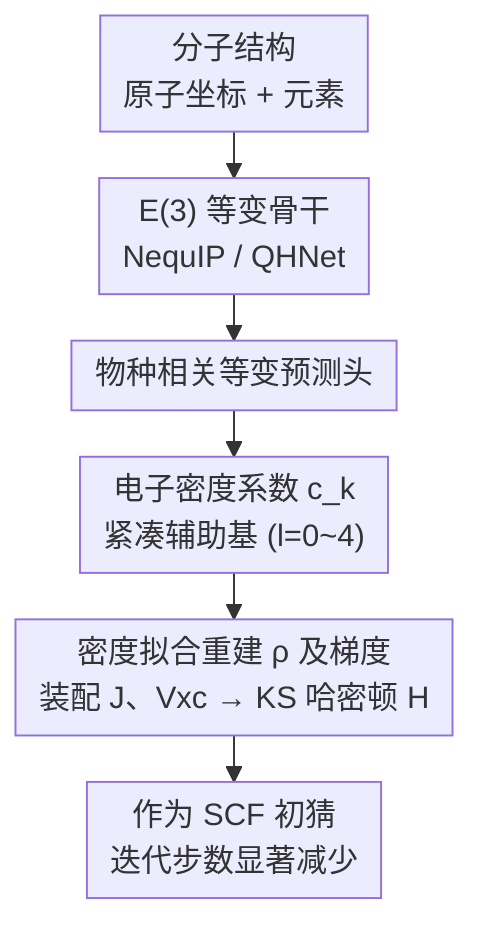

# Towards a Transferable Acceleration Method for Density Functional Theory

**会议**: ICLR 2026  
**OpenReview**: [https://openreview.net/forum?id=JNuk3yGDKE](https://openreview.net/forum?id=JNuk3yGDKE)  
**代码**: [SCFbench 数据集](https://huggingface.co/datasets/ByteDance-Seed/SCFbench)（含配套代码）  
**领域**: AI for Science / 计算化学 / 等变神经网络  
**关键词**: DFT 加速, SCF 初猜, 电子密度, 辅助基, E(3) 等变网络

## 一句话总结
针对密度泛函理论（DFT）的自洽场（SCF）迭代慢的痛点，本文不再像主流做法那样预测哈密顿矩阵，而是用 E(3) 等变网络预测**电子密度在紧凑辅助基下的展开系数**，并给出把这个密度真正转成 SCF 初猜的完整流程；仅用 20 原子以内的小分子训练，就能直接把 60 原子分子的 SCF 迭代平均减少 33.3%，且无需重训就能加速多达 900 原子的聚合物/多肽体系，而基于哈密顿的基线在大分子上往往不收敛。

## 研究背景与动机

**领域现状**：DFT 是计算化学预测电子结构的基石，求解时用 SCF 方法——给一个初始密度矩阵猜测，反复迭代 $D \to H \to C' \to D'$ 直到自洽。SCF 迭代本身很贵，分子越大瓶颈越突出。一个自然的加速思路是用机器学习给出高质量初猜，让 SCF 少迭代几步。主流做法是训练神经网络直接预测 Kohn-Sham **哈密顿矩阵** $H$（QHNet、SPHNet、WALoss 等）。

**现有痛点**：哈密顿预测在真正需要加速的大分子上恰恰失灵，原因有二。其一是数值不稳定：单个矩阵元的微小预测误差会被放大成整体上物理上不合理的巨大误差。其二、也是更致命的——**不可迁移**：训练时见过的分子尺寸一旦被超出，模型就崩。文中实验里，哈密顿基线在小分子（in-distribution）上 RIC 还有 63%，到大分子（out-of-distribution）直接涨到 179%（比默认初猜还慢 80%），甚至有超过 2.5% 的分子彻底不收敛。退一步预测**密度矩阵**也强烈依赖基组选择，引入弥散函数时矩阵元数值范围暴涨，同样难迁移。

**核心矛盾**：哈密顿矩阵 $H$ 的每个矩阵元都耦合分子里**任意一对原子**（不论相隔多远），所以它对分子的全局结构敏感，本质上是个非局域、随体系尺寸平方增长的量——这让它天生不适合外推到更大的化学环境。而 Kohn-Sham DFT 的核心假设恰恰是：真实的相互作用电子体系可以用一个共享**完全相同电子密度**的虚构无相互作用体系来表示。换句话说，电子密度 $\rho(r)$ 才是基本的物理可观测量，且它具有强**局域性**和**可迁移性**——某个化学环境对应的密度几乎不随分子其它部分而变。

**本文目标**：找到一个真正可迁移、可扩展的预测目标来生成 SCF 初猜，使得"小分子训练 → 大分子直接用"成为可能；并补上之前一直缺失的一环——如何把预测出来的密度真正变成能驱动 SCF 的初猜。

**切入角度**：既然密度是最本质、最局域的量，就直接预测密度。但此前在实空间格点上预测密度（Brockherde 等）有两个障碍：格点表示冗余且昂贵；更要命的是大多数 DFT 泛函不仅要密度还要它的**梯度**，格点预测拿不到梯度，因此从没真正实现过用预测密度去加速 DFT。

**核心 idea**：用等变网络预测电子密度在**紧凑辅助基**下的展开系数 $\{c_k\}$（而非格点值），这样密度和它的梯度都能解析求出，进而能直接装配整个 Kohn-Sham 哈密顿、作为 SCF 初猜——把"预测密度"这个原则上正确却一直没落地的范式真正跑通。

## 方法详解

### 整体框架
本文要解决的是"如何给 SCF 一个可迁移的好初猜"。整体思路是：把分子结构喂给一个 E(3) 等变骨干网络（直接复用现成的 NequIP 或 QHNet），换上一个**物种相关的等变预测头**，让它输出**电子密度在原子中心辅助基下的展开系数** $\{c_k\}$；再用密度拟合（density fitting）从这些系数解析地重建电子密度及其梯度，进而装配出库仑项 $J$ 和交换关联项 $V_{xc}$、组成 Kohn-Sham 哈密顿 $H$，把它作为 SCF 的初始猜测送进迭代。由于密度是局域、可迁移的量，且辅助基系数数量随体系**线性**增长（哈密顿/密度矩阵是平方增长），整套流程既能迁移到大分子又算得动。

### 关键设计

**1. 物种相关等变预测头：用现成等变网络直接吐出密度系数**

为了不重造轮子，作者不设计新架构，而是把 NequIP 和 QHNet 这两个经典 E(3)/SE(3) 等变网络的**预测头**换掉。原始 NequIP 的头只处理标量（$l=0$）特征去预测原子能量，QHNet 的头则是一个庞大的多阶段 Tensor Expansion 模块去拼装哈密顿矩阵。本文把它们统一替换成一个**单层、物种相关的等变线性层**：把骨干输出的节点特征直接映射成密度系数 $h^i_{\text{out}}$，包含从 $l=0$ 到 $l=4$ 的不可约表示；这一层的权重以原子**元素种类**为条件，让每种元素学到各自不同的最终映射。这样做的好处是顺势而为——等变网络保证密度在旋转/平移/反射下按 Wigner D-矩阵正确变换，物理对称性即归纳偏置，提升数据效率；而且密度的对称阶 $L$ 可以比哈密顿更低，对等变网络很关键，因为张量积的计算复杂度按 $O(L^6)$ 暴涨。对 NequIP 几乎不增加参数量；对 QHNet 则因为砍掉了复杂的原始头，最终模型只保留约四分之一参数（20.5M → 5.9M）。

**2. 以紧凑辅助基的电子密度系数为预测目标：换一个可迁移、线性标度的量**

这是全文的范式核心。作者用密度拟合近似把电子密度展开到一组原子中心的辅助基 $\{\chi_k(r)\}$ 上：

$$\rho(r) \approx \tilde{\rho}(r) = \sum_k c_k \chi_k(r)$$

模型预测的就是这些系数 $c_k$。选它而不选哈密顿/密度矩阵，是因为密度系数同时具备三个好性质：其一**局域可迁移**——某化学环境的密度几乎不随分子全局结构变，所以小分子上学到的规律能外推到大分子；其二**线性标度**——辅助基系数数量随体系大小线性增长，而哈密顿/密度矩阵随轨道对数量平方增长，预测密度系数是**节点级（node-wise）**任务，预测哈密顿/密度矩阵是**边级（edge-wise）**任务需要构造 $N\times N$ 大矩阵，这正是后者在大体系上爆显存的根因；其三**数据高效**，局域性意味着小训练集就能学准。辅助基典型选 def2-universal-jfit 或偶回火基（ETB，由参数 $\beta$ 控制大小，$\beta$ 越小基越大、表达力越强、理论加速上限越高）。

**3. 从预测密度装配 SCF 初猜：补上一直缺失的"密度→初猜"那一步**

之前用密度的工作都卡在"预测出密度后没法用它驱动 SCF"，本文的关键贡献正是把这一步实现出来。有了辅助基展开，电子密度**及其梯度**都能直接解析求值，于是广义梯度近似（GGA）泛函所需的交换关联矩阵 $V_{xc}$ 可以高效算出；库仑矩阵 $J$ 虽然形式上依赖密度矩阵 $D$，但也能用密度拟合近似直接从系数 $\{c_k\}$ 算出。这样仅凭预测的密度系数就足以装配整个 Kohn-Sham 哈密顿 $H = H_{\text{core}} + J + V_{xc}$，把它当 SCF 初猜。相比从完整密度矩阵精确算 $H$，这里对 $J$、$V_{xc}$ 引入了近似，但误差可以通过**增大辅助基函数数量**系统性地减小。这也解释了为什么选 GGA 框架最契合：它能直接从密度系数装配整个哈密顿；对 meta-GGA（需动能密度近似）和杂化泛函（需 HF 交换项近似）则需额外近似处理。

### 损失函数 / 训练策略
所有密度系数模型用一个**逐原子**的复合损失训练，是系数的平均绝对误差（MAE）与均方根误差（RMSE）之和：

$$L = \left(\frac{1}{A}\sum_{a=1}^{A}\frac{1}{N_a}\sum_{i=1}^{N_a}|\hat{c}_{a,i}-c_{a,i}|\right) + \sqrt{\frac{1}{A}\sum_{a=1}^{A}\frac{1}{N_a}\sum_{i=1}^{N_a}(\hat{c}_{a,i}-c_{a,i})^2}$$

其中 $A$ 是原子总数、$N_a$ 是原子 $a$ 的系数个数，真值 $c_{a,i}$ 取自 DFT 计算最终收敛后的电子密度。训练只用 SCFbench 中 20 原子以内的小分子（PBE 泛函、def2-SVP 基组）。

## 实验关键数据

评估主指标是**相对迭代数 RIC**（Relative Iteration Count）：用 ML 初猜收敛所需 SCF 步数 / 用默认 SAD（minao）初猜所需步数，越低越好；并报告 50 步内收敛的**收敛率**。数据集 SCFbench 含 43,862 个小分子（ID 测试），外加专门的 OOD 测试集（1,050 个 26–60 原子分子，每个尺寸 30 个）。

### 主实验：ID 与 OOD 上不同预测目标对比

| 预测目标 | 模型 | 参数量 | ID RIC ↓ | OOD RIC ↓ | OOD 收敛率 ↑ |
|----------|------|--------|----------|-----------|--------------|
| 哈密顿 H | QHNet | 20.5M | 63.20% | **179.47%** | 97.43% |
| 密度矩阵 D | QHNet | 20.5M | 70.45% | 91.69% | 99.71% |
| 密度系数（jfit） | QHNet | 5.9M | 66.90% | 73.26% | 100% |
| 密度系数（jfit） | **NequIP-L** | 50.0M | **63.78%** | **66.68%** | **100%** |

哈密顿模型在小分子上 RIC 还不错（63%），到大分子直接崩到 179%（比不加速还慢），还有 >2.5% 不收敛；密度矩阵稍好但仍随尺寸退化到 91.69%。本文密度方法的 NequIP-L 在 ID/OOD 上 RIC 几乎不变（63.78% → 66.68%）、全程 100% 收敛，体现了"近乎恒定的尺寸标度"。值得注意的是，同一个 QHNet 改去预测密度后，OOD RIC 从 179% 骤降到 73.26%——说明**选对可迁移的物理量比模型架构更关键**。

### 超大体系扩展（QMugs 100–200 原子）

| 体系大小 | 密度系数 RIC ↓ | 密度系数收敛 | 哈密顿收敛 | 密度矩阵收敛 |
|----------|----------------|--------------|------------|--------------|
| 100 原子 | 75.36% | 100% | 20% | 50% |
| 130 原子 | 78.10% | 100% | 0% | 10% |
| 200 原子 | 77.34% | 100% | 0% | 0% |

密度方法在 100–200 原子上 RIC 稳定在 0.73–0.82、全部收敛；哈密顿/密度矩阵在 >120 原子时收敛率掉到接近 0。两个更大的案例：Glycine-100 多肽（703 原子）10 步收敛（minao 需 17 步），Polypropylene 聚合物链（905 原子）8 步收敛（minao 需 12 步）——而哈密顿/密度矩阵方法直接 OOM 失败（因其需构造 $N\times N$ 大矩阵）。

### 泛函与基组可迁移性（NequIP-L，训练于 PBE/def2-SVP）

| 迁移设定 | OOD RIC ↓ |
|----------|-----------|
| PBE / def2-SVP（同分布） | 66.68% |
| BLYP / def2-SVP | 71.22% |
| SCAN（meta-GGA） | 86.45% |
| B3LYP5（杂化） | 83.72% |
| PBE / def2-TZVP（更大基组） | 75.24% |
| B3LYP5 / def2-TZVP | 85.47% |

### 关键发现
- **目标量的选择压倒架构选择**：把哈密顿换成密度后，连原来的 QHNet 都能从 179% 救回到 73%，证明可迁移性主要来自"预测什么"而非"用什么网络"。
- **节点级 vs 边级是大体系成败分水岭**：密度系数线性标度、可在 900 原子上跑；哈密顿/密度矩阵平方标度，几百原子就 OOM 或发散。
- **辅助基表达力决定加速上限**：def2-universal-jfit 的理论 RIC 极限约 60%，更大的 ETB（$\beta=1.5$）可达约 40%；ML 模型在紧凑基上已逼近极限，在大基上仍有差距，是未来改进空间。

## 亮点与洞察
- **把"对的物理量"当成第一性原理**：从 Kohn-Sham 的基本假设出发论证密度才是可观测量、可迁移量，再用工程手段（辅助基 + 密度拟合 + 装配 $H$）把它落地——是漂亮的"物理直觉指导 ML 设计"的范例。
- **复用现成骨干、只换头**：不重造架构，证明范式的有效性不依赖特定网络，工程上极易推广到任何等变骨干。
- **"线性 vs 平方标度"的迁移视角可外推**：在任何需要外推到更大体系/更长序列的结构预测任务里，优先选局域、线性标度的目标量，这条经验普适。
- **drop-in 加速器**：单个小分子上训练的模型可直接当各种体系、各种泛函/基组的"即插即用"加速器，对计算化学工作流实用价值很高。

## 局限与展望
- 在更具表达力的大辅助基（ETB $\beta=1.5$）上，ML 模型离理论加速上限还有明显差距，需要更强的网络架构去榨取信息。
- 当前数据与方法以 GGA（PBE）为主，meta-GGA / 杂化泛函需要对动能密度、HF 交换额外近似，迁移后 RIC 退化到 83–86%，仍有提升空间。
- SCFbench 只覆盖七种元素（H、C、N、O、F、P、S）的类药分子片段，尚未覆盖更广周期表与周期性（固体）体系，作者将其列为走向"真正普适"的关键方向。

## 相关工作与启发
- **vs 哈密顿预测（QHNet / SPHNet / WALoss）**：他们直接预测 $H$，数值不稳且非局域、平方标度，大分子上不收敛或爆显存；本文改预测局域、线性标度的密度系数，迁移性与可扩展性都更好，且补上了"密度→初猜"的落地环节。
- **vs 密度矩阵预测（Shao/Hazra/Febrer 等）**：密度矩阵强依赖基组、含弥散函数时数值范围暴涨，迁移性受限；密度作为物理可观测量天然更稳。
- **vs 实空间格点密度预测（Brockherde / SCDP-Fu 等）**：格点表示冗余且拿不到梯度，无法直接驱动 SCF；本文用紧凑辅助基让密度与梯度都解析可得，第一次真正实现了用预测密度加速 DFT。

## 评分
- 新颖性: ⭐⭐⭐⭐⭐ 把 DFT 加速的预测目标从哈密顿转向电子密度，并补全落地链路，是范式级转变。
- 实验充分度: ⭐⭐⭐⭐⭐ ID/OOD、超大体系（最高 905 原子）、跨泛函跨基组都有系统验证，且开源 SCFbench。
- 写作质量: ⭐⭐⭐⭐⭐ 物理动机清晰、从理论到工程落地讲得透彻。
- 价值: ⭐⭐⭐⭐⭐ 首个稳健可迁移的 DFT 加速候选方案，对计算化学工作流有直接实用价值。

<!-- RELATED:START -->

## 相关论文

- [\[ICLR 2026\] Orbital Transformers for Predicting Wavefunctions in Time-Dependent Density Functional Theory](orbital_transformers_for_predicting_wavefunctions_in_time-dependent_density_func.md)
- [\[NeurIPS 2025\] High-order Equivariant Flow Matching for Density Functional Theory Hamiltonian Prediction](../../NeurIPS2025/physics/high-order_equivariant_flow_matching_for_density_functional_theory_hamiltonian_p.md)
- [\[ICLR 2026\] Tucker-FNO: Tensor Tucker-Fourier Neural Operator and its Universal Approximation Theory](tucker-fno_tensor_tucker-fourier_neural_operator_and_its_universal_approximation.md)
- [\[ICML 2026\] TriForces: Augmenting Atomistic GNNs for Transferable Representations](../../ICML2026/physics/triforces_augmenting_atomistic_gnns_for_transferable_representations.md)
- [\[ICML 2026\] Mesh Field Theory: Port–Hamiltonian Formulation of Mesh-Based Physics](../../ICML2026/physics/mesh_field_theory_port-hamiltonian_formulation_of_mesh-based_physics.md)

<!-- RELATED:END -->
