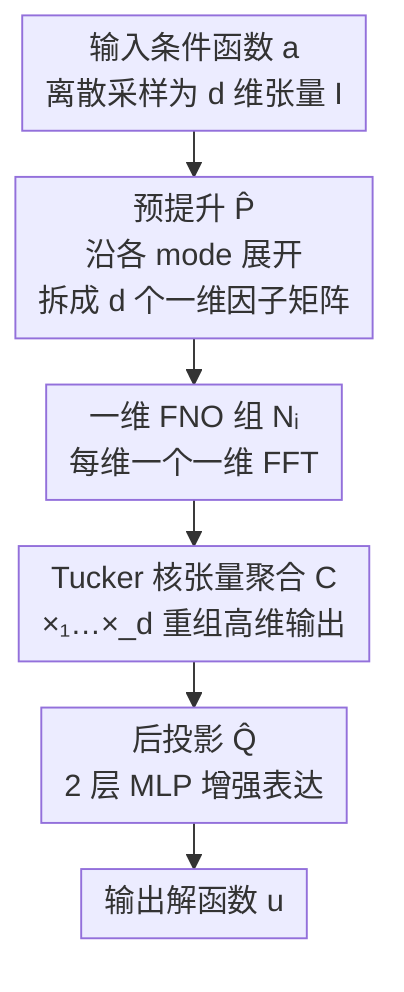

# Tucker-FNO: Tensor Tucker-Fourier Neural Operator and its Universal Approximation Theory

**会议**: ICLR 2026  
**OpenReview**: [https://openreview.net/forum?id=UJvkXnuozY](https://openreview.net/forum?id=UJvkXnuozY)  
**代码**: https://github.com/GuanchengZhou/Tucker-FNO  
**领域**: 神经算子 / 科学计算 / PDE 求解 / 张量分解  
**关键词**: Fourier 神经算子, Tucker 分解, 通用逼近定理, 高维 PDE, 隐式神经表示

## 一句话总结
本文用 Tucker 张量分解把高维 Fourier 神经算子（FNO）拆成一组一维 FNO，把 $d$ 维 FFT 换成 $d$ 次一维 FFT，将 3 维 PDE 的 FFT 复杂度从 $O(d_v n^3 \log n^3)$ 降到 $O(3 d_v n \log n)$，并首次证明了这种张量分解 FNO 仍满足通用逼近定理，在 Navier-Stokes / Plasticity / Burgers 等高维 PDE 和图像/视频信号恢复上同时取得更快和更准的结果。

## 研究背景与动机

**领域现状**：神经算子（Neural Operator, NO）学习的是函数空间到函数空间的映射，而非传统神经网络学习的信号到信号的映射，因此天然适合求解 PDE——给定一个新条件函数 $a$，只需前向跑一次网络就能输出解函数 $u$，比有限元/有限差分等数值求解器快得多。其中 FNO 把非局部积分算子搬到 Fourier 空间用 FFT 实现，是这条路线上效率最高的代表。

**现有痛点**：FNO 的瓶颈在 FFT。对 $n\times n\times n$ 网格上的 3 维 PDE，单次 Fourier 变换复杂度高达 $O(d_v n^3 \log n^3)$，维度一高就算不动；同时高维卷积权重 $R\in\mathbb{C}^{k^d\times d_v\times d_v}$ 也随维度指数膨胀，这让 FNO 在高维 PDE 和高维视觉信号（如 INR 表示图像/体数据）上都受困于维度灾难。

**核心矛盾**：已有的张量化 FNO 走了两条不同的路，各有取舍。T-FNO 只分解网络权重 $R$ 来省参数，但 FFT 本身没变快，反而因为权重重构引入额外计算；D-FNO 注意到「FFT 才是计算主导」并对其做分解来提速，但分解破坏了 FNO 的表达能力（尤其是通用逼近性质），导致精度下降。于是「降 FFT 复杂度」和「保表达能力（通用逼近）」之间存在 trade-off。

**本文目标**：(1) 真正降低 FFT 相关计算的复杂度而不是只省参数；(2) 在分解之后仍保住 FNO 的通用逼近能力，并给出严格证明。

**切入角度**：作者把近期的「函数型张量 Tucker 分解」从函数层面提升到算子层面——既然一个连续多元函数可以被 Tucker 形式（核张量 $\mathcal{C}$ × 各维一维因子函数）任意逼近，那么算子学习的目标函数 $u$ 也可以这样分解，于是估计「高维算子」就转化为估计「一组一维算子」。

**核心 idea**：用 Tucker 分解把一个 $d$ 维 FNO 替换成「$d$ 个一维 FNO + 一个核张量聚合」，把昂贵的高维 FFT 换成多次廉价的一维 FFT，并用 Stone-Weierstrass 定理把通用逼近性质从一维 FNO 一路抬到 Tucker-FNO。

## 方法详解

### 整体框架

Tucker-FNO 要解决的是「高维 FNO 太慢」，整体思路是：不再对 $d$ 维输入做一个庞大的高维 FNO，而是先把输入张量沿各个 mode 拆成 $d$ 个一维「因子输入」，每个因子各自走一个一维 FNO，最后用一个 Tucker 核张量把这些一维输出重新聚合成高维解。形式上把算子 $\mathcal{N}: a\mapsto u$ 定义为

$$\mathcal{N}(a)(x) := \mathcal{C} \times_1 \mathcal{N}_1(a)(x_{(1)}) \times_2 \cdots \times_d \mathcal{N}_d(a)(x_{(d)})$$

其中 $\mathcal{C}\in\mathbb{R}^{r_1\times\cdots\times r_d}$ 是核张量，$(r_1,\dots,r_d)$ 是 Tucker 秩，$\mathcal{N}_i$ 是第 $i$ 维的一维 FNO。整个 pipeline 是：输入函数采样 → 预提升（pre-lifting）拆出 $d$ 个一维因子矩阵 → $d$ 个一维 FNO 并行处理 → Tucker 核张量聚合 → 后投影（post-projection）MLP 增强表达。

整篇方法的三个贡献节点正是上面的预提升、一维 FNO 组 + Tucker 聚合、以及把这套分解架构的通用逼近性证出来；预提升前的采样和最后的后投影属于脚手架（后投影甚至被证明不影响通用逼近）。

### 关键设计

**1. 算子级 Tucker 分解：把一个 $d$ 维 FNO 换成 $d$ 个一维 FNO**

这一步直接针对「高维 FFT 太贵」的痛点。出发点是一个函数逼近定理（Theorem 1）：定义在紧集 $\Omega=[s_1,t_1]\times\cdots\times[s_d,t_d]$ 上的任意连续函数 $f$，对任意 $\epsilon>0$ 都存在核张量 $\mathcal{C}$ 和各维一维连续函数 $g_i$，使得

$$\sup_{x\in\Omega}\left|f(x) - \mathcal{C}\times_1 g_1(x_{(1)})\times_2\cdots\times_d g_d(x_{(d)})\right| < \epsilon$$

也就是说目标解 $u(x)\approx \mathcal{C}\times_1 g_1(x_{(1)})\times_2\cdots\times_d g_d(x_{(d)})$，于是「估计 $u$ 上的算子」就变成「估计各维因子 $g_i$ 上的算子」。把每个 $g_i$ 用一维 FNO $\mathcal{N}_i$（即公式 (5) 的标准 FNO 层）实现，高维 FNO 就被分解成 $d$ 个一维 FNO。关键收益在于：原本一次 $d$ 维 FFT 复杂度 $O(d_v d n^d\log n)$，现在变成 $d$ 次一维 FFT，总复杂度降到 $O(d_v d n\log n)$——对 3 维 PDE 就是从 $n^3\log n^3$ 量级降到 $n\log n$ 量级。这和 T-FNO 有本质区别：T-FNO 分解的是网络权重 $R$（省参数但 FFT 没变快、还多了权重重构开销），Tucker-FNO 分解的是算子本身（直接砍 FFT 计算量）。

**2. 预提升模块：把高维输入线性拆成各维一维因子矩阵**

既然要喂给 $d$ 个一维 FNO，就需要先把 $d$ 维输入张量 $I\in\mathbb{R}^{n_1\times\cdots\times n_d}$ 拆成 $d$ 个一维因子。借鉴 D-FNO，作者用一个线性预提升算子 $\hat{P}$ 完成：

$$\hat{P}(I) := (I_1,\dots,I_d),\quad I_i := \mathrm{unfold}_i(I)\,W_i$$

其中 $\mathrm{unfold}_i(\cdot)$ 把张量沿第 $i$ 个 mode 展开成矩阵，$W_i\in\mathbb{R}^{\prod_{j\neq i}n_j\times d_v}$ 是预提升权重，$d_v$ 是隐空间维度，输出 $I_i\in\mathbb{R}^{n_i\times d_v}$。每个因子矩阵 $I_i$ 携带了函数 $a$ 沿第 $i$ 维的部分信息，作为对应一维 FNO 的输入。在离散数值实现下，整个算子写作 $O=\hat{Q}(\mathcal{C}\times_1\mathcal{N}_1(I_1)\times_2\cdots\times_d\mathcal{N}_d(I_d))$，其中 $\hat{Q}$ 是后投影 MLP，进一步增强分解后的表达能力——值得注意的是，在信号恢复任务里因为输入用的是可分解的正弦位置编码，预提升甚至可以省掉。

**3. Tucker-FNO 的通用逼近定理：分解后表达能力不打折的理论保证**

D-FNO 的教训是「分解会伤害通用逼近」，所以本文最核心的贡献是证明 Tucker-FNO 仍是通用逼近器。证明分三级递进：先是函数层面的 Theorem 1（连续函数可被函数型 Tucker 分解任意逼近，由 Stone-Weierstrass 定理——高阶多项式能逼近函数、且高阶多项式能构造出 Tucker 分解形式——得到）；再抬到算子层面的 Theorem 2，对紧致的解析函数集 $H$，存在秩 $(r_1,\dots,r_d)$、连续因子算子 $\mathcal{U}_i$ 和核张量 $\mathcal{C}$，使得

$$\sup_{h\in H}\left\|h(\cdot) - \mathcal{C}\times_1 \mathcal{U}_1 h(\cdot_1)\times_2\cdots\times_d \mathcal{U}_d h(\cdot_d)\right\|_{H^s}\le\epsilon$$

最后 Theorem 3：把上面的因子算子 $\mathcal{U}_i$ 用一维 FNO 逼近（依据经典 FNO 的通用逼近 Lemma 2），就得到对任意连续算子 $\mathcal{G}$，存在 Tucker-FNO $\mathcal{N}$ 使 $\sup_{f\in F}\|\mathcal{G}(f)-\mathcal{N}(f)\|_{H^s}\le\epsilon$。这是首个针对张量分解神经算子的通用逼近结果。文中还指出，因为 MLP 本身是通用逼近器，加在末尾的后投影 $\hat{Q}$ 不影响这一结论。

### 损失函数 / 训练策略
PDE 任务训练 500 epoch，batch size 20，Adam 优化器（lr=0.001），隐维 $d_v=32$，Tucker 秩设为与 $d_v$ 相同，Fourier 频率截断阈值 $k_{\max}=(12,12,\dots)$，NO 类方法深度为 4，后投影 $\hat{Q}$ 为 2 层 MLP。信号恢复任务里每个一维因子映射用一个 DNN（含 1 个 sine 激活的 lifting 层 + 2 个 FNO 层 + 线性投影），输入为 $S=10$ 的正弦位置编码，秩设为 $(r_1,r_2,r_3)=(n_1,n_2,\lfloor n_3/2\rfloor)$。

## 实验关键数据

### 主实验

PDE 逼近任务（NMSE↓ / VCE↓，值越小越好），Tucker-FNO 在 4 项配置上基本全面领先：

| 数据集 | 指标 | FNO | T-FNO | D-FNO | Tucker-FNO |
|--------|------|------|-------|-------|------------|
| Navier-Stokes (T=20) | NMSE | 0.0034 | 0.0035 | 0.0063 | **0.0028** |
| Navier-Stokes (T=30) | NMSE | 0.0072 | 0.0065 | 0.0132 | **0.0061** |
| Plasticity | NMSE | 0.0080 | 0.0079 | 0.0097 | **0.0073** |
| Burger | VCE | 4.45e-5 | 2.97e-5 | 2.86e-5 | **2.01e-5** |

效率对比（256×256 数据）：相比 FNO，Tucker-FNO 参数减少约 50%、单次迭代时间减少 48.6%；T-FNO 虽省参但因权重重构反而更慢，D-FNO 虽快但精度掉得明显。

| 方法 | 参数量 | Time/iter (s) |
|------|--------|---------------|
| FNO | 593.7 K | 0.0685 |
| T-FNO | 232.6 K | 0.0746 |
| D-FNO | 307.8 K | 0.0382 |
| Tucker-FNO | 293.5 K | **0.0352** |

信号恢复（多光谱图像/视频 inpainting，PSNR↑），Tucker-FNO 在各采样率下均显著优于 OINR、OINR-FNO 等 NO-based INR 以及 SIREN/MFN/LRTFR：

| 采样率 | 指标 | LRTFR | OINR | OINR-FNO | Tucker-FNO |
|--------|------|-------|------|----------|------------|
| 0.1 | PSNR | 26.96 | 23.32 | 24.53 | **28.09** |
| 0.15 | PSNR | 28.75 | 24.04 | 25.02 | **29.57** |
| 0.2 | PSNR | 30.22 | 25.17 | 26.27 | **31.17** |

在 1024×1024×31 信号恢复任务上，相比 OINR-FNO，Tucker-FNO 参数从 1.06M 降到 553K、Time/iter 从 0.2322 降到 0.0963，约 2.4× 加速。

### 消融实验

以 Plasticity 方程考察隐维 $d_v$、频率截断阈值 $k$、Tucker 秩的影响（NMSE↓）：

| 配置 | 关键指标 | 说明 |
|------|---------|------|
| $d_v=16$ | NMSE 0.0092 | 隐维太小，表达不足 |
| $d_v=32$ | NMSE 0.0073~0.0074 | 默认配置，性价比高 |
| $d_v=64$ | NMSE 0.0062~0.0068 | 继续增大隐维仍有小幅提升 |
| 秩 16 → 32 → 64 | NMSE 递减 | 秩越大精度越好，但收益递减 |

### 关键发现
- 在数值变化剧烈的区域（如 Navier-Stokes 的涡旋、Burgers 的激波附近），Tucker-FNO 的误差图明显更干净，说明一维分解并未损失对高频/剧变结构的刻画能力。
- 增大 $d_v$ 和秩都能提升精度，但 $d_v=32$、秩=$d_v$ 已是性价比拐点，过大的秩才会让分解后的聚合开销 $O(\hat{r}d_v n^d)$ 变成主导。
- 「分解还能更准」这点反直觉：D-FNO 分解后掉点，而 Tucker-FNO 因为保住了通用逼近、且一维结构起到了某种隐式正则，多数情况下反而比原版 FNO 更准。

## 亮点与洞察
- **把张量分解从「分解权重」上升到「分解算子」**：这是和 T-FNO 最本质的区别。分解权重只省参数、FFT 没变快；分解算子直接把高维 FFT 替换为多次一维 FFT，命中了 FNO 真正的计算瓶颈，是「快」的根源。
- **三级递进的通用逼近证明很漂亮**：函数级（Stone-Weierstrass）→ 算子级（Tucker 算子分解）→ FNO 级（套经典 FNO 逼近），层层把保证传递上去，给「分解会不会伤表达能力」这个疑虑一个干净的否定答案。
- **同一套分解无缝迁移到 INR 信号恢复**：因为正弦位置编码天然可沿各维分解，Tucker-FNO 在恢复任务里能直接省掉预提升，几乎零改动就泛化到图像/视频/3D 体数据，显示了「算子分解」作为通用范式的可复用性。

## 局限与展望
- 通用逼近定理要求目标函数集在 $\mathbb{T}^d$ 上解析（analytic）且 $s>d/2$，对不光滑、强不连续的解（如带尖锐间断的 PDE）理论保证是否仍稳，文中未充分讨论。
- 聚合阶段复杂度 $O(\hat{r}d_v n^d)$ 在秩极大时会反超 FFT 节省的收益，意味着 Tucker 秩需要谨慎选取，存在「秩太小掉精度、秩太大失效率」的窄窗口。
- 实验主要在结构化网格、规则域上验证，对 Geo-FNO 那类任意几何/不规则网格的 PDE，mode 展开式的预提升是否还适用值得进一步检验。

## 相关工作与启发
- **vs FNO**: FNO 用一次高维 FFT，复杂度 $O(d_v n^d\log n)$；Tucker-FNO 用 $d$ 次一维 FFT 降到 $O(d_v d n\log n)$，参数和时间都减半，精度还略升。
- **vs T-FNO**: T-FNO 分解权重 $R$ 省参数，但 FFT 不变、还多了权重重构开销，所以更慢；Tucker-FNO 分解算子，目标是计算效率而非参数效率。
- **vs D-FNO**: 两者都想降 FFT 成本，但 D-FNO 的分解破坏了通用逼近导致掉点，Tucker-FNO 证明了分解后仍是通用逼近器，在速度更快的同时精度更高。
- **vs OINR / OINR-FNO**: 同为 NO-based INR，Tucker-FNO 凭借紧凑的 Tucker 分解在高维信号恢复上同时更快更准（1024×1024×31 上约 2.4× 加速、参数近半）。

## 评分
- 新颖性: ⭐⭐⭐⭐⭐ 首次把函数型张量分解抬到算子层面，并首证张量分解 NO 的通用逼近定理。
- 实验充分度: ⭐⭐⭐⭐ 覆盖 3 类 PDE + 多种信号恢复任务，效率/精度双维度对比，消融完整；但多在规则网格上。
- 写作质量: ⭐⭐⭐⭐ 理论推导层次清晰、动机与 T-FNO/D-FNO 区分明确。
- 价值: ⭐⭐⭐⭐⭐ 给高维 FNO 提供了既快又有理论保证的通用范式，可直接迁移到 INR。

<!-- RELATED:START -->

## 相关论文

- [\[ICLR 2026\] KANO: Kolmogorov–Arnold Neural Operator](kano_kolmogorov-arnold_neural_operator.md)
- [\[CVPR 2025\] DiffFNO: Diffusion Fourier Neural Operator](../../CVPR2025/physics/difffno_diffusion_fourier_neural_operator.md)
- [\[ICLR 2026\] Towards a Transferable Acceleration Method for Density Functional Theory](towards_a_transferable_acceleration_method_for_density_functional_theory.md)
- [\[ICLR 2026\] DRIFT-Net: A Spectral--Coupled Neural Operator for PDEs Learning](drift-net_a_spectral--coupled_neural_operator_for_pdes_learning.md)
- [\[ICLR 2026\] Orbital Transformers for Predicting Wavefunctions in Time-Dependent Density Functional Theory](orbital_transformers_for_predicting_wavefunctions_in_time-dependent_density_func.md)

<!-- RELATED:END -->
