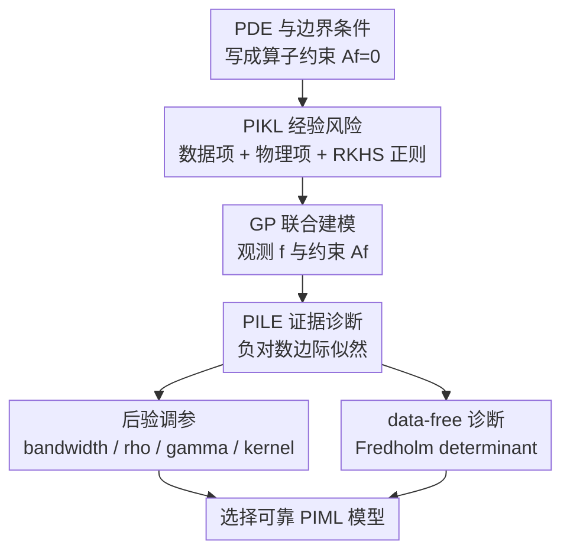

# Uncertainty-Aware Diagnostics for Physics-Informed Machine Learning

**会议**: ICLR2026  
**OpenReview**: [https://openreview.net/forum?id=7PORoDlSS4](https://openreview.net/forum?id=7PORoDlSS4)  
**代码**: 无  
**领域**: 物理信息机器学习 / 不确定性量化  
**关键词**: 物理信息机器学习, Gaussian Process, 模型诊断, PILE, PDE 求解  

## 一句话总结
本文在 physics-informed kernel learning 的 Gaussian Process 框架里提出 Physics-Informed Log Evidence (PILE)，用一个带不确定性解释的边际似然指标统一诊断数据拟合、物理约束和核/正则超参数选择，避免 PIML 里常见的多目标调参歧义。

## 研究背景与动机
**领域现状**：Physics-informed machine learning (PIML) 的核心目标，是把观测数据和物理方程约束同时放进模型训练里。PINN、Neural ODE、Neural Operator、physics-informed kernel learning 都属于这一类：模型既要贴合观测点，又要让 PDE residual、边界条件或守恒律尽可能小。

**现有痛点**：这种做法看似自然，但训练目标本质是多目标的。数据误差、物理残差、RKHS/网络正则项通常各有一个权重；同一个模型可能在测试数据上看起来不错，却在物理约束上失真，也可能为了压低 PDE residual 而过平滑、无法还原真实解。科学计算场景里验证数据又常常很少，因此很难只靠 test loss 或 residual loss 判断模型是否真的可靠。

**核心矛盾**：问题的根源在于 PIML 的“模型质量”不是单一误差能描述的。物理约束可以被当成 regularizer，但 regularizer 的权重并没有天然答案；当方程、边界条件或模型族存在错配时，单独看数据 loss 或物理 loss 都可能给出误导信号。作者认为，这个歧义其实和 epistemic uncertainty 没被纳入诊断有关：如果一个模型对某类解或 PDE 约束本身不适配，它应当在证据层面被惩罚，而不是只在某个后验点估计上被比较。

**本文目标**：论文把问题限定在 Physics-Informed Kernel Learning (PIKL) 这个可分析的设置中，研究如何为 PIML 提供一个统一的模型选择原则。具体来说，作者希望这个原则能选择 kernel bandwidth、数据/物理正则权重，甚至能在还没有采集数据之前判断某个 kernel 是否适合给定 PDE。

**切入角度**：Gaussian Process (GP) 自带边际似然和后验方差，因此它天然能把拟合质量和不确定性放在同一个概率模型里。作者把 PIKL 的核岭回归目标重新解释成 GP 后验均值，再把包含数据观测和物理约束观测的边际似然拿出来作为诊断指标。

**核心 idea**：用 physics-informed GP 的负对数边际似然 PILE 代替手工权衡的 data loss / physics loss，把 PIML 模型选择变成一个“证据越高越好”的单指标问题。

## 方法详解

### 整体框架
本文方法的对象是线性 PDE 或带线性边界条件的物理信息学习任务。作者先把 PDE 约束写成统一的算子形式 $Af=0$，再在 RKHS/GP 框架里同时建模函数值观测 $f(x_i)$ 和物理约束观测 $Af(z_j)$，最后用这个联合 GP 的负对数边际似然定义 PILE score。实际使用时，研究者不需要在数据误差和物理误差之间手工挑 Pareto 点，而是直接在 kernel、bandwidth、正则权重上最小化 PILE。

更具体地，论文先考虑一般的线性微分算子 $D$ 和边界算子 $B_i$。对于 Dirichlet、Neumann、Robin、Cauchy 等边界条件，都可以合并成一个算子 $A$，并把物理误差写成 $\|Af\|^2_{L^2}$。之后用一组 quadrature 点 $z_j$ 近似这个积分，把连续 PDE residual 变成有限维的物理观测项。

在有限维近似后，模型最小化的 physics-informed kernel ridge regression 目标包含三部分：观测数据误差、物理约束误差、RKHS 正则。三个温度/正则参数 $\gamma,\rho,\eta$ 分别控制数据噪声、物理噪声和函数先验尺度。关键转折是：这个优化问题不仅能用 representer theorem 解，还能被解释为一个 GP 的后验均值；于是模型选择就可以从“看哪个 loss 小”转成“看哪个 GP prior 对观测和物理约束给出的 evidence 高”。

### 关键设计
**1. PIKL 的 GP 解释：把物理残差也当成带噪观测**

传统 PIML 通常把 PDE residual 当成一个软惩罚项，但这样会让物理项权重变成经验调参。本文把同一件事改写成概率模型：令 $(f,g)$ 服从由 kernel 和算子 $A$ 推出的联合 GP，其中 $g=Af$；数据点满足 $y_i\mid f(x_i)\sim N(f(x_i), 1/(2\gamma))$，物理/边界约束点满足 $r_j\mid g(z_j)\sim N(g(z_j), 1/(2\rho w_j))$。如果要强制 $Af=0$，就取 $r_j=0$；如果有带噪的边界或 forcing function 观测，也可以让 $r_j$ 非零。

这个设计的好处是，它没有把“物理约束”硬编码成一个无法解释的正则项，而是把它解释为另一类观测。数据噪声、物理约束噪声和先验尺度分别由 $\gamma,\rho,\eta$ 控制，后验均值对应 PIKL 的核岭回归解，后验协方差则提供 epistemic uncertainty。于是同一个框架既能做预测，又能判断模型是否对当前 PDE 和观测模式有足够证据支持。

**2. PILE 分数：用边际似然统一数据拟合与物理一致性**

PILE 的定义来自这个 physics-informed GP 的 Bayes free energy。设 $\tilde{Y}=(y_1,\ldots,y_n,r_1,\ldots,r_m)^\top$，联合协方差矩阵为 $\Sigma_{m,n}$，则论文定义

$$
P_{m,n}=\frac{1}{m+n}\tilde{Y}^\top\Sigma_{m,n}^{-1}\tilde{Y}+\frac{1}{m+n}\log\det\Sigma_{m,n}+\log(2\pi\eta).
$$

这个分数越低越好。第一项衡量观测和约束在当前模型下是否容易解释，第二项通过 $\log\det$ 惩罚过于复杂或不确定性结构不合适的模型。它不是简单把 data loss 和 physics loss 加权求和，而是在一个概率模型里同时考虑拟合误差、模型复杂度和不确定性校准。过小的 $\rho$ 或 $\gamma$ 会让模型过分相信噪声观测，PILE 会发散或变差；过大的 bandwidth 会让模型过平滑，证据也会下降。

这也解释了为什么 PILE 能当作 hyperparameter selection criterion。对 bandwidth、kernel family、$\rho$、$\gamma$、$\eta$ 做网格搜索或优化时，最小化 PILE 相当于做 empirical Bayes。相比手工看 data test loss 和 physics test loss 的 Pareto front，它给出一个可操作的单数值选择原则。

**3. data-free PILE：在采样前用 Fredholm determinant 判断 kernel 是否适配 PDE**

论文最有意思的部分是无数据情形。若还没有函数值观测，只考虑 $Af=0$ 且 $r_j=0$，PILE 的二次项消失，只剩协方差行列式项；当 quadrature 点数 $m\to\infty$ 时，归一化后的 PILE 收敛到一个 Fredholm determinant：

$$
P_0=\log\det(I+G),
$$

其中 $G$ 是由 $(A\otimes A)k$ 诱导的积分算子。直观地说，这个量衡量“用当前 kernel 的 RKHS 去满足这个 PDE 约束有多困难”。如果某个 kernel 的各向同性、平滑性或方向性和 PDE 解的几何结构不匹配，即使后面有数据，也可能陷入物理误差与数据误差无法兼顾的困境；data-free PILE 可以在采样前就暴露这种错配。

这让模型诊断从 a posteriori 扩展到了 a priori：不是等模型训练失败后再调参，而是在数据采集或模型拟合前就比较不同 kernel 对同一个算子 $A$ 的适配程度。论文在对流 PDE 上展示，普通 isotropic RBF 没有合适 bandwidth，而 anisotropic RBF 的方向和拉伸参数可以通过 Fredholm determinant 自动选出来。

**4. 失败诊断而非只报最优：PILE 能指出“这个模型族本身不适合”**

很多模型选择指标只会在候选里选一个相对最优者，但 PIML 的实际风险是：所有候选都不可靠。本文强调 PILE 的诊断属性，例如在对流方程实验中，isotropic RBF kernel 下数据误差需要较小 bandwidth，物理误差却在小 bandwidth 区域爆炸；没有一个 bandwidth 同时满足两者。PILE 在这种情况下选择过平滑的近零解，并不是“找到了好模型”，而是在证据层面提示当前 kernel family 不适配。

这个设计对 scientific ML 很重要，因为它避免了“某个 test loss 看起来不错就相信模型”的陷阱。诊断指标应当能告诉用户两件事：一是当前超参数是否合适，二是当前模型族是否根本缺少表达 PDE 解结构的 inductive bias。PILE 通过 evidence landscape 同时承担这两个角色。

### 一个完整示例
以二维 Poisson 方程为例，任务是在 $\Omega=(-1,1)^2$ 上求解 $\Delta f(x)=g(x)$ 且边界 $f(x)=0$，其中 forcing function 为 $g(x)=10+10\sin(2\pi x)\sin(2\pi y)$。作者在 Chebyshev quadrature 网格上采样函数值和导数/物理观测，训练 physics-informed GP/KRR 模型。

如果只看数据误差，较小 bandwidth 可能更容易贴合 noisy observations；如果只看物理误差，模型可能倾向于更平滑的解。实验流程是先固定 $\rho=0.01,\gamma=0.01$ 扫描 RBF bandwidth $h$，选择 PILE 最小的 $h^*$；再在 $h=h^*$ 下依次选择物理正则 $\rho$ 和数据正则 $\gamma$。结果显示，PILE 的最小点同时给出较低的数据 PPL2-G error 和物理 PPL2-G error；当 $\rho$ 或 $\gamma$ 过小导致模型过拟合噪声时，PILE 会明显变差。

第二个例子是 Krishnapriyan et al. 提出的对流 PDE：$\partial_t f(t,x)+\beta\partial_x f(t,x)=0$，初值 $f(0,x)=\sin(x)$。普通 isotropic RBF 在这个问题上出现典型失败：能拟合数据的 bandwidth 区域会让物理 residual 爆炸，能压低物理 residual 的区域又过度平滑。作者随后换成带旋转角 $\theta$ 和尺度 $s$ 的 anisotropic RBF family，先用 data-free PILE 选择 $\theta^*\approx1.41,s^*\approx0.50$，再调 bandwidth，最终得到数据和物理误差都更好的模型。

### 损失函数 / 训练策略
训练层面，本文没有提出新的神经网络训练算法，而是围绕 PIKL/KRR 的解析求解和 GP evidence 评估展开。有限维经验风险为

$$
L_{m,n}(f)=\frac{1}{\gamma n}\sum_{i=1}^n(f(x_i)-y_i)^2+\frac{1}{\rho}\sum_{j=1}^m w_j(Af(z_j))^2+\frac{1}{\eta}\|f\|_{H}^{2}.
$$

在满足 kernel 可微性和算子系数有界的假设下，representer theorem 保证最优解位于 $\{k(\cdot,x_i)\}$ 与 $\{(Id\otimes A)k(\cdot,z_j)\}$ 张成的有限维空间中，因而可以解一个线性代数问题得到系数。PILE 计算需要 $\Sigma_{m,n}^{-1}$ 和 $\log\det\Sigma_{m,n}$，通常是三次复杂度；作者指出大规模时可以借助已有的 marginal likelihood / determinant estimation 方法降低内存和计算压力。

## 实验关键数据

### 主实验
论文主要用两个 case study 验证 PILE：一个是二维 Poisson 方程的自动超参数选择，另一个是对流 PDE 中的模型族失败诊断与 anisotropic kernel 选择。原文图中许多数值以曲线形式给出，下面保留最能说明结论的定性/半定量信息。

| 实验任务 | 候选/调参对象 | PILE 选择结果 | 数据误差趋势 | 物理误差趋势 | 结论 |
|--------|------|------|------|------|------|
| Poisson 方程 + Dirichlet 边界 | RBF bandwidth $h$ | 最小点约在 $h\approx0.35$ 附近 | 低于过平滑区域 | 低于欠平滑区域 | PILE 找到 data/physics 两类误差的折中点 |
| Poisson 方程后续调参 | 物理正则 $\rho$、数据正则 $\gamma$ | 过小噪声参数被 PILE 惩罚 | 过拟合时变差 | 过拟合时变差 | PILE 能识别 noisy observations 下的不合理置信度 |
| 对流 PDE + isotropic RBF | bandwidth $h$ | 选到过平滑近零解 | 小 $h$ 才较好 | 小 $h$ 区域爆炸 | 不是超参数没调好，而是 kernel family 不适配 |
| 对流 PDE + anisotropic RBF | 方向 $\theta$、尺度 $s$、bandwidth | data-free PILE 选 $\theta^*\approx1.41,s^*\approx0.50$ | 明显改善 | 明显改善 | 用 Fredholm determinant 可在采样前选择更适配 PDE 的 kernel |

### 消融实验
本文没有传统神经网络式的模块消融，但有非常清晰的诊断对照：换掉 PILE 或换掉 kernel family 后，模型选择行为会发生变化。

| 配置 | 关键指标/现象 | 说明 |
|------|---------|------|
| 只看数据误差 | Poisson 中可能偏向欠平滑，小 bandwidth 更诱人 | 无法保证 PDE residual 泛化 |
| 只看物理误差 | 可能偏向过平滑或近零解 | 无法保证观测数据拟合 |
| PILE + RBF bandwidth | 在 Poisson 中选出同时兼顾两类误差的 $h$ | 边际似然提供单指标折中 |
| isotropic RBF + 对流 PDE | data loss 与 physics loss 的低误差区域错开 | PILE 诊断出模型族失败 |
| anisotropic RBF + data-free PILE | $\theta^*\approx1.41,s^*\approx0.50$ 后误差盆地改善 | kernel 的方向性与 PDE 传播结构更匹配 |

### 关键发现
- PILE 的价值不只是调参，而是把 data loss、physics loss、模型复杂度和不确定性校准放进同一个 evidence 指标里。
- 在 Poisson 方程上，按 PILE 依次选择 bandwidth、物理正则和数据正则，可以避开欠平滑、过平滑和对噪声过度自信三类问题。
- 在对流 PDE 上，普通 isotropic RBF 的失败不是简单调参能解决的；PILE 通过选择近零过平滑解暴露了“当前模型族没有合适解”的事实。
- data-free PILE/Fredholm determinant 可以在没有观测数据时比较 kernel 与 PDE 算子的适配性，这对昂贵实验或仿真前的模型选择很有吸引力。
- 论文的实验规模不大，但设计很针对 PIML 的核心痛点：多目标 loss 没有统一选择原则。

## 亮点与洞察
- **把 PIML 调参问题解释成 empirical Bayes**：这比“再加一个 validation loss”更根本，因为 scientific ML 场景常常没有足够验证数据，而边际似然能从模型证据角度惩罚过拟合和不合适先验。
- **PILE 能诊断失败而不是粉饰失败**：对流 PDE 里 PILE 选择近零解看起来反直觉，但它正好说明 isotropic RBF 没有办法同时满足数据和物理约束，这比报告某个低 data loss 模型更诚实。
- **Fredholm determinant 的 a priori 角色很新鲜**：在没采样前比较 kernel 与 PDE 算子的适配性，把 numerical analysis 里的算子结构、kernel 方法和 Bayesian evidence 接到了一起。
- **对 PINN 社区有迁移启发**：虽然本文只在 kernel/GP 框架中严格成立，但作者指出可以用 empirical neural tangent kernel 或 Laplace/IIC 类近似把 PILE 思路扩展到神经网络 PIML。
- **把 uncertainty 当成诊断工具而非附属输出**：很多 UQ 工作只在训练后给置信区间，本文则把不确定性直接用于模型选择，这更接近科学建模真正需要的可靠性判断。

## 局限与展望
- 当前理论和实验主要覆盖线性微分算子与 kernel-based PIML；对非线性 PDE、PINN、Neural Operator 的扩展还停留在展望和近似思路。
- PILE 计算涉及矩阵逆和 log determinant，大规模 quadrature 点或高维 PDE 时会有明显计算压力，需要结合随机迹估计、低秩近似或 GPU GP 工具。
- 实验案例偏小，主要是 Poisson 和对流 PDE；还需要在更复杂几何、混合边界条件、高维时空系统和真实 noisy sensor 数据上验证稳定性。
- PILE 依赖 GP prior/kernel family 的建模假设。若候选模型族都很差，PILE 能诊断失败，但不能自动生成新的物理归纳偏置。
- data-free PILE 很适合前期 kernel selection，但实际工程中如何和主动采样、实验设计、mesh/quadrature 选择联合优化，仍是开放问题。

## 相关工作与启发
- **vs PINN**: PINN 通常把 PDE residual 作为神经网络 loss 的一部分，需要手工调 data/physics 权重；本文在 kernel/GP 框架中给出 evidence-based 的权重和模型选择原则，理论更清晰但表达能力和规模暂时不如神经网络灵活。
- **vs Physics-Informed Kernel Learning (PIKL)**: PIKL 已经把 PDE 约束纳入核方法并能给出 GP/KRR 解；本文的增量是围绕 PIKL 提供 PILE 诊断指标，让 PIKL 不只是求解器，也成为可调、可诊断的模型选择框架。
- **vs 标准 GP marginal likelihood**: 标准 GP evidence 只解释函数值观测；PILE 把 $Af$ 的物理约束观测也放进联合协方差中，因此边际似然同时覆盖数据拟合和 PDE residual。
- **vs 传统数值 PDE 误差估计**: classical solver 往往有 a posteriori error estimate；PIML 缺少类似工具。PILE 不是严格数值误差界，但提供了一个统计意义上的诊断分数，可作为 PIML 可靠性评估的第一步。
- **vs 神经网络信息准则**: BIC、Laplace approximation、Interpolating Information Criterion 等都试图用 free energy/信息准则选择模型；本文启发是把这类 free energy 思路移植到 physics-informed 训练目标里。

## 评分
- 新颖性: ⭐⭐⭐⭐☆ 用 PILE/Fredholm determinant 统一 PIML 诊断很有辨识度，但核心依托 GP marginal likelihood，创新更多在物理信息建模场景的重组和理论连接。
- 实验充分度: ⭐⭐⭐☆☆ 两个 case study 很有针对性，能清楚说明问题；但规模和任务多样性还不足以证明其对广义 PIML 的普适性。
- 写作质量: ⭐⭐⭐⭐☆ 论文从 PDE、GP、PIKL 到 PILE 的推导链条完整，图示案例也能直观展示诊断作用；不过数学部分对非 GP 背景读者门槛较高。
- 价值: ⭐⭐⭐⭐☆ 对 physics-informed ML 的模型选择和可靠性诊断很有启发，尤其适合 kernel/GP 和 scientific ML 社区继续扩展到 PINN/Neural Operator。

<!-- RELATED:START -->

## 相关论文

- [\[NeurIPS 2025\] Physics-Guided Machine Learning for Uncertainty Quantification in Turbulence Models](../../NeurIPS2025/physics/physics-guided_machine_learning_for_uncertainty_quantification_in_turbulence_mod.md)
- [\[ICLR 2026\] Iterative Training of Physics-Informed Neural Networks with Fourier-enhanced Features](iterative_training_of_physics-informed_neural_networks_with_fourier-enhanced_fea.md)
- [\[ICLR 2026\] Fast training of accurate physics-informed neural networks without gradient descent](fast_training_of_accurate_physics-informed_neural_networks_without_gradient_desc.md)
- [\[ICLR 2026\] SAQ: Stabilizer-Aware Quantum Error Correction Decoder](saq_stabilizer-aware_quantum_error_correction_decoder.md)
- [\[AAAI 2026\] PIMRL: Physics-Informed Multi-Scale Recurrent Learning for Burst-Sampled Spatiotemporal Dynamics](../../AAAI2026/physics/pimrl_physics-informed_multi-scale_recurrent_learning_for_burst-sampled_spatiote.md)

<!-- RELATED:END -->
