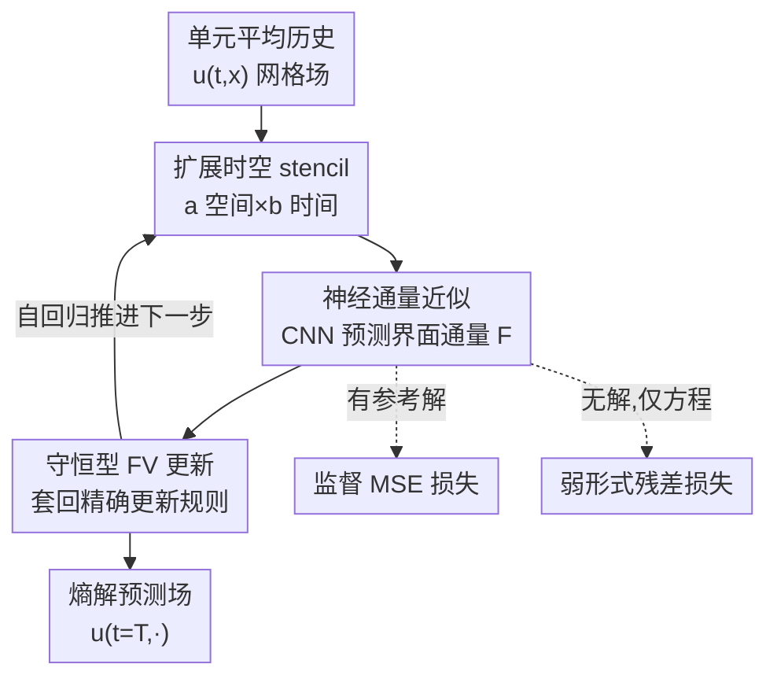

# (U)NFV: (Un)supervised Neural Finite Volume Methods for Solving Hyperbolic PDEs

**会议**: ICLR 2026  
**OpenReview**: [https://openreview.net/forum?id=AhtDnPyfOE](https://openreview.net/forum?id=AhtDnPyfOE)  
**代码**: https://nathanlichtle.com/research/nfv  
**领域**: 神经PDE求解 / 科学计算  
**关键词**: 双曲守恒律, 有限体积法, 神经算子, 弱形式残差, 交通流建模

## 一句话总结
把经典有限体积法（FV）里"手工设计的数值通量"换成一个轻量 CNN，在保留 FV 守恒更新结构的前提下学习跨更大时空 stencil 的通量近似，既能监督训练（NFV）也能用弱形式残差无监督训练（UNFV），在一维双曲守恒律上误差比 Godunov 低最多 10 倍、逼近 DG 而实现复杂度只跟 FV 一样。

## 研究背景与动机

**领域现状**：双曲型偏微分方程（PDE）——尤其是守恒律 $\partial_t u + \partial_x f(u) = 0$——是流体力学、交通流等领域的基础模型。它们的解会自发产生激波和间断，即使初值光滑，经典强解也会在有限时间后失效，只能依赖弱解。工程上主流靠有限体积法（FV）数值求解：在网格单元上对守恒量做平均，通过界面数值通量 $\hat F^n_{i+1/2}$ 推进，天然保证守恒。

**现有痛点**：经典 FV 在精度、计算量、stencil 大小、实现复杂度之间存在多重权衡。一阶格式（Godunov、Lax-Friedrichs）鲁棒但数值耗散严重、把激波抹平；高阶格式（ENO/WENO）和有限元类的间断 Galerkin（DG）精度高，却要精心设计通量重构、求积规则、稳定化策略，实现和调参负担都很重。而想手工设计"更大时空 stencil"的解析格式，复杂度随 stencil 维度指数级爆炸。

**核心矛盾**：另一边，纯数据驱动的神经方法（FNO、DeepONet、PINN）虽灵活，但大多为通用模型设计，会丢掉守恒律、熵条件这些物理结构；PINN 在双曲 PDE 上尤其吃力，捕捉间断时优化不稳定、常常不收敛。也就是说"FV 的物理结构"和"神经网络的灵活性"很难兼得。

**本文目标**：构造一个既保留 FV 守恒结构、又借神经网络表达力突破手工 stencil 设计瓶颈的求解器，并且能根据数据是否可得灵活切换训练方式。

**切入角度**：作者注意到 FV 框架里唯一"难设计"的部件其实就是数值通量函数 $\hat F$，而更新规则 $u^{n+1}_i = u^n_i - \frac{\Delta t}{\Delta x}(\hat F^n_{i+1/2} - \hat F^n_{i-1/2})$ 是精确恒等式、天然守恒。那么只要让神经网络去近似这个通量、其余 FV 结构原样保留，就能在不破坏守恒的前提下注入神经灵活性。

**核心 idea**：用一个 CNN 替换 FV 的手工数值通量，让它从更大的时空 stencil 学通量近似，再套回经典 FV 更新——监督时用 MSE、无监督时用弱形式残差损失逼近熵解。

## 方法详解

### 整体框架
NFV（Neural Finite Volume）的输入是某守恒律在一段网格上的单元平均历史，输出是逐时间步推进后的解场。它不重新发明求解器，而是只替换 FV 流程里那一个"难手工设计"的环节——数值通量。具体地，定义 $\text{NFV}^b_a$ 为 $\text{FV}^b_a$ 的推广：在界面 $i+1/2$ 处取一个 $a$ 个相邻空间单元 $\times$ $b$ 个历史时间步的矩形 stencil $U^n_{i+1/2}(a,b)$，让神经网络 $N$ 直接预测该界面的数值通量 $\hat F^n_{i\pm 1/2} = N(U^n_{i\pm 1/2}(a,b))$，再代入经典 FV 更新规则 (3) 推进一步。由于"一个单元的流入即相邻单元的流出"这一结构被原样保留，质量守恒是**构造性**成立的，而非靠损失约束逼出来。整个推进是自回归的：训练好后，每个时间步只需对网络做一次前向传播即可，无需在推理时再解优化问题，求解一条方程的成本随时间步数线性增长。

网络本身是一个施加在每个单元界面上的轻量二维 CNN：第一层用宽度为 $a$ 的卷积核覆盖空间维、$b$ 个输入通道（每个历史时间片一个），后接 5 层 $1\times1$ 卷积（15 通道、ELU 或 ReLU），总参数量为 $1105 + 16(ab+1)$——即便最大的 $\text{NFV}^{11}_{10}$（11 空间单元 $\times$ 11 历史步）也只有几千个参数。同一套架构配两种训练目标：有数据时用监督 MSE（NFV），无数据时用弱形式残差损失（UNFV）逼近熵解。

### 关键设计

**1. 把数值通量交给神经网络、其余 FV 结构原样保留：守恒律由构造保证**

经典 FV 的麻烦集中在"如何近似界面数值通量"，而更新规则 (3) 本身是精确的、内含守恒。本文据此只把通量这一项替换成神经网络 $\hat F^n_{i\pm1/2} = N(U^n_{i\pm1/2}(a,b))$，更新规则一字不改。这样做的直接好处是：因为相邻单元共享同一界面通量（一个单元的流出恰是另一个的流入），总量在更新中严格守恒，无需像 PINN 那样把守恒写进损失再寄望优化逼近。物理结构（守恒、可加边界条件）被锁死在框架里，网络只负责"在合规框架内把通量学准"。也正因为只学通量、其余求解器不变，它的内存占用与 Godunov 相当、远低于 DG，边界条件（Dirichlet / Neumann / 开边界）仍可像经典 FV 那样用 ghost cell 或指定界面通量精确施加，不必改动网络。

**2. 用 $\text{NFV}^b_a$ 扩展时空 stencil + 轻量 CNN：突破手工设计的维度瓶颈**

文献里绝大多数 FV 方法只用单个时间步（$b=1$）和很少几个空间单元，因为手工设计更大 stencil 的解析格式复杂度指数爆炸——Godunov 就属于 $\text{FV}^1_2$。本文把 stencil 推广到任意 $a\times b$（实验覆盖 $\text{NFV}^1_2$ 到 $\text{NFV}^{11}_{10}$），让网络利用更多空间邻域和历史信息构造更精确的通量。承担这一近似的是一个施加在每个界面上的二维 CNN：首层空间核宽 $a$、$b$ 个时间通道，后接 5 层 $1\times1$ 卷积，参数量 $1105+16(ab+1)$，即使最大模型也只有几千参数。CNN 的向量化天然适配"在所有界面上并行算通量"，于是即便 stencil 很大，单步推进仍是一次廉价前向。换句话说，神经网络把"更大 stencil 带来更高精度"这件原本设计成本爆炸的事，变成了纯训练成本——而训练一条方程通常十几分钟就收敛。

**3. 监督 MSE 与无监督弱形式残差损失：按数据可得性切换、且无监督仍收敛到熵解**

同一架构配两种目标，决定了它的适用边界。监督版 NFV 在有参考解（如 Riemann 问题的解析解）时最小化标准 MSE $L_s = \mathbb{E}_{u_0\sim R}\|u-\hat u\|_2^2$；它甚至能用在 PDE 未知、只有观测数据的场景，只施加质量守恒这类基本物理约束。无监督版 UNFV 针对的是双曲 PDE 解常无闭式、强解可能不存在的困境：它不依赖参考解，而是最小化弱形式残差。关键在于弱解不唯一——多个函数都满足方程，但只有一个是物理相关的熵解。UNFV 的损失逐时间步独立优化弱形式平方残差，用一族 250 个紧支撑、50 次的随机多项式 $\phi\in\Phi$ 作为测试函数：

$$L_w = \mathbb{E}_{\substack{\phi\in\Phi\\ u_0\sim R}}\!\left[\left(\sum_{n}\sum_{i}\Big((\Delta t)^{-1}(\hat u^n_i-\hat u^{n-1}_i)\!\int_{I_i}\!\phi + f(\hat u^n_i)[\phi]_{x_{i-1/2}}^{x_{i+1/2}}\Big)\right)^2\right]$$

得益于标量守恒律下的分部积分，弱形式把空间导数从损失里消掉、时间导数交给 FV 更新里的有限差分处理，训练时无需对原变量求显式空间导数——这正是 PINN 在间断处优化崩掉的痛点之一。虽然理论上最小化弱残差不保证收敛到熵解，但作者在多种方程、大量试验上实证它都稳定收敛到熵解。

## 实验关键数据

实验围绕四个问题展开：(U)NFV 是否值得替代经典 FV？UNFV 是否真能收敛到熵解？比起复杂得多的有限元（DG）如何？能否在含噪、未必守恒的真实数据上工作？测试方程包括 6 个 LWR 交通流模型（Greenshields、Triangular、Trapezoidal、Greenberg、Underwood 等）和无粘 Burgers 方程。训练只用单间断 Riemann 问题，评估用上百个含十个间断、多激波/稀疏波交互的复杂初值，精确解由 Lax-Hopf 算法在更细网格上算出。

### 主实验

最小配置 $\text{NFV}^1_2$ / $\text{UNFV}^1_2$（与 Godunov 同 stencil）在 1000 个分段常值初值上的 $L_2$ 误差（节选）：

| 方程 | Godunov | WENO | NFV$^1_2$ | UNFV$^1_2$ | DG |
|------|---------|------|-----------|------------|-----|
| Greenshields | 4.5e−4 | 6.4e−4 | 1.3e−4 | 2.0e−4 | 3.1e−5 |
| Triangular 1 | 2.3e−3 | 1.9e−3 | 1.4e−3 | 1.9e−3 | 2.6e−4 |
| Burgers | 1.9e−3 | 1.0e−4 | 8.5e−4 | 1.3e−3 | 4.1e−4 |

最小模型即一致优于所有一阶 FV，在约一半方程上超过 ENO/WENO；DG（有限元）精度最高但实现/计算最重。放大 stencil 后 $\text{NFV}^5_4$ 进一步逼近 DG，而实现复杂度仍只与 $\text{NFV}^1_2$ 相同：

| 方程 | Godunov | WENO | NFV$^1_2$ | NFV$^5_4$ | DG |
|------|---------|------|-----------|-----------|-----|
| Burgers | 1.8e−3 | 2.6e−3 | 8.3e−4 | 2.2e−4 | 1.0e−4 |
| Greenshields | 4.1e−4 | 6.9e−4 | 1.2e−4 | 4.6e−5 | 4.2e−5 |
| Triangular | 2.2e−3 | 2.0e−3 | 1.3e−3 | 2.9e−4 | 2.7e−4 |

$\text{NFV}^5_4$ 相对 Godunov/WENO 取得最多约 10 倍（一个数量级）的误差下降，精度接近 DG，但训练通常 15 分钟内完成、推理更快、内存与 Godunov 相当。

### 消融实验

| 配置 | 关键发现 | 说明 |
|------|---------|------|
| 网格细化（Fig.5） | $\text{NFV}^1_2$/$\text{UNFV}^1_2$ 在各离散度下误差始终低于已证明收敛的 Godunov | log-log 近似线性，暗示多项式收敛率、且收敛到熵解 |
| CFL 比扫描（Table 3） | NFV$^1_2$ 在 CFL 0.2–1.2 全程均值更低、方差显著更小 | DG 仅在极小 CFL 最优、CFL≥0.4 直接 fail，NFV 始终稳定 |
| stencil 大小（Table 4，真实数据） | $L_1$/$L_2$/相对误差随 $a\times b$ 增大单调改善 | NFV$^1_2$<NFV$^5_4$<NFV$^{11}_{10}$，最大模型 Rel. 0.283 vs 标定 Godunov 最优 0.374 |
| 真实公路数据泛化（Table 5） | $\text{NFV}^{11}_{10}$ 在 7 天未见 I-24 数据上 $L_2$ 0.022 vs Godunov 0.037 | 即便交通数据因汇入/驶出并不严格守恒，守恒仍是有效归纳偏置 |

### 关键发现
- 仅在解析可解的单间断 Riemann 问题上训练，就能泛化到含十间断、多激波交互的复杂初值乃至真实公路密度场——把"看似很强的假设"变成了实用优势。
- UNFV 在完全不用参考解、只用弱形式残差的情况下，仍稳定收敛到熵解，且全程误差被 Godunov 上界控制，体现良好收敛性。
- stencil 越大越准，但增量是纯训练成本：推理仍是单次 CNN 前向、与时间步数线性。
- 在真实 I-24 公路数据上，引入 PDE 结构使训练（尤其数据稀缺时）显著更稳定，NFV 全面超过所有标定后的 Godunov 拟合。

## 亮点与洞察
- **"只换通量、不换框架"** 是全文最巧的一刀：守恒/边界条件这些难保证的物理性质全部留在不可学的 FV 结构里，网络只负责唯一难手工设计的部件，于是兼得物理保证与神经灵活性，避免了 PINN"把物理塞进损失再寄望优化"的脆弱路径。
- **弱形式 + 分部积分消掉空间导数**，正好绕开 PINN 在间断处算导数导致优化崩溃的老问题，是无监督训练能在双曲 PDE 上跑通的关键。
- **大 stencil 的设计成本被转嫁给训练**：手工设计 $\text{FV}^{11}_{10}$ 几乎不可能，但让 CNN 去学只是多几千参数、十几分钟训练——这个"用学习换设计"的思路可迁移到任何受结构约束、但某个算子难手工设计的数值方法。
- 几千参数的轻量模型即逼近 DG 精度，说明性能瓶颈不在网络容量，而在"是否保留正确的物理结构 + 用对 stencil"。

## 局限与展望
- 只验证了**一维标量**守恒律；作者明言推广到多维会引入数值稳定性、计算复杂度、变量耦合等新挑战，列为未来工作。
- 评估初值虽复杂但仍是**分段常值**；对一般光滑/混合初值的表现未充分展示。
- UNFV 收敛到熵解**只有实证、无理论保证**，作者承认最小化弱残差不能保证收敛到熵解。
- 每条守恒律需训练**专用模型**（非算子型、不跨方程泛化），但因单次训练成本极低、可大量摊销，作者视其为可接受的权衡。
- 弱形式损失依赖测试函数族（250 个 50 次多项式）的选取，其敏感性与最优配置未深入分析。

## 相关工作与启发
- **vs 经典 FV（Godunov / ENO / WENO）**: 他们手工设计通量、stencil 受限于设计复杂度；本文用 CNN 学任意 $a\times b$ stencil 的通量并保留 FV 更新，精度更高、实现负担不增，劣势是需要训练且每方程一个模型。
- **vs DG（有限元）**: DG 精度最高但要复杂的通量重构/求积/稳定化、计算重、在大 CFL 下失稳；NFV 以 FV 级实现复杂度逼近 DG 精度、内存更省、CFL 鲁棒。
- **vs 神经算子（FNO / DeepONet）**: 它们学解映射、主要在椭圆/抛物（光滑解）上验证，缺乏对守恒/熵的强制；本文专攻含激波的双曲律并构造性保证守恒。
- **vs PINN / wPINN**: PINN 把残差塞进损失，在双曲 PDE 间断处优化不稳、常不收敛；本文把守恒锁进 FV 结构、用弱形式消空间导数，无监督也能稳定逼近熵解。

## 评分
- 新颖性: ⭐⭐⭐⭐ "只学通量、其余 FV 原样保留"这一定位干净有力，把守恒保证与神经灵活性优雅地拆解开。
- 实验充分度: ⭐⭐⭐⭐ 七方程对比 + 网格/CFL/stencil 三类消融 + 真实公路数据泛化，覆盖到位；但限于一维标量、初值多为分段常值。
- 写作质量: ⭐⭐⭐⭐ 框架与符号（$\text{NFV}^b_a$、stencil、弱形式损失）交代清晰，动机推导顺畅。
- 价值: ⭐⭐⭐⭐ 给"凡用 FV 之处皆可替换为更准的 NFV"提供了有说服力的论据，对交通流等守恒律建模实用性强。

<!-- RELATED:START -->

## 相关论文

- [\[ICLR 2026\] OrthoSolver: A Neural Proper Orthogonal Decomposition Solver For PDEs](orthosolver_a_neural_proper_orthogonal_decomposition_solver_for_pdes.md)
- [\[ICLR 2026\] Locally Subspace-Informed Neural Operators for Efficient Multiscale PDE Solving](locally_subspace-informed_neural_operators_for_efficient_multiscale_pde_solving.md)
- [\[AAAI 2026\] SAOT: An Enhanced Locality-Aware Spectral Transformer for Solving PDEs](../../AAAI2026/physics/saot_an_enhanced_locality-aware_spectral_transformer_for_solving_pdes.md)
- [\[ICML 2026\] TINNs: Time-Induced Neural Networks for Solving Time-Dependent PDEs](../../ICML2026/physics/tinns_time-induced_neural_networks_for_solving_time-dependent_pdes.md)
- [\[ICLR 2026\] Operator Learning with Domain Decomposition for Geometry Generalization in PDE Solving](operator_learning_with_domain_decomposition_for_geometry_generalization_in_pde_s.md)

<!-- RELATED:END -->
