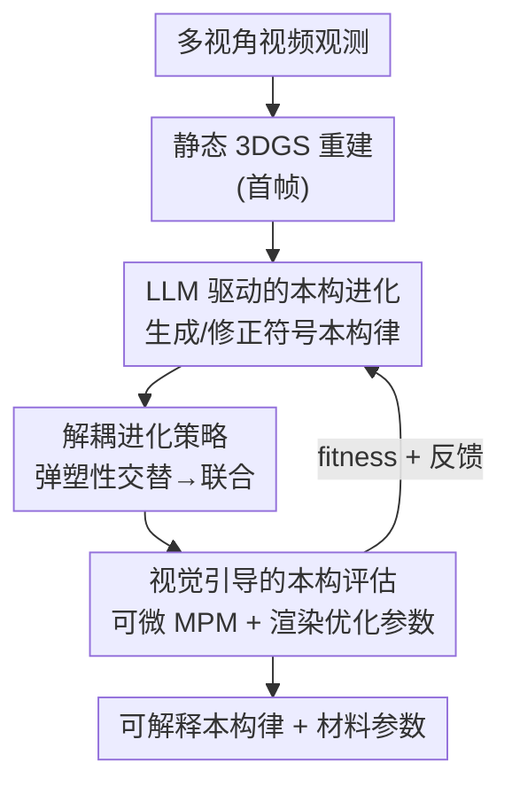

# VisionLaw: Inferring Interpretable Intrinsic Dynamics from Visual Observations via Bilevel Optimization

**会议**: ICLR 2026  
**OpenReview**: [https://openreview.net/forum?id=eWoUcwEtLt](https://openreview.net/forum?id=eWoUcwEtLt)  
**代码**: https://github.com/JiajingLin/VisionLaw  
**领域**: 物理仿真 / 3D视觉 / 本构律推断  
**关键词**: 内禀动力学, 本构律, 双层优化, LLM 进化, 可微 MPM

## 一句话总结
VisionLaw 把"从视频里看出物体物理性质"建模成一个双层优化问题——上层让 LLM 当物理专家，进化出**符号形式（Python 代码）的本构律**；下层用可微 MPM 仿真器在视觉监督下优化连续材料参数并回传 fitness 与反馈，最终从单视角视频里推断出既可解释又能泛化的内禀动力学，合成数据上 Chamfer 距离从 NeuMA 的 2.86 降到 1.65。

## 研究背景与动机
**领域现状**：要让 3D 资产做出真实的可交互仿真（VR、具身智能、动画里物体被推/被压时的反应），就得知道它的**内禀动力学**——材料属性（如刚度）和本构律（material 在受力下如何响应）。近年的主流路线是把物理仿真器（尤其是物质点法 MPM）嵌进 NeRF / 3DGS 这类视觉表示里，从而"看视频反推物理"。按推断对象可分两类：一类估材料参数（PAC-NeRF、GIC、PhysDreamer），一类推本构律（OmniPhysGS、NeuMA）。

**现有痛点**：这两条路各有硬伤。**人工预定义本构律**这一派（PAC-NeRF、NCLaw、OmniPhysGS）依赖手工设计的本构形式或一个专家给定的本构集合，但真实世界材料的非线性行为五花八门，预设形式经常对不上实际动力学，参数估计跟着失准。**神经网络本构律**这一派（NeuMA）直接用网络拟合本构律，灵活是灵活，但它是黑盒：① 学出来的律没有可解释性，人和 LLM 都看不懂；② 缺物理归纳偏置，网络倾向于机械地重建视觉观测而非建模背后的动力学，于是过拟合训练视角、换个视角/换个场景就崩。

**核心矛盾**：可解释性/泛化性 与 表达灵活性 之间存在 trade-off——手工本构律可解释但不够灵活，神经本构律灵活但不可解释且易过拟合。问题根子在于：本构律本质是一个**离散的符号表达式**（什么函数形式）外加一组**连续参数**（具体数值），而现有方法要么把符号部分写死、要么把它揉进神经权重里彻底丧失符号性。

**本文目标**：从多视角视频里**同时**推断出离散的本构律符号表达式，并优化其连续材料参数，且推断结果要可解释、能泛化到新场景。

**切入角度**：作者注意到 LLM 在科学发现里展现出强符号推理能力和丰富物理先验，可以充当"物理专家"去**写本构律**——把每条本构律表示成一段有明确物理含义的 Python 代码，既保留符号可解释性，又能借进化搜索不断试错改进。

**核心 idea**：用一个双层优化框架统一"本构律进化"和"视觉引导评估"：上层 LLM 进化符号本构律（离散结构搜索），下层可微仿真在视觉监督下优化材料参数并打分反馈（连续参数优化），闭环互相驱动。

## 方法详解

### 整体框架
VisionLaw 要解决的是一个"结构 + 参数"双重未知的反问题：本构律 $\varphi$（由弹性律 $\varphi_E$ 和塑性律 $\varphi_P$ 组成）是离散的符号表达式，材料参数 $\theta$ 是连续数值，二者都得从视频里反推出来。作者把它写成一个双层优化目标：

$$\min_{\varphi,\Theta}\; \mathcal{L}\big(R(\varphi,\Theta,\theta^*;\Phi,G),\,V\big),\quad \text{s.t.}\; h(\varphi,\Theta;\Phi)\le 0,\; \theta^*\in\arg\min_{\theta\in\Theta}\mathcal{L}\big(R(\theta;\varphi,\Phi,G),V\big)$$

其中 $\Phi$ 是可微 MPM 仿真器，$R$ 是可微渲染器，$V$ 是视频观测，$h(\cdot)\le 0$ 约束本构律必须"可仿真"。直观理解：**上层**搜本构律的符号形式 $(\varphi,\Theta)$，**下层**在给定符号形式下把连续参数 $\theta$ 优化到最优 $\theta^*$，并把优化得到的最小 loss 当作这条律的"适应度"、把 loss 曲线和参数轨迹当作"反馈"交回上层指导下一轮进化。

整条 pipeline 这样转：从多视角视频首帧重建静态 3DGS → 初始化一个纯弹性本构个体作为种群起点 → 下层把候选本构律嵌入可微 MPM 驱动仿真、渲染出预测动态、与观测算 loss 并反传优化材料参数，产出 fitness 与反馈 → 上层选出 top-k 个体，连同反馈编码进 prompt 交给 LLM 分析、改进、生成下一代本构律（受解耦进化策略调度）→ 迭代直到收敛。

### 关键设计

**1. 双层优化框架：把"符号结构搜索"与"连续参数优化"拆成两层各司其职**

本构律推断的难点在于它既要定**函数形式**（离散）又要定**数值**（连续），把两者塞进同一个优化器里要么搜不动要么丢可解释性。VisionLaw 的破局点是按变量性质分层：上层只管离散符号表达式 $(\varphi,\Theta)$ 的生成与修正，交给擅长符号推理的 LLM；下层只管连续材料参数 $\theta$ 的优化，交给可微仿真 + 梯度下降。两层通过 fitness（下层达到的最小 loss）和 feedback（loss 曲线、参数更新轨迹）耦合——下层评估结果既给上层选择父代提供依据，又以自然语言反馈形式注入 LLM 的 prompt 指导改写。这种分工让"该用符号推理的地方用 LLM、该用梯度的地方用可微优化"，规避了纯神经方法把结构揉进权重导致黑盒的问题。

**2. LLM 驱动的本构进化：让大模型当物理专家，把本构律写成可解释的 Python 代码**

针对"神经本构律不可解释、缺物理先验"的痛点，上层把 LLM 当作进化算子，每条本构律都表示成一段有清晰物理含义的 Python 代码片段（弹性模型输出 Kirchhoff 应力 $\tau$，塑性模型输出修正后的形变梯度 $F_{\text{corrected}}$）。整个搜索是一个五阶段进化循环：① **初始化**——以经典本构律（如线性各向同性弹性 + 恒等塑性的纯弹性模型）作物理上合理的起点；② **适应度评估**——每个候选个体送下层仿真打分并收集反馈；③ **选择**——先剔除适应度差小于阈值 $\epsilon$ 的重复个体以保多样性、避免局部最优，再选 top-k 高适应度个体当父代；④ **表达式修正**——提示 LLM 先依反馈分析父代表达式缺陷、再制定改进计划、最后生成一组物理上合理的新候选，形式化为 $\{\varphi_m,\Theta_m\}_{m\in|M|}=\text{LLM}(\{\varphi_k,\Theta_k,O_k\}_{k\in|K|},P)$，其中 $O$ 是下层反馈、$P$ 是 prompt；⑤ **迭代**重复 ②–④。这样既借 LLM 的物理先验注入了归纳偏置（抑制过拟合），又因为输出是符号代码而天然可解释，人能直接读懂公式的物理含义。

**3. 解耦进化策略：先弹塑交替、再联合精修，化解搜索空间爆炸**

一条完整本构律由弹性部分 $\varphi_E$ 和塑性部分 $\varphi_P$ 共同决定，若同时优化两者，搜索空间成倍膨胀，LLM 搜起来困难、难收敛到高质量解。解耦策略把这个耦合任务拆成两个可独立求解的子任务，分两阶段走：**交替进化**阶段每轮只让 LLM 优化弹性或塑性其中一个分量、另一个固定，下一轮再换，多轮交替；**联合进化**阶段在交替优化产出高质量表达式之后，再让 LLM 从全局视角同时微调弹塑两部分做精修。论文实现为 4 轮交替 + 3 轮联合。这样先"分而治之"缩小每一步的搜索空间、提升稳定与效率，再"全局微调"补上分量间耦合的细节，既锐化了利用（exploitation）又拓宽了探索（exploration）。

**4. 视觉引导的本构评估：用可微 MPM + 渲染把视频变成可反传的监督信号**

下层要回答"这条候选本构律到底符不符合视频里的动力学"，并给上层提供高质量打分与反馈。做法是：先从多视角视频首帧重建静态 3DGS 表示，把带连续参数的候选本构律 $\varphi(\theta)$ 无缝嵌入可微 MPM 仿真器，MPM 驱动 3DGS 做前向仿真、渲染出各视角预测视频 $\hat V$，与观测 $V$ 算监督 loss：

$$\mathcal{L}=\frac{1}{N}\sum_{n=1}^{N}\big[\lambda\, L_2(\hat V_n,V_n)+(1-\lambda)\,L_{\text{D-SSIM}}(\hat V_n,V_n)\big]$$

由于渲染器 $R$ 和 MPM 仿真器 $\Phi$ 都可微，这个 loss 能一路反传去优化连续材料参数 $\theta$（Adam，lr $1\times10^{-3}$）。优化过程中收集 loss 曲线和参数更新轨迹当作反馈 $O$ 喂给上层 LLM 的 prompt，并把优化达到的**最小 loss 作为该本构候选的 fitness** 指导上层选择。值得一提的是，作者还验证了把下层换成无梯度的差分进化搜索也能收敛到可比解，说明该评估机制不强依赖可微性，在非可微仿真环境里同样可用。

### 损失函数 / 训练策略
下层监督 loss 为 L2 与 D-SSIM 的加权（见式上），上层无显式 loss、由 fitness（下层最小 loss）驱动进化选择。上层用 GPT-4.1-mini 生成本构假设；解耦进化执行 4 轮交替 + 3 轮联合；下层 MPM 在重力 $9.8\,\text{m/s}^2$ 下用 Adam（lr $1\times10^{-3}$）优化材料参数；每个场景 5 个随机种子独立跑，硬件为单张 NVIDIA A40（48 GB）。所有实验仅用**单视角视频**作真值观测来推断内禀动力学。

## 实验关键数据

### 主实验
合成数据（NeuMA 的 6 个动态场景）上用仿真轨迹与真值粒子轨迹的 L2-Chamfer 距离衡量内禀动力学一致性（越低越好）：

| 方法 | BouncyBall | ClayCat | HoneyBottle | JellyDuck | RubberPawn | SandFish | 平均 |
|------|-----------|---------|-------------|-----------|------------|----------|------|
| PAC-NeRF | 516.30 | 15.38 | 2.21 | 137.73 | 15.47 | 1.71 | 114.80 |
| NCLaw | 56.69 | 2.35 | 0.92 | 11.97 | 3.91 | 1.30 | 12.86 |
| NeuMA | 1.78 | 1.24 | 1.09 | 10.96 | 1.01 | 1.07 | 2.86 |
| **VisionLaw** | **1.08** | **0.77** | **0.79** | **5.19** | **0.94** | 1.10 | **1.65** |

VisionLaw 平均 Chamfer 1.65，显著优于最相关的 NeuMA（2.86），在复杂场景（BouncyBall、JellyDuck）优势尤为明显；仅 SandFish 一项略逊于 NeuMA（1.10 vs 1.07）。视觉保真度上（PSNR），VisionLaw 在全部非训练视角的平均 PSNR 上超过 NeuMA，且各视角表现稳定；而 NeuMA 在训练视角及邻近视角 PSNR 高、未见视角骤降，暴露其过拟合训练视角的问题。真实数据（Spring-Gaus 的 Bun、Burger 两场景）上，VisionLaw 的 PSNR 也优于只能建线性弹性的 Spring-Gaus 和易受噪声影响的 NeuMA。

### 消融实验

| 配置 | 关键现象 | 说明 |
|------|---------|------|
| 含解耦（4 交替 + 1 联合）| RGB loss 更低、阴影区更大 | 完整策略：搜索空间更小、解多样性更高 |
| 去解耦（5 轮全联合）| RGB loss 更高、收敛更早陷入差的局部最优 | 联合优化使搜索空间爆炸 |
| 下层：梯度优化（默认）| 收敛快、runtime 低 | 依赖可微仿真 |
| 下层：进化搜索（DE，pop 5/10）| 收敛到可比解，ClayCat/RubberPawn 甚至更优，但 runtime 高 | 证明可用于非可微仿真环境 |

泛化（仅用前 200 帧推断、预测后 200 帧，Chamfer）：VisionLaw 在 ClayCat 0.95 / HoneyBottle 0.96 / RubberPawn 0.93 / BouncyBall 1.17，对应 NeuMA 为 7.93 / 1.24 / 1.39 / 13.6——NeuMA 因过拟合在时序外推上大幅发散，VisionLaw 凭物理归纳偏置保持稳定。

### 关键发现
- **解耦进化贡献关键**：去掉解耦后 RGB loss 全面升高且更早陷入差解，说明把弹塑性搜索拆开（交替→联合）是稳定 LLM 搜索、提质量的核心；阴影区（解多样性）更大也印证它同时增强了探索。
- **物理归纳偏置带来泛化**：相比黑盒神经本构律，LLM 注入的物理先验 + 符号表达的隐式正则，使 VisionLaw 在未见视角、未见时序、跨场景 4D 交互（image-to-4D / 3D-to-4D，clay 缓慢形变、rubber 弹性回弹、sand 分散）上都更稳。
- **下层优化器可换**：把可微梯度优化换成无梯度差分进化仍能达到可比甚至更优结果，代价是 runtime 显著增加——这说明框架不锁死在可微仿真上，具备落地非可微环境的潜力。

## 亮点与洞察
- **把"反推物理律"重构成结构/参数双层优化**：离散符号交给 LLM、连续数值交给可微梯度，各取所长，是这篇最巧的顶层设计——它直接化解了"灵活 vs 可解释"的老 trade-off。
- **本构律 = Python 代码**：用可执行代码片段表示本构律，既能直接嵌进 MPM 仿真器跑，又让人/LLM 都读得懂物理含义，符号形式本身还起到隐式正则、抑制过拟合的作用，一举多得。
- **解耦进化是可迁移的 trick**：当 LLM-as-optimizer 的搜索对象天然可分解（这里是弹性/塑性）时，"先分量交替、再全局联合"能显著压缩搜索空间、稳住收敛，这套思路可迁移到其他 LLM 驱动的多分量符号搜索任务。
- **fitness + 自然语言反馈双通道**：下层不仅回传一个标量分数，还把 loss 曲线和参数轨迹当反馈编进 prompt，让 LLM 的"修正"有据可依，而非盲改。

## 局限与展望
- 上层依赖 GPT-4.1-mini 的物理先验与符号推理，对 LLM 能力和 prompt 设计敏感，换弱模型或换领域（如非 MPM 可表达的材料）效果未知。
- 评估开销不低：每个候选都要跑一遍可微仿真 + 参数优化，进化多轮 × 多候选 × 5 种子，算力成本可观；换无梯度搜索后 runtime 进一步上升。
- 仿真器仍是 MPM，能表达的本构形式受 MPM 框架（弹性律 + 塑性回映）限制，超出该范式的复杂材料（如强各向异性、断裂、相变）能否覆盖存疑。
- 真实数据仅 2 个场景、每场景 3 视角 19 帧，规模偏小，真实世界鲁棒性的证据还较薄。

## 相关工作与启发
- **vs NeuMA（最相关）**：NeuMA 用神经网络直接学本构律，灵活但黑盒、缺物理偏置、过拟合训练视角；VisionLaw 改用 LLM 进化**符号本构律**，可解释 + 物理先验加持，合成 Chamfer 从 2.86 降到 1.65，未见视角/时序泛化大幅领先。
- **vs PAC-NeRF / NCLaw**：它们依赖人工预定义本构律、只估参数或拟合已知动力学，对初始化敏感、对不上真实复杂动力学；VisionLaw 让本构形式本身可被搜索发现，不再受预设形式束缚。
- **vs OmniPhysGS**：OmniPhysGS 从专家设计的本构集合里给每个高斯核分配现成的律，受限于集合覆盖面；VisionLaw 由 LLM 现场生成全新符号律，表达多样性更高。
- **vs Spring-Gaus**：Spring-Gaus 用弹簧-质点系统建线性弹性、估弹簧刚度，处理不了真实可形变物体的非线性弹性；VisionLaw 借 LLM 物理先验覆盖更广的非线性行为。

## 评分
- 新颖性: ⭐⭐⭐⭐⭐ 把内禀动力学推断重构成"LLM 进化符号本构律 + 可微仿真评估"的双层优化，符号化 + LLM-as-optimizer 的组合很新。
- 实验充分度: ⭐⭐⭐⭐ 合成 6 场景 + 真实 2 场景 + 泛化/消融/非可微潜力分析较全，但真实数据规模偏小。
- 写作质量: ⭐⭐⭐⭐⭐ 动机—痛点—方法—闭环讲得清晰，图 2 pipeline 和符号代码示例直观。
- 价值: ⭐⭐⭐⭐ 为可解释、可泛化的物理感知 4D 交互提供了新范式，对具身/仿真有实际意义。

<!-- RELATED:START -->

## 相关论文

- [\[ICML 2026\] From Geometry to Dynamics: Learning Overdamped Langevin Dynamics from Sparse Observations with Geometric Constraints](../../ICML2026/physics/from_geometry_to_dynamics_learning_overdamped_langevin_dynamics_from_sparse_obse.md)
- [\[ICLR 2026\] LD-EnSF: Synergizing Latent Dynamics with Ensemble Score Filters for Fast Data Assimilation with Sparse Observations](ld-ensf_synergizing_latent_dynamics_with_ensemble_score_filters_for_fast_data_as.md)
- [\[ICLR 2026\] Stretching Beyond the Obvious: A Gradient-Free Framework to Unveil the Hidden Landscape of Visual Invariance](stretching_beyond_the_obvious_a_gradient-free_framework_to_unveil_the_hidden_lan.md)
- [\[ICLR 2026\] Robust and Interpretable Adaptation of Equivariant Materials Foundation Models via Sparsity-promoting Fine-tuning](robust_and_interpretable_adaptation_of_equivariant_materials_foundation_models_v.md)
- [\[ICLR 2026\] PRO-MOF: Policy Optimization with Universal Atomistic Models for Controllable MOF Generation](pro-mof_policy_optimization_with_universal_atomistic_models_for_controllable_mof.md)

<!-- RELATED:END -->
