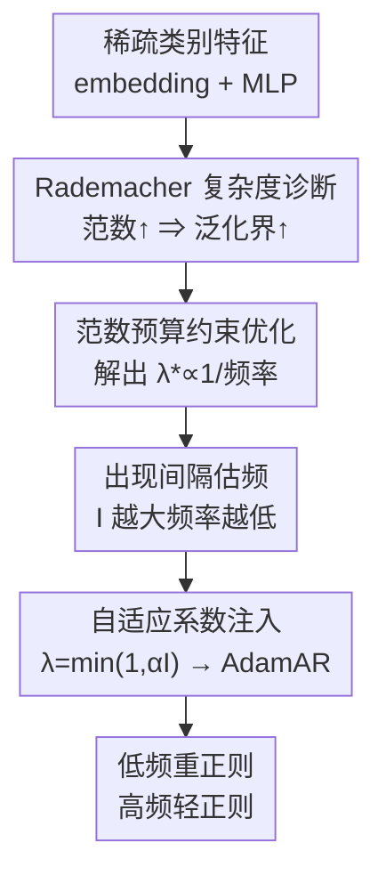

# Adaptive Regularization for Large-Scale Sparse Feature Embedding Models

**会议**: ICLR 2026  
**OpenReview**: [https://openreview.net/forum?id=QFH5mwP9oH](https://openreview.net/forum?id=QFH5mwP9oH)  
**代码**: https://github.com/alibaba-aidc/adaptive-regularization.git  
**领域**: 推荐 / CTR 预估 / 稀疏特征嵌入  
**关键词**: one-epoch 过拟合, Rademacher 复杂度, 自适应正则, embedding 范数预算, AdamAR

## 一句话总结
本文用 Rademacher 复杂度从理论上解释了 CTR/CVR 模型「训练超过一个 epoch 就严重过拟合」的根因——embedding 层范数无约束增长撑大了泛化界，并据此提出按特征出现频率自适应分配范数预算的正则方法 AdamAR：高频特征轻正则、低频特征重正则，既消除多 epoch 过拟合又能提升单 epoch 性能，已在阿里搜索广告线上部署。

## 研究背景与动机
**领域现状**：电商搜索、广告、推荐（ASR）里的 CTR/CVR 预估模型，主流结构是「大规模稀疏类别特征 → embedding 层 → MLP 主干」。这些类别特征（item ID、品牌 ID、卖家 ID 等）动辄上亿维，且绝大多数取值出现频率极低。业界一个反直觉的经验是：这类模型只能训一个 epoch，一旦训到第二个 epoch，测试 AUC 就断崖式下跌——即「one-epoch 过拟合」现象。

**现有痛点**：已有缓解手段都是启发式或代价高昂的。MEDA（Liu et al. 2023）在每个 epoch 开头把所有类别特征的 embedding 及其优化器状态重新初始化，虽能压住多 epoch 过拟合，但它只在 epoch 边界重置、并不保证收敛最优，重置还会丢掉大量已学到的信息。另一类（Wang et al. 2025）用生成式预训练先拿到冻结的特征 embedding，需要额外巨大的预训练算力，且预训练阶段的参数预算没算进来，无法和单 epoch 训练公平对比。通用手段如 dropout、L1/L2、weight decay（AdamW）则对所有参数施加**相同**的衰减，在稀疏度差异巨大的工业数据上是次优的：它会削弱稠密特征的拟合精度，却又压不住稀疏特征的过拟合。

**核心矛盾**：根本问题是「one-epoch 现象到底为什么发生」始终没有理论解释——大家只知道它和特征稀疏性强相关，但说不清机制，于是只能打补丁。同时还有一个 trade-off：放任 embedding 范数增长会撑大泛化误差界，而强行把所有 embedding 范数都压死又会抬高训练误差、损失性能。

**本文目标**：（1）给出 one-epoch 过拟合的理论根因；（2）设计一个能按特征稀疏度**差异化**分配正则强度的方法，既防多 epoch 崩塌、又提升单 epoch 性能，还要能直接嵌进现有优化器、可工业落地。

**切入角度**：作者用 Rademacher 复杂度去刻画模型的泛化界，发现界的上界由 embedding 矩阵各行范数之和 $\sum_{i}\sum_{j}\tau_{ij}$ 主导（因为 ASR 模型的参数绝大多数集中在 embedding 层）。这把「为什么过拟合」直接归结到「embedding 范数无约束增长」上，于是正则该怎么加就有了理论指针。

**核心 idea**：把「给每个 embedding 向量分配多大的范数预算」写成一个带全局范数约束的优化问题，解出最优正则系数应当**与该特征的样本频率成反比**——高频特征给大预算（轻正则），低频特征给小预算（重正则）；再用「出现间隔」在线估计频率，把这个自适应系数解耦地塞进 Adam/Adagrad 的更新规则。

## 方法详解

### 整体框架
方法是一条「理论诊断 → 约束优化 → 频率在线估计 → 注入优化器」的链路。先用 Rademacher 复杂度证明 embedding 范数和泛化界的关系，定位过拟合根因；再把范数预算分配写成约束优化、解出「最优正则强度反比于样本频率」这一结论；由于训练时拿不到精确频率，用每个 embedding 向量的「出现间隔」来在线近似频率；最后把得到的自适应正则系数按 AdamW 的解耦衰减方式融进每一步参数更新，得到 AdamAR（以及 AdagradAR）。

### 关键设计

**1. Rademacher 复杂度诊断：把 one-epoch 过拟合归因到 embedding 范数增长**

痛点是大家只观察到「稀疏 → 过拟合」却给不出机制。作者把 embedding 层看成线性投影，基于 Golowich et al. (2018) 的范数依赖界，推出整个模型的经验 Rademacher 复杂度上界
$$\widetilde{R}_T(\mathcal{H}_L) \le \sqrt{\tfrac{S}{T}}\Big(\prod_{l=1}^{L} M_F(l)\Big)\sqrt{\sum_{i=1}^{S}\sum_{j=1}^{N_i}\tau_{ij}}\;\big(\sqrt{2\log(2)}\,L+1\big),$$
其中 $\tau_{ij}$ 是 embedding 矩阵 $E_i$ 第 $j$ 行的平方 $\ell_2$ 范数，$S$ 是类别特征数，$T$ 是样本数。由于 ASR 模型参数几乎全在 embedding 层，$\sum_i\sum_j\tau_{ij}$ 直接主导这个上界进而主导泛化误差界。结合后文 Proposition 2 的分析与第 4.4 节实验（人为过滤 iPinYou 最稀疏的 "IP" 特征后过拟合消失），结论是：训练中 embedding 范数若不加约束会持续增长（因为目标 $\phi(\tau_{ij})$ 单调不增，范数只会越涨越大直到不再降 loss），范数越涨界越松，多 epoch 时就崩。这第一次把 one-epoch 现象从经验观察提升到可量化的理论根因。

**2. 范数预算的约束优化：解出「正则强度反比于样本频率」**

诊断给出方向后，问题变成「该给每个 embedding 多大的范数预算」。作者把它写成带全局预算约束的优化：
$$\min_{\tau_{ij}>0}\ \sum_{i=1}^{S}\sum_{j=1}^{N_i} m_{ij}\,\phi(\tau_{ij})\quad\text{s.t.}\quad \sum_{i=1}^{S}\sum_{j=1}^{N_i}\tau_{ij}\le C,$$
其中 $\phi(\tau_{ij})=\min_{\|e_{ij}\|^2\le\tau_{ij}}L(e_{ij})$ 是在范数预算 $\tau_{ij}$ 下该 embedding 能达到的最小 CE loss（对 $\tau_{ij}$ 单调不增），$m_{ij}$ 是该 embedding 在训练集中出现的频率，$C$ 是全局范数上界（由式中可知 $C$ 直接决定 Rademacher 复杂度上界）。对这个问题用包络定理 + KKT 条件，作者证明了 Proposition 1：最优正则乘子满足
$$\lambda^*_{ij}=\mu_0/m_{ij},$$
$\mu_0$ 是全局约束对应的 Lagrange 乘子。这句话的含义很直接——**最优正则强度与特征出现频率成反比**：高频特征该给大范数预算、轻正则；低频特征该给小预算、重正则。这正好解释了为什么 AdamW 那种「一刀切等量 weight decay」是次优的。

**3. 用出现间隔在线估频 + 自适应正则系数：落地成 AdamAR**

Proposition 1 是理想结论，但训练时直接拿精确频率 $m_{ij}$ 不现实。作者用每个 embedding 向量的随机出现间隔 $I_{ij}$ 来近似：在 i.i.d. 假设下 $\mathbb{E}[m_{ij}]=T/\mathbb{E}[I_{ij}]$，即频率与平均出现间隔成反比，于是间隔可作为频率的在线代理。具体地，维护一个「上次有效更新步」$s^k_{ij}$（lazy 变量，仅当梯度范数 $\|g_{ij}\|>0$ 时把它设为当前步 $k$），定义间隔 $I^k_{ij}=k-s^{k-1}_{ij}-1$，自适应正则系数为
$$\lambda^k_{ij}=\min\big(1,\ \alpha I^k_{ij}\big),$$
$\alpha\in[0,1)$ 是基础正则系数。间隔越大（特征越稀疏、越久没更新）正则越强，间隔为 0（如每个 batch 都更新的 MLP 参数）则几乎不正则。按 AdamW 的解耦衰减方式把它塞进更新：$\theta^k_p\leftarrow\theta^{k-1}_p-\lambda^k_p\theta^{k-1}_p-\eta\cdot\hat m^k_p/(\sqrt{\hat v^k_p}+\varepsilon)$，即得 AdamAR。它只需额外存一个「上次更新步」状态，几乎不增计算，且天然兼容 Adagrad（AdagradAR）等带 weight decay 的优化器。

**4. 机制解释与 MEDA 的统一：为什么自适应衰减有效、旧方法只是特例**

Proposition 2 给出更新后参数范数的上界 $\|\theta^k_p\|\le(1-\alpha)^{I^k_p}\|\theta^{k-1}_p\|+\|\eta\cdot\hat m^k_p/(\sqrt{\hat v^k_p}+\varepsilon)\|$。它说明：当间隔 $I^k_p$ 很大时，$(1-\alpha)^{I^k_p}$ 指数衰减、旧值 $\theta^{k-1}_p$ 几乎被抹掉，参数主要由最新梯度决定。这在直觉上很合理——稀疏特征的 embedding 很久才更新一次，等 MLP 都快收敛了它才被动一下，此时旧值已和当前 MLP 状态严重失配，理应弱化旧值、信任新梯度。而 MLP 参数每个 batch 都更新（$I=0$），正则对它几乎无影响，于是机制自动把正则火力集中到低频 embedding 上。更进一步，作者指出 MEDA 只是本方法在「零重置 + $I^k_p$ 取阶梯式（仅 epoch 边界为 $1/\alpha$、其余为 0）」时的特例——这解释了为什么 MEDA 只在 epoch 边界起效、对单 epoch 内已过拟合的特征无能为力。此外 Proposition 3 证明自适应正则不改变 Adam 的最小收敛界、只改变常数项，保证了理论上的安全性。

### 损失函数 / 训练策略
基础任务损失是 CTR/CVR 的二元交叉熵；正则不是额外加在 loss 上，而是按 AdamW 解耦衰减的方式直接进优化器更新步。关键超参是基础系数 $\alpha\in[0,1)$，与 weight decay 一样在 $10^n$（$n$ 从 $-6.5$ 到 $-1$、步长 0.5）上做网格搜索按验证集选最优；embedding 维度 32、零初始化，Adam 学习率 0.001、Adagrad 0.01，batch size 2048。

## 实验关键数据

### 主实验
在 iPinYou / Amazon / Avazu 三个公开数据集 + LZD（自有赞助搜索数据集）上，跨 DNN / WDL / xDeepFM / WuKong 四种主干、训练 4 个 epoch，对比 baseline 优化器、MEDA、SAM、AdamW（仅 embedding 加 weight decay）与本文 AdamAR。下面摘取 Adam 优化器下的代表性 AUC（E1/E4 表示第 1/4 epoch 后）：

| 数据集 / 主干 | 方法 | E1 (单 epoch) | E4 (多 epoch) |
|--------------|------|------|------|
| iPinYou / DNN | Adam | 0.7515 | 0.7014（崩） |
| iPinYou / DNN | MEDA | 0.7515 | 0.7717 |
| iPinYou / DNN | AdamW | 0.7475 | 0.7568 |
| iPinYou / DNN | **AdamAR** | **0.7566** | **0.7724** |
| Avazu / DNN | Adam | 0.7461 | 0.6883（崩） |
| Avazu / DNN | **AdamAR** | **0.7617** | **0.7629** |
| LZD / DNN | Adam | 0.7118 | 0.6065（崩） |
| LZD / DNN | **AdamAR** | **0.7229** | **0.7234** |

裸 Adam 在 E4 普遍断崖（Avazu 从 0.746 跌到 0.688、LZD 从 0.712 跌到 0.607）；AdamAR 不仅在多 epoch 稳住且拿到所有数据集/架构里的最高 AUC，连**单 epoch（E1）**也几乎处处超过 MEDA 和 AdamW。唯一例外是特征/样本量最少的 Amazon 上 SAM 单 epoch 略优。Adagrad 版结论一致（AdagradAR 同样领先）。

### 消融实验
基于 iPinYou（恰好只有 "IP" 一个特征导致 one-epoch 问题），按 "IP" 频率分 5 个桶（桶号越小频率越低），从 AdamW 出发逐桶替换为本文方法（Adam）：

| 配置 | E1 | E4 | 说明 |
|------|------|------|------|
| AdamW（全桶等量衰减） | 0.7486 | 0.7500 | baseline |
| AR 桶 1 + W 桶 2-5 | 0.7457 | 0.7520 | 只对最低频桶自适应 |
| AR 桶 1-3 + W 桶 4-5 | 0.7510 | 0.7614 | 覆盖更多低频桶 |
| AR 桶 1-4 + W 桶 5 | 0.7470 | 0.7656 | — |
| **AdamAR（全桶自适应）** | **0.7549** | **0.7725** | 完整方法 |

逐桶替换可见：把高频桶的衰减调小、低频桶的衰减调大，能在缓解 one-epoch 的同时持续抬升 AUC，验证了「正则强度该随频率差异化」的核心论断。

### 关键发现
- **低频 embedding 是 one-epoch 过拟合的元凶**：第 4.4 节人为按比例 $r$ 过滤 "IP" 特征的低频 ID，$r$ 越小（保留越少低频 ID）多 epoch AUC 越稳；但直接删掉整个 "IP" 特征（$r=0$）会让 E1 AUC 从 0.7498 掉到 0.7429——所以不能粗暴删特征，得靠自适应正则。
- **范数与泛化负相关**：学习曲线显示 embedding 的累计 $\ell_2$ 范数与测试 AUC 呈反相关，AdamAR 拿到所有方法里最低的累计范数，印证「压范数 = 提泛化」。
- **桶分析**：自适应正则能逐桶控制范数同时保住各桶 AUC 增益，高频桶因获得更大范数预算而表现尤其好。

## 亮点与洞察
- **从「打补丁」升级到「有理论」**：这篇最大的价值是把工业界口口相传的「CTR 模型只能训一个 epoch」第一次用 Rademacher 复杂度讲清了根因（embedding 范数无约束增长撑大泛化界），让后续优化有了可推导的指针，而不是继续试错。
- **「正则 ∝ 1/频率」是个干净又可落地的结论**：Proposition 1 把直觉（稀疏特征更易过拟合、该重罚）变成了可证明的等式，再用「出现间隔」巧妙绕开了训练时拿不到精确频率的工程难题——这个「间隔即频率代理」的 trick 几乎零成本，可迁移到任何需要按频率差异化处理稀疏参数的场景。
- **把已有方法收进同一框架**：证明 MEDA 是本方法在特定间隔取值下的特例，既解释了 MEDA 为何只在 epoch 边界有效，也顺手说明了自己方法的普适性，论证很漂亮。
- **真·工业落地**：方法解耦进优化器、只多存一个状态、几乎不增算力，且已在阿里赞助搜索线上全量部署，可信度高。

## 局限与展望
- **理论分析限定在 embedding 层 + 基础 DNN**：Rademacher 界的推导只讨论 embedding 层影响、主干用基础 DNN（FM-like 模型放在附录），对带复杂特征交互的现代主干，理论与实测的吻合度还需更系统的验证。
- **超参 $\alpha$ 仍靠网格搜索**：$\alpha$ 和 weight decay 一样在 $10^n$ 网格上按验证集挑，没有给出自动选取或自适应调整 $\alpha$ 的方案，换数据集需重新搜。
- **LLM SFT 的 one-epoch 现象未触及**：作者在引言提到 LLM SFT 也有类似现象（但有人认为适度过拟合反而有益），本文明确留作未来工作，方法是否迁移到生成式场景仍是开放问题。
- **i.i.d. 假设**：用 $\mathbb{E}[m_{ij}]=T/\mathbb{E}[I_{ij}]$ 估频依赖 i.i.d. 采样，在有强时序漂移的真实流式数据上，间隔对频率的估计可能有偏。

## 相关工作与启发
- **vs MEDA（Liu et al. 2023 / Fan et al. 2024）**：MEDA 在每个 epoch 边界重置 embedding 及优化器状态来压过拟合，是启发式、会丢信息、且对单 epoch 内已过拟合的特征无效；本文证明 MEDA 是自己在「零重置 + 阶梯式间隔」下的特例，并用连续的频率感知正则替代了硬重置，单 epoch 与多 epoch 都更优。
- **vs 生成式预训练冻结 embedding（Wang et al. 2025）**：那条路需额外巨量预训练算力、且参数预算没纳入对比因而不算公平解法；本文无需预训练、直接在标准训练里解决，资源友好。
- **vs AdamW / weight decay**：AdamW 对所有参数（含 embedding）施加等量解耦衰减，在稀疏度差异巨大的工业数据上次优——压不住稀疏特征又误伤稠密特征；本文把衰减系数做成随出现间隔自适应的 $\lambda=\min(1,\alpha I)$，等价于按频率差异化的 weight decay。
- **vs SAM**：SAM 通过 sharpness 感知最小化提升泛化，本文实验中仅在最小的 Amazon 数据集单 epoch 上略胜，其余场景全面落后于 AdamAR，且 SAM 多 epoch 下仍会过拟合。

## 评分
- 新颖性: ⭐⭐⭐⭐⭐ 首次用 Rademacher 复杂度给 one-epoch 现象理论根因，并解出「正则 ∝ 1/频率」+ 间隔估频的落地方案
- 实验充分度: ⭐⭐⭐⭐ 4 数据集 × 4 主干 × 2 优化器 + 桶分析 + 根因实验，覆盖充分；但理论只在 DNN/embedding 层严格成立
- 写作质量: ⭐⭐⭐⭐ 从诊断到方法到机制一气呵成，命题与实验互相印证；公式较密、对非优化背景读者略硬
- 价值: ⭐⭐⭐⭐⭐ 解决工业 CTR/CVR 长期痛点、已线上全量部署，方法零成本可迁移

<!-- RELATED:START -->

## 相关论文

- [\[ICLR 2026\] RPM: Reasoning-Level Personalization for Black-Box Large Language Models](rpm_reasoning-level_personalization_for_black-box_large_language_models.md)
- [\[ICLR 2026\] From Evaluation to Defense: Advancing Safety in Video Large Language Models](from_evaluation_to_defense_advancing_safety_in_video_large_language_models.md)
- [\[AAAI 2026\] TraveLLaMA: A Multimodal Travel Assistant with Large-Scale Dataset and Structured Reasoning](../../AAAI2026/recommender/travellama_a_multimodal_travel_assistant_with_large-scale_dataset_and_structured.md)
- [\[NeurIPS 2025\] R²ec: Towards Large Recommender Models with Reasoning](../../NeurIPS2025/recommender/r2ec_towards_large_recommender_models_with_reasoning.md)
- [\[ICLR 2026\] Steering Diffusion Models Towards Credible Content Recommendation](steering_diffusion_models_towards_credible_content_recommendation.md)

<!-- RELATED:END -->
