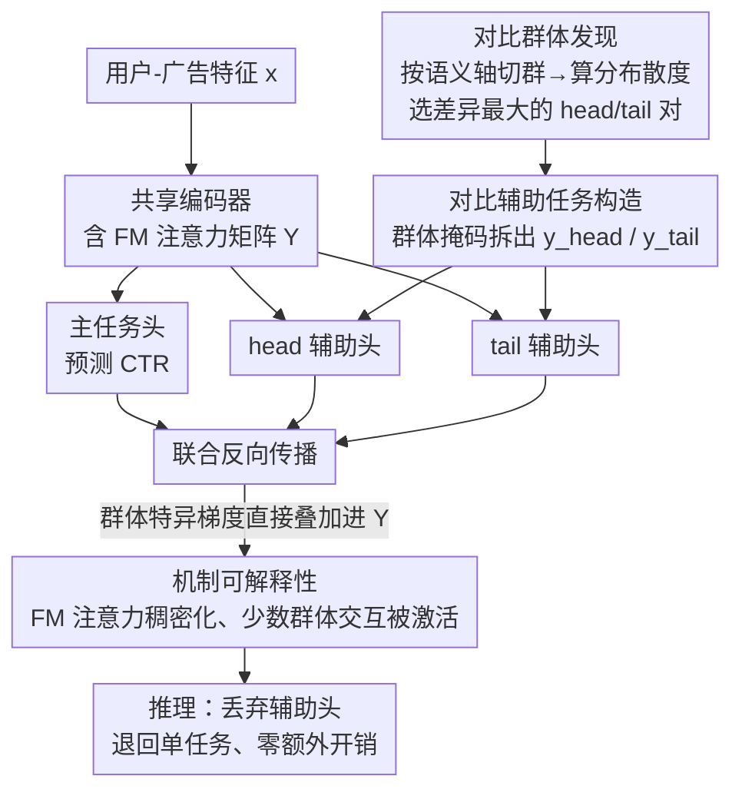

# C2AL: Cohort-Contrastive Auxiliary Learning for Large-scale Recommendation Systems

**会议**: ICLR2026  
**arXiv**: [2510.02215](https://arxiv.org/abs/2510.02215)  
**代码**: 待确认  
**领域**: 推荐系统  
**关键词**: recommendation system, auxiliary learning, cohort contrastive, attention mechanism, representation bias

## 一句话总结
提出 C2AL（Cohort-Contrastive Auxiliary Learning），通过数据驱动地发现分布差异最大的用户群体对，构建对比性辅助二分类任务正则化共享编码器，使 FM 注意力权重从稀疏变为稠密，缓解大规模推荐系统中少数群体的表征偏差，在 Meta 6 个生产模型（数十亿数据点）上验证有效。

## 研究背景与动机

**领域现状**：大规模推荐模型（如 DHEN）在单一全局目标下训练，隐含假设用户群体分布同质。工业界常用多任务学习（MTL）引入辅助任务改善表征，但辅助任务设计多依赖经验启发式。

**现有痛点**：真实数据由异质群体（cohort）组成。随着模型和数据扩大，优化偏向高密度区域（多数群体），导致：(a) FM attention 权重稀疏集中——大量特征交互路径被浪费；(b) 少数群体的特征模式被忽略，出现表征偏差（representation bias）。

**核心矛盾**：全局优化只提供"平均"梯度信号，FM attention 收敛到只捕获全局高频特征交互的稀疏状态，缺少群体特异的梯度驱动力。已有的 PCGrad、CAGrad 等多任务梯度方法关注任务冲突管理，但没有建立辅助损失→注意力机制→表征改进的因果链条。

**本文目标** (a) 有原则地发现分布差异最大的群体对；(b) 构造辅助任务注入群体特异梯度；(c) 提供可解释的机制分析——辅助损失如何精确地改变 FM attention。

**切入角度**：从梯度传播出发分析 FM attention 更新公式，发现辅助损失的梯度会直接叠加到注意力矩阵 $\mathbf{Y}$ 的更新中，提供了精确的机制解释。

**核心 idea**：用分布散度找到对比最大的 head/tail 群体对，构造辅助二分类任务，训练时注入群体特异梯度使 FM attention 稠密化，推理时丢弃辅助头零额外开销。

## 方法详解

### 整体框架
C2AL 要解决的是大规模推荐模型在全局目标下训练时，少数群体被多数群体"淹没"导致的表征偏差。它的做法是在不改动线上架构的前提下，给共享编码器额外挂两个辅助分类头，用群体特异的梯度信号把已经退化的 FM 注意力重新"撑开"。

整条 pipeline 的主干仍是标准 CTR 模型：用户-广告特征向量 $\mathbf{x}$ 先过共享编码器 $f(\mathbf{x};\theta_S)$ 得到嵌入 $\mathbf{h}$，再由主任务头 $g_{\text{primary}}$ 预测点击率。C2AL 的全部改动集中在训练阶段——先离线做一次「对比群体发现」挑出差异最大的 head/tail 群体对，再用「对比辅助任务构造」把标签拆成两路，在共享编码器之上并联两个辅助头 $g_{\text{head}}, g_{\text{tail}}$，三个头共用同一个编码器一起反向传播。这股群体特异的梯度会直接叠加进 FM 注意力矩阵，把退化的注意力重新撑稠。训练一旦结束，辅助头被整体丢弃，上线时模型退回到和 baseline 完全一致的单任务结构。

### 关键设计

**1. 对比群体发现：从数据里自动挑出"模型行为差异最大"的一对群体**

辅助任务有没有用，关键在于挑哪两个群体来对比。C2AL 不靠人工拍脑袋指定，而是沿可解释的语义轴（用户价值、年龄等）先把数据切成 $\{\mathcal{C}_1, \ldots, \mathcal{C}_N\}$ 个群体，再用 baseline 模型在每个群体上的预测分布两两计算散度（KL、JS、Wasserstein、余弦相似度都试过），取散度最大的一对作为 $\mathcal{C}_{\text{head}}$ 和 $\mathcal{C}_{\text{tail}}$。之所以要找"分布差异最大"而不是随便选两组，是因为只有当两个群体的预测行为足够不同，它们带来的辅助梯度才会和主任务梯度"部分冲突"——这种冲突正是信息增益的来源，能强迫编码器去学一些主任务自己学不到的区分模式。

**2. 对比辅助任务构造：用群体掩码把一个标签拆成两个"只在群体内为正"的二分类任务**

选定 head/tail 之后，C2AL 把原标签 $y$ 通过群体掩码拆成两路辅助标签：$y_{\text{head}} = y \cdot \mathbb{I}(\mathbf{x} \in \mathcal{C}_{\text{head}})$，$y_{\text{tail}} = y \cdot \mathbb{I}(\mathbf{x} \in \mathcal{C}_{\text{tail}})$。也就是说，辅助标签只有在样本落进对应群体时才可能为正，群体之外的样本一律置 0。这个置零的设计是关键——它逼着共享编码器必须学会"这个样本到底属不属于这个群体"的区分能力，否则两个辅助头无法同时做对。整体优化目标把主损失和两路辅助损失加权相加：

$$\mathcal{L}_{\text{C2AL}} = \mathcal{L}_{\text{primary}} + \lambda_{\text{head}} \mathcal{L}_{\text{head}} + \lambda_{\text{tail}} \mathcal{L}_{\text{tail}}$$

由于 head 和 tail 两个群体的分布本就"部分冲突"，这两路梯度会持续往不同方向拉编码器，恰好打破了主任务被多数群体梯度主导的局面。

**3. 机制可解释性分析：从梯度公式证明辅助损失是"直接"改写注意力，而非间接正则**

这是全文最核心的一笔——它把辅助学习从"经验上有用"提升到"能写出因果链条"。DHEN 的 FM 注意力计算可写成 $\mathbf{G} = \mathbf{X}\mathbf{X}^\top \mathbf{Y}$，其中 $\mathbf{Y}$ 是注意力矩阵。对 $\mathbf{Y}$ 求 C2AL 总损失的梯度，可以推出：

$$\nabla_{\mathbf{Y}} \mathcal{L}_{\text{C2AL}} = (\mathbf{X}\mathbf{X}^\top)(\nabla_{\mathbf{G}} \mathcal{L}_{\text{primary}} + \lambda_{\text{aux}} \nabla_{\mathbf{G}} \mathcal{L}_{\text{aux}})$$

这个式子说明，辅助梯度 $\nabla_{\mathbf{G}} \mathcal{L}_{\text{aux}}$ 并不是绕一圈通过别的层间接影响表征，而是被 $(\mathbf{X}\mathbf{X}^\top)$ 直接叠加进了 $\mathbf{Y}$ 的更新量里。因为辅助梯度本身编码的就是少数群体特有的特征交互模式，$\mathbf{Y}$ 就被这股力量从原本的稀疏状态（只捕获多数群体的高频交互、大量交互路径被浪费）推向稠密多样（少数群体的特异交互也被激活）。论文进一步用权重可视化做了实证验证：C2AL 主要改变的是注意力层的权重，前置层几乎纹丝不动——这和梯度公式预测的"力直接作用在 $\mathbf{Y}$ 上"完全吻合。

### 损失函数 / 训练策略
训练时三个头（primary + head + tail）联合优化，辅助权重 $\lambda_{\text{head}}, \lambda_{\text{tail}}$ 是超参数。推理时辅助头被丢弃，模型退回单任务架构。这正是 C2AL 在工业落地上的关键优势：辅助头很轻，训练成本只增加一点点，而推理成本完全不变——对推理延迟直接换算成收入的线上系统而言，这一点至关重要。

## 实验关键数据

### 主实验

| 模型/平台 | 归一化熵降低 | 少数群体增益 | 说明 |
|-----------|------------|------------|------|
| Model A (Instagram CTR) | ↓ 0.16% | > 0.30% | DHEN baseline |
| Model B | 显著改善 | > 0.30% | 不同业务场景 |
| Model C-F | 一致正向 | 一致正向 | 6 个生产模型全部有效 |

### 消融实验（注意力权重分布分析）

| 配置 | Attention 权重分布 | 前置层变化 | 说明 |
|------|-------------------|-----------|------|
| Baseline | 稀疏、轻尾、集中于少数路径 | - | 多数群体主导 |
| + C2AL | 稠密、多样、更多路径被激活 | 几乎不变 | 辅助梯度精确改变 attention |
| 前置层对比 | - | 变化极小 | C2AL 是 attention 层特异的 |

### 关键发现
- **C2AL 选择性改变 attention 层**：前置层权重分布几乎不变，而 attention MLP 权重发生显著变化——验证了梯度分析预测的"辅助损失直接注入 attention 更新"
- **权重稠密化 = 更好的少数群体表征**：稠密的 $\mathbf{Y}$ 意味着更多稀疏嵌入参与有意义的二阶交互，少数群体特有的特征组合不再被忽略
- **跨模型一致性**：6 个不同场景的生产模型都展现相同模式——说明机制是通用的，不依赖特定业务场景
- **推荐系统中 0.16% 的归一化熵降低是显著改进**：在数十亿规模上，这对应大量广告收入和用户体验提升

## 亮点与洞察
- **可解释的辅助学习机制**：不同于以往"辅助任务让表征更好但不知道为什么"的解释，C2AL 提供了从辅助损失→梯度→attention 矩阵→表征的完整因果链条。这是本文最核心的贡献——把辅助学习从"经验有效"提升到"机制可解释"
- **零推理开销的正则化**：辅助头只在训练时使用，服务时完全丢弃——在工业系统中至关重要，因为推理延迟直接影响收入
- **数据驱动的群体发现**：不需要人工指定哪些群体"重要"，通过分布散度自动发现——降低了领域知识依赖，使方法更通用
- **FM attention 的稀疏性问题被首次系统分析**：揭示了全局优化导致 attention 退化的机制，这个发现本身对理解大规模推荐模型有独立价值

## 局限与展望
- **群体发现仍需选择语义轴**：虽然散度计算自动化了，但"沿哪个维度切割"仍需领域知识。全自动的群体发现（如聚类+散度）是自然的改进方向
- **仅验证了 FM-based attention**：DHEN 架构特定。Transformer-based 推荐模型（如 SASRec）中的 self-attention 是否有类似的稀疏退化问题值得探索
- **缺少 A/B 测试结果**：6 个模型的离线评估很充分，但没有报告在线 A/B 测试结果。工业论文通常会提供这些数据来证明实际效果
- **辅助权重 $\lambda$ 的选择**：论文未详细讨论超参数敏感性。在不同模型/场景中是否需要重新调参未知

## 相关工作与启发
- **vs PCGrad/CAGrad 等多任务梯度方法**：它们管理已知任务间的梯度冲突，但不构造新任务。C2AL 主动构造"部分冲突"的辅助任务——从被动协调到主动设计
- **vs MMOE/PLE 等多任务架构**：它们通过架构设计学习任务特异的参数分享策略。C2AL 走不同路线——不改架构，只加辅助损失，更适合不想改动线上模型架构的场景
- **vs 公平性/偏差缓解方法**：传统公平性方法通过重加权或约束优化直接处理群体不平衡。C2AL 的视角不同——它不直接优化公平性指标，而是通过改善 attention 表征间接受益少数群体

## 评分
- 新颖性: ⭐⭐⭐⭐ 群体对比+辅助学习+梯度机制分析的组合新颖，从"经验有效"到"机制可解释"是质的提升
- 实验充分度: ⭐⭐⭐⭐⭐ Meta 6 个生产模型、数十亿数据点的工业级验证，权重可视化分析充分支持理论预测
- 写作质量: ⭐⭐⭐⭐ 从问题发现→机制分析→方法设计→实证验证的叙事线清晰，数学推导简洁通透
- 价值: ⭐⭐⭐⭐ 对大规模推荐系统有直接工程价值，机制分析对理解 FM attention 有学术价值

<!-- RELATED:START -->

## 相关论文

- [\[NeurIPS 2025\] Semantic Retrieval Augmented Contrastive Learning for Sequential Recommendation](../../NeurIPS2025/recommender/semantic_retrieval_augmented_contrastive_learning_for_sequential_recommendation.md)
- [\[ICML 2026\] Rethinking Contrastive Learning for Graph Collaborative Filtering: Limitations and a Simple Remedy](../../ICML2026/recommender/rethinking_contrastive_learning_for_graph_collaborative_filtering_limitations_an.md)
- [\[ICLR 2026\] Adaptive Regularization for Large-Scale Sparse Feature Embedding Models](adaptive_regularization_for_large-scale_sparse_feature_embedding_models.md)
- [\[AAAI 2026\] TraveLLaMA: A Multimodal Travel Assistant with Large-Scale Dataset and Structured Reasoning](../../AAAI2026/recommender/travellama_a_multimodal_travel_assistant_with_large-scale_dataset_and_structured.md)
- [\[ICML 2026\] GCIB: Graph Contrastive Information Bottleneck for Multi-Behavior Recommendation](../../ICML2026/recommender/gcib_graph_contrastive_information_bottleneck_for_multi-behavior_recommendation.md)

<!-- RELATED:END -->
