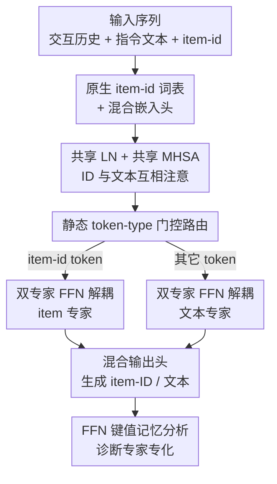

# Catalog-Native LLM: Speaking Item-ID dialect with Less Entanglement for Recommendation

**会议**: ICLR2026  
**OpenReview**: [https://openreview.net/forum?id=ia9vDh0Ltn](https://openreview.net/forum?id=ia9vDh0Ltn)  
**代码**: 待确认  
**领域**: 推荐系统 / LLM  
**关键词**: 推荐系统, 大语言模型, Mixture-of-Experts, item-ID, 知识干扰

## 一句话总结
针对"把 item-ID 塞进 LLM 会让协同信号和语言语义互相打架"这个问题，本文提出 IDIOMoE：把预训练 LLM 每个 block 的 FFN 拆成一个**文本专家**和一个**item 专家**，用静态的 token-type 门控按 token 类型分流（item-id token 走 item 专家，其余走文本专家），从而把"协同过滤"和"语义理解"解耦到不同子网络里，在公开和工业级数据集上都取得最强推荐效果，同时几乎不损伤原 LLM 的语言能力。

## 研究背景与动机
**领域现状**：推荐系统正从"对固定列表排序"演化为"能跟用户对话、能解释、能按自然语言指令探索"的智能体。一条主流路线是把 LLM 引进推荐——P5 把推荐改写成 text-to-text 生成，prompt 类方法把 LLM 当 zero-shot ranker；另一条路线（CoVE、CLLM4Rec、URM 等）则给 LLM 词表扩充 item-ID token，让模型直接在 ID 层面生成和检索。协同过滤（CF）这类传统模型 token 效率高、规模上准，但 ID 序列语义不透明、不支持自然语言查询；LLM 语义丰富、会推理，但只喂文本时又抓不住隐式的用户偏好。

**现有痛点**：当 item-ID token 和文本 token **共享同一套参数**时会发生**知识干扰（knowledge interference）**——协同信号和语言语义纠缠在一起，两边都掉点。作者用一组前置实验把这件事坐实：从 Qwen2.5-0.5B 出发对比三种喂法（纯 ID、ID+文本派生 bias、ID+显式属性文本），发现"文本派生 bias"虽然推荐准，却以**严重的语言退化**为代价——在 wikitext NLL 和 BBH/HellaSwag/MMLU/WinoGrande 上明显变差；而显式文本虽保住了语言能力，却让序列更长更难学。

**核心矛盾**：用户既要"对话 + 可解释"（必须保留显式文本），又要"推荐准"（必须强协同建模），但二者塞进同一个 LLM 的同一套 FFN 时存在 trade-off，而且作者强调这种干扰**不会靠简单堆参数消失**——纯加宽 FFN、加层都救不回来。

**切入角度与核心 idea**：作者借鉴 Mixture-of-Experts，但把视角换成语言学比喻——**把 item 交互历史看成语言空间里的一种"原生方言"**。既然是另一种方言，就不该和自然语言抢同一套"语言区"，而应分配一个**专职的协同专家**，同时**原样保留文本专家**，再用一个轻量的门控编排二者。一句话概括：用 token 类型把 FFN 拆成"语言区/item 区"两个专家，让协同建模和语义理解各管各的，从结构上消除干扰。

## 方法详解

### 整体框架
IDIOMoE（Item-ID + Natural-language Mixture-of-Experts）的输入是一段混排的序列——既有自然语言指令/item 属性文本（"The user has interacted with ... title is ... genre is ..."），也有特殊 item-id token `<|it-121|>`；输出是下一个 item-ID（推荐）或自然语言（对话/解释）。整体改造很克制：以一个预训练的 decoder-only LLM（Qwen2.5-0.5B/1.5B）为底座，只动 FFN 子层，把每个 block 的单个 FFN 换成"两专家"模块，其余的 LayerNorm 和多头自注意力（MHSA）**全部共享**。

具体一条 token 的旅程：先用**扩展过的分词器**把序列切成文本 token 和 item-id token，文本 token 用 LLM 原生 embedding，item-id token 用新增的可训练 item embedding 表（混合嵌入）；进入每个 block 后，所有 token 共享同一套 LN 和 MHSA——也就是说 ID 和文本在注意力里始终能互相看到；到 FFN 子层时，**静态 token-type 门控**按 token 类型把它分流：item-id token 进 **item 专家**，其它一切（标题、属性、指令）进**文本专家**；最后用一个混合输出头，使模型既能生成文本也能直接生成 item-ID。因为每个 token 只激活一个专家，整体计算量和原 LLM 相当。

### 关键设计

**1. 原生 item-id 词表 + 混合嵌入头：让 item 在 LLM 里有"户口"**

要让 LLM 真正"说 item-id 方言"，第一步是给 item 在词表里上户口。作者给分词器扩充一批特殊 token `<|it-id|>`，并挂一个**混合嵌入层**：文本 token 仍用底座 LLM 冻结的原生 embedding 矩阵，item-id token 用一张**可训练的 item embedding 表**，两者并存。输出端的语言模型头也复用同样的混合参数化，于是模型可以像吐文字一样**直接生成 item-ID**，把检索/排序统一成生成。前置实验（Table 1）显示，相比"纯 ID"基线，把文本属性以显式 token 喂进来本身就有意义——它解锁了对话和生成可读解释的能力，这是只加文本派生 bias 做不到的，所以作者坚持走"显式文本 token"这条路，再用后面的专家拆分解决随之而来的干扰。

**2. 双专家 FFN 解耦：把"语言区"和"item 区"拆开存**

这是全文核心。作者观察到知识干扰发生在**信息存储的地方**——而 Transformer 里 FFN 正是按"键值记忆"存储事实/概念的子层（沿用 Geva 等人的视角）。于是把每个 block 的 FFN 替换成两专家模块：**文本专家**就是预训练 LLM 原本的 FFN，**原样保留**，守住语言能力；**item 专家**是一个新的、结构类似的 FFN，可按 shrink 因子（如 $\times\tfrac{1}{2}$、$\times\tfrac{1}{4}$）缩小中间维度来高效加容量。关键在于 LN 和 MHSA 完全共享——ID 和文本在注意力层永远互相可见、能联合推理，拆分**只发生在 FFN**，也就是"该把 ID 专属信息和文本专属信息分开存"的那一层。这样既保留了显式文本带来的对话/解释能力，又给目录结构单独分配了容量；消融（Table 4）证明它不是靠堆参数：在工业数据上相对 Item-LLM 提升 +24.1% NDCG@10 / +28.9% HR@10，而同等参数量的 wide-FFN 只 +3.8%/+1.3%，append/prepend 额外层甚至大幅掉点（最差 -97%），说明**有结构的解耦**才是收益来源。

**3. 静态 token-type 门控：固定分工胜过学出来的路由**

标准 MoE 用一个可学的 router 动态决定每个 token 走哪个专家，但作者反其道用了一个**静态规则**：只有 item-id token `<|it-.|>` 路由到 item 专家，其余所有 token 一律走文本专家——没有可学门控，没有 top-k 选择。直觉是给每个专家一个**清晰、稳定的身份**（一个管语言、一个管 item），让它们各自专化、互不串味。消融（Table 7）把这点验得很硬：换成 switch-style 动态门控后推荐质量**严重崩塌**（工业集 -24.2% NDCG@10），因为动态路由会把 item 和文本的分配混在一起，反而加重纠缠、削弱专化。这说明在"两种模态身份天然可由 token 类型判定"的场景下，固定分工不只是更简单，而是更有效。

**4. FFN 键值记忆分析：用神经元层面的证据证明"专家真的专化了"**

为了说明收益来自"专化"而非玄学，作者把 item 专家的 FFN 当键值记忆来体检。把第二层投影 $W_{out}^{(\ell)}\in\mathbb{R}^{I\times d}$ 的每一行 $w_j^{(\ell)}$ 看作一个神经元的 value 向量，分别与 item embedding 集合 $E_{items}$ 和文本 token embedding 集合 $E_{text}$ 算余弦相似度，定义三个指标：**亲和度** $a(w)=\mathrm{median}(s^{\text{top-}k}_{items}(w))-\mathrm{median}(s^{\text{top-}k}_{text}(w))$ 衡量神经元偏向 item 还是文本；**纯度** $p(w)=\max_{c\in C}\tfrac{1}{k}|\{i\in\text{top-}k(w):\mathrm{cat}(i)=c\}|\in[0,1]$ 衡量 top-$k$ 近邻是否集中在同一 item 品类；**聚簇行** $\mathbb{1}_{cluster}(w)=\mathbb{I}[p(w)\ge\tau]$ 统计形成品类簇的神经元比例（实验取 $k=20,\tau=0.5$）。结果（Figure 5）显示：非 MoE 基线深层会漂向负亲和（偏文本），而 MoE 在上层仍保持 item 敏感；MoE 的纯度逐层更高、聚簇行比例在工业集深层急剧上升。这给"专家解耦带来更可解释、更模块化的表示"提供了直接证据。

### 损失函数 / 训练策略
底座统一用 Qwen2.5-0.5B（工业集主结果用 1.5B），延续 leave-last-item-out 划分训练/测试。所有对比变体（ID Transformer、文本派生 bias、Item-LLM）都与 IDIOMoE **匹配参数量、同等 token 预算与 FLOPS**，以排除"参数更多"这一干扰因素。item 专家可通过 shrink 因子调容量；MoE 的插入位置、专家容量、路由方式均做了消融（见下）。

## 实验关键数据

### 主实验
小规模 Amazon 六域上 IDIOMoE 在几乎所有域的 NDCG@10 / HR@10 都拿到最高或并列最高（高亮为 LLM-Based 方法）：

| 数据集（指标 NDCG@10 / HR@10） | 最强非本文基线 | IDIOMoE |
|--------|------|------|
| Games | HSTU 0.0609 / 0.1089 | **0.0605 / 0.1102** |
| Instruments | MQL4GRec 0.1060 / 0.1375 | **0.1054 / 0.1385** |
| Arts | MQL4GRec 0.0950 / 0.1327 | **0.1029 / 0.1409** |
| Sports | SASRec 0.0289 / 0.0531 | **0.0391 / 0.0674** |
| Beauty | CoVE 0.0593 / 0.1009 | **0.0665 / 0.1104** |

大规模 Amazon（Beauty/Books/Toys）上 IDIOMoE 是最强的 LLM-Based 方法（Beauty 仅以微弱差距次于 HSTU，Books/Toys 总体第一）。工业级数据集（数亿用户）上以 SASRec 为基线，IDIOMoE 取得 **+27.1% NDCG@10、+16.6% HR@10、+31.2% MRR** 的最大提升。

### 消融实验
匹配参数量的非 MoE 对照（相对 Item-LLM，工业集 ∆%）：

| 配置 | NDCG@10 ∆ / HR@10 ∆（工业集） | 说明 |
|------|---------|------|
| Wide-FFN | +3.8% / +1.3% | 单纯加宽 FFN 几乎没用 |
| Append-blocks | -5.5% / -5.3% | 后加层反而掉点 |
| Prepend-blocks | -15.3% / -16.2% | 前加层掉得更多 |
| LoRA-LLM | -79.1% / -76.3% | 对规模/稀疏极其敏感，工业集崩 |
| **IDIOMoE** | **+24.1% / +28.9%** | 结构化解耦才是收益来源 |

其余消融：**item 专家容量**——Amazon-Beauty 上 shrink=4 最优（+41.8% NDCG@10），但工业集越缩越差，说明大规模真实数据需要更大 item 专家、需要自适应容量分配；**MoE 插入位置**——放最后 8 层效果最好（Beauty +28.4% NDCG@10），因为深层最承载任务语义与协同模式；**静态 vs 动态路由**——动态 switch 路由严重退化（工业集 -24.2% NDCG@10），印证固定分工更利于专化。

### 关键发现
- 干扰**不会靠堆参数消失**：wide-FFN / 加层 / LoRA 这些"加容量"的做法在工业级上要么微弱要么崩溃，唯有按 token 类型解耦才稳定大涨。
- 专化是真实存在的：FFN 键值记忆分析显示 MoE 的 item 专家在深层保持 item 亲和、品类纯度与聚簇比例都更高。
- 规模越大、干扰越明显，解耦的收益也越大——这也是作者把工业集而非 Amazon 当主要证据的原因。

## 亮点与洞察
- **"item-ID 是一种方言"这个隐喻很有解释力**：它把"为什么不能共享 FFN"讲得直观——方言和母语该分区存储，顺势把 MoE 从"动态稀疏路由"重构成"按模态身份的静态分工"。
- **静态门控反直觉但有效**：在两种模态可由 token 类型确定性区分时，放弃可学 router 反而消除了路由噪声带来的纠缠，是个可复用的设计原则（凡"模态身份先验已知"的多模态融合都可借鉴）。
- **只动 FFN、共享注意力**是精妙的取舍：既保住跨模态交互（ID 和文本仍在注意力里互看），又把"存储分歧"限制在最该分的子层，改造成本低且即插即用于任意预训练 decoder。
- **用键值记忆视角做可解释性诊断**值得迁移：把"专化"从口号变成可量化的亲和/纯度/聚簇指标，任何"声称专家分工"的 MoE 工作都能拿来自证。

## 局限与展望
- 作者承认 Amazon 公开基准偏小、可能有重叠，因此把工业集当主要证据——但工业集不可复现，外部读者难以独立验证最关键的结论。
- MoA/MoT 等其它 MoE 变体在 Amazon-Beauty 上能与 IDIOMoE 打平甚至略超，作者也坦言"哪种 MoE 更好可能依赖数据集"，FFN-MoE 的优势主要建立在工业集上。
- item 专家容量的最优 shrink 在小数据和大数据上**结论相反**，意味着需要按域调参、缺乏一个自适应容量的统一方案（作者把这点列为未来方向）。
- 静态路由依赖"token 类型能干净区分模态"这一前提；当模态边界模糊（如一个 token 同时承载语义和 ID 语义）时，静态分工是否仍最优尚未验证。

## 相关工作与启发
- **vs 文本派生 bias（如 URM/Jiang et al.）**：他们把文本编码成向量加到 ID embedding 上，序列不变长、推荐准，但会显著损伤语言能力且不支持对话；本文坚持显式文本 token 并用专家拆分，既保住语言能力又拿到更好推荐。
- **vs 词表扩 item-ID 的生成式推荐（CoVE/CLLM4Rec/Item-LLM）**：他们让 ID token 和文本 token 共享参数，干扰随之而来；本文的区别在于不共享 FFN——首次明确把"协同过滤"从"语义处理"中分离出来。
- **vs 多模态 MoE-LLM（MoE-LLaVA / Uni-MoE / MoME）**：那些工作用 MoE 处理视觉-语言任务干扰，多用动态门控；本文针对"推荐"这个模态，论证在身份可判定时静态 token-type 路由比动态路由更利于专化。
- **vs 大规模生成式推荐（HSTU / OneRec）**：它们从头训超大解码器、资源消耗大且不支持对话；IDIOMoE 在小底座（0.5B/1.5B）上靠结构化解耦取得可比或更强的效果，并保留对话/解释能力。

## 评分
- 新颖性: ⭐⭐⭐⭐ "item-id 方言 + 按 token 类型静态拆 FFN"是首个明确解耦协同与语义的简洁设计
- 实验充分度: ⭐⭐⭐⭐ 公开+工业双线、容量/位置/路由全套消融，但核心结论重度依赖不可复现的工业集
- 写作质量: ⭐⭐⭐⭐ 动机推导清晰、前置实验把"干扰问题"坐实，键值记忆分析给专化提供证据
- 价值: ⭐⭐⭐⭐ 工业级可落地、计算量与底座相当，对"LLM+推荐"如何避免互相打架给出可复用范式

<!-- RELATED:START -->

## 相关论文

- [\[AAAI 2026\] Tokenize Once, Recommend Anywhere: Unified Item Tokenization for Multi-domain LLM-based Recommendation](../../AAAI2026/recommender/tokenize_once_recommend_anywhere_unified_item_tokenization_for_multi-domain_llm-.md)
- [\[ICLR 2026\] Token-Efficient Item Representation via Images for LLM Recommender Systems](token-efficient_item_representation_via_images_for_llm_recommender_systems.md)
- [\[ACL 2026\] Intent-Driven Semantic ID Generation for Grounded Conversational News Recommendation](../../ACL2026/recommender/intent-driven_semantic_id_generation_for_grounded_conversational_news_recommenda.md)
- [\[ICLR 2026\] Reinforced Latent Reasoning for LLM-based Recommendation](reinforced_latent_reasoning_for_llm-based_recommendation.md)
- [\[ACL 2026\] From Past To Path: Masked History Learning for Next-Item Prediction in Generative Recommendation](../../ACL2026/recommender/from_past_to_path_masked_history_learning_for_next-item_prediction_in_generative.md)

<!-- RELATED:END -->
