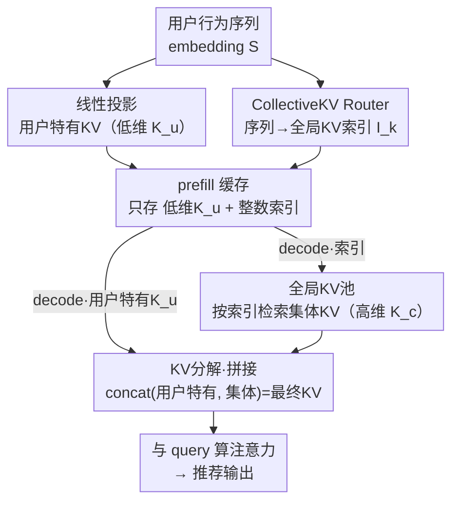

# CollectiveKV: Decoupling and Sharing Collaborative Information in Sequential Recommendation

**会议**: ICLR 2026  
**arXiv**: [2601.19178](https://arxiv.org/abs/2601.19178)  
**代码**: 待确认  
**领域**: 推荐系统 / 模型压缩  
**关键词**: KV缓存压缩, 跨用户共享, 协同信号, 序列推荐, SVD分析

## 一句话总结
观察到序列推荐中不同用户的 KV cache 具有显著跨用户相似性（协同信号），提出 CollectiveKV 将 KV 分解为低维用户特有部分和从全局 KV 池检索的高维共享部分，实现 0.8% 的压缩率且性能不降。

## 研究背景与动机

**领域现状**：序列推荐模型（SIM、HSTU 等）采用 Transformer 注意力机制提升性能，为降低推理延迟引入了 KV cache 技术预计算并缓存 K/V。

**现有痛点**：推荐系统用户基数庞大（亿级），每个用户可能有很长的行为历史，KV cache 总量很快超过 GPU 显存容量，必须卸载到 CPU/外存，引入巨大传输延迟。

**核心矛盾**：LLM 的 KV 压缩方法（如 token 裁剪、MLA 降维）只压缩单用户序列，忽视了推荐场景独有的跨用户协同信号。

**本文目标**：利用跨用户 KV 相似性实现极致压缩——把大部分信息放入全局共享池，每用户只存极低维度的个性化 KV。

**切入角度**：通过 SVD 分解 K/V，发现主成分（>90% 信息）跨用户相关性强，残差（<10% 信息）是用户特有的——这给出了"什么可以共享"的定量依据。

**核心 idea**：用可学习的全局 KV 池存储跨用户共享信息，每用户仅缓存低维个性化 KV + 全局索引，实现 0.8% 极端压缩率。

## 方法详解

### 整体框架
CollectiveKV 要解决的是"每个用户都存一份完整 KV、显存装不下"的问题，做法是把 KV 拆成"少量个性化"加"大量共享"两块，让昂贵的高维信息由全体用户共用一个池子。整条流程沿用 Transformer 推荐模型的 prefill / decode 两阶段：prefill 阶段把用户行为序列线性投影成一份很瘦的用户特有 KV（维度 $d_u$），同时让一个 router 网络给序列里每个 item 算出它在全局 KV 池中的索引，**只把这个索引（而不是高维向量）缓存下来**；decode 阶段则按缓存的索引去 GPU 常驻的全局 KV 池里取出对应的高维共享 KV（维度 $d_g$），与个性化部分拼接后再算注意力。这样每用户真正要存的只有低维 $\mathbf{K}_u$ 加几个整数索引，高维信息全压进了所有人共享的池子里。

### 关键设计

**1. KV 分解：把高维主成分交给共享池、低维残差留给个人**

这一步直接回应了核心痛点——亿级用户各存一份高维 KV 根本放不进显存。论文先对 K/V 做 SVD，发现 >90% 信息集中的主成分在不同用户之间高度相关，而 <10% 的残差才是用户特有的，于是按这个观察把 KV 拆成两段：低维的用户特有部分 $\mathbf{K}_u \in \mathbb{R}^{n \times d_u}$ 由序列线性投影得到 $\mathbf{K}_u = \mathbf{S} W_k + b_k$，高维的集体共享部分 $\mathbf{K}_c \in \mathbb{R}^{n \times d_g}$ 则按索引从全局池检索 $\mathbf{K}_c[i] = P_k[\mathbf{I}_k[i]]$，最终注意力用的是两者拼接 $\mathbf{K} = \text{concat}(\mathbf{K}_u, \mathbf{K}_c)$。关键在于"承载大部分信息"的高维段不再逐用户存储，每个用户只保留瘦小的个性化投影，压缩主要来自这里。

**2. CollectiveKV Router：用可微门控把"按索引检索"这件离散的事训进来**

分解方案要落地，必须有人决定每个 item 该取池中哪一项，这就是 router 的活。它把序列 embedding 映射成打分矩阵 $\mathbf{M} = \mathbf{S} W_r + b_r$，再取 $\mathbf{I}_k[i] = \arg\max_j \mathbf{M}_{ij}$ 作为该 item 的池索引。但 $\arg\max$ 不可微，梯度传不回 router，于是训练时改用 sigmoid 门控让被选中项带上一个可导的权重：$\mathbf{K}_c[i] = \sigma(\mathbf{M}[i, \mathbf{I}_k[i]]) \cdot P_k[\mathbf{I}_k[i]]$。配合后面的 peak loss 把这个 sigmoid 输出推向 1，就保证了训练时的"软选择"和推理时直接查表的"硬选择"行为一致，不会出现训练推理脱节。

**3. 全局 KV 池：常驻显存、全员共享的高维信息库**

池本身是两个可学习矩阵 $P_k, P_v \in \mathbb{R}^{m \times d_g}$，常驻 GPU 显存供所有用户共享。它之所以能省下大量存储，是因为池容量 $m$ 远小于"用户数 × 序列长度"——原本要逐用户逐 token 存的高维向量，现在塌缩成池里 $m$ 个可复用条目，每个用户只需引用其中几项；同时把 $d_g$ 设得足够高，又保证了这些共享条目有足够的信息容量去承接 SVD 主成分。这正是 0.8% 极端压缩率的来源。

### 损失函数 / 训练策略
整个 pool / router / 投影层端到端联合优化，在原始推荐损失之外加两项约束。其一是 peak loss $\mathcal{L}_{\text{peak}} = -\frac{1}{n}\sum_i \log\sigma(\mathbf{M}[i, \mathbf{I}_k[i]])$，逼 sigmoid 门控对被选中项的输出接近 1，从而对齐训练与推理；其二是 load balance loss（KL 散度），让池中每个 key 被尽量均匀地选用，避免少数条目被反复命中、其余闲置而浪费池容量。

## 实验关键数据

### 主实验（5 模型 × 3 数据集）

| 模型 | 数据集 | GAUC（原始→+ours） | AUC（原始→+ours） | 压缩率 CR |
|------|--------|------------------|------------------|---------|
| SIM | MicroVideo | 0.6954→**0.6973** | 0.6933→**0.7057** | **1.6%** |
| SDIM | MicroVideo | 0.6857→**0.6883** | 0.6749→**0.6871** | **1.2%** |
| SIM | KuaiVideo | 0.6577→**0.6604** | 0.6798→**0.6900** | **1.2%** |
| HSTU | MicroVideo | - | - | **0.8%** |

### 消融实验

| 配置 | AUC | 说明 |
|------|-----|------|
| 完整 CollectiveKV | 0.7057 | 最佳 |
| 仅用户特有 KV | ~0.69 | 缺少共享信息 |
| 仅集体 KV | ~0.69 | 缺少个性化 |
| 无 peak loss | ~0.70 | 训练推理不一致 |
| 无 balance loss | ~0.70 | 池利用率低 |

### 关键发现
- **0.8% 压缩率不降反升**：5 个模型 × 3 个数据集上成绩持平或提升，说明共享 KV 起到了正则化/信息增强效果
- SVD 分析提供了可解释的压缩依据——主成分跨用户强相关、残差用户特有
- 推理延迟大幅降低——外存传输量缩小 50-100x，GPU 内索引操作延迟可忽略

## 亮点与洞察
- **跨用户 KV 共享是推荐系统独有的压缩维度**：LLM 的 KV 压缩无此维度（每次推理只服务一个序列），但推荐系统天然具有协同信号——这是一个被忽视但潜力巨大的方向
- **SVD 分解提供了"什么能共享"的理论分析工具**：主成分 vs 残差的跨用户相似度对比非常直观有说服力
- **router 设计的 sigmoid 门控+peak loss** 优雅解决了离散索引不可微的问题

## 局限与展望
- 全局 KV 池常驻 GPU 显存，池大小 $m$ 不能太大——大规模场景的 $m$ 如何选择？
- 仅验证了 CTR 预测任务，未在排序/生成式推荐上验证
- router 采用简单线性层，更复杂的路由策略是否能进一步提升？

## 相关工作与启发
- **vs MLA (DeepSeek)**：MLA 降维压缩单用户 KV；CollectiveKV 利用跨用户共享实现更极端压缩
- **vs Token pruning (Loki/Quest)**：裁剪 token 丢弃信息；CollectiveKV 不丢弃，而是将信息转移到共享池
- **vs HSTU**：HSTU 引入 KV cache 到推荐但未压缩；CollectiveKV 在此基础上实现 0.8% 压缩

## 评分
- 新颖性: ⭐⭐⭐⭐⭐ 跨用户 KV 共享是全新视角，SVD 分析提供理论支撑
- 实验充分度: ⭐⭐⭐⭐ 5 模型 × 3 数据集覆盖广，但缺少更多消融细节
- 写作质量: ⭐⭐⭐⭐ SVD 分析可视化清晰，整体逻辑通顺
- 价值: ⭐⭐⭐⭐⭐ 0.8% 压缩率有巨大工业部署价值

<!-- RELATED:START -->

## 相关论文

- [\[ACL 2025\] Laser: Bi-Tuning with Collaborative Information for Controllable LLM-Based Sequential Recommendation](../../ACL2025/recommender/bi-tuning_with_collaborative_information_for_controllable_llm-based_sequential_r.md)
- [\[AAAI 2026\] FreqRec: Exploiting Inter-Session Information with Frequency-enhanced Dual-Path Networks for Sequential Recommendation](../../AAAI2026/recommender/exploiting_inter-session_information_with_frequency-enhanced_dual-path_networks_.md)
- [\[ICLR 2026\] On the Mechanisms of Collaborative Learning in VAE Recommenders](on_the_mechanisms_of_collaborative_learning_in_vae_recommenders.md)
- [\[AAAI 2026\] HyMoERec: Hybrid Mixture-of-Experts for Sequential Recommendation](../../AAAI2026/recommender/hymoerec_hybrid_mixture-of-experts_for_sequential_recommendation.md)
- [\[ICLR 2026\] Steering Diffusion Models Towards Credible Content Recommendation](steering_diffusion_models_towards_credible_content_recommendation.md)

<!-- RELATED:END -->
