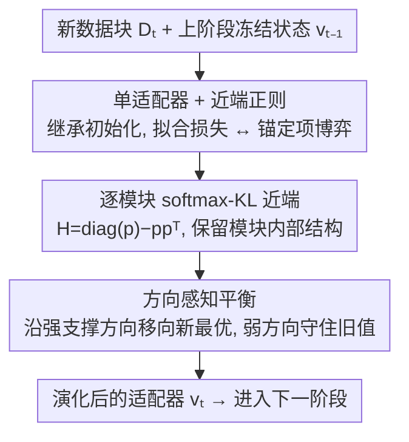

# Continual Low-Rank Adapters for LLM-based Generative Recommender Systems

**会议**: ICLR2026  
**OpenReview**: [https://openreview.net/forum?id=DBCNTM7mot](https://openreview.net/forum?id=DBCNTM7mot)  
**代码**: https://github.com/hsyoo32/peso  
**领域**: 推荐系统 / 持续学习 / LoRA / LLM 生成式推荐  
**关键词**: 持续学习, LoRA, 近端正则, 生成式推荐, 稳定性-可塑性

## 一句话总结
PESO 把基于 LLM 的生成式推荐的持续学习从"堆叠多个冻结适配器"改成"单个不断演化的 LoRA + 一个近端正则项"，让适配器每次更新都被轻轻锚向上一阶段的状态，从而在保留长期偏好与吸收新偏好之间自动找平衡，在三个真实数据集上稳定超过累积式 LoRA 和单纯演化的 LoRA。

## 研究背景与动机
**领域现状**：把推荐当作序列生成、用 LLM 自回归地"续写"用户下一个交互物品，已经成为一条主流路线——给定用户历史，模型逐个吐出下一个物品的 token（物品用 RQ-VAE 之类的码本 tokenizer 编成语义 ID）。落地时通常用 LoRA 微调：冻结预训练权重，只训练注入的低秩矩阵 $A,B$，轻量又模块化。

**现有痛点**：真实世界的交互数据是持续流入、不断漂移的——新用户新物品冒出来、老用户口味变了。每次都从头在全量数据上重训既贵又慢，所以"持续学习"成了自然选择。但现有的 LoRA 持续学习方法几乎都是从视觉等领域搬来的，它们的目标是**保住过去任务上的表现**（stability），同时适应新任务（plasticity）。

**核心矛盾**：推荐的持续学习和视觉根本不是一回事。视觉里的持续任务通常是互不相交、无时间序的（猫狗 → 卡车轿车），保住旧任务表现就是目标；而推荐的终极目标是**预测用户近期/未来会喜欢什么**，根本不在乎"复现过去偏好"——更糟的是，**过时偏好甚至会拖累当前预测**（用户从动作片转向爱情片后，旧的动作偏好就是噪声）。所以推荐里"稳定性"应指保住那些**仍然有预测力的长期偏好**（某些题材/品牌的持久兴趣），而"可塑性"则要能**覆盖掉过时偏好、捕捉新趋势**。

为缓解遗忘，视觉里流行**累积式 LoRA**（cumulative LoRA）：把新的可训练适配器和所有冻结的历史适配器求和。当任务相互独立、干扰极小时它工作得很好。但本文的分析表明，在推荐里累积式 LoRA 常常**还不如**简单的单适配器演化——因为推荐里同一批用户会反复出现、偏好连续演化，模型必须捕捉跨阶段的"有用干扰"，而冻结的历史适配器把过时偏好和相关偏好**纠缠**在一起难以解耦；而且适配器越攒越多，存储成本上升、聚合时还难以体现各自的相对重要性。

**本文目标 + 切入角度**：作者提出两条设计原则——(1) 不要用多个适配器（多适配器隐含"任务独立"假设，与推荐不符）；(2) 保存过去知识的方式要服务于"理解当前用户行为"。沿着这两条，他们的核心 idea 是：**只保留一个不断演化的 LoRA，但用一个轻量的近端（proximal）正则项把它锚在上一阶段的状态附近**，让数据拟合损失和近端项自然博弈，由模型自己决定哪些方向该改、哪些该留——这就是 PESO（Proximally rEgularized Single evolving lOra）。

## 方法详解

### 整体框架
PESO 要解决的是一个时序持续适配问题：预训练模型先在基础数据块 $D_1$ 上用 LoRA 微调好，之后按时间顺序到来的数据块 $D_2,\dots,D_T$ 上**逐阶段**微调，每一阶段都要在适应新数据 $D_t$ 和保留旧知识之间取得平衡。整体只维护**一个** LoRA 适配器 $v_t$（把所有 $A/B$ 参数拉平拼接），每个新阶段都从上一阶段 $v_{t-1}$ 继承初始化，然后在"拟合 $D_t$ 的交叉熵损失"和"把 $v_t$ 拉回 $v_{t-1}$ 的近端项"两股力量的竞争下更新。近端项一开始为零（因为初始化即 $v_t\leftarrow v_{t-1}$），只随 $v_t$ 偏离 $v_{t-1}$ 才增长。理论上作者证明这种近端设计会在 LoRA 子空间里给出**方向感知、数据感知**的引导；落地时再用一个**逐模块的 softmax–KL 近端**替换最朴素的 L2 度量，让正则尊重模块内部结构。

### 关键设计

**1. 单适配器 + 近端正则框架：用一个锚定项替代一堆冻结适配器**

针对累积式 LoRA"攒适配器、纠缠新旧偏好、存储膨胀"的痛点，PESO 只保留一个演化的 LoRA，并把每次更新锚向上一阶段。把 LoRA 参数按模块（注意力的 q/k/v/o、MLP 投影等）分成 $G$ 组，组 $g$ 的参数记为 $v_t^{(g)}$，阶段 $t$ 的总损失为

$$L_t = L^{D_t}_{ce} + \frac{\lambda}{2}\sum_{g=1}^{G}\big\|v_t^{(g)}-v_{t-1}^{(g)}\big\|^2_{H^{(g)}_{t-1}},\qquad v_t \leftarrow v_{t-1}\ \text{(初始化)}$$

其中 $L^{D_t}_{ce}$ 是下一物品预测的自回归交叉熵，$\|z\|_H^2:=z^\top H z$，$\lambda>0$ 控制正则强度，$H^{(g)}_{t-1}\succeq 0$ 是一个在该阶段固定的半正定度量（取 $H=I$ 就退化成 L2 情形）。它的妙处在于不需要显式判断"哪些旧知识要留"——数据拟合损失把参数往"$D_t$ 的最优 $v_t^*$"拉、近端项把参数往"上一状态 $v_{t-1}$"拉，二者的**自然竞争**让模型自己决定改什么、留什么；而且因为初始化就在 $v_{t-1}$，惩罚从零起步、平滑增长，避免了累积式那种把过时与相关偏好硬冻在一起的僵硬复用。

**2. 逐模块 softmax–KL 近端：让正则尊重模块内部结构**

朴素的 L2 近端（$H=I$）对所有坐标一视同仁，既不区分模块、也不利用上一状态 $v_{t-1}$ 的信息。PESO 把近端项实例化成一个**逐模块的 softmax–KL** 散度：

$$L_t = L^{D_t}_{ce} + \lambda\sum_{g=1}^{G} D_{KL}\!\big(\mathrm{softmax}(v_t^{(g)})\,\|\,\mathrm{softmax}(v_{t-1}^{(g)})\big)$$

作者证明它在局部等价于上面框架里的二次型：令 $p^{(g)}=\mathrm{softmax}(v_{t-1}^{(g)})$，对小扰动 $\Delta^{(g)}=v_t^{(g)}-v_{t-1}^{(g)}$ 有 $H^{(g)}_{t-1}=\mathrm{diag}(p^{(g)})-p^{(g)}p^{(g)\top}\succeq 0$，于是设计 1 的理论可以直接套用。更直观地（Corollary 4），这个 KL 近端**等价于一个 $p$-加权的方差**：$\frac{\lambda}{2}\sum_g \mathrm{Var}_{p^{(g)}}(\Delta^{(g)})$。这意味着它惩罚的是模块内 LoRA 因子的**相对（去中心）变化（reshuffle）**，并且对先验质量 $p$ 更大的坐标惩罚更重。效果上，它给出"逐模块、且感知上一状态"的稳定性，却不会扼杀可塑性——数据支撑强的地方照样往新最优走。

**3. 方向感知的稳定性-可塑性平衡：让理论解释 PESO 为何不偏科**

为说明这套近端到底在做什么，作者在固定的 LoRA 子空间里对数据拟合项做二次近似，得到 $L^{D_t}(v)\approx\frac12(v-v_t^*)^\top\Sigma_t(v-v_t^*)$，其中 $\Sigma_t=\mathbb{E}_{x\sim D_t}[\Phi(x)\Phi(x)^\top]$ 是切特征的二阶矩矩阵，刻画**当前阶段数据对子空间各方向的支撑强度**。Proposition 1 给出广义特征插值：解 $\hat v_t$ 在 $(\Sigma_t,H_{t-1})$ 的广义特征方向 $q_k$ 上，是新最优 $v_t^*$ 与旧状态 $v_{t-1}$ 的加权平均。特化到 L2（Corollary 2）最直观：沿主方向 $q_k$，偏向 $v_t^*$ 的权重恰为 $\dfrac{\sigma_k^2}{\sigma_k^2+\lambda}$。也就是说——当某方向上当前数据支撑强（$\sigma_k^2$ 大，比如用户突然狂刷推理题材），更新就大幅移向新最优；当支撑弱（$\sigma_k^2$ 小，比如某个本周没怎么体现的稳定品牌偏好），就守住上一阶段的值；$\sigma_k^2=0$ 时该方向**原封不动**地继承下来。这正是推荐想要的"数据感知、按方向分配可塑性"的平衡，也是 PESO 既不像单适配器那样遗忘、也不像累积式那样僵硬的根因。

### 损失函数 / 训练策略
最终目标即式 (12)：下一物品预测交叉熵 + 逐模块 softmax–KL 近端，$\lambda$ 在 $[0.5,1.0,2.0,5.0,8.0]$ 中搜索（Instruments 取 2.0，Movies&TV 与 Books 取 5.0）。骨干为 Llama-3.2 1B，物品用语义 ID（RQ-VAE 码本）表示，训练用滑动窗口（窗长 20）构造多组 $(x_u,y_u)$ 下一物品对；推理时用受限 beam search（只在合法物品 token 上生成）产出 10 个物品。一个实践要点：增量数据块远小于预训练集，对学习率很敏感——直接用预训练学习率会过拟合，把它缩到约 $0.05\sim0.1\times$ 效果最好。

## 实验关键数据

### 主实验
数据集为 Amazon Review 的三个品类（Musical Instruments、Movies & TV、Books），按时间切成 $D_1$（大块预训练）+ $D_2\dots D_5$（小增量块），每用户 leave-one-out，报告 Hit@5/10、NDCG@5/10（在 $D_2\dots D_4$ 上平均）。

| 数据集 | 指标 | PESO | 单适配器演化 | SumLoRA(latest+inherit) | 提升 vs 单适配器 |
|--------|------|------|------|------|------|
| Instruments | NDCG@5 | 0.0138 | 0.0127 | 0.0130 | +8.66% |
| Instruments | Hit@5 | 0.0193 | 0.0181 | 0.0185 | +6.63% |
| Movies & TV | NDCG@5 | 0.0118 | 0.0116 | 0.0114 | +1.72% |
| Books | Hit@10 | 0.0569 | 0.0557 | 0.0542 | +2.15% |

PESO 在三套数据上对最强竞争者（单适配器演化 / SumLoRA-latest+inherit / SD-LoRA-latest+inherit）的平均增益分别为 **3.71% / 4.62% / 6.26%**。两点结论：① 所有持续学习方法都明显胜过只在 $D_1$ 训练的 PRETRAIN，说明哪怕增量数据只有约 10%，适应新数据也至关重要；② 累积式 LoRA 虽然更复杂、更占存储，却经常打平甚至输给单适配器——僵硬复用冻结适配器过度约束了对演化偏好的适应；而**不带继承的原始累积设计（all）最差**，有些变体甚至跌破 PRETRAIN，说明没有渐进演化的持续学习反而有害。InfLoRA 整体最弱（冻结 $A$ 阻断了跨时间的继承与渐进适应）。

### 消融实验

| 配置 | 关键指标 | 说明 |
|------|---------|------|
| PESO（softmax–KL） | 最佳 | 完整模型 |
| L2 近端 | 略逊 | 常与单适配器相当，均匀约束不够 |
| LoRA-Output KL / Per-Rank KL | 接近但略差 | 输出层 / 过细粒度约束不如模块级参数空间约束 |
| 正交（orthogonality） | 最差 | 视觉常用的"最小化干扰"策略在推荐里有害 |

按用户群体看稳定性-可塑性（Instruments，NDCG@5）：

| 方法 | Dormant 用户（测稳定性） | New 用户（测可塑性） |
|------|------|------|
| 单适配器演化（偏可塑性） | 0.0154 | 0.0116 |
| 累积式 LoRA（偏稳定性） | 0.0164 | 0.0101 |
| PESO（平衡） | **0.0170** | **0.0122** |

### 关键发现
- **正则形式很关键**：正交化在推荐里最差，直接证明"跨阶段最小化干扰"这套视觉思路用错了地方；L2 太均匀；模块级、感知上一状态的 softmax–KL 才最对路。
- **PESO 两头都赢**：在"沉睡后回归"的 Dormant 用户上比单适配器强（不遗忘长期偏好），在"只在最新块出现"的 New 用户上比累积式强（不被旧偏好拖累）——印证了方向感知平衡的设计意图。
- **$\lambda$ 是稳定-可塑的旋钮**：从 $\lambda=0$（即单适配器）起，性能随 $\lambda$ 增大先升后降/趋平；太小伤稳定性、太大伤可塑性，但在较宽范围内不算敏感。
- **对比传统推荐器**：在 LLM 路线下 PESO 也优于 Pretrain / Fine-tuning，且整体强过传统持续推荐器（如 PISA）。

## 亮点与洞察
- **把"过时偏好有害"写进问题定义**：大多数持续学习默认"保住过去 = 好"，本文指出推荐里这条不成立，并用 user-disjoint vs 自然时序两种切分量化证明累积式 LoRA 的"水土不服"——这个问题重述本身就很有价值。
- **一个近端项替代一整族冻结适配器**：用"数据拟合 vs 锚定上一状态"的自然博弈，把"留什么/改什么"交给优化器自己解，既省存储又避免新旧偏好纠缠，工程上极简。
- **理论给出可解释的旋钮**：$\sigma_k^2/(\sigma_k^2+\lambda)$ 把"按方向分配可塑性"讲得一清二楚，$\sigma^2=0$ 的方向原样继承——这种"数据支撑强就改、弱就守"的直觉很容易迁移到其他持续微调场景（不限推荐）。
- **softmax–KL = $p$-加权方差**这个等价刻画很漂亮：它解释了为什么模块级、按先验质量加权的约束比朴素 L2 更合理。

## 局限与展望
- **物品 tokenizer 固定**：作者特意冻结语义 ID 的 tokenizer 以隔离"模型侧持续适配"，但真实系统里新物品不断出现，tokenizer 本身也需要持续演化——这是被显式留作未来方向的开口。
- **理论建立在局部二次近似上**：方向感知平衡的结论依赖对数据拟合项的二阶展开与固定 LoRA 子空间假设，离真实 LLM 的高度非凸损失有距离，结论更多是"直觉性指导"而非严格保证。
- **评测局限于 Amazon Review 三品类 + Llama-3.2 1B**：跨域、更大骨干、更长时间序列（更多阶段 $T$）下近端项是否依旧稳健、$\lambda$ 是否需要随阶段自适应，仍待验证。
- **近端只锚一步**：只锚向最近一个状态 $v_{t-1}$，对"很久以前出现、中间长期沉睡"的偏好，能否靠单步链式继承充分保住，存在隐忧（Dormant 实验只测了缺席一段后回归的情形）。

## 相关工作与启发
- **vs 单适配器演化（single evolving LoRA）**：两者都只维护一个适配器、都做参数继承，区别在于 PESO 多了一个近端项把更新锚向上一状态。单适配器靠继承只在**初始化时**部分保留旧知识，微调过程中会把有用旧知识覆盖掉导致遗忘；PESO 在整个微调过程中持续施加方向感知的锚定，因此稳定性更好。
- **vs 累积式 LoRA（SumLoRA / SD-LoRA / InfLoRA）**：它们把新适配器与冻结的历史适配器求和来增强稳定性、扩展有效容量，适合任务间干扰极小的场景；但推荐里用户反复出现、偏好连续演化，冻结适配器会纠缠新旧偏好且存储随阶段增长。PESO 用单个演化适配器 + 近端正则，既避免纠缠和存储膨胀，又靠博弈实现更灵活的平衡。
- **vs 视觉持续学习的正交/干扰最小化思路**：实验直接显示正交正则在推荐里最差——"跨阶段最小化干扰"在偏好连续演化的推荐里恰恰丢掉了有用的跨阶段信息，这是本文对"领域差异"最有力的反例。

## 评分
- 新颖性: ⭐⭐⭐⭐⭐ 重述了推荐持续学习的稳定-可塑内涵，并用单适配器+近端正则给出简洁有理论支撑的解法
- 实验充分度: ⭐⭐⭐⭐ 三数据集 + 多 LoRA 变体 + 用户群体/$\lambda$ 分析较扎实，但骨干与品类范围偏窄
- 写作质量: ⭐⭐⭐⭐⭐ 问题动机—分析—框架—理论—实例化—实验链条清晰，理论直觉讲得透
- 价值: ⭐⭐⭐⭐ 方法极简、可解释、易落地，对 LLM 生成式推荐的持续更新有直接参考价值

<!-- RELATED:START -->

## 相关论文

- [\[ICLR 2026\] Rank-GRPO: Training LLM-based Conversational Recommender Systems with Reinforcement Learning](rank-grpo_training_llm-based_conversational_recommender_systems_with_reinforceme.md)
- [\[ICLR 2026\] Token-Efficient Item Representation via Images for LLM Recommender Systems](token-efficient_item_representation_via_images_for_llm_recommender_systems.md)
- [\[ACL 2026\] GraphLoRA: Structure-Aware Low-Rank Adaptation for Large Language Model Recommendation](../../ACL2026/recommender/graphlora_structure-aware_low-rank_adaptation_for_large_language_model_recommend.md)
- [\[AAAI 2026\] RecToM: A Benchmark for Evaluating Machine Theory of Mind in LLM-based Conversational Recommender Systems](../../AAAI2026/recommender/rectom_a_benchmark_for_evaluating_machine_theory_of_mind_in_llm-based_conversati.md)
- [\[AAAI 2026\] Align³GR: Unified Multi-Level Alignment for LLM-based Generative Recommendation](../../AAAI2026/recommender/align3gr_unified_multi-level_alignment_for_llm-based_generat.md)

<!-- RELATED:END -->
