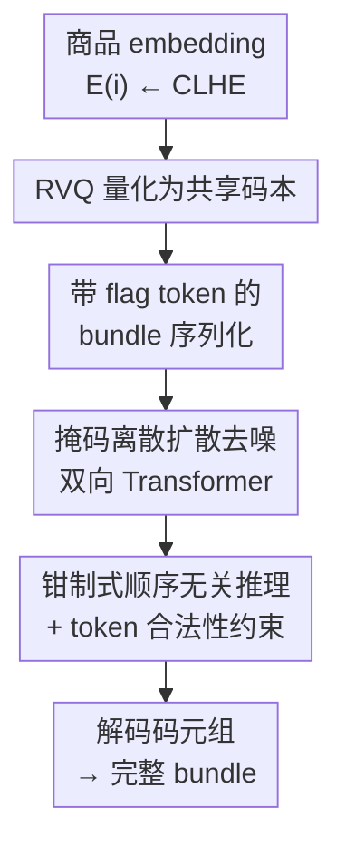

# Discrete Diffusion for Bundle Construction

**会议**: ICLR2026  
**OpenReview**: [https://openreview.net/forum?id=dKyhgfe50H](https://openreview.net/forum?id=dKyhgfe50H)  
**代码**: https://github.com/LiAi16/DDBC  
**领域**: 推荐系统 / 生成式推荐 / 离散扩散  
**关键词**: 捆绑构建、离散扩散、残差向量量化、掩码去噪、非序列生成

## 一句话总结
DDBC 把"捆绑构建"（从大商品库里挑一组商品凑成一个完整 bundle，或补全一个残缺 bundle）重新建模成**掩码离散扩散**过程：用残差向量量化（RVQ）把每件商品压成几位共享码本里的离散码以化解海量商品库带来的维度灾难，再用一个双向 Transformer 以顺序无关的方式逐步把 `[MASK]` 去噪还原成完整 bundle，在长 bundle 数据集上相对最强基线取得 100%+ 的相对提升。

## 研究背景与动机

**领域现状**：捆绑构建（bundle construction）是商品捆绑里最基础的任务——给定一个大商品库，挑出一个子集组成完整 bundle（如歌单、穿搭、游戏礼包），或者在已有部分商品的情况下补全剩下的。现有做法大多沿用**序列构建范式**：把 bundle 当成一个序列，一次预测"下一个"商品，本质是自回归（如 Bi-LSTM、SASRec、TIGER、BundleMLLM 这类把序列推荐搬过来的模型）。

**现有痛点**：bundle 在本质上是**无序集合**而非序列——用户消费一个歌单/一套穿搭并不遵循固定的左到右顺序，相邻两件商品之间几乎不存在序列依赖。强行套序列模型会引入**人为的顺序偏置**，过拟合到数据集特有的排列顺序，损害泛化。即便改用非序列方法（把 bundle 当 set 一次输出），也只解决了一半问题。

**核心矛盾**：作者把困难归纳为**两个维度灾难**。设 $N$ 为商品库大小、$k$ 为 bundle 长度：把 bundle 当序列建模的理论空间是排列数 $P(N,k)$，松弛掉顺序约束后降到组合数 $C(N,k)$——但组合数对 $N$ 和 $k$ **仍然是指数级**。由此引出两个技术挑战：(1) 随着 $k$ 线性增长，bundle 内部的高阶关系（两两、三元、四元的相似性/兼容性/可组合性）复杂度指数膨胀，怎么高效保留？(2) 商品库 $N$ 动辄数万到数百万（Spotify、Amazon 级别），传统给每件商品一个 embedding 的做法很难在巨大候选空间里精确定位想要的商品。

**本文目标**：既要建好 bundle 内的高阶关系（应对 $k$），又要把对 $N$ 的搜索空间压下来且保持商品表示的判别力。

**切入角度**：扩散模型天生是**非序列**的——它按照对整个 bundle 结构学到的策略来挑商品，而不固定左到右的解码顺序；同时离散扩散的"随机掩码"训练能让模型见到丰富的上下文，逼近对 bundle 内商品的**联合分布**建模。再叠加 RVQ 把商品映射到一个远小于商品库的**全局共享码本**，就能把 $N$ 维度灾难化解掉。

**核心 idea**：用**掩码离散扩散替代自回归**来做顺序无关的 bundle 补全，并在**RVQ 离散码空间**而非原始商品 ID 空间上运行扩散，一举对付两个维度灾难。

## 方法详解

### 整体框架
DDBC 由两大组件串起来：**RVQ 把连续商品 embedding 离散成码 token** + **在码 token 上运行的掩码离散扩散模型（DDM）做整 bundle 构建**。任务形式化为：对目标 bundle $\bar b$，给定其部分子集 $b_x \subseteq \bar b$，预测互补集合 $b_y = \bar b \setminus b_x$（令 $b_x=\varnothing$ 就退化为从零构建）。

流程是这样转的：先用一个固定的商品编码器（CLHE）拿到每件商品的连续 embedding，过 $L$ 级 RVQ 量化成一串离散码；把一个 bundle 的所有商品码按行展平、插入 flag token 序列化成 token 序列；训练时对码 token 做"吸收态掩码"前向腐蚀，让双向 Transformer 学会从被打码的序列里还原原始码；推理时把已知商品 $b_x$ 的码**钳制住不动**、把待预测槽位填成 `[MASK]`，迭代去噪直到整个 bundle 被还原，最后把预测出的码元组映射回商品库里的合法商品。

### 关键设计

**1. RVQ 残差量化：把海量商品库压进一个小的共享码本**

针对第二个挑战（$N$ 太大）。DDBC 不再给每件商品配一个独立 embedding，而是用 $L$ 级残差向量量化，把连续 embedding $E(i)$ 离散成码元组 $z(i)=(z_{i,1},\dots,z_{i,L})$。每一级在上一级的**残差**上选码：令 $r^{(0)}=E(i)$，对 $\ell=1,\dots,L-1$ 有 $z_{i,\ell}=\arg\min_{c}\lVert r^{(\ell-1)}-e^{(\ell)}_c\rVert_2^2$、$r^{(\ell)}=r^{(\ell-1)}-e^{(\ell)}_{z_{i,\ell}}$，重建只用前 $L-1$ 个语义码本 $\hat E(i)=\sum_{\ell=1}^{L-1} e^{(\ell)}_{z_{i,\ell}}$。最后一级是**去重码**（dedup code）——不携带语义、纯粹当自增字段，保证码元组能一对一映回唯一商品 ID。训练损失为重建项加码本承诺项：

$$\mathcal{L}_{\text{RVQ}}=\lVert E(i)-\hat E(i)\rVert_2^2+\beta\sum_{\ell=1}^{L-1}\Big(\lVert \text{sg}[r^{(\ell-1)}]-e^{(\ell)}_{z_{i,\ell}}\rVert_2^2+\lVert r^{(\ell-1)}-\text{sg}[e^{(\ell)}_{z_{i,\ell}}]\rVert_2^2\Big)$$

其中 $\text{sg}[\cdot]$ 是停梯度，离散选择用直通估计器。RVQ 之所以是关键，有三层好处：**词表压缩**——理论容量是 $\prod_{\ell=1}^L C_\ell$，用很小的每级码本（$C_\ell\equiv 128$）就能索引一个巨大的商品宇宙；**更稠密的监督**——每件商品贡献 $L$ 个码 token，第 $\ell$ 级一个码大约聚合 $N/C_\ell$ 件商品，码级监督比单一商品 ID 监督密得多；**由粗到细的语义粒度**——前面的码本抓粗语义、后面的残差码本细化，在多个粒度上做隐式聚类，利于下游去噪。

**2. 掩码离散扩散：用顺序无关的去噪替代自回归构建**

针对第一个挑战（$k$ 增长、高阶关系难建）。DDBC 把 bundle 构建建成**吸收态掩码**的离散扩散：把完整 bundle 在 $t=0$ 当作干净状态，前向每一步把每个当前未掩码的码 token 以概率 $\beta_t$ 独立替换成 `[MASK]`，最终走向全 `[MASK]`。记存活概率 $\alpha_t=\prod_{s=1}^t(1-\beta_s)$，从 $t=0$ 到 $t$ 的闭式转移为 $q(z^{(t)}=v\mid z^{(0)}=u)=\alpha_t\,\mathbb{1}[v=u]+(1-\alpha_t)\,\mathbb{1}[v=\text{MASK}]$，即每个 token 要么以 $\alpha_t$ 存活、要么被吸收成掩码；实现上用线性调度 $\alpha_t=1-t/T$。反向用一个双向 Transformer $\theta$ 预测原始码值，采用 MDLM 风格的"简单"重建目标——直接从随机时间步 $t$ 腐蚀出的状态 $Z^{(t)}$ 预测原始 token $z^{(0)}_{j,\ell}$，训练目标退化为加权的掩码 token 交叉熵：

$$\mathcal{L}_{\text{NELBO}}=\mathbb{E}_{t}\,\mathbb{E}_{M_t}\sum_{(j,\ell)\in M_t}-\log p_\theta\big(z^{(0)}_{j,\ell}\mid Z^{(t)},t\big)$$

为什么有效：随机掩码让模型在训练时见到各种"已揭示子集"，等价于在逼近 bundle 内商品的联合分布、而不绑死某个解码顺序，从而把高阶 intra-bundle 关系学进去。需要说明的是，作者并没有强加严格的置换不变目标（商品仍被展平成列表），所以这是**近似的顺序不敏感**而非精确置换不变——但对称掩码和聚合监督已让预测对绝对位置大为脱敏。

**3. 带 flag token 的 bundle 序列化：给无序生成补回必要的边界信息**

扩散去噪本身没有内在顺序，但模型需要知道"哪几位码属于同一件商品"。DDBC 用三个永不被掩码的 flag token 把 bundle 序列化：每件商品前插 `<boi>`，整体用 `<bos>`/`<eos>` 包裹。于是 token 分成两类索引集——flag 集 $\Omega_{\text{flag}}=\{\texttt{<bos>},\texttt{<boi>},\texttt{<eos>}\}$ 永不腐蚀，码集 $\Omega_{\text{code}}$（每件商品的 $L$ 个码）才参与掩码与预测。`<boi>` 给出商品分段的位置信息，让无序去噪也能正确对齐"第几位码归第几件商品"。消融显示去掉 `boi` token 会明显掉点（F1 0.282→0.176），印证了它对引导生成的必要性。

**4. 钳制式顺序无关推理 + token 合法性约束：保证可行且不覆写已定商品**

推理时把已知部分 $b_x$ 与 flag token 的位置填上真实 token、把待预测互补集 $b_y$ 的位置填 `[MASK]`：$z_u=\mathbb{1}[u\in\Omega_x\cup\Omega_{\text{flag}}]\,x_u+\mathbb{1}[u\in\Omega_y]\,\text{MASK}$，然后迭代去噪。关键机制是**钳制**：所有已揭示的 token（无论来自 $b_x$ 还是前几步已生成）都当作固定观测，后续永不再被掩码、也永不被覆写——这让模型可以**任意顺序**逐步解码商品，一旦定下某个码就不再反悔。此外每个位置 $(j,\ell)$ 的预测被约束在该级的合法码集 $V^{(\ell)}=\{1,\dots,C_\ell\}$ 内（把非法 token 的 logit 在 softmax 前置为 $-\infty$），确保生成的码元组能解码成商品库里**合法**的商品；去掉这个过滤器虽然指标只略降，但非法率会升到 2.5%，所以它对维持推荐可行性是必要的。

### 损失函数 / 训练策略
总损失由 RVQ 量化损失（重建+承诺）与扩散去噪的掩码交叉熵（NELBO）两部分组成。实现细节：编码器固定用 CLHE 以便把性能差异归因到生成骨干；RVQ 取 $L=4$ 级、每级码本 $C=128$；扩散骨干是轻量 DDiT（6 个 Transformer block、隐藏维 64、8 头），仅 0.79M 参数；线性噪声调度，训练 20000 步，4 张 A40。数据上对超长 bundle 随机起点截断到固定长度（Spotify 截到 30/60/90，POG 取定长 4），并用 bundle 内换序做数据增强。

## 实验关键数据

### 主实验
数据集：Spotify 歌单续接（$k=30/60/90$）与 POG 穿搭补全（$k=4$）；指标 F1、Jaccard（Jacc）、最优对齐分 OAS（基于匈牙利算法对预测集与真集做最优匹配的余弦相似度均值）；候选比 $\rho=100$、输入:预测 = 1:1。

| 数据集 | 指标 | DDBC | 最强基线 | 相对提升 |
|--------|------|------|----------|----------|
| Spotify k=30 | F1 | 0.282 | 0.153 (BundleNAT) | +84.3% |
| Spotify k=60 | Jacc | 0.178 | 0.076 (TIGER) | +134.2% |
| Spotify k=90 | F1 | 0.287 | 0.123 (TIGER) | +133.3% |
| Spotify k=90 | Jacc | 0.177 | 0.070 (TIGER) | +152.9% |
| POG k=4 | F1 | 0.139 | 0.213 (TIGER) | 不及（见下） |

bundle 越长，DDBC 的优势越明显（k=30→90 提升从 84% 涨到 133%+），印证它确实抓住了长 bundle 里更丰富的高阶结构依赖。POG k=4 上不敌 TIGER，作者解释：只预测 2 件商品时任务退化成近似"下一个商品预测"，此时自回归方法天然占优。

### 消融实验

| 配置 | F1 | Jacc | OAS | 说明 |
|------|-----|------|-----|------|
| DDBC（完整，Spotify k=30）| 0.282 | 0.176 | 0.660 | — |
| w/o RVQ | 0.021 | 0.011 | 0.557 | 改用商品 ID，F1 暴跌 |
| w/o boi token | 0.176 | 0.104 | 0.538 | 缺位置信息，明显掉点 |
| w/o 数据增强 | 0.254 | 0.158 | 0.599 | 上下文变稀，小幅掉点 |
| w/o token 合法性过滤 | 0.276 | 0.173 | – | 指标略降但非法率升至 2.5% |

RVQ 级数实验（$\ell\in\{1\}\to\{1,2,3,4\}$）显示：F1 从 0.182 单调升到 0.282，用的码级越多、商品信息越细，全指标越好；4 级是表示能力与压缩比的好折中。

### 关键发现
- **RVQ 是命门**：去掉后 F1 从 0.282 崩到 0.021，因为巨大词表（Spotify 达 254,155）下没有码级稠密监督几乎学不动；同时 RVQ 也让 TIGER 在大候选池下反超其他基线，侧面证明离散码的价值。
- **优势随规模放大**：bundle 越长、候选池越大，DDBC 相对提升越显著（候选比 $\rho$=20 时 Jacc 提升达 181.7%）。
- **极致轻量**：仅 0.79M 参数，推理速度与一次性生成的 BundleNAT 相当，远快于依赖大模型交互的 BundleMLLM。

## 亮点与洞察
- **把"无序集合生成"对上"掩码扩散"**：bundle 本质无序，掩码离散扩散的顺序无关解码天然契合，避免了自回归的顺序偏置——这是一个干净利落的范式匹配，思路可迁移到任何"集合补全"任务（购物篮、技能组合、分子片段集）。
- **RVQ 把维度灾难从"商品空间"搬到"码空间"**：用 $\prod C_\ell$ 的组合容量索引百万级商品库，还顺带获得稠密监督和由粗到细语义，是处理超大离散输出空间的通用配方。
- **钳制 + 合法性过滤是工程闭环**：钳制保证已知/已生成商品不被覆写，合法性过滤保证码元组可解码成真实商品——这两点让"离散扩散"从理论可行变成推荐系统里可上线的可行解。

## 局限与展望
- **定长协议**：当前训练绑死固定 bundle 长度，变长生成虽有 training-free 变体但缺乏原则性的停止准则与显式长度控制。
- **个性化偏弱**：用户/商品信号靠冻结编码器中介，没有把用户指令/上下文显式注入扩散过程，难做强个性化捆绑。
- **评测受限**：依赖随机候选池做 exact-match 评测，只能部分反映开放世界里"多个替代商品同样合理"的本质，需要更能衡量解多样性又可复现的评测协议。
- **可改进方向**：自适应时间步调度、选择性重掩码（允许反悔修正早期决定）、熵引导解码，以及 RVQ 设计空间（级数/码本大小/训练机制）的进一步调优。

## 相关工作与启发
- **vs TIGER（生成式检索 / 自回归语义 ID）**：两者都用 RVQ 把商品量化成多级语义码，但 TIGER 用自回归解码器按固定顺序生成，DDBC 保留多级语义 ID 的思路、把自回归骨干**换成离散扩散**，从而摆脱顺序偏置；在长 bundle 上 DDBC 大幅领先，但在退化成近似下一个商品预测的 POG k=4 上 TIGER 反占优。
- **vs BundleNAT（非自回归一次性生成）**：BundleNAT 用对比式非自回归解码器并行预测全部商品，但依赖预定义模板/固定对象类型、且生成中缺乏显式的 intra-bundle 关系交互；DDBC 用迭代去噪在生成过程中持续条件于全 bundle 上下文，关系建模更强。
- **vs 连续空间扩散推荐（DiffuRec / 偏好扩散等）**：以往推荐里的扩散多作用于序列下一个商品预测、在连续 latent embedding 空间操作；DDBC 是据作者所知**首个用离散扩散做 bundle 构建**的工作，直接在 RVQ 离散码空间去噪，契合"挑出离散商品集合"的任务本性。

## 评分
- 新颖性: ⭐⭐⭐⭐⭐ 首次把离散扩散用于 bundle 构建，范式匹配干净，RVQ+掩码扩散的组合有原创性
- 实验充分度: ⭐⭐⭐⭐ 两数据集多设置 + 完整消融，但仅两个领域、依赖随机候选池评测
- 写作质量: ⭐⭐⭐⭐⭐ 两个维度灾难的问题刻画清晰，方法推导与符号规范
- 价值: ⭐⭐⭐⭐ 长 bundle 大幅提升且极致轻量（0.79M），对推荐/集合生成有实际借鉴

<!-- RELATED:START -->

## 相关论文

- [\[ICLR 2026\] Steering Diffusion Models Towards Credible Content Recommendation](steering_diffusion_models_towards_credible_content_recommendation.md)
- [\[ICLR 2026\] iFusion: Integrating Dynamic Interest Streams via Diffusion Model for Click-Through Rate Prediction](ifusion_integrating_dynamic_interest_streams_via_diffusion_model_for_click-throu.md)
- [\[ICLR 2026\] Catalog-Native LLM: Speaking Item-ID dialect with Less Entanglement for Recommendation](catalog-native_llm_speaking_item-id_dialect_with_less_entanglement_for_recommend.md)
- [\[ICLR 2026\] Continual Low-Rank Adapters for LLM-based Generative Recommender Systems](continual_low-rank_adapters_for_llm-based_generative_recommender_systems.md)
- [\[ICLR 2026\] From Evaluation to Defense: Advancing Safety in Video Large Language Models](from_evaluation_to_defense_advancing_safety_in_video_large_language_models.md)

<!-- RELATED:END -->
