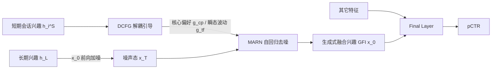

# iFusion: Integrating Dynamic Interest Streams via Diffusion Model for Click-Through Rate Prediction

**会议**: ICLR 2026  
**OpenReview**: [https://openreview.net/forum?id=iYQgXETC1D](https://openreview.net/forum?id=iYQgXETC1D)  
**代码**: 待确认  
**领域**: 推荐系统 / CTR 预测 / 生成式用户兴趣建模  
**关键词**: CTR 预测、长短期兴趣融合、扩散模型、分类器无关引导、自回归去噪  

## 一句话总结
iFusion 把"长短期用户兴趣融合"重新表述为一个条件生成问题——以短期兴趣为引导，对长期兴趣表示做扩散去噪，从而摆脱传统线性融合（拼接/注意力/门控）的假设，在公开数据集、工业数据集和线上 A/B 上都拿到 CTR 提升。

## 研究背景与动机

**领域现状**：CTR 预测是推荐和广告的核心，几乎都建立在用户行为建模之上。主流做法把行为切成长期序列（稳定偏好，常用历史点击日志建模）和短期序列（易变兴趣，常用近期购买/会话），分别精细建模后再融合。长期建模（SIM、ETA、TWIN 系列）和短期建模各自都有大量进展。

**现有痛点**：相比之下，"如何融合"这一步长期被忽视，而现有融合手段（拼接、注意力、门控）本质都依赖线性假设，作者指出三个硬伤：

- **特征空间错位**：长短期分别用不同的特征和编码器（点击 vs 购买），两套表示天然异构，线性算子预设了空间已对齐，根本对不上；
- **后融合的割裂建模**：late-fusion 把"行为建模"和"兴趣融合"拆成两条独立流水线，归纳偏置不利于跨序列整合；
- **扰动-兴趣纠缠**：线性融合没有机制把短期里有意义的兴趣信号和随机波动分开，噪声会不受控地传播，污染稳定的长期表示。

此外，HSTU 类生成式排序方案把所有行为拼成一条统一序列，在行为稀疏时反而建模不足——判别式排序无法从有限证据里"推断并融合"兴趣。

**核心矛盾**：长短期兴趣是异构、非平稳、甚至相互矛盾的演化模式，而线性融合算子无力刻画这种非线性交互，又无法把噪声从信号里剥离。

**本文目标**：设计一个能容忍扰动、联合建模与融合、且满足线上低延迟的融合机制。

**核心 idea（生成式重述）**：不再把融合当成确定性算子，而是当成**条件生成**——把长期兴趣 $h_L$ 当扩散初态 $x_0$，前向加噪到高斯，反向去噪时以短期会话兴趣 $\{h_i^S\}$ 为条件，生成同时保留长期偏好、吸收短期动态的融合表示 $\hat{x}_0$。

## 方法详解

### 整体框架
iFusion 把长期兴趣 $h_L$ 作为扩散的起点 $x_0$，前向过程按方差表 $\{\beta_t\}$ 逐步加噪 $q(x_t|x_0)=\mathcal{N}(\sqrt{\bar\alpha_t}x_0,(1-\bar\alpha_t)I)$ 直到收敛为标准高斯；反向过程则在短期会话兴趣引导下逐步去噪，最终得到"生成式融合兴趣 GFI"，再与其它特征拼接送入最终层预测 pCTR。两个核心组件支撑反向过程：**DCFG** 负责在扰动下提供鲁棒引导，**MARN** 负责在去噪链上做多会话的混合引导与兴趣演化建模。

### 关键设计

**1. DCFG：把引导拆成"核心偏好"和"瞬态波动"两路，对症下药。** 标准的分类器无关引导（CFG）用单一缩放因子 $\gamma$ 混合有条件和无条件预测 $\hat f_\theta=f_\theta(x_t,t)+\gamma(f_\theta(x_t,t,g)-f_\theta(x_t,t))$，它假设引导信号质量均匀；但兴趣表示的信噪比远低于图像生成里的引导，稳定偏好和瞬时波动同时混在一起，统一缩放会被噪声拖累。作者借随机热力学视角，把用户兴趣动态看成在复合势场 $V(x_t|g)=V(x_t|g_{cp})+V(x_t|g_{tf})$ 里运动的粒子——核心偏好 $g_{cp}$ 造出深势阱（稳定吸引子），瞬态波动 $g_{tf}$ 只造浅扰动。据此用两条专门结构做功能解耦：核心偏好走"低通"路径 $h_{cp}=\text{AvgPool}(\text{Encoder}(g))$（强正则 + 全局池化求稳），瞬态波动走"高通"路径 $h_{tf}=\text{Attention}(\text{Encoder}(g))$（注意力抓变化）。Theorem 1 证明：只要两路能量函数的 Hessian 主特征空间近似正交，条件 score 就能精确分解 $\nabla_{x_t}\log p=\gamma_{cp}(-\nabla E_{cp})+\gamma_{tf}(-\nabla E_{tf})$，从而把"功能解耦"建立在架构约束上而非苛刻的条件独立假设上，最终引导写成 $\hat f_\theta=f_\theta(x_t,t)+\sum_{j\in\{cp,tf\}}\gamma_j(f_\theta(x_t,t,g_j)-f_\theta(x_t,t))$。

**2. MARN：用自回归去噪把多会话引导串成链，而非并行平均。** 当前扩散推荐多用单向量引导 + 非自回归（NAR）结构（MLP/Transformer 并行注入），并行生成抓不住细粒度的会话依赖，遇到强时序耦合或非线性引导关系就力不从心。MARN 改成沿会话链做条件——把 $K$ 个短期会话兴趣按链式法则顺序处理，前一个会话的去噪输出充当后一个会话生成的"含噪表示"，相当于把复杂的联合分布分解成条件链。Theorem 2 给出"AR 在多会话扩散里严格优于 NAR"的三点保证：当会话间存在依赖 $I(s_i;s_j)>0$ 时 AR 有更紧的 KL 上界、$O(K)$ 更低的梯度方差、以及随梯度自适应的会话权重 $\alpha_k\propto\exp(-\|\nabla_{s_k}L\|/\sigma_t)$；只有当会话独立或延迟卡得极死时 NAR 才打平。这一优势随会话数 $K$ 超线性增长。

**3. 一致性约束：用噪声不变表示换"一步推断"，满足线上低延迟。** 扩散迭代去噪太慢，工业 CTR 服务扛不住。作者加一项一致性损失 $L_{cons}=\mathbb{E}_{t_1,t_2}\|f_\theta(x_{t_1},t_1)-f_\theta(x_{t_2},t_2)\|^2$，强迫不同噪声水平下生成的兴趣表示彼此一致，从而学到噪声不变表示，可用极少采样步（实验里 cosine 调度 + 单步推断即最优）拿到高质量生成，把扩散模型真正落到实时系统。

**4. 多目标训练与零数据兜底。** 总损失 $L=L_{CE}+\lambda_1 L_{Evol}+\lambda_2 L_{Dist}+\lambda_3 L_{cons}+\beta\|\Theta\|^2$：交叉熵管 CTR 主任务，$L_{Evol}$（下一会话兴趣的余弦距离）管兴趣演化，$L_{Dist}=\|g_{cp}^\top g_{tf}\|_2^2$ 强制两路引导解耦，$L_{cons}$ 管效率。理论上还证明（Theorem 3/4）在行为数据完全缺失时，去噪过程会沿兴趣流形回退到群体级统计先验 $\epsilon_\theta(z_t,t)=\mathbb{E}_{z_0\sim p_{data}}[\epsilon|z_t]$，给冷启动/稀疏场景一个合理兜底。

## 实验关键数据

### 主实验（AUC / RelaImpr，四数据集）

| 方法 | Amazon AUC | Taobao AUC | Ali Ads AUC | Industrial AUC |
|------|-----------|-----------|-------------|----------------|
| AvgPooling DNN | 0.7689 | 0.8539 | 0.6352 | 0.7512 |
| DIN | 0.8162 | 0.8995 | 0.6422 | 0.7564 |
| DIEN | 0.8377 | 0.9222 | 0.6431 | 0.7611 |
| SIM / ETA / SDIM | 0.842x | 0.927x | 0.659x | 0.7625~0.7628 |
| TWIN / TWIN-V2 | 0.8431/0.8433 | 0.9288/0.9289 | 0.6601/0.6607 | 0.7630/0.7634 |
| MTGR | 0.8440 | 0.9296 | 0.6615 | 0.7648 |
| DiffuRec / DreamRec / DiffuMIN | 0.8395~0.8427 | 0.9258~0.9288 | 0.6584~0.6595 | 0.7607~0.7623 |
| **iFusion (Ours)** | **0.8512** | **0.9347** | **0.6652** | **0.7685** |

iFusion 在四个数据集上全面领先，工业集相对 AvgPooling 的 RelaImpr 达 +6.89%（vs 最强基线 MTGR 的 +5.41%）。在 CTR 场景下 0.001 的 AUC 提升即被视为有实际意义。值得注意的是，现有扩散方法（DiffuRec/DreamRec/DiffuMIN）反而不如 MTGR，作者归因于它们的引导机制无法解耦核心偏好与瞬态波动。

### 消融实验（工业数据集 AUC）

| 维度 | 配置 | AUC |
|------|------|-----|
| DCFG | w/o guidance / w/ CFG / **Ours** | 0.7607 / 0.7663 / **0.7685** |
| MARN | NAR-MLP / NAR-Att / AR-Att / **Ours** | 0.7644 / 0.7650 / 0.7689 / **0.7685** |
| 一致性 | w/o cons (12.9 b/s) / **Ours (16.2 b/s)** | 0.7686 / **0.7685** |

- DCFG 相对纯 CFG 再提 ~0.0022 AUC，验证"解耦引导"必要性；naively 灌入全部引导反而掉点。
- MARN 的增益来自跨会话的层次化处理而非网络容量——加深内部网络不再提升，说明效果源于"兴趣空间融合"范式。
- 一致性损失几乎不损 AUC（0.7686→0.7685），却把推断速度提 +25.6%（12.9→16.2 batches/sec）。

### 关键发现
- **噪声调度 + 采样步**：cosine 调度配合一致性损失，单步推断即达最优；步数增加反而因误差累积掉点（图 4a，各调度 r≈−0.95~−0.97）。
- **会话数 scaling**：会话越多，AR(MARN) 相对 NAR 优势越明显，印证 Theorem 2 的超线性结论。
- **效率**：离线推断耗时仅 +0.3%，线上 TP99 延迟仅 +0.302%。
- **线上 A/B**（7 天、上亿用户）：CTR +2.44%、eCPM +2.61%（均 p<0.001）。

## 亮点与洞察
- **把"融合"问题生成化**：跳出"拼接/注意力/门控"的线性思维，把长短期融合看成"以短期为条件、对长期去噪"的条件生成，这是范式层面的重述。
- **解耦不靠条件独立，而靠架构约束**：DCFG 用低通/高通两条结构 + Hessian 正交近似来实现功能解耦，绕开了苛刻的统计假设，理论与实现衔接得很自然。
- **AR vs NAR 给了可证明的优越性**：Theorem 2 把"自回归去噪在多会话依赖下更优"量化成 KL/梯度方差/自适应权重三条，并被会话 scaling 实验佐证。
- **真正落地**：一致性损失换来单步推断，离线/线上延迟开销都 <0.3%，配合显著 A/B 收益，工业可用性强。

## 局限与展望
- **理论假设偏强**：Theorem 1 依赖两路能量 Hessian 主特征空间"近似正交"，Theorem 2 的优越性建立在多会话依赖结构上，实际数据是否满足、$\zeta$ 残差相关性多大，正文未给经验度量。
- **超参较多**：四项损失权重 $\lambda_1,\lambda_2,\lambda_3,\beta$ 加上两个引导缩放 $\gamma_{cp},\gamma_{tf}$，调参成本和泛化稳健性值得关注。
- **场景局限于 CTR 排序**：方法聚焦点击率预测，是否能迁移到多目标排序、序列推荐生成等任务尚待验证。
- **零数据理论的实证**：Theorem 3/4 的群体先验兜底主要在附录给出，正文缺乏冷启动场景的系统实验。

## 相关工作与启发
- **判别式用户行为建模**：从 MLP → RNN（GRU4Rec）→ 注意力（DIN/DIEN），再到长期依赖建模（SIM/ETA/SDIM/TWIN）。iFusion 把这条线的"长短期分别建模"接到生成式融合上。
- **生成式推荐 / 扩散推荐**：DiffuRec、DreamRec、DiffuMIN 等把扩散用于序列推荐，但少有专门面向 CTR 的；HSTU/MTGR 走统一序列的判别式生成。iFusion 指出这些方法在引导解耦上的缺失，并补上 CTR 这一空白。
- **启发**：把"特征融合"这类被默认线性化的环节重述成条件生成，再用 classifier-free guidance 的解耦做信号/噪声分离，是一条可推广到其它多源表示融合任务的思路；而一致性蒸馏让扩散满足工业延迟，是生成式推荐落地的关键拼图。

## 评分
- 新颖性: ⭐⭐⭐⭐ 把长短期兴趣融合重述为条件扩散生成、并用 DCFG/MARN 解决引导解耦与多会话依赖，范式上确有新意。
- 实验充分度: ⭐⭐⭐⭐ 四数据集 + 消融 + 超参 + 效率 + 上亿用户线上 A/B，覆盖完整；略欠零数据/冷启动的正文实证。
- 写作质量: ⭐⭐⭐⭐ 动机三痛点、方法两组件、四个 RQ 组织清晰；定理较多但与设计对应明确。
- 价值: ⭐⭐⭐⭐ 离线/线上双验证、延迟开销 <0.3%、CTR +2.44%，工业落地价值高。

<!-- RELATED:START -->

## 相关论文

- [\[AAAI 2026\] Length-Adaptive Interest Network for Balancing Long and Short Sequence Modeling in CTR Prediction](../../AAAI2026/recommender/length-adaptive_interest_network_for_balancing_long_and_short_sequence_modeling_.md)
- [\[ICLR 2026\] Steering Diffusion Models Towards Credible Content Recommendation](steering_diffusion_models_towards_credible_content_recommendation.md)
- [\[ICLR 2026\] Discrete Diffusion for Bundle Construction](discrete_diffusion_for_bundle_construction.md)
- [\[ICLR 2026\] GoalRank: Group-Relative Optimization for a Large Ranking Model](goalrank_group-relative_optimization_for_a_large_ranking_model.md)
- [\[ICLR 2026\] ProPerSim: Developing Proactive and Personalized AI Assistants through User-Assistant Simulation](propersim_developing_proactive_and_personalized_ai_assistants_through_user-assis.md)

<!-- RELATED:END -->
