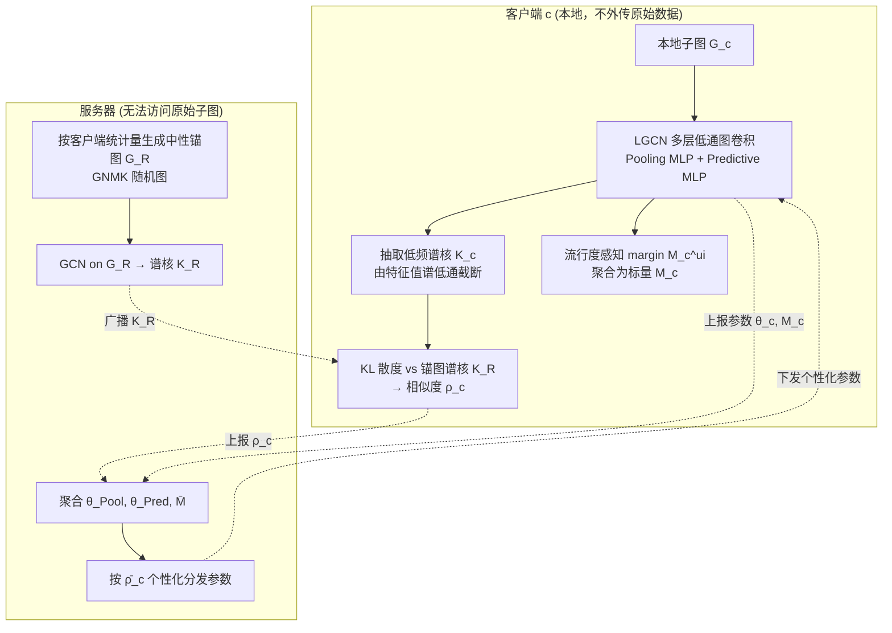

# Low-pass Personalized Subgraph Federated Recommendation

**会议**: ICLR 2026  
**OpenReview**: [https://openreview.net/forum?id=SSd3GENRAU](https://openreview.net/forum?id=SSd3GENRAU)  
**代码**: 待确认  
**领域**: 联邦推荐 / 图学习  
**关键词**: 联邦推荐系统, 子图结构不平衡, 图傅里叶变换, 低通谱滤波, 流行度偏置, 个性化联邦学习  

## 一句话总结
针对联邦推荐里各客户端"子图大小/连通度差异巨大"导致的表示错位与流行度偏置问题，LPSFed 用低通谱滤波抽取跨子图稳定的低频结构信号来度量客户端与中性锚图的相似度、据此个性化聚合参数，并叠加一个感知局部流行度的自适应 margin 校正长尾，五个数据集上 NDCG 最高涨 24%。

## 研究背景与动机
**领域现状**：联邦推荐系统（FRS）让每个客户端（如电商按国家/地区切分的 user-item 子图）只在本地训练、只交换参数不交换原始交互，从而保护隐私。主流做法分矩阵分解类、个性化类、以及在服务器侧构图的图神经网络类（FedPerGNN 等），它们大多**默认各客户端子图结构相近**。

**现有痛点**：现实中子图存在严重的 **结构不平衡（subgraph structural imbalance）**——不同客户端的节点规模（user/item 数）和连通度（item degree）可以差出一个数量级。这对依赖多跳消息传递的空间域 GNN（LightGCN、NGCF、PinSage）是致命的：本地拓扑差异极大时，各客户端训出来的表示彼此错位，联邦聚合被这些"离群"客户端带偏，推荐质量下降。论文在 Amazon-Book 上把图谱聚类成 15 个客户端分成 Large-Dense / Medium-Balanced / Small-Sparse 三组，实证显示 Laplacian 特征值谱在三组间显著分化，且现有 baseline 的 NDCG@20 随结构差异单调下滑。

**核心矛盾**：已有的谱域联邦方法（Spectral FL）确实能靠对齐低频结构成分缓解异质性，但它们假设的是引文/社交网络那种带特征的同质图；而推荐图是**二部图、几乎没有节点特征、且度分布极度长尾**，谱域方法不能直接照搬。更糟的是，结构不平衡还会放大**局部流行度偏置**：稠密客户端里高度 hub item 主导聚合压住长尾，稀疏客户端则被迫依赖少数较高度 item 训练不稳，而联邦隔离又让客户端拿不到全局上下文来纠偏，于是形成"热门更热门"的自强化反馈环。

**本文目标**：在不共享原始子图的前提下，构造一个对子图规模/度数变化鲁棒的结构相似度，用它驱动个性化参数更新；同时显式建模并校正每个子图的局部流行度偏置。

**核心 idea**：**用低通谱滤波抽取"跨尺度稳定"的低频结构信号当作客户端身份**——低频成分反映核心连通模式、对规模和噪声不敏感；据此算客户端与一张中性"锚图"的相似度，相似度越高就越多地吸收全局参数；再叠一个由 item 度分布算出的**流行度感知自适应 margin** 局部纠偏。

## 方法详解

### 整体框架
LPSFed 是一个三阶段的个性化联邦推荐框架（客户端两阶段 + 服务器一阶段），每个全局轮次循环执行：客户端用低通图卷积网络（LGCN）训练本地模型、顺带抽取子图的低频谱核 $K_c$ 和局部流行度信息（Stage 1）；服务器每轮按客户端上报的高层统计量生成一张"中性锚图"$G_R$ 并广播其谱核 $K_R$，客户端用 KL 散度算出自己相对锚图的结构相似度 $\rho_c$（Stage 2）；服务器把各客户端的池化 MLP、预测 MLP 与平均 margin 聚合成全局参数，再按每个客户端的归一化相似度 $\bar{\rho}_c$ 做个性化分发（Stage 3）。两条主线——谱域个性化与流行度纠偏——互相协同。

### 关键设计

**1. 低通图卷积主干 + 谱核结构签名：把"子图身份"压缩成抗噪的低频分布。** 每个客户端用 LGCN 处理本地二部图：先对图拉普拉斯 $L = I - D^{-1/2}AD^{-1/2}$ 做特征分解 $L = P\Lambda P^T$，用只保留前 $\Phi$ 个特征向量的低通门控 $\tilde{f}$ 做低通卷积 $Z\bar{*}_g k = \bar{P}\,\mathrm{diag}(\bar{k})\,\bar{P}^T Z$，复杂度仅 $O(n\Phi^2)$（$\Phi \ll M+N$），且特征分解只在预处理跑一次、用 Lanczos 求解器利用稀疏性、不增加每轮通信成本。LGCN 输出经 Pooling MLP 把各层 user/item 嵌入合并成客户端专属表示，Predictive MLP 把 user-item 对映射成偏好角 $\hat{R}_{ui} = \arccos(\tanh(f_{\theta_{\mathrm{Pred}}}([U_u, V_i, U_u\odot V_i])))$（值域 $[0,\pi]$，角度形式便于和 margin 拼接）。最关键的是从特征值谱构造低通核分布作为该子图的**结构签名**：$K_c = \bar{k}_c = \Lambda_c \odot \tilde{f}_{1:\Phi}$。这个签名只保留低频，因而对规模缩放和高频噪声不敏感，是后续跨客户端比较的稳定基底——论文用 Theorem 3.1 证明：低通滤波后的特征值分布间 KL 散度会以 $4\Phi\exp(-c\min(n_1,n_2)\epsilon^2/8)$ 的概率指数收敛到极限值，误差被最小 eigengap 界住，即社区结构越清晰、相似度估计越精确，从而为用 $D_{\mathrm{KL}}(K_R\|K_c)$ 当结构差异代理提供了理论依据。

**2. 中性锚图 + KL 相似度驱动的个性化聚合：让结构离群客户端少污染全局模型。** 服务器拿不到原始子图，于是每个全局轮用客户端上报的高层统计量（平均节点/边数）经 GNMK 随机图模型生成一张"中性锚图"$G_R$（GNMK 比 Erdős–Rényi 更能保留度分布；隐私更严时可省略统计量、纯随机生成），对其跑 GCN 得到锚图谱核 $K_R$ 广播下去。每个客户端**不外传自己的本地核 $K_c$**，只在本地算 $\rho_c = D_{\mathrm{KL}}(K_R\|K_c) = \sum_{i=1}^{\Phi} K_R(i)\log\frac{K_R(i)}{K_c(i)}$，服务器再做 min-max 归一化得 $\bar{\rho}_c = 1 - \frac{\rho_c - \min(\rho)}{\max(\rho) - \min(\rho)}$——越接近中性锚图、$\bar{\rho}_c$ 越大。聚合时服务器对池化 MLP、预测 MLP 取均值 $\bar{\theta}$，分发时按相似度做凸组合 $\theta^c_{\mathrm{updated}} = \bar{\theta}\cdot\bar{\rho}_c + \theta^c\cdot(1-\bar{\rho}_c)$：结构与锚图相近的客户端多吸收全局知识，结构高度发散的离群客户端则更多保留本地参数，从而把它们对全局模型的拉扯压下去。Theorem 3.2 进一步说明低通滤波本身是个谱正则器，把表示方差用 eigengap 界住（$|\mathrm{Var}(z)-\mathrm{Var}(z^*)|\le C'/\delta$），与相似度度量受同一 eigengap 支配，统一了"度量"与"正则"两件事。

**3. 局部流行度感知自适应 margin：在角度损失里给长尾让位、打断热门反馈环。** 论文把 user/item 的流行度分 $p_u, p_i$ 各自编码成 $d$ 维向量，用其夹角余弦 $\cos(\hat{\xi}_{ui})$ 作偏置分，先用一个辅助对比损失 $L_{\mathrm{bias}}$ 训练这对偏置编码器、规整偏置嵌入空间；再用同一个偏置角构造主任务的自适应 margin $M^c_{ui} = \min\{\gamma\cdot\hat{\xi}_{ui},\ \pi - \hat{R}_{ui}\}$（$\gamma$ 控强度，$\pi-\hat{R}_{ui}$ 保证单调下降）。这个本地 margin 不是孤立用：每个客户端把它在全图上平均成一个**不可逆标量** $M_c = \frac{1}{MN}\sum_{u,i} M^c_{ui}$ 上报（只传一个数、防泄露 user/item 级偏置，且明确**不共享偏置编码器参数**以免暴露细粒度偏好），服务器聚合成全局偏置上下文 $\bar{M}$ 并按相似度回传，客户端把收到的全局值与新算的本地 margin 插值成精炼 margin $\widetilde{M}^c_{ui} = \omega M^c_{\mathrm{updated}} + (1-\omega)M^c_{ui}$，最终喂进 Bias-aware Contrastive 损失 $L_{\mathrm{BC}} = -\sum_{(u,i)\in O^+}\log\frac{\exp(\cos(\hat{R}_{ui}+\widetilde{M}^c_{ui})/\tau)}{\exp(\cos(\hat{R}_{ui}+\widetilde{M}^c_{ui})/\tau) + \sum_{j\in N_u}\exp(\cos(\hat{R}_{uj})/\tau)}$。直观上，margin 对被过度推荐的热门 item 加惩罚、鼓励长尾曝光，既兼顾了"全局偏置共识"又保留了"本地结构特性"，从而打断流行度自强化反馈环。

## 实验关键数据

### 主实验表格
五个真实数据集（Amazon-Book / Gowalla / Movielens-1M / Yelp2018 / Tmall-Buy），全图经谱聚类切成 4 个子图模拟联邦设置，Recall@20 / NDCG@20，对比 9 个 baseline（FedAvg、FedPUB、FedMF、F2MF、PFedRec、FedRAP、FedPerGNN、FedHGNN、FedSSP）：

| 数据集 | 指标 | 次优 baseline | LPSFed | 提升 |
|---|---|---|---|---|
| Amazon-Book | Recall / NDCG | 0.0713 / 0.0356 | **0.0738 / 0.0442** | +3.5% / **+24.2%** |
| Gowalla | Recall / NDCG | 0.1528 / 0.0729 | **0.1621 / 0.0909** | +6.1% / +17% |
| Movielens-1M | Recall / NDCG | 0.2564 / 0.1265 | **0.2646 / 0.1342** | +3.2% / +6.1% |
| Yelp2018 | Recall / NDCG | 0.0750 / 0.0315 | **0.0783 / 0.0379** | +4.4% / +20.3% |
| Tmall-Buy | Recall / NDCG | 0.0370 / 0.0186 | **0.0385 / 0.0218** | +4.1% / +17.2% |

NDCG 提升远大于 Recall，说明方法主要改善了 top-rank 的排序精度。仅用 BPR 损失的 LPSFed(BPR)（去掉 bias-aware margin、只保留谱域个性化）已经能打平甚至超过 FedSSP，证明谱域个性化本身就很强。

### 结构不平衡鲁棒性（Amazon-Book，15 客户端分三组）

| 组 | 指标 | 次优 baseline | LPSFed | 提升 |
|---|---|---|---|---|
| Large-Dense | Recall / NDCG | 0.0669 / 0.0380 | **0.0769 / 0.0448** | +14.9% / +17.9% |
| Medium-Balanced | Recall / NDCG | 0.0528 / 0.0269 | **0.0550 / 0.0295** | +4.2% / +9.7% |
| Small-Sparse | Recall / NDCG | 0.0317 / 0.0131 | **0.0331 / 0.0146** | +4.4% / +11.5% |
| Overall | Recall / NDCG | 0.0396 / 0.0184 | **0.0419 / 0.0206** | +5.8% / +13.8% |

在最受流行度反馈环之害的 Large-Dense 组提升最大，说明 margin 有效打断了"热门更热门"。

### 消融实验表格

| 变体 | Amazon-Book NDCG | Gowalla NDCG | 说明 |
|---|---|---|---|
| w/o LGCN（换回空间域 NGCF） | 0.0216 | 0.0427 | 性能灾难性下跌，证实空间域 GNN 扛不住结构发散 |
| w/o bias-aware（=LPSFed(BPR)） | 0.0322 | 0.0711 | 去掉流行度纠偏，长尾掉点明显 |
| w/o per（去个性化聚合） | 0.0368 | 0.0788 | 退化，相似度驱动的分发不可少 |
| w/o per & bias-aware（≈FedAvg） | 0.0312 | 0.0660 | 两个核心模块都去掉接近裸联邦 |
| w/o statistics for $G_R$（更严隐私） | 0.0403 | 0.0856 | 不聚合任何客户端统计量仍稳居次优 |
| **LPSFed（完整）** | **0.0442** | **0.0909** | — |

### 关键发现
- **谱域个性化与流行度 margin 是互补的两条腿**：前者管表示对齐与抗结构发散，后者管长尾纠偏，去掉任一个都明显掉点，去掉 LGCN 主干则崩溃。
- **流行度纠偏不牺牲头部**：在 Tail/Mid/Head 分组的偏置实验（Table 3）里，LPSFed 在 Tail 组涨幅最大（平衡集 Tail NDCG +271% vs FedAvg），同时 Head 也保持最优，说明 margin 去的是"流行度噪声"而非简单牺牲热门换长尾。
- **隐私可加严而几乎不掉性能**：连客户端高层统计量都不上报的 w/o statistics for $G_R$ 变体仍是多数指标的次优，给了"严格隐私下也能用"的余量。
- **超参规律清晰**：margin 强度 $\gamma$ 越大 NDCG 单调上升（$\gamma=1.0$ 时 Jaccard 增长最慢、最有效压制反馈环）；低通截断 $\Phi=128$ 时最优（保留谱稳定低频、剔除高频噪声）；温度 $\tau$ 过低难学、过高过拟合。

## 亮点与洞察
- **把"客户端身份"从参数空间挪到谱空间**：传统个性化联邦按参数/梯度相似度聚合，对规模差异敏感；这里改用低通特征值分布当签名，天然对子图大小/度数缩放鲁棒，且只需传一个 KL 标量，隐私友好。
- **针对推荐二部图量身改造谱域联邦**：直接点出谱域 FL 的同质图假设在"二部、无特征、度极偏"的推荐图上不成立，并用低通谱核 + 角度损失 + 流行度 margin 把它接到推荐场景，是一个干净的"为什么不能照搬 + 怎么改"的故事。
- **理论与方法咬合**：两条定理分别把"相似度度量的稳定性"和"低通滤波的正则强度"都归到同一个 eigengap $\delta$ 上，让"用 $\bar{\rho}_c$ 当个性化权重"不只是工程直觉。
- **结构不平衡与流行度偏置被统一处理**：论文观察到结构不平衡会放大局部流行度偏置（稠密客户端 hub 主导、稀疏客户端依赖少数热门），于是用同一套谱相似度同时调制参数聚合和偏置上下文回传，两个问题一并解。

## 局限与展望
- **依赖预处理阶段的特征分解**：虽然用 Lanczos 只算前 $\Phi$ 个特征向量、且只跑一次，但对超大子图或客户端子图频繁变动（动态图）的场景，预处理成本和"谱签名是否随时间漂移"仍需验证。
- **客户端切分方式偏理想**：实验用谱聚类把全图切成 4 或 15 个结构鲜明的子图来"制造"结构不平衡，真实联邦里客户端边界由地理/业务决定，结构分布可能更杂、更难，泛化性待考。
- **隐私保证偏经验**：上报的是平均 margin 标量和高层统计量、声称"不可逆"，但没有形式化的差分隐私预算分析；面对重建攻击的鲁棒性是后续可补的方向。
- **锚图生成的敏感性**：中性锚图靠 GNMK 随机图近似，锚图选得好不好直接影响相似度排序，论文给了 ER vs GNMK 的对比但缺更系统的锚图设计探讨。
- **规模仍偏中小**：五个公开数据集 + 4/15 客户端，距工业级成千上万客户端、强 non-IID 的真实联邦推荐还有距离。

## 相关工作与启发
- **联邦推荐**：从 FedMF（矩阵分解）到 PFedRec/FedRAP（个性化）再到 FedPerGNN/FedHGNN（图神经网络），本文指出它们共有的"客户端子图结构可比"假设是软肋。
- **谱域联邦学习**：FedSSP 等通过对齐低频谱成分缓解异质性，本文是其在推荐二部图上的"对症改造版"，并把谱相似度从"对齐"升级为"个性化加权"。
- **流行度偏置/长尾推荐**：借鉴了 margin-based 对比学习（角度损失 + 自适应 margin）思路，并把它联邦化——本地算 margin、聚合成全局偏置上下文再回传插值，是"如何在不共享细粒度偏好的前提下做全局纠偏"的一个可复用范式。
- **启发**：当联邦各方"数据结构"本身差异巨大（不只是标签分布偏移）时，与其在参数空间硬聚合，不如先找一个**对尺度不变的结构不变量**（这里是低通谱）当对齐坐标系；这个思路对图联邦、跨域联邦都有迁移价值。

## 评分
- 新颖性: ⭐⭐⭐⭐ —— "子图结构不平衡"这个问题刻画得准，用低通谱核当抗尺度的客户端签名 + KL 相似度驱动个性化聚合是有辨识度的组合；不是全新积木，但拼法新且对推荐二部图做了实质改造。
- 实验充分度: ⭐⭐⭐⭐ —— 五数据集、9 baseline、结构分组/流行度分组/消融/超参四类分析齐全，且配两条定理，证据链完整；扣分在客户端数偏小、切分偏理想化。
- 写作质量: ⭐⭐⭐⭐ —— 动机用 Figure 1 三联图讲得很清楚，方法三阶段 + 算法伪代码 + 定理层次分明；公式偏密，初读需要对照图。
- 价值: ⭐⭐⭐⭐ —— 隐私友好（只传谱标量与 margin 标量）、即插即用于图联邦推荐，且"找尺度不变结构签名做对齐"的思路可迁移到更广的图/跨域联邦，落地与启发兼具。

<!-- RELATED:START -->

## 相关论文

- [\[ACL 2026\] GraphLoRA: Structure-Aware Low-Rank Adaptation for Large Language Model Recommendation](../../ACL2026/recommender/graphlora_structure-aware_low-rank_adaptation_for_large_language_model_recommend.md)
- [\[ICLR 2026\] Continual Low-Rank Adapters for LLM-based Generative Recommender Systems](continual_low-rank_adapters_for_llm-based_generative_recommender_systems.md)
- [\[ICLR 2026\] Beyond Markovian Drifts: Action-Biased Geometric Walks with Memory for Personalized Summarization](beyond_markovian_drifts_action-biased_geometric_walks_with_memory_for_personaliz.md)
- [\[ICLR 2026\] ProPerSim: Developing Proactive and Personalized AI Assistants through User-Assistant Simulation](propersim_developing_proactive_and_personalized_ai_assistants_through_user-assis.md)
- [\[ACL 2025\] KERL: Knowledge-Enhanced Personalized Recipe Recommendation using Large Language Models](../../ACL2025/recommender/kerl_knowledge-enhanced_personalized_recipe_recommendation_using_large_language_.md)

<!-- RELATED:END -->
