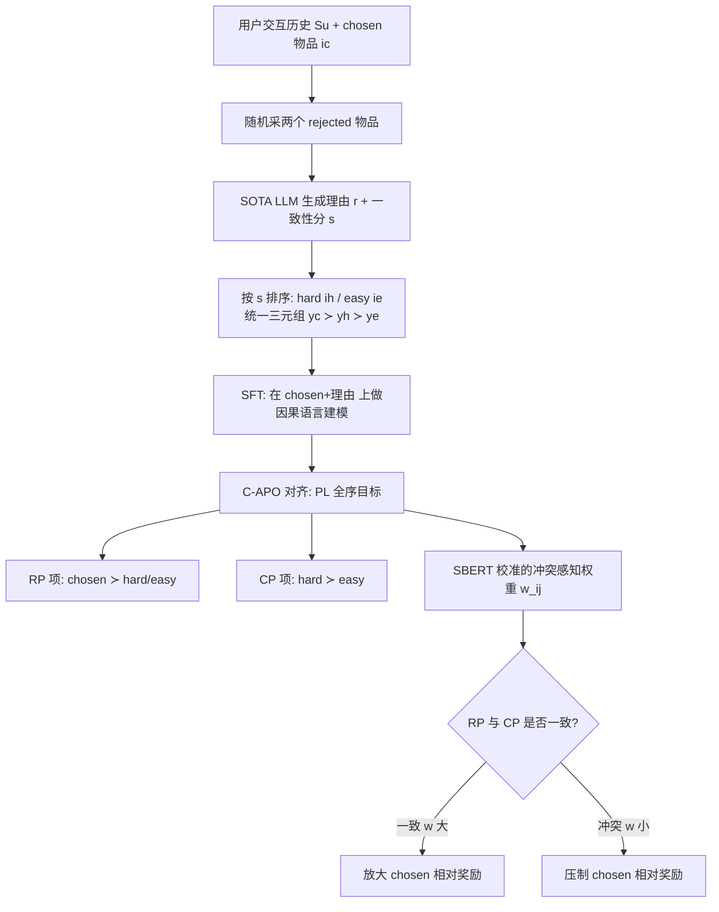

# More Than What Was Chosen: LLM-based Explainable Recommendation Beyond Noisy User Preferences

**会议**: ICLR 2026  
**OpenReview**: [https://openreview.net/forum?id=WYfDoB44xy](https://openreview.net/forum?id=WYfDoB44xy)  
**代码**: [https://github.com/cpark88/C-APO](https://github.com/cpark88/C-APO)  
**领域**: 推荐系统 / 可解释推荐 / LLM 偏好对齐  
**关键词**: LLM 推荐, 偏好对齐, DPO, 可解释推荐, 显示偏好, 一致性偏好  

## 一句话总结
用户点过的东西未必是真喜欢的——本文提出"一致性偏好"(Coherent Preference)来补充传统"显示偏好"(Revealed Preference)，并设计冲突感知的 DPO 变体 C-APO，在 RP 与 CP 一致时放大、冲突时压制其影响，从而同时提升推荐准确率和理由的说服力。

## 研究背景与动机

**领域现状**：推荐系统长期建立在微观经济学的"显示偏好"(Revealed Preference, RP)假设上——观测到的用户行为(点击、购买)忠实反映其真实兴趣。协同过滤、序列推荐乃至基于 DPO 对齐的 LLM 推荐(LLM-Rec)，本质都在学习 `chosen ≻ unobserved` 这一来自行为的成对序关系。

**现有痛点**：真实世界的选择是有噪声的——账号共享、社交场景、促销冲动、信息受限都会让用户点下与其稳定兴趣不符的东西。作者用 LLM-as-a-Judge 在 Amazon Review 上打"与历史行为的逻辑一致性"分，发现约 **30% 的 ground-truth 物品根本无法被逻辑解释**。这意味着即便给 LLM-Rec 配上强推理能力，只学 RP 也会把噪声当信号，进而生成缺乏说服力的推荐理由——而在 Instagram、Amazon 这类同时展示"推荐+理由"的平台上，弱理由会直接损害用户信任。

**核心矛盾**：RP 提供了高价值的真实交互信号(对推荐准确率有用)，但它无法自我纠错；纯靠 RP 训练会过拟合到噪声选择上。需要一个**与行为信号互补、又能反映"选择背后的推理"**的信号来对冲噪声。

**本文目标**：在不丢弃 RP 价值的前提下，引入一个建模"选择合理性"的信号，并在两者**一致 / 冲突**时自适应地调和，最终既提升推荐性能又生成更可信的理由。

**核心 idea**：**[一致性偏好]** 提出 Coherent Preference(CP)——偏好那些与用户历史行为在因果/逻辑上一致的物品(不只问"选了什么"，而问"若行为一致且可解释，会选什么")。**[冲突感知对齐]** 把 RP 与 CP 统一进一个 Plackett-Luce 全序目标，并用可训练的"冲突感知自适应权重"按两者是否一致来动态加权，让模型在 CP 与 RP 一致时强化、冲突时弱化对应项。

## 方法详解

### 整体框架

C-APO 分两阶段。先离线构造**三元组理由数据集**：对每个用户取 ground-truth 的 chosen 物品 $i_c$，再随机采两个用户没交互过的 rejected 物品，用 SOTA LLM 为每个物品生成自然语言理由 $r$ 和 1–7 的一致性分数 $s$；其中分数高者记为 hard rejected $i_h$、低者记为 easy rejected $i_e$，得到统一全序 $y_c \succ y_h \succ y_e$(每个 $y=(i,r,s)$ 同时带物品和理由)。再在 SFT 之后，用 C-APO 这个冲突感知 DPO 变体做偏好对齐：把全序拆成 RP 项(chosen 高于所有 rejected)和 CP 项(hard 高于 easy)，并额外用 SBERT 校准的权重去调和"chosen 到底该不该排第一"这一 RP–CP 冲突。

### 关键设计

**1. 一致性偏好(CP)与三元组数据构造：把"选择背后的推理"显式化。** RP 只给出 `chosen ≻ unobserved` 的行为序，而 CP 关注物品与历史 $S_u$ 的逻辑一致性。作者对每个 $i\in\{i_c,i_1^-,i_2^-\}$ 让 LLM 同时产出理由和一致性分 $s\in\{1,\dots,7\}$(单答打分式 LLM-as-a-Judge)，并用人工标注验证打分可信(Spearman $\rho=0.71$, $p<0.0001$)。两个 rejected 中分高者为 $i_h$、分低者为 $i_e$，于是 CP 在 rejected 内部诱导出 $i_h\succ i_e$，与 RP 的 $i_c\succ i_h,i_c\succ i_e$ 合成统一三元组 $y_c\succ y_h\succ y_e$。关键在于：CP **还能**比较 chosen 与 rejected——当某个 rejected 的一致性分高于 chosen 时，就暴露出 RP 与 CP 的冲突(实验显示五个域里有 31.9%–40.3% 的 hard rejected 一致性分高于 chosen)，这正是后续要校准的对象。

**2. Plackett-Luce 全序目标：用单一损失同时强制 RP 与 CP。** 把隐式奖励参数化为 $g_\theta(x,y)=\beta\log\frac{\pi_\theta(y|x)}{\pi_{\text{ref}}(y|x)}$，对三响应 $\{y_c,y_h,y_e\}$ 写出期望排列 $\tau^\star=(y_c,y_h,y_e)$ 的 PL 概率，最大化其对数似然后化简得：
$$
\mathcal{L}_{PL} = -\mathbb{E}\Big[\underbrace{\log\sigma\big(-\log(e^{g_h-g_c}+e^{g_e-g_c})\big)}_{\text{(1) RP}} + \underbrace{\log\sigma\big(-\log e^{g_e-g_h}\big)}_{\text{(2) CP}}\Big]
$$
第一项(RP)鼓励 chosen 排在两个 rejected 之上，第二项(CP)显式建模 hard $\succ$ easy。相比 DPO 只做 chosen vs rejected 的成对比较，PL 在单一目标里保持了排列一致性。但 PL 仍不直接建模"chosen 与 rejected 之间的 CP 序"，所以 RP 项无法纠正交互中的噪声——这就是引入自适应权重的动机。

**3. 冲突感知自适应权重：按 RP–CP 是否一致来软调奖励差。** 定义冲突感知奖励差 $w_{i,j}(g_i-g_j)$，把上式中所有 $(g_i-g_j)$ 替换为 $w_{i,j}(g_i-g_j)$ 得到 C-APO 目标 $\mathcal{L}_{\text{C-APO}}$。权重 $w_{i,j}$ 不直接用 LLM 原始分数(视其为有噪声观测)，而是借鉴 Thurstone-Mosteller 模型：把 $(S_u,i,r)$ 过一个冻结文本编码器(如 SBERT)得 $z_u$，再算校准后的均值与方差
$$
\mu = s + \text{Gate}(z_u)\cdot \text{FC}_1(z_u),\quad \tilde\sigma = \text{softplus}(\text{FC}_2(z_u))
$$
最后用高斯 CDF 把成对差映射到 $[0,1]$：$w_{c,h}=\Phi\big(\frac{\mu_{y_c}-\mu_{y_h}}{\sqrt{\tilde\sigma^2_{y_c}+\tilde\sigma^2_{y_h}}}\big)$(其余同理)。当 RP–CP 一致($w$ 大)就放大 chosen 相对奖励、冲突($w$ 小)就衰减，从而避免过拟合到 RP 噪声。该目标严格泛化了 PL/DPO。

**4. 梯度调制：冲突越大、对 chosen 的纠错越强。** 对 $\mathcal{L}_{\text{C-APO}}$ 求梯度后可见两类作用：一是 chosen 的梯度推高其似然、rejected 的梯度压低其似然，强度由 $w_{c,h}, w_{c,e}$ 缩放(RP–CP 一致时更激进地推高 chosen)；二是 $\sigma(\cdot)$ 调制因子——当某个 rejected 的奖励反超 chosen($\Delta g_{h,c}>0$ 或 $\Delta g_{e,c}>0$)时 $\sigma(s_1)$ 增大，施加更大梯度去推高 chosen 以纠错。这给出了"低一致性的 chosen 选择概率被有效压制"的理论解释。

## 实验关键数据

### 主实验(RQ1，Amazon Review 2023 五域，HR@1/HR@5/NDCG@5)

backbone 用 Gemma-3-4B-it，对比近 20 个 CF-Rec 与 LLM-Rec 基线，leave-one-out 评测。下表为各域 HR@1：

| 域 | 次优基线 HR@1(代表) | Ours HR@1 | 相对增益 |
|---|---|---|---|
| Fashion | 8.43 (Rec-R1) | **9.47** | +12.34% |
| Grocery | 6.57 (S-DPO) | **6.90** | +5.02% |
| Scientific | 7.57 (S-DPO) | **12.22** | +61.43% |
| Clothing | 5.66 (Rec-SAVER) | **7.11** | +25.62% |
| Health | 4.55 (GRAM) | **4.83** | +24.48% |

把 backbone 换成 Qwen-3-4B-Instruct 后，C-APO 相比次优 S-DPO 仍有 HR@5 +15.38%、NDCG@5 +12.29%，说明增益来自训练方法而非 backbone。

### 消融(RQ3/RQ4，Fig.5 六个变体)

| 变体 | 说明 | 结论 |
|---|---|---|
| (A) Base | Gemma-3-4B-it 原始 | 最弱，需推荐专属训练 |
| (B) +SFT | 仅在 chosen 上微调 | 弱于偏好对齐变体 |
| (C) +SFT+DPO | 仅 RP 成对对齐 | 偏好对齐有用 |
| (D) +SFT+PL | RP+CP 全序但无校准 | 优于 DPO，验证 CP 价值(RQ3) |
| (E) +C-APO w/o SBERT | 用原始 LLM 分数加权 | 优于 (D)、逊于 (F) |
| (F) +C-APO(Ours) | 完整冲突感知校准 | 最优，验证校准价值(RQ4) |

(C)→(F) 说明联合建模 CP 比纯 RP 更好；(D)→(F) 说明冲突感知自适应权重的额外增益；(E) 居中说明 LLM 一致性分本身有用、但 SBERT 校准贡献了主要增益。

### 关键发现

- **理由质量(RQ2)**：ChatGPT 四级打分(0 幻觉 / 1 弱 / 2 合理 / 3 有说服力)，1500 个样本，Ours 拿到 score-3 比例 **84.33%**，比次优 Rec-SAVER 高 **+5.99%p**(人工一致性 QWK=0.75)。
- **在线 A/B(RQ6)**：生产环境部署，top-1 推荐+理由。相比 ML 基线 CTR +60.88%(摘要称 1.65× 相对提升，$Z=39.42$, $p<0.001$)；即便对比同样展示理由的 SFT 模型仍有 CTR +1.47%p、CVR 也显著提升，且延迟仅 138ms/call。
- **权重行为(Fig.7)**：一致性分差 $\Delta s=s_c-s_i$ 越大，校准权重 $w$ 单调增大，直接印证"一致放大、冲突压制";$\beta$ 在 1 附近最优。

## 亮点与洞察

- **问题刻画干净**："30% chosen 物品无法被逻辑解释"这一数据观测把"行为=偏好"的隐含假设戳破，给 CP 的引入提供了强动机，而非概念空转。
- **把 LLM 理由变成可优化的序信号**：CP 不是后处理解释，而是直接进入 DPO/PL 的偏好序，并通过 hard/easy rejected 的设计把"理由一致性"量化成训练标签。
- **冲突感知是真正的方法贡献**：不是简单加一项 CP，而是显式建模 RP 与 CP 的一致/冲突，并用 SBERT 校准把 LLM 噪声分数转成软权重，理论上严格泛化 DPO/PL，梯度分析也给出"低一致 chosen 被压制"的可解释机制。
- **闭环到线上**：从离线 5 域 + 近 20 基线到真实生产 A/B(含对理由曝光的对照)，且公开数据集与代码，工程可信度高。

## 局限与展望

- **依赖 LLM 一致性打分的质量**：CP 标签来自 SOTA LLM 的 1–7 打分，虽用 SBERT 校准并做了人工验证，但本质仍是"用 LLM 判断逻辑一致"，在 LLM 自身有偏的品类/文化语境下可能系统性失真。
- **仅两个 rejected 物品**：作者坦言扩展到更多 rejected 会大幅增加 LLM 生成理由与训练开销，故留给未来工作；当 RP–CP 冲突结构更复杂时，两负样本可能不足以刻画。
- **"一致性"未必等于"真兴趣"**：CP 偏好与历史一致的物品，可能强化信息茧房、压制用户的合理探索/兴趣漂移——把"非典型选择"一律当噪声压制存在风险。
- **成本**：构造三元组理由数据集的 API/GPU 成本高(作者特别强调despite high cost 才公开数据)，限制了向超大规模物品库/长尾用户的直接复制。

## 相关工作与启发

- **DPO 系**：建立在 DPO(Rafailov 2023)与 S-DPO 等推荐对齐方法之上，核心区别是从成对 RP 比较升级到 RP+CP 的 PL 全序 + 冲突感知加权。
- **LLM-Rec / 可解释推荐**：与 Rec-SAVER、Rec-R1、SumRecDPO、GRAM 等同台竞争，强调"推荐+说服力理由"的联合优化。
- **行为经济学视角**：CP 是对经典 Revealed Preference 范式的行为经济学批判与扩展，把"应当偏好什么"引入建模。
- **启发**：把"奖励信号的可信度"显式建模为可训练权重(而非硬标签)，并用小编码器校准大模型的噪声判断，这一"软调和两个相互冲突的偏好源"思路可迁移到 RLHF 中多个奖励/标注源冲突、或多目标对齐的一般场景。

## 评分
- **新颖性**: ⭐⭐⭐⭐ —— RP/CP 二分 + 冲突感知自适应权重的组合视角新颖，且严格泛化 DPO/PL，不是简单加正则项。
- **实验充分度**: ⭐⭐⭐⭐⭐ —— 5 域 + 近 20 基线 + 跨 backbone + 细粒度消融 + 理由质量人评 + 真实线上 A/B(含理由曝光对照)，覆盖很全。
- **写作质量**: ⭐⭐⭐⭐ —— 动机数据(30% 无法解释)抓人，公式与梯度分析清晰；符号略密集但逻辑连贯。
- **价值**: ⭐⭐⭐⭐ —— 直击"行为=偏好"假设的工业痛点，CTR 1.65× 的线上验证 + 开源数据/代码，落地与复现价值高。

<!-- RELATED:START -->

## 相关论文

- [\[ACL 2026\] Where and What: Reasoning Dynamic and Implicit Preferences in Situated Conversational Recommendation](../../ACL2026/recommender/where_and_what_reasoning_dynamic_and_implicit_preferences_in_situated_conversati.md)
- [\[AAAI 2026\] Preference is More Than Comparisons: Rethinking Dueling Bandits with Augmented Human Feedback](../../AAAI2026/recommender/preference_is_more_than_comparisons_rethinking_dueling_bandits_with_augmented_hu.md)
- [\[ICLR 2026\] Reinforced Latent Reasoning for LLM-based Recommendation](reinforced_latent_reasoning_for_llm-based_recommendation.md)
- [\[ICLR 2026\] In Agents We Trust, but Who Do Agents Trust? Latent Source Preferences Steer LLM Generations](in_agents_we_trust_but_who_do_agents_trust_latent_source_preferences_steer_llm_g.md)
- [\[ICLR 2026\] Beyond Markovian Drifts: Action-Biased Geometric Walks with Memory for Personalized Summarization](beyond_markovian_drifts_action-biased_geometric_walks_with_memory_for_personaliz.md)

<!-- RELATED:END -->
