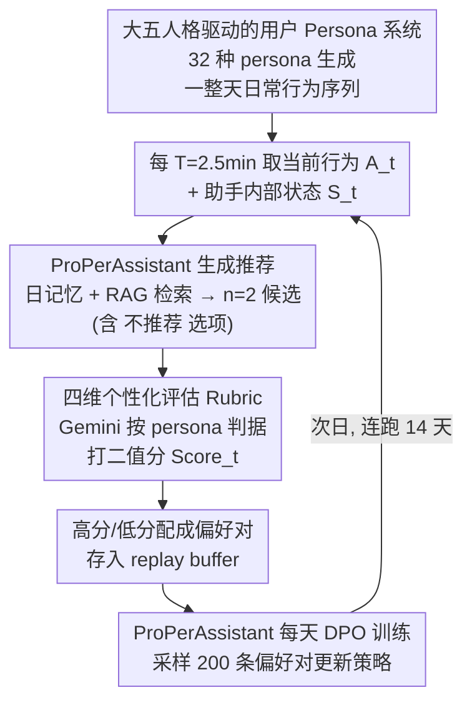

# ProPerSim: Developing Proactive and Personalized AI Assistants through User-Assistant Simulation

**会议**: ICLR 2026  
**arXiv**: [2509.21730](https://arxiv.org/abs/2509.21730)  
**代码**: [GitHub](https://github.com/jiho283/ProPerSim)  
**领域**: 推荐系统  
**关键词**: proactive agent, personalization, user simulation, DPO, Big Five personality, generative agents

## 一句话总结
提出ProPerSim模拟框架，构建基于大五人格的32种用户persona在Smallville家庭环境中的日常行为模拟，AI助手通过每2.5分钟的主动推荐决策和DPO偏好学习，在14天模拟中将用户满意度从2.2/4提升至3.3/4，首次验证了主动性+个性化统一的可行性。

## 研究背景与动机

**领域现状**：LLM助手正从被动应答向主动推荐和个性化两个方向分别演进。Proactive Agent（Lu et al., 2024）探索了主动推荐但不考虑个人偏好，个性化方法（RLHF等）适配用户但仍需用户发起交互。

**现有痛点**：
- 仅有主动性 → 给素食者推荐牛排馆（Figure 1的例子），推荐时机和内容与个人偏好不匹配
- 仅有个性化 → 即使推荐再精准也需要用户主动开口，错过了最佳推荐时机
- 大规模真实行为数据收集面临成本和隐私挑战，真人实验极其昂贵
- 现有proactive研究是事件驱动的（用户做了某action才触发），未探索基于时间的持续监控模式

**核心矛盾**：需要大量用户-助手交互数据来同时学习"何时推荐"和"推荐什么" → 但真实数据收集不可行。

**本文目标** 在模拟环境中统一主动性和个性化，开发能随时间适应个体用户的AI助手。

**切入角度**：用LLM-based user agent（基于大五人格的丰富persona）模拟真实用户行为，在模拟中收集偏好数据做DPO训练。

**核心 idea**：用Generative Agents模拟用户+个性化rubric评估推荐+DPO偏好学习→形成持续改进的proactive+personalized闭环。

## 方法详解

### 整体框架

这篇论文想造一个既"主动"又"懂你"的助手，但真实用户数据收集不起，于是整套系统全跑在模拟里，由三方循环驱动。第一方是基于persona的用户agent，它在Smallville家庭环境里生成一整天的日常行为序列 $\{(A_i, \text{Range}_i)\}$（比如"7:00–7:30 做早餐"）。第二方是AI助手，它每隔 $T=2.5$ 分钟观察当前行为 $A_t$ 和自己的内部状态 $S_t^{(a)}$，决定要不要推荐、推荐什么：$R_t = \mathcal{A}_\theta(A_t, S_t^{(a)})$。第三方是评估器（仍是用户agent的一部分），它按这个persona专属的rubric给刚才那条推荐打分 $\text{Score}_t = \mathcal{E}(P, r, A_t, R_t, S_t^{(u)})$。打出来的分数既是反馈信号、又是训练数据：助手每天把当天攒下的（推荐, 分数）对拿去做一次偏好学习，第二天就更懂这位用户。模拟连跑14天，助手在不接触任何真人的情况下完成"何时推荐 + 推荐什么"的双重适配。

### 关键设计

**1. 大五人格驱动的用户Persona系统：让模拟用户的行为和口味真的因人而异**

如果模拟用户千篇一律，学出来的助手也只会一种套路。论文用心理学里验证最充分的大五人格模型来制造多样性：每个persona由5个维度（Extraversion / Agreeableness / Openness / Conscientiousness / Neuroticism，各取 High/Low）组合，再叠加6个扩展属性（年龄、背景、兴趣、生活方式、日计划需求、长期目标），由GPT-4o生成且要求属性与人格特质自洽，最终得到32种persona。为确认这32个人真的彼此不同，作者用UMAP+HDBSCAN对persona embedding做聚类，验证它们在表征空间里分得开、覆盖面广。人格差异会自然传导到推荐偏好上——低外向性的人偏好独处活动、不爱被频繁打扰，高尽责性的人偏好结构化、有计划的推荐，这正是后面个性化评估要拿捏的东西。

**2. 四维个性化评估Rubric：评分标准既有大众共识、又随persona定制**

助手好不好，全看这把评估的尺子准不准。作者先做了一次353人的AMT大规模调研，从10个候选评估维度里投票筛选，砍掉支持率<50%的Diversity和Interruption，留下四个公认重要的维度：Personal Preference（内容是否对口味）、Frequency（推荐频率是否合适）、Timing（时机是否恰当）、Communication & Safety（沟通风格与安全性）。但光有通用维度还不够个性化，所以每个维度下的具体判据再由GPT-4o按persona量身定制——同样是Frequency维度，低外向性persona的判据会写成"I prefer receiving recommendations no more than once every two hours"，而爱热闹的人门槛就宽得多。实际打分由Gemini 2.0 Flash执行，每个维度给二值评分。这种"大众维度 + 个体判据"的两层结构，让评分既站在共识基础上、又留出了因人而异的空间。

**3. RAG+DPO偏好对齐的ProPerAssistant：助手把每天的打分变成持续进步的训练信号**

前两点搭好了环境和尺子，这一点才是真正会学习的主角。助手的内部状态 $S_t^{(a)}$ 由两部分构成：一是结构化的日记忆（最近10分钟保留完整细节，更早的逐级压缩成1小时、4小时摘要，避免上下文爆炸），二是用OpenAI embedding检索出的top-5条最相似历史交互（RAG），让它能"想起"以前对类似场景的成败。每个时间步它生成 $n=2$ 个候选推荐（其中一个可以是"不推荐"），用户agent打分后，高分项和低分项就配成一个偏好对存进replay buffer。每天结束时从buffer里随机采样200条做一次DPO训练：

$$\mathcal{L}_{\text{DPO}} = -\log\sigma\left(\beta\left(\log\frac{\pi_\theta(y_w|x)}{\pi_{\text{ref}}(y_w|x)} - \log\frac{\pi_\theta(y_l|x)}{\pi_{\text{ref}}(y_l|x)}\right)\right)$$

选DPO而不是完整RLHF，是为了绕开单独训练reward model的麻烦，直接从偏好对里学；replay buffer借的是强化学习经验回放的思路，让助手别只盯着最近几天、把早期经验也复习一遍防止遗忘。把"不推荐"放进候选集这一点尤其关键——它让助手有机会学会"此刻闭嘴"，后面实验里推荐频率从24次/小时降到约6次/小时正是这个机制的功劳。底座是LoRA微调的LLaMA 3.3 70B（4-bit量化），在效果和算力之间取了个能跑得起的平衡。

### 损失函数 / 训练策略

基座模型：LLaMA 3.3 70B（4-bit量化），LoRA微调。DPO训练：每天结束后从累积replay buffer随机采样200条，候选数 $n=2$。模拟设置：时间步 $T=2.5$ 分钟，每个persona前后模拟14天。单persona模拟成本：约10天×1 A100 GPU + ~$30 API费用。

## 实验关键数据

### 主实验——方法对比

| 方法 | Day 1 均分 | Day 14 均分 | 特点 |
|------|-----------|------------|------|
| No Memory | ~2.1 | ~2.2 | 仅当前action |
| AR Memory (A,R) | ~2.3 | ~2.3 | 历史action+推荐 |
| ARS Memory (A,R,Score) | ~2.6 | ~2.5 | 加评分到prompt |
| **ProPerAssistant** | **~2.2** | **~3.3** | DPO偏好学习 |

### Persona维度分析

| 分析维度 | 最佳Persona | 最差Persona | 差异原因 |
|---------|-------------|-------------|---------|
| 最终得分 | 3.8/4 | 2.5/4 | 偏好复杂度差异 |
| 偏好特征 | 简单哲学/创意类 | 数据驱动/辩论类 | 后者需多维匹配 |
| 时间窗口 | 灵活 | 严格(6-9AM/21:00+) | 窄窗口更难适应 |

### 关键发现
- ProPerAssistant从Day 2开始快速上升并保持领先，日均分接近3.4/4，证明DPO偏好学习远优于in-context reward信号（ARS Memory）
- 推荐频率从初始24次/小时降至约6次/小时→学会了"不推荐"同样重要
- 成功推荐率（score≥3的推荐占比）从51.06%→71.51%
- 低外向性persona改善更多（家庭场景匹配独处偏好），低开放性persona也改善更多（偏好一致性推荐更容易学习）
- Frequency和Timing维度改善最显著，Personal Preference改善较平——因为推荐总数下降，high-quality推荐占比实际提升（0.77→0.83）
- 人类评估确认高质量：行为自然度8.25/10，persona一致性8.02/10，评估合理率90.54%

## 亮点与洞察
- **首创主动性+个性化统一框架**：填补了两个独立研究方向的空白，定义了proactive+personalized的新任务形态
- **时间驱动 vs 事件驱动的主动性**：每 $T$ 时间步决策更接近真实助手的持续监控模式，比事件驱动更自然
- **DPO >> in-context reward**：ARS Memory直接把分数放到prompt里但效果远不如DPO训练——显式偏好学习是必要的，in-context reward信号不足以驱动真正的适应
- **"不推荐"是关键能力**：助手学会抑制推荐（频率下降4×）与推荐内容质量提升同等重要

## 局限与展望
- 计算成本极高（单persona 10天A100+$30 API），32个persona的完整实验约320天GPU时
- 用户行为和评估均基于LLM模拟而非真人——模拟与真实行为的差距未被量化
- 仅限家庭场景（Smallville house），未扩展到工作、社交、户外等场景
- DPO候选数n=2受限于成本，更多候选可能提供更丰富的偏好信号
- 仅优化即时reward，未考虑延迟reward（如长期满意度、推荐多样性）

## 相关工作与启发
- **vs Proactive Agent (Lu et al., 2024)**：Lu的工作用6790训练事件训练主动agent但不考虑个人偏好差异；ProPerSim通过persona驱动的模拟实现个性化
- **vs Generative Agents (Park et al., 2023)**：Park的25个agent做社会模拟；ProPerSim将generative agent框架扩展到用户-助手交互模拟，增加了评估维度和偏好学习
- **vs 个性化RLHF**：传统个性化通过一次性对齐完成；ProPerAssistant通过日累积replay buffer实现持续适应

## 评分
- 新颖性: ⭐⭐⭐⭐ 主动+个性化统一是有意义的新方向，模拟框架设计完整
- 实验充分度: ⭐⭐⭐⭐ 32 persona、4基线、人格维度分析、人类评估——但缺乏真人验证
- 写作质量: ⭐⭐⭐⭐ 框架描述清晰，评估设计系统，persona示例丰富
- 价值: ⭐⭐⭐⭐ 为个人助手研究提供有价值的模拟平台和基线

<!-- RELATED:START -->

## 相关论文

- [\[ACL 2026\] Learning to Retrieve User History and Generate User Profiles for Personalized Persuasiveness Prediction](../../ACL2026/recommender/learning_to_retrieve_user_history_and_generate_user_profiles_for_personalized_pe.md)
- [\[ICLR 2026\] Low-pass Personalized Subgraph Federated Recommendation](low-pass_personalized_subgraph_federated_recommendation.md)
- [\[ICLR 2026\] More Than What Was Chosen: LLM-based Explainable Recommendation Beyond Noisy User Preferences](more_than_what_was_chosen_llm-based_explainable_recommendation_beyond_noisy_user.md)
- [\[ICLR 2026\] iFusion: Integrating Dynamic Interest Streams via Diffusion Model for Click-Through Rate Prediction](ifusion_integrating_dynamic_interest_streams_via_diffusion_model_for_click-throu.md)
- [\[ICLR 2026\] Beyond Markovian Drifts: Action-Biased Geometric Walks with Memory for Personalized Summarization](beyond_markovian_drifts_action-biased_geometric_walks_with_memory_for_personaliz.md)

<!-- RELATED:END -->
