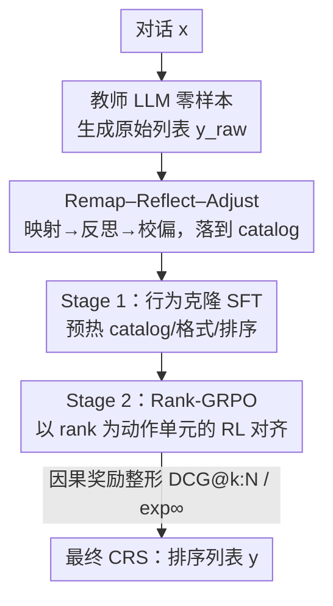

# Rank-GRPO: Training LLM-based Conversational Recommender Systems with Reinforcement Learning

**会议**: ICLR 2026  
**OpenReview**: [https://openreview.net/forum?id=Xgw2D9cALS](https://openreview.net/forum?id=Xgw2D9cALS)  
**代码**: https://github.com/yaochenzhu/Rank-GRPO  
**领域**: 推荐系统 / 对齐RLHF / LLM推理  
**关键词**: 对话推荐, GRPO, 强化学习对齐, 排序奖励, 行为克隆

## 一句话总结
本文提出 ConvRec-R1 两阶段框架训练 LLM 对话推荐系统：先用 Remap–Reflect–Adjust 蒸馏管线从黑盒教师造出「落在目标 catalog 内」的高质量演示做 SFT 预热，再用 Rank-GRPO（把推荐列表中的「每个 rank」当作动作单元的 GRPO 改造）做 RL 对齐，让 0.5B–3B 的小模型在 REDDIT-V2 上的 Recall/NDCG 收敛更快、并能追平甚至超过 GPT-4o。

## 研究背景与动机
**领域现状**：对话推荐（CRS）正在从「被动预测用户行为」转向「主动 agent 通过对话理解偏好并推荐」。主流做法是用 LLM 直接以自然语言（电影标题+年份）而非 item ID token 输出推荐列表，这样既保留 LLM 的语言能力，又能用语言灵活引导新颖性、多样性等推荐目标。

**现有痛点**：把预训练 LLM 直接对齐到真实推荐任务有三个具体毛病：① 模型不知道某个平台的具体 item 目录（catalog），零样本时频繁生成「目录外（out-of-catalog, OOC）」甚至根本不存在的条目；② 不遵守规定的输出格式（如缺少年份），导致下游 item 匹配困难；③ 生成列表的排序质量**越到列表尾部越差**，因为预训练阶段缺少高质量的排序式数据。这些问题对工业界常用的小模型尤其严重。

**核心矛盾**：RLVR（可验证奖励强化学习）本是对齐的好方向，但落到 CRS 上有两个根本不匹配。一是 RL 需要一个 warm-start 的行为克隆阶段，但「让人工标注大规模、落在动态 catalog 内、且排序良好的 item 列表」基本不可行；二是 GRPO 这类主流算法是「基于序列级奖励做 token 级更新」，而推荐是**排序结构输出**——序列级奖励（如整张列表的 NDCG）太粗、抓不住单个 item 的贡献，token 级更新又太细（一个 item 是多个 token）。这种错配导致**非因果的信用分配**、重要性权重失配、训练不稳。

**本文目标**：① 不靠人工，自动造出落在 catalog 内的高质量排序演示；② 设计一个真正匹配「排序式输出」的 RL 对齐算法。

**切入角度**：作者观察到推荐列表的自然「动作单元」既不是 token 也不是整条序列，而是 **rank（列表中的每一位）**；同时 DCG@N 这类序列奖励其实可以拆成「按 rank 折扣的逐项奖励之和」，于是非因果的部分可以被显式 mask 掉。

**核心 idea**：用「教师蒸馏 + catalog 对齐」造 SFT 数据预热，再把 GRPO 的更新粒度从 token/序列改造到 **rank 级**——rank 级优势、rank 级重要性比、因果 reward masking，从而对齐排序任务。

## 方法详解

### 整体框架
ConvRec-R1 把对话推荐建模成「给定对话 $x$，策略 $\pi_\theta(y|x)$ 自回归生成一个 $N$ 项的排序列表 $y=(y^{(1)},\dots,y^{(N)})$，每个 item 是一段自然语言 token 序列，且应落在 catalog $\mathcal{C}$ 内」。整条管线分两阶段：Stage 1 用 Remap–Reflect–Adjust 从黑盒教师（GPT-4o）造演示数据 $\mathcal{D}_{\text{SFT}}$，做行为克隆把策略预热到「认识 catalog、格式正确、有初步排序能力」；Stage 2 在此基础上用 Rank-GRPO，以用户反馈（哪些 item 得到正反馈）作为可验证奖励做 RL 对齐，重点修复列表尾部质量。

### 关键设计

**1. Remap–Reflect–Adjust：把黑盒教师的推荐「落地」到目标 catalog**

痛点是「没人能手工标出大规模、在 catalog 内、排序还好的演示」。作者让教师 LLM 先零样本生成原始列表 $y_{\text{raw}}^{\text{SFT}}$，但它落在教师自己的推荐空间 $\mathcal{C}_\Theta$ 里，可能含 OOC item、格式不一致、带教师偏见。于是用三步把它校正成 catalog 上的打分向量 $s_{\text{final}}\in\mathbb{R}^{|\mathcal{C}|}$，再取 top-$N$ 当演示：

- **Remap（映射）**：把教师空间的分数搬到 catalog 空间，$s_{\text{remap}} = p\cdot(S_{\text{item-item}} + I_{ic}) + \lambda\cdot s_{\text{conv-item}}$。其中 $p$ 是稀疏位置分（rank $k$ 的 item 取 $1/\sqrt{k}$），$S_{\text{item-item}}$ 按语义相似度把教师 item 映到 catalog，$I_{ic}$ 是「同名 item 直接转移」的指示矩阵，$s_{\text{conv-item}}$ 编码对话与 catalog item 的内容相似度。
- **Reflect（反思）**：对 top-$N_r>N$ 的候选用「LLM-as-a-judge」让同一个教师在 $-L$ 到 $+L$ 上打分，归一化成 $r_{\text{reflect}}$ 后叠加，$s_{\text{reflect}} = s_{\text{remap}} + \gamma\cdot r_{\text{reflect}}$，提升上下文相关性。
- **Adjust（校偏）**：学一组乘性/加性偏置对齐训练集真实 item 的经验分布，$s_{\text{final}} = w\odot s_{\text{reflect}} + b$，纠正教师残留的流行度偏差。

最终演示 $y^{\text{SFT}}$ 拿去做行为克隆，目标是最小化负对数似然 $L_{\text{SFT}}(\theta) = -\mathbb{E}[\log\pi_\theta(y^{\text{SFT}}|x^{\text{SFT}})]$。它的价值在于：不靠人工就给出了「在 catalog 内、格式正确、排序合理」的演示，让 RL 的自探索更高效稳定。

**2. Rank-GRPO：把动作单元从 token / 序列改成 rank**

这是全文核心。vanilla GRPO 的梯度（式 4）是「token 级重要性比 × 序列级优势 × token 级梯度」，对排序任务有两处错配：序列级奖励被均匀摊到每个 token，导致后面 rank 的 token 继承了前面 rank 的信用（**非因果**）；off-policy 时 token 级重要性比又太细、与序列级优势对不上。Rank-GRPO 的洞察是把**每个 rank 当成一个动作单元**，既不像 token 那么细、也不像整条序列那么粗。

它在同样的 $G$ 条轨迹上做 rank 级优势估计，把复杂度从指数降到线性。目标是 $J_{\text{Rank-GRPO}}(\theta)=\mathbb{E}\big[\frac{1}{GN}\sum_i\sum_k \min(w_{i,k}\hat A_{i,k},\,\mathrm{clip}(w_{i,k},1-\epsilon,1+\epsilon)\hat A_{i,k})\big]$。其中 rank 级优势 $\hat A_{i,k}$ 用同一 rank 在组内的相对回报标准化得到；rank 级重要性比定义为该 rank 所有 token 概率的**几何平均**：

$$\bar\pi_\theta(y_i^{(k)}|x) = \Big(\prod_{t=1}^{|y_i^{(k)}|}\pi_\theta(y_{i,k,t}|x,y_{i,k,<t})\Big)^{1/|y_i^{(k)}|},\quad w_{i,k}(\theta)=\frac{\bar\pi_\theta(y_i^{(k)}|x)}{\bar\pi_{\theta_{\text{old}}}(y_i^{(k)}|x)}.$$

几何平均的关键作用是**消掉 item 间 token 长度的差异**，让长短不一的 item 有可比、稳定的重要性权重。改造后的梯度（式 7）变成「rank 级重要性比 × rank 级优势 × rank 级平均梯度」，三者粒度统一，从根上修掉了非因果信用与权重失配。和 GSPO（用序列级重要性权重）相比，Rank-GRPO 进一步把单元细化到 rank，更贴合排序任务。

**3. 因果 reward shaping：DCG@k:N 与指数衰减回报**

痛点是 DCG@N 给 rank $k$ 的 item 既算了它自己和后面的贡献，也算了**前面 rank 的贡献**——这在尾部尤其糟（尾部质量本就差，却白白继承了前排好推荐的信用）。作者利用 DCG 可拆成逐 rank 折扣项之和的性质（式 5），把「非因果部分」直接 mask 掉，只保留因果部分：

$$r(x,y_i^{(k)}) \triangleq \text{DCG@}k{:}N = \sum_{j=k}^{N}\frac{\text{rel}_j}{\log_2(j+1)},$$

其中 $\text{rel}_k=1$ 当且仅当 rank $k$ 的 item 在 ground-truth 集且未在更前排出现过，否则为 0（重复、不相关、OOC 都记 0）。作者进一步给出指数衰减变体 $r_{\exp\Gamma}(x,y_i^{(k)})=\sum_{j=k}^N \text{rel}_j/\Gamma^{(j-k)}=\text{rel}_k+\frac{1}{\Gamma}r_{\exp\Gamma}(x,y_i^{(k+1)})$，$\Gamma>1$ 控制折扣；当 $\Gamma=\infty$ 时只算当前 item 自身相关性，实践中这个 $\exp\infty$ 变体最简单、稳定且有效（因为推荐生成的主要依据应是用户 query 而非已生成的高排位 item）。此外加两个指令遵循惩罚：生成不足 $N$ 项时提前 `<eos>` 给负惩罚 $\epsilon_o$，超过 $N$ 项的溢出 item 也给负惩罚。

### 损失函数 / 训练策略
Stage 1 用式 (2) 的负对数似然做行为克隆；RRA 只对 25% 训练集 + 全部验证集构造演示。Stage 2 用式 (6) 的 Rank-GRPO 目标，省略了与 SFT 基策略的 KL 项书写。骨干用 Qwen2.5-0.5B / Llama-3.2-1B / Llama-3.2-3B（>3B 延迟过高不利部署）；off-policy 设 $\mu=2$（每采样更新 2 步）。作者特意取过拟合一点的 1500 步 SFT checkpoint 起 RL，以保留更强的 catalog 记忆。

## 实验关键数据

### 主实验
REDDIT-V2（最大的可支撑 LLM 后训练的公开 CRS 基准，383k 训练对话），要求同时输出标题+年份。R@k=Recall@k，N@k=NDCG@k。

| 方法（骨干 Qwen2.5-0.5B 起） | R@5 | R@20 | N@5 | N@20 |
|------|------|------|------|------|
| GPT-4o-mini (zero-shot) | 0.0949 | 0.1687 | 0.0747 | 0.0973 |
| GPT-4o (zero-shot) | 0.1106 | 0.2147 | 0.0861 | 0.1197 |
| CRAG (GPT-4o, 5–7 次调用) | 0.1146 | 0.2212 | 0.0885 | 0.1227 |
| Qwen0.5B + SFT | 0.0642 | 0.1308 | 0.0502 | 0.0704 |
| Qwen0.5B + SFT + Vanilla GRPO | 0.0834 | 0.1803 | 0.0651 | 0.0945 |
| Qwen0.5B + SFT + Rank-GRPO (exp∞) | 0.0946 | 0.2047 | 0.0744 | 0.1079 |
| **Llama-3B + SFT + Rank-GRPO (exp∞)** | **0.1178** | **0.2368** | **0.0919** | **0.1283** |

关键结论：0.5B 模型经 ConvRec-R1 即超过 GPT-4o-mini；1B 追平 GPT-4o；3B 在 Recall/NDCG@20 上**超过 GPT-4o 和 CRAG**，而后者每次推荐要 5–7 次 GPT-4o API 调用，成本/延迟高得多。Rank-GRPO(exp∞) 一致优于 Vanilla GRPO 和 Rank-GRPO(log)。

### 消融实验

| 配置（Qwen0.5B） | R@5 | N@20 | 说明 |
|------|------|------|------|
| SFT（完整 RRA） | 0.0642 | 0.0704 | 行为克隆基线 |
| – 去 remap-reflect | 0.0579 | 0.0637 | 去掉映射+反思，catalog grounding 变弱 |
| – 去 reflect | 0.0623 | 0.0698 | 去反思，大 k 处排序质量下降 |
| SFT + Rank-GRPO (exp∞) | 0.0946 | 0.1079 | 完整模型 |
| – 去 SFT 阶段 (R1-zero) | 0.0440 | 0.0431 | 直接 RL，全面崩塌 |

### 关键发现
- **SFT 不可或缺**：去掉 SFT 直接做 RL（R1-zero）性能腰斩（R@5 0.0946→0.0440）；SFT 把 in-catalog 比例迅速拉到 99%+，NDCG@20 相对零样本提升 30×/3×/1.5×（0.5B/1B/3B）。
- **Rank-GRPO 的增益集中在列表尾部**：前排 reward 与 GRPO 几乎相同（rank 1 的奖励本就一致），改进随 $k$ 增大累积；exp∞ 变体在高排位提升显著。
- **训练动态像「检索后重排」**：exp∞ 下，低排位（15/20）item 的相关性先升后降、高排位（1/2/5）单调上升——相关 item 先被纳入列表、再被奖励推到高位。
- **remap 比 reflect 更关键**：去 remap 掉点更狠（伤 catalog grounding），去 reflect 主要伤大 k 的排序质量。

## 亮点与洞察
- **「rank 才是排序任务的自然动作单元」**：在 token（太细）与序列（太粗）之间找到 rank 这个中间粒度，让优势、重要性比、梯度三者粒度统一——这是把 GRPO 迁到任何「列表/排序式生成」任务的可复用思路。
- **几何平均重要性比**：用 rank 内 token 概率的几何平均消除 item 长度差异，是稳定多 token item 重要性权重的巧妙 trick，可迁移到任何「变长子序列当动作」的 RL。
- **把奖励拆成因果/非因果两半再 mask**：从 DCG 的可分解性出发，显式去掉非因果信用，直击「尾部白嫖前排信用」的病根，比笼统加正则更有解释性。
- **小模型追平大模型**：properly aligned 的 0.5B–3B 开源模型能匹配/超越 GPT-4o，对工业低延迟部署是强信号。

## 局限与展望
- 作者承认 reward shaping 还很初级，sliding-window 等更复杂的回报约束留作未来工作。
- 主实验只在 REDDIT-V2（电影域）+ REDIAL（附录），未验证跨品类/跨平台 catalog 的泛化。
- 依赖一个强黑盒教师（GPT-4o）造 SFT 数据，教师不可得或弱时管线质量存疑；RRA 还需 item-item 相似度矩阵、对话-item 相似度等额外组件。
- $\Gamma=\infty$ 被报告为最优，意味着「已生成高排位 item 对后续的因果影响」几乎被丢弃——这与「自回归生成」的直觉略有张力，值得进一步分析。

## 相关工作与启发
- **vs Vanilla GRPO**：GRPO 做 token 级更新 + 序列级奖励，在排序任务上非因果且权重失配；本文把单元改到 rank，全表一致更优。
- **vs GSPO**：GSPO 用序列级重要性权重缓解 off-policy 失配，但对排序任务仍太粗（应以 rank 为单元）；Rank-GRPO 把粒度进一步细到 rank。
- **vs CRAG / GPT-4o 提示式方法**：它们靠多次黑盒调用做抽取+反思+重排，成本延迟高；本文让单个小开源模型一次生成即达到/超过其质量。
- **vs ID-token 式 LLM 推荐**：早期把 item ID 嵌入词表，本文延续「自然语言表示 item」路线，保留语言能力且便于多目标引导。

## 评分
- 新颖性: ⭐⭐⭐⭐⭐ 「rank 作为动作单元」+ 因果 reward masking 是对 GRPO 在排序任务上的原理性改造，定位清晰。
- 实验充分度: ⭐⭐⭐⭐ 三骨干 + 多基线 + 消融 + 训练动态分析扎实，但域较单一（电影）。
- 写作质量: ⭐⭐⭐⭐⭐ 梯度分析推导清楚，痛点→机制→效果一气呵成。
- 价值: ⭐⭐⭐⭐⭐ 让小模型在 CRS 上追平 GPT-4o，且方法可迁到一切排序式生成 RL。

<!-- RELATED:START -->

## 相关论文

- [\[ICLR 2026\] Continual Low-Rank Adapters for LLM-based Generative Recommender Systems](continual_low-rank_adapters_for_llm-based_generative_recommender_systems.md)
- [\[ICLR 2026\] Token-Efficient Item Representation via Images for LLM Recommender Systems](token-efficient_item_representation_via_images_for_llm_recommender_systems.md)
- [\[AAAI 2026\] RecToM: A Benchmark for Evaluating Machine Theory of Mind in LLM-based Conversational Recommender Systems](../../AAAI2026/recommender/rectom_a_benchmark_for_evaluating_machine_theory_of_mind_in_llm-based_conversati.md)
- [\[ICLR 2026\] Reinforced Latent Reasoning for LLM-based Recommendation](reinforced_latent_reasoning_for_llm-based_recommendation.md)
- [\[ICLR 2026\] On the Mechanisms of Collaborative Learning in VAE Recommenders](on_the_mechanisms_of_collaborative_learning_in_vae_recommenders.md)

<!-- RELATED:END -->
