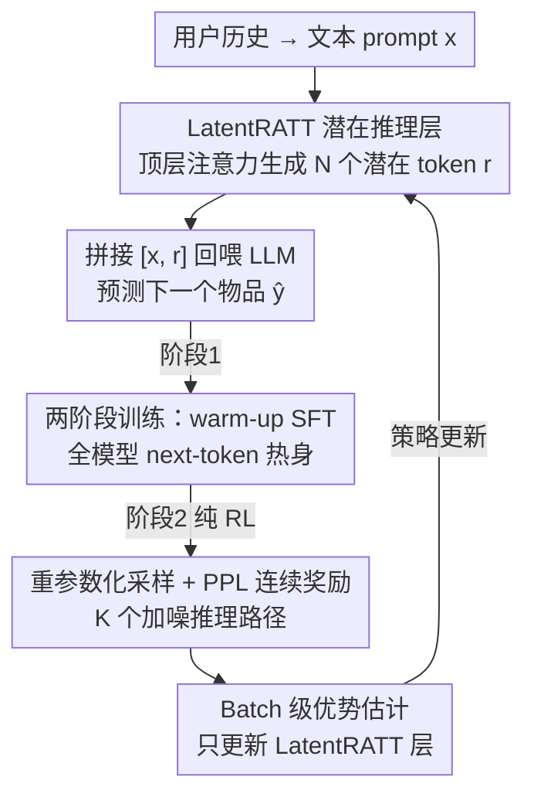

# Reinforced Latent Reasoning for LLM-based Recommendation

**会议**: ICLR 2026  
**OpenReview**: [https://openreview.net/forum?id=eUtIZT2ONS](https://openreview.net/forum?id=eUtIZT2ONS)  
**代码**: [https://github.com/xuwenxinedu/R3](https://github.com/xuwenxinedu/R3)  
**领域**: LLM推荐 / 潜在推理 / 强化学习  
**关键词**: 潜在推理, LLM 推荐, GRPO, 强化学习, 推理效率

## 一句话总结
针对 LLM 推荐中显式思维链（CoT）既难拿到监督数据、推理又慢的痛点，本文提出 LatentR3：在 LLM 顶层加一个注意力层把推理压进**连续潜在空间**（只需 1 个潜在 token），再用一套改造过的 GRPO（PPL 连续奖励 + batch 级优势）在完全没有 CoT 监督的情况下端到端学会推理，套在 BIGRec / D3 上分别带来 17.0% / 8.4% 的相对提升。

## 研究背景与动机
**领域现状**：把 LLM 的推理能力迁到推荐里是当下的热点——推荐的本质是从用户历史行为里"推断"出隐含偏好，这和 LLM 擅长的链式推理天然契合。主流做法沿用通用领域的套路：用显式的思维链（CoT）文本数据去微调模型，让它先"想一段"再给推荐。

**现有痛点**：这条显式 CoT 路线在推荐场景里有两个硬伤。其一是**推理太慢**：推理时要自回归地生成一长串 CoT 文本，延迟和算力开销在真实推荐系统里几乎不可接受（论文测得显式 CoT 在 Toys 上让推理成本涨了约 25 倍、Games 上近 30 倍）。其二是**拿不到监督数据**：推荐里的用户反馈只有最终的点击/购买结果，根本没有"用户当时怎么想的"这种推理过程标注；偏好又高度主观、个性化，人工标注或合成 CoT 既贵又不可靠。

**核心矛盾**：显式 CoT 把"推理"绑死在了自然语言文本上——既要为这串文本付出生成延迟，又要为训练它去凑根本不存在的 CoT 标注。

**本文目标**：能不能在**训练和推理两端都不要显式 CoT**，又同时释放 LLM 的推理潜力？

**切入角度**：作者把推理从自然语言空间挪到 LLM 的**隐状态（潜在）空间**。隐状态的信息密度远高于离散文本 token，因此寥寥几个（实验里 1 个就够）潜在 token 就能编码整个推理过程，既省去文本生成、又大幅降延迟。但已有的潜在推理方法（如 Coconut）仍要靠 CoT 数据蒸馏来学，不满足"零 CoT"的要求。

**核心 idea**：用**强化学习**从最终用户反馈这一个弱信号里，端到端地学出潜在推理——不靠任何 CoT 监督，仿照 DeepSeek-R1 先 SFT 热身再纯 RL 探索，并把 GRPO 改造得更适配连续潜在空间。

## 方法详解

### 整体框架
LatentR3 要解决的是"无 CoT 监督下学会潜在推理"，它由两块拼成：**架构侧**在 LLM 顶层加一个 LatentRATT 注意力层，专门把上下文聚合成连续的潜在推理 token；**学习侧**用两阶段策略——先监督热身、再纯 RL 探索——把这个推理层训出真正的推理能力。

推理流程是：用户历史被拼成文本 prompt $x$ 输入 LLM；LatentRATT 自回归地生成 $N$ 个潜在推理 token $r=[r_1,\dots,r_N]$（每个 $r_i\in\mathbb{R}^d$，落在 LLM 的输入 embedding 空间里）；把 $x$ 和 $r$ 拼起来重新喂回 LLM，预测下一个物品 $\hat y$。训练时第一阶段对全模型做 SFT 热身，第二阶段冻住 LLM、只用改造版 GRPO（论文称 LR-GRPO）调 LatentRATT 层。

### 关键设计

**1. LatentRATT 潜在推理层：用一个专门的注意力层"生产"潜在思考**

痛点是：以往的潜在推理直接拿 LLM 解码层的隐状态当"思考 token"，但这些隐状态是为预测下一个文本 token 服务的，并不天然适配"被当作输入再喂回去"，对齐得也不好。本文在 LLM 最后一层解码层之上**额外加一个注意力层** LatentRATT，让它扮演两个角色：一是当"推理 token 生成器"，把上下文信息聚合成连贯的潜在思考；二是把这些潜在 token 对齐到 LLM 的输入 embedding 空间，使其能被无缝拼回去。生成第 $i$ 个潜在 token 时，先把 $x$ 和已生成的 $r_1,\dots,r_{i-1}$ 一起输入 LLM 拿到末层隐状态序列 $H_{i-1}=\text{LLM}_{-1}(x,r_1,\dots,r_{i-1})$，再过 LatentRATT 取末位输出作为下一个潜在 token：$r_i=\text{LatentRATT}(H_{i-1})[-1]$。$N$ 是控制推理长度的超参，框架下 $N=1$ 就能取得很强效果——这正是低延迟的来源。消融里去掉 LatentRATT（直接用末层隐状态）在 CDs 上甚至比完全不推理还差，印证了"专门的对齐层"不可或缺。

**2. 两阶段训练：先 SFT 热身，再纯 RL 探索**

直接从零做 RL 在潜在推理这种**高维连续空间**里极不稳定、容易崩溃。本文仿照 DeepSeek-R1 用两阶段缓解：第一阶段 **Warm-up SFT**，用标准 next-token 预测目标微调全模型，给推理层一个有意义的初始化，目标为 $L_{\text{warm}}=-\sum_{(x,y)\in D}\sum_{i=1}^{|y|}\log P_\theta(y_i\mid x,r,y_{<i})$，其中 $\theta$ 同时包含原 LLM 和 LatentRATT 的参数。第二阶段以 SFT 结果为起点做**纯 RL**，鼓励模型跳出"只拟合数据"去探索更优的推理路径。SFT 单独跑（w/o RL）已经好过完全不推理，但仍明显逊于加了 RL 的完整方法——说明 SFT 只是"启动器"，真正把潜在推理能力磨出来要靠 RL。

**3. PPL 连续奖励 + 重参数化采样：让 RL 既能在连续空间采样、又不必为每条路径解码答案**

潜在推理是连续向量，没法像离散文本那样直接采样，本文用**重参数化技巧**：把生成的潜在向量 $r$ 当作高斯分布的均值，第 $k$ 条采样为 $r_k=r+\epsilon,\ \epsilon\sim\mathcal N(0,\sigma^2)$（$\sigma$ 控噪声强度，并保留原始 $r$ 作第 1 条样本），一次为每个样本拉出 $K$ 条不同方向的推理。奖励设计是另一处关键省钱点：原版 GRPO 要对每条采样**自回归解码出完整答案**再打分，代价高昂；本文改用模型对真值答案的**困惑度（PPL）**当代理奖励——把 prompt、采样潜在向量、真值答案拼在一起，算预测真值 token 的负困惑度作奖励 $s_k=-\exp\!\big(-\tfrac{1}{|y|}\sum_{i=1}^{|y|}\log\pi_\theta(y_i\mid x,r_k,y_{<i})\big)$。这样既免去解码、又把离散奖励变成**连续信号**，提供更细腻的学习反馈。

**4. Batch 级优势估计：连续奖励下避免"整组都烂也给正优势"**

原版 GRPO 用**组内平均**奖励当基线算优势。但在连续奖励下这会出问题：哪怕一整组采样的推理质量都很低，组内相对比较仍可能给出正优势，产生不可靠的信号。本文改成拿**batch 级平均**奖励当基线：$A_k=\dfrac{s_k-\bar s_{\text{batch}}}{\lVert S_{\text{batch}}-\bar s_{\text{batch}}\rVert}$，其中 $\bar s_{\text{batch}}=\tfrac{1}{N_{\text{group}}}\sum_{S\in S_{\text{batch}}}s_1$，即对每组取第 1 条（未加噪的原始推理）的奖励在整个 batch 上求平均。策略更新沿用 GRPO 目标，但**只更新 LatentRATT 层、冻结原 LLM**，于是 KL 正则项 $D_{KL}(\pi_\theta\|\pi_{\text{ref}})$ 退化为零，进一步省算力。消融中把 batch 优势换回组内优势（w/o Batch Advantage）结果与"只 SFT"相当甚至更差，说明这一改造对连续奖励下的 RL 稳定性是必要的。

### 损失函数 / 训练策略
- **阶段一（SFT）**：全模型 next-token 预测，$L_{\text{warm}}$ 如上。
- **阶段二（LR-GRPO）**：目标 $L_{\text{GRPO}}=\sum_{(x,y)}-\tfrac{1}{K}\sum_{k=1}^{K}\tfrac{1}{|y|}\sum_{i=1}^{|y|}\tfrac{\pi_\theta(y_i\mid x,r_k,y_{<i})}{\pi_{\text{old}}(y_i\mid x,r_k,y_{<i})}A_k-\beta D_{KL}(\pi_\theta\|\pi_{\text{ref}})$，因冻结 LLM、只调 LatentRATT，KL 项为零。
- 潜在推理长度 $N$ 实验取 1；可套在 BIGRec、D3 等不同 LLM 推荐基座上。

## 实验关键数据

### 主实验
四个 Amazon 子集（Toys / CDs / Games / Instruments），指标 HR@5/10、NDCG@5/10。把 LatentR3 分别套在 BIGRec 和 D3 上，与传统序列模型（Caser/GRU4Rec/SASRec）及 LLM 基线（Base、CoT、AlphaRec、BIGRec、D3）对比。

| 数据集 | 指标 | BIGRec | +LatentR3 | D3 | +LatentR3 |
|--------|------|--------|-----------|------|-----------|
| Toys | H@5 | 0.0701 | 0.0821 | 0.0830 | **0.0898** |
| Toys | N@5 | 0.0508 | 0.0600 | 0.0610 | **0.0670** |
| CDs | H@5 | 0.0757 | 0.0934 | 0.1122 | **0.1137** |
| Games | H@5 | 0.0461 | 0.0580 | 0.0608 | **0.0716** |
| Instruments | H@5 | 0.0938 | 0.1029 | 0.0984 | **0.1066** |

套上 LatentR3 后 BIGRec 平均相对提升 **17.0%**、D3 提升 **8.4%**，且增强后均超过当前 SOTA 的 AlphaRec。值得注意的是，不微调直接用 LLM（Base）甚至加显式 CoT，效果都明显差于传统模型——印证"必须把 LLM（含其推理能力）显式对齐到推荐任务"这一点。

### 消融实验

| 配置 | Toys H@5 | CDs H@5 | 说明 |
|------|----------|---------|------|
| LatentR3（完整） | 0.0821 | 0.0934 | 完整模型 |
| w/o Reasoning | 0.0701 | 0.0757 | 去掉潜在推理，退回基座 |
| w/o LatentRATT | 0.0772 | 0.0705 | 直接用末层隐状态，CDs 上还不如不推理 |
| w/o RL（只 SFT） | 0.0804 | 0.0830 | 只热身，明显逊于加 RL |
| w/o Batch Advantage | 0.0812 | 0.0828 | 换回组内优势，CDs 上甚至更差 |

### 关键发现
- **LatentRATT 贡献最关键**：去掉它在 CDs 上掉到 0.0705，比完全不推理（0.0757）还低，说明"专门生成且对齐输入空间的潜在 token"才是有效推理的前提。
- **RL 不可省**：只 SFT 已超过不推理，但完整方法靠 RL 又显著拉高一截；batch 优势是连续奖励下 RL 稳定的必要条件。
- **难样本收益更大**：在长尾（不流行）物品上的相对提升远大于流行物品（如 Toys 上 H@10 流行组 +26.1%、长尾组 +13.5%；多数数据集长尾增益更突出），说明推理对"更难推的场景"更有用。
- **效率优势显著**：只用 1 个潜在 token，推理成本接近无推理基线，而显式 CoT 成本暴涨 25~30 倍。

## 亮点与洞察
- **把"推理省钱"做到两端**：不仅推理时只需 1 个潜在 token，训练时还用 PPL 代理奖励免掉了 GRPO 的自回归解码——这是个能迁移到其他"采样代价高"的 RL 微调场景的实用 trick。
- **从离散到连续的 GRPO 改造很干净**：重参数化采样 + 连续 PPL 奖励 + batch 级优势三件套，针对性地解决了"连续空间无法离散采样"和"组内基线在连续奖励下失真"两个真实问题，思路清晰。
- **冻结 LLM 只调一个薄层**：让 KL 项自然归零，既省算力又稳，是把大模型当"冻结骨干 + 可训练推理头"的好例子。

## 局限与展望
- **潜在推理不可解释**：作者自己承认无法像显式 CoT 那样直接展示"为什么推理有效"，只能用长尾增益做间接佐证。
- **奖励是代理而非真目标**：PPL 只是真值物品的困惑度代理，与真实推荐效用（排序/点击）之间可能存在 gap，极端情况下可能被 PPL 误导。
- **评测局限于 Amazon 域**：主实验集中在四个 Amazon 子集与 BIGRec/D3 两个基座，更大规模工业场景、更多基座的稳健性仍待验证。
- **$N$ 的天花板未充分探索**：实验里 $N=1$ 已够好，但更复杂任务是否需要更长潜在推理、长度与收益如何 scale，正文只做了有限分析。

## 相关工作与启发
- **vs 显式 CoT 推荐（如 Tsai et al.）**：他们靠生成自然语言推理链并需 CoT 监督，本文把推理压进潜在空间且零 CoT 监督，推理成本低一两个量级。
- **vs Coconut 等通用潜在推理**：同样在隐空间推理，但 Coconut 仍要靠 CoT 蒸馏来学，本文用 RL 从最终反馈端到端学出，摆脱了对 CoT 数据的依赖。
- **vs DeepSeek-R1 / R1-Zero**：借鉴了"两阶段（SFT 热身 + 纯 RL）"和"无 CoT 靠 RL 学推理"的范式，但把对象从显式文本推理换成连续潜在推理，并相应改造了 GRPO 的采样、奖励与优势。
- **vs Rec-R1**：同为无 CoT 的 RL 推荐，但 Rec-R1 学的是 query 改写/摘要，本文学的是通用偏好推理。

## 评分
- 新颖性: ⭐⭐⭐⭐ 把潜在推理 + 无 CoT RL 引入推荐，并对 GRPO 做了适配连续空间的成套改造，组合很新。
- 实验充分度: ⭐⭐⭐⭐ 四数据集、两基座、完整消融 + 长尾/效率/推理长度分析，较扎实；但局限于 Amazon 域。
- 写作质量: ⭐⭐⭐⭐ 动机—架构—学习算法的逻辑清晰，公式完整。
- 价值: ⭐⭐⭐⭐ 低延迟、零 CoT 监督的特性对真实推荐部署很有吸引力，且可插拔到现有 LLM 推荐方法。

<!-- RELATED:START -->

## 相关论文

- [\[ICLR 2026\] In Agents We Trust, but Who Do Agents Trust? Latent Source Preferences Steer LLM Generations](in_agents_we_trust_but_who_do_agents_trust_latent_source_preferences_steer_llm_g.md)
- [\[ACL 2026\] ReRec: Reasoning-Augmented LLM-based Recommendation Assistant via Reinforcement Fine-tuning](../../ACL2026/recommender/rerec_reasoning-augmented_llm-based_recommendation_assistant_via_reinforcement_f.md)
- [\[NeurIPS 2025\] Think before Recommendation: Autonomous Reasoning-enhanced Recommender](../../NeurIPS2025/recommender/think_before_recommendation_autonomous_reasoning-enhanced_recommender.md)
- [\[ICLR 2026\] More Than What Was Chosen: LLM-based Explainable Recommendation Beyond Noisy User Preferences](more_than_what_was_chosen_llm-based_explainable_recommendation_beyond_noisy_user.md)
- [\[ICLR 2026\] RPM: Reasoning-Level Personalization for Black-Box Large Language Models](rpm_reasoning-level_personalization_for_black-box_large_language_models.md)

<!-- RELATED:END -->
