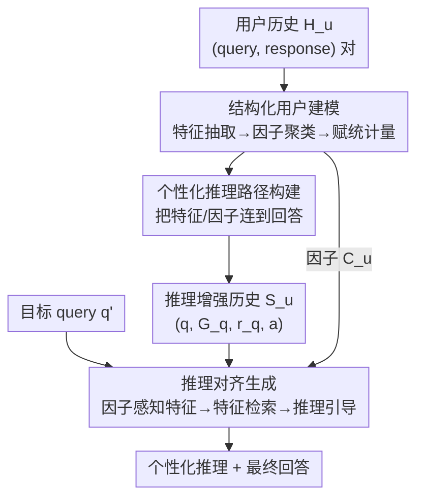

# RPM: Reasoning-Level Personalization for Black-Box Large Language Models

**会议**: ICLR 2026  
**OpenReview**: [https://openreview.net/forum?id=oKKVLHFzZ8](https://openreview.net/forum?id=oKKVLHFzZ8)  
**代码**: https://github.com/jieyong99/RPM  
**领域**: LLM个性化 / 黑盒大模型 / 推荐与用户建模  
**关键词**: 黑盒LLM个性化, 推理级个性化, 用户行为建模, 特征因子, 推理路径检索

## 一句话总结
RPM 把黑盒 LLM 的个性化从"对齐最终回答"升级为"对齐底层推理过程"：它从原始用户历史里自动抽取「特征→因子→统计量」的结构化用户模型，为每条历史构造个性化推理路径，再用基于特征的检索把这些推理示例喂给模型，让 LLM 沿着用户自己的逻辑来推理，在四类任务上一致超过现有的回答级个性化方法且更可解释。

## 研究背景与动机
**领域现状**：黑盒 LLM（GPT-4o 这类不可访问参数的模型）的个性化主要有两条路线——检索式方法（按相似度或效用从用户历史里挑示例，如 RAG、HYDRA）和提示优化式方法（用启发式模板或迭代反馈把用户信息塞进 prompt，如 PAG、Fermi）。

**现有痛点**：这两条路线都停留在**回答级个性化（Response-Level Personalization）**——目标只是让最终输出去匹配用户过去的回答。这带来两个具体问题：其一是**浅层模式学习**，系统只能学到"整段输入↔最终输出"的浅相关，捕捉不到输入里哪个具体成分如何影响了回答；其二是**缺乏可解释性**，没有显式推理路径，就分不清模型输出到底反映了用户真实偏好还是误导性相关，可靠性存疑。

**核心矛盾**：用户行为背后有一套稳定的"为什么这么打分/这么回答"的判断逻辑，而回答级方法只对齐结果、不对齐这套逻辑，于是既学不深也讲不清。作者还验证了一个反直觉现象：直接给 baseline 套零样本 CoT 或把历史拼成 few-shot CoT 示例，**反而经常掉点**——因为 CoT 产出的是与用户无关的通用逻辑铺陈，没有锚定到用户行为。

**本文目标**：提出并形式化**推理级个性化（Reasoning-Level Personalization）**这一新范式，并造出第一个能把原始行为数据自动转成"模型可靠遵循的结构化推理模型"的系统框架。

**切入角度**：既然通用推理结构（CoT、ToT）与"用户是谁"无关，那就让推理结构**直接从每个用户观察到的行为里推导出来**——把它当成数据驱动的建模原则，而非一种 prompt 技巧。

**核心 idea**：先把用户历史结构化成"响应影响特征 + 可统计因子"，据此为历史样本标注个性化推理路径，再用基于特征的检索把对当前 query 最有指导意义的推理示例取出来引导推理，从而让 LLM 的推理过程与用户行为对齐。

## 方法详解

### 整体框架
RPM 要解决的是：给定黑盒模型 $M$、用户 $u$ 的历史 $H_u=\{(q_i,a_i)\}_{i=1}^N$ 和一个目标 query $q'$，在不改模型参数的前提下生成个性化输出 $a'$。整体分三块串行推进——**先离线把用户历史炼成结构化用户模型并标注推理路径，再在线对目标 query 做基于特征的检索与推理对齐生成**。

具体地：(1) **个性化因子构建**从每条历史 query 抽取响应影响特征 $G_{q_i}$，跨样本聚类成用户级因子 $C_u$，并给每个因子赋统计含义；(2) **个性化推理构建**对每个 $(q_i,a_i)$ 生成一条把特征/因子连到回答的推理路径 $r_{q_i}$，连同原始信息存进"推理增强历史" $S_u$；(3) **推理对齐生成**在推理时对目标 query 做"因子感知"的特征抽取，按特征相似度从 $S_u$ 检索 top-$K$ 推理示例，把它们作为显式条件喂给 $M$ 生成既个性化又可解释的输出。

### 关键设计

**1. 结构化用户建模：把杂乱历史炼成「特征→因子→统计量」三层结构**

针对"回答级方法只学浅相关、看不清输入哪个成分起作用"的痛点，RPM 不再把历史粗暴地总结成一段自然语言 profile，而是搭一个三层的结构化用户模型。**特征抽取**这层，用 $M$ 从每条 query $q_i$ 里抽出可能影响回答的特征集合 $G_{q_i}=\{f_j\}$，每个特征是三元组 $f_j=(\text{name}_j,\text{context}_j,\text{factor}_j)$——name 是简洁语义标签（如 "Taste"），context 是消歧短语（如 "the flavor of the product"），factor 是它将被归入的高层语义簇占位；这一步把原始 query 里与预测无关的噪声剔掉。**因子生成**这层，把所有 query 的特征跨样本做 LLM 聚类 $\{F^{(m)}\}=\text{LLM\_Cluster}(\cup_i G_{q_i})$，得到用户级语义簇——语义相近的特征往往对应该用户一致的推理倾向。

**赋统计含义**这层是关键，它让因子从"语义簇"变成"可量化的判断画像"。对有离散类别的任务（如评分预测），定义在因子特征出现条件下回答取值 $y$ 的倾向分

$$\text{Propensity}(y, F^{(m)}) = \frac{\sum_{(q_i,a_i)\in H_u} \mathbb{I}[a_i=y \wedge F^{(m)}\cap G_{q_i}\neq\varnothing]}{\sum_{(q_i,a_i)\in H_u} \mathbb{I}[F^{(m)}\cap G_{q_i}\neq\varnothing]}.$$

对开放式任务则沿可解释推荐的思路，用三个互补维度刻画每个因子：覆盖度 $\text{Coverage}(F^{(m)})=\sum_i \mathbb{I}[\exists f_j\in F^{(m)}\cap G_{q_i}]$（出现频率）、影响度 $\text{Influence}$（被 $M$ 判定确实影响了回答的次数，即 $\text{IsInfl}_{f_j\to a_i}=\text{True}$ 的计数）、极性 $\text{Polarity}$（在被判定为有影响的特征里 Pos/Neu/Neg 各自占比）。这些统计量汇成 $\theta^{(m)}$，最终用户因子表示 $C_u=\{F^{(m)},\theta^{(m)}\}$ 就成了推理时可引用的量化参照点——这正是回答级 profile 给不了的东西。

**2. 个性化推理路径构建：把"信息如何导向回答"显式写出来当训练范例**

光有特征和因子还不够——它们描述了"有哪些信号"，却没说"这些信号怎么导向了这个回答"。这一设计针对的正是这个缺口：用 $M$ 配上推理指令，输入 query $q_i$、其特征 $G_{q_i}$、用户因子 $C_u$ 和真实回答 $a_i$，让它**反推一条把相关信息连到回答的推理路径** $r_{q_i}=M(q_i,G_{q_i},C_u,a_i)$。注意这里是基于"已观察到的回答"构造稳定的行为合理化叙述，而非臆测用户内心，因此推理是有据可依的。生成的路径连同原料一起存进推理增强历史

$$S_u=\{(q_i, G_{q_i}, r_{q_i}, a_i)\,|\,(q_i,a_i)\in H_u\}.$$

这样每条历史都从"裸 query-response 对"升级成"带显式个性化推理的范例"，后续推理时就能用这些范例向模型示范"该用户面对这类信号时是怎么一步步得出结论的"，而不是只给个输入输出对让模型自己猜映射。

**3. 推理对齐生成：因子感知特征 + 基于特征的检索把对的推理范例取出来引导**

推理时若仍按"原始 query 表面相似度"检索历史，会取到话题相关但对决策无用的例子。RPM 的做法分三步。**因子感知特征抽取**：对目标 query $q'$ 抽特征时带上用户因子集 $C_u$ 作参照，让每个特征都挂上对应 factor 字段，从而能引用该因子的统计量、把特征锚定到用户既有行为结构上。**基于特征的检索**：用特征集而非原始 query 作检索键，计算 $G_{q'}$ 与每条 $G_q$ 的语义相似度取 top-$K$，

$$S^{ret}_{u,q'}=\{(q,G_q,r_q,a)\in S_u \mid \text{Top-}K\;\cos(f(G_{q'}), f(G_q))\},$$

其中 $f(\cdot)$ 是特征文本拼接后的嵌入。这让检索捕捉的是"推理相关结构"的相似而非表层话题重合，取回的范例对引导当前推理更直接有用。**推理范例增强生成**：把目标 query、其特征 $G_{q'}$、因子 $C_u$ 和检索到的推理范例一起喂给 $M$，得到 $r_{q'},a'=M(q',G_{q'},C_u,S^{ret}_{u,q'})$。检索回的推理路径成为显式条件信号，向模型演示"结构化用户信息过去是怎样映射到回答的"，于是模型既能个性化又能给出透明的推理。整套 prompt 用通用模板，只在任务描述处留占位符，方便迁移到新任务。

## 实验关键数据

### 主实验
四个个性化任务覆盖分类/回归/生成/QA：LaMP-2（电影打标，Acc/F1）、LaMP-3（商品评分，MAE/RMSE 越低越好）、LaMP-5（论文标题生成，ROUGE）、GlobalOpinionQA（按国家分组的 QA，Acc）。所有方法统一用 GPT-4o-mini 作黑盒骨干、Contriever 检索 3 个示例。

| 数据集/指标 | Zero-shot | 最强 baseline | RPM | 说明 |
|--------|------|------|------|------|
| LaMP-2 Acc ↑ | 0.430 | 0.526 (RAG/HYDRA/Fermi) | **0.561** | 分类任务领先约 3.5 个点 |
| LaMP-3 MAE ↓ | 0.361 | 0.312 (Fermi+CoT) | **0.259** | 回归误差大幅下降 |
| LaMP-5 R-1 ↑ | 0.446 | 0.466 | **0.492** | 生成任务也涨 |
| GOQA Acc ↑ | 0.562 | 0.820 (PAG+CoT) | **0.852** | QA 全面领先 |

一个关键观察：给 baseline 套 CoT（表中 +CoT 行）**并不稳定提升、甚至常掉点**——它生成的是语法通顺但与用户真实决策不对齐的冗长推理。这印证了"通用推理不等于个性化推理"。此外 RPM 在多种骨干 LLM 上都超对应 baseline，且用一个骨干构造的推理记忆可直接被别的 LLM 复用、性能相当，显示出强跨模型迁移性。

### 消融实验
从 Zero-shot 出发逐步加组件（Table 2）：

| 配置（输入） | LaMP-2 Acc | LaMP-3 MAE | GOQA Acc | 说明 |
|------|---------|------|------|------|
| Zero-shot ($q'$) | 0.430 | 0.361 | 0.562 | 仅目标 query |
| + 特征/因子 ($G_{q'},C_u$) | 0.465 | 0.287 | 0.647 | 静态结构化用户表示就有效 |
| + 检索 query-answer 对 | 0.485 | 0.274 | 0.755 | 加上下文示例继续涨 |
| + 通用 CoT 推理范例 | 0.492 | 0.385 | 0.735 | 通用推理反而把 MAE 拉差 |
| RPM（个性化推理范例） | **0.561** | **0.259** | **0.852** | 个性化推理路径带来最大跃升 |

另有检索策略对比（Table 3）：从推理增强历史 $S_u$ 出发、用特征 $G_{q'}$ 作键的 Contriever 检索最稳最好（LaMP-2 Acc 0.561 / GOQA 0.852），明显优于在原始历史 $H_u$ 上按原始 query 做 BM25/Contriever/HYDRA-reranker 的表层检索。

### 关键发现
- **个性化推理路径是涨点主力**：消融里换成通用 CoT 推理范例时 LaMP-3 MAE 反而恶化到 0.385，而换成个性化推理路径骤降到 0.259——说明有效个性化必须建模"这个用户怎么推理"，而非堆通用推理。
- **结构化组件不可省**：去掉特征/因子、仅用裸 query-response 对构造推理仍能有不错表现，但明显掉点，证明三层结构是推理的必要地基与检索依据。
- **基于特征 vs 表层检索**：在 $S_u$ 上用特征检索比在 $H_u$ 上用原始 query 检索一致更好，因为前者匹配的是决策相关结构而非话题表面重合。
- **小历史也能用、长历史更好**：少量历史样本即可获得可观个性化（适合低资源），但历史越长、检索示例越多，性能持续提升。
- **人工评测更可解释**：200 例 AMT 评测中，RPM 在可解释性、对齐性等六个维度都优于 HYDRA/Fermi+CoT；抽取的特征 98.9% 被判为对回答有合理影响、因子聚类有效性 93.8%。
- **开销可控**：每用户预处理约 \$0.058、单条推理 \$0.0037、推理延迟 0.10s/用户，远低于 Fermi（\$0.32）和 HYDRA（\$0.47 还要额外训参数）。

## 亮点与洞察
- **范式重定义**：把"个性化"从对齐输出抬到对齐推理过程，是一个干净利落的问题重述——并且作者用"CoT 套上去反而掉点"的实验证明了通用推理填不上这个坑，立论扎实。
- **结构化用户模型可量化、可解释**：特征三元组 + 因子统计量（Propensity/Coverage/Influence/Polarity）把"用户为什么这么判断"做成了可被 prompt 引用的数字画像，比一段自然语言 profile 信息密度高得多，这套"抽特征→聚因子→赋统计"的管线可迁移到任何需要用户建模的检索/推荐场景。
- **用特征而非原始 query 做检索键**：一个小而巧的改动，把检索从"话题相似"切换到"推理结构相似"，且无需像 HYDRA 那样训 reranker，零额外训练就拿到更好的检索质量。
- **跨模型迁移的推理记忆**：一个骨干构造的 $S_u$ 能被别的 LLM 直接复用，暗示这套结构捕捉的是用户信号本身、能压过模型自带偏置——对"一次建模、多模型服务"的工程落地很友好。

## 局限与展望
- **强依赖骨干 LLM 的判断质量**：特征抽取、因子聚类、影响/极性判定、推理路径生成全靠同一个黑盒 $M$ 完成，若骨干在某领域判断力弱，整条结构化链路会被污染；论文虽做了幻觉与长度偏置分析，但这些步骤本身的误差累积没有上界保证。
- **预处理成本随用户数线性增长**：虽然单用户 \$0.058 不高，但每个新用户都要重跑特征/因子/推理构造，大规模用户库下离线成本与维护（历史更新后是否重算）值得关注。
- **评测规模偏小**：LaMP 各任务只采样 50/100/100 用户、GOQA 46 个国家组，且把国家当作"用户"是较粗的群体级个性化，个体级长尾用户上的表现仍待验证。
- **可改进方向**：因子的统计量目前是基于频次的浅统计，可探索更细的因果/序列建模；特征检索的嵌入仍用通用编码器，可考虑面向"推理结构相似"专门训练的轻量编码器，进一步拉开与表层检索的差距。

## 相关工作与启发
- **vs RAG (Salemi et al.)**：RAG 按语义相似度从历史检索示例，本文也检索，但 RAG 用原始 query 作键、易取到话题相关却对决策无用的例子；RPM 用结构化特征作键并检索带推理路径的范例，匹配的是推理相关结构。
- **vs HYDRA (Zhuang et al.)**：HYDRA 训一个 reranker 按"效用"而非相似度重排示例，需要额外训练参数；RPM 用特征作检索依据达到类似"挑有用例子"的效果，但零额外训练。
- **vs Fermi / PAG（提示优化与 profile 方法）**：它们把用户信息编码进 prompt 或迭代优化 prompt，但对"新 query 该如何自适应地利用输入信息"指导有限、且输入→输出缺乏显式映射；RPM 用从历史构造的个性化推理路径作条件，显式展示"哪个 query 成分如何贡献了预测"。
- **vs 通用结构化推理（CoT / ToT）**：它们施加与"用户是谁"无关的任务通用逻辑；RPM 把推理结构直接从每个用户的行为里推导出来，是数据驱动的建模原则而非 prompt 策略——实验证明这一区别带来稳定涨点而非 CoT 那样的不稳定。

## 评分
- 新颖性: ⭐⭐⭐⭐⭐ 把黑盒 LLM 个性化重定义到"推理级"并给出第一个自动构造结构化推理模型的系统框架，立论与方法都新。
- 实验充分度: ⭐⭐⭐⭐ 四类任务 + 消融 + 检索策略 + 跨骨干 + 人工评测 + 成本分析覆盖全面，但每任务用户采样规模偏小。
- 写作质量: ⭐⭐⭐⭐⭐ 痛点→范式→四点创新→实验逻辑清晰，图 1 的对比示例很直观。
- 价值: ⭐⭐⭐⭐ 零额外训练、可解释、跨模型可迁移，对黑盒 LLM 个性化落地有实用价值。

<!-- RELATED:START -->

## 相关论文

- [\[AAAI 2026\] Inference-Aware Prompt Optimization for Aligning Black-Box Large Language Models](../../AAAI2026/recommender/inference-aware_prompt_optimization_for_aligning_black-box_large_language_models.md)
- [\[ICLR 2026\] From Evaluation to Defense: Advancing Safety in Video Large Language Models](from_evaluation_to_defense_advancing_safety_in_video_large_language_models.md)
- [\[ICLR 2026\] Adaptive Regularization for Large-Scale Sparse Feature Embedding Models](adaptive_regularization_for_large-scale_sparse_feature_embedding_models.md)
- [\[NeurIPS 2025\] R²ec: Towards Large Recommender Models with Reasoning](../../NeurIPS2025/recommender/r2ec_towards_large_recommender_models_with_reasoning.md)
- [\[ICLR 2026\] Reinforced Latent Reasoning for LLM-based Recommendation](reinforced_latent_reasoning_for_llm-based_recommendation.md)

<!-- RELATED:END -->
