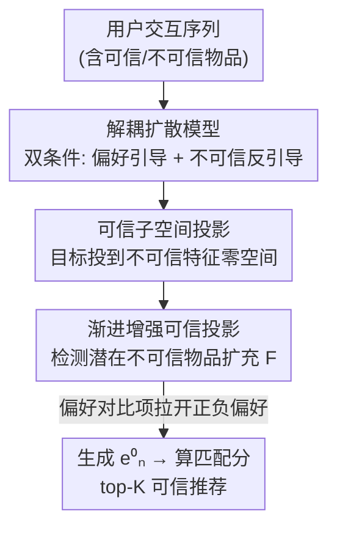

# Steering Diffusion Models Towards Credible Content Recommendation

**会议**: ICLR 2026  
**OpenReview**: [https://openreview.net/forum?id=gcT2BCGcZJ](https://openreview.net/forum?id=gcT2BCGcZJ)  
**代码**: 无  
**领域**: 推荐系统 / 扩散模型 / 可信内容推荐  
**关键词**: 扩散推荐, 内容可信度, 信息解耦, 零空间投影, 序列推荐

## 一句话总结
针对扩散模型做序列推荐时会推送假新闻、虚假信息等不可信内容的问题，本文提出 Disco：用一个"解耦扩散模型"把用户真实偏好信号和不可信内容信号分离开、再把扩散目标投影到不可信特征的零空间里抑制不可信内容，并在标签稀缺时渐进地检测潜在不可信物品来补全这个零空间，最终在三个真实数据集上同时拿到更高的推荐准确率和可信率。

## 研究背景与动机

**领域现状**：扩散模型（DM）凭借对复杂分布的强建模能力，已经被广泛用于序列推荐。主流范式是"加噪-去噪"：先用 Transformer/GRU 把用户历史交互的前 $n-1$ 个物品编码成一个偏好条件 $c$，把第 $n$ 个目标物品的 embedding 当作扩散目标，前向加噪、反向以 $c$ 为条件逐步去噪，生成反映用户偏好的物品 embedding，再和候选物品算匹配分做 top-K 推荐。

**现有痛点**：这套范式只盯着推荐准确率，完全忽略了被推荐内容的**可信度**。在新闻推荐这种场景里，DM 会顺着用户历史把假新闻、虚假医疗信息一路推送出去——疫情期间新闻推荐系统放大假疗法、疫苗阴谋论就是真实教训。推不可信内容不仅伤害体验，更有实打实的社会危害。

**核心矛盾**：作者通过理论和实证分析定位到两个根因——（1）**不可信条件**：用户历史里混进了不可信物品，污染了作为生成条件的偏好表示；（2）**不可信扩散目标**：目标物品本身就是不可信的。但最直接的"把不可信物品全删掉"做法行不通：不可信物品里仍然藏着用户的真实兴趣（读了一篇体育假新闻，至少说明此人对体育感兴趣），全删会严重掉准确率。于是第一个挑战是**在不牺牲准确率的前提下削弱不可信内容的负面影响**。

**本文目标 + 切入角度**：另一条路是只剥离物品里"不可信"的那部分、保留偏好部分，但这需要大量可信度标签做监督，而现实中只有极小比例物品被核验过。所以第二个挑战是**在标签稀缺下同时处理已知和未知的不可信内容**。作者的切入点是：与其外挂解耦网络（额外算力开销大），不如让扩散模型自己充当解耦器——只要把扩散目标函数重新设计，DM 在训练中就能自然把两类信号分开。

**核心 idea**：用"鼓励偏好信号引导生成、抑制不可信信号引导生成"的双通道扩散目标做解耦，再加一个零空间投影把目标物品里的不可信成分挤掉，并用渐进检测在无标签数据上不断补全这个零空间。

## 方法详解

### 整体框架

Disco 要解决的是"扩散推荐既准又可信"，它在标准 DM 推荐范式上动了三处刀：把单条件改成偏好/不可信**双条件**、给扩散目标加一道**零空间投影**、再用**渐进增强**在标签稀缺时补全投影所需的不可信特征库；最后再叠一个偏好对比项把准确率拉回来。

整体数据流是：用户交互序列里每个物品 embedding 先经两个内容学习器拆成偏好向量 $e^{pre}$ 和不可信内容向量 $e^{unc}$，分别聚合成偏好条件 $c^{pre}$ 和不可信条件 $c^{unc}$；解耦扩散模型用前者引导、后者反引导地去噪生成目标物品；与此同时目标物品 embedding 被投影到不可信特征矩阵的零空间得到"可信扩散目标"，再用渐进增强不断检测潜在不可信物品来扩充这个特征矩阵；训练时还额外引入偏好对比项建模负偏好。推理阶段只用偏好条件 $c^{pre}$ 引导生成，从而即便用户历史里有不可信物品，生成结果也不会沾染不可信特征。

### 关键设计

**1. 解耦扩散模型：让扩散目标函数自己把偏好和不可信信号分开**

这针对"不可信条件污染生成、又不能直接删物品"的痛点。Disco 不外挂解耦网络，而是用两个 MLP 内容学习器从每个物品 embedding 里抽出偏好向量 $e^{pre}=\mathrm{MLP}_{pre}(e)$ 和不可信内容向量 $e^{unc}=\mathrm{MLP}_{unc}(e)$，再分别构造偏好条件 $c^{pre}$（用 Transformer，因为偏好有时序依赖）和不可信条件 $c^{unc}$（用 mean pooling，因为可信度不存在时序依赖，省一次 Transformer 开销）。解耦的关键在重写后的扩散目标：以 $c^{pre}$ 为条件时**最小化**变分下界、以 $c^{unc}$ 为条件时**最大化**变分下界：

$$\theta^* = \arg\min_\theta \; \mathbb{E}_q\!\left[-\log\tfrac{p_\theta(e_n^{0:T}\mid c^{pre})}{q(e_n^{1:T}\mid e_n^0)}\right] - \mathbb{E}_q\!\left[-\log\tfrac{p_\theta(e_n^{0:T}\mid c^{unc})}{q(e_n^{1:T}\mid e_n^0)}\right].$$

直觉是：鼓励模型"听偏好的话"、惩罚模型"听不可信信号的话"，DM 在这一推一拉中自然学会把两类信息推到不同方向，无需额外约束。一个关键细节：扩散目标必须用原始 $e_n$，不能用 $e_n^{pre}$ 或 $e_n^{unc}$——否则条件和目标落在同一空间、失去解耦方向（消融证实换成 $e_n^{pre}/e_n^{unc}$ 会显著掉点）。化简后的损失是两项 MSE 之差，但第二项会塌缩到极小值导致训练不稳，作者借鉴 PreferDiff 把 MSE 换成余弦损失 $S(\cdot,\cdot)=(1-\cos(\cdot,\cdot))^2$，保持优化方向不变但数值稳定。

**2. 可信子空间投影：把目标物品里的不可信成分挤进零空间**

解耦只解决了条件侧，但序列里最后一个物品（扩散目标）本身也可能不可信。这个设计把扩散目标投影到不可信特征的零空间来抑制它。具体做法：把所有已知不可信物品的 $e^{unc}$ 堆成特征矩阵 $F\in\mathbb{R}^{|I_{unc}|\times d}$，对 $F^\top$ 做 SVD 得 $\{U,\Lambda,V\}$，左奇异矩阵 $U$ 的每列是 $F^\top$ 的正交基、对应奇异值 $\Lambda$ 衡量该基携带的不可信信息量。把奇异值超过阈值的子矩阵 $U_1$ 去掉、只留下含不可信信息稀疏的 $U_2$，再把目标投到由 $U_2$ 张成的零空间：

$$\tilde{e}_n = e_n U_2 U_2^\top.$$

为避免投影丢掉有用信息，用残差把投影结果和原 embedding 平均：$\tilde{e}_n = (\tilde{e}_n + e_n)/2$，得到"可信扩散目标"，再替换掉损失里的原目标。这样即使目标物品不可信，也被强制挤到一个"最大程度排除不可信内容"的子空间里参与训练。

**3. 渐进增强可信投影：标签稀缺时一边训练一边把潜在不可信物品挖出来补进零空间**

设计 2 依赖一个不可信物品集合 $I_{unc}$，但现实里只有少量物品被核验过，$F$ 覆盖不全、投影就不彻底。这个设计利用"不可信内容往往共享特征"（如假新闻爱用全大写、煽动性标题）来检测未标注物品的不可信度：

$$\mathrm{UD}(i) = \frac{1}{|I_{unc}|}\sum_{i'\in I_{unc}} \cos(e_i^{unc}, e_{i'}^{unc}),$$

即把未标注物品的不可信向量和已知不可信物品比相似度。但训练早期模型还没学好、UD 估计不准，所以不用固定比例，而是定一个最大选择比 $\gamma$，前 $m$ 次迭代里把比例从 0 线性升到 $\gamma$：$\mathrm{ratio}(j)=\min(\gamma,\frac{j}{m}\gamma)$。每步取 UD 最高的前 $\lfloor|I\setminus I_{unc}|\cdot\mathrm{ratio}(j)\rfloor$ 个加入 $I_{unc}$、更新 $F$，让零空间越来越完整、投影越来越准。这是 Disco 区别于 Rec4Mit/HDInt/PRISM 等"假设全量标签"方法的核心。

**4. 整体目标加偏好对比项：把被可信约束压住的准确率拉回来**

前述损失主攻可信，但只建模了正偏好（目标物品）。RS 里负偏好同样重要——得让模型知道用户**不**喜欢什么。最终损失在"内容解耦项"外加一个"偏好对比项"，拉大正偏好物品和采样负偏好物品 $e_{neg}$ 的距离：

$$L_{Disco} = \underbrace{S(\tilde{e}_n^0, f_\theta(\tilde{e}_n^t, c^{pre},t)) - S(\tilde{e}_n^0, f_\theta(\tilde{e}_n^t, c^{unc},t))}_{\text{内容解耦}} + w\underbrace{\big(S(\tilde{e}_n^0, f_\theta(\tilde{e}_n^t, c^{pre},t)) - S(e_{neg}^0, f_\theta(e_{neg}^t, c^{pre},t))\big)}_{\text{偏好对比}},$$

$w$ 控制两项权重。由于所有项共享同一个 MLP 网络 $f_\theta$，多次前向几乎不增显存、开销也很小。这是 Disco 在准确率上反超其他 DM 方法的直接原因。

### 损失函数 / 训练策略

最终优化目标即上式 $L_{Disco}$，用 AdamW 优化。推理遵循 DDPM 单步生成公式、用 DDIM 采样加速，**只用** $c^{pre}$ 引导从高斯噪声生成 $e_n^0$，再算 $\hat{y}_i = e_n^0\cdot e_i^\top$ 取 top-K。关键超参：$w\in\{0.5,1,1.5,2,5\}$、$\gamma\in\{0.1,...,0.5\}$、$m=10000$、零空间阈值固定为 3；训练时假设仅 20% 不可信物品有标签以模拟真实稀缺场景。

## 实验关键数据

### 主实验

三个真实数据集：PolitiFact、GossipCop（来自 FakeNewsNet，假新闻=不可信）、MHMisinfo（视频心理健康虚假信息）。指标含准确率类 HR@K / NDCG@K、可信率 CR@K（top-K 里可信物品占比）、以及二者结合的 HC@K。Disco 在全部数据集和指标上都拿到最优。

| 数据集 | 指标 | Disco | 次优 | 次优方法 |
|--------|------|-------|------|----------|
| PolitiFact | HR@5 | **0.2678** | 0.2606 | DiffuRec |
| PolitiFact | CR@5 | **0.9823** | 0.9335 | PRISM |
| PolitiFact | HC@5 | **0.3466** | 0.3334 | DiffuRec |
| GossipCop | HR@5 | **0.5236** | 0.4969 | PreferDiff |
| GossipCop | CR@5 | **0.9277** | 0.8986 | HDInt |
| GossipCop | HC@5 | **0.4918** | 0.4523 | PreferDiff |
| MHMisinfo | HR@5 | **0.2215** | 0.1974 | PreferDiff |
| MHMisinfo | CR@5 | **0.9305** | 0.9002 | DreamRec |
| MHMisinfo | HC@5 | **0.3000** | 0.2713 | PreferDiff |

可以看到：DM 类方法（DiffuRec/PreferDiff/DreamRec）准确率普遍强于传统/对比学习方法，但它们的可信率（CR）反而偏低——因为它们不管可信度；而专门做可信推荐的 Rec4Mit/HDInt/PRISM 在标签稀缺（20%）下表现糟糕，因为它们假设全量标签。Disco 同时在准确率和可信率两端领先，验证了"既准又可信"的目标。

### 消融实验

六个变体，下表为 PolitiFact / GossipCop / MHMisinfo 的 HC@5（综合指标）：

| 配置 | PolitiFact HC@5 | GossipCop HC@5 | MHMisinfo HC@5 | 说明 |
|------|-----------------|----------------|----------------|------|
| Disco（完整） | 0.3455 | 0.4918 | 0.3000 | 完整模型 |
| w/o Dis | 0.3033 | 0.4783 | 0.2650 | 去解耦模块，掉得最狠 |
| w/o CSP | 0.3331 | 0.4860 | 0.2942 | 去可信子空间投影 |
| w/o PERS | 0.3393 | 0.4876 | 0.2877 | 去渐进增强 |
| w/o PC | 0.3413 | 0.4651 | — | 去偏好对比项 |

### 关键发现

- **解耦模块（Dis）贡献最大**：去掉后三个数据集 HC@5 全面大跌（如 PolitiFact 0.3455→0.3033，MHMisinfo 掉到 0.2650），且 CR 同步从 0.98 级跌到 0.91 级——证明双通道解耦是同时保准确率和可信度的根基。
- **偏好对比项（PC）主要管准确率**：在 GossipCop 上去掉后 HC@5 从 0.4918 跌到 0.4651，掉幅明显，印证它对准确率的拉升作用。
- **CSP 与 PERS 互补**：CSP 直接管"目标物品不可信"，PERS 在标签稀缺时补全 CSP 的特征库，两者去掉都掉点但幅度小于解耦，属于在解耦基础上的进一步可信增强。
- 扩散目标不能换成 $e_n^{pre}/e_n^{unc}$：一旦条件和目标同空间，解耦方向消失、性能显著恶化。

## 亮点与洞察

- **把"扩散目标函数"本身当解耦器**：不外挂解耦网络，只靠"min 偏好条件 ELBO、max 不可信条件 ELBO"这一推一拉就完成信息分离，省算力又优雅——这种"用训练目标取代结构模块"的思路可迁移到任何需要剥离某种有害属性的生成任务。
- **零空间投影 + 残差保信息**：用 SVD 砍掉高奇异值基把不可信信息挤进零空间，再用残差平均防止把有用信息也投没了，是个很实用的"定向擦除"组合拳。
- **渐进选择比例对抗"早期估计不准"**：UD 检测依赖模型能力，作者不写死比例而是线性 ramp，正好规避了早期乱挑伪标签污染特征库的问题——这种"模型变强、我才敢多信它"的课程式策略值得借鉴。
- 余弦损失替换 MSE 解决了"第二项塌缩到极小、模型只优化它"的训练不稳，是个容易被忽略但很关键的工程细节。

## 局限与展望

- 任务被简化为"减少不可信物品曝光"，且测试时假设有完整可信度标签来评估——真实部署中评估侧也未必有全量标签。
- 仅在三个数据集上验证（PolitiFact/GossipCop/MHMisinfo），其中两个来自同一 FakeNewsNet 仓库；MHMisinfo 缺视频元数据、只能用文本描述代替内容，模态信息受限。
- "不可信内容共享特征"（UD 用余弦相似度检测）的假设在更隐蔽的虚假信息上可能失效，零空间阈值固定为 3 也偏经验化，跨域是否稳健存疑。
- 方法绑定序列推荐范式，对非序列/图结构推荐场景的适配性未讨论。

## 相关工作与启发

- **vs DreamRec / DiffuRec / PreferDiff**：它们都是单通道扩散（单条件引导生成），且目标只为准确率（DreamRec 标准 ELBO、PreferDiff 加 BPR、DiffuRec 用 CE 退化成判别式）。Disco 用双通道解耦扩散，把可信度写进目标函数，因而能在 CR 指标上大幅领先，而这三者做不到。
- **vs Rec4Mit / HDInt / PRISM（可信推荐方法）**：它们假设所有不可信物品都已标注，靠分类器检测，标签稀缺时直接崩。Disco 的渐进增强专为"部分标签"设计，在 20% 标签下仍能有效抑制不可信内容，这是它实用性的核心区别。

## 评分
- 新颖性: ⭐⭐⭐⭐⭐ 首个面向"标签稀缺下可信内容推荐"的扩散模型，解耦目标 + 零空间投影 + 渐进增强组合很新
- 实验充分度: ⭐⭐⭐⭐ 三数据集、四类基线、六变体消融、含 p-value，但数据集偏少且两个同源
- 写作质量: ⭐⭐⭐⭐ 动机-挑战-方法链条清晰，公式推导完整，框架图把渐进增强省略略可惜
- 价值: ⭐⭐⭐⭐⭐ 直击假新闻/虚假信息推荐的社会危害，方法在准确率和可信率上双赢，落地价值高

<!-- RELATED:START -->

## 相关论文

- [\[ICLR 2026\] Discrete Diffusion for Bundle Construction](discrete_diffusion_for_bundle_construction.md)
- [\[ICLR 2026\] iFusion: Integrating Dynamic Interest Streams via Diffusion Model for Click-Through Rate Prediction](ifusion_integrating_dynamic_interest_streams_via_diffusion_model_for_click-throu.md)
- [\[ICLR 2026\] Adaptive Regularization for Large-Scale Sparse Feature Embedding Models](adaptive_regularization_for_large-scale_sparse_feature_embedding_models.md)
- [\[ICLR 2026\] RPM: Reasoning-Level Personalization for Black-Box Large Language Models](rpm_reasoning-level_personalization_for_black-box_large_language_models.md)
- [\[ICLR 2026\] CollectiveKV: Decoupling and Sharing Collaborative Information in Sequential Recommendation](collectivekv_decoupling_and_sharing_collaborative_information_in_sequential_reco.md)

<!-- RELATED:END -->
