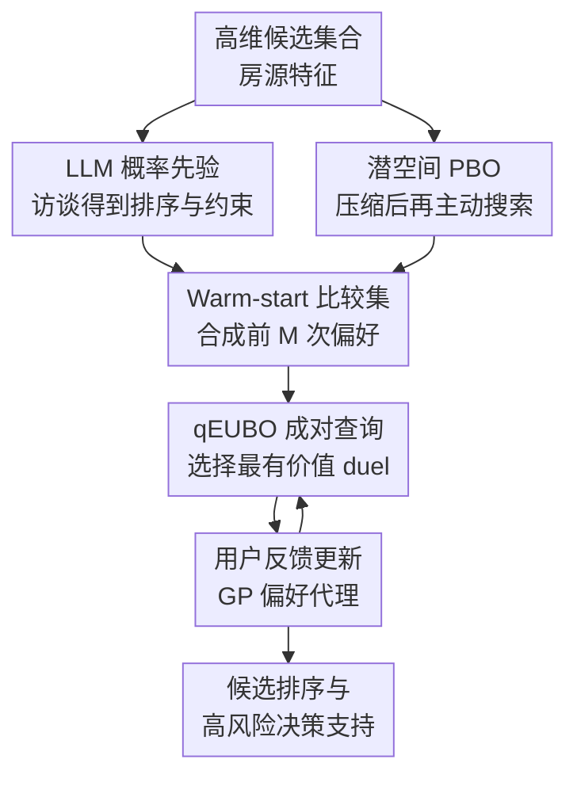

# Supporting High-Stakes Decision Making Through Interactive Preference Elicitation in the Latent Space

**会议**: ICLR 2026  
**OpenReview**: [https://openreview.net/forum?id=ra7CSHcVCv](https://openreview.net/forum?id=ra7CSHcVCv)  
**代码**: 未提供  
**领域**: 推荐系统 / 交互式偏好获取 / 决策支持  
**关键词**: 偏好获取, 决策支持, Preferential Bayesian Optimization, 潜空间优化, LLM先验  

## 一句话总结
本文面向租房这类高风险、低频、反馈稀疏的决策场景，把用户访谈得到的 LLM 偏好先验、Autoencoder 潜空间压缩和 Preferential Bayesian Optimization 结合起来，用更少的成对比较学习用户效用函数，并在真实房源数据上比普通 PBO 获得更高的排序准确率。

## 研究背景与动机
**领域现状**：推荐系统在电商、音乐、短视频这类高频场景里通常依赖大量点击、停留、评分或购买行为来估计用户偏好。用户会不断试错，系统也能从海量交互里学习协同模式，因此传统协同过滤、序列推荐和 bandit 方法都比较适用。

**现有痛点**：租房、买车、金融产品选择、求职等高风险决策不是这样的场景。用户通常只会认真比较少量候选，一旦做出决定，长期都不会再给系统反馈；同时每个候选都由价格、面积、通勤、噪声、楼层、社区质量等连续且异质的特征共同决定，用户自己也很难把偏好写成一个明确的打分函数。

**核心矛盾**：这类任务同时要求“少问问题”和“学到复杂偏好”。普通推荐方法缺少足够历史数据，直接让用户填写权重又过于僵硬；而普通 Preferential Bayesian Optimization（PBO）虽然适合通过成对比较学习黑盒偏好，但在高维连续特征空间里容易被维度灾难拖慢，早期还会因为冷启动先验不准而浪费宝贵查询次数。

**本文目标**：作者希望构建一个可以实时工作的交互式偏好获取系统：先通过自然语言访谈快速获得用户可接受的约束和偏好排序，再在房源特征的低维潜空间中主动选择最有信息量的房源对让用户比较，最后得到一个可以给已有和未来房源排序的用户效用代理模型。

**切入角度**：论文的观察是，高风险决策中的候选虽然原始特征维度高，但许多特征之间存在强相关，例如面积、房间数、价格和建筑质量并不是完全独立的。若先用 Autoencoder 学出保留主要结构的低维表示，再在这个潜空间里做 PBO，优化问题会更小、更稳定；同时 LLM 更擅长从对话中提取相对重要性和约束，而不是可靠地产生精确数值权重，因此 LLM 适合作为 warm start 的先验来源。

**核心 idea**：用 LLM 访谈生成概率式偏好先验，用 Autoencoder 把高维候选压到低维潜空间，再用 PBO 主动挑选成对比较，从而在稀疏交互下高效学习用户效用函数。

## 方法详解

### 整体框架
这篇论文的系统输入是一组可推荐候选 $I=\{x_1,\ldots,x_{|I|}\}$、每个候选的高维特征 $x\in X\subset\mathbb{R}^d$，以及一个只能通过成对比较表达偏好的用户。系统输出不是单个推荐结果，而是一个用户效用代理 $\hat{u}$，它可以对候选做排序，也可以在新候选出现时继续更新。

整体流程可以理解为三段：先训练 Autoencoder 获得编码器 $g_\theta:X\to Z$ 和解码器 $h_\theta:Z\to X$；再用 LLM 访谈得到用户的特征重要性排序和可接受上下界，并把这个信息转成 warm-start 比较数据；最后在潜空间里运行 PBO，每轮选择一对候选给用户比较，用反馈更新 GP 偏好模型。

### 关键设计
**1. 潜空间 PBO：把高维偏好搜索压到可交互的低维空间**

普通 PBO 直接在原始特征空间里选择两个候选 $(x,x')$ 进行比较。问题是租房特征既有连续数值，也有地理距离、建筑属性和设施特征，维度上来后 acquisition function 要在 $X^2$ 中找最有价值的 duel，搜索空间会非常大，模型也容易在少量反馈下过早相信某个局部区域。

本文先在候选集合 $I$ 上训练 Autoencoder，用编码器 $g_\theta$ 把原始特征映射到低维潜变量 $z=g_\theta(x)$，再学习潜空间效用 $\hat{u}:Z\to\mathbb{R}$。用户对原始候选的偏好被写成潜空间模型上的比较：如果 $\hat{u}(g_\theta(x))\ge \hat{u}(g_\theta(x'))$，模型就认为 $x$ 优于 $x'$。这样做的关键不是把房源“变抽象”，而是让 PBO 在保留主要结构的低维流形上做主动探索，减少无意义维度对查询选择的干扰。

**2. LLM 概率先验：让自然语言访谈只做它更擅长的事**

冷启动是交互式偏好获取里最贵的阶段，因为前几轮问错了，用户预算就被浪费。论文让 LLM 扮演领域访谈员，通过最多若干轮自然语言问题收集用户可接受的上下界，例如最低面积、最少房间数、最高总租金、到市中心最大距离，并要求 LLM 输出所有特征的严格重要性排序。

作者没有只相信 LLM 直接给出的权重。直接权重估计容易过度自信，也容易把语言里的模糊偏好硬翻成错误数值。本文更稳的做法是把 LLM 输出的 ranking $\pi$ 作为概率分布的形状，再结合数据里的经验方差 $s_i^2$ 采样权重：

$$
w_i \sim \mathcal{N}\left(0, \frac{s_i^2}{\max_j s_j^2}\cdot \frac{1}{r_i}\right),
$$

其中 $r_i$ 越小表示特征越重要，采样后还约束 $w\in[-1,1]^d$ 且 $\|w\|_1=1$。这个设计把“LLM 擅长比较相对重要性”与“贝叶斯模型需要不确定性”对齐起来：先验不是一个死板点估计，而是一组带随机性的 warm-start 偏好。

**3. Warm-start 比较集：用合成偏好填补最初几轮的空白**

得到权重 $w$ 后，系统定义一个线性效用 $u_{lin}(x)=w^\top x$，从候选集合里随机采样 $M$ 对房源，并用这个线性效用自动判断每对里哪一个更好。每个合成反馈 $(x_k,x'_k,y_k)$ 再通过编码器变成潜空间观察 $(g_\theta(x_k),g_\theta(x'_k),y_k)$，形成 warm-start 数据集 $D$。

这一步的意义在于，真实用户还没开始疲劳地做比较时，模型已经有了一个大致方向。它并不假设线性效用就是真实偏好，而是把它当成“比完全空白更好的起点”。后续真实反馈到来后，GP 偏好模型会继续修正这个先验，因此概率式 LLM prior 的保守性比直接权重 prior 更重要。

**4. qEUBO 成对查询：每轮问最能提高最终排序的问题**

进入交互阶段后，模型把用户选择 $x\succ x'$ 看作潜空间效用差的证据，并用 probit likelihood 建模：

$$
Pr(x \succ x') = \Phi\left(\frac{\hat{u}(z)-\hat{u}(z')}{\sigma}\right),
$$

其中 $\sigma$ 同时吸收用户偏好不一致和 AE 重构误差。由于 probit likelihood 与 GP prior 非共轭，论文采用 Laplace approximation 来更新后验。

查询选择使用 qEUBO，即 expected utility of the best option。直观地说，系统不只是找不确定的房源对，而是找“比较完之后最可能帮助发现高效用候选”的房源对：

$$
qEUBO_k(z,z')=\mathbb{E}_k[\max\{\hat{u}(z),\hat{u}(z')\}].
$$

优化得到的潜空间点 $(z_k,z'_k)$ 会通过解码器还原成可展示的候选特征，再让用户做二选一。若未来候选集合扩展，论文还给出一个 continual AE improvement 方案：新 AE 训练好后，把旧反馈先 decode 回原空间，再用新 encoder re-embed，从而保留历史偏好数据。

### 一个完整示例
假设用户正在慕尼黑找房。系统先让 LLM 进行简短访谈：用户说预算有限但不想住太远，希望 60 平米以上，通勤到公共交通不要太久，噪声也要低。LLM 不直接给“租金权重 -0.37、噪声权重 0.21”这类看似精确的结果，而是输出特征排序：总租金最重要，其次是通勤、面积、噪声、周边休闲等，并给出可接受的上下界。

系统根据这个排序采样一个概率式权重向量，随机抽取 5 对房源做 synthetic comparison，得到 warm-start 数据。例如一对房源里 A 租金更低但面积更小，B 面积更大但通勤更差，线性先验可能暂时选择 A。随后进入真实交互：qEUBO 在 6 维潜空间里挑出一对最有信息量的房源，用户回答“更喜欢 B”，模型就更新 GP 后验。经过 25 轮左右，系统得到的不是用户写死的规则，而是一个可以对 50 个测试房源进行成对排序的效用代理。

### 损失函数 / 训练策略
Autoencoder 使用鲁棒缩放、缺失值中位数填充和 1% / 99% 分位 clipping 来降低房源数据异常值影响。最终 tuned architecture 在 encoder 和 decoder 各有两层隐藏层，潜维度为 6，激活函数为 tanh；训练超参包括 batch size 64、learning rate 0.0026、weight decay 0.0013、dropout 0.01、250 个 epoch。

偏好模型采用 GP preference learning。训练数据不是标量评分，而是二元比较标签 $y_k\in\{0,1\}$。模型目标可以概括为学习一个代理 $\hat{u}^*$，使其诱导的比较概率 $F_{\hat{u}}(x,x')$ 尽可能接近真实用户比较函数 $F_u(x,x')$。评价时，作者用测试集合上所有 pair 的排序一致性作为 Pairwise Accuracy，并用 NDCG@10 衡量前 10 个推荐位置捕获了多少理想效用。

## 实验关键数据

### 主实验
论文主要在 Idealista18 的马德里房源数据上评估。该数据包含 94,815 条房源，作者手动选取 12 个属性特征，包括价格、单位价格、面积、房间数、卫生间数、楼龄、楼层、住户数、到市中心距离、到地铁距离、到 Castellana 距离和 cadastral quality。另有一个慕尼黑租房数据集，约 1,500 条房源，用于验证趋势是否一致。

用户反馈有两种模拟方式：一种是带 persona 的 LLM 模拟，例如家庭、学生、年轻职业人士、厌噪用户；另一种是统计线性效用 profile 加 Bradley-Terry 噪声。每次评估使用 $M=5$ 个 warm-start 比较和 $N=25$ 个真实查询预算，测试集含 50 个随机房源，每个结果基于 200 次运行，报告均值和 95% 置信区间。

| 方法 | 模拟用户 | 先验 | Pairwise Acc. | NDCG@10 | Runtime/iter |
|------|----------|------|---------------|---------|--------------|
| PBO | LLM | Static | 0.539 ± 0.014 | 0.622 ± 0.026 | 518 ± 10 ms |
| PBO | Statistical | Static | 0.510 ± 0.017 | 0.658 ± 0.037 | 304 ± 12 ms |
| PBO + AE | LLM | Prob. Elicit | 0.613 ± 0.024 | 0.706 ± 0.034 | 876 ± 216 ms |
| PBO + AE | LLM | Static | 0.605 ± 0.024 | 0.685 ± 0.033 | 723 ± 99 ms |
| PBO + AE | Statistical | Static | 0.556 ± 0.025 | 0.584 ± 0.037 | 465 ± 84 ms |

在 LLM 用户模拟下，本文的 PBO+AE+概率式 LLM 先验达到 0.613 的最终 Pairwise Accuracy 和 0.706 的 NDCG@10，比 vanilla PBO 分别提升约 13.7% 和 13.5%。代价是每轮优化平均多约 358 ms，但仍处在交互式应用可接受范围。作者还测了 candidate diversity，发现 PBO+AE 没有明显把 decoder 输出塌缩到少数相似候选。

### 消融实验
最关键的消融是先验生成方式。作者比较了三种 PBO+AE 初始化：固定静态先验、LLM 直接输出权重点估计、LLM 排序驱动的概率式先验。结果显示，直接让 LLM 填权重最差，概率式先验最好，说明 LLM 适合提供相对排序和约束，但不适合被当作精确效用函数计算器。

| 配置 | Pairwise Acc. | NDCG@10 | 说明 |
|------|---------------|---------|------|
| PBO + AE + Direct Elicit | 0.488 ± 0.024 | 0.573 ± 0.036 | 直接权重估计过于自信，早期掉点明显 |
| PBO + AE + Prob. Elicit | 0.613 ± 0.024 | 0.706 ± 0.034 | 最稳，最终准确率和前排排序质量最高 |
| PBO + AE + Static | 0.605 ± 0.024 | 0.685 ± 0.033 | 静态先验也强，但可能因为默认 profile 与大多数 persona 重合 |
| Munich: PBO + AE + Prob. Elicit | 0.569 ± 0.037 | 0.651 ± 0.038 | 较小城市数据上趋势仍成立 |
| Open-source LLM: PBO + AE + Prob. Elicit | 0.573 ± 0.026 | 0.615 ± 0.037 | 使用 gpt-oss-120b 时整体变差，但仍超过 vanilla PBO |

### 关键发现
- AE 潜空间确实缓解了高维 PBO 的样本效率问题。vanilla PBO 在统计模拟中出现先升后降，作者认为这可能是高维空间导致的局部过拟合和过早 exploitation。
- LLM prior 的价值不在“直接给正确权重”，而在于把访谈中的约束和相对重要性转成不确定性友好的初始化。Direct Elicit 明显弱于 Prob. Elicit，是整篇论文最有启发的实验之一。
- 慕尼黑数据集规模小得多，但 PBO+AE 仍优于 vanilla PBO，说明该框架不完全依赖超大候选库；不过 pairwise accuracy 在慕尼黑上略低，数据规模和特征质量仍会影响效果。
- Warm start 比 cold start 更好。附录中的 warm-start 对比显示，没有 LLM 概率先验的 PBO+AE 很快 plateau，最终不如本文方法。

## 亮点与洞察
- 把 LLM 放在“访谈和先验”位置，而不是直接让它做推荐打分，这个分工很清醒。LLM 负责语言理解和相对偏好抽取，贝叶斯优化负责后验更新和主动查询，二者各做擅长的事。
- 用 AE 潜空间承接 PBO 很适合这类连续多属性推荐任务。它不是简单降维可视化，而是把 acquisition optimization 的搜索空间变小，让少量用户反馈更集中地作用在有效流形上。
- 概率式先验比直接权重更强，提醒我们在“LLM + 决策系统”里不要把语言模型输出伪装成确定事实。把 LLM 输出变成 distribution，往往比把它变成 point estimate 更安全。
- 论文把房源推荐作为 case study，但模式可以迁移到职业选择、汽车购买、保险方案、医疗方案辅助筛选等低频高代价决策。共同点都是候选特征多、用户反馈贵、偏好难以一次性写清楚。

## 局限与展望
- 实验里的用户主要由 LLM persona 和统计 profile 模拟，不等于真实人类。真实用户可能有反复、犹豫、被展示方式影响、临时改变主意等行为，这些在当前评估中只被粗略噪声化。
- 房源特征可能包含敏感代理变量。论文伦理声明也指出，安全分数、噪声分数、社区特征可能与社会经济结构相关，推荐系统若直接优化这些特征，可能放大居住隔离或刻板偏见。
- AE 重构误差被近似吸收到常数噪声 $\sigma$ 中，但不同区域的重构误差未必一致。附录给出了经验观察和一阶近似论证，不过如果边缘区域误差更大，未来可以考虑异方差 preference noise。
- 当前系统只处理单用户偏好。现实租房常常是情侣、家庭或合租室友共同决策，多主体偏好聚合会引入冲突协商、权重公平性和 veto 约束。
- 静态先验在实验中表现很强，说明 persona 设计可能与默认先验存在重合。要证明 LLM prior 的泛化价值，还需要更大、更异质的真实用户研究。

## 相关工作与启发
- **vs 传统推荐系统**: 传统协同过滤和序列推荐依赖大量历史交互，本文面向的是几乎没有历史反馈的低频高风险决策。优势是能用少量成对比较在线学习个人偏好，劣势是每轮查询和模型更新比普通推荐更重。
- **vs Conversational Preference Elicitation**: 纯对话式方法让 LLM 持续提问并理解用户意图，适合自然语言丰富但离散的偏好空间。本文只让 LLM 做前置访谈，后续交给 PBO 主动选择比较，因而更适合连续多特征候选。
- **vs 高维 PBO / dueling optimization**: 既有方法常用随机投影、子空间搜索或 preference embedding 处理高维问题，本文选择用 AE 学非线性低维表示，并直接在该潜空间中优化 qEUBO。
- **vs LLM-based decision support**: 一些工作尝试让 LLM 根据用户目标构造 utility function，再做 Monte Carlo 或 expected utility maximization。本文的启发是，不确定性建模和真实反馈更新仍然重要，尤其在用户自己也说不清偏好时。

## 评分
- 新颖性: ⭐⭐⭐⭐☆ 把 LLM prior、AE 潜空间和 PBO 组合到高风险推荐决策里很自然但完整，尤其概率式先验设计有实际启发。
- 实验充分度: ⭐⭐⭐⭐☆ 有两个城市数据、两类用户模拟、多种先验消融和 open-source LLM 补充，但缺少真实用户实验。
- 写作质量: ⭐⭐⭐⭐☆ 问题定义、算法流程和实验结论都比较清楚，附录也解释了潜空间偏好 likelihood 的近似依据。
- 价值: ⭐⭐⭐⭐☆ 对低频高代价推荐场景很有参考价值，尤其适合做交互式决策支持系统的 baseline 或产品原型。

<!-- RELATED:START -->

## 相关论文

- [\[ACL 2026\] Decisive: Guiding User Decisions with Optimal Preference Elicitation from Unstructured Documents](../../ACL2026/recommender/decisive_guiding_user_decisions_with_optimal_preference_elicitation_from_unstruc.md)
- [\[AAAI 2026\] Evaluating LLMs for Police Decision-Making: A Framework Based on Police Action Scenarios](../../AAAI2026/recommender/evaluating_llms_for_police_decision-making_a_framework_based_on_police_action_sc.md)
- [\[ICML 2025\] Adaptive Elicitation of Latent Information Using Natural Language](../../ICML2025/recommender/adaptive_elicitation_of_latent_information_using_natural_language.md)
- [\[ICLR 2026\] Reinforced Latent Reasoning for LLM-based Recommendation](reinforced_latent_reasoning_for_llm-based_recommendation.md)
- [\[ICLR 2026\] In Agents We Trust, but Who Do Agents Trust? Latent Source Preferences Steer LLM Generations](in_agents_we_trust_but_who_do_agents_trust_latent_source_preferences_steer_llm_g.md)

<!-- RELATED:END -->
