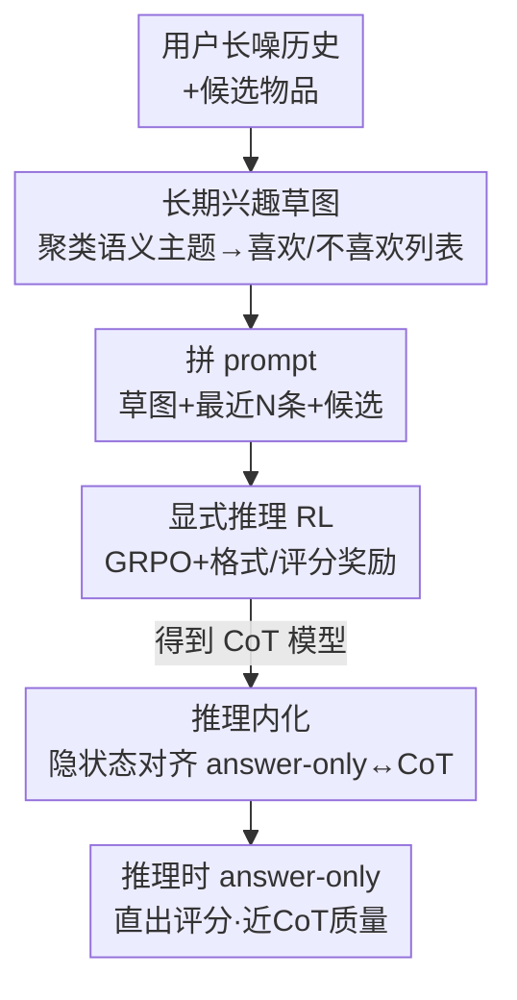

# Token-Efficient Long-Term Interest Sketching and Internalized Reasoning for LLM-based Recommendation

**会议**: ICLR 2026  
**OpenReview**: [https://openreview.net/forum?id=NVrXCKaEjM](https://openreview.net/forum?id=NVrXCKaEjM)  
**代码**: https://github.com/TommyDzh/SIREN  
**领域**: 推荐系统 / LLM推理  
**关键词**: LLM推荐, 评分预测, 长期兴趣压缩, 推理内化, GRPO

## 一句话总结
本文提出 SIREN，用「长期兴趣草图」把动辄上百条的用户历史压成一小串「喜欢/不喜欢的语义主题」喂给 LLM，再用「两阶段训练」先 RL 学会显式 CoT 推理、后把推理通过隐状态对齐内化进参数，从而在 answer-only 解码下保住 CoT 精度，输入 token 降 48.7%、推理延迟比 CoT 低 100×。

## 研究背景与动机

**领域现状**：把 LLM 用于推荐里的评分预测（rating prediction）正成为热点——给 LLM 喂一个用户的历史交互 + 候选物品描述，让它推断用户偏好并输出会打几分。相比传统 ID-centric 推荐器，LLM 能利用丰富的物品语义，缓解冷启动、提升泛化、还能给出可解释推荐。而 CoT（chain-of-thought）推理被证明能进一步提升这类预测的准确度。

**现有痛点**：把 LLM 真正部署到推荐系统里有两个卡脖子的问题。其一，真实用户的历史又长又脏——几天内就能产生上百条交互，充满冗余和噪声。直接把原始历史塞给 LLM，长上下文处理能力不足 + 累积噪声会淹没偏好信号，反而越喂越差（论文 Fig.1(a) 显示历史从 10 条涨到 50 条，MAE 不降反升）；而粗暴截断到最近几条又丢掉了长期兴趣。其二，CoT 虽然准，但 decoder-only 架构下要逐 token 自回归地吐出一长串推理 token，每多一个 token 就多一次前向，导致 per-sample 延迟比 answer-only 高 100× 以上，生产环境扛不住。

**核心矛盾**：「信息量 vs token 预算」和「精度 vs 延迟」两组 trade-off 同时存在。既想保留长期偏好又要省 token；既想要 CoT 的准确度又不想付 CoT 的解码延迟。已有工作要么靠 summarize 用户画像（仍要处理长历史、还加算力），要么靠蒸馏/投机解码/latent reasoning 提速（仍要生成中间推理 token），都没把两个问题一起解决干净。

**本文目标**：(1) 设计一种 token 高效、抗噪、又能保住长期信号的用户表示；(2) 让模型在 answer-only 解码（只吐最终评分、零推理 token）下，仍享有 CoT 级别的推理质量。

**切入角度**：作者两个关键观察。一是用户的稳定偏好可以用「语料级语义主题」高度压缩——把成百上千条历史聚成少数几个「喜欢/讨厌的主题」即可，噪声自然被滤掉。二是无论 answer-only 还是 CoT 解码，最终评分都取决于 `<answer>` token 处的隐状态——那么只要把 answer-only 的隐状态对齐到 CoT 的隐状态，预测就会一致，而完全不需要真的吐 CoT token。

**核心 idea**：用「语义主题草图」代替原始历史解决 token 与噪声问题，再用「隐状态对齐」把 CoT 推理内化进参数，让 answer-only 解码白嫖 CoT 的精度。

## 方法详解

### 整体框架
SIREN 要解决的是 LLM 评分预测的两个部署难题：长噪历史 + 显式推理延迟。整体上它把流程拆成两条线串起来：先做**长期兴趣草图**——把全语料的物品描述编码、聚类成固定的 $K$ 个语义主题，再把每个用户的历史按主题聚合成一小串「喜欢/不喜欢」的主题列表，拼上最近 $N$ 条交互和候选物品组成精简 prompt；然后做**推理内化**——第一阶段用规则奖励的 RL（GRPO）教模型在草图 prompt 上显式 CoT 推理打分，第二阶段用隐状态对齐把这套推理压进参数，使得推理时直接 answer-only 解码就能逼近 CoT 质量。

### 关键设计

**1. 长期兴趣草图：用语料级语义主题把长噪历史压成喜欢/不喜欢列表**

这一步针对「原始历史又长又脏、截断又丢长期信号」的痛点。关键决策是**主题在全语料层面只发现一次**，而不是逐用户发现——因为用户历史长度差异极大，逐用户聚类对短历史很不稳定，且不同用户的主题之间不可比。具体做法：先用文本编码器把每个物品描述编码成嵌入 $e(i)=\text{Enc}(d(i))$，在整个物品集 $I$ 上做 K-means 得到 $K$ 个主题中心 $\{\mu_k\}$，每个物品按最近中心分配主题标签 $c_i=\arg\min_k \|e(i)-\mu_k\|_2^2$；对每个簇，取离中心最近的 $M$ 个物品描述喂给 LLM，生成一个简洁的主题名 $\tau_k$。

有了主题后，把用户历史 $H_u$ 按主题聚合成草图。对第 $k$ 个主题，算该用户在此主题下的平均评分 $\bar r_{u,k}=\frac{1}{|H_u(k)|}\sum r_{ui}$，再用阈值 $\theta$ 把主题切成喜欢集与不喜欢集：$T_u^+=\{\tau_k:\bar r_{u,k}\ge\theta\}$，$T_u^-=\{\tau_k:0<\bar r_{u,k}<\theta\}$，草图即 $S_u=(T_u^+,T_u^-)$。最后把草图、最近 $N$ 条交互 $H_u^{(N)}$、候选描述 $d(i)$ 线性化成 prompt $\pi_u(i)=\Phi(S_u,H_u^{(N)},d(i))$ 交给 LLM 预测。这样草图扛长期偏好、最近交互扛短期上下文，整体在严格 token 预算下既精简又信息充分——既不像截断那样丢长期信号，也不像原始历史那样被噪声拖垮。

**2. 显式推理 RL：用规则奖励在没有 CoT 标注的情况下学会打分推理**

推荐里没有现成的 CoT 推理标注，没法直接监督学推理。本文用 GRPO（一种轻量、无 critic 的 RL）在草图 prompt 上优化推理质量，奖励完全由规则构造。奖励由两部分组成：一是**格式奖励** $s_{format}$，强制模型把推理写在 `<think>...</think>` 里、最终评分写在 `<answer>...</answer>` 里，格式对给 $+1$、错给 $-1$；二是**评分回归奖励** $s_{rate}$，把预测误差线性映射到 $[-2,2]$。整体单样本奖励为

$$R(\hat r_{ui},r_{ui})=s_{format}+\underbrace{\left(2-\frac{4}{E_{max}}|\hat r_{ui}-r_{ui}|\right)}_{s_{rate}},$$

其中 $E_{max}=b-a$ 是评分区间的最大可能误差。$s_{rate}$ 随绝对误差线性递减，预测越接近真值奖励越高。这样不靠任何人工 CoT 标签，就能让模型自己摸索出能把分打准的推理路径，为下一步内化提供一个高质量的 CoT 教师。

**3. 隐状态对齐内化：把 CoT 推理压进参数，让 answer-only 解码白嫖 CoT 精度**

第二阶段要解决的是延迟问题：上一步训出来的模型靠 CoT 才准，但 CoT 要吐几百个 token。本文的核心观察是——无论 answer-only 还是 CoT 解码，最终评分都由 `<answer>` 查询 token $q$ 处的隐状态决定。于是只要把 answer-only 解码下 $q$ 的隐状态对齐到带 CoT 时的隐状态，两者预测就会一致，却不必真的生成 CoT。用 $h^l_{AO}(q)$、$h^l_{CoT}(q)$ 分别表示第 $l$ 层在「只有 prompt」与「prompt+CoT」时 $q$ 的隐状态，对齐损失取逐层余弦距离：

$$\mathcal{L}_{align}=\frac{1}{L}\sum_{l=1}^{L}\Big(1-\cos\big(\text{sg}[h^l_{CoT}(q)],\,h^l_{AO}(q)\big)\Big),$$

其中 $\text{sg}[\cdot]$ 是 stop-gradient（CoT 隐状态作为固定目标）。实现上只对每层注意力的 key/value 投影矩阵加 LoRA。这背后有理论支撑（Theorem 1，KV Adaptation Equivalence）：在对注意力与 FFN 做一阶线性化的近似下，存在对 $W_K^l,W_V^l$ 的低秩更新 $(\Delta W_K^l,\Delta W_V^l)$，使得更新后的 answer-only 隐状态恰好等于 CoT 隐状态——这正是「只调 KV 的低秩适配」策略的动机。推理时模型即便不生成任何 CoT token，也能在 `<answer>` 处算出与显式推理相近的隐状态，从而拿到 CoT 级精度却只付 answer-only 的延迟。

### 损失函数 / 训练策略
两阶段训练，均基于 Qwen3-4B：Stage 1 用 GRPO（VERL 框架）以式 (11) 的格式+回归奖励学显式 CoT 推理；Stage 2 冻结 CoT 教师隐状态，用式 (12) 的隐状态对齐损失 $\mathcal{L}_{align}$ 训练 LoRA 适配 KV 投影。文本编码器用 BGE-M3，主题数 $K=20$，每主题取 $M=100$ 条描述生成主题名，喜欢/不喜欢阈值 $\theta=4$；Books 取最近 $N=30$ 条、Movies 取 $N=10$ 条。

## 实验关键数据

### 主实验
数据集为 Amazon Reviews 2023 的 Books 与 Movies 两个类目，5-core 过滤 + leave-last-out 划分，指标用 MAE 和 RMSE（均越低越好），三个随机种子取均值。

| 数据集 | 指标 | SIREN | 之前最强(Exp3RT/MF) | 提升 |
|--------|------|-------|----------|------|
| Books | MAE | **0.3510** | 0.4001 (Exp3RT) | -12.45% |
| Books | RMSE | **0.6887** | 0.7259 (MF) | -8.99% vs Exp3RT |
| Movies | MAE | **0.7603** | 0.7995 (LLM4Rate-Qwen3) | 显著降低 |
| Movies | RMSE | **1.2924** | 1.3060 (MF) | 最优 |

SIREN 在两个数据集、两个指标上全部第一（平均排名 1，runner-up Exp3RT 为 4）。论文还观察到：LLM 类方法在 MAE 上普遍胜过传统/统计基线（受益于物品语义），但 RMSE 偶尔输给 MF——原因是数据偏正样本，LLM 倾向高估高分、放大大误差惩罚；SIREN 靠 GRPO 的 RL-CoT 训练 + 内化，在少数低分样本上更稳健。

**推理效率（Fig.3）**：SIREN-AO（answer-only）每样本只生成 1 个 token、延迟约 0.013 s；SIREN-CoT 要 238 个 token / 2.22 s；EXP3RT 160 token / 1.26 s；LLM4Rate 524 token / 4.84 s。SIREN-AO 相对 CoT 类方法有 100× 以上加速。

### 消融实验

用户建模策略对比（RQ3，answer-only 微调，Books MAE）：

| 配置 | Books MAE | Books RMSE | 说明 |
|------|---------|------|------|
| Recent History | 0.3547 | 0.7131 | 只用最近 N 条 |
| +Sketch (ours) | **0.3536** | **0.7114** | 加长期兴趣草图，最优/次优 |
| +More History | 0.3535 | 0.7153 | 加更多原始历史：MAE 略降但 RMSE 变差(噪声放大大误差) |
| +Profile | 0.3563 | 0.7244 | LLM 生成画像，反而不如 Recent History |

推理内化策略对比（RQ4，均从 Stage-1 GRPO-CoT checkpoint 初始化，Books MAE，红线 GRPO-CoT=0.3521）：

| 配置 | Books MAE | Movies MAE | 说明 |
|------|---------|------|------|
| CE | 0.3521 | 0.7832 | 交叉熵微调 |
| KD | 0.3530 | 0.7995 | logits 知识蒸馏 |
| KD+CE | 0.3527 | 0.7653 | 联合蒸馏 |
| HA+CE | 0.3525 | 0.7767 | 隐对齐+CE |
| **HA (ours)** | **0.3503** | **0.7603** | 隐状态对齐，最低且贴近/超过教师 |

LoRA 目标模块（Table 4）：KV、all-linear、QKV、QV、FFN 五组里，KV 在 Books 上 MAE 0.3503 最优，印证 Theorem 1 的「只调 KV」动机。

### 关键发现
- 长期兴趣草图的增益在「省 token」和「抗噪」两面：单加更多原始历史会降 MAE 却升 RMSE（噪声放大大误差），而草图能同时改善两者；LLM 生成的用户画像反而拖后腿，说明现成 summarization 抓不住关键偏好。
- HA（隐状态对齐）在 Books 上甚至**反超** GRPO-CoT 教师——作者推测对齐隐状态传递了推理结构，却避开了显式生成 CoT token 时的噪声与方差；而 HA+CE 反而更差，token 级 CE 会把模型拉向只拟合标签、与 CoT 诱导的潜结构冲突。
- 只对 KV 投影做 LoRA 即最优，和理论的 KV 等价性结论一致——不需要动 all-linear。

## 亮点与洞察
- **「全语料聚主题、再按主题聚合用户」这套两段压缩**很巧：把不可比、不稳定的逐用户聚类，换成一次性的语料级主题，天然抗短历史噪声，还顺带产出可解释的「喜欢/讨厌主题」列表。
- **隐状态对齐 = answer-only 白嫖 CoT** 是最 aha 的点：抓住「最终预测只由 `<answer>` 隐状态决定」这个观察，把「要不要吐推理 token」从推理时决策变成训练时一次性内化，绕开了所有需要生成中间 token 的提速方案。
- **Theorem 1 把「调哪些权重」落到 KV** 给了工程上很实用的指导——不是盲调 LoRA，而是有理论依据地只动 key/value 投影。
- 草图 + 最近历史的「长期 + 短期」拼接思路可迁移到任何长序列建模任务（如长文档问答、长会话推荐），用聚类主题做长期记忆、原始窗口做短期上下文。

## 局限与展望
- 评测只在 Amazon Reviews 的 Books/Movies 两个类目、规模偏小（Movies 测试集仅 2629），跨域/工业级长尾场景的泛化未验证。
- 隐状态对齐的理论保证建立在「注意力+FFN 一阶线性化」近似上，真实非线性网络下等价性只是近似，对齐质量可能随层数/任务波动。
- 草图依赖固定主题数 $K=20$ 和阈值 $\theta=4$，主题粒度与喜欢/不喜欢划分对这些超参敏感，换数据集可能需要重新调；冷主题（语料里稀少的兴趣）可能被聚类淹没。
- 任务限定在 rating prediction（回归打分），能否迁到 next-item / ranking 等需要生成式输出的推荐任务尚不清楚。

## 相关工作与启发
- **vs 截断历史方法（如 Tsai et al., Lyu et al.）**: 他们截到最近几条丢长期信号，本文用语料级主题草图把全历史压成抗噪长期表示，既省 token 又保住长期偏好。
- **vs LLM 画像总结（如 EXP3RT/Kim et al.）**: 他们让 LLM 把历史 summarize 成画像，仍要处理长历史、加算力，且实验里反而不如最近历史；本文用聚类主题做无生成的轻量压缩。
- **vs CoT 提速（蒸馏 / 投机解码 / latent reasoning）**: 这些仍要生成中间推理 token，本文通过隐状态对齐把推理彻底内化进参数，推理时零 CoT token。
- **vs 普通知识蒸馏（KD）**: KD 只匹配输出分布，本文对齐潜在隐状态，实验显示 HA 持续优于 KD/KD+CE。

## 评分
- 新颖性: ⭐⭐⭐⭐⭐ 「隐状态对齐内化 CoT」+「语料级主题草图」两个点都直击 LLM 推荐的真实部署痛点，且有理论支撑
- 实验充分度: ⭐⭐⭐⭐ 主实验+四个 RQ 消融到位，但只两个类目、规模偏小，缺工业级/跨域验证
- 写作质量: ⭐⭐⭐⭐⭐ 动机—方法—理论—实验链条清晰，Fig.1/Fig.2 把问题和框架讲得很直观
- 价值: ⭐⭐⭐⭐⭐ 同时砍 token（-48.7%）和延迟（100×）还涨精度，对 LLM 推荐落地有直接工程价值

<!-- RELATED:START -->

## 相关论文

- [\[ICLR 2026\] Token-Efficient Item Representation via Images for LLM Recommender Systems](token-efficient_item_representation_via_images_for_llm_recommender_systems.md)
- [\[ICLR 2026\] Reinforced Latent Reasoning for LLM-based Recommendation](reinforced_latent_reasoning_for_llm-based_recommendation.md)
- [\[ACL 2026\] From Recall to Forgetting: Benchmarking Long-Term Memory for Personalized Agents](../../ACL2026/recommender/from_recall_to_forgetting_benchmarking_long-term_memory_for_personalized_agents.md)
- [\[AAAI 2026\] Length-Adaptive Interest Network for Balancing Long and Short Sequence Modeling in CTR Prediction](../../AAAI2026/recommender/length-adaptive_interest_network_for_balancing_long_and_short_sequence_modeling_.md)
- [\[ICLR 2026\] Rank-GRPO: Training LLM-based Conversational Recommender Systems with Reinforcement Learning](rank-grpo_training_llm-based_conversational_recommender_systems_with_reinforceme.md)

<!-- RELATED:END -->
