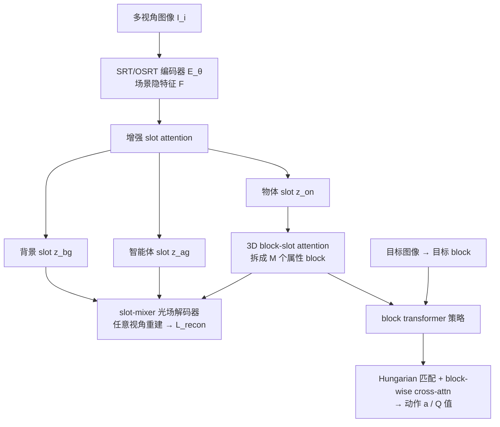

# 3D-aware Disentangled Representation for Compositional Reinforcement Learning

**会议**: ICLR 2026  
**OpenReview**: [https://openreview.net/forum?id=GE0IFoDx8a](https://openreview.net/forum?id=GE0IFoDx8a)  
**代码**: 待确认  
**领域**: 强化学习 / 物体中心表示  
**关键词**: object-centric representation, 3D disentanglement, block-slot attention, goal-conditioned RL, compositional generalization  

## 一句话总结
把"物体属性 → 离散 block"的结构化分解从 2D 搬到 3D 多视角空间，再用 block 级 cross-attention 的策略网络做目标条件强化学习，让机器人在没见过的属性组合、未见视角下仍能稳定地把物体推到目标位置。

## 研究背景与动机
**领域现状**：视觉强化学习里，物体中心表示（object-centric representation, OCR）是公认的"提效利器"——把一张图分解成一个个物体 slot，每个 slot 携带颜色、形状、大小、位置等属性，策略就能按物体粒度推理，样本效率和泛化性都比直接吃原始像素好。SysBinder 进一步把每个 slot 拆成若干 "block"，每个 block 绑定一类属性，实现了无监督的属性级分解。

**现有痛点**：这些方法绝大多数活在 2D 单视角里，带来两个硬伤。其一是**3D 感知缺失**——基于单张 2D 特征图或 UV 网格解码的 slot attention，没法可靠推断深度、遮挡、多视角一致性和物体的完整 3D 位姿，一旦环境里有遮挡或视角变化就崩。其二是**物体描述不精确**——无监督训练出来的 slot 常常对应 2D 特征图上的聚类（一块颜色、一片纹理），不保证每个 slot 真的就是一个可被机器人独立操纵的物理物体，属性的可操纵性很模糊。

**核心矛盾**：物体配置与相机位姿在 2D 投影里纠缠在一起，想在 3D 里做干净的物体中心分解，就必须先把"物体本身的属性"和"我从哪个角度看它"解耦开，而单视角表示天然做不到这件事。

**本文目标**：构造一个**视角无关的 3D 结构化表示**，把物体的形状/颜色/大小/3D 位置稳定地分解到固定的 block 上，再让策略直接吃这种分解后的表示，从而在新属性组合、未见视角的目标条件操纵任务上都能泛化。

**核心 idea**：`【3D + 结构化分解】` 用多视角 Transformer（SRT/OSRT）把场景抬升到 3D 光场表示解决视角纠缠，再在物体 slot 上叠加 block-slot attention 做属性级分解，最后用 `【block 级目标匹配】` 的 block transformer 策略——先按语义属性做 Hungarian 匹配、再在 block 粒度做 cross-attention——把目标条件规划的搜索空间压下来。

## 方法详解

### 整体框架
方法分两段：先**预训练 3D block-slot 编码器**学一个视角无关、属性可分解的场景表示，再**训练 block transformer 策略**把这套结构化表示喂给目标条件 RL。编码器用 SRT/OSRT 的多视角 Transformer 聚合多张图得到场景隐特征，经增强版 slot attention 分出背景/智能体/物体三类 slot，物体 slot 再拆成属性 block，由 slot-mixer 光场解码器在任意 query 视角下重建图像（novel view synthesis）训练；策略阶段则用预训练编码器抽取当前态与目标态的 block 表示，做 block 级匹配与 cross-attention 后输出动作与 Q 值。

### 关键设计

**1. 背景/前景/智能体的显式分工：给"谁能动"留好位置。** 普通 slot attention 把所有 slot 当成置换不变集合，但 RL 里必须分清"机器人臂"（主动元素）和"被推的物体"（被动元素），否则学不到直觉物理。本文不再让 slot 完全置换不变，而是**固定背景 slot $z_{bg}$ 和智能体 slot $z_{ag}$ 的索引**，剩下的才作为保持置换不变的物体 slot $\{z_{on}\}_{n=1}^{N-2}$。训练时用模拟器（或基础模型检测）提供的背景掩码 $m^{gt}_{bg}$ 和智能体掩码 $m^{gt}_{ag}$ 做辅助监督，损失衡量注意力加权区域与真值掩码区域的像素差：$L_{bg}=\sum_{(u,v)\in\Omega}\|w_{bg}(u,v)\hat{I}(u,v)-m^{gt}_{bg}(u,v)I(u,v)\|^2_2$，智能体损失 $L_{ag}$ 同理。总损失 $L_{total}=L_{recon}+\lambda_{bg}L_{bg}+\lambda_{ag}L_{ag}$ 把重建与掩码约束合在一起，这样既能"看到"机器人交互的物理后果，又稳定了策略训练。

**2. 3D block-slot attention：在 3D 物体上做属性分解，背景/智能体则保持原样。** 物体之间共享"形状/大小/颜色/位置"这类概念，背景和智能体却不共享，所以本文只对物体 slot 施加 block-slot attention、对背景与智能体 slot 沿用 vanilla slot attention，再把两套更新机制在全部 $N$ 个 slot 上混合。具体地，把每个物体 slot $z_n\in\mathbb{R}^{D_{slot}}$ 切成 $M$ 个属性 block $\{z_{n,m}\in\mathbb{R}^{D_{block}}\}$（$D_{slot}=MD_{block}$），对应的更新向量 $u_n$ 也等分成 $M$ 段，每个 block 用独立的 GRU 加 MLP 更新：$z_{n,m}=\mathrm{GRU}_{\phi_m}(z_{n,m},u_{n,m})$，再 $z_{n,m}\mathrel{+}=\mathrm{MLP}_{\phi_m}(\mathrm{LN}(z_{n,m}))$。每个 block 还对一块**概念记忆** $C_m\in\mathbb{R}^{K\times d}$（$K$ 个可学习原型向量）做点积注意力，相当于一个软信息瓶颈，逼着 block 去检索属于该属性的离散原型——训练完对 block 做 K-means 聚类或互换不同物体的同名 block，就能看出 block 确实分别编码了颜色、形状、大小、位置。这一步是把 SysBinder 的属性绑定能力第一次稳定地嫁接到 3D 多视角表示上。

**3. block transformer 策略：先按语义匹配、再在 block 粒度做 cross-attention。** 目标条件 RL 的难点是把当前态物体和目标态物体正确配对，尤其当两个物体同色时极易混淆。本文不用物体级 cross-attention，而是**先忽略位置、只用语义属性做 Hungarian 匹配**把当前态物体 $z^s_{on}$ 配到目标态物体 $z^g_{on'}$，再在 block 维度算 cross-attention：$H_n=\mathrm{CrossAttn}(z^s_{on},z^g_{on'})$，随后池化 $h_n=\mathrm{PoolAttn}(H_n)$。这样策略能直接"盯着属性"去匹配该操纵哪个物体、移到哪，把搜索空间显著压小。最后把所有物体特征连同当前/目标智能体 slot、当前动作 $a_t$ 一起送进自注意力 $P=\mathrm{SelfAttn}([h_1,\dots,h_{N-2},z^s_{ag},z^g_{bg},a_t])$，经 MLP 同时输出 actor 的动作和 critic 的 Q 值。block 级匹配正是它在"同色物体"和未见组合上碾压物体级 EIT 策略的关键。

## 实验关键数据

### 主实验表格
表示质量（novel-view synthesis PSNR + 分解 FG-ARI + DCI 分解度）：

| 数据集 | 方法 | PSNR | FG-ARI | D | C | I |
|---|---|---|---|---|---|---|
| Clevr3D | OSRT | 31.57 | 0.365 | 0.140 | 0.083 | 0.452 |
| Clevr3D | **Ours** | 31.11 | **0.942** | **0.867** | **0.789** | **0.844** |
| IsaacGym3D | OSRT | 27.35 | 0.321 | 0.403 | 0.222 | 0.769 |
| IsaacGym3D | **Ours** | 26.55 | **0.619** | **0.659** | **0.550** | **0.938** |

PSNR 与 OSRT 基本持平，但 FG-ARI（物体分解）和 DCI（属性解耦/完备/信息量）全面领先——说明额外的 block 分解没牺牲重建质量却换来了干净的结构。

目标条件 RL 成功率（IsaacGym 桌面推物，2 物体）：

| 表示 + 策略 | ID | CG | CG(同色) | OOD |
|---|---|---|---|---|
| DLPv2 + EIT | 0.984 | 0.747 | 0.388 | 0.422 |
| OSRT + EIT | 0.980 | 0.758 | 0.414 | 0.700 |
| Ours + EIT | 0.984 | 0.773 | 0.682 | 0.582 |
| **Ours + BT** | 0.967 | **0.895** | **0.837** | **0.828** |

ID 上各方法都接近饱和；真正拉开差距的是泛化场景——同色物体组合（CG same color）从基线的 ~0.4 跳到 **0.837**，OOD 未见颜色从基线 0.42/0.70 提到 **0.828**。

### 消融实验表格
视角泛化（训练只用前/左/右视角，测未见视角与单视角）：

| 设置 | ID | CG | CG(同色) | OOD |
|---|---|---|---|---|
| DLPv2+EIT, ID Multi-View | 0.984 | 0.747 | 0.388 | 0.422 |
| DLPv2+EIT, OOD Multi-View | 0.059 | 0.056 | 0.046 | 0.078 |
| **Ours+BT, ID Multi-View** | 0.967 | 0.895 | 0.837 | 0.828 |
| **Ours+BT, OOD Multi-View** | 0.948 | 0.877 | 0.818 | 0.865 |
| Ours+BT, ID Single-View | 0.891 | 0.705 | 0.700 | 0.727 |
| Ours+BT, OOD Single-View | 0.802 | 0.726 | 0.676 | 0.758 |

2D 基线一换视角直接崩到 ~0.05（per-view 位置编码过拟合视角特征），而本文换到未见视角几乎不掉点；即便训练用多视角、测试只给单视角也只有轻微下降（主要来自机器人自遮挡）。论文另在附录给出 block 数、原型数 $K$、掩码损失、slot/block-slot 混合结构的消融。

### 关键发现
- **结构化才是泛化的来源**：Ours+EIT 相比 OSRT+EIT 在 CG(同色) 上从 0.414 提到 0.682，证明 block 分解本身有效；再换成 BT 策略进一步到 0.837，说明"表示"和"策略"两层增益叠加。
- **3D 感知 = 视角无关**：换到训练分布外视角几乎零退化，是 2D 方法做不到的硬性区别。
- **单视角也够用**：单视角推理仍能保住泛化行为，说明编码器学到的 3D 属性能从单图推断，对部署友好。

## 亮点与洞察
- **把 SysBinder 的 block 分解第一次稳定迁到 3D**：以往属性级 block 分解只在 2D 静态图上成立，本文借光场解码器把它扩到多视角 3D 且能容纳遮挡与动态机器人交互，是表示侧的实打实推进。
- **"先语义匹配、再 block cross-attention"是个聪明的归纳偏置**：用 Hungarian 在属性空间配对、把位置剥离出去，恰好对症"同色/同形物体易混淆"这一 OCR 老大难，且让策略可解释（能看出它在比对哪条属性）。
- **背景/智能体/物体的显式分工**很务实——给"动作发出者"留专属 slot，符合机器人任务的因果结构，也稳住了 RL 训练。
- **可控生成顺带成立**：互换 block 即可在 3D 中合成新属性组合并保持多视角一致（甚至模拟遮挡），既是分解成功的证据，也提示这套表示能反过来做数据增强。

## 局限与展望
- **匹配假设偏刚性**：当前是当前态↔目标态的一对一静态属性匹配，遇到"多物体对应一个目标"这类多对一/动态对应就不够用，作者自己点名这是主要待解问题。
- **依赖掩码监督**：背景/智能体分解需要模拟器掩码或基础模型检测，真实世界里掩码质量会影响分解（附录有 suboptimal mask 分析，但仍是依赖项）。
- **实验局限在仿真桌面推物**：只在 Clevr3D/IsaacGym3D、两物体、属性维度有限（形状3/大小2/颜色若干）上验证，真实机器人、更复杂场景、更多物体的可扩展性未知。
- **展望**：作者指出 block 表示"类似语言 token"，有望桥接 3D 感知与 VLA（Vision-Language-Action）框架，这是个有想象力的方向。

## 相关工作与启发
- **3D 物体中心学习**：OSRT、COLF 用光场解码器快速分解静态场景，NeRF 系（uORF 等）用渲染损失训 slot，但都只在无交互静态场景上、无法推理动态物理——本文的差异是提供高度结构化的隐表示支撑系统化推理。
- **结构化物体中心表示**：SysBinder 的 block-slot 设计、Dreamweaver 的静/动态原语、DLP/DLPv2 的概率粒子表示，都缺显式 3D 推理；本文把 block 分解 + 3D 光场结合补上了这一环。
- **物体中心 RL**：POCR（what+where 嵌入）、ECRL（DLPv2 感知 + EIT 策略）、PaLM-E（slot 接语言模型）都在未见属性组合上栽跟头，正是本文 block 级匹配策略要攻克的痛点。
- **启发**：把"解耦表示"和"在解耦维度上做结构化匹配的策略"协同设计，比单独堆任一侧更有效；这种"表示的离散结构直接被策略消费"的思路，对需要组合泛化的具身智能任务（乃至 VLA）有普适借鉴价值。

## 评分
- **新颖性**: ⭐⭐⭐⭐ 把 block-slot 属性分解从 2D 抬到 3D 多视角、并配套设计 block 级匹配策略，组合新颖、对症 OCR 痛点；单个组件多为已有模块（SRT/OSRT、SysBinder、Hungarian、TD3）的巧妙拼装。
- **实验充分度**: ⭐⭐⭐⭐ 表示质量（PSNR/FG-ARI/DCI）+ RL 成功率（ID/CG/CG同色/OOD）+ 视角泛化（多/单视角）三层验证，对比 DLPv2/OSRT 与 EIT/BT 交叉对照，附录有多项消融；不足是只在仿真桌面推物、物体数与属性维度较小。
- **写作质量**: ⭐⭐⭐⭐ 动机与方法叙述清晰，图 1/2 把 pipeline 和 object-wise vs block-wise 对比讲得直观，公式与符号规范。
- **价值**: ⭐⭐⭐⭐ 在组合泛化和未见视角这两个 OCR-RL 真实痛点上给出可观提升，且指出通往 VLA 的延伸路径，对具身智能表示学习有实际参考价值。

<!-- RELATED:START -->

## 相关论文

- [\[ICLR 2026\] In-Context Compositional Q-Learning for Offline Reinforcement Learning](in-context_compositional_q-learning_for_offline_reinforcement_learning.md)
- [\[ICLR 2026\] Stackelberg Coupling of Online Representation Learning and Reinforcement Learning](stackelberg_coupling_of_online_representation_learning_and_reinforcement_learnin.md)
- [\[ICLR 2026\] ARM-FM: Automated Reward Machines via Foundation Models for Compositional Reinforcement Learning](arm-fm_automated_reward_machines_via_foundation_models_for_compositional_reinfor.md)
- [\[ICML 2026\] Decoupling Skeleton and Flesh: Efficient Multimodal Table Reasoning with Disentangled Alignment and Structure-aware Guidance](../../ICML2026/reinforcement_learning/decoupling_skeleton_and_flesh_efficient_multimodal_table_reasoning_with_disentan.md)
- [\[ICLR 2026\] A$^2$Search: Ambiguity-Aware Question Answering with Reinforcement Learning](a2search_ambiguity-aware_question_answering_with_reinforcement_learning.md)

<!-- RELATED:END -->
