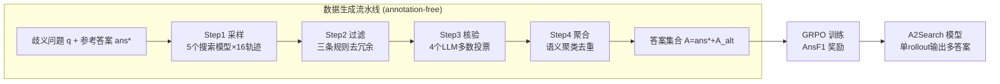

# A$^2$Search: Ambiguity-Aware Question Answering with Reinforcement Learning

**会议**: ICLR 2026  
**OpenReview**: [https://openreview.net/forum?id=3CPzUWIoNf](https://openreview.net/forum?id=3CPzUWIoNf)  
**代码**: [https://github.com/zfj1998/A2Search](https://github.com/zfj1998/A2Search)  
**领域**: 强化学习 / 智能体搜索 / 开放域问答  
**关键词**: Ambiguous QA, Reinforcement Learning, GRPO, Multi-hop QA, Annotation-free, AnsF1 Reward  

## 一句话总结
A$^2$Search 提出一条**无需人工标注**的自动流水线，从已有 QA 数据里挖掘"歧义问题"的多个合法答案，再用一个天然支持多答案的 AnsF1 奖励做 GRPO 强化学习，让 7B 模型单次 rollout 就在多跳 QA 上超过 32B 的强基线。

## 研究背景与动机
**领域现状**：在 LLM + 搜索工具 + RL 的范式下，Search-R1、ReSearch、AFM 等智能体搜索模型在开放域问答上进步飞快，靠多步推理、主动调用检索、整合证据拿到强性能。

**现有痛点**：几乎所有 QA benchmark 都默认"一题一个标准答案"，但现实并非如此——尤其是多跳问题，不同的推理链可以合法地到达不同结论。作者分析发现 MuSiQue 训练集里 **27.6%** 的样本其实存在多个有效答案。当前 RL 流水线只奖励那个被标注的 reference answer，把其他同样有证据支撑的 alternative answer 当成错误来惩罚。

**核心矛盾**：这种"单答案假设"导致**奖励信号本身是错的**——模型答对了另一个合法答案反而被扣分，既系统性低估了模型真实能力，也逼模型死守单一推理路径。而已有的歧义处理方案（AmbigQA、ASQA）依赖昂贵的人工重标注，且基本局限于单跳问题，没法扩展到 HotpotQA、MuSiQue 这类多跳数据集。

**本文目标**：构建一个端到端、零标注的训练框架，让模型既能**感知问题是否有歧义**，又能在证据支持时**一次性给出多个有效答案**。

**核心 idea**：`[自动挖掘多答案 + 多答案友好奖励]` —— 不去人工标注，而是利用现成的强搜索模型采样轨迹、用 LLM 做证据核验，自动把"还有哪些答案也对"挖出来；再把 reward 从"匹配单一答案"换成衡量答案集合覆盖度的 AnsF1，让 RL 自然地学会拥抱歧义。

## 方法详解

### 整体框架
A$^2$Search 分两段：先用一条**四步自动流水线**为歧义问题挖出 alternative answers，把训练数据从"单答案"扩成"答案集合" $A=\{ans^*, A_{alt}\}$；再用 **GRPO + AnsF1 奖励**做端到端 RL，让模型在多步推理与工具调用中学会按证据输出多个答案。

### 关键设计

**1. 证据驱动的四步答案挖掘：把"还有哪些答案也对"自动挖出来**
流水线的目标是：给定问题 $q$ 和参考答案 $ans^*$，自动产出一组互相语义不同、与参考答案也不同、且每个都能独立验证的 alternative answers $A_{alt}$。**Step 1 采样**用 5 个已经训练好的搜索模型（ReSearch-7B/32B、Search-R1-7B/14B/32B）各为每题生成 16 条轨迹 $\tau=(a_1,o_1,\dots,a_T)$，动作分推理、工具调用、给答案三类，从 49,938 题里堆出约 399 万条轨迹。**Step 2 过滤**用三条直觉规则做粗筛：和参考答案语义等价的丢掉、某模型 16 次都答不出参考答案则说明它没能力解这题（整组丢掉）、完全相同的答案只留一条代表，筛完只剩 5.2%（20.8 万条）。**Step 3 核验**是关键，用 4 个闭源 LLM（Claude 3.5/3.7 Sonnet、o3、o4-mini）各给"是否有充分证据支撑该答案"投一票，多数投票聚合：

$$\text{Verify}(q,\tau,\hat{ans})=\begin{cases}1,& \frac{1}{K}\sum_{k=1}^{K}z_k\geq\eta\\0,& \text{otherwise}\end{cases}$$

阈值 $\eta=3$（即 4 票里至少 3 票支持），人工抽检一致率达 96%，最终留下 19,529 条轨迹。**Step 4 聚合**再用 LLM 把"NDZ↔Nkosazana Dlamini-Zuma""five↔5"这类词面不同但语义等价的答案聚类合并，每簇选一个代表答案、其余作为别名。整条流水线把闭源大模型当"标注工厂"，避开了人工重标注，最终给 19.0% 的问题挖到了多答案。

**2. AnsF1 奖励：让单一标量天然容纳多个正确答案**
传统 EM 奖励无法表达"答案集合"，作者设计了答案级 F1。设模型一次 rollout 产出 preds 个答案、命中 hits 个参考答案、共有 refs 个参考答案，则 $\text{Precision}=hits/preds$、$\text{Recall}=hits/refs$、$\text{AnsF1}=2\cdot\frac{\text{Precision}\cdot\text{Recall}}{\text{Precision}+\text{Recall}}$。完整奖励为：

$$R(q,\hat{ans})=\begin{cases}0,& \text{格式非法}\\0.1,& \text{格式合法但 hits}=0\\1-\alpha(1-\text{AnsF1}),& \text{格式合法且 hits}>0\end{cases}$$

格式合法要求至少一次成功工具调用、有推理块、且恰好一个可解析的 answer 块。这个奖励的妙处在于：**覆盖更多合法答案能加分（提 recall），但乱答一通会被惩罚（preds 变大压低 precision）**，从而在多答案场景下平衡精确率与召回率；$\alpha=0.4$ 控制"格式对但全错"与"部分正确"之间的落差，避免奖励过于稀疏。

**3. GRPO + 工具交互式 rollout：把多步搜索串进策略优化**
RL 算法用 GRPO，免去 PPO 那套独立 critic，直接从一组 $G$ 个 rollout 里估计 baseline：

$$\mathcal{J}(\theta)=\mathbb{E}\left[\frac{1}{G}\sum_{i=1}^{G}\min\left(\frac{\pi_\theta(y_i|x)}{\pi_{\theta_{old}}(y_i|x)}A_i,\ \text{clip}\left(\frac{\pi_\theta(y_i|x)}{\pi_{\theta_{old}}(y_i|x)},1-\epsilon,1+\epsilon\right)A_i\right)\right]$$

其中 $A_i=(r_i-\text{mean}(\{r_j\}))/\text{std}(\{r_j\})$ 是组内归一化优势，并按近期实践丢掉 KL 惩罚项。rollout 被建模成策略与搜索工具的迭代交互：每步状态 $s_t$ 是累积的问题+历史动作+工具返回，策略采样推理/工具调用/给答案三类动作直到 EOS。训练时**工具返回的 token 用 mask 排除在策略损失之外**（因为那是外部检索器生成的，不该归功/归咎于策略），保证梯度只更新模型自己产出的内容。

## 实验关键数据

### 主实验表格（四个多跳 benchmark，Exact Match，AnsF1/Recall）

| 模型 | 规模 | Macro-Avg AnsF1@1 | Macro-Avg @3 (AnsF1/Recall) |
|------|------|------|------|
| Search-R1 | 3B | 32.2 | 33.1 / 36.5 |
| AFM-MHQ | 3B | 35.5 | 37.4 / 46.6 |
| SinSearch（同设置无多答案） | 3B | 35.8 | 37.7 / 43.2 |
| **A$^2$Search** | **3B** | **43.1** | **44.9** |
| ReSearch | 32B | 46.2 | — |
| **A$^2$Search** | **7B** | **48.4** | — |

- A$^2$Search-7B 仅用**单次 greedy rollout** 拿到 48.4% AnsF1@1（LMJudge 下 62.7%），**超过 32B 的 ReSearch（46.2% / 60.7%）**，远超 ReSearch-7B（39.3% / 53.6%）。
- 连 3B 版都达到 43.1% / 55.3%，已胜过多数更大的基线，凸显训练范式的效率优势。

### 消融实验 / 关键设置

| 维度 | 设置 / 结果 |
|------|------|
| 核验阈值 $\eta$ | $\eta=3$：人工一致率 96%，留 9.4% 轨迹（精度/覆盖折中最优）|
| 奖励系数 $\alpha$ | 0.4（控制全错 vs 部分正确的奖励落差）|
| 答案数据规模 | 19.0% 问题获得 alternative answers，共 19,529 条核验轨迹 |
| 平均输出答案数 | A$^2$Search-7B 每题 1.51 个、3B 每题 1.23 个（按证据而非乱答）|

### 关键发现
1. **单 rollout 顶得上别人三 rollout**：A$^2$Search 单次贪心解码的 recall 就追平甚至超过基线 @3 的表现，推理成本大幅降低。
2. **SinSearch 对照证明多答案数据本身有效**：同样训练设置、同样问题，只用单参考答案的 SinSearch 明显逊于 A$^2$Search，说明增益来自"挖多答案"这一步。
3. **AbgSearch 对照证明流水线的泛化价值**：直接在人工标注的 AmbigQA 上训练的 AbgSearch 只在 AmbigQA 上好、换数据集就垮；而 A$^2$Search 完全没用 AmbigQA 数据，却在 AmbigQA 上反超它。
4. **训练稳定**：3B/7B 四个 epoch 内 AnsF1 与 Recall 稳步上升无崩塌，熵曲线无过早坍缩，框架还能泛化到 Qwen2.5-Base 与 Llama 系列。

## 亮点与洞察
- **把"奖励信号错了"作为切入点**：很多工作在卷模型/卷算法，本文敏锐地指出问题出在 benchmark 的单答案假设导致 RL 奖励系统性失真，这是一个被长期忽视但影响面很广的根因。
- **用强搜索模型 + 闭源 LLM 验证器搭"自动标注工厂"**：trajectory sampling（谁能答出来）+ evidence verification（答案有没有证据）的组合，把"哪些答案也对"这件原本要人工做的事自动化且做到 96% 一致率，可扩展到多跳数据。
- **AnsF1 奖励是点睛之笔**：单一标量同时编码了"该多答时多答、不该多答时别瞎答"的精召平衡，让 GRPO 不需要任何结构改动就能学多答案行为，平均每题 1.23~1.51 个答案说明模型确实学会了按需输出。

## 局限与展望
- **依赖闭源大模型做验证器**：核验阶段用了 Claude 3.5/3.7、o3、o4-mini 四个闭源模型，成本与可复现性受限（附录虽给出开源验证器集合可逼近，但仍是折中）。
- **证据核验的"证据"来自采样轨迹**：alternative answer 的合法性建立在采样模型检索到的证据上，若检索语料（2018 Wikipedia dump）本身有偏或过时，可能把过时/错误答案当成合法答案保留。
- **歧义定义偏"多答案"**：方法聚焦"一题多个合法答案"，对"问题本身指代不清需要澄清"这类歧义（需反问用户）没有覆盖。
- **评测仍部分依赖 LLMJudge**：AnsF1 在 LMJudge 方案下用 Qwen2.5-32B 判等，判等标准的稳定性会影响绝对数值。

## 相关工作与启发
- **搜索增强 RL 智能体**（Search-R1、ReSearch、AFM）：本文站在它们肩上——既复用它们的采样轨迹做数据挖掘，又把它们当作被超越的强基线，形成一个"用旧模型造数据训新模型"的闭环。
- **歧义 QA 数据集**（AmbigQA、ASQA）：它们靠人工重标注且局限单跳，本文的核心差异化正是"无标注 + 可扩展到多跳"。
- **启发**：当 RL 训练效果不及预期时，先别急着改算法，回头审视**奖励信号是否准确刻画了任务的真实目标**——"标准答案"本身可能就是噪声源。这套"采样→证据验证→重构奖励"的思路对任何存在多解/主观性的任务（代码生成、开放式推理、检索）都有借鉴价值。

## 评分
- **新颖性**: ⭐⭐⭐⭐ —— 把"benchmark 单答案假设导致 RL 奖励失真"作为切入点，配合 annotation-free 多答案挖掘 + AnsF1 奖励，问题定位精准、解法干净。
- **实验充分度**: ⭐⭐⭐⭐⭐ —— 8 个 benchmark、3B/7B/Base/Llama 多规模、SinSearch/AbgSearch 两组对照消融、训练动态与 η/α 消融齐全，结论扎实。
- **写作质量**: ⭐⭐⭐⭐ —— 动机讲得清楚（27.6% 歧义比例、Figure 1 例子很有说服力），流水线四步与奖励设计交代完整。
- **价值**: ⭐⭐⭐⭐⭐ —— 7B 单 rollout 超 32B、零标注可扩展、思路可迁移到其他多解任务，工程与方法价值都高，且开源代码/数据/权重。

<!-- RELATED:START -->

## 相关论文

- [\[ICLR 2026\] QuRL: Rubrics As Judge For Open-Ended Question Answering](qurl_rubrics_as_judge_for_open-ended_question_answering.md)
- [\[CVPR 2026\] ReAG: Reasoning-Augmented Generation for Knowledge-based Visual Question Answering](../../CVPR2026/reinforcement_learning/reag_reasoning-augmented_generation_for_knowledge-based_visual_question_answerin.md)
- [\[ICLR 2026\] REA-RL: Reflection-Aware Online Reinforcement Learning for Efficient Reasoning](rea-rl_reflection-aware_online_reinforcement_learning_for_efficient_reasoning.md)
- [\[ICLR 2026\] Erase to Improve: Erasable Reinforcement Learning for Search-Augmented LLMs](erase_to_improve_erasable_reinforcement_learning_for_search-augmented_llms.md)
- [\[ICLR 2026\] QuestA: Expanding Reasoning Capacity in LLMs via Question Augmentation](questa_expanding_reasoning_capacity_in_llms_via_question_augmentation.md)

<!-- RELATED:END -->
