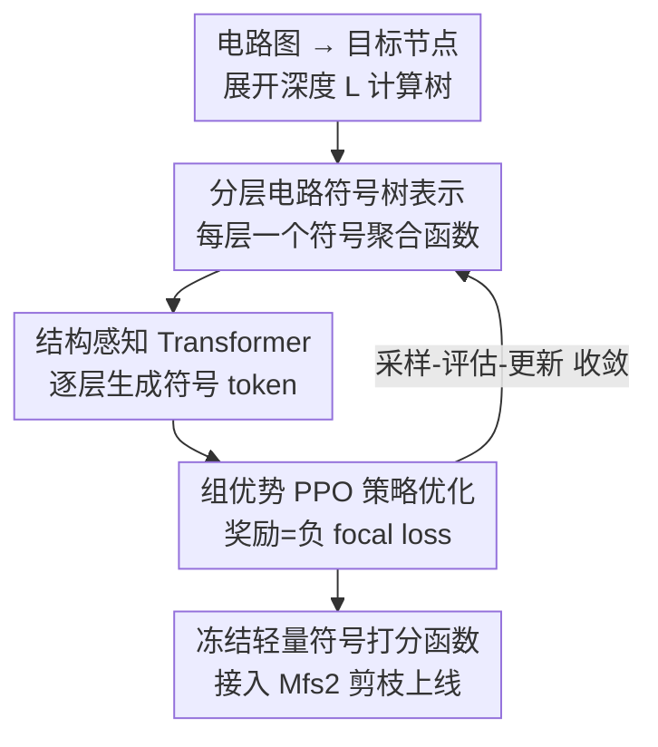

# A Hierarchical Circuit Symbolic Discovery Framework for Efficient Logic Optimization

**会议**: ICLR2026  
**OpenReview**: [https://openreview.net/forum?id=YaXSEbRrHP](https://openreview.net/forum?id=YaXSEbRrHP)  
**代码**: https://github.com/MIRALab-USTC/HIS  
**领域**: 强化学习 / 符号发现 / 逻辑优化(EDA)  
**关键词**: 逻辑优化, 符号回归, 分层符号树, PPO, 可解释 GNN 蒸馏

## 一句话总结
HIS 用一棵「分层符号树」把 GNN 的逐层消息传递蒸馏成一个轻量、可解释的符号打分函数，并用结构感知 Transformer + 组优势 PPO 端到端地把这棵树「生成」出来，从而在芯片设计的逻辑优化（LO）里又快又准地识别无效变换——相比 SOTA 的 GNN 推理快约 296×，接入 Mfs2 启发式后平均运行时间降 27.22%、电路规模再减 6.95%。

## 研究背景与动机
**领域现状**：逻辑优化（Logic Optimization, LO）是芯片前端 EDA 流程里的核心环节，目标是在保持功能等价的前提下缩小电路（用有向无环图建模）的规模与深度。工业界靠 Mfs2、Resub、Rewrite 这类启发式来近似求解这个 NP-hard 问题，做法都是对每个节点为根的子图逐个尝试变换。

**现有痛点**：Mfs2 这类启发式之所以慢，是因为大量节点级变换其实是**无效**的——做了也不缩小电路。于是近年有人提出「剪枝框架」：用一个打分函数提前预测哪些节点的变换无效、直接跳过。打分函数有两条路线，但都各有硬伤：(1) Effisyn 这种人工设计的轻量数学表达式，跑得快但抓不住子图的结构信息，优化质量差；(2) COG 这种精心设计的 GNN，能吃透结构信息、召回率高，但**推理太贵、且是黑盒**——在纯 CPU 的工业部署环境里，GNN 的复杂架构和大参数量基本没法用，可解释性差也让工程师不敢信。

**核心矛盾**：打分函数同时被三个目标拉扯——**准（召回率高）、快（CPU 可部署）、可解释**。GNN 占了「准」却丢了「快」和「可解释」；人工表达式占了「快、可解释」却丢了「准」。两条路线无法兼得。

**本文目标**：直接学出一个三者兼顾的符号打分函数——既要像 GNN 那样捕获电路子图的多层结构信息，又要像数学表达式那样轻量、透明。

**切入角度**：作者观察到 GNN 的强表达力本质来自**逐层消息传递**——每一层从邻居聚合信息、把局部结构逐步汇聚成全局表征。那么能不能把「每一层的聚合」各自写成一个符号函数，逐层堆叠，从而用一棵符号树复刻 GNN 的分层聚合？

**核心 idea**：用一棵**分层符号树**（每层一个符号聚合函数，模仿 GNN 的逐层消息传递）替代 GNN 当打分函数，并用**结构感知 Transformer + 组优势 PPO** 把这棵树端到端地搜索出来，无需过程标签。

## 方法详解

### 整体框架
HIS 要解决的问题是：给定电路图，对每个节点输出一个「这次变换是否有效」的分数，用来在 Mfs2 里剪掉无效变换。它的做法分三步串起来：先把目标节点的子图展开成一棵深度 $L$ 的**计算树** $T^L_{v_0}$（论文取 $L=2$，对齐 2 层 GNN），提供 5 维结构特征；然后用一棵**分层符号树**对这棵计算树逐层聚合、最终在根节点输出分数；这棵符号树本身不是手写的，而是由 $L$ 个**结构感知 Transformer 策略**逐层生成、再用 **PPO** 按节点分类的奖励优化出来的。训练完成后，学到的符号函数被冻结成一个轻量打分器，挂到 Mfs2 的剪枝框架里上线。

### 关键设计

**1. 分层电路符号树表示：把 GNN 的逐层消息传递写成一棵可读的符号树**

这是全文的灵魂设计，针对「GNN 准但黑盒又贵」的痛点。作者不再把节点特征喂进一个整体符号函数，而是仿照 GNN 的分层结构，让符号树也分成 $L$ 层：计算树第 $i$ 层的每个节点，用该层对应的符号函数 $F_i$ 从它的邻居聚合信息、更新特征，逐层向根收敛。形式化地，聚合写成

$$\hat{H}_{v_{i-1}} = F_i\!\left(\hat{H}_{v_i},\, H_{v_{i-1}}\right) \ (i>0), \qquad \text{score} = F_0\!\left(\hat{H}_{v_0}\right)\ (i=0),$$

即高层节点的更新特征 $\hat{H}_{v_i}$ 与本层原始特征 $H_{v_{i-1}}$ 一起喂给 $F_i$，得到下一层的更新特征，直到根节点 $v_0$ 输出分数。每个 $F_i$ 用一棵符号树表达，叶子是特征或常数、内部节点是运算符。符号库刻意做得很小：数学算子 $\{+,-,\times,\div,\log,\exp\}$、常数 $\{0.1,0.2,0.5\}$，外加四个**聚合算子** $\{\min,\max,\text{mean},\text{sum}\}$，每个把第 $i$ 层特征按边连接关系映射到第 $i-1$ 层（$\mathbb{R}^{n_i}\!\to\!\mathbb{R}^{n_{i-1}}$，只聚合相邻节点）。这些聚合算子扮演的正是 GNN 里 AGGREGATE 的角色，让符号函数也能捕获结构信息。更新特征维度 $d=10$。这样一来，符号树既保留了 GNN 的分层结构感知力，又因为只是几个符号算子的组合而极度轻量、白盒——后续实验里推理比 GNN 快两百多倍正源于此。

**2. 结构感知 Transformer：把「生成一棵树」变成带父/兄信息的序列生成**

有了符号树的目标形式，怎么自动搜出来？作者把符号树用**前序遍历序列** $\tau=\{\tau_1,\dots,\tau_n\}$ 表示，于是「生成符号树」就变成「逐 token 生成序列」，整棵树的概率按链式法则分解 $p_\theta(\tau)=\prod_i p_\theta(\tau_i\mid\tau_{<i})$。为每一层配一个 encoder-only Transformer 策略 $\pi_{\theta_i}$，专门生成该层的符号函数。但标准 Transformer 抓不住符号表达式的**树结构依赖**，纯按线性序列生成容易跑出劣质表达式。针对这点，作者加了一个**树感知嵌入聚合**：生成 token $\tau^i_k$ 时，先定位它在符号树里的**父节点** $\tau^i_{p_k}$ 和**兄弟节点** $\tau^i_{s_k}$，分别编码成 $\beta_p,\beta_s$，过若干 encoder 层后，把父、兄的嵌入向量**取平均**作为当前 token 的表征，再 softmax 得到下一个 token 的分布。直白说就是「下一个符号该填什么，要看它在树上挂在谁下面、旁边是谁」，把树的拓扑显式注入序列生成，消融里去掉它召回率大幅下滑。

**3. 组优势 PPO：符号树不可微，就用免 critic 的强化学习把它训出来**

符号树相对模型参数 $\theta$ 不可微，没法直接反传，所以作者把序列生成建模成强化学习：Transformer 是策略网络，已采样的 token 是状态，每生成一个 token 是一个动作，一整条序列是一个 episode，奖励只在表达式生成完后作为终止信号给出。每个 episode 采样一组 $m$ 个符号表达式，用 PPO 的裁剪目标更新策略：

$$J(\theta)=\mathbb{E}_{\tau}\Big[\min\big(\tfrac{p_\theta(\tau)}{p_{\theta_{old}}(\tau)}A_{\theta_{old}}(\tau),\ \text{clip}(\tfrac{p_\theta(\tau)}{p_{\theta_{old}}(\tau)},1-\epsilon,1+\epsilon)A_{\theta_{old}}(\tau)\big)\Big].$$

关键改动是**不训练 critic 网络**估优势，而是借鉴组内归一化（类 GRPO）思路，把优势定义为该序列奖励相对**组内均值**的标准化值 $A_\theta(\tau)=\frac{r(\tau)-\bar r}{\sigma_r}$，省掉了 critic 的算力开销、训练也更稳。奖励本身是节点分类的负 **focal loss**：$r(\tau)=-\frac1n\sum_i\big[\alpha y_i(1-\hat y_i)^\gamma\log\hat y_i+(1-\alpha)(1-y_i)\hat y_i^\gamma\log(1-\hat y_i)\big]$，其中 $\hat y_i=\tau(T^L_{v_i})$ 是符号树对节点的预测分。focal loss 是为了对付有效/无效节点的类别不平衡。整套 RL 让模型在「采样符号树 → 算召回奖励 → 更新策略」的循环里逐步搜出高质量表达式。

### 损失函数 / 训练策略
奖励用 focal loss 衡量符号树对节点（有效/无效变换）的分类质量，平衡因子 $\alpha$ 处理类别不平衡；优势用组内奖励标准化、免 critic；策略用 PPO 裁剪目标更新。训练数据 $D=\{(T^L_{v_i},y_i)\}$ 通过遍历电路图全部节点构造，每个节点初始化 5 维结构特征，计算树深度 $L=2$、更新特征维度 $d=10$。后端 LO 框架用开源的 ABC，目标启发式选最耗时的 Mfs2。

## 实验关键数据

### 主实验
在 EPFL（20 电路，最大 21.4 万节点）与 IWLS（21 电路）两个公开 benchmark 上评测，采用跨 benchmark 泛化策略（一个 benchmark 训练、另一个的难电路测试）。离线看 top 50% 预测召回率（预测为正的节点里真正有效的比例）：

| 电路 | COG (GNN) | CMO | Effisyn | Random | HIS (本文) |
|------|-----------|-----|---------|--------|-----------|
| Hyp | 0.87 | 0.79 | 0.18 | 0.50 | 0.82 |
| Square | 0.81 | 0.94 | 0.04 | 0.48 | 0.94 |
| Multiplier | 0.82 | 0.87 | 0.13 | 0.44 | **0.94** |
| DesPerf | 0.81 | 0.79 | 0.28 | 0.50 | 0.83 |
| Ethernet | 0.55 | 0.59 | 0.88 | 0.47 | **0.99** |
| Conmax | 0.75 | 0.73 | 0.05 | 0.50 | 0.75 |

HIS 在多数电路上召回超 80%，整体优于黑盒 GNN（COG）与符号增强基线（CMO）。在线运行时间上，达到可比优化质量时 HIS-Mfs2 相对 CMO/Effisyn/Random/COG-Mfs2 平均提速 11.96% / 21.82% / 19.24% / 22.91%。

接入 Mfs2 的端到端 QoR（k=50% 时平均运行时间降 40.27%，规模/层级仅劣化约 0.38%；Hyp 上最高 3.1× 提速）：

| 设置 | 规模/层级平均改善 | 运行时间平均改善 |
|------|------------------|------------------|
| HIS-Mfs2 (k=50%) | −0.38%（几乎不掉） | **40.27%** |
| 2HIS-Mfs2 (k=40%，重优质量) | 7.43% | 7.82% |
| 2HIS-Mfs2 (k=30%，重运行时间) | 6.95% | **27.22%** |

因为 HIS-Mfs2 跑得快，作者还把它**连跑两次**（2HIS-Mfs2）进一步压缩电路，仍比默认 Mfs2 又快又小。

### 消融实验

| 配置 | Hyp | Multiplier | Square | DesPerf | Ethernet | Conmax | 说明 |
|------|-----|-----------|--------|---------|----------|--------|------|
| HIS (Full) | 0.82 | 0.94 | 0.94 | 0.83 | 0.99 | 0.75 | 完整模型 |
| w/o hierarchical | 0.81 | 0.91 | 0.74 | 0.77 | 0.81 | 0.72 | 端到端学整棵树、不分层 |
| w/o group optimization | 0.88 | 0.89 | 0.90 | **0.51** | 0.87 | 0.74 | 用单条奖励代替组优势 |
| w/o tree-structured aggregation | 0.81 | **0.51** | 0.94 | 0.79 | 0.91 | 0.75 | 去掉父/兄嵌入聚合 |

### 关键发现
- **分层表示是结构感知的关键**：去掉分层（一次性学整棵树）后 Square 从 0.94 掉到 0.74、Ethernet 从 0.99 掉到 0.81，说明逐层聚合才是复刻 GNN 多层结构信息的核心。
- **树感知聚合在结构复杂电路上至关重要**：去掉父/兄嵌入聚合后 Multiplier 直接腰斩到 0.51，印证「下一个符号该填什么要看树上的位置」这件事不可省。
- **组优势提升稳定性**：去掉组优化后 DesPerf 暴跌到 0.51，组内归一化的优势对泛化很重要。
- **推理极快**：纯 CPU 下 HIS 比 SOTA 的 GNN（COG）在 EPFL 上快约 296×、IWLS 上快约 254×，同时保持轻量基线级别的推理时延——这正是它能上工业部署的底气。

## 亮点与洞察
- **「把 GNN 拆成逐层符号函数」这一刀切得很妙**：不是事后蒸馏一个整体表达式（那需要大量过程标签、且抓不住结构），而是直接让符号树的层结构对齐 GNN 的消息传递层，端到端地学，既保结构感知又保可解释——这个「分层对齐」的思路可迁移到任何想把 GNN 蒸成白盒函数的场景。
- **把符号库里塞进聚合算子 $\{\min,\max,\text{mean},\text{sum}\}$**：让符号函数天然能跨邻居聚合，是它能模仿 GNN 的技术前提，比只有四则运算的传统符号回归表达力强得多。
- **免 critic 的组优势 PPO**：在符号回归这种「奖励是终止信号、序列短、采样便宜」的设定里，用组内标准化奖励替代 critic 既省算力又更稳，和近期 LLM RL 里的 GRPO 思路同源，迁移性强。
- **真正落到工业痛点**：296× 推理加速 + 纯 CPU 部署 + 白盒可读，三件事凑齐才是 EDA 工具敢用 ML 的前提，论文没有只刷 benchmark 而是端到端接进 Mfs2 验证 QoR。

## 局限与展望
- **深度固定 $L=2$**：对齐 2 层 GNN，更深的结构依赖（更大感受野）能否被符号树有效表达、会不会让搜索空间爆炸，论文未充分探讨。
- **泛化策略相对粗放**：跨 benchmark 训练/测试只选了少数难电路，对超大规模或风格迥异电路的泛化稳健性还需更系统验证；消融里个别配置（如 w/o group 在 Hyp 上反而更高 0.88）说明各模块收益依电路而异。
- **只验证了 Mfs2 一种启发式**：虽是最耗时的，但 Resub/Rewrite 等其它启发式上的收益尚待确认。
- **符号库与算子集人工设定**：算子、常数集合是手选的，是否对结果敏感、能否自动扩展符号库是可改进方向。

## 相关工作与启发
- **vs COG（GNN 打分函数）**: COG 用 2 层 GNN 抓结构信息、召回率高，但推理贵且黑盒，无法在纯 CPU 工业环境部署；HIS 把它蒸成分层符号树，召回相当但推理快约 296× 且可解释，这是本文最直接的对标对象。
- **vs Effisyn（人工数学表达式）**: Effisyn 轻量可解释但抓不住子图结构，召回率在多数电路上极低（如 Square 仅 0.04）；HIS 通过符号库里的聚合算子 + 分层结构补上了结构感知能力。
- **vs CMO / 图增强符号学习**: CMO 也是图增强的符号学习，但难以有效捕获电路结构、性能次优；HIS 用分层符号树 + 树感知 Transformer 显式建模树拓扑，泛化更强。
- **vs Cranmer et al. (从训练好的 GNN 蒸馏符号函数)**: 那类方法需要大量过程标签、先训 GNN 再拟合，扩展性受限；HIS 端到端、无需过程标签直接搜结构符号函数。

## 评分
- 新颖性: ⭐⭐⭐⭐⭐ 「分层符号树对齐 GNN 消息传递 + 树感知 Transformer + 组优势 PPO」组合在 ML4EDA 里是首个，思路干净。
- 实验充分度: ⭐⭐⭐⭐ 两 benchmark、跨域泛化、端到端接 Mfs2、三项消融都做了；但只验一种启发式、深度固定，覆盖面可再扩。
- 写作质量: ⭐⭐⭐⭐ 动机—方法—实验链条清晰，公式与图配合到位；部分符号记号较密集需对照原图。
- 价值: ⭐⭐⭐⭐⭐ 296× 推理加速 + CPU 可部署 + 白盒 + 接入真实启发式降 27% 运行时间，直击 EDA 工业落地痛点。

<!-- RELATED:START -->

## 相关论文

- [\[ICLR 2026\] EGG-SR: Embedding Symbolic Equivalence into Symbolic Regression via Equality Graph](egg-sr_embedding_symbolic_equivalence_into_symbolic_regression_via_equality_grap.md)
- [\[ICLR 2026\] AutoQD: Automatic Discovery of Diverse Behaviors with Quality-Diversity Optimization](autoqd_automatic_discovery_of_diverse_behaviors_with_quality-diversity_optimizat.md)
- [\[AAAI 2026\] DeepProofLog: Efficient Proving in Deep Stochastic Logic Programs](../../AAAI2026/reinforcement_learning/deepprooflog_efficient_proving_in_deep_stochastic_logic_programs.md)
- [\[ICLR 2026\] Parameter-Efficient Reinforcement Learning using Prefix Optimization](parameter-efficient_reinforcement_learning_using_prefix_optimization.md)
- [\[ICLR 2026\] FAPO: Flawed-Aware Policy Optimization for Efficient and Reliable Reasoning](fapo_flawed-aware_policy_optimization_for_efficient_and_reliable_reasoning.md)

<!-- RELATED:END -->
