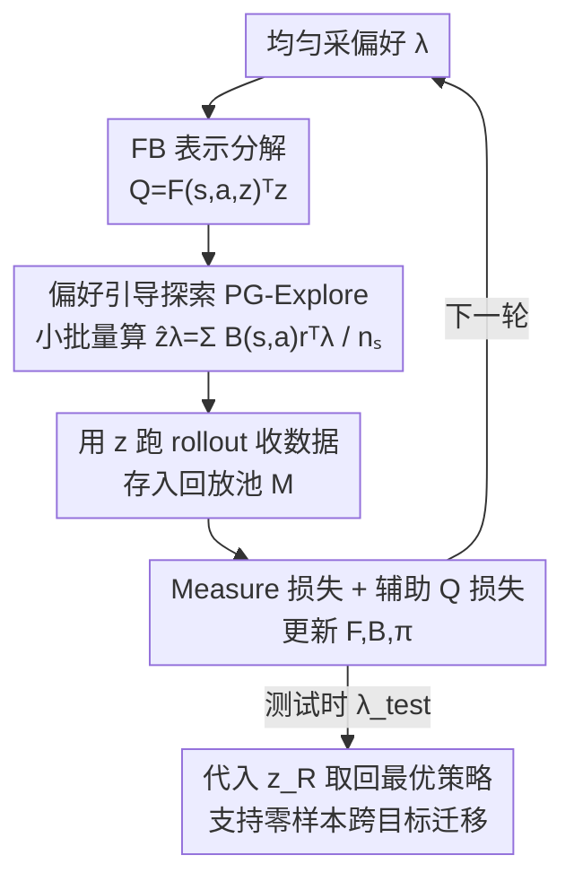

# A Reward-Free Viewpoint on Multi-Objective Reinforcement Learning

**会议**: ICLR 2026  
**OpenReview**: [https://openreview.net/forum?id=IwiwmY3Mzz](https://openreview.net/forum?id=IwiwmY3Mzz)  
**代码**: https://rl-bandits-lab.github.io/MORL-FB/  
**领域**: 强化学习 / 多目标 RL  
**关键词**: 多目标强化学习, 无奖励强化学习, Forward-Backward 表示, 偏好引导探索, 辅助任务

## 一句话总结
本文首次把无奖励强化学习（RFRL）的 Forward-Backward 框架搬到多目标强化学习（MORL）上，提出 MORL-FB：用偏好引导的探索构造与 MORL 任务真正相关的潜向量 $z$，再配一个辅助 Q 损失，让一个偏好条件策略在 MO-Gymnasium 上以更高样本效率显著超过 PD-MORL、Q-Pensieve 等 SOTA。

## 研究背景与动机
**领域现状**：很多决策任务要同时优化多个相互冲突的目标——机器人控制里要在「省能耗」和「跑得快」之间权衡。MORL 的主流可扩展做法是训一个**偏好条件策略网络** $\pi(s, \lambda)$：把 $d$ 维奖励向量按用户偏好 $\lambda$ 线性加权成标量奖励 $\lambda^\top R(s,a)$，训练时在采样到的一批偏好上优化，测试时用户给定 $\lambda$ 就取对应策略。由于测试偏好 $\lambda_{\text{test}}$ 训练时未知，目标是学一组覆盖整个帕累托前沿的策略。

**现有痛点**：MORL 在线性标量化下其实只需要学「已知目标的线性组合」对应的最优策略，知识共享被局限在这个狭窄的奖励子空间里。当目标数 $d$ 增大（如 Humanoid5d），PD-MORL、Q-Pensieve 这类方法明显掉点，泛化能力和样本效率都不够。

**核心矛盾**：另有一条独立发展的路线——无奖励强化学习（RFRL）——其实在解一个高度相似的问题：训练时不看奖励信号，却要为**任意**奖励函数学出最优策略。理论上 MORL 是 RFRL 的特例（RFRL 不限定奖励必须是预定义目标的加权和），但此前从没有工作把 RFRL 方法显式用来解 MORL。

**本文目标**：能不能让 RFRL「反哺」MORL？把「为任意奖励学最优策略」当成 MORL 的**辅助任务**，借更宽的奖励谱系实现更有效的知识共享，从而加速 MORL。

**切入角度**：直接拿 SOTA 的 RFRL 算法（Forward-Backward, FB）套到 MORL 上其实表现很差——纯无奖励探索不会优先访问那些对优化「偏好加权奖励」至关重要的状态，学出的策略对 MORL 而言是次优的。作者观察到症结在 FB 训练时**采样潜向量 $z$ 的分布**：原版 FB 从标准正态 $\mathcal{N}(0, I_{d_z})$ 采 $z$，这跟 MORL 真实奖励诱导出的 $z_R$ 差很远。

**核心 idea**：用偏好加权奖励来「引导」$z$ 的采样（PG-Explore），让训练聚焦在跟 MORL 测试奖励真正相关的潜空间区域，再补一个直接用观测奖励向量的辅助 Q 损失——这就是 MORL-FB。

## 方法详解

### 整体框架
MORL-FB 建立在 Forward-Backward（FB）表示之上。FB 把「某个标量奖励 $R$ 下最优策略」的 Q 值分解成两个网络的内积：前向表示 $F_\theta(s,a,z_R)$ 和后向表示 $B_\omega(s,a)$，

$$Q(s,a,z_R) = F_\theta(s,a,z_R)^\top z_R,$$

其中 $z_R \in \mathbb{R}^{d_z}$ 是一个 $d_z$ 维潜向量，用来编码「当前奖励函数对应的最优策略」。一旦给定奖励 $R$，潜向量由后向表示对奖励的加权期望算出：

$$z_R = \mathbb{E}_{(s,a)\sim \mathcal{D}}\big[B_\omega(s,a) R(s,a)\big],$$

对应的贪心策略是 $\pi(s, z_R) = \arg\max_a F_\theta(s,a,z_R)^\top z_R$。这套机制的好处是：**测试时**只要把 $R(s,a)$ 换成偏好加权奖励 $\lambda^\top R(s,a)$，代入上式算出 $z_R$，就能零样本取回偏好 $\lambda$ 的最优策略，无需重训。

真正的难点在**训练时**：因为测试偏好未知，无法直接用上式算 $z$，必须自己采一批 $z$ 来训练 $F_\theta, B_\omega, \pi$。MORL-FB 的三个关键改造都落在「怎么采 $z$、用什么信号训」上——偏好引导地构造 $\hat z_\lambda$（PG-Explore）、用小批量采样把它当辅助任务、再加一个辅助 Q 损失。整体训练循环（Algorithm 1）是：每轮均匀采一个偏好 $\lambda$ → 用 PG-Explore 算出 $z$ → 用该 $z$ 跑 rollout 收集数据 → 从回放池采 $n_s$ 条 transition → 更新 FB 网络与策略。

### 关键设计

**1. FB 表示作为 MORL 的载体：用 $z$ 把「奖励函数」编码成「策略」**

MORL-FB 不直接学「偏好 → 策略」的映射，而是借 FB 把任意标量奖励 $R$ 的最优 Q 值拆成 $F_\theta(s,a,z_R)^\top z_R$，并把奖励信息压缩进潜向量 $z_R = \mathbb{E}[B_\omega(s,a)R(s,a)]$。这一步是整篇文章成立的前提：因为 $z_R$ 是对奖励的线性函数，测试时把 $R$ 换成偏好加权奖励 $\lambda^\top R$ 就能即刻得到 $z_{\lambda}$，从而零样本取回该偏好的策略，而且天然支持「奖励维度变了也不用重训」——这正是后面跨目标迁移能成立的根。相比传统 MORL 把偏好直接灌进网络当条件输入，FB 把「环境知识（$F,B$）」和「奖励/偏好信息（$z$）」解耦开，后者才是泛化的来源。

**2. 偏好引导探索 PG-Explore：让训练用的 $z$ 真正贴近 MORL 测试奖励**

这是全文的核心创新，针对的痛点是「采错 $z$」。一个看似自然的做法是直接用 $z_\lambda = \mathbb{E}[B_\omega(s,a)\lambda^\top R(s,a)]$。但把 $\lambda$ 提到期望外可得

$$z_\lambda = \underbrace{\big(\mathbb{E}[B_\omega(s,a) R(s,a)^\top]\big)}_{=:H}\,\lambda,$$

说明无论 $\lambda$ 怎么变，$z_\lambda$ 都落在 $d_z \times d$ 矩阵 $H$ 的 $d$ 个**与偏好无关**的列向量张成的子空间里。由于目标数 $d$ 通常远小于潜维度 $d_z$，$\{z_\lambda\}_{\lambda \in \Lambda}$ 在 $\mathbb{R}^{d_z}$ 里覆盖范围极小，探索严重受限，早期 $F,B$ 没训好时容易「锁死」在一组不当的 $z$ 上。原版 FB 改用 $\mathcal{N}(0, I_{d_z})$ 采 $z$，覆盖是广了，但又跟 MORL 真实奖励诱导的 $z_R$ 差太远（图 5 显示前者是单峰、后者是多峰），样本效率反而很差。

PG-Explore 的解法既简单又对路：从回放池采一个 $n_s$ 条样本的小批量 $\mathcal{D}$，构造

$$\hat z_\lambda = \frac{1}{n_s}\sum_{(s,a,r,s')\in \mathcal{D}} B_\omega(s,a)\, r^\top \lambda.$$

因为不同批次的采样噪声，$\hat z_\lambda$ 不再被钉死在 $H$ 的低维子空间，而是在 $z_\lambda$ 附近散开成更丰富的分布——既比 $z_\lambda$ 探索得更多样，又比标准正态采样更贴近 MORL 测试时真正会遇到的奖励函数（图 1 在 Deep Sea Treasure 上验证了这两点）。

**3. 把 $\hat z_\lambda$ 的小批量随机性当辅助任务，再加辅助 Q 损失补回奖励监督**

PG-Explore 带来的「同一个 $\lambda$、不同批次得到多个 $\hat z_\lambda$」本身就是一种辅助任务机制：agent 不只学 $z_\lambda$ 对应的那一个策略，而是学一族邻近策略，提供了更丰富的学习信号，这与深度 RL 里「不完全对齐主目标的辅助目标能加速学习」的经验一致。FB 网络用标准的 measure 损失 $L_M(F_\theta, B_\omega; z_\lambda)$ 训练，最小化后继测度上的贝尔曼残差。

但原版 FB 训练时用的是「伪奖励」，没用上 MORL 真正能观测到的奖励向量。为此本文额外加了一个**辅助 Q 损失**，直接用观测到的偏好加权奖励 $\lambda^\top r$ 做时序差分：

$$L_Q(F_\theta; z_\lambda) = \mathbb{E}_{(s,a,r,s')\sim \mathcal{D}}\Big[\big(F_\theta(s,a,z_\lambda)^\top z_\lambda - (\lambda^\top r + \gamma \bar F_{\bar\theta}(s', \pi(s',z_\lambda), z_\lambda)^\top z_\lambda)\big)^2\Big].$$

它把「真实奖励向量」作为额外监督喂给 FB 表示，帮 $F,B$ 学到更贴合 MORL 奖励结构的表示，消融实验显示它对 UT 和 HV 都有正贡献。

### 损失函数 / 训练策略
总训练目标是 measure 损失（学后继测度、稳定 FB 表示）+ 辅助 Q 损失（用观测奖励向量提供额外 TD 监督）。每轮均匀采偏好 $\lambda$，经 PG-Explore 算 $z$ 并 normalize 到 $z \leftarrow \sqrt{d_z}\, z / \|z\|_2$，跑 rollout 后从回放池采 $n_s$ 条 transition 更新网络。所有任务跑 3M 环境步、5 个随机种子；FB 的后向表示既可状态相关也可状态-动作相关，文中主用状态相关版本。

## 实验关键数据

### 主实验
在 MO-Gymnasium 的连续控制任务（Multi-objective MuJoCo，含 Walker2d / Halfcheetah2d / Ant3d / Hopper3d / Humanoid2d / Humanoid5d，最多 5 目标）上，用三个指标评估：

| 指标 | 定义 | MORL-FB 表现 |
|------|------|--------------|
| Utility (UT) | $\mathbb{E}_\lambda[\sum_t \lambda^\top r_t]$，偏好均匀分布下的标量化总奖励 | 所有任务上最佳或接近最佳 |
| Hypervolume (HV) | 返回向量集相对参考点 $u_{\text{ref}}$ 围出的 $d$ 维 Lebesgue 测度 | 所有任务上最佳或接近最佳 |
| Episodic Dominance (ED) | $\mathbb{E}_\lambda[\mathbb{1}\{\lambda^\top g(\tau_{\text{ALG}}) \ge \lambda^\top g(\tau_{\text{MORL-FB}})\}]$ | 各 baseline 对 MORL-FB 的 ED 一致 < 0.5 |

关键观察：ED(ALG, MORL-FB) 全部小于 0.5，说明在绝大多数偏好下 MORL-FB 都赢过包括 PD-MORL、Q-Pensieve 在内的所有基线；尤其是目标数较多的任务（Ant3d、Humanoid5d）上，PD-MORL / Q-Pensieve 明显掉队而 MORL-FB 稳住。聚合指标（median / mean / IQM）上 MORL-FB 以较大优势取得最佳 IQM。值得注意的是 ED(FB, MORL-FB) 几乎为 0，直接证明 PG-Explore 把原版 FB 在 MORL 下的样本效率问题补上了。

### 消融实验（Ant3d）

| 配置 | 影响 |
|------|------|
| Full MORL-FB | 完整模型，UT/HV 最优 |
| w/o PG-Explore（改用 $\mathcal{N}(0,I)$ 采 $z$） | UT/HV 显著下降，证明偏好引导探索是主要增益来源 |
| w/o 辅助 Q 损失 | UT/HV 均下降，表明真实奖励向量监督对 FB 表示有帮助 |

### 关键发现
- **PG-Explore 是最大功臣**：去掉它退回正态采样后掉点最明显。t-SNE 可视化（Humanoid2d）显示原版 FB 的 $z$ 分布是单峰，MORL-FB 是多峰——多模态意味着潜表示更丰富、更能覆盖不同目标。
- **偏好泛化能力强**：只用「标准基偏好（one-hot）+ 均匀偏好」这一小撮 $\Lambda_{\text{train}}$ 训练时，PD-MORL 和 Q-Pensieve 三项指标全面下滑，而 MORL-FB 几乎无退化——印证了「把环境知识与奖励信息解耦」带来的泛化优势。
- **零样本跨目标迁移**：在 Hopper2d 上学好 $F,B$ 后，直接拿去 Hopper3d / Hopper4d（多了「跳跃高度」「z 轴速度」等新奖励项）测试，vanilla FB 完全失败而 MORL-FB 有效迁移——这是 FB 用 $z$ 编码奖励函数带来的独特能力，加新目标无需重训。

## 亮点与洞察
- **把两条独立路线接上了**：指出 MORL 其实是 RFRL 的特例，并第一次系统地把 SOTA RFRL 算法（FB）改造来解 MORL，这个「换视角」本身比具体技巧更有启发——很多看似不同的子领域可能在解同构的问题。
- **PG-Explore 的诊断很漂亮**：通过 $z_\lambda = H\lambda$ 这个简单推导点明「直接用 $z_\lambda$ 会被困在 $d$ 维子空间」，把样本效率差的根因落到一个可证明的几何事实上，再用小批量采样这个极简手段破解，是「先讲清病灶再开药」的范例。
- **解耦带来的实用红利**：环境知识（$F,B$）和奖励/偏好（$z$）解耦后，加新目标维度不用重训就能零样本迁移——这在实际系统里（奖励规格常变）是非常值钱的特性，可迁移到任何「奖励规格会演化」的多目标场景。

## 局限与展望
- **依赖线性标量化假设**：全篇建立在 $f_\lambda(r)=\lambda^\top r$ 的线性偏好上（虽然有理论说线性标量化能覆盖整个帕累托前沿），非线性效用/风险敏感偏好下是否成立未验证。
- **FB 表示的可扩展性存疑**：潜维度 $d_z$、measure 损失的训练稳定性在更高维状态/更多目标（>5）下能否撑住，文中最多到 5 目标，未触及大规模或图像观测任务。
- **辅助 Q 损失增益相对温和**：消融里它的贡献明显小于 PG-Explore，何时该开、权重怎么配缺乏系统分析；$\hat z_\lambda$ 的批大小 $n_s$ 作为关键超参，其敏感性也只在动机实验里粗略展示。

## 相关工作与启发
- **vs 偏好条件 MORL（PD-MORL / Q-Pensieve / CAPQL / Envelope-Q）**：它们直接把偏好作为条件输入学一个策略网络，奖励信息和环境知识耦合在一起；MORL-FB 用 FB 把两者解耦、并借 RFRL 的辅助任务拓宽学习的奖励谱系，因此在多目标和小偏好集泛化上更强。
- **vs 原版 Forward-Backward RFRL（Touati et al., 2023）**：直接套用 FB 在 MORL 上很差，因为它从标准正态采 $z$、用伪奖励训练；MORL-FB 用偏好引导构造 $\hat z_\lambda$ 并加辅助 Q 损失，把 FB 的 $z$ 分布拉到与 MORL 测试奖励对齐（ED(FB, MORL-FB)≈0 直接体现这一改造的效果）。
- **vs 多策略 MORL（PG-MORL / GPI-LS / GPI-PD / SFOLS）**：这些方法显式维护一组策略来逼近帕累托前沿；MORL-FB 用单一 FB 表示 + 偏好条件取回策略，参数共享更彻底，且天然支持零样本跨目标迁移。

## 评分
- 新颖性: ⭐⭐⭐⭐⭐ 首次把 RFRL/FB 系统地接到 MORL，视角转换有原创性
- 实验充分度: ⭐⭐⭐⭐ MO-Gymnasium 多任务 + 消融 + 泛化 + 跨目标迁移，覆盖较全，但目标数上限到 5
- 写作质量: ⭐⭐⭐⭐⭐ 动机推导清晰，$z_\lambda=H\lambda$ 的病灶诊断与解法衔接利落
- 价值: ⭐⭐⭐⭐ 解耦带来的零样本跨目标迁移在奖励规格易变的实际场景中很实用

<!-- RELATED:START -->

## 相关论文

- [\[ICLR 2026\] BoreaRL: A Multi-Objective Reinforcement Learning Environment for Climate-Adaptive Boreal Forest Management](borearl_a_multi-objective_reinforcement_learning_environment_for_climate-adaptiv.md)
- [\[ICLR 2026\] RLP: Reinforcement as a Pretraining Objective](rlp_reinforcement_as_a_pretraining_objective.md)
- [\[ICLR 2026\] Robust Multi-Objective Controlled Decoding of Large Language Models](robust_multi-objective_controlled_decoding_of_large_language_models.md)
- [\[ICLR 2026\] AMPED: Adaptive Multi-objective Projection for balancing Exploration and skill Diversification](amped_adaptive_multi-objective_projection_for_balancing_exploration_and_skill_di.md)
- [\[ICML 2026\] From Reward-Free Representations to Preferences: Rethinking Offline Preference-Based Reinforcement Learning](../../ICML2026/reinforcement_learning/from_reward-free_representations_to_preferences_rethinking_offline_preference-ba.md)

<!-- RELATED:END -->
