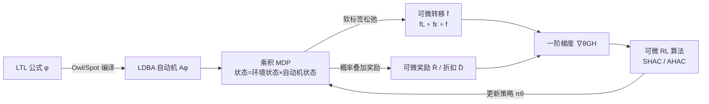

# Accelerated Learning with Linear Temporal Logic using Differentiable Simulation

**会议**: ICLR 2026  
**OpenReview**: [https://openreview.net/forum?id=zbdhhlIy8o](https://openreview.net/forum?id=zbdhhlIy8o)  
**代码**: 待确认  
**领域**: 强化学习 / 形式化方法 / 可微仿真  
**关键词**: 线性时序逻辑(LTL), 可微仿真, 安全强化学习, 奖励稀疏, Büchi自动机, 软标签  

## 一句话总结
本文首次把线性时序逻辑(LTL)规约与可微物理仿真器打通：通过对自动机的离散转移做"软标签"松弛，得到对状态/动作可微的奖励与状态表示，让一阶梯度算法(SHAC/AHAC)能直接从形式化规约里高效学习，在接触密集的连续控制任务上把训练速度和回报都拉到离散基线的两倍。

## 研究背景与动机
**领域现状**：要让 RL 控制器在真实世界满足安全与可靠性约束，常见做法是约束 MDP（累积代价控制在预算内）或状态规避（避开危险状态/动作）。

**现有痛点**：约束 MDP 依赖可加的代价函数，但给各种危害分配有意义的标量代价本身就很难；状态规避又容易学出过度保守的策略，且无法表达"轨迹级"的时序要求（先到 A 再到 B、始终避开 C、无限次访问 D 等）。LTL 这类形式化语言能给出"按构造正确(correct-by-construction)"的目标，自带自动机记忆、适合长程任务，但它的奖励**极度稀疏**——agent 往往要盲目探索大片状态空间才能拿到第一个非零奖励；而用启发式给 LTL 加密集奖励(reward shaping)又可能破坏目标的正确性、误导探索。

**核心矛盾**：LTL 给出的是**正确但不可学**（稀疏、离散、不可微）的目标，而可微仿真器能提供低方差的一阶梯度、却只认连续可微的奖励——两者天然不兼容。

**本文目标**：在**不牺牲 LTL 正确性与表达力**的前提下，让基于自动机的奖励变得可微，从而借助可微仿真器的梯度加速长程时序任务的学习。

**核心 idea**：**[软标签松弛]** 把原子命题的真值判定从硬阈值换成 sigmoid 概率，由此把"确定的自动机指示向量"替换成"在所有自动机状态上的概率叠加态"，让 LDBA 的标签转移、ε-转移、奖励和折扣全部变成可微的张量运算；同时给出离散返回与可微返回差距的可调上界，保证松弛后目标仍然逼近真实满足概率。

## 方法详解

### 整体框架
方法把"LTL 规约 → LDBA 自动机 → 乘积 MDP → 可微奖励"串成一条端到端可微的管线：先用 Owl/Spot 把 LTL 公式编译成有限确定 Büchi 自动机(LDBA)，再与可微 MDP 构造乘积 MDP（用自动机状态作为记忆模式）；关键改造在于把乘积 MDP 中所有离散环节软化成概率运算，使整条轨迹的返回对动作可微，最后塞进任意可微 RL 算法（如 SHAC）用一阶梯度训练。

### 关键设计

**1. 原子命题的软标签：把硬阈值换成可微 CDF。** LTL 的原子命题形如 $a := \text{'}g(s)>0\text{'}$，原本是非 0 即 1 的硬判定，导致奖励对状态不可微。本文把它松弛成命题成立的**概率**，用 sigmoid（或任意可微累积分布函数 $h$）实现：$\Pr(a\in L(s)) = h(g(s)) = \frac{1}{1+\exp(-g(s))}$。某个完整标签 $l$（一组命题的取值组合）的概率则是各命题概率的连乘：$\Pr(L(s)=l)=\prod_{a\in l}\Pr(a\in L(s))\prod_{a\notin l}(1-\Pr(a\in L(s)))$。这一步是整套可微化的源头——它让"状态究竟触发了哪条自动机标签转移"从离散事件变成了带梯度的概率分布。

**2. 概率叠加态下的可微自动机转移。** 有了软标签，自动机不再处于某个确定状态，而是处于所有状态上的**概率叠加** $\boldsymbol{q}$（每个分量 $q_q$ 是处于自动机状态 $q$ 的概率）。标签触发的转移更新写成 $f_L(\langle s,\boldsymbol{q}\rangle)=\boldsymbol{q}'$，其中 $q'_{q'}=\sum_q q_q \sum_{l\in L_{q,q'}}\Pr(L(s)=l)$，即"枚举所有当前状态与能导向 $q'$ 的标签、把概率加起来"，本质是一次可微矩阵乘法。LDBA 特有的非确定 ε-转移（ε-动作）同样被软化为概率 $\boldsymbol{q}_\varepsilon$：$f_\varepsilon$ 把"通过有效 ε-转移到达 $q'$"与"试图离开 $q'$ 但无对应 ε-转移而留在原地"两种情形的概率相加。最终完整转移 $\bar f(\langle s,\boldsymbol q\rangle,\langle a,\boldsymbol q_\varepsilon\rangle)=\langle f(s,a),\, f_L(s,f_\varepsilon(\boldsymbol q,\boldsymbol q_\varepsilon))\rangle$ 对 $s,\boldsymbol q,a,\boldsymbol q_\varepsilon$ 全程可微。

**3. 概率加权的可微奖励与折扣。** 沿用 Bozkurt 等人基于 Büchi 条件的奖励/折扣设计，但把"是否处于接受状态"的硬判断换成概率求和：$\bar R(\langle s,\boldsymbol q\rangle)=(1-\beta)\sum_{q\in B}q_q$，$\bar D(\boldsymbol q)=\beta\sum_{q\in B}q_q+\gamma\sum_{q\notin B}q_q$，其中 $B$ 是接受状态集、$\beta$ 是与 $\gamma$ 满足 $\lim_{\gamma\to 1^-}\frac{1-\gamma}{1-\beta}=0$ 的接受态折扣。这样返回 $G_H(\sigma)$ 对策略参数可微，可直接得到低方差的一阶梯度估计 $\nabla^1_\theta J(\theta)=\mathbb{E}_\sigma[\nabla_\theta G_H(\sigma)]$，避免了零阶估计的高方差，也绕开 BPTT 在长程下的梯度爆炸/消失。

**4. 离散与可微返回的可调误差上界。** 软标签会让目标偏离真实 LTL 语义，本文用 Theorem 2 给出最坏情况的差距上界：设 $\varsigma$ 是命题信号边界的容忍度、$p=h(\varsigma)$，则 $|G_{\text{disc}}(\sigma)-G_{\text{diff}}(\sigma)| < \frac{1}{1+\frac{1-\beta}{(1-h(\varsigma))^{|A|}}}$。由于离散返回本身在 $\gamma\to 1$ 时收敛到真实满足概率(Theorem 1)，该上界也适用于真实满足概率，并通过期望线性性直接推广到随机环境。直观上，调大 $\varsigma$（更陡的 sigmoid）能把差距压到任意小，给"可微性 vs 正确性"提供了一个可调旋钮。

## 实验关键数据

### 主实验表格
在 dFlex 可微物理仿真器上，4 个接触密集连续控制任务，回报为 LTL 满足概率的代理(0~1)，5 个种子平均，跑到 100M 步：

| 环境 | 状态/动作维度 | 可微 RL (SHAC/AHAC, ∂RL) | 非可微 RL (PPO/SAC, ̸∂RL) |
|------|------|------|------|
| CartPole | 5 / 1 | 20M 步内收敛到 Pr>0.8 | SAC 全部种子失败；PPO 一个种子失败，100M 步仍无有意义奖励 |
| Hopper | 10 / 3 | 20M 步内 Pr>0.8 | PPO 需满 100M 步收敛；SAC 一个种子陷局部最优 |
| Cheetah | 17 / 6 | 达到 Pr>0.9 最优 | PPO 100M 步仍次优；SAC 持续陷入差的局部最优 |
| Ant | 37 / 8 | 快速收敛到近最优 | 仅收敛到次优策略 |

整体：∂RL 在最大回报与收敛速度上全面胜出，最高可达离散基线的约两倍回报。

### 消融实验表格

| 消融设置 | 结果 |
|------|------|
| SHAC/AHAC + **离散** LTL 奖励 | 性能大幅下降，多数情况下还不如 PPO/SAC；Cheetah/Ant 高维环境完全学不出合理策略 → 证明增益来自**可微奖励**而非算法本身 |
| 所有算法 + **简化** LTL 公式（去掉难度） | 各算法最终都能学到最优(Pr>0.9) → 证明 ̸∂RL 的差表现源于**处理复杂 LTL 公式的能力不足**，而非环境本身难学 |
| 泛化到 Reward Machines (Cheetah TASK1/TASK2) | 把 RM 用本文方法可微化后用 SHAC 训练，回报显著超过 Icarte 等人所有离散 RM 基线 |

### 关键发现
- **稀疏才是瓶颈**：CartPole 安全规约的自动机有 3 状态、每状态 64 条转移，但只有 1 条给奖励；即便低维，这种稀疏也让 ̸∂RL 几乎学不动，而梯度信息让 ∂RL 直接定位到高奖励区域。
- **软化不只是去稀疏**：可微 LTL 把离散返回的"陡变/平坡"曲线平滑化（停车例子可见），更关键是提供了低方差一阶梯度，这在大片梯度幅值很小的参数区域尤为重要。
- **框架无关**：方法对自动机本身可微化，因此 co-safe LTL、LTLf、Reward Machines 都能无改动套用。

## 亮点与洞察
- **打通形式化方法与深度 RL 的"最后一公里"**：以往 LTL+RL 与可微仿真各自发展，本文用软标签把自动机这个离散记忆结构变成可微张量，是概念上很干净的桥接。
- **可微但有理论保证**：不是简单 shaping，而是给出离散/可微返回差距的可调上界，且与真实满足概率挂钩，兼顾"能学"和"学对"。
- **马尔可夫且兼容所有可微 RL**：与依赖非马尔可夫鲁棒度、必须用 BPTT 的 STL 方法不同，本文构造的是马尔可夫可微转移，天然支持长程、可接入任意 ∂RL 算法。

## 局限与展望
- **依赖可微仿真器**：方法要求环境的转移函数 $f$ 可微（dFlex 等可微物理引擎），对无法可微建模的真实/黑盒环境不直接适用。
- **软化引入的偏差需调参**：误差上界由 $\varsigma$、$|A|$、$\beta$ 共同决定，太软会牺牲正确性、太硬又退化回稀疏，最优旋钮位置可能随任务变化。
- **自动机规模与命题数的扩展性**：标签概率连乘 $\prod_{a}\!\Pr$ 与状态叠加矩阵乘法的开销随原子命题数 $|A|$、自动机状态数增长，超大规约下的可扩展性未充分压力测试。
- **评测仍是仿真**：实验局限于仿真连续控制，真实机器人上的 sim-to-real 与随机扰动下的表现有待验证。

## 相关工作与启发
- **LTL+RL 谱系**：从模型相关的可达性归约(Fu & Topcu)，到模型无关的 Reward Machines(Icarte 等)覆盖 co-safe LTL/LTLf，再到 LDBA 让一般 LTL 也能有简洁接受条件(Hahn/Bozkurt)——本文站在 LDBA 奖励设计(Bozkurt 2024)之上，补上"可微"这一环。
- **可微 RL**：SHAC 把长轨迹切短段做 BPTT 并用值函数 bootstrap，AHAC 据接触信息自适应段长，本文构造的可微马尔可夫自动机转移正好能接进这些算法。
- **对比 STL**：STL 的鲁棒度可当奖励，但通常非马尔可夫、依赖 BPTT，难用于长程/随机/值函数方法；本文用 LTL+自动机记忆规避了这一限制，是"选对形式语言"带来的红利。
- **启发**：把"离散结构软化为概率叠加 + 给出可调误差上界"这套思路，可能迁移到其他需要在可微管线里嵌入离散符号结构（如程序、图、约束求解）的场景。

## 评分
- **新颖性**: ⭐⭐⭐⭐⭐ 首个把 LTL 自动机端到端可微化并接入可微仿真器的框架，软标签叠加态的设计简洁且有理论支撑。
- **实验充分度**: ⭐⭐⭐⭐ 覆盖 4 个连续控制任务 + RM 泛化 + 两组针对性消融，5 种子，结论清晰；但仅限仿真、未做真实机器人与超大规约压力测试。
- **写作质量**: ⭐⭐⭐⭐ 问题动机、理论(两条定理)、方法(软标签/转移/奖励/上界)层层递进，停车例子直观；公式较密集对非形式化方法读者门槛偏高。
- **价值**: ⭐⭐⭐⭐⭐ 实质性缓解了 LTL 奖励稀疏这一长期瓶颈，把"安全可验证"与"高效可学"统一起来，对安全 RL / 形式化驱动控制有较强推动意义。

<!-- RELATED:START -->

## 相关论文

- [\[AAAI 2026\] Do It for HER: First-Order Temporal Logic Reward Specification in Reinforcement Learning](../../AAAI2026/reinforcement_learning/do_it_for_her_first-order_temporal_logic_reward_specification_in_reinforcement_l.md)
- [\[ICLR 2026\] OCTAX: Accelerated CHIP-8 Arcade Environments for Reinforcement Learning in JAX](octax_accelerated_chip-8_arcade_environments_for_reinforcement_learning_in_jax.md)
- [\[ICLR 2026\] Replicable Reinforcement Learning with Linear Function Approximation](replicable_reinforcement_learning_with_linear_function_approximation.md)
- [\[ICLR 2026\] ROMI: Model-based Offline RL via Robust Value-Aware Model Learning with Implicitly Differentiable Adaptive Weighting](model-based_offline_rl_via_robust_value-aware_model_learning_with_implicitly_dif.md)
- [\[ICLR 2026\] Does “Do Differentiable Simulators Give Better Policy Gradients?” Give Better Policy Gradients?](does_do_differentiable_simulators_give_better_policy_gradients_give_better_polic.md)

<!-- RELATED:END -->
