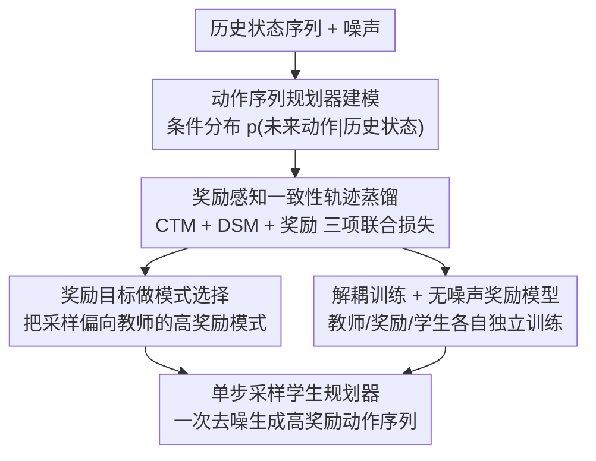

# Accelerating Diffusion Planners in Offline RL via Reward-Aware Consistency Trajectory Distillation

**会议**: ICLR2026  
**OpenReview**: [https://openreview.net/forum?id=hRuTBS07C7](https://openreview.net/forum?id=hRuTBS07C7)  
**代码**: 待确认（论文承诺录用后开源）  
**领域**: 强化学习 / 扩散模型 / 一致性蒸馏  
**关键词**: 离线强化学习, 扩散规划器, 一致性轨迹蒸馏, 奖励引导, 单步采样

## 一句话总结
RACTD 把奖励优化目标直接塞进一致性轨迹蒸馏过程，用一个预训练的扩散教师规划器 + 一个独立训练的无噪声奖励模型，蒸馏出一个**单步采样**的学生规划器；它在 D4RL 上比之前 SOTA 平均高 9.7%，同时推理比扩散教师快多达 142 倍。

## 研究背景与动机
**领域现状**：扩散模型在离线强化学习（offline RL）里很能打——它擅长捕捉多模态行为分布，又有不错的分布外泛化能力，所以被广泛用作规划器（planner，直接生成未来动作序列）或策略。但扩散模型有个老毛病：采样要迭代去噪几十步，推理慢，对自动驾驶、机器人这类对延迟敏感的决策任务很不友好。

**现有痛点**：为了加速，社区把图像生成里的「一致性蒸馏」搬到决策任务，但现有做法各有硬伤：(1) **行为克隆（BC）路线**只在专家数据上好使，碰到 medium-replay 这种良莠不齐的次优数据就拉胯——次优数据里只有部分行为模式能拿高奖励，BC 会把所有模式照单全收；(2) **actor-critic 路线**要从头同时训练多个网络（actor + critic），超参敏感、训练不稳、开销大；(3) **引导式扩散采样（guided sampling）**需要训练一个「能识别带噪状态」的 noise-aware 奖励模型，而且要多步采样，奖励在高噪声下预测不准，误差还会在多步中累积。

**核心矛盾**：想要「快（单步采样）」又想要「从次优数据里挑出高奖励行为」，这两件事在现有框架里要么互斥、要么得靠复杂的多网络并发训练才能勉强兼顾。

**本文目标**：设计一个训练简单、单步采样、还能从次优数据里偏向高奖励模式的扩散规划器。

**切入角度**：作者注意到——一旦学生模型能**单步**生成干净的动作序列，奖励模型就可以完全工作在无噪声的「干净状态-动作空间」里，不再需要 noise-aware 训练，也不再需要多步引导。这把「加速」和「奖励优化」从互相掣肘变成了互相成全。

**核心 idea**：用「在一致性轨迹蒸馏的损失里**直接加一项奖励目标**」代替「actor-critic 并发训练 / 多步引导采样」，让学生在蒸馏教师多模态分布的同时，把采样偏向高奖励模式。

## 方法详解

### 整体框架
RACTD（Reward-Aware Consistency Trajectory Distillation）的输入是一段历史状态序列，输出是一段未来动作序列；整条管线分三块解耦的部件：**一个预训练的扩散教师规划器**（EDM，多步去噪，负责捕捉数据里所有行为模式）、**一个独立预训练的可微奖励模型** $R_\psi$（return-to-go 网络，工作在干净空间），以及**被蒸馏出来的学生规划器** $G_\theta$（单步采样）。训练时，学生同时被三股力量拉动：CTM 损失让它沿教师的 PFODE 轨迹做「任意时刻到任意时刻」的跳跃、DSM 损失让生成贴近训练数据、奖励损失把它推向高奖励模式。推理时学生只跑一次 $\hat x_0^{(T)} = G_\theta(x_T, T, 0)$ 就得到动作序列。

### 关键设计

**1. 奖励感知一致性轨迹蒸馏（RACTD）：把奖励项直接焊进蒸馏损失**

这是全文的骨架，直接针对「BC 不会挑高奖励、actor-critic 又太复杂」的痛点。作者在标准一致性轨迹蒸馏（CTD = CTM 损失 + DSM 损失）之外，加了一项奖励目标。先看蒸馏的两项：CTM 损失对齐两条预测 $x_k$ 的路径——一条是学生直接从 $t$ 跳到 $k$，另一条是先用教师 + 数值 solver 从 $t$ 走到 $u$、再用学生从 $u$ 跳到 $k$，再把两者都映射到时刻 0 算距离：

$$\mathcal{L}_{CTM} = \mathbb{E}\big[\, d\big(G_{sg(\theta)}(\hat x_k^{(t)}, k, 0),\; G_{sg(\theta)}(x_k^{(t,u)}, k, 0)\big)\big]$$

其中 $\hat x_k^{(t)} = G_\theta(x_t, t, k)$ 是学生直接预测，$x_k^{(t,u)}$ 经过教师 solver 中转，$sg(\theta)$ 是 stop-gradient。DSM 损失则保证生成贴近数据：$\mathcal{L}_{DSM} = \mathbb{E}[d(x_0, G_\theta(x_t, t, 0))]$。奖励项是关键的「新焊点」：从学生单步生成的动作序列里取出当前动作 $\hat a_n$，喂给冻结的奖励模型估计 return-to-go，目标是最大化它：

$$\mathcal{L}_{Reward} = -R_\psi(\vec s_n, \hat a_n)$$

三项加权合成最终损失 $\mathcal{L} = \alpha\mathcal{L}_{CTM} + \beta\mathcal{L}_{DSM} + \sigma\mathcal{L}_{Reward}$。这样有效，是因为蒸馏两项保证学生「忠实复刻教师的多模态分布」，而奖励项在这个分布里做定向偏置——不是抹掉低奖励模式，而是把采样质量往高奖励那边推。作者还指出这个目标和离线 RL 经典的确定性策略梯度（DPG）在形式上同源，所以有理论依据。

**2. 奖励目标即模式选择：让学生从教师的多模态里专挑高奖励模式**

这一条解释了 RACTD「为什么对次优数据特别有效」。离线数据常常是混合质量的，扩散教师能如实地把这些模式都学下来，但它本身**不会区分**哪个模式奖励高、哪个低。作者在 D4RL hopper-medium-expert（专家 + 次优各半）上做了直观验证：数据集的奖励分布有明显双峰（中等质量 + 专家），无条件教师准确复现了这个双峰，无条件学生也忠实继承双峰，而 RACTD 学生把采样质量**集中到了高奖励那个峰**。换句话说，奖励项扮演的是「模式选择器」而不是「模式擦除器」——它在不破坏教师表达能力的前提下，把生成概率质量搬到好模式上。这正好补上了扩散模型「能学多模态、但不会挑」的短板，也是它比朴素 BC 强的根因。

**3. 解耦训练 + 无噪声奖励模型：单步采样换来三个部件各自独立训练**

针对「actor-critic 要并发训练、guided sampling 要 noise-aware 奖励模型」这两个老麻烦，RACTD 用单步采样把它们一并消解。因为学生能一步生成**干净**的动作序列，奖励模型 $R_\psi$（四个 ConvBlock + 一个 Linear）就只需在无噪声的状态-动作空间里训练，给出的梯度信号稳定准确，不必像 classifier-guided 那样在每个去噪步评估带噪状态（高噪声下奖励预测本就不准，多步还会累积误差）。更关键的是，教师、奖励模型、蒸馏三者**完全解耦**：奖励模型可以脱离教师单独预训练，甚至同一个教师可以搭配不同奖励模型灵活复用，彻底避开了 actor-critic 那种 actor/critic 互相纠缠、超参难调的并发优化。

**4. 动作序列规划器建模：以 planner 形式建模未来动作序列**

方法把扩散建模对象选成「规划器」而非「策略/世界模型」。形式上，给定一段长度 $h$ 的历史状态 $\vec s_n$，教师和学生都建模条件分布 $p(\vec a_n \mid \vec s_n)$，其中 $\vec a_n$ 是长度 $c$ 的未来动作序列（实验中 $h=1, c=16$）。在扩散记号里 $x = \vec a_n \mid \vec s_n$。这样建模的好处是连续动作能形成连贯序列、减少生成「无效动作」的概率。执行时既可只取首个动作 $a_n$ 然后重规划（闭环），也可一次性执行整段动作（开环，长程任务用）。这一设计是让奖励项能作用在「整段动作里的当前动作」上的前提。

### 损失函数 / 训练策略
教师用 EDM + pseudo-Huber 距离训练，推理用二阶 Heun solver。学生用 $\mathcal{L} = \alpha\mathcal{L}_{CTM} + \beta\mathcal{L}_{DSM} + \sigma\mathcal{L}_{Reward}$ 蒸馏，$\alpha, \beta, \sigma$ 为权重超参。奖励模型独立预训练后冻结。MuJoCo 用闭环规划（每步重规划），Maze2d 长程任务用开环规划（先生成整段状态序列，再用一个逆动力学模型反推动作）。

## 实验关键数据

### 主实验
D4RL Gym-MuJoCo（9 个任务，离线模型选择）：

| 方法 | 平均分 ↑ | NFE ↓ | 备注 |
|------|---------|-------|------|
| Diffusion QL | 87.9 | 5 | 扩散 actor-critic |
| Consistency AC | 85.1 | 2 | 一致性 actor-critic |
| Consistency BC | 69.7 | 2 | 一致性行为克隆 |
| Diffuser | 77.5 | 20 | 扩散规划器（教师同族） |
| **RACTD（本文）** | **96.4** | **1** | 单步采样 |

在线模型选择下 RACTD 平均 101.5（同样 NFE=1），8/9 任务拿到最佳或次佳。FrankaKitchen 上 RACTD 平均 60.0（NFE=1），逼近 5 步的 Diffusion QL（61.6），远超同为单步的 Flow Q-learning（46.8）和一致性 actor-critic（42.0）。

长程规划 D4RL Maze2d（开环）：

| 方法 | U-Maze | Medium | Large | 平均 | NFE(Large) |
|------|--------|--------|-------|------|-----------|
| Diffuser | 113.9 | 121.5 | 123.0 | 119.5 | 256 |
| CTD（无奖励项） | 123.4 | 119.8 | 127.1 | 123.4 | 1 |
| **RACTD（本文）** | **125.7** | **130.8** | **143.8** | **133.4** | **1** |

Large maze 规划维度高达 384（MuJoCo 仅 16），Diffuser 要 256 步去噪，RACTD 单步就把性能拉到 11.6 倍（相对无规划基线），且越是长程任务相对 CTD 的增益越大。

### 消融实验
在 hopper-medium-replay 上交叉对比「教师/学生是否带奖励项」：

| 配置 | 得分 | 说明 |
|------|------|------|
| 无条件教师 + 无条件学生 | 50.8 | 朴素 CTD，不会挑高奖励 |
| 奖励教师 + 无条件学生 | 109.5 | 奖励放在教师 |
| 奖励教师 + 奖励学生 | 96.0 | 双端都带奖励 |
| **无条件教师 + 奖励学生（RACTD）** | **109.5** | 本文方案，最优 |

推理速度（hopper-medium-replay，V100）：RACTD 学生 0.015s / NFE=1，得分 109.5；EDM 教师 2.134s / NFE=80，得分 114.2——学生比教师快 **142×**，且只掉极少分；相比 Diffuser（0.644s）快 43×。

### 关键发现
- **奖励项放学生端最优**：把奖励目标加在教师上虽然也涨分，但会让教师丢掉一些「当下次优、换场景可能有用」的行为模式，损害泛化；放在学生端则保留教师的完整多模态、只在蒸馏时做模式选择，兼顾表达力与高奖励。
- **次优数据越是良莠不齐，奖励引导越关键**：medium-replay / partial / mixed 这类数据上 RACTD 增益最明显；唯一吃亏的是 medium-expert（本就接近专家，奖励引导收益小）。
- **任务越长程，单步采样的相对优势越大**：Large maze 上 RACTD 相对 CTD 的增益最高，说明奖励引导的单步规划在高维长程任务里依然有很强表达力。

## 亮点与洞察
- **「单步采样」反过来成了奖励建模的使能条件**：因为学生一步就出干净动作，奖励模型才得以彻底脱离 noise-aware 训练、在干净空间里给稳定梯度——加速和奖励优化从互斥变成互相成全，这是全文最漂亮的一处因果反转。
- **奖励项被定位成「模式选择器」而非「模式擦除器」**：保留教师的完整多模态、只搬动采样质量，这个视角解释了为什么放学生端比放教师端泛化更好，也是可迁移的设计哲学——任何「先学全分布、再做偏好对齐」的场景都能借鉴。
- **三部件完全解耦**：教师、奖励、学生各自独立训练，同一教师可换不同奖励模型，工程上比 actor-critic 的并发优化友好得多，落地代价低。

## 局限与展望
- **依赖一个好的预训练教师**：RACTD 是蒸馏框架，学生表达力上限受教师约束，教师没捕捉到的模式学生也选不出来。
- **奖励模型质量是天花板**：模式选择全靠 $R_\psi$ 的 return-to-go 估计，奖励模型偏差会直接误导高奖励模式的选择，论文未深入讨论奖励模型出错时的鲁棒性。
- **多样性与模式选择的张力**：把采样偏向高奖励峰，可能牺牲分布覆盖度（论文在附录 F 有讨论），在需要探索性/多样性的场景下未必合适。
- **可改进方向**：把单一标量奖励换成多目标或带不确定性的奖励、或让奖励权重 $\sigma$ 随状态自适应，可能进一步缓解「过度收敛到单峰」的问题。

## 相关工作与启发
- **vs Consistency AC / Diffusion QL（actor-critic 路线）**：他们把扩散/一致性模型塞进 actor-critic、从头并发训练多个网络；本文用「教师蒸馏 + 独立奖励模型」把奖励优化解耦出来，单步采样（NFE=1 vs 2~5）、训练更稳、平均分更高。
- **vs Consistency BC（行为克隆路线）**：BC 在次优数据上不会挑高奖励模式；RACTD 用奖励项做模式选择，在 medium-replay 等混合质量数据上大幅领先。
- **vs guided diffusion sampling（Diffuser）**：Diffuser 需要 noise-aware 奖励模型 + 多步引导采样（NFE=20~256）；RACTD 在无噪声空间用单步采样，速度快几十到上百倍，长程任务还反超。
- **vs Flow Q-learning（Park et al. 2025）**：同样追求单步，但 Flow Q-learning 仍需在 actor-critic 框架下并发优化；RACTD 走纯蒸馏 + 解耦奖励，单步且性能更优。

## 评分
- 新颖性: ⭐⭐⭐⭐ 把奖励项直接焊进一致性轨迹蒸馏、并论证「放学生端做模式选择」最优，角度清晰
- 实验充分度: ⭐⭐⭐⭐ MuJoCo + FrankaKitchen + Maze2d 三类基准 + 速度/消融齐全，但奖励模型鲁棒性分析偏弱
- 写作质量: ⭐⭐⭐⭐ 动机递进清楚，图示（RACTD overview + 三损失可视化）到位
- 价值: ⭐⭐⭐⭐ 单步、解耦、对次优数据友好，对延迟敏感的机器人/决策落地很实用

<!-- RELATED:START -->

## 相关论文

- [\[ICML 2026\] DARTS: Distribution-Aware Active Rollout Trajectory Shaping for Accelerating LLM Reinforcement Learning](../../ICML2026/reinforcement_learning/darts_distribution-aware_active_rollout_trajectory_shaping_for_accelerating_llm_.md)
- [\[ICLR 2026\] One-Step Flow Q-Learning: Addressing the Diffusion Policy Bottleneck in Offline RL](one-step_flow_q-learning_addressing_the_diffusion_policy_bottleneck_in_offline_r.md)
- [\[ICLR 2026\] Improving and Accelerating Offline RL in Large Discrete Action Spaces with Structured Policy Initialization](improving_and_accelerating_offline_rl_in_large_discrete_action_spaces_with_struc.md)
- [\[ICLR 2026\] Beyond Penalization: Diffusion-based Out-of-Distribution Detection and Selective Regularization in Offline Reinforcement Learning](beyond_penalization_diffusion-based_out-of-distribution_detection_and_selective_.md)
- [\[ICLR 2026\] DEAS: DEtached value learning with Action Sequence for Scalable Offline RL](deas_detached_value_learning_with_action_sequence_for_scalable_offline_rl.md)

<!-- RELATED:END -->
