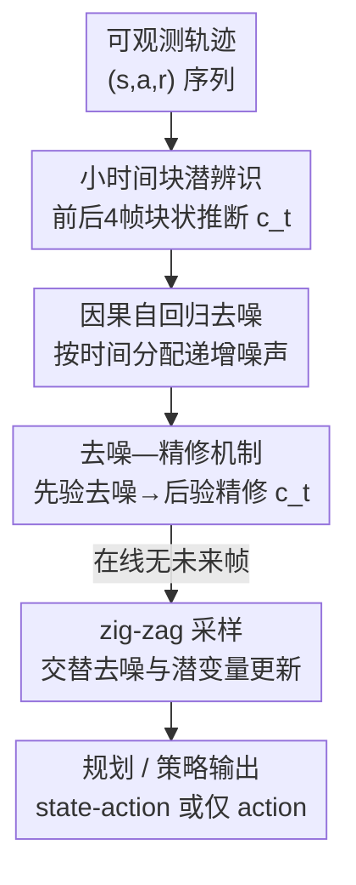

# Ada-Diffuser: Latent-Aware Adaptive Diffusion for Decision-Making

**会议**: ICLR2026  
**OpenReview**: [https://openreview.net/forum?id=PKifFVXtSR](https://openreview.net/forum?id=PKifFVXtSR)  
**代码**: 项目页 <https://sites.google.com/view/ada-diffuser>  
**领域**: 强化学习 / 扩散决策  
**关键词**: 扩散决策, 潜变量辨识, POMDP, 自回归扩散, 因果生成

## 一句话总结
Ada-Diffuser 把"随时间演化的隐藏上下文（风、目标、技能）"显式塞进扩散式决策模型：先用理论证明只需 4 个相邻观测的小时间块就能辨识潜变量，再用一个"去噪—精修"机制 + zig-zag 采样让扩散模型在线推断潜变量并据此规划/控制，在 8 个环境 23 种设定上稳定超过现有扩散规划器与潜上下文 baseline。

## 研究背景与动机
**领域现状**：近两年一个很热的思路是把决策问题当成"序列生成问题"来做——用 Transformer（Decision Transformer 系）或扩散模型（Diffuser、Diffusion Policy）直接生成未来的 state-action 轨迹，再从中挑出高回报的来执行。这类生成式决策器表达力强、可扩展，效果亮眼。

**现有痛点**：但这些方法几乎都假设环境是完全可观测的，忽略了**随时间变化的隐藏因素**——比如机器人运动里突然刮起的风、机械臂控制里不断切换的目标物体、医疗/经济里看不见但驱动状态转移的上下文。一旦这些潜变量存在且在演化，纯粹拟合"观测轨迹分布"的生成模型就会建错动力学、做出次优决策。

**核心矛盾**：早期 POMDP/元强化学习的办法是把历史观测编码成 belief state 来表征潜在状态，但这通常**要么需要完整历史轨迹、要么需要来自多个环境的数据**，在高维状态/动作空间里代价高昂，和"追求可扩展"的现代生成式决策模型天然冲突。于是问题变成：能不能**只用极少的观测**，就辨识出支配动力学和奖励的潜因子，并把它无缝接进可扩展的扩散决策框架，同时还保留理论保证？

**切入角度**：作者把系统建模成一个"上下文随时间演化"的潜在 contextual POMDP，并用结构因果模型（SCM）刻画数据生成过程。关键观察是：在温和假设下，时刻 $t$ 的潜因子其实**只需要它周围一个很短的时间窗（前后共 4 个观测）就能块状辨识（block-wise identifiable）**，不需要看整条轨迹。

**核心 idea**：用"小时间块辨识潜变量 + 因果自回归扩散"取代"全轨迹 belief state"，把潜变量推断和轨迹生成耦合进同一个扩散模型，做到在线、可扩展、有辨识性保证的自适应决策。

## 方法详解

### 整体框架
Ada-Diffuser 解决的是"环境里藏着会变的潜上下文 $c_t$，我要一边在线推断它、一边生成好轨迹"这件事。它把轨迹生成拆成两个串行模块：**Stage 1 潜因子辨识块**负责从可观测轨迹估计出一串潜变量 $\hat c_{0:T}$；**Stage 2 因果扩散模型**则在这串潜变量的条件下，用自回归去噪学习 RL 轨迹的因果生成过程，最终用来规划或学策略。

理论先行：Theorem 1 保证后验 $p(c_t \mid x_{t-2:t+1})$ 可在可逆变换意义下辨识——也就是"看一个含未来一帧的短窗口就够了"。但这里埋了个矛盾：辨识需要未来观测，而**在线推断时未来还没发生**。整个方法的精巧之处，就在于围绕这个矛盾设计了"去噪—精修 + zig-zag 采样"，让模型在没有真未来时也能逼出高质量潜变量。

下面这张图给出从可观测轨迹到规划/策略输出的整体数据流（节点名即下文关键设计名）：

### 关键设计

**1. 小时间块潜辨识：用 4 帧窗口换掉全轨迹 belief state**

针对"要辨识潜变量就得吃完整历史或多环境数据"这个痛点，作者从因果可辨识性理论入手，证明只需一个**最小充分块**就能恢复潜变量。系统被建模为潜在时变 contextual MDP $M=(S,A,C,\mathcal T,R,\gamma)$，其中潜上下文按 $c_t \sim p(c_t\mid c_{t-1})$ 演化、训练和推断时都不可见，并以 SCM 写出数据生成过程：$c_t=h(c_{t-1},\eta_t)$、$s_t=f(s_{t-1},a_{t-1},c_t,\epsilon_t)$、$a_t=\omega(s_t,c_t)$、$r_t=g(s_t,a_t,c_t,\delta_t)$。在一阶 MDP、分布可变性（若干条件算子的单射性）、谱分解唯一性三条温和假设下，Theorem 1 给出：后验 $p(c_t\mid x_{t-2:t+1})$ 可在可逆变换 $\hat c_t=h(c_t)$ 意义下辨识。直观说，**含一个未来帧的短窗口就携带了恢复潜因子所需的全部信息**——而且上下文对动力学影响越强（越需要辨识它），假设越成立、谱比 $k$ 越可分。这把"昂贵的全轨迹推断"降维成"在线滑窗推断"。

实现上 Stage 1 用变分推断：给定块 $x_{t-T_x:t+1}$，先验 $p_\phi(c_t\mid c_{t-1})$ 只看块内历史，后验 $q_\psi(c_t\mid x_{t-T_x:t+1})$ 额外吃进未来观测，优化 ELBO

$$\mathcal L_{\text{ELBO},t}=\mathbb E_{q_\psi}\big[-\log p_\theta(x_t\mid x_{t-1},c_t)\big]+D_{\mathrm{KL}}\big(q_\psi(c_t\mid x_{t-T_x:t+1})\,\|\,p_\phi(c_t\mid c_{t-1})\big),$$

重构项按可观测模态实例化（只有状态就重构 $s_t$，有奖励就再重构 $r_t$），编码器/解码器用 GRU+MLP 实现。

**2. 因果自回归去噪：让噪声调度对齐时间因果结构**

普通扩散把整段轨迹一视同仁地加同一噪声，无法表达"序列决策里越往后越不确定"的自回归本质。作者为长度 $T$ 的轨迹分配**单调递增的噪声级** $k_i=\frac{i}{T}K$（$i\in\{1,\dots,T\}$，$K$ 为最大扩散步），让每个时间步的去噪进度既取决于它离 anchor 的时间距离、也取决于推断到的潜变量。去噪按块自回归地一步步推进：

$$p_\theta\big(x^0_0,\dots,x^0_{T-1}\mid x^{k_1}_0,\dots,x^{k_T}_{T-1},\hat c_{0:T}\big),$$

第一步先把 $x_0$ 完全去噪、其余部分去噪，第二步去噪 $x_1$……直到最后一步去噪 $x_{T-1}$。这样生成顺序天然对齐了"先确定的过去 → 逐步揭开的未来"的因果链，而不是所有步同时从纯噪声里蹦出来。同一套核心还能灵活适配任务：规划时生成整段轨迹 $\{x_t,\dots,x_{t+T_p}\}$（$x_t$ 可为 $\{s_t,a_t\}$ 或仅 $\{s_t\}$，后者再配一个逆动力学模型 IDM 反推动作）；策略学习时只生成动作 $\{a_{t+1},\dots,a_{t+T_a}\}$，既支持多步动作（$T_a>1$，如 DP）也支持单步决策（$T_a=1$，如 IDQL）。

**3. 去噪—精修机制：用"先验快估→后验精修"补上在线缺失的未来**

Theorem 1 要求历史+未来才能恢复潜变量，但在线推断时未来不可得，这是"辨识需求 ↔ 可用信息"的根本错配。去噪—精修机制让去噪和潜变量估计交替进行：**训练时**，先从先验采 $\hat c^{\text{prior}}_t\sim p_\phi(c_t\mid c_{t-1})$ 去噪得 $\hat x^{(0)}_t=\epsilon_\theta(x^{k_t}_t,k_t,\hat c^{\text{prior}}_t)$，再用能看未来的后验采 $\hat c^{\text{post}}_t\sim q_\psi(c_t\mid x_{t-k:t+1})$ 得精修预测 $\hat x^{(0)'}_t$。两者各出一个重构损失 $\mathcal L_{\text{prior}}=\|\hat x^{(0)}_t-x^0_t\|^2$、$\mathcal L_{\text{post}}=\|\hat x^{(0)'}_t-x^0_t\|^2$，并加一个**对比改进损失**逼后验比先验重构得更好：

$$\mathcal L_{\text{rel}}=\mathrm{softplus}\big(\log \mathcal L_{\text{post}}-\log \mathrm{sg}(\mathcal L_{\text{prior}})+m\big),$$

其中 $\mathrm{sg}$ 为 stop-gradient、$m\ge 0$ 为 margin。总目标 $\mathcal L_{\text{d-r}}=\mathcal L_{\text{post}}+\lambda_{\text{prior}}\mathcal L_{\text{prior}}+\lambda_{\text{rel}}\mathcal L_{\text{rel}}$，且分工明确：$\mathcal L_{\text{diff}}$ 只更新 $\theta$、$\mathcal L_{\text{post}}$ 只更新 $\psi$、$\mathcal L_{\text{prior}}$ 只更新 $\phi$、$\mathcal L_{\text{rel}}$ 同时更新 $\phi,\psi$。这样先验网络被蒸馏得越来越接近"看过未来"的后验，在线时即便只用先验也能给出靠谱的初值。

**4. zig-zag 采样：推断阶段交替"去噪一点、更新潜变量"以保持序列与潜动态一致**

光有精修还不够——在线推断完全没有未来观测，没法直接调后验网络。zig-zag 采样把自回归去噪和潜变量精修拧成一股：先对整条轨迹加到最大噪声 $K$，然后逐时间步去噪。对每个 $t$，先用先验 $\hat c^{\text{prior}}_t$ 把 $x^K_t$ 去噪到中间噪声级 $k_1$；接着用后验 $\hat c^{\text{post}}_t\sim q_\psi(c_t\mid x^0_{t-k:t-1},x^{k_1}_t,x^{k_2}_{t+1})$ 更新潜变量——注意此时它条件里的"未来帧" $x^{k_2}_{t+1}$ 是个**还带噪声的粗估未来**，而非真未来；最后用精修后的 $\hat c^{\text{post}}_t$ 把 $x^{k_1}_t$ 进一步去噪到干净的 $x^0_t$。这种"去噪→拿半成品未来更新潜变量→再去噪"的之字形交替，保证了生成序列与其潜动态彼此一致，把"需要未来"的辨识理论真正落到在线场景。值得一提，作者特意说明这里的 zig-zag 纯属描述性命名，与 Bai et al. (2024) 的 zigzag 扩散采样无关。

### 损失函数 / 训练策略
总训练目标由三块拼成：扩散去噪损失 $\mathcal L_{\text{diff}}=\mathbb E\big[\|\epsilon_\theta(\tau^t,t,y(\tau),c)-\epsilon\|^2\big]$（条件含期望属性 $y(\tau)$ 与潜变量 $c$）、Stage 1 的 ELBO，以及去噪—精修目标 $\mathcal L_{\text{d-r}}$（含 prior/post 重构 + 对比改进 $\mathcal L_{\text{rel}}$）。架构上：潜辨识用 GRU+MLP 做先验/后验编码器输出高斯潜分布、MLP 做解码器；去噪网络用 UNet 或 Transformer，IDM 用 MLP，视觉编码器用 VAE。同一核心通过只改输入/输出就覆盖潜动力学/潜奖励、动作无关数据的潜动作、以及状态/图像环境等多种变体。

## 实验关键数据

### 主实验
覆盖 8 个环境 23 种设定：MuJoCo locomotion（Cheetah/Ant/Walker）、Maze2D 导航、Franka-Kitchen、Robomimic、LIBERO-10；在 Cheetah/Ant 上人为注入影响动力学（$c_s$）和奖励（$c_r$）的潜因子，并区分按 episode 变化（E）与按 step 时变（S）。对比 9 个 baseline，含 Diffuser/DD/DP/IDQL/LDCQ、潜上下文类 MetaDiffuser/LILAC/DynaMITE、潜动作类 LDP。

| 环境（潜因子类型） | Diffuser | DF | DF+DynaMITE | DF+LILAC | MetaDiffuser | Ada-Diffuser |
|--------|------|------|------|------|------|------|
| Cheetah-Wind-E ($c_s$) | -120.4 | -105.8 | -82.3 | -91.5 | -95.3 | **-68.9** |
| Cheetah-Wind-S ($c_s$) | -148.5 | -102.0 | -87.2 | -96.7 | -105.6 | **-73.5** |
| Cheetah-Vel-E ($c_r$) | -102.4 | -85.6 | -60.2 | -67.8 | -62.6 | **-45.8** |
| Ant-Dir-E ($c_r$) | 188.6 | 195.4 | 266.7 | 233.6 | 229.4 | **285.3** |

（Ada-Diffuser-Planner，5 个随机种子平均；越大越好除 reward 为负值场景）。即便给扩散 baseline 插上 DynaMITE/LILAC 这类与本文最可比的潜上下文模块，Ada-Diffuser 仍稳定领先。在没有显式潜因子的环境里（Fig. 5），潜变量退化为对轨迹随机性的贝叶斯滤波，建模它依然能达到可比或更好的性能；动作无关 demo（Group II，Robomimic/LIBERO）下也对所有任务带来提升。

### 消融实验

| 维度 | 配置 | Cheetah ($c_s$) | LIBERO |
|------|------|------|------|
| 潜辨识 | 完整 | **-73.5** | **93.4** |
|  | w/o latents | -103.5 | 89.3 |
|  | Freeze（10% 后冻结） | -110.4 | 90.2 |
|  | 维度 4× / 6× | -89.5 / -102.4 | 87.6 / 85.0 |
| 因果扩散 | 完整 | **-73.5** | **93.4** |
|  | w/o refine | -82.0 | 83.9 |
|  | w/o zigzag | -91.6 | 91.4 |
|  | same NS（固定噪声） | -89.7 | 85.2 |
|  | random NS | -84.6 | 88.5 |

### 关键发现
- **潜辨识模块是命门**：去掉或在 10% 后冻结潜模块性能大幅下滑（-73.5 → -103.5 / -110.4），因为潜上下文是个时变过程、必须全程自适应；潜维度在 0.5×–2× 内不敏感，但 4×–6× 过大反而因冗余容量/优化困难掉点。
- **backward refinement 贡献最大**：在 Cheetah 变风的线性探针 MSE 上，去掉精修 0.18 → 0.28（退化最大），去掉 zig-zag 0.18 → 0.23；完整模型 0.18 与能看真未来的 oracle 0.12 差距很小，说明"粗估未来"已足够支撑可靠的在线潜推断。
- **辨识精度与回报正相关**：块大小实验里，潜辨识做得越准、归一化 reward 越高，反过来佐证"辨识潜因子"对决策的重要性；块太小（信息不足）或太大（冗余/难优化）都掉点，存在甜区。
- 作者声称该框架不引入显著的训练/推断计算开销（App. I.1）。

## 亮点与洞察
- **理论驱动的"最小充分块"**：把"需要全轨迹/多环境"的潜辨识，压缩成"前后 4 帧的短窗口可辨识"，既给了 in-block 在线推断的合法性，也直接指导了块大小这个关键超参——理论不是装饰，而是落到了采样窗口设计上。
- **直面"辨识需要未来、在线没有未来"的矛盾**：去噪—精修 + zig-zag 是很漂亮的工程化——用"带噪粗估未来"代替真未来去更新潜变量，再用对比损失把先验蒸馏向后验，相当于让模型学会"脑补一个够用的未来"。这套"先验快估→后验精修→交替采样"的范式可迁移到其它需在线推断隐状态的序列生成任务。
- **一个核心覆盖多场景**：潜动力学、潜奖励、潜动作（动作无关 demo）、乃至无显式潜变量（退化成贝叶斯滤波去噪），都靠改 I/O 复用同一框架，说明"显式建模潜过程"是个相当通用的增益来源。

## 局限与展望
- 理论保证建立在一阶 MDP + 两条分布/谱假设之上，虽说作者论证这些假设"上下文影响越强越成立"，但在上下文影响微弱或高度非平稳的真实场景中，块状辨识的质量与"4 帧足够"的结论可能打折。
- 辨识只到"可逆变换意义下"——拿到的是 $\hat c_t=h(c_t)$ 而非真潜变量，下游任务靠隐式复合 $h^{-1}$ 工作，但这对需要可解释潜变量的应用是个限制。
- zig-zag 在线推断用"带噪未来"近似真未来，oracle 与全模型仍有 0.12 vs 0.18 的探针误差差距；长时序、快速突变的潜动态下这个近似误差会不会累积，正文未充分压力测试。
- 评测潜因子多为人为注入（风、速度、方向），真实世界里潜过程的形态更复杂，泛化性有待更贴近部署的验证。

## 相关工作与启发
- **vs 纯扩散决策（Diffuser / DD / Diffusion Policy / IDQL）**：它们直接拟合观测轨迹分布、不建模隐藏上下文；Ada-Diffuser 显式推断 $c_t$ 并条件化生成，在有潜因子时大幅领先，在无显式潜因子时也靠贝叶斯滤波式去噪持平或更优。
- **vs 潜上下文 RL（MetaDiffuser / LILAC / DynaMITE）**：它们多依赖多环境数据或 belief state 来建非平稳性；本文用"最小充分块 + 因果自回归扩散"做到单环境、在线、可扩展，且把它们的上下文模块当 plug-in 接进扩散器对比时仍胜出。
- **vs 自回归扩散（DF / Diffusion Forcing 系）**：本文借鉴自回归去噪调度，但额外引入潜辨识与去噪—精修，把"时间因果"和"潜因果"两层结构一起建模，而非只做按步异噪。
- **vs 潜动作建模（LDP）**：在动作无关 demo 设定下，本文在 LDP 的潜规划器之上补充潜上下文建模，对所有任务带来增益，显示潜过程建模与潜动作建模是正交可叠加的。

## 评分
- 新颖性: ⭐⭐⭐⭐⭐ 把可辨识性理论真正接进扩散决策，并用去噪—精修/zig-zag 化解在线无未来的矛盾，思路完整自洽。
- 实验充分度: ⭐⭐⭐⭐ 8 环境 23 设定 + 9 baseline + 多维消融够扎实，但潜因子多为人造、缺真实部署验证。
- 写作质量: ⭐⭐⭐⭐ 理论—方法—实验逻辑清晰，符号繁多但基本自洽；部分关键结果压在附录。
- 价值: ⭐⭐⭐⭐⭐ 为"生成式决策 + 潜过程建模"提供了有理论保证又可扩展的范式，迁移面广。

<!-- RELATED:START -->

## 相关论文

- [\[ICLR 2026\] EMFuse: Energy-based Model Fusion for Decision Making](emfuse_energy-based_model_fusion_for_decision_making.md)
- [\[ICLR 2026\] Information-based Value Iteration Networks for Decision Making Under Uncertainty](information-based_value_iteration_networks_for_decision_making_under_uncertainty.md)
- [\[ICLR 2026\] Accelerating Diffusion Planners in Offline RL via Reward-Aware Consistency Trajectory Distillation](accelerating_diffusion_planners_in_offline_rl_via_reward-aware_consistency_traje.md)
- [\[NeurIPS 2025\] Structured Reinforcement Learning for Combinatorial Decision-Making](../../NeurIPS2025/reinforcement_learning/structured_reinforcement_learning_for_combinatorial_decision-making.md)
- [\[ICML 2025\] Counterfactual Effect Decomposition in Multi-Agent Sequential Decision Making](../../ICML2025/reinforcement_learning/counterfactual_effect_decomposition_in_multi-agent_sequential_decision_making.md)

<!-- RELATED:END -->
