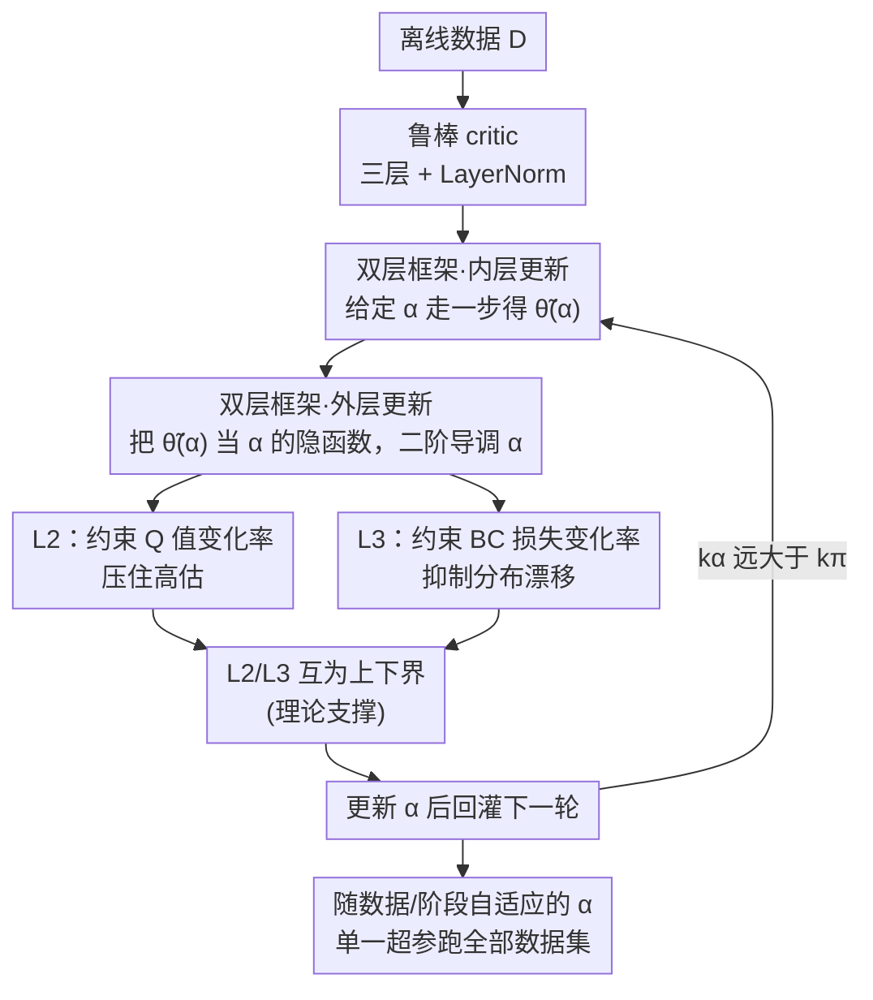

# Adaptive Scaling of Policy Constraints for Offline Reinforcement Learning

**会议**: ICLR2026  
**OpenReview**: [https://openreview.net/forum?id=liOHottW7G](https://openreview.net/forum?id=liOHottW7G)  
**代码**: 待确认  
**领域**: 强化学习 / 离线 RL  
**关键词**: 离线强化学习、策略约束、自适应缩放、双层优化、TD3+BC

## 一句话总结
针对离线 RL 里"策略约束强度（RL 与行为克隆的配比）必须逐数据集手调"的痛点，本文提出 ASPC：把 TD3+BC 里的缩放因子 $\alpha$ 变成可学习参数，用二阶可微的双层优化在训练中动态调它，靠约束 Q 值变化率和 BC 损失变化率来稳定更新；在 D4RL 39 个数据集上**只用一套超参**就超过了需要逐数据集网格搜索的 SOTA，相对基线平均提升 35%。

## 研究背景与动机

**领域现状**：离线强化学习只能从一份固定的、预先采集好的数据集里学策略，完全不能再和环境交互——这在自动驾驶、医疗、工业控制这些"试错代价高甚至危险"的场景里很关键。它最核心的麻烦是**分布偏移**：学到的策略一旦在数据集没覆盖到的 $(s,a)$ 上查询 Q 值，就会出现严重的外推高估，把策略带偏甚至学崩。主流的解法是**策略约束**，即在更新时加一个行为克隆（BC）项，逼着学到的策略别离采数据的行为策略 $\pi_\beta$ 太远，典型代表就是 TD3+BC，把目标写成 $\lambda Q(s,\pi(s)) - (\pi(s)-a)^2$ 的形式。

**现有痛点**：策略约束方法里有一个被长期忽视、却决定成败的旋钮——**约束的尺度**，也就是 RL 目标和 BC 项之间的配比。这个配比在不同任务、不同质量的数据集上差异极大：数据质量高时该多信 BC、数据质量差时该多信 RL。现有方法分两类，都不理想。第一类靠**逐数据集手调超参**（如 ReBRAC、IQL），调好了很强，但一旦想用一套配置跑所有数据集，性能立刻崩塌（论文 Figure 1(b) 显示 ReBRAC 在单一超参下各数据集波动剧烈）。第二类是**固定超参的自适应变体**（如 wPC、GORL），省掉了调参，但它们只在**局部**对单个动作/样本重新加权，没去碰**全局的 trade-off 尺度**，因此和精调过的基线之间始终有明显差距。

**核心矛盾**：在真实离线 RL 里反复网格搜索往往昂贵到不可行，于是矛盾就变成——**能不能用单一一套超参，在质量参差、任务各异的数据集上都拿到匹配甚至超过精调方法的性能？** 现有的"局部加权"自适应只动了表面，没动决定 RL/BC 平衡的那个全局缩放，所以填不平这个坑。

**切入角度**：作者的观察是，与其把 $\alpha$ 当成一个需要人去搜的常数，不如把它当成一个**需要在训练中被优化的参数**，让算法自己根据当前数据质量和训练阶段去调它。关键在于：怎么给"调 $\alpha$"提供一个有理论支撑、又不会让训练失稳的优化信号。

**核心 idea**：用**二阶可微的双层（meta-learning）优化**把缩放因子 $\alpha$ 学出来——内层按给定 $\alpha$ 更新策略，外层把更新后的策略当作 $\alpha$ 的隐函数、用二阶导去调 $\alpha$，并在外层损失里加入"约束 Q 值变化率"和"约束 BC 损失变化率"两项，使每一步更新都被推向一个可证明性能不降的稳定区间。

## 方法详解

### 整体框架

ASPC 整体是一个**双层优化循环**，搭在 TD3+BC 骨干上，只改两处：把固定常数 $\alpha$ 换成可学习参数，并换上一个更鲁棒的 critic。组合目标仍是

$$L = \alpha\, L_{RL} + L_{BC},\qquad \lambda = \frac{\alpha}{\frac{1}{N}\sum_i |Q(s_i,a_i)|},$$

其中 $\lambda$ 把 RL 项归一到 BC 项的量纲上，而 $\alpha$ 就是我们要动态调的全局缩放。训练时三层嵌套交替进行：critic 先按 Bellman 目标更新；每隔 $k_\pi$ 步做一次**内层 actor 更新**（给定当前 $\alpha$，对策略参数 $\theta$ 走一步梯度下降，得到 $\tilde\theta(\alpha)$）；每隔 $k_\pi\cdot k_\alpha$ 步做一次**外层 $\alpha$ 更新**（把 $\tilde\theta(\alpha)$ 当成 $\alpha$ 的隐函数，用二阶导调 $\alpha$）。外层损失由三块协同组成：$L_1$ 照搬 TD3+BC 的形式、负责把 $\alpha$ 推向更好的 RL/BC 平衡；$L_2$ 惩罚 Q 值期望的剧烈上升；$L_3$ 约束 BC 损失的大幅漂移。$L_2$、$L_3$ 共同给 $L_1$ 想走的那一步"踩刹车"，防止 RL 或 BC 任一方失控。这样 $\alpha$ 就能随数据质量和训练阶段自动游走——好数据 $\alpha$ 变小（偏 BC）、差数据 $\alpha$ 变大（偏 RL），训练早期偏 BC、critic 稳了之后逐步放权给 RL。

### 关键设计

**1. 二阶可微的双层框架：把 $\alpha$ 从"要手调的常数"变成"训练中被优化的参数"**

这是整篇的地基，直接回应"逐数据集调参不可行"的痛点。作者借鉴 MAML 式的 meta-learning，把求解拆成内外两层。**内层**在给定 $\alpha$ 下优化策略：

$$L_{inner}(\theta;\alpha) = \mathbb{E}_{(s,a)\sim D}\big[-\lambda(\alpha)\,Q(s,\pi_\theta(s)) + \|\pi_\theta(s)-a\|^2\big],$$

其中 $\lambda(\alpha)=\alpha/\mathbb{E}_s[|Q(s,\pi_\theta(s))|]$，走一步梯度下降得到 $\tilde\theta(\alpha)=\theta-\eta_\theta\nabla_\theta L_{inner}$。注意 $\tilde\theta$ 显式依赖 $\alpha$。**外层**则把更新后的策略 $\tilde\theta(\alpha)$ 视为 $\alpha$ 的**隐函数**，对外层目标关于 $\alpha$ 求导——这里就需要二阶导（因为 $\tilde\theta$ 里已经含一次对 $\theta$ 的导），更新规则为

$$\alpha \leftarrow \alpha - \eta_\alpha \frac{\partial L_{outer}(\tilde\theta(\alpha))}{\partial \tilde\theta}\frac{\partial \tilde\theta(\alpha)}{\partial \alpha}.$$

它有效的原因在于：$\alpha$ 不再是凭经验拍的死值，而是被"内层更新一步后会发生什么"这个真实反馈推着走，因此能对数据质量和训练进度自动响应——这正是固定超参的局部加权方法做不到的全局调节。

**2. 互为约束的双正则 $L_2/L_3$：用 Q 值变化率与 BC 损失变化率给更新踩刹车**

光把 $\alpha$ 学出来还不够，单纯优化 $L_1$（与 TD3+BC 同形、负责平衡 RL 与 BC）容易让某一方失控。作者加了两项相互呼应的正则：$L_2=\big(\mathbb{E}_s[Q(s,\pi_{\tilde\theta}(s))]-\mathbb{E}_s[Q(s,\pi_\theta(s))]\big)^2$ 惩罚 Q 值期望在一步内的剧烈上升（高估的前兆）；$L_3$ 则约束 BC 损失的跨步漂移，其形式（含 BC 损失上界 $\sup\|\pi_\theta(s)-a\|^2$ 与跨步差值 $\sup\|\pi_{\tilde\theta}(s)-a\|^2-\|\pi_\theta(s)-a\|^2$）并非拍脑袋，而是从 Theorem 4.4 反推出来的。直觉上，$L_3$ 综合了三个因子：Q 值变化速率、BC 损失上界、BC 损失跨轮变化；当 Q 值剧烈波动或偏离行为策略过大时，加大对 BC 漂移的惩罚就能压住分布偏移、稳住训练。外层总目标 $L_{outer}=L_1+L_2+L_3$。

**3. $L_2$ 与 $L_3$ 互为上下界：一个理论命题解释"为什么有时只用一项就够、有时必须两项都上"**

这是本文最有意思的理论洞察（Proposition 4.2），也直接指导了消融里的现象。在 critic 与转移核对动作 Lipschitz 连续的假设下，BC 损失的变化 $\Delta L_{BC}$ 和 Q 值变化的平方 $(\Delta Q)^2$ **互相约束**：$(\Delta Q)^2$ 给 $\Delta L_{BC}$ 一个下界，$\Delta L_{BC}$ 给 $(\Delta Q)^2$ 一个上界。这说明 $L_2$、$L_3$ 不是两个独立的正则，而是耦合的。配合单步性能下界 $J(\pi_{t+1})-J(\pi_t)\ge \frac{1}{1-\gamma}\big(\Delta Q-\Phi\big)$（Proposition 4.3，其中 $\Phi$ 是依赖 BC 损失变化上界与 BC 损失上界的非负函数）和 Theorem 4.4（当 $\Delta Q\ge\Phi$ 时性能单步非降），就能解释为何在某些域里只显式加 $L_2$（如 MuJoCo/Adroit）就能隐式压住 $\Delta L_{BC}$、满足定理条件，而在 AntMaze 里只加 $L_3$ 就能隐式限住 $(\Delta Q)^2$；唯独 Maze2d 两个隐式关系都不够强，必须把 $L_2$、$L_3$ 都显式加上。Theorem 4.5 进一步保证迭代过程会持续缩小到最优策略的差距，残差由行为策略与最优策略的偏差 $\Psi(\varepsilon_\beta)$ 控制。

**4. 鲁棒 critic + 拉长 $\alpha$ 更新间隔：让动态调 $\alpha$ 既不崩也不慢**

把 $\alpha$ 动态化会引入两个工程隐患，作者用两个改动各治一个。其一，调 $\alpha$ 的过程会让 Q 值更不稳、容易高估到灾难性失败，于是把 TD3+BC 的 critic 从两层加深到三层、并在每层后插 LayerNorm（沿用近期"深 critic + LayerNorm 抑制高估"的证据）；消融显示不用这个鲁棒 critic 时，wPC 和 ASPC 都只有有限提升甚至退化。其二，二阶梯度本身昂贵，但作者把 $\alpha$ 的更新间隔 $k_\alpha$ 设得远大于 actor 的更新间隔 $k_\pi$——即很多步才调一次 $\alpha$；实验表明 $k_\alpha$ 增大几乎不掉点（$k_\alpha$ 从 5 到 30 性能从 78.0 到 75.5），却把额外开销压到和原始 TD3+BC 几乎持平。这条让"理论上漂亮的二阶双层优化"真正落地成一个跑得起的算法。

### 损失函数 / 训练策略
内层目标为 $L_{inner}$（公式 4），外层目标 $L_{outer}=L_1+L_2+L_3$（公式 9）。训练循环（Algorithm 1）：critic 每步更新；actor 每 $k_\pi$ 步做一次内层更新；$\alpha$ 每 $k_\pi\cdot k_\alpha$ 步做一次外层更新，并对 critic/actor 做软更新。$\alpha$ 初始化为 2.5，$k_\alpha$ 基准取 10。除可学习 $\alpha$ 与鲁棒 critic 外，其余网络结构与超参均与 TD3+BC 保持一致，因此"单一超参配置"得以成立。

## 实验关键数据

### 主实验
在 D4RL 四大域共 39 个数据集上评测。ASPC、TD3+BC、wPC、A2PR 都用**单一超参**，而 IQL、ReBRAC 用**逐数据集网格搜索**。

| 域 | TD3+BC* (✓) | A2PR (✓) | IQL (✗) | wPC* (✓) | ReBRAC (✗) | ASPC (✓) |
|------|------|------|------|------|------|------|
| MuJoCo Avg | 70.7 | 74.2 | 72.9 | 77.8 | 81.2 | **82.1** |
| Maze2d Avg | 68.9 | 123.5 | 46.2 | 94.6 | 96.7 | **147.2** |
| AntMaze Avg | 35.4 | 38.8 | 58.3 | **78.7** | 76.8 | 74.5 |
| Adroit Avg | 46.4 | 4.7 | 53.4 | 28.8 | **58.6** | 55.7 |
| **Total Avg** | 57.7 | 51.2 | 62.6 | 64.2 | 74.8 | **77.9** |

（✓=固定超参，✗=逐数据集调参；*表示用了 §5.5 的鲁棒 critic。）ASPC 在 MuJoCo、Maze2d 上拿最优，Adroit、AntMaze 上有竞争力，总均分 77.9 为全场最高——**用一套超参超过了需要逐数据集精调的 ReBRAC（74.8）**，相对最弱基线提升约 35%。

### 消融实验

动态调 $\alpha$ 的必要性（每格括号是相对 Naive 的相对变化）：

| 域 | Naive α=2.5 | Converged α | Linear α | Dynamic α (ASPC) |
|------|------|------|------|------|
| MuJoCo | 70.3 | 79.3 (↑12.8%) | 77.0 (↑9.5%) | **82.1 (↑16.8%)** |
| Maze2d | 61.9 | 133.2 (↑115.2%) | 103.3 (↑66.9%) | **147.2 (↑137.8%)** |
| AntMaze | 28.7 | 64.1 (↑123.3%) | 56.3 (↑96.2%) | **74.5 (↑159.2%)** |
| Adroit | 49.9 | 49.1 (↓1.6%) | 47.6 (↓4.6%) | **55.7 (↑11.6%)** |
| **Total Avg** | 57.0 | 71.8 (↑25.9%) | 66.7 (↑17.0%) | **77.9 (↑36.6%)** |

外层损失项消融（相对完整 ASPC 的百分差，越接近 0 越好）：单用 $L_1$ 最差；只加 $L_2$ 把 MuJoCo/Adroit 拉到接近满配水平，但 AntMaze 几乎不动；只加 $L_3$ 大幅救起 AntMaze 却对 MuJoCo/Adroit 无感；Maze2d 两项缺一不可——与 Proposition 4.2 的"互为约束"完全吻合。

### 关键发现
- **光找到一个好的固定 $\alpha$ 不够，必须在训练全程动态调**：把 $\alpha$ 固定为 ASPC 最终收敛值（Converged α）已经比 Naive 强很多，但仍被 Dynamic α 大幅甩开（总均分 71.8 vs 77.9），Linear 调度只补上部分差距——证明优势来自"动态自适应"本身而非"找到了好常数"。
- **$\alpha$ 的演化可解释**：高质量数据集 $\alpha$ 收敛得小（偏 BC）、低质量数据集 $\alpha$ 大（偏 RL）；door/pen/hammer/relocate 这类窄专家分布任务 $\alpha\approx10^{-1}$，antmaze/maze2d 这类含大量次优轨迹的任务 $\alpha>10$；训练早期 $\alpha$ 先降（信 BC）、critic 稳后逐步升（放权 RL）。
- **鲁棒 critic 是动态 $\alpha$ 能跑通的前提**：去掉三层+LayerNorm 的鲁棒 critic 后，Q 值高估失控、ASPC 甚至退化。
- **开销可控**：$k_\alpha$ 设大（如 30）时运行时间几乎等于 TD3+BC（97 vs 99 min 量级），仍保持高性能。
- **强通用性**：把 ASPC 的可学习 $\alpha$ 思路接到 IQL/CQL/Diffusion-QL/FQL 上都能涨点（CQL 平均 ↑7.8%，因为调 $\alpha$ 直接改保守度；IQL 涨得最少，因其隐式 Q 学习让加大 $\alpha$ 难以真正偏向 RL），在 OGBench 目标条件 RL 上也超过所有基线。

## 亮点与洞察
- **把"调参"问题重述成"优化"问题**：离线 RL 里 RL/BC 配比一直靠人逐数据集搜，本文用二阶双层优化把这个全局尺度直接学出来，是从"局部样本加权"到"全局尺度自适应"的范式升级——这是它能用单一超参打过精调方法的根本原因。
- **理论与消融严丝合缝**：Proposition 4.2 的"$L_2$、$L_3$ 互为上下界"不是装饰性证明，而是精确预言了"哪个域只需一项、哪个域需要两项"的消融现象，理论指导设计、设计被实验验证，闭环很漂亮。
- **可迁移性强且代价小**：只要算法形如 $\alpha L_{RL}+L_{BC}$，就能把那个平衡系数换成可学习参数 + 同款双层优化（IQL/CQL/Diffusion-QL/FQL 都验证过），而拉长 $k_\alpha$ 让二阶优化的额外开销几乎可忽略——这套"让任意配比系数自适应"的 trick 很容易搬到其他需要平衡两个目标的训练里。
- **$\alpha$ 曲线本身可当数据质量诊断器**：收敛后的 $\alpha$ 大小直接反映数据集质量（小=好数据偏 BC，大=差数据偏 RL），相当于免费送了一个"该多信数据还是多信 RL"的可视化指针。

## 局限与展望
- **依赖鲁棒 critic**：动态调 $\alpha$ 会放大 Q 值不稳，必须配三层+LayerNorm 的 critic 才不崩；这意味着方法对 critic 架构有一定耦合，换骨干时可能要重新调稳定性。
- **二阶梯度的开销靠 $k_\alpha$ 拉大来掩盖**：虽然实验显示 $k_\alpha$ 增大不太掉点，但本质上是用"少调几次 $\alpha$"换速度，极端情况下若任务需要更频繁地调 $\alpha$，开销与性能的权衡会更紧张。
- **AntMaze/Adroit 并非全面最优**：ASPC 在这两个域被 wPC 或 ReBRAC 略微反超，说明单一超参的自适应在某些任务上仍不及该任务的专门精调；自适应的"普适性"和单任务"极致性能"之间还有空间。
- **理论假设较强**：性能保证建立在 critic 与转移核对动作 Lipschitz 连续等假设上，实际深度网络是否严格满足、保证在多大程度上成立，值得进一步检验（⚠️ 定理细节以原文 Appendix 为准）。

## 相关工作与启发
- **vs TD3+BC（骨干）**：TD3+BC 把 $\alpha$ 当固定常数，本文把它换成可学习参数并加双层优化 + 鲁棒 critic，其余结构不变；区别就在"全局尺度从手调变自适应"，因此能跨数据集泛化而 TD3+BC 不能。
- **vs wPC / A2PR / GORL（自适应策略约束）**：它们只在**局部**对单个样本/动作重加权来调约束强度，没触及决定 RL/BC 平衡的**全局尺度**；ASPC 直接学全局 $\alpha$，填上了它们与精调基线之间的差距。
- **vs IQL / ReBRAC（逐数据集精调）**：这两者靠网格搜索拿强结果，但换单一超参就崩；ASPC 用一套超参就把它们的精调结果总均分反超，证明动态自适应比逐数据集搜参更省更稳。
- **vs 序列建模类（Decision Transformer 等）**：那一路把 RL 重述成条件轨迹建模、绕开策略约束；ASPC 仍走策略约束主线，但把其中最关键又最被忽视的"约束尺度"自动化了。

## 评分
- 新颖性: ⭐⭐⭐⭐⭐ 把离线 RL 长期手调的全局约束尺度重述成二阶双层优化，并给出互为约束的理论解释，角度新且打到痛点。
- 实验充分度: ⭐⭐⭐⭐⭐ 39 个 D4RL 数据集 + OGBench，含 $\alpha$ 演化、损失项、运行时、跨算法迁移多角度消融，理论与现象对得上。
- 写作质量: ⭐⭐⭐⭐ 动机—方法—理论—实验链条清晰，公式与图表配合好；理论部分对非专家略硬。
- 价值: ⭐⭐⭐⭐⭐ "单一超参跨数据集"对真实离线 RL（无法反复调参）实用价值高，且可即插到多种 $\alpha L_{RL}+L_{BC}$ 形式的算法上。

<!-- RELATED:START -->

## 相关论文

- [\[ICLR 2026\] Offline Reinforcement Learning with Adaptive Feature Fusion](offline_reinforcement_learning_with_adaptive_feature_fusion.md)
- [\[ICLR 2026\] AutoTool: Automatic Scaling of Tool-Use Capabilities in RL via Decoupled Entropy Constraints](autotool_automatic_scaling_of_tool-use_capabilities_in_rl_via_decoupled_entropy_.md)
- [\[ICLR 2026\] Guided Flow Policy: Learning from High-Value Actions in Offline Reinforcement Learning](guided_flow_policy_learning_from_high-value_actions_in_offline_reinforcement_lea.md)
- [\[ICLR 2026\] ADM-v2: Pursuing Full-Horizon Roll-out in Dynamics Models for Offline Policy Learning and Evaluation](adm-v2_pursuing_full-horizon_roll-out_in_dynamics_models_for_offline_policy_lear.md)
- [\[ICLR 2026\] BAPO: Stabilizing Off-Policy Reinforcement Learning for LLMs via Balanced Policy Optimization with Adaptive Clipping](bapo_stabilizing_off-policy_reinforcement_learning_for_llms_via_balanced_policy_.md)

<!-- RELATED:END -->
