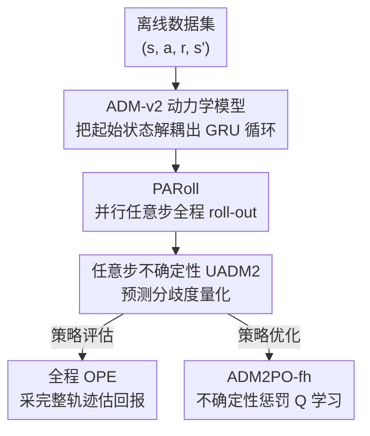

# ADM-v2: Pursuing Full-Horizon Roll-out in Dynamics Models for Offline Policy Learning and Evaluation

**会议**: ICLR2026  
**OpenReview**: [https://openreview.net/forum?id=ICbXEwqpga](https://openreview.net/forum?id=ICbXEwqpga)  
**代码**: https://github.com/LAMDA-RL/adm2  
**领域**: reinforcement learning  
**关键词**: 离线强化学习, 基于模型的 RL, 动力学模型, 全程 roll-out, 不确定性估计

## 一句话总结
ADM-v2 把"任意步动力学模型"的起始状态从 GRU 循环中结构性解耦，配合并行任意步 roll-out 算法 PARoll，让动力学模型能可靠地跑完整条轨迹（full-horizon roll-out），从而在离线策略评估和离线策略优化上同时刷到 D4RL / NeoRL 的 SOTA。

## 研究背景与动机
**领域现状**：离线强化学习（offline RL）只能从一份固定数据集里学策略，没法和真实环境交互。基于模型的离线 RL（offline MBRL）的思路是先从数据里学一个动力学模型 $\hat{T}$，再把大量的策略探索和评估搬进这个模型里做，省下真实样本。理想情况下，模型应该能像一个仿真器一样让策略 roll out 出**完整的一整条 episode**。

**现有痛点**：但绝大多数动力学模型（集成模型 EDM、因果模型、对抗模型等）都做不到这一点。它们依赖**自举预测（bootstrapping prediction）**——下一个状态是基于"对当前状态的预测"再往下推的，于是 roll-out 越长，模型误差越滚越大（compounding error）。为了保证生成样本可靠，主流 MBRL 算法（MOPO、MOBILE 等）虽然理论上是在"全程 roll-out"假设下推导的，实际却只能用很短的、分支式的 roll-out（branched roll-out）来妥协，把轨迹截断。

**核心矛盾**：截断 roll-out 会伤害策略学习和评估。一方面，截断让策略探索不到边缘状态，影响价值函数估计；适当的长 roll-out 配合不确定性惩罚反而能带来更好性能。另一方面，离线策略评估（OPE）最自然的做法就是在模型里采样若干条完整轨迹算期望回报，这本身就要求模型有长程预测能力。所以问题的根本是：**自举预测导致的误差累积让"全程 roll-out"在实践中不可用**。

**切入角度**：本文延续了 Any-step Dynamics Model（ADM，Lin et al. 2025）的范式——ADM 用一个 GRU 直接建模"执行任意 $k$ 步动作序列后的状态转移"，把自举预测降维成**直接预测**（direct prediction），从而压住误差累积。但原始 ADM 有个结构包袱：它把起始状态 $s_0$ 复制多份，和每一步动作拼在一起喂进 GRU（输入形如 $([s_0,a_0],[s_0,a_1],\cdots)$），导致 GRU 隐状态和 $s_0$ 强耦合，而且任意步预测没法并行加速。

**核心 idea**：把 $s_0$ 从 GRU 的每一步循环里**结构性解耦**出来——只在初始时把 $s_0$ 编码成隐状态 $h_0$，之后 GRU 每步只吃动作不吃 $s_0$。这样既让直接预测更准更稳，又能把不同步长的预测并行算出来，真正支撑起全程 roll-out。

## 方法详解

### 整体框架
ADM-v2 要解决的是"让动力学模型能可靠地跑完一整条轨迹"，整条管线分四块：先从离线数据训练 **ADM-v2 模型**（解耦起始状态的 GRU 直接预测器），再用 **PARoll** 算法在模型里并行地跑出全程 roll-out 并附带不确定性，最后把这些 roll-out 喂给两个下游任务——**全程 OPE**（评估给定策略）和 **ADM2PO-fh**（带不确定性惩罚的策略优化）。

形式上 ADM-v2 记作 $\hat{T}_\theta(s_{t+k}, r_{t+k} \mid s_t, a_{t:t+k-1})$：输入一个状态 $s_t$ 和一段长度 $k$（$1 \le k \le m$，$m$ 是最大预测步长）的动作序列，输出 $s_{t+k}$ 和 $r_{t+k}$ 各自的高斯分布。它由三个部件组成：状态编码器 $\text{enc}_\theta$、GRU 单元 $g_\theta$、转移解码器 $\text{dec}_\theta$，其中 GRU + 解码器合称一个 **ADM2 Unit**。

### 关键设计

**1. ADM-v2 架构：把起始状态从 GRU 的每一步循环里解耦出去**

原始 ADM 的毛病是把起始状态 $s_t$ 反复塞进 GRU 的每一步输入，造成隐状态和 $s_t$ 强耦合、结构僵硬、且无法并行。ADM-v2 的做法很干净：先用状态编码器把回溯起点 $s_t$ 编码成隐向量 $h_t = \text{enc}_\theta(s_t)$，**直接把 $h_t$ 当作 GRU 的初始隐状态**；之后 GRU 每一步只吃动作不再吃 $s_t$，即 $h_{t+1} = g_\theta(h_t, a_t)$；再由转移解码器把 $h_{t+1}$ 解成 $s_{t+1}$、$r_{t+1}$ 的高斯参数 $(\mu^s_{t+1}, \Sigma^s_{t+1}, \mu^r_{t+1}, \Sigma^r_{t+1}) = \text{dec}_\theta(h_{t+1})$。隐状态可以一直往后传，直到达到最大步长 $m$。

把 $s_t$ 的信息浓缩进 $h_t$、不再每步重复注入，好处有二：一是 $s_t$ 的扰动对多步直接预测的影响被削弱，预测更可靠；二是这种"初始隐状态 + 纯动作序列"的结构天然适合并行。整个网络端到端训练，对隐状态 $h$ 等中间变量不做任何显式监督，直接最大化各步长 $k$ 上的对数似然并按 $m$ 个步长平均：

$$J_{\hat{T}}(\theta) = \frac{1}{m}\sum_{k=1}^{m} \mathbb{E}_{(s_t, a_{t:t+k-1}, r_{t+k}, s_{t+k}) \sim D_{\text{env}}}\left[\log \hat{T}_\theta(s_{t+k}, r_{t+k} \mid s_t, a_{t:t+k-1})\right]$$

做长程预测时，把 roll-out 切成多个长度为 $m$ 的窗口：每个窗口内部都是从一个真实/预测起点出发的直接预测、不累积误差，**只有在窗口切换时才发生一次状态自举**。这就把误差累积从"每一步都发生"压缩到"每 $m$ 步才发生一次"。

**2. PARoll：把不同步长的任意步预测并行算出来，跑出完整轨迹**

ADM 虽然能靠"从不同距离回溯历史状态"生成多样化预测来估计不确定性，但它要在每一步递归回溯、反复调用 GRU，roll-out 时很耗时。ADM-v2 直接丢掉回溯机制，改用 **Parallel Any-step Roll-out（PARoll）**：roll-out 开始时先从数据里采一批长度 $m-1$ 的状态-动作序列 $(s_0, a_0, \cdots, s_{m-2}, a_{m-2}, s_{m-1})$，这里有 $m$ 个不同时刻的可选起点，每个起点对应一条"时间线"。对第 $i$ 条时间线，把 $s_{i-1}$ 编码成 $h^{(i)}_{i-1}$ 再递归喂入动作，得到第 $m-1$ 步的隐状态 $h^{(i)}_{m-1}$；这样就拿到 $m$ 个起始隐状态。

之后每往前走一步，$m$ 条时间线的隐状态用同一个动作**并行更新**：$h^{(i)}_t = g_\theta(h^{(i)}_{t-1}, a_{t-1})$，再并行解码出 $\hat{s}^{(i)}_t$。这 $m$ 个预测 $(\hat{s}^{(1)}_t, \cdots, \hat{s}^{(m)}_t)$ 因为来自不同的回溯起点、走过不同的转移步长，天然就是多样化的预测。由于训练时最大步长是 $m$，隐状态不能无限传下去，每条时间线在到达最大步长时就把当前预测状态重新编码、重置隐状态——巧妙的是每一步**只有一条时间线**需要重置（时间线 $(t \bmod m)+2$）。所以每步只需一次状态编码 + 一次并行 GRU + 一次并行解码，就能让每条 roll-out 都跑到全程，效率远高于 ADM/RDM/P-Dreamer 这些 RNN 类模型。

**3. 任意步不确定性 UADM2 与 ADM2PO-fh：用预测分歧度做策略优化的惩罚项**

离线策略难免会探到数据没覆盖、模型很不确定的危险区域，需要一个不确定性惩罚把它拉回来。PARoll 跑出来的 $m$ 个多样化预测正好可以**不用集成**就量化不确定性——在每步 $t \ge m-1$ 从 $(\hat{s}^{(1)}_{t+1}, \cdots, \hat{s}^{(m)}_{t+1})$ 里均匀取一个当预测，再用它们的方差当不确定性：

$$U_{\text{ADM2}}(s_t, a_t) = \mathbb{E}\left[\frac{1}{m}\sum_{k=1}^{m}\left((\Sigma^{(k)}_{s_t})^2 + (\mu^{(k)}_{s_t})^2\right) - (\bar{\mu}_t)^2\right]$$

其中 $\bar{\mu}_t = \frac{1}{m}\sum_k \mu^{(k)}_{s_t}$。这个不确定性能在 PARoll 里并行算出来，几乎不额外花时间。理论上（Theorem 3.1）存在系数 $\beta$ 使 $\beta \cdot U_{\text{ADM2}}$ 成为合法的 $\xi$-不确定性量词，能 bound 住 Bellman 误差。于是把它当惩罚塞进 Q 估计：

$$\hat{T}_{\text{ADM2}} Q(s_t, a_t) := \hat{T}^\pi Q(s_t, a_t) - \beta \cdot U_{\text{ADM2}}(s_t, a_t)$$

直觉是：危险区域不确定性大、Bellman 误差界松、容易高估 Q，就给它更大的惩罚；而分布内样本不确定性低、惩罚几乎不起作用，不干扰正常学习。本质是引导策略在"可靠的状态-动作区域"里争取好性能。把全程 roll-out + 这个惩罚结合起来的策略优化算法就是 **ADM2PO-fh**。

**4. 全程 OPE 与性能界：把模型当代理环境直接评估策略**

学好 ADM-v2 后，可以直接把它当作代理环境：对任意给定策略，roll out 若干条完整轨迹、算平均回报，就是离线策略评估（OPE）。评估回报和真实回报之间的差距取决于长程 roll-out 的精度，本文用 Theorem 3.2 给出了性能界 $|\eta(\pi) - \hat{\eta}(\pi)| \le C(\delta_{\max}, \epsilon_\pi)$，其中 $\delta_{\max}$ 是 $k$ 步转移分布的最大散度、$\epsilon_\pi$ 是策略散度。关键结论是：当 $\delta_{\max} < \frac{\delta_1(1-\gamma^m)}{1-\gamma}$（实验里验证可满足）时，ADM-v2 的界比单步动力学模型**更紧**；若令 $m=1$，这个界正好退化成单步模型的经典界。这就从理论上解释了为什么"能全程 roll-out 的模型"做 OPE 更可靠。

### 损失函数 / 训练策略
训练目标就是上面式 (1) 的多步长平均对数似然 $J_{\hat{T}}(\theta)$，梯度直接经 GRU、状态编码器、转移解码器回传，端到端优化，不对隐状态等中间量做显式监督。最大步长 $m$ 是关键超参，需要选到满足 $\delta_{\max} < \frac{\delta_1(1-\gamma^m)}{1-\gamma}$、让性能界比单步模型更紧的值。

## 实验关键数据

### 主实验
在 D4RL 和 NeoRL 的 MuJoCo 任务上做离线 RL，对比模型无关方法（CQL、EDAC）、短分支 roll-out 的 MBRL（MOPO、MOBILE、MOREC、ADMPO）以及各动力学模型的全程 roll-out 版本。ADM2PO-fh 在两个 benchmark 上都拿到 SOTA：

| 数据集 | 指标 | ADM2PO-fh (本文) | 之前SOTA (MOREC) | 提升 |
|--------|------|------|----------|------|
| D4RL MuJoCo (12 任务平均) | 归一化分数 | 87.6 | 83.7 | >4.6% |
| NeoRL MuJoCo (9 任务平均) | 归一化分数 | 79.0 | 70.3 | >12.8% |

值得注意的是，**只有 ADM-v2 能在全程 roll-out 下让策略拿到强性能**：MOPO 和 ADMPO 一旦改成全程 roll-out（MOPO-fh、ADMPO-fh），分数就因为长程误差累积而严重崩塌（如 D4RL 平均从 70.3/81.0 掉到 36.5/56.4）。

### 消融 / 分析实验

| 配置 | 关键指标 | 说明 |
|------|---------|------|
| ADM-v2 直接预测 vs ADM | $m$ 步预测误差 | ADM-v2 误差更低，结构优于 ADM |
| 全程 roll-out 误差 (horizon=1000) | roll-out error | ADM-v2 曲线全程低于 EDM/RDM/P-Dreamer，到 episode 末仍不发散 |
| roll-out 吞吐量 | samples/second | ADM-v2 高于 ADM/RDM/P-Dreamer；略低于结构简单的 EDM 但差距不大 |
| 不确定性-误差相关性 | 相关系数 | ADM-v2 达 0.928，优于 ADM(0.871)、EDM(0.576)、RDM(0.548)、P-Dreamer(0.183) |

OPE 方面，在 DOPE benchmark 的 15 个任务上用归一化绝对误差、rank correlation、regret@1 三个指标评估，ADM-v2 显著超过 5 个模型无关 OPE 方法（FQE、DR、IS、DICE、VPM）以及其它动力学模型。

### 关键发现
- **全程 roll-out 能力是性能关键**：能跑全程的 ADM-v2 大幅提升策略性能，而不具备长程预测能力的模型一改全程 roll-out 就崩，说明"是否能可靠全程 roll-out"才是分水岭。
- **直接预测 + 解耦起始状态压住了误差累积**：ADM-v2 的全程 roll-out 误差到 1000 步仍不趋于无穷，把窗口内误差控制住了。
- **不确定性量化质量高**：0.928 的不确定性-误差相关性意味着 $U_{\text{ADM2}}$ 是个合格的误差估计器，且能更清晰地区分随机策略 / 学到的策略 / 数据行为的分布偏移。

## 亮点与洞察
- **"解耦起始状态"这一步看似简单却一举多得**：既减弱了起点扰动对多步预测的影响（更准更稳），又解锁了并行计算（更快），还顺手丢掉了 ADM 笨重的回溯机制——一个结构改动同时打中精度、效率、可扩展三个点。
- **PARoll 的"多时间线并行 + 每步只重置一条"很巧**：用不同回溯起点天然制造预测多样性来估不确定性，省掉了集成模型的多份网络；而隐状态重置被错峰安排成每步只动一条时间线，把多样化预测的代价摊薄到接近常数。
- **把"模型能否全程 roll-out"上升成理论命题**：Theorem 3.2 给出全程模型 OPE 界比单步模型更紧的条件，并能退化回单步经典界，让"长程 roll-out 更可靠"从经验观察变成可证的结论。

## 局限与展望
- **效率上对 EDM 仍有微小劣势**：作为 RNN 类模型，ADM-v2 的 roll-out 吞吐量虽优于其它 RNN 模型，但仍略低于结构极简的集成模型 EDM，作者认为考虑到保真度优势这点代价可接受。
- **依赖最大步长 $m$ 的选择**：性能界更紧需要 $m$ 满足 $\delta_{\max} < \frac{\delta_1(1-\gamma^m)}{1-\gamma}$，$m$ 的选取要兼顾"窗口内不累积误差"和"窗口切换次数"，是个需要调的关键超参。
- **实验局限在 proprioceptive MuJoCo**：评测集中在状态向量型的 MuJoCo 任务（D4RL/NeoRL/DOPE），高维视觉观测、更复杂的真实决策任务上的全程 roll-out 表现还有待验证。

## 相关工作与启发
- **vs 原始 ADM (Lin et al. 2025)**：两者都靠"直接预测代替自举预测"压误差累积，但 ADM 把起始状态复制进 GRU 每一步、结构僵硬且不能并行；ADM-v2 把起始状态编码成初始隐状态解耦出来，并用 PARoll 替代回溯机制，预测更准、roll-out 更快。
- **vs 短分支 roll-out MBRL（MOPO / MOBILE / ADMPO）**：它们理论上假设全程 roll-out、实际却只能用短分支 roll-out 妥协，一旦真用全程 roll-out 就因误差累积崩盘；ADM-v2 是第一个能在全程 roll-out 设定下拿到 SOTA 的方法。
- **vs 集成式不确定性（EDM 等）**：传统做法靠多份独立网络的预测方差估不确定性；ADM-v2 用单模型不同回溯起点的预测分歧度即可量化，且相关性更高（0.928 vs 0.576）。

## 评分
- 新颖性: ⭐⭐⭐⭐ 在 ADM 基础上做的结构性改进，解耦起始状态 + PARoll 的组合既优雅又解决了真问题，但属于成熟范式的延伸。
- 实验充分度: ⭐⭐⭐⭐⭐ 覆盖动力学模型评估、OPE、离线 RL 三大任务，D4RL/NeoRL/DOPE 多 benchmark + 多 baseline + 多 seed，并配理论界。
- 写作质量: ⭐⭐⭐⭐ 结构清晰、图文对照充分，公式和理论交代到位；部分符号（如 PARoll 的多时间线下标）需要细读。
- 价值: ⭐⭐⭐⭐⭐ 让"全程 roll-out"在离线 MBRL 里从理论假设变成可用工具，对离线策略评估与优化都有直接实用价值，且开源代码。

<!-- RELATED:START -->

## 相关论文

- [\[ICLR 2026\] Beyond Penalization: Diffusion-based Out-of-Distribution Detection and Selective Regularization in Offline Reinforcement Learning](beyond_penalization_diffusion-based_out-of-distribution_detection_and_selective_.md)
- [\[ICML 2026\] Offline Reinforcement Learning with Universal Horizon Models](../../ICML2026/reinforcement_learning/offline_reinforcement_learning_with_universal_horizon_models.md)
- [\[ICLR 2026\] MOBODY: Model-Based Off-Dynamics Offline Reinforcement Learning](mobody_model-based_off-dynamics_offline_reinforcement_learning.md)
- [\[ICLR 2026\] Adaptive Scaling of Policy Constraints for Offline Reinforcement Learning](adaptive_scaling_of_policy_constraints_for_offline_reinforcement_learning.md)
- [\[ICLR 2026\] Enhancing Generative Auto-bidding with Offline Reward Evaluation and Policy Search](enhancing_generative_auto-bidding_with_offline_reward_evaluation_and_policy_sear.md)

<!-- RELATED:END -->
