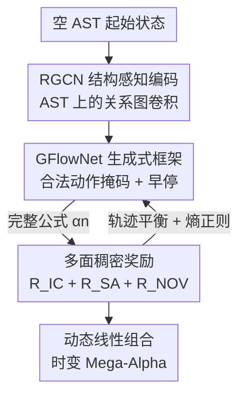

# AlphaSAGE: Structure-Aware Alpha Mining via GFlowNets for Robust Exploration

**会议**: ICLR 2026  
**OpenReview**: [https://openreview.net/forum?id=zRKF4ln2VE](https://openreview.net/forum?id=zRKF4ln2VE)  
**代码**: https://github.com/BerkinChen/AlphaSAGE  
**领域**: 量化金融 / 生成流网络 / 符号表达式挖掘  
**关键词**: alpha 挖掘, GFlowNets, RGCN, 结构感知, 多样性奖励

## 一句话总结
AlphaSAGE 把量化选股中的公式化 alpha 挖掘从"最大化期望回报的强化学习"改写成"按奖励正比采样的生成流网络（GFlowNets）"，再配上 RGCN 结构编码器和稠密多面奖励，从而一次性挖出一批既预测力强、又彼此低相关、还结构新颖的 alpha 组合，在中美股市多个股票池上全面超过现有 RL/GA/LLM baseline。

## 研究背景与动机
**领域现状**：量化交易的核心是挖"alpha"——把历史价量、基本面等数据映射成对未来收益的预测信号，通常写成可解释的数学公式（如 $\text{Log}(\text{TsStd}(\text{low}, 10d))$）。早期靠人手提假设，后来用遗传算法（GA）做公式进化，近年主流转向强化学习（RL）：把构造公式建模成逐 token 的序列决策，agent 一步步往表达式里加算子/特征。

**现有痛点**：作者指出 RL 路线被三个相互纠缠的问题拖累。其一是**奖励稀疏**——只有把整条公式写完才能算出它的信息系数（IC）拿到反馈，中间步骤没有信号，导致"冷启动"困难、探索低效不稳。其二是**表示不充分**——大多方法把公式拍平成逆波兰式（RPN）token 序列丢给 LSTM，丢掉了表达式的层级结构，把语义等价但写法不同的式子（如 `close+open` 与 `open+close`）当成完全不同的对象。其三是**模式坍缩**——RL 的目标是最大化单一期望回报，天然把策略往"唯一最优解"上收敛，而实战需要的恰恰是一**篮子彼此不相关**的 alpha 才能分散风险。

**核心矛盾**：最大化期望回报的目标函数与"要多样化组合"的实战需求在数学上直接打架——前者要收敛到一个峰，后者要覆盖多个峰。

**本文目标**：同时解决探索（奖励稀疏）、语义理解（结构表示）、多样性（避免坍缩）三件事。

**切入角度**：GFlowNets 的采样目标是让生成某对象的概率**正比于其奖励** $P(\alpha)\propto R(\alpha)$，而非只取最优——这天然产出"高奖励但多样"的一批解，正好对上 alpha 组合的需求。

**核心 idea**：用 GFlowNets 替代 RL 来采样 alpha 分布，用 RGCN 在抽象语法树（AST）上做结构感知编码，再用稠密的多面奖励（预测力 + 结构对齐 + 新颖度）把稀疏反馈补成逐步可用的信号。

## 方法详解

### 整体框架
AlphaSAGE 要在巨大的公式空间 $\mathcal{X}$ 里学一个**生成策略** $P_\theta(\alpha)$，让采到任意 alpha 的概率正比于一个精心设计的奖励 $R(\alpha)$，从而一口气产出多样而高质量的 alpha 组合，再线性组合成时变的 Mega-Alpha 去交易。整条流水线分两块协同：**AlphaGenerator** 从空 AST 出发逐步生长公式——每一步先用 RGCN 把当前部分树编码成节点和图级嵌入，再让 GFlowNet 的前向策略只在"语法合法"的动作里采下一个 token，直到触发早停或到长度上限收尾；**AlphaEvaluator** 拿到完整公式后在历史截面数据上算三路奖励（结构对齐 $R_{SA}$、新颖度 $R_{NOV}$、预测力 $R_{IC}$），合成总奖励，配合一个策略熵正则，通过轨迹平衡（Trajectory Balance）目标反过来更新 GFlowNet 和编码器。

### 关键设计

**1. GFlowNet 生成式框架：把"求最优"换成"按奖励采样"**

这一条直击模式坍缩。AlphaSAGE 把公式构造建模成有向无环状态图上的一条轨迹 $\tau=(s_0\to s_1\to\cdots\to s_n=\alpha)$：状态 $s$ 是部分构造的 AST（$s_0$ 为空树，终止态是完整合法的 AST），动作是往某个开放叶子加一个算子/特征 token，且**非法动作会被掩码**，下一 token 只从合法分布里采。GFlowNet 学一个前向策略 $P_F(s_{t+1}|s_t;\theta)$ 负责生长、一个后向策略 $P_B(s_t|s_{t+1};\theta)$ 负责拆解，通过流匹配条件保证生成完整 alpha 的概率满足 $P(\alpha)=\sum_{\tau:s_n=\alpha}P_F(\tau)=R(\alpha)/Z$，其中 $Z=\sum_{\alpha'}R(\alpha')$ 是可学的配分函数。训练用轨迹平衡损失：

$$\mathcal{L}_{TB}(\tau)=\Big(\log Z_\theta+\sum_{t=1}^{n}\log P_F(s_t|s_{t-1};\theta)-\log R(s_n)-\sum_{t=1}^{n}\log P_B(s_{t-1}|s_t;\theta)\Big)^2$$

与 RL 只奔单峰不同，这个目标让策略覆盖整个高奖励区域，因此采出的就是一篮子结构各异的候选。为避免公式无限长或超长后被强行截成非法态，还加了**早停机制**：当前栈已构成合法表达式时，以概率 $p=\text{Len}(s_t)/\text{MaxLen}$ 停止，用节点数与最大长度之比平衡"探索更长公式"和"高效产出合法式子"。

**2. RGCN 结构感知编码器：让等价公式有等价表示**

针对序列表示丢结构的痛点，AlphaSAGE 先把每条公式解析成 AST $T_\alpha=(V_\alpha,E_\alpha)$，这种表示对"语义无关的写法差异"天然不变。再用关系图卷积网络（RGCN）编码——之所以不用普通 GNN，是因为 AST 里边的"类型"很关键：时序算子连到特征 vs 时序算子连到它的窗口长度，是两种语义完全不同的关系，普通 GNN 一视同仁会混淆。RGCN 给每种关系 $r$ 配独立权重 $W_r^{(l)}$，节点更新为

$$h_v^{(l)}=\text{ReLU}\Big(\sum_{r\in R}\sum_{u\in N_r(v)}\tfrac{1}{c_{v,r}}W_r^{(l)}h_u^{(l-1)}+W_0^{(l)}h_v^{(l-1)}\Big)$$

最后对所有节点做最大池化得到图级嵌入 $e_\alpha$。这个嵌入既喂给 GFlowNet 前向策略做生成条件，也用于下面的结构对齐奖励，是连接"生成"和"评估"的中枢。

**3. 多面稠密奖励：把稀疏的终局 IC 补成逐步可用的信号**

这条解决奖励稀疏。总奖励是三项的时变加权和 $R(\alpha,T)=R_{IC}(\alpha)+\lambda(T)R_{SA}(\alpha)+\eta(T)R_{NOV}(\alpha)$。其中 $R_{IC}$ 是终局预测力，即 alpha 输出与未来收益的信息系数；$R_{NOV}=1-\max_{\alpha'\in F_{known}}|IC(\alpha,\alpha')|$ 惩罚与已发现高质量 alpha 库的相关性、逼出新信号；**结构对齐奖励 $R_{SA}$** 是本文最巧的一项——它要求"结构嵌入相近的 alpha 行为也应相近"，先定义行为距离 $d_{behav}(\alpha_i,\alpha_j)=\frac{1}{D}\sum_d(Z_i(d)-Z_j(d))^2$（两 alpha 截面标准化输出的逐日平方差均值），再以嵌入距离的 softmax 权重 $w_{ij}$ 在 K 近邻上加权，得 $R_{SA}(\alpha_i)=\exp(-\sum_{j\in N_K}w_{ij}\cdot d_{behav}(\alpha_i,\alpha_j))$，把"结构嵌入空间"和"实际行为空间"对齐起来。权重 $\lambda(T)=(1-T/T_{anneal})\lambda_{max}$、$\eta(T)$ 随训练退火——早期靠结构/新颖度密集引导探索，后期让位给真预测力。作者强调三项**同号兼容**：预测力、结构-行为对齐、新颖度都越高越好，互不对抗。最终目标再叠一个前向策略熵正则 $\mathcal{L}_{ENT}$ 防过早收敛：$\mathcal{L}_{final}=\mathbb{E}_\tau[\mathcal{L}_{TB}(\tau)]+\beta\cdot\mathcal{L}_{ENT}$。

**4. 动态线性组合：把一篮子 alpha 拼成时变 Mega-Alpha**

挖出的多样 alpha 还要落地成单一交易信号。AlphaSAGE 沿用 AlphaForge 的动态再选思路：不固定一组静态 alpha，而是每个调仓期筛出近期有效的 alpha、用简单线性回归重新加权，得到随时间变化的"Mega-Alpha"。这样既能快速适应市场风格切换，又保持可解释性（每个 alpha 贡献透明），还通过丢弃过时/冗余信号避免过拟合——比复杂非线性组合器在鲁棒性、效率和解释性之间更平衡。

### 损失函数 / 训练策略
核心目标是轨迹平衡损失 $\mathcal{L}_{TB}$（式 6）加前向策略熵正则 $\mathcal{L}_{ENT}$（式 15），合成 $\mathcal{L}_{final}=\mathbb{E}_\tau[\mathcal{L}_{TB}]+\beta\mathcal{L}_{ENT}$（式 16）。奖励三项权重 $\lambda(T)$、$\eta(T)$ 线性退火，使结构对齐和新颖度奖励在训练后期逐渐减弱，让位给终局 IC。

## 实验关键数据

### 主实验
在中国市场 CSI300/500/1000 与美国 S&P500 上对比传统 ML（MLP/LightGBM/XGBoost）、GA（GP）、RL（AlphaGen/AlphaQCM）、GAN（AlphaForge）、LLM（AlphaAgent）等 baseline，AlphaSAGE 在全部相关性指标上排第一，且转化为最佳组合表现（最高年化、最低回撤、最高夏普）。CSI300 结果：

| 数据集 | 方法 | IC | ICIR | RIC | RICIR | AR | MDD | SR |
|--------|------|----|----|-----|-------|-----|-----|-----|
| CSI300 | XGBoost | 0.031 | 0.243 | 0.033 | 0.248 | 5.40% | -17.5% | 1.26 |
| CSI300 | AlphaGen | 0.058 | 0.414 | 0.057 | 0.360 | 4.00% | -22.6% | 0.76 |
| CSI300 | AlphaAgent | 0.051 | 0.325 | 0.056 | 0.329 | 2.16% | -26.9% | 0.65 |
| CSI300 | **AlphaSAGE** | **0.079** | **0.496** | **0.094** | **0.583** | **7.62%** | **-17.3%** | **1.71** |

IC 从次优的 0.058（AlphaGen）提到 0.079，RICIR 几乎翻倍（0.360→0.583），夏普从 1.55（GP 次优）提到 1.71。多随机种子实验显示排名稳定，CSI300（2022–2024）累计收益曲线全程领先且回撤更平滑、反弹捕捉更强。

### 消融实验

| 配置 | 效果趋势 | 说明 |
|------|---------|------|
| 纯 GFlowNet | 最弱 | 不带任何增强的 baseline |
| + 早停 (ES) | 反而更差 | ES 需要更强编码器配合才有用 |
| 序列编码器 → GNN | 单项最大提升 | 结构感知表示价值最大 |
| + 结构对齐奖励 (SA) | ICIR/RICIR 排名更稳、回撤收紧 | 提升排序稳定性 |
| + 新颖度奖励 (NOV) | 信号质量与可交易性双升 | 减少因子冗余 |
| + 熵正则 (ENT) | 整体最优 | IC/RIC/AR/SR 全升、MDD 受控 |

### 关键发现
- **结构感知编码（GNN 替换序列编码器）是单项贡献最大的组件**，印证了"丢结构"才是 RL 路线的最大短板。
- 早停单独加反而掉点，说明它必须配强编码器才生效——组件之间存在依赖，不能孤立堆叠。
- 新颖度与结构对齐奖励的权重在小到中等区间收益最好（敏感性分析），过大反而无益。
- 熵正则带来鲁棒的探索，是把各组件拼到最优的"收尾"一步。

## 亮点与洞察
- **用 GFlowNets 把"多样性"做进目标函数本身**：多数方法靠后处理去重来凑组合，AlphaSAGE 直接让采样概率正比于奖励，从源头产出低相关 alpha——这是对"RL 目标与组合需求相矛盾"这一根因的正面解法，思路可迁移到任何"既要质量又要多样"的符号/分子/程序生成任务。
- **结构对齐奖励 $R_{SA}$ 把表示学习和行为预测绑在一起**：它不只让嵌入"结构上像"，还约束"结构像 ⇒ 行为像"，相当于给 RGCN 嵌入空间装了个行为锚，避免学出"看着像但实际不一样"的表示。
- **奖励退火调度**很务实：早期密集的结构/新颖度信号解决冷启动，后期回归真预测力，等于把稀疏的终局 IC 平滑成全程可用的稠密信号。

## 局限与展望
- 美国市场数据因数据源限制只到 2020-12-31，跨市场结论的时效性受限。
- 组合阶段直接沿用 AlphaForge 的动态线性方案，未探索组合器本身的改进空间，端到端联合优化"生成 + 组合"仍有余地。
- 多面奖励引入 $\lambda_{max}$、$\eta_{max}$、$\beta$、$T_{anneal}$、K 近邻数等多个超参，调参成本和对新市场的迁移代价尚未充分讨论。
- 早停机制依赖强编码器才生效，组件间的依赖关系提示该框架对实现细节较敏感。

## 相关工作与启发
- **vs AlphaGen / AlphaQCM（RL 路线）**: 都把 alpha 构造建模成序列决策，但它们最大化期望回报、易模式坍缩且奖励稀疏；AlphaSAGE 改用 GFlowNets 按奖励采样 + 稠密多面奖励，IC 与组合指标全面领先。
- **vs AlphaForge（GAN 路线）**: AlphaSAGE 借用了它的动态线性组合做下游，但生成端用结构感知的 GFlowNet 替代对抗生成，挖出的 alpha 更多样、预测力更强。
- **vs AlphaAgent（LLM 路线）**: LLM 靠语言模型提假设，AlphaSAGE 走可解释的符号 AST + 图编码，在所有市场上相关性与组合指标都更优。
- **vs 用 LSTM 处理 RPN 的序列编码方法**: 它们把公式拍平丢结构、把等价式子当不同对象；AlphaSAGE 用 AST + RGCN 显式建模算子-特征-窗口的异质关系，消融显示这是单项最大增益来源。

## 评分
- 新颖性: ⭐⭐⭐⭐⭐ 首次把 GFlowNets 系统性引入公式化 alpha 挖掘，正面回应"多样性 vs 单峰最优"的根本矛盾。
- 实验充分度: ⭐⭐⭐⭐ 覆盖中美 4 个股票池 + 多种 baseline + 多种子稳健性 + 逐组件消融与敏感性分析，仅美国数据时效偏老。
- 写作质量: ⭐⭐⭐⭐ 问题三分法清晰、方法与奖励公式完整，框架图与符号一致。
- 价值: ⭐⭐⭐⭐⭐ 量化选股可直接落地，且"按奖励采样求多样高质量解"的范式对符号/程序生成普遍有借鉴意义。

<!-- RELATED:START -->

## 相关论文

- [\[ICLR 2026\] SHAPO: Sharpness-Aware Policy Optimization for Safe Exploration](shapo_sharpness-aware_policy_optimization_for_safe_exploration.md)
- [\[ICLR 2026\] Beyond Noisy-TVs: Noise-Robust Exploration Via Learning Progress Monitoring](beyond_noisy-tvs_noise-robust_exploration_via_learning_progress_monitoring.md)
- [\[ICLR 2026\] ROMI: Model-based Offline RL via Robust Value-Aware Model Learning with Implicitly Differentiable Adaptive Weighting](model-based_offline_rl_via_robust_value-aware_model_learning_with_implicitly_dif.md)
- [\[ICML 2026\] Decoupling Skeleton and Flesh: Efficient Multimodal Table Reasoning with Disentangled Alignment and Structure-aware Guidance](../../ICML2026/reinforcement_learning/decoupling_skeleton_and_flesh_efficient_multimodal_table_reasoning_with_disentan.md)
- [\[ICLR 2026\] Solving Football by Exploiting Equilibrium Structure of 2p0s Differential Games with One-Sided Information](solving_football_by_exploiting_equilibrium_structure_of_2p0s_differential_games_.md)

<!-- RELATED:END -->
