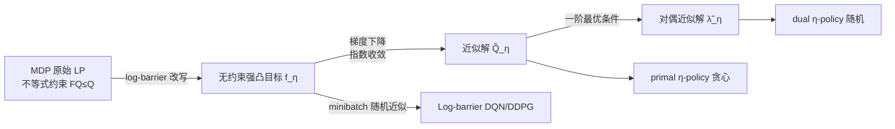

# Analysis of Approximate Linear Programming Solution to Markov Decision Problem with Log Barrier Function

**会议**: ICLR 2026  
**OpenReview**: [https://openreview.net/forum?id=Gy83NOlS8f](https://openreview.net/forum?id=Gy83NOlS8f)  
**代码**: 待确认  
**领域**: 强化学习 / 理论  
**关键词**: 线性规划 MDP, 对数障碍函数, 误差界, 凸优化, DQN, DDPG  

## 一句话总结
本文用对数障碍（log-barrier）函数把 MDP 的线性规划（LP）形式从不等式约束问题改写成一个无约束的强凸目标 $f_\eta$，证明其近似最优 Q 函数与障碍参数 $\eta$ 成线性误差界、梯度下降指数收敛，并据此设计出无需 target network 的 Log-barrier DQN / DDPG。

## 研究背景与动机
**领域现状**：求解 MDP 有两条主线——基于 Bellman 方程的动态规划（DP/RL 主流，DQN 等都属此类），以及基于线性规划（LP）的方法。LP 形式近年在 offline RL 中重新受关注，因为它对约束、分布等结构更灵活。

**现有痛点**：LP 形式天生是**不等式约束优化**问题，比 Bellman 方程难解。现有 LP-based RL 几乎都走 primal-dual（原始-对偶）迭代，收敛慢、计算开销大，且在很多实际设置下不保证收敛。这正是 LP 路线长期被冷落的根本原因。

**核心矛盾**：LP 形式有结构优势（直接是最小化目标、天然对抗 Q 值高估），但其不等式约束让它难以像 Bellman 方法那样用简单梯度下降高效求解。如何在保留 LP 结构优势的同时，把它变成"好优化"的对象？

**本文目标**：为 LP-based MDP 建立一套既有理论又能落地的求解框架——把约束消掉、给出可量化的近似误差、并证明收敛性。

**核心 idea**：**【障碍函数改写】**借用凸优化里经典的对数障碍函数 $\phi(x)=-\ln(-x)$，把 LP 的所有不等式约束吸收进单一目标函数，得到一个无约束、严格凸的优化问题，从而可以直接用梯度下降求近似解，且障碍参数 $\eta\to 0$ 时近似解逼近真解。

## 方法详解

### 整体框架
全文围绕一个由障碍参数 $\eta>0$ 控制的单目标函数 $f_\eta(Q)$ 展开：先把基于 Q 函数的 MDP 原始 LP（极小化 $\sum \rho(s,a)Q(s,a)$ 受约束于 $FQ\le Q$）用 log-barrier 改写成无约束目标，证明它在可行域上严格凸；再从误差界、收敛性、对偶解三个角度做理论刻画；最后把该目标的 minibatch 随机近似当成损失函数，移植进 DQN/DDPG。

### 关键设计

**1. 对数障碍改写：把不等式约束熔进一个强凸目标。** 原始 LP 的约束是 $(FQ)(s,a,a')-Q(s,a)\le 0$，其中 $(FQ)(s,a,a')=R(s,a)+\gamma\sum_{s'}P(s'|s,a)Q(s',a')$。本文对每条约束施加对数障碍惩罚，合成目标
$$f_\eta(Q)=\sum_{(s,a)}\rho(s,a)Q(s,a)+\eta\sum_{(s,a,a')}w(s,a,a')\,\phi\big((FQ)(s,a,a')-Q(s,a)\big),$$
当约束逼近违反时 $\phi$ 趋于无穷，把迭代点"挡"在严格可行域 $D=\{Q:(FQ)-Q<0\}$ 内。文中证明 $D$ 是凸、开、下方有界的集合，$f_\eta$ 在 $D$ 上严格凸、在任意水平集 $L_c$ 上强凸且梯度 Lipschitz——这一整套结构性质保证了后面梯度下降的可解性与可收敛性。权重 $w(s,a,a')>0$ 看似冗余，实则是为后续随机/minibatch 采样实现埋下接口（可取经验分布或全 1）。

**2. 闭式梯度与对偶变量的"显形"。** 直接求导得到梯度
$$(\nabla_Q f_\eta(Q))(s,a)=\rho(s,a)+\gamma\sum_{(s',a')}P(s|s',a')\lambda_\eta(s',a',a)-\sum_{a'}\lambda_\eta(s,a,a'),$$
其中 $\lambda_\eta(s,a,a'):=\dfrac{\eta\,w(s,a,a')}{Q(s,a)-(FQ)(s,a,a')}$。妙处在于：令梯度为零的一阶最优条件，恰好与对偶 LP（Lemma 1）的等式约束**逐字相同**——这说明 minimizer $\tilde Q_\eta$ 自带的 $\tilde\lambda_\eta$ 就是对偶最优变量 $\lambda^*$ 的近似。于是从同一个近似解可同时导出两类策略：贪心的 primal η-policy $\tilde\beta_\eta(s)=\arg\max_a\tilde Q_\eta(s,a)$，以及由 $\tilde\lambda_\eta$ 归一化得到的随机 dual η-policy $\tilde\pi_\eta$。primal-dual 的两侧信息被一个无约束问题统一了起来。

**3. 双侧线性误差界：近似有多近，可被 $\eta$ 精确量化。** 这是理论核心贡献。Theorem 1 给出近似 Q 与最优 Q 的 $\ell_\infty$ 误差**同时有上界和下界**，且都正比于 $\eta$：
$$\eta\min_{s,a,a'}w(s,a,a')<\|\tilde Q_\eta-Q^*\|_\infty\le \frac{\eta\sum_{s,a,a'}w(s,a,a')}{\min_{s,a}\rho(s,a)},$$
Bellman 误差 $\|\tilde Q_\eta-T\tilde Q_\eta\|_\infty$ 也有类似双侧线性界。Theorem 2 进一步把误差推到目标函数本身：primal/dual η-policy 的回报 $J$ 与最优 $J^{\pi^*}$ 的差距同样线性收缩于 $\eta$，且 dual η-policy 满足 $J^{\tilde\pi_\eta}\le J^{\pi^*}$。下界的存在说明这种近似误差不是"或许很小"，而是与 $\eta$ 同阶——给调参提供了可解释的依据：$\eta$ 越小越准，但越接近约束边界、数值越敏感。同时本文证明在温和条件下定值步长梯度下降**指数收敛**到 $\tilde Q_\eta$。

**4. 移植进深度 RL：去掉 target network 的 log-barrier 损失。** 把 $f_\eta$ 中的概率密度换成 replay buffer 的 minibatch 采样，得到 DQN 损失
$$L(\theta)=\frac{1}{|B|}\sum_{(s,a,r,s')\in B,\,a'}\big[Q_\theta(s,a)+\eta\,\phi(r+\gamma Q_\theta(s',a')-Q_\theta(s,a))\big].$$
与标准 DQN 两点关键不同：其一，不再有 MSE Bellman 损失，而是"极小化 Q 自身 + 障碍约束"；其二，**不使用 target 网络**，因而省去 target 同步。本文坦诚指出：由于状态转移概率在 log-barrier 外，该随机近似在随机环境下是有偏的（经 Jensen 不等式可证它其实是 $f_\eta$ 的上界 surrogate 的无偏估计），仅在确定性动力学下 Jensen gap 为零、无偏。policy evaluation 版本同理给出 DDPG 的 critic 损失 $L_{\text{critic}}$。

## 实验关键数据

### 主实验（离散控制：Log-barrier DQN vs DQN）
在 5 个 Gymnasium 环境（Acrobot-v1, CartPole-v1, LunarLander-v3, MountainCar-v0, Pendulum-v1）上对比，10 个随机种子取平均：

| 设置 | 表现 |
|------|------|
| 整体 | Log-barrier DQN 在多数环境与标准 DQN **持平** |
| CartPole-v1 | 适应更快、稳定性显著更好（特定任务**明显占优**） |
| MountainCar-v0 | 用 dense shaping 奖励替换原稀疏奖励 |
| Pendulum-v1 | 离散化连续动作空间以适配 DQN |

作者推测 CartPole 的优势来自"生存/终止"的尖锐决策边界：标准 DQN 的 Bellman+MSE 会跨边界传播误差，而 LP 形式直接全局极小化目标、规避了这种邻域估值的误差传播。

### 主实验（连续控制：Log-barrier DDPG vs DDPG）
在 MuJoCo 上对比，8 个随机种子：

| 环境 | 结果 |
|------|------|
| Ant / Walker2d / HalfCheetah / Humanoid | 性能**显著优于**标准 DDPG，甚至解出此前被认为标准 DDPG 难以攻克的 Ant、Humanoid |
| Hopper（较简单） | 无显著优势 |

### 关键发现
- **对抗 Q 值高估是 DDPG 提升的根因**：LP 形式本质是最小化目标，"在满足 Bellman 一致性约束下寻找最小 Q 值"，天然作为对乐观高估的隐式正则，得到更保守、更稳的 critic，从而给 actor 更可靠的梯度。
- **理论界与实践一致**：误差线性依赖 $\eta$ 的双侧界，解释了为何要小心调 $\eta$（精度 vs 数值稳定的权衡）。
- 替换 log-barrier 为 SoftPlus 等也可工作，但 log-barrier 通常最好。

## 亮点与洞察
- **把"难解的 LP 不等式约束"变成"好优化的强凸无约束目标"**，且整套凸性/强凸/Lipschitz 结构被严格证明，理论自洽且优雅。
- **双侧（上界+下界）误差界**比常见的只给上界更有信息量：它告诉你近似误差就是 $\Theta(\eta)$，无法靠运气更小，是诚实而可解释的刻画。
- **一阶最优条件 = 对偶 LP 等式约束**这一观察非常漂亮：让 primal 与 dual 在同一个无约束问题里自然汇合，免去显式 primal-dual 迭代。
- **去 target network 的 deep RL 变体**：把理论洞察（LP 形式天然抗高估）转化为实际算法优势，DDPG 上的提升尤其亮眼。

## 局限与展望
- **deep RL 部分的随机近似有偏**：随机环境下损失只是 $f_\eta$ 上界 surrogate 的无偏估计，确定性动力学才严格无偏；作者明确这是初步（preliminary）评估。
- **实验规模有限**：仅 Gym/MuJoCo 经典基准，缺大规模、复杂任务（如 Atari 全套、真实 offline RL 数据集）的验证。
- **对 $\eta$ 等超参敏感**：障碍参数太小会逼近约束边界、数值不稳，需要细致调参与稳定化技巧（附录 Section N 有专门讨论）。
- **理论与实践的 gap**：tabular 下的精确结论在神经网络非线性逼近下不再直接成立，只能提供直觉。
- **展望**：更大规模验证、提升鲁棒性、把框架进一步用于 offline RL（LP 形式的天然战场）。

## 相关工作与启发
- **LP/ALP 路线**：De Farias & Van Roy (2003) 的 ALP、Lakshminarayanan et al. (2017) 的 LRALP、convex/logistic Q-learning（Lu et al. 2021/2022, Bas-Serrano et al. 2021）、primal-dual 系列——本文与它们最大区别是**首次用障碍函数消解 LP 的不等式约束**。
- **障碍函数与安全 RL**：log-barrier 是凸优化经典工具（Boyd & Vandenberghe），近年被 Zhang et al. (2024) 用于 constrained SAC 做约束处理；本文把它接到 MDP 的 LP 表示上，是两条线的交汇点。
- **启发**：把"约束优化的经典消约束技巧"系统地引入 RL 求解器是一条值得深挖的路；LP 形式天然的最小化结构对 Q 值高估的抑制，可能启发更广的保守式 critic 设计。

## 评分
- **新颖性**: ⭐⭐⭐⭐ 首次用 log-barrier 把 MDP 的 LP 形式改写为无约束强凸问题并给出双侧误差界，视角新颖、填补了 LP-RL 与障碍法之间的空白。
- **实验充分度**: ⭐⭐⭐ 仅 Gym/MuJoCo 经典基准、规模有限，deep RL 部分作者自承为初步验证；理论是主菜，实验是佐证。
- **写作质量**: ⭐⭐⭐⭐ 动机—理论—算法—实验脉络清晰，定理陈述严谨，对有偏近似等局限坦诚交代。
- **价值**: ⭐⭐⭐⭐ 给 LP-based MDP 提供了可量化、可落地的求解框架，对 offline RL 与抗高估 critic 设计有实际启发价值。

<!-- RELATED:START -->

## 相关论文

- [\[ICLR 2026\] Replicable Reinforcement Learning with Linear Function Approximation](replicable_reinforcement_learning_with_linear_function_approximation.md)
- [\[ICLR 2026\] Is Pure Exploitation Sufficient in Exogenous MDPs with Linear Function Approximation?](is_pure_exploitation_sufficient_in_exogenous_mdps_with_linear_function_approxima.md)
- [\[ICLR 2026\] Solving General-Utility Markov Decision Processes in the Single-Trial Regime with Online Planning](solving_general-utility_markov_decision_processes_in_the_single-trial_regime_wit.md)
- [\[ICLR 2026\] PAMDP: Interact to Persona Alignment via a Partially Observable Markov Decision Process](pamdp_interact_to_persona_alignment_via_a_partially_observable_markov_decision_p.md)
- [\[ICLR 2026\] Universal Value-Function Uncertainties](universal_value-function_uncertainties.md)

<!-- RELATED:END -->
