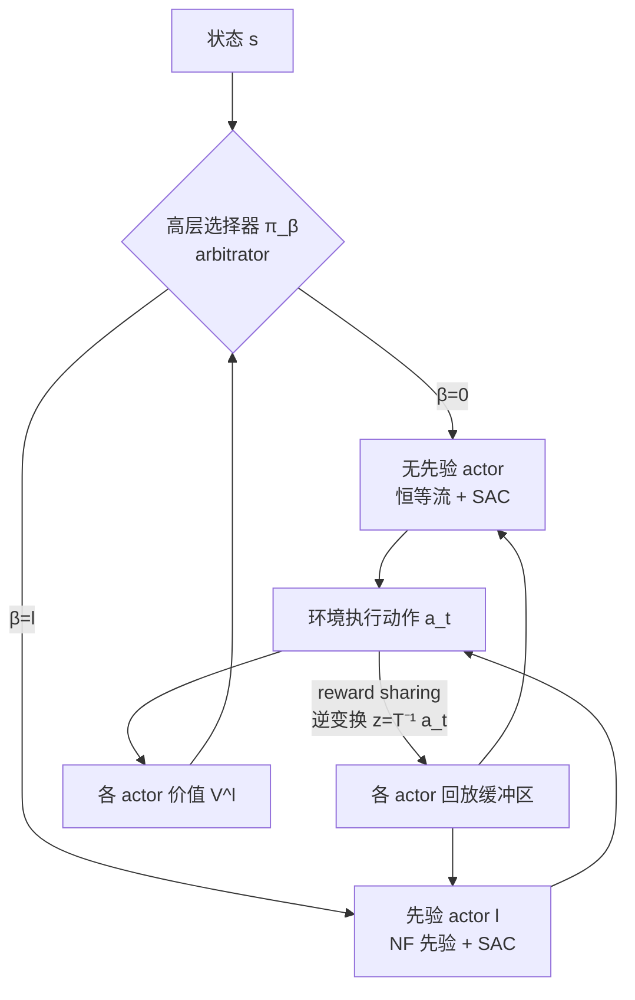

# APC-RL: Exceeding Data-Driven Behavior Priors with Adaptive Policy Composition

**会议**: ICLR 2026  
**OpenReview**: [https://openreview.net/forum?id=gcnhcCQCv8](https://openreview.net/forum?id=gcnhcCQCv8)  
**代码**: 待确认  
**领域**: 强化学习 / 模仿学习 / 演示数据  
**关键词**: 演示数据, 行为先验, Normalizing Flow, 分层强化学习, 策略组合, demonstration misalignment  

## 一句话总结
APC 用一个"学习无关的仲裁选择器"在多个 Normalizing Flow 数据先验和一个无先验 actor 之间自适应切换，既能在演示对齐时加速学习，又能在演示次优/错位时绕开先验、避免被坏先验拖死，从而"超越"演示数据本身的性能上限。

## 研究背景与动机
- **领域现状**：把演示数据塞进 RL 来加速学习是常用套路——要么把策略正则化去模仿演示动作（IL、QFilter），要么用生成模型（VAE/NF）建模演示动作分布作为隐空间先验（PARROT、SPiRL 等），让策略在先验的隐空间里探索。
- **现有痛点**：这些方法都隐含假设演示是**最优且覆盖完整**的。现实里演示往往稀疏、次优、与目标任务错位（misaligned）。一旦如此，"严格遵循数据"反而成了失败的主因：PARROT 这类基于 NF 先验的方法理论上可逆、能"撤销"先验学到任意策略，但实践中先验影响是**永久的**，错位时直接学不出来。
- **核心矛盾**：演示数据有用时想充分利用，没用/有害时又必须能彻底抛弃——但现有方法是"全有或全无"地绑定先验，缺乏在线判断"在哪、用多久"先验的能力。
- **本文目标**：根据在线奖励反馈，自适应决定"何处、用多久"依赖演示数据，使得对齐时加速、错位时鲁棒、次优时还能突破演示性能天花板。
- **核心 idea**：**[组合式分层策略]** 在底层放"恰好一个无先验 actor + 至少一个基于 NF 先验的 actor"，由高层选择器按各 actor 的价值估计自适应挑选；无先验 actor 提供"彻底脱离演示"的逃生通道，保证策略永远不会被坏先验锁死。

## 方法详解

### 整体框架
APC（Adaptive Policy Composition）是一个分层 RL 架构：给定 $n$ 个无奖励、无时序的演示数据集 $D^{(1)},\dots,D^{(n)}$，每个先验 actor 用 PARROT 式的状态条件 NF $T^{(l)}$ 预训练自己的行为先验，无先验 actor 用恒等流 $T^{(0)}(z;s)=z$ 直接在动作空间学。在线阶段，高层选择器 $\pi_\beta$ 在每个状态挑一个底层 actor 执行，被挑中的 actor 用 SAC 在自己的 NF 隐空间里学一个隐策略 $\pi_z^{(\beta_t)}$，采样隐动作经 NF 变换得到环境动作。整体策略是各底层 actor 的混合（按 change-of-variables 计算似然）。

### 关键设计

**1. 组合式策略模型：无先验 actor 是逃生舱**。选择器 $\pi_\beta=\mathrm{Cat}(p_0(s),\dots,p_n(s))$ 是状态条件的类别分布，从 $n+1$ 个底层 actor 里挑一个。整体策略写成混合形式 $\pi(a\mid s)=\sum_{\beta'=0}^{n}\pi_\beta(\beta'\mid s)\,\pi_z^{(\beta')}(\tilde T^{(\beta')}(a;s)\mid s)\,\lvert\det J_{\tilde T^{(\beta')}}(a;s)\rvert$，每个先验 actor 用自己的 NF 把多模态演示分布映成隐空间里简单的单模态高斯策略。关键区别在于**强制保留一个用恒等流的无先验 actor**：先验 actor 在演示对齐时高效，但错位时会失败；无先验 actor 没有演示引导却保有"从奖励从头学任意策略"的完全自由度，于是组合后 APC 永远有一条不依赖演示的退路，这正是它能"超越先验"的根。为保证 NF 可逆，约定 $\lvert Z\rvert=\lvert A\rvert$。

**2. Reward-sharing trick：用 NF 可逆性让所有 actor 都更新**。朴素方案下每步只更新被选中的那个 actor，actor 越多、经验越被摊薄，更糟的是会引入 **primacy bias**——若某个次优先验 actor 早期碰巧领先，选择器会过度承诺它，扼杀对其他（可能后期更强）actor 的探索。APC 利用 NF 可逆性破局：任一已执行动作 $a_t$ 都能逆映射进每个先验 actor 的隐空间 $z_t^{(i)}=\tilde T^{(i)}(a_t;s_t)$，且不同数据集诱导不同变换，故同一 $a_t$ 在各 actor 下落到不同隐坐标 $z_t^{(i)}\neq z_t^{(j)}$。于是可以为所有未被选中的 actor 也构造合法 transition 填进它们各自的回放缓冲区 $B^{(i)}$，让每个 actor 每步都能持续更新。注意各 actor 必须维护**独立缓冲区**，因为同一隐坐标 $z$ 在不同 NF 下对应不同环境动作，奖励 $r_t$ 只对真正产生 $a_t$ 的那个 actor 有效——逆映射保证了写进别的缓冲区的也是各自语义正确的 $(s,z^{(i)},r,s')$。消融证明这一步对样本效率和抑制 primacy bias 都不可或缺。

**3. 学习无关的仲裁选择器：用价值直接定概率**。选择器不训练一个独立的高层神经网络，而是采用 arbitrator 设计——选择概率直接由各底层 actor 的价值估计经 softmax 得到：$p_l(s)=\frac{1}{Z}\exp\!\big(\frac{1}{\eta}V^{(l)}(s)\big)$，$\eta$ 是控制锐度的温度。由于底层用 SAC、没有现成的状态价值，APC 用 Monte-Carlo 近似：对每个 actor 采一个隐动作 $z^{(l)}$，用 $p_l(s)=\frac{1}{Z}\exp\!\big(\frac{1}{\eta}Q^{(l)}(s,z^{(l)})\big)$ 给出无偏（但高方差）的估计。这样设计有两个好处：免去训练高层策略的额外参数与梯度开销；规避分层 RL 联合优化高低层时的不稳定（学习率敏感、底层非平稳、primacy bias、探索困难）。消融显示这种 learning-free 选择器在稳定性和性能上都明显优于"学出来"的高层策略。

## 实验关键数据

### 主实验（三个连续控制基准）

| 环境 | 设定 | APC 表现 | 对照 |
|------|------|----------|------|
| PointMaze（错位演示，实验 i） | 给一个目标的专家演示，测另外三个目标 | ~0.5M 步收敛到 100% 成功，甚至快过 from-scratch SAC | PARROT 0% / IL 7%（1.5M 步仍失败） |
| FrankaKitchen microwave（错位演示） | 用其他任务的 NF 先验优化开微波炉 | 所有配置下都能解出目标任务 | PARROT、IL 严重掉样本效率或彻底失败 |
| PointMaze / Kitchen（对齐演示，实验 ii） | 演示与任务完全对齐 | 显著快过 IL/QFilter/SAC，略慢于 PARROT | PARROT 最快（行为克隆即近最优） |
| CarRacing（次优人类演示，实验 iii） | ~30k 步人类驾驶数据 | ~30k 步达最优 return（~900） | SAC ~250k 步；PARROT 被次优先验天花板卡死；IL/QFilter 更慢 |

### 消融实验（CarRacing，实验 iv）

| 变体 | 选择器 | reward sharing | 结果 |
|------|--------|----------------|------|
| 完整 APC | arbitrator | ✓ | 最优，仲裁器会切到无先验 actor 拿高 return |
| 去 reward sharing | arbitrator | ✗ | 退化 |
| 学习式选择器 | learned hierarchical | ✓ | 不稳定 |
| 学习式 + 去 sharing | learned hierarchical | ✗ | 过度承诺先验 actor，return 偏低 |

### 关键发现
- **错位时反超 SAC**：APC 在错位先验下竟比从头学的 SAC 还快，说明它能把"错位先验"当作有用的探索信号，而非负担。
- **次优时突破天花板**：PARROT 被次优人类演示锁在人类水平附近，APC 却能用它 warm-start 再甩开，~30k 步达最优。
- **两大组件缺一不可**：可视化显示 arbitrator + reward sharing 会适时切到无先验 actor，而学习式选择器无 sharing 会过度承诺先验 actor 导致 return 偏低。

## 亮点与洞察
- **"逃生舱" actor 的设计极简却本质**：在底层强制保留一个无先验 actor，把"是否信任演示"从隐含假设变成可在线撤销的显式选择，一招化解了 PARROT 类方法"先验影响永久化"的根本缺陷。
- **把 NF 的可逆性用出了新花样**：以往可逆性是为了"理论上能撤销先验"，本文把它用来跨 actor 共享经验（同一动作逆映射进每个隐空间），同时解决样本效率和 primacy bias 两个问题。
- **learning-free arbitrator 绕开分层 RL 的老大难**：不训练高层策略，直接用 Q 值定选择概率，回避了高低层联合优化的非平稳与不稳定，工程上也更省。

## 局限与展望
- **arbitrator 依赖准确的 Q 估计**：选择概率由 Monte-Carlo Q 近似驱动，方差高；对齐设定下 APC 比 PARROT 慢正是因为要先学准 Q 才能让仲裁器认出好先验。
- **actor 数量线性增长开销**：每个先验数据集要一套 SAC + NF + 缓冲区，$n$ 大时计算/显存成本线性上升，reward sharing 也要对所有 actor 做逆变换。
- **仅在中低维连续控制验证**：PointMaze/Kitchen/CarRacing 规模有限，更高维或图像观测、真实机器人上的可扩展性待验证。
- **先验仍需可逆 NF**：方法绑定 Normalizing Flow（为利用可逆性），换成 VAE/diffusion 等不可逆先验时 reward-sharing trick 不再成立。

## 相关工作与启发
- **PARROT（Singh et al. 2021）**：本文直接的对照与基座——单 NF 先验 + 隐空间策略，APC 把它扩成多先验 + 无先验 actor 的可组合版本。
- **IL / QFilter（Lu 2023；Nair 2018）**：正则化式模仿与带 Q 过滤的模仿，QFilter 已有"排除坏演示"思想，但缺乏利用预训练先验探索的能力。
- **分层 RL 与 arbitrator（Russell & Zimdars 2003）**：本文借用经典 arbitrator 思想做 learning-free 选择器，避开现代分层 RL 联合优化的不稳定。
- **Primacy bias（Nikishin 2022；Xu 2024）**：把"早期经验过拟合"这一 RL 通病显式纳入设计动机，并用 reward sharing 缓解，对其他多策略/集成 RL 方法有借鉴意义。

## 评分
- **新颖性**: ⭐⭐⭐⭐ — "无先验 actor 作逃生舱 + 用 NF 可逆性跨 actor 共享经验 + learning-free 仲裁器"三件组合得相当巧妙，把演示数据的利用从"全有或全无"变成可在线撤销。
- **实验充分度**: ⭐⭐⭐½ — 三类错位场景（任务错位/次优人类演示）覆盖到位、消融清晰，但环境规模偏小、只 3 个 seed，缺更高维与真实机器人验证。
- **写作质量**: ⭐⭐⭐⭐ — 动机—方法—实验逻辑顺，四个实验问题对应四类发现，架构图与选择器可视化都很直观。
- **价值**: ⭐⭐⭐⭐ — 直击"现实演示往往次优/错位"这一痛点，给出能稳健兜底又能超越演示上限的实用方案，对从次优演示 bootstrap 的场景尤其有用。

<!-- RELATED:START -->

## 相关论文

- [\[ICLR 2026\] Safe Exploration via Policy Priors](safe_exploration_via_policy_priors.md)
- [\[ICLR 2026\] Webscale-RL: Automated Data Pipeline for Scaling RL Data to Pretraining Levels](webscale-rl_automated_data_pipeline_for_scaling_rl_data_to_pretraining_levels.md)
- [\[ACL 2026\] Adaptive Instruction Composition for Automated LLM Red-Teaming](../../ACL2026/reinforcement_learning/adaptive_instruction_composition_for_automated_llm_red-teaming.md)
- [\[ICLR 2026\] Prosperity before Collapse: How Far Can Off-Policy RL Reach with Stale Data on LLMs?](prosperity_before_collapse_how_far_can_off-policy_rl_reach_with_stale_data_on_ll.md)
- [\[ICLR 2026\] TRAPO: Trust-Region Adaptive Policy Optimization](trust-region_adaptive_policy_optimization.md)

<!-- RELATED:END -->
