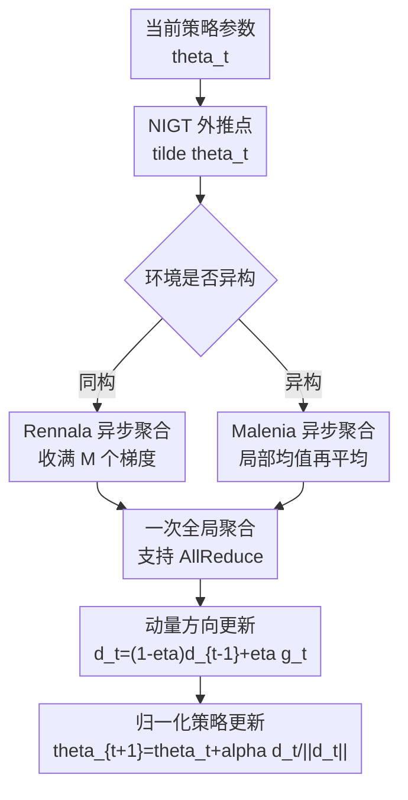

# Asynchronous Policy Gradient Aggregation for Efficient Distributed Reinforcement Learning

**会议**: ICLR 2026  
**OpenReview**: [https://openreview.net/forum?id=SitVEPYv6W](https://openreview.net/forum?id=SitVEPYv6W)  
**代码**: 未公开  
**领域**: 强化学习 / 分布式强化学习  
**关键词**: 异步策略梯度、分布式强化学习、NIGT、通信效率、异构计算  

## 一句话总结
这篇论文把 normalized implicit gradient transport（NIGT）改造成可异步聚合的分布式策略梯度算法，提出同构环境下的 Rennala NIGT 和异构环境下的 Malenia NIGT，在理论复杂度和 MuJoCo 实验中都比 AFedPG 更能利用快 worker、慢通信和异构环境。

## 研究背景与动机
**领域现状**：策略梯度方法是强化学习里最常用的一类优化工具，从经典 REINFORCE 到带动量、归一化和方差控制的 PG 变体，单机理论已经相对清楚。与此同时，实际 RL 训练越来越依赖并行采样：多个 worker 同时和环境交互、生成轨迹、计算随机策略梯度，再把梯度传回 server 或通过 AllReduce 聚合。

**现有痛点**：分布式 RL 的瓶颈不只是“样本够不够”，还包括两个工程上很现实的问题。第一，不同 worker 计算一条轨迹的时间可能差很多，慢 worker 会拖住同步算法；第二，策略梯度向量很大，若每算一个梯度就通信一次，通信延迟会吞掉异步采样带来的收益。已有 AFedPG 是异步策略梯度方向的重要工作，但它的 greedy 更新需要 worker 频繁把梯度发给服务器，通信复杂度偏高，也不天然支持 AllReduce。

**核心矛盾**：异步 RL 想要快，就要允许快 worker 多贡献轨迹梯度，不能被 straggler 锁死；但想要理论正确，又不能因为快 worker 多采样就破坏目标函数的无偏估计。这个矛盾在同构环境和异构环境里表现不同：同构时所有 worker 面对同一个环境，快 worker 多交样本是合理的；异构时每个 worker 的环境、奖励或策略分布可能不同，快 worker 不能直接代表全体。

**本文目标**：作者要解决的是分布式策略梯度中的三件事：在同构环境中降低异步采样的总计算时间；在通信昂贵时减少聚合次数并支持 AllReduce；在联邦式或环境异构场景中保持对平均目标 $J(\theta)=\frac{1}{n}\sum_i J_i(\theta)$ 的正确估计。

**切入角度**：论文从非分布式 NIGT 出发。NIGT 通过外推点、动量估计和归一化步长改善随机策略梯度的样本复杂度，但原始形式没有直接处理多个 worker 的异步到达。作者的观察是：NIGT 的外层更新只需要一个足够好的聚合梯度估计，因此可以把“如何异步收集一批策略梯度”单独抽象成聚合器，再把聚合器接到 NIGT 更新中。

**核心 idea**：用“本地累积一批异步策略梯度后一次聚合”替代“每个异步梯度到达就通信更新”，并针对同构与异构目标分别设计 Rennala 聚合和 Malenia 聚合。

## 方法详解
### 整体框架
论文把算法拆成两层：外层是 NIGT 式的归一化策略更新，内层是一个异步梯度聚合过程。外层维护方向估计 $d_t$，在外推点 $\tilde{\theta}_t$ 上调用聚合器得到 $g_t$，再用动量 $d_t=(1-\eta)d_{t-1}+\eta g_t$ 更新方向，最后沿 $d_t/\|d_t\|$ 做固定长度的策略参数更新。

同构场景使用 AggregateRennala：所有 worker 共享同一环境分布，因此算法只等待全体 worker 合计交回 $M$ 个随机策略梯度，快 worker 可以连续贡献多条轨迹。异构场景使用 AggregateMalenia：每个 worker 代表一个不同局部目标，算法让每个 worker 先形成自己的局部平均，再对 worker 平均做全局平均，从而避免快 worker 在目标函数中被过度加权。

### 关键设计
**1. NIGT 外层更新：把策略优化写成“方向估计 + 归一化步长”**

论文的外层算法沿用 Cutkosky & Mehta 以及 Fatkhullin 等人的 NIGT 思路，但把目标换成截断轨迹的策略梯度估计。给定有限 horizon $H$ 的轨迹 $\tau$，随机策略梯度写成 $g_H(\tau,\theta)$，它是 $\nabla J_H(\theta)$ 的无偏估计；同时通过选择足够大的 $H$，$J_H$ 与无限 horizon 目标 $J$ 的梯度误差可被控制在 $\gamma^H$ 量级。

外层的关键不是直接用 $g_t$ 做 SGD，而是先构造外推点 $\tilde{\theta}_t=\theta_t+\frac{1-\eta}{\eta}(\theta_t-\theta_{t-1})$，在外推点聚合梯度，再更新动量方向 $d_t=(1-\eta)d_{t-1}+\eta g_t$。最后一步是归一化更新 $\theta_{t+1}=\theta_t+\alpha d_t/\|d_t\|$。这个形式把步长大小和梯度范数解耦，理论上能在二阶平滑假设下得到比 vanilla PG 更好的 $\varepsilon$ 依赖。

**2. Rennala 聚合：同构环境里让快 worker 自然多贡献样本**

在同构环境中，每个 worker 采到的轨迹都来自同一个策略和同一个环境分布，因此“谁先算完”不影响单个梯度样本的分布。AggregateRennala 利用这一点：广播当前参数 $\theta$ 后，所有 worker 开始采样并计算 $g_H(\tau,\theta)$；算法不等每个 worker 都返回一次，而是任何 worker 先返回就先纳入平均，并立刻让它继续下一条轨迹，直到累计收满 $M$ 个随机梯度。

这样做的好处是直接绕开 straggler。若某个 worker 很慢甚至短暂断连，同步 NIGT 会被它卡住，而 Rennala 聚合的等待时间近似由最快的一组 worker 的 harmonic mean 决定。对应复杂度中出现 $\min_{m\in[n]}[(\frac{1}{m}\sum_{i=1}^m 1/\dot h_i)^{-1}(\cdots)]$，意思是算法可以自动选择“值得等待的最快 $m$ 个 worker”，慢 worker 不会无限放大训练时间。

**3. 本地累积 + 一次通信：把异步采样收益保留下来**

AFedPG 的异步性主要体现在 worker 梯度一到就更新，但这也意味着频繁通信。本文的聚合器让 worker 可以在本地把梯度累加，等一批样本收齐后再做一次全局聚合，中心化设置可以 server 汇总，去中心化设置可以 AllReduce。通信复杂度因此与外层迭代次数同阶，而不是与每个随机梯度调用同阶。

这个设计解释了论文在小 $\varepsilon$ 区间的主要提升：Rennala NIGT 的通信项是 $O(\kappa\varepsilon^{-2})$ 量级，而 AFedPG 至少有 $O(\kappa\varepsilon^{-3})$，极端情况下甚至会退化到每次 oracle 调用都通信的 $\Omega(\varepsilon^{-7/2})$ 级别。对真实分布式 RL 来说，这个差别很关键，因为策略网络参数维度高，通信延迟并不是可忽略常数。

**4. Malenia 聚合：异构环境里用局部均值保住全局目标的无偏性**

同构时快 worker 多交样本没有偏置，但异构时不行。若 worker $i$ 面对的是 $J_i(\theta)$，全局目标是 $J(\theta)=\frac{1}{n}\sum_i J_i(\theta)$，那么让快 worker 贡献更多梯度会把目标悄悄改成“按计算速度加权”的目标。Malenia 聚合正是为这个问题设计的。

AggregateMalenia 为每个 worker 维护局部累积梯度 $\bar g_i$ 和样本数 $M_i$，返回的不是所有梯度的简单平均，而是 $\frac{1}{n}\sum_i \bar g_i/M_i$。停止条件也不是“总共 $M$ 个梯度”，而是让 $M_i$ 的 harmonic-style 条件达到阈值，保证每个局部目标都有足够代表性。这样返回向量仍是 $\nabla J_H(\theta)$ 的无偏估计，同时允许不同 worker 以不同速度异步推进。

### 一个完整示例
设有 10 个 worker 训练 Humanoid-v4，worker 1 到 worker 10 的采样时间逐渐变慢。同步 NIGT 会要求每轮所有 worker 都各算一条轨迹后再更新，因此每轮时间接近最慢 worker；AFedPG 会在快 worker 梯度到达时频繁向 server 通信，通信时间一大就会拖慢。

Rennala NIGT 的一轮更像“收集一个异步小批量”：server 广播 $\tilde{\theta}_t$，快 worker 可能连续返回第 1、2、3 条轨迹梯度，慢 worker 只返回 0 或 1 条；只要总数达到 $M$，这一轮就停止未完成的计算，把本地累积结果做一次聚合，然后更新 $d_t$ 和 $\theta_{t+1}$。如果这些 worker 都来自同一个 Humanoid 环境，这个平均仍然估计同一个 $\nabla J_H(\tilde\theta_t)$。

若换成异构版本，例子就不同了。论文的异构实验中有两个 worker：一个看标准 Humanoid 状态，另一个看取负后的状态，并额外拼接环境类型标记。此时快 worker 不能无限主导平均。Malenia NIGT 会分别计算两个 worker 的局部平均，再把两个局部平均等权相加，从而优化“两个环境平均”的目标，而不是只优化快 worker 对应的环境。

### 损失函数 / 训练策略
论文研究的是最大化折扣回报 $J(\theta)=\mathbb{E}[\sum_{t=0}^{\infty}\gamma^t r(s_t,a_t)]$。实际计算用长度为 $H$ 的截断目标 $J_H(\theta)$，随机策略梯度为：

$$
g_H(\tau,\theta)=\sum_{t=0}^{H-1}\left(\sum_{h=t}^{H-1}\gamma^h r(s_h,a_h)\right)\nabla\log\pi_\theta(a_t|s_t).
$$

理论分析假设 policy log-likelihood 的梯度和 Hessian 有界，且 Hessian 满足 Lipschitz 条件；这些假设推出 $J$ 的梯度 Lipschitz、Hessian Lipschitz，以及 $g_H$ 对 $\nabla J_H$ 的方差有界。参数选择上，动量 $\eta$、步长 $\alpha$、初始批量 $M_{init}$、批量 $M$ 和 horizon $H$ 都随目标精度 $\varepsilon$ 设置，使得截断误差、随机梯度噪声和 NIGT 方向误差共同控制到 $\varepsilon$ 量级。

实验中使用 Gaussian policy，网络结构是两层 64 hidden units 的 Tanh MLP，输出均值 $\mu_\theta(s)$ 和经 Softplus 得到的标准差 $\sigma_\theta(s)$，动作由 $u_t\sim\mathcal{N}(\mu_\theta(s),\mathrm{diag}(\sigma_\theta^2(s)))$ 后经过 $a_t=\alpha\tanh(u_t)$ 得到。所有方法调参范围相同：$\eta\in\{0.001,0.01,0.1\}$，学习率 $\alpha\in\{2^{-10},\ldots,2^{-1}\}$；Rennala NIGT 额外调 $M=M_{init}\in\{20,30,50\}$。

## 实验关键数据

### 主实验
论文的核心结果有两类：理论复杂度表和 MuJoCo 曲线。下面先列同构分布式 RL 中最关键的复杂度对比，其中 $\dot h_i$ 是 worker $i$ 单步环境交互时间，$\kappa$ 是一次通信时间，表中省略常数和对数因子。

| 方法 | 计算时间复杂度 | 通信复杂度 | 支持 AllReduce |
|--------|------|------|----------|
| Synchronous Vanilla PG | $\max_i \dot h_i(\varepsilon^{-2}+1/(n\varepsilon^4))$ | $\kappa(\varepsilon^{-2}+1/(n\varepsilon^4))$ | 是 |
| Synchronous NIGT | $\Omega(\max_i \dot h_i/(n\varepsilon^{7/2}))$ | $\kappa\varepsilon^{-7/2}$ | 是 |
| Rennala PG/SGD | $\min_m[(\frac{1}{m}\sum_{i=1}^m1/\dot h_i)^{-1}(\varepsilon^{-2}+1/(m\varepsilon^4))]$ | $\kappa\varepsilon^{-2}$ | 是 |
| AFedPG | $(\frac{1}{n}\sum_i1/\dot h_i)^{-1}(n^{4/3}\varepsilon^{-7/3}+1/(n\varepsilon^{7/2}))$ | 至少 $\kappa\varepsilon^{-3}$ | 否 |
| Rennala NIGT | $\min_m[(\frac{1}{m}\sum_{i=1}^m1/\dot h_i)^{-1}(\varepsilon^{-2}+1/(m\varepsilon^{7/2}))]$ | $\kappa\varepsilon^{-2}$ | 是 |

实验部分在 MuJoCo 上比较 Rennala NIGT、Synchronized NIGT 和 AFedPG，所有实验报告 5 个 seed 的 $(20\%,80\%)$ 置信区间。论文没有在正文给出逐点数值表，而是用曲线展示时间-回报关系；因此这里保留可核对的场景设置与定性结论。

| 实验场景 | 环境 / worker 设置 | 计算与通信设置 | 主要观察 |
|--------|------|------|------|
| 同速同通信 | Humanoid-v4, $n=10$ | $h_i=1,\kappa_i=0$ | 三种方法表现几乎相同，说明算法差异主要来自异步和通信场景 |
| 计算与通信异构 | Humanoid-v4, $n=10$ | $h_i=\sqrt{i},\kappa_i=\sqrt{i}$ | Rennala NIGT 收敛更快，慢 worker 不再主导每轮时间 |
| 通信更昂贵 | Humanoid-v4, $n=10$ | $h_i=\sqrt{i},\kappa_i=\sqrt{i}\cdot d^{1/4}$ | Rennala NIGT 最稳健，优势随通信成本变大而扩大 |
| 多环境验证 | Reacher-v4 / Walker2d-v4 / Hopper-v4 | $h_i=\sqrt{i},\kappa_i=\sqrt{i}\cdot d^{1/4}$ | Reacher 上优势明显，Walker2d 和 Hopper 上差距较小 |
| 大规模 worker | Humanoid-v4 / Reacher-v4, $n=100$ | 多种 $h_i,\kappa_i$ 组合 | 同速时相近；异构和高通信时 Rennala NIGT 仍最快 |
| 异构环境 | Humanoid-v4, $n=2$ | 一个标准状态 worker，一个反转状态 worker；$h_0=1,h_1=10$ | Malenia NIGT 明显高于 AFedPG，符合其支持异构目标的理论 |

### 消融实验
论文没有给出传统的“去掉模块 A/B”的数值消融，而是通过场景变化验证算法设计。这里把这些场景视为对关键机制的分析实验。

| 配置 | 关键指标 | 说明 |
|------|---------|------|
| Equal times | 时间-回报曲线几乎重合 | 当没有 straggler 和通信瓶颈时，Rennala 聚合不会凭空带来优势 |
| Heterogeneous times | Rennala NIGT 更快达到高 reward | 异步收满 $M$ 个梯度让快 worker 多贡献，避免同步等待最慢 worker |
| Increased communication times | Rennala NIGT 优势扩大 | 本地累积后一轮一次聚合，正好对应通信复杂度从 AFedPG 的至少 $O(\kappa\varepsilon^{-3})$ 改到 $O(\kappa\varepsilon^{-2})$ |
| $n=100$ workers | 异构设置下仍保持领先 | harmonic-style 复杂度不会因为加入更多慢 worker 而必然变差 |
| Malenia heterogeneous env | Malenia NIGT 明显优于 AFedPG | 局部均值再平均避免快 worker 在异构目标中被过度加权 |

### 关键发现
- Rennala NIGT 的优势并不来自更大的模型或更多调参，而是来自“异步采样 + 少通信”的组合；同速无通信时三者相近，说明对照比较较干净。
- 通信成本越高，Rennala NIGT 相比 AFedPG 的优势越明显，这和理论里的 $O(\kappa\varepsilon^{-2})$ 对 $O(\kappa\varepsilon^{-3})$ 一致。
- 异构环境实验虽然规模较小，但很好地揭示了 Malenia 的必要性：如果直接让快 worker 主导平均，算法优化的就不再是各环境等权平均目标。

## 亮点与洞察
- Rennala 聚合的巧妙点在于它没有显式“选择”快 worker，而是通过等待前 $M$ 个完成的梯度自然实现了对 straggler 的鲁棒性；这比手工设 worker 子集更灵活，也更容易适配动态计算环境。
- Malenia 聚合把异构问题中的公平性写进估计器本身，而不是靠后处理修正；局部均值再平均这个看似简单的改动，正好对应 $\frac{1}{n}\sum_i J_i(\theta)$ 的目标结构。
- 本文把通信复杂度作为一等公民来分析，而不是只讨论 oracle/sample complexity；对真实分布式 RL 训练而言，这比单纯减少梯度调用次数更接近系统瓶颈。
- NIGT 外推和归一化更新原本是单机随机非凸优化里的技巧，这篇论文展示了它可以和分布式异步调度结合，形成“优化理论 + 系统调度”共同决定复杂度的算法。

## 局限与展望
- 实验仍是模拟分布式环境，虽然用 CPU 机器模拟了计算和通信延迟，但还不是大规模真实集群上的端到端 RL 系统验证。
- 异构环境实验只用了两个 worker 和一种状态反转构造，能说明 Malenia 的方向，但还不足以覆盖真实 federated RL 中更复杂的 reward、transition 和 policy heterogeneity。
- 理论 lower bound 只针对把随机梯度 oracle 当黑盒的一类方法，作者也指出尚未覆盖充分利用 RL 目标结构的方法；Rennala NIGT 与 lower bound 之间仍有 $\varepsilon$ 指数 gap。
- 方法依赖策略梯度估计和二阶平滑类假设，尚未讨论 importance sampling 方差控制、actor-critic baseline、GAE 或 off-policy 数据复用等常见工程组件如何接入。
- 后续可以在真实多机 RLHF、机器人仿真农场或多环境 federated RL 上测试 Malenia；如果能和压缩通信、低秩梯度或异步 actor-critic 结合，实用价值会更高。

## 相关工作与启发
- **vs AFedPG**: AFedPG 也是异步策略梯度，但它不支持异构环境，通信更频繁，也不支持 AllReduce；本文通过批量异步聚合把通信项降到外层迭代级别。
- **vs Synchronous NIGT**: 同步 NIGT 继承了 NIGT 的样本复杂度优势，但每轮要等所有 worker；Rennala NIGT 保留 NIGT 更新，同时用异步聚合消除 straggler 对每轮时间的直接控制。
- **vs Rennala PG/SGD**: Rennala PG/SGD 已经有 harmonic-style 的异步计算复杂度，但策略梯度小 $\varepsilon$ 区间的样本项仍是 $1/(m\varepsilon^4)$；Rennala NIGT 用动量和归一化把这一项改成 $1/(m\varepsilon^{7/2})$。
- **vs federated policy gradient**: 许多联邦 PG 工作关注同步或容错，本文更聚焦异步计算速度、通信瓶颈和环境异构三者同时存在时的时间复杂度。

## 评分
- 新颖性: ⭐⭐⭐⭐☆ 把 NIGT、Rennala/Malenia 异步聚合和分布式策略梯度结合得比较自然，理论定位清楚，但核心组件主要来自已有优化算法谱系。
- 实验充分度: ⭐⭐⭐☆☆ MuJoCo 场景和多种延迟设置能支撑主要 claim，但真实分布式系统和更丰富异构 RL 任务还偏少。
- 写作质量: ⭐⭐⭐⭐☆ 论文主线清楚，复杂度表非常有帮助；不足是实验部分多数结果以曲线呈现，缺少更可复用的数值表。
- 价值: ⭐⭐⭐⭐☆ 对分布式 RL 和 RLHF 这类高通信、高采样成本训练很有参考价值，尤其提醒算法设计要同时看计算异构和通信次数。

<!-- RELATED:START -->

## 相关论文

- [\[ICLR 2026\] DOPPLER: Dual-Policy Learning for Device Assignment in Asynchronous Dataflow Graphs](doppler_dual-policy_learning_for_device_assignment_in_asynchronous_dataflow_grap.md)
- [\[ICLR 2026\] Reinforcement Learning via Value Gradient Flow](reinforcement_learning_via_value_gradient_flow.md)
- [\[ICLR 2026\] Reevaluating Policy Gradient Methods for Imperfect-Information Games](reevaluating_policy_gradient_methods_for_imperfect-information_games.md)
- [\[ICLR 2026\] SPG: Sandwiched Policy Gradient for Masked Diffusion Language Models](spg_sandwiched_policy_gradient_for_masked_diffusion_language_models.md)
- [\[ICLR 2026\] Policy Likelihood-based Query Sampling and Critic-Exploited Reset for Efficient Preference-based Reinforcement Learning](policy_likelihood-based_query_sampling_and_critic-exploited_reset_for_efficient_.md)

<!-- RELATED:END -->
