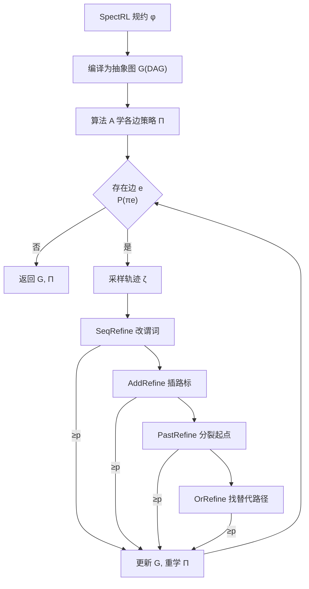

# Automating the Refinement of Reinforcement Learning Specifications

**会议**: ICLR 2026  
**OpenReview**: [https://openreview.net/forum?id=a5jzk1hv2Y](https://openreview.net/forum?id=a5jzk1hv2Y)  
**代码**: [https://ambadkar.com/autospec](https://ambadkar.com/autospec)  
**领域**: reinforcement learning  
**关键词**: 规约引导强化学习, SpectRL, 逻辑规约精化, 抽象图, reach-avoid, 形式化健全性  

## 一句话总结
提出 AUTOSPEC 框架：把"粗粒度逻辑规约导致学不出策略"诊断为抽象图上特定边的失败，再用四种保证健全性的精化操作（改谓词/插路标/分裂起点/找替代路径）自动把规约改细，让现成的规约引导 RL 算法能解原本解不动的任务。

## 研究背景与动机
**领域现状**：规约引导强化学习（specification-guided RL）用逻辑公式（如 LTL 片段 SpectRL）替代手工设计的标量奖励，把任务描述成"先到 A 再到 B、避开 C"这类 reach-avoid 的布尔/顺序组合，再自动翻译成稠密奖励来训练。SpectRL 规约可被等价编译成一张抽象图（DAG）：顶点是 MDP 状态集合，边标注 reach-avoid 子任务，于是"解任务"约化为"在抽象图上完成可达性"。

**现有痛点**：这套方法默认用户能写出"足够细"的规约和"足够准"的标注函数（labeling function，把状态映射到谓词）。但实践中用户往往只能给出**粗粒度（coarse / under-specified）规约**——逻辑上正确，却提供不了足够引导。比如目标区域写得太大、把一个"陷阱状态"也圈进去（图 1 的 9-rooms：MID 区域里藏着出不来的死角），或安全区域约束太松、路标缺失，导致翻译出的奖励无法让 RL 学到有用策略。

**核心矛盾**：规约太粗 → 奖励无引导 → 学不出策略；但手工把规约改细既费力又依赖对环境的先验，而环境约束（如不可见的墙、陷阱）恰恰是用户事先不知道的。

**本文目标**：在**不要用户介入**的前提下，自动把粗规约精化成更细的规约 $\phi_r$，要求 $\phi_r$ 满足即蕴含原规约 $\phi$ 满足（健全性），同时提供额外结构让 RL 更易学。

**核心 idea**（**探索引导的健全精化**）：当学到的策略满足概率低于阈值 $p$ 时，用已采样轨迹数据定位抽象图中"难学的边"，对该边施加四种递增结构修改的精化操作，每种都可证明保持 refinement 关系，第一个把满足概率拉过 $p$ 的就采纳，迭代直至达标。

## 方法详解

### 整体框架
AUTOSPEC 是套在任意 SpectRL 兼容算法 $A$（如 DIRL、LSTS）外面的 wrapper。先把规约 $\phi$ 编译成抽象图 $G$，用 $A$ 学各边策略；遍历每条"学了策略但满足概率 $P(\pi_e)<p$"的问题边 $e=u\to u'$，采样轨迹 $\zeta$，按 **SeqRefine → AddRefine → PastRefine → OrRefine** 顺序（结构修改由局部到全局递增）逐一尝试，用现成 RL 估计精化后该边能否超过阈值 $p$，第一个成功的就更新图 $G$ 并对整图重学策略 $\Pi$，再处理下一条边。最终图 $G$ 对应精化规约 $\phi_r$。

### 关键设计
**1. SeqRefine：用探索过的轨迹收紧"到达/避开"谓词。** 这是最局部、最先尝试的精化，针对目标区域 $b=\beta(u')$ 或安全区域 $c=\beta(e)$ 画得太粗的情形，分两个子过程。ReachRefine 把成功到达目标的那些状态收集起来，取凸包后与原目标求交，得到收紧后的目标 $b_r=b\cap\mathrm{ConvexHull}(\text{reached states})$——这等于把"目标里其实够不着的部分"（如陷阱所在的子区域）剔出去，让奖励只指向真正可达的目标。AvoidRefine 反过来收集轨迹进入不安全区的状态，把这些被亲历证实危险的区域从安全区扣掉：$c_r=c\setminus\mathrm{ConvexHull}(\text{last }k\text{ unsafe states})$，$k$ 控制取轨迹尾部多长。两者只改标注、不动图拓扑，是"从经验里学出环境隐含约束"的最轻量手段（图 1 的陷阱、PandaGym 的不可见墙都靠它处理）。

**2. AddRefine：给长程边插入中间路标做任务分解。** 当 $u\to u'$ 路径太长太复杂、单个策略学不可靠时，与其硬学不如把它劈成两段。AddRefine 从成功到达 $\beta(u')$ 的轨迹里取中点状态，定义新顶点 $\beta(u'')=\beta(e)\cap\mathrm{ConvexHull}(\text{midpoints})$，把原边 $e=u\to u'$ 换成 $u\to u''$ 与 $u''\to u'$ 两条短边。长程任务被拆成两个短视野子任务，各自更易学，本质上是用数据驱动地补上用户没写的"途经点"。

**3. PastRefine：按起点可行性切分源区域。** 有时失败不在路径而在出发点——源区域 $u$ 里有些初始状态天然能成功、有些怎么都到不了目标。PastRefine 按轨迹是否满足边 $e$ 把它们分成成功/失败两组，学一个超平面把成功起点与失败起点分开，构造只含成功起点的区域 $b_r$ 并新建顶点 $u^*$（$\beta(u^*)=b_r$，继承 $u$ 的所有入边），用 $e^*=u^*\to u'$ 替换问题边。它在保留原 $u$ 及其连接的同时，把"有希望的初始条件"隔离出来集中学习。

**4. OrRefine：复用已有图结构搭替代路径。** 当一条边的直达路径根本走不通（满足概率 0%），前三种局部修补都救不了，就得绕路。OrRefine 找 $u'$ 的其他父顶点 $u_i$（已存在边 $e_i=u_i\to u'$），对可行的 $u_i$ 新增边 $e_{new}=u\to u_i$（$\beta(e_{new})=\beta(e)$）并把 $\beta(e_i)$ 收紧为 $\beta(e)\cap\beta(e_i)$，测试 $u\to u_i\to u'$ 这条替代路是否达标，必要时还能继续往 $u_i$ 的祖先回溯。它只用现有顶点搭新路、保留全部原安全约束，是结构改动最大的兜底手段。

**健全性保证**：定理 1 证明四种精化都满足 Definition 2 的 refinement 关系，即对任意轨迹 $\zeta$ 有 $(\zeta\models\phi_r)\Rightarrow(\zeta\models\phi)$，因此解 $\phi_r$ 的策略一定也解原 $\phi$。但作者指出问题本身**不可能既健全又完备**——即便最简单的可达性规约，判定策略是否满足在一般连续状态 MDP 上都是不可判定的，故 AUTOSPEC 只保健全、不保完备。

## 实验关键数据

### 主实验：复杂规约下的算法依赖性（100-rooms）
规约 $\phi=\phi_{start};(\phi_{m1}\text{ or }\phi_{m2});\phi_{m3};(\phi_{m4}\text{ or }\phi_{m5});\phi_{goal}$，含多重析取分支与顺序组合。

| 基座算法 | 探索策略 | 精化结果 | 满足概率 |
|---|---|---|---|
| DIRL | Dijkstra 式系统探索 | 成功（ReachRefine+PastRefine+OrRefine 组合） | ~0% → ~60% |
| LSTS | 多臂老虎机 ε-greedy | 失败（无成功轨迹可用） | 卡在 0% |
| 随机化 4-Way Gridworld | DIRL+AUTOSPEC vs DIRL | 关键转移成功率 <20% → >90% | 20% → ~60% |

### 单项精化隔离实验（针对性失败模式）

| 精化 | 场景 / 失败模式 | 满足概率提升 |
|---|---|---|
| SeqRefine(ReachRefine) | 9-rooms 目标含陷阱状态 | 15% → 85% |
| SeqRefine(AvoidRefine) | 9-rooms 窄危险通道 | 30% → 75% |
| AddRefine | 多房间长程导航 | 20% → 90% |
| PastRefine | 起点含不可达初始态 | 40% → 80% |
| OrRefine | 直达路径被堵的多路径规约 | 0% → 可达 |

### 高维验证与开销（PandaGym）
- 3D 机械臂操控含**不可见墙**，规约 `(reach red avoid wall);(reach green avoid wall)`：ReachRefine 剔除墙后够不着的红区、PastRefine 学出哪些接近角度能到绿区，凸包/超平面几何精化在高维仍有效。
- 计算开销 $T_{total}=T_{base}+\sum_{e\in R}T_e$，经验上 $\le 2T_{base}$；100-rooms 中 baseline 评估 8 条固定边约 240s，AUTOSPEC 平均 390±42s（多训 4–7 条精化边），随瓶颈数线性增长而非随状态空间规模增长。

### 关键发现
精化质量**根本上取决于基座算法的探索策略**：DIRL 按估计难度逐边深入探索，能为每条边攒够成功轨迹供精化使用；LSTS 把精力摊在所有边上，导致后段边拿不到任何成功轨迹，AUTOSPEC 正确地报告"无样本无法精化"——这本身印证了"精化依赖经验数据"的前提。

## 亮点与洞察
- **把"奖励工程难题"重构成"规约精化问题"**：不去手调奖励数值，而是在符号化的抽象图层面定位并修复结构缺陷，修改可解释、可验证。
- **健全性可证 + 即插即用**：四种操作都形式化证明保持 refinement 关系，且作为 wrapper 不改基座算法内部，DIRL/LSTS 都能直接套。
- **从探索数据反推环境隐含约束**：陷阱、不可见墙这类用户写不出的约束，靠凸包/超平面从轨迹里"学"出来再写回规约，几何方法在高维仍奏效。
- **诚实地划出能力边界**：明确证明问题不可判定、只能保健全不能保完备，并用 LSTS 失败案例坦白"没有成功轨迹就无能为力"。

## 局限与展望
- **强依赖基座算法的探索质量**：若算法生成不出成功轨迹（如 LSTS 在复杂规约上），精化彻底失效——这是方法的硬前提而非偶发问题。
- **只保健全、不保完备**：精化可能偏保守（收紧过头排除了实际可行区域），且无法保证一定能把任意粗规约救活。
- **几何精化的归纳偏置**：凸包/超平面假设可行/不可行区域大致凸、线性可分，遇到高度非凸或交错的可行域可能失准。
- **局限于有限视野 SpectRL**：作者提出未来扩展到无限视野 ω-regular 规约（前缀用现有 DAG 精化、循环后缀需新的 witness 理论），并降低对探索数据量的依赖。

## 相关工作与启发
- **规约引导 RL 谱系**：Reward Machines（Icarte 2018）、TLTL（Li 2017）、LTL→奖励翻译（Hasanbeig）、SpectRL 与抽象图分解（Jothimurugan 2019/2021）构成本文地基；CLAPS（Zikelic 2023）则做带形式化保证的组合式策略学习。
- **与本文互补**：DIRL、LSTS（Shukla 2024）等都是"给定固定规约学策略"，AUTOSPEC 专攻"规约本身太粗怎么办"，可叠加在它们之上提升性能。
- **方法论呼应 CEGAR**：与 Trainify（Jin 2022）的反例引导抽象精化思路相通——都是"失败→定位→精化→重学"的迭代闭环，只是 AUTOSPEC 精化的对象是逻辑规约的抽象图而非策略本身。
- **启发**：规约/奖励的"自动调试"是个被低估的方向；把 LLM 用于提议精化候选、或把健全性证明扩到更表达力强的时序逻辑，都是自然的延伸。

## 评分
- **新颖性**: ⭐⭐⭐⭐ 首个系统化的"基于学习失败自动精化逻辑 RL 规约"框架，把规约精化形式化并给出四种带健全性证明的操作，切入点新。
- **实验充分度**: ⭐⭐⭐ 覆盖 n-rooms（含随机化）、PandaGym 高维、两种基座算法与逐项精化隔离实验，论证较系统；但仅两个域、满足概率天花板约 60%，缺更大规模与更多基座对比。
- **写作质量**: ⭐⭐⭐⭐ 动机—方法—证明—实验脉络清晰，图 1 陷阱例子直观，对不可判定性与依赖探索的局限交代诚实。
- **价值**: ⭐⭐⭐⭐ 把"写不出好规约"这一阻碍规约引导 RL 落地的现实痛点变得可自动缓解，wrapper 形态利于被现有工具链采用。

<!-- RELATED:START -->

## 相关论文

- [\[ICML 2026\] Counterfactual Transport Flows for Offline Conservative Trajectory Refinement](../../ICML2026/reinforcement_learning/counterfactual_transport_flows_for_offline_conservative_trajectory_refinement.md)
- [\[CVPR 2026\] Seeing is Improving: Visual Feedback for Iterative Text Layout Refinement](../../CVPR2026/reinforcement_learning/seeing_is_improving_visual_feedback_for_iterative_text_layout_refinement.md)
- [\[ICCV 2025\] Progressor: A Perceptually Guided Reward Estimator with Self-Supervised Online Refinement](../../ICCV2025/reinforcement_learning/progressor_a_perceptually_guided_reward_estimator_with_self-supervised_online_re.md)
- [\[ICLR 2026\] Reinforcement Learning for Machine Learning Engineering Agents](reinforcement_learning_for_machine_learning_engineering_agents.md)
- [\[ICLR 2026\] In-Context Compositional Q-Learning for Offline Reinforcement Learning](in-context_compositional_q-learning_for_offline_reinforcement_learning.md)

<!-- RELATED:END -->
