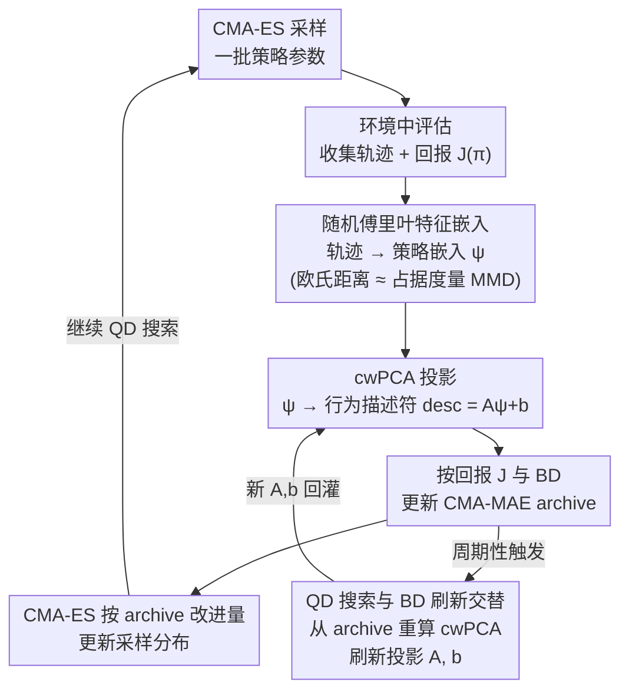

# AutoQD: Automatic Discovery of Diverse Behaviors with Quality-Diversity Optimization

**会议**: ICLR 2026  
**arXiv**: [2506.05634](https://arxiv.org/abs/2506.05634)  
**代码**: [conflictednerd/autoqd-code](https://github.com/conflictednerd/autoqd-code)  
**领域**: 强化学习 / Quality-Diversity 优化  
**关键词**: quality-diversity, occupancy measure, random Fourier features, behavior descriptor, CMA-MAE

## 一句话总结

提出 AutoQD，通过随机傅里叶特征（RFF）将策略的占据度量嵌入有限维空间，再用加权 PCA 降维得到行为描述符，实现无需人工设计 BD 的 QD 优化，在 6 个连续控制任务上全面超越手工 BD 和现有无监督 QD 方法。

## 研究背景与动机

**领域现状**：Quality-Diversity（QD）算法旨在发现一组既高质量又行为多样的策略集合，已在机器人运动、游戏关卡生成、蛋白质设计等领域取得成功。QD-RL 将 QD 思想引入序列决策任务，核心是维护一个 archive，每个格子存储特定行为区域中回报最高的策略。

**现有痛点**：QD 算法高度依赖**手工行为描述符（BD）**——将策略映射到低维向量的函数（如双足机器人的足部接触模式）。手工设计 BD 需要大量领域知识，且将多样性搜索限制在预定义维度上，可能遗漏有趣的行为变体。现有无监督方法（如 AURORA 用自编码器学 BD）缺乏理论保证，DIAYN/SMERL 等技能发现方法需要预先指定技能数量且扩展性差。

**核心动机**：占据度量（occupancy measure）$\rho^\pi(s,a) = (1-\gamma)\sum_{t=0}^{\infty}\gamma^t P(S_t=s, A_t=a|\pi)$ 是策略在状态-动作空间上的折扣访问频率分布。在标准假设下，马尔可夫策略与其占据度量之间**一一对应**，因此占据度量是策略行为的完整刻画。能否利用占据度量之间的距离自动构造 BD？

## 方法详解

### 整体框架

AutoQD 把"什么算不同的行为"这个本来要人工拍板的问题，交给占据度量（occupancy measure）来回答。整条 pipeline 是一个带回环的闭环：CMA-ES 采样一批策略参数，放进环境跑出轨迹和回报 $J(\pi)$；这些轨迹先经**随机傅里叶特征嵌入**压成一个有限维向量 $\psi^\pi$，使两个向量的欧氏距离近似它们占据度量之间的最大均值差异（MMD, Maximum Mean Discrepancy）；再经 **cwPCA 投影**降到低维行为描述符（BD, behavior descriptor）；策略据回报和 BD 落进 CMA-MAE 的 archive，CMA-ES 按 archive 的改进量更新采样分布。关键的回环是：搜索过程中**QD 搜索与 BD 刷新交替**进行，每隔一段就用 archive 里现存策略的嵌入重算一次 cwPCA、刷新投影矩阵——archive 长出新行为后，"多样性怎么定义"也随之演化。

### 关键设计

**1. 随机傅里叶特征嵌入：把"策略距离"变成可计算的欧氏距离**

占据度量虽然完整刻画了一个策略的行为，但它是状态-动作空间上的连续分布，无法直接比较两个策略差多少。AutoQD 给每对状态动作 $[s;a]$ 算一个 $D$ 维随机特征 $\phi(s,a) = \sqrt{2/D}\,[\cos(w_1^T[s;a]+b_1), \ldots, \cos(w_D^T[s;a]+b_D)]$，其中频率 $w_i \sim \mathcal{N}(0, \sigma^{-2}I)$、相位 $b_i \sim \mathcal{U}(0, 2\pi)$，这组特征在期望意义上近似带宽为 $\sigma$ 的高斯核 $k(x,y)=\exp(-\|x-y\|^2/(2\sigma^2))$。把策略沿轨迹采到的特征做折扣加权平均，就得到策略嵌入 $\psi^\pi = \frac{1}{n}\sum_{j=1}^{n}(1-\gamma)\sum_{t=0}^{T}\gamma^t \phi(s_t^j, a_t^j)$（$n$ 为轨迹条数），于是 $\|\psi^{\pi_1}-\psi^{\pi_2}\| \approx \text{MMD}(\rho^{\pi_1}, \rho^{\pi_2})$。这一近似不是经验拼凑：定理 1 证明嵌入距离与真实 MMD 的偏差以指数速率收敛，$\Pr[\,|\,\|\phi_1-\phi_2\|_2 - \text{MMD}(\rho_1,\rho_2)\,| \geqslant \tfrac{3}{4}\varepsilon\,] \leqslant 2e^{-nc\varepsilon^2} + \mathcal{O}(\varepsilon^{-2}\exp(-D\varepsilon^2/(64(d+2)))) + 6e^{-n\varepsilon^2/8}$，关键是误差里 $D$ 只要随状态-动作维度 $d$ **线性增长**就能控住，避免了高维分布比较常见的维度灾难。

**2. cwPCA 投影：把高维嵌入压成稳定、偏向高回报的低维 BD**

嵌入 $\psi^\pi \in \mathbb{R}^D$ 维度太高，直接当 BD 会让 QD archive 的格子数随维度指数爆炸，必须降到 $k \ll D$ 维。AutoQD 用校准加权主成分分析（cwPCA, Calibrated Weighted PCA）：先按每个策略的回报（fitness）给嵌入加权再做 PCA，让高质量策略对主成分方向的贡献更大，从而把搜索的多样性轴对齐到"好策略附近怎么变才有意义"；再加一步校准，缩放每根输出轴使投影值落进 $[-1,1]$，保证 archive 边界不会随 archive 内容漂移而失稳。最终 BD 就是一个仿射变换 $\text{desc}(\pi) = A\psi^\pi + b$（$A \in \mathbb{R}^{k\times D}$，$b \in \mathbb{R}^k$），计算极轻，便于在优化中反复刷新。

**3. QD 搜索与 BD 刷新交替：让"多样性的定义"随发现而演化**

单纯固定一个 BD 等于又回到人工预设维度，AutoQD 的关键是让两个阶段交替推进。QD 优化阶段用当前 BD 配合 CMA-MAE 搜索：CMA-ES 维护策略参数上的高斯分布，采样一批策略、评估回报、按它们对 archive 的改进量排序，再据此更新分布均值和协方差；按预设调度进入 BD 更新阶段，从 archive 里所有现存策略的嵌入重算一次 cwPCA，得到新的 $A, b$。值得注意的是随机傅里叶特征 $\{w_i, b_i\}$ 一旦初始化就冻结，只有投影矩阵随 archive 演化，这样嵌入空间始终稳定、只是观察它的"视角"在变，既能随新行为调整多样性维度，又不会让此前 archive 里的策略距离整体错位。

## 实验设计

**环境**：6 个连续控制任务——Ant、HalfCheetah、Hopper、Swimmer、Walker2d（MuJoCo）+ BipedalWalker（Gymnasium）。

**基线**：5 个对比方法，覆盖手工 BD、无监督 QD、多样性 RL 三类：

| 基线方法 | 类型 | BD 来源 |
|:---------|:-----|:--------|
| RegularQD | 手工 BD + CMA-MAE | 环境特定的人工设计 BD |
| AURORA | 无监督 QD | 自编码器重构的末状态潜编码 |
| LSTM-AURORA | 无监督 QD | LSTM 编码完整轨迹的隐状态 |
| DvD-ES | 多样性进化 | 策略在随机状态上的动作分布 |
| SMERL | 多样性 RL | 技能条件策略 + 判别器奖励 |

**评估指标**：

| 指标 | 含义 | 衡量内容 |
|:-----|:-----|:---------|
| GT QD Score | 用手工 BD 的 archive 计算的 QD 分数 | 质量 + 人类定义的多样性 |
| Vendi Score (VS) | 基于占据嵌入相似性的有效种群大小 | 纯多样性 |
| qVS | 质量加权的 Vendi Score | 质量 × 多样性 |

## 实验结果

### 主实验：6 环境全面对比

| 环境 | 指标 | AutoQD | RegularQD | AURORA | LSTM-AURORA | DvD-ES | SMERL |
|:-----|:-----|:-------|:----------|:-------|:------------|:-------|:------|
| Ant | QD (×10⁴) | **361.4** | 182.6 | 5.6 | 19.2 | 0.3 | 1.0 |
| Ant | VS | **72.4** | 39.5 | 1.1 | 1.9 | 1.0 | 1.3 |
| HalfCheetah | QD (×10⁴) | **30.8** | 24.9 | 11.4 | 11.4 | 0.9 | 1.6 |
| Hopper | QD (×10⁴) | **1.84** | 1.20 | 1.06 | 1.36 | 0.56 | 0.97 |
| Hopper | qVS | **1.94** | 1.35 | 0.66 | 0.36 | 0.90 | 1.81 |
| Swimmer | QD (×10⁴) | **21.3** | 11.1 | 8.1 | 10.3 | 0.2 | 0.02 |
| Walker2d | QD (×10⁴) | **18.4** | 11.4 | 7.7 | 13.0 | 0.6 | 1.2 |
| BipedalWalker | QD (×10⁴) | **6.09** | 1.81 | 3.00 | 3.36 | 0.09 | 0.14 |
| BipedalWalker | VS | **12.2** | 1.6 | 2.9 | 3.4 | 1.1 | 5.5 |

⭐ **核心发现**：AutoQD 在 GT QD Score 上**全部 6 个环境都是最佳**，qVS 和 VS 在 4/6 环境最佳。唯一例外是 HalfCheetah（VS高但qVS低，发现了多样但低回报的"滑行"行为）和 Walker2d（qVS/VS 略低于 RegularQD）。

### 适应性实验：环境动态变化下的鲁棒性

在 BipedalWalker 上测试摩擦系数/质量变化下的适应性：

| 变化类型 | AutoQD | RegularQD | AURORA | LSTM-AURORA | DvD-ES | SMERL |
|:---------|:-------|:----------|:-------|:------------|:-------|:------|
| 摩擦 AUC | **1429.7** | 30.3 | 1309.4 | 1226.3 | 1204.0 | 496.2 |
| 质量 AUC | **295.7** | 12.8 | 260.6 | 271.8 | 113.7 | 71.4 |

⭐ AutoQD 的多样策略集在动态变化下展现最强适应性：不仅最佳单策略表现最优，且在严格阈值（$p=0.9$）下成功适应的策略数量也最多。

## 优缺点分析

**优点** ⭐⭐⭐⭐

- 理论基础扎实：基于占据度量一一对应和 MMD 近似定理，提供了误差收敛的概率界
- 完全自动化：无需领域知识设计 BD，嵌入维度只需随 $d$ 线性增长
- 实验全面：6 环境 × 5 基线 × 3 指标，3 随机种子，覆盖手工 BD/无监督 QD/多样性 RL 三类方法
- 适应性验证有说服力：摩擦系数和质量变化下的系统性评估

**缺点** ⭐⭐⭐

- 在 HalfCheetah/Walker2d 上 qVS 不是最优，说明自动 BD 可能过度关注某些行为维度而忽略人类关注的变体
- 高随机性环境下需要大量轨迹估计嵌入，样本效率较低
- 核带宽 $\sigma$ 固定，未能自适应调整以适应不同学习阶段
- 仅与 CMA-MAE 结合，未验证与梯度 QD 方法（如 PGA-ME、PPGA）的兼容性
- 仅在状态向量观测空间实验，未扩展到图像观测

## 个人思考

1. **占据度量嵌入的普适性**：这套 RFF 嵌入框架不仅限于 QD，可直接用于策略聚类、模仿学习中的策略匹配、逆强化学习中的行为比较。将策略空间转化为可度量的欧氏空间是非常优雅的工具。

2. **cwPCA 的局限**：加权 PCA 本质是线性降维，如果行为空间存在非线性流形结构，PCA 可能丢失重要信息。用核 PCA 或结合 UMAP 等非线性方法可能进一步提升 BD 质量。

3. **与梯度 QD 方法结合的挑战**：论文提到 BD 更新会导致梯度 QD 方法不稳定——因为 BD 变化意味着目标函数变化，策略梯度的方向失效。可能需要 BD 平滑更新（如 EMA）或冻结 BD 进行多步梯度更新再切换。

4. **实际应用价值**：对机器人行为库构建很有价值——不需要人工定义"什么算不同的行为"，算法自动发现行为多样性的主要维度。在 sim-to-real 场景中，多样策略集提供了天然的 domain randomization 互补。

## 相关工作

- **MAP-Elites** (Cully et al., 2015): QD 开山之作，维护按 BD 组织的 archive
- **CMA-MAE** (Fontaine & Nikolaidis, 2023): 将 QD 重构为单目标优化，引入软 archive 机制
- **AURORA** (Grillotti & Cully, 2022): 用自编码器学习 BD，缺乏理论保证
- **DIAYN** (Eysenbach et al., 2019): 最大化技能-状态互信息发现多样技能
- **SMERL** (Kumar et al., 2020): 在 DIAYN 基础上加入任务奖励
- **DvD-ES** (Parker-Holder et al., 2020): 用策略在随机状态上的动作刻画行为差异

<!-- RELATED:START -->

## 相关论文

- [\[ICLR 2026\] Post-training Large Language Models for Diverse High-Quality Responses](post-training_large_language_models_for_diverse_high-quality_responses.md)
- [\[ICLR 2026\] Reference Grounded Skill Discovery](reference_grounded_skill_discovery.md)
- [\[ICLR 2026\] A Hierarchical Circuit Symbolic Discovery Framework for Efficient Logic Optimization](a_hierarchical_circuit_symbolic_discovery_framework_for_efficient_logic_optimiza.md)
- [\[ICLR 2026\] AutoTool: Automatic Scaling of Tool-Use Capabilities in RL via Decoupled Entropy Constraints](autotool_automatic_scaling_of_tool-use_capabilities_in_rl_via_decoupled_entropy_.md)
- [\[ICLR 2026\] When Is Diversity Rewarded in Cooperative Multi-Agent Learning?](when_is_diversity_rewarded_in_cooperative_multi-agent_learning.md)

<!-- RELATED:END -->
