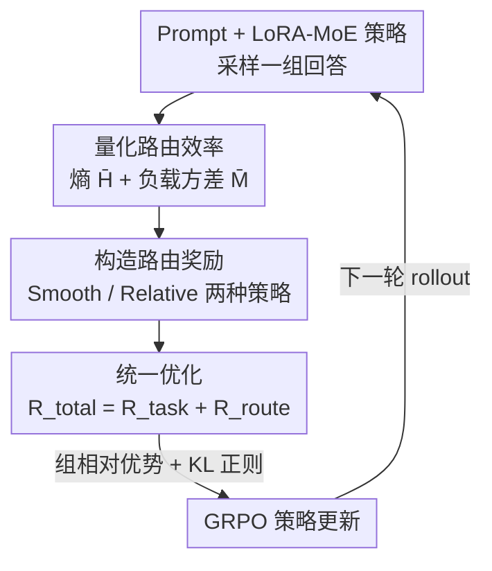

# Balancing the Experts: Unlocking LoRA-MoE for GRPO via Mechanism-Aware Rewards

**会议**: ICLR2026  
**OpenReview**: [https://openreview.net/forum?id=rhD7ZuFAjU](https://openreview.net/forum?id=rhD7ZuFAjU)  
**代码**: 待确认（论文称源码随补充材料提供）  
**领域**: 强化学习微调 / LoRA-MoE / 参数高效微调  
**关键词**: GRPO, LoRA-MoE, 路由坍缩, 机制感知奖励, 负载均衡

## 一句话总结
针对 LoRA-MoE 用 GRPO 做强化微调时路由坍缩、专家利用率低的问题，本文提出 RO-GRPO：把训练中采集到的内部路由统计量（熵 + 负载方差）转换成一个标量奖励，直接拼进 GRPO 的总奖励里，无需辅助损失、不改架构、不加训练阶段，就让模型在提升数学推理精度的同时把专家路由调得更均衡更自信。

## 研究背景与动机
**领域现状**：LoRA-MoE 把低秩适配（LoRA）和混合专家（MoE）结合起来，用一组并行的低秩专家 + 一个路由网络替换单一 LoRA，在监督微调（SFT）里已被证明能减少任务干扰、提升知识保留，是当下很被看好的参数高效微调（PEFT）方向。与此同时，GRPO 这类无 critic 的强化微调（RFT）算法在数学推理、指令跟随上表现强劲，正成为对齐大模型的主力。一个自然的想法是把两者拼起来——用 GRPO 去微调 LoRA-MoE。

**现有痛点**：但这个拼接会出问题。在 SFT 里，路由是靠一个辅助的负载均衡损失（auxiliary load-balancing loss）来引导的；而在 GRPO 里，优化信号只来自外部的任务奖励 $R_{task}$，它只看最终输出对不对，对路由器内部做了什么决策完全"失明"。缺乏显式引导，路由器很容易退化成两种典型失败：一是**专家坍缩（Expert Collapse）**——路由器只挑一小撮专家，负载严重失衡，大量参数容量被浪费；二是**路由犹豫（Routing Indecision）**——路由器输出高熵（低置信）的分布，专家无法形成分工特化。

**核心矛盾**：SFT 那套辅助损失没法直接搬进 GRPO。辅助损失是可微的、对一个 batch 里所有轨迹施加**统一**的均衡惩罚，这与 GRPO "按组相对优势来判断好坏" 的逻辑不兼容——它会无差别地压制那些虽然路由不太均衡、但答案正确的轨迹。作者想要的是一个**无损失（loss-free）**的机制：让路由负载和任务表现在 rollout 阶段通过同一个奖励信号被联合优化，而不是靠一条额外的可微损失去硬性约束每个路由决策。

**本文目标**：在不改 LoRA-MoE 架构、不加训练阶段的前提下，给 GRPO 的奖励里注入一个能直接针对路由坍缩与犹豫的"内部、机制感知"信号。

**切入角度**：作者的关键观察是——生成（rollout）过程中本来就能顺手采集到路由统计量（路由熵、负载分布），这些标量完全可以被加工成一个奖励，去把内部路由机制对齐到任务表现上。既然 GRPO 本质就是用标量奖励来塑造策略，那为什么这个标量不能由模型"自己的内部机理"产生？

**核心 idea**：把模型自身的路由统计量工程化成一个标量奖励，拼进 GRPO 总奖励，让强化学习从"只调外部行为"扩展到"调内部机制"——这是本文所谓 mechanism alignment 的首次实证。

## 方法详解

### 整体框架
RO-GRPO（Routing-Optimized GRPO）的整条管线建立在标准 GRPO 之上，只在奖励侧动刀：每生成一组回答时，除了照常算任务奖励 $R_{task}$，还从所有被激活的 LoRA-MoE 模块里收集这一组生成所产生的路由概率向量，聚合成两个标量指标（路由熵、负载方差），再把它们转换成一个机制奖励 $R_{route}$；最后 $R_{total}=R_{task}+R_{route}$ 喂进 GRPO 标准的组相对优势计算，驱动策略更新。$R_{route}$ 本身不可微，它的"梯度"是通过策略梯度隐式传播的——也就是说，路由好的轨迹拿到更高的总奖励、更大的优势，策略自然就被推向"既答对又路由高效"的方向。整个过程不引入任何辅助损失、不改架构、不加额外训练阶段。

具体落地上，LoRA-MoE 模块被插进每个 Transformer block 前馈网络（FFN）的 gate、up、down 三个投影里；训练时只更新 PEFT 参数，底座权重冻结。

预备知识上，一个 LoRA-MoE 层把冻结预训练层的输出改写为：对输入 token 表示 $h$，路由器先算门控概率 $p=\mathrm{softmax}(W_{router}h)$，然后输出 $h_{out}=h+\big(\sum_{e=1}^{E} p(e\mid h)\,B_eA_e\big)h$，其中 $\{(A_e,B_e)\}_{e=1}^{E}$ 是 $E$ 个并行低秩专家。GRPO 则是无 critic 的策略优化，目标是最大化 $\mathbb{E}_{x\sim D,\,y\sim\pi_\theta(\cdot\mid x)}[R_{task}(y)]$。

### 关键设计

**1. 量化路由效率：用熵和负载方差给"路由器状态"读数**

要把内部机制变成奖励，前提是先有可观测的标量。本文从每个生成样本里收集所有被激活 LoRA-MoE 模块的路由概率向量，聚合出两个指标。第一个衡量**路由置信度**：对全部 $T$ 个 token 的逐 token 路由决策取平均香农熵，$\bar H=\frac{1}{T}\sum_{i=1}^{T}H(p_i)$，其中 $H(p)=-\sum_{e=1}^{E}p_e\ln p_e$（实现里加一个小 $\epsilon$）。熵越低，说明路由越果断、越利于专家特化。第二个衡量**负载均衡**：对每个模块 $m$ 先把流经它的所有 token 路由向量平均得到利用率向量 $\bar p_m$，再算它与均匀分布 $u=\frac{1}{E}\mathbf{1}$ 的 MSE，最后对 $M$ 个模块取均值 $\bar M=\frac{1}{M}\sum_{m=1}^{M}\frac{1}{E}\lVert\bar p_m-\frac{1}{E}\mathbf{1}\rVert_2^2$。为了能稳定地塞进奖励，两个指标都被归一化到约 $[0,1]$：$H_{norm}=\bar H/\ln E$、$M_{norm}=\bar M/((E-1)/E^2)$。这一步的意义在于：路由器的"健康状况"被压缩成两个可直接比较的数，专家坍缩反映为 $M_{norm}$ 偏高，路由犹豫反映为 $H_{norm}$ 偏高。

**2. 构造路由奖励：Smooth 课程调度 与 Relative 相对改进门控两种策略**

有了指标，下一步是把它们变成标量奖励 $R_{route}$，作者给了两条互补路线。**Smooth（课程式调度）**先鼓励"自信路由"（压熵）、再过渡到"负载均衡"（压 MSE），奖励写作 $R_{route}=-w_{route}\,(w_H(t)\cdot H_{norm}+w_B(t)\cdot M_{norm})$，其中权重随训练进度 $t\in[0,1]$ 用 sigmoid $\sigma(t)=1/(1+e^{-k(t-c)})$ 动态调度：$w_H(t)=\lambda_H^{start}\cdot(1-\sigma(t))$、$w_B(t)=\lambda_B^{end}\cdot\sigma(t)$。这么排是有道理的——单目标优化是次优的：只压熵会让负载变差（MSE 上升），只压均衡在前期又太弱、塑造不出特化；先建出"特化的专家"、再去"组织它们让负载均衡"，正好顺着 MoE 训练的自然动力学。**Relative（相对改进门控）**则提供一个稀疏、自适应的奖励：只有当置信度和负载均衡**同时**相对各自的指数滑动平均（$\bar H_{hist}$、$\bar M_{hist}$）改善时，才发一个常数正奖励 $R_{route}=C\cdot\mathbb{1}\{H_{norm}<\bar H_{hist}\wedge M_{norm}<\bar M_{hist}\}$。它鼓励"持续自我超越"，好处是不用手动去平衡两个路由目标的权重。

**3. 统一优化：让不可微的机制奖励通过策略梯度隐式回传**

机制奖励 $R_{route}$ 和任务奖励相加得到 $R_{total}(y)=R_{task}(y)+R_{route}(y)$。关键在于 $R_{route}$ 不可微，它不会像辅助损失那样产生一条额外的反向传播路径，而是被整体并入 GRPO 的组相对优势：一组回答 $\{y_i\}$ 用 $R_{total}$ 打分，算出组相对优势 $\hat A_i$，再驱动策略更新，目标可概括为 $J_{\text{RO-GRPO}}(\theta)\approx\mathbb{E}\big[\sum_i\log\pi_\theta(y_i\mid x)\hat A_i-\beta\,D_{KL}(\pi_\theta\Vert\pi_{ref})\big]$。这种"奖励而非损失"的做法之所以更优，是因为它让模型能学会**权衡**：一条路由略微失衡的轨迹，只要答案正确，仍可能拿到正优势；而辅助损失会对 batch 里所有轨迹施加统一惩罚，不管它任务上成不成功——这种僵硬惩罚会压制掉某些复杂任务需要的、非常规但有用的路由模式。代价上，RO-GRPO 与 vanilla LoRA-MoE 架构、参数量完全相同，只多了每层 $O(TE)$ 的事后奖励计算，相对前向 $O(TKdr)$ 可忽略；而且不需要像辅助损失那样多算一次 $\nabla_\theta\mathcal{L}_{aux}$，反而省了反传开销和显存。

### 损失函数 / 训练策略
全局奖励缩放系数 $w_{route}=0.2$。Smooth 策略设初始熵权重 $\lambda_H^{start}=0.5$、最终均衡权重 $\lambda_B^{end}=2.0$；Relative 策略的历史基线在最近 1000 个样本的滑动窗口上统计。LoRA 基线 rank=16，LoRA-MoE 用 $E\in\{2,4,8\}$ 个专家、每个 rank=8，以对齐可训练参数预算；底座冻结，只更新 PEFT 参数，训练与评测用同一套引导逐步推理的 system prompt。

## 实验关键数据

### 主实验
在单模态（Qwen2.5-7B-Instruct，NuminaMath-TIR 微调）和多模态（Qwen2.5-VL-7B-Instruct，Geometry3k 微调）数学推理上，RO-GRPO 在所有专家数（$E\in\{2,4,8\}$）下都稳定超过 vanilla GRPO+LoRA-MoE。两个奖励变体各有所长：Smooth 在 GSM8K、SVAMP 上最好，Relative 在 Geometry3k、MathVista、WeMath 上更强。

| 设置 | 方法（最佳配置） | 关键基准 | 本文 | 对比基线 | 提升 |
|------|------------------|----------|------|----------|------|
| 单模态 | RO-GRPO (Smooth, E=2) | GSM8K | 91.51% | GRPO(LoRA) 90.45 / vanilla MoE 90.22 | +1.06 / +1.29 pp |
| 单模态 | RO-GRPO (Relative, E=4) | MGSM | 54.58% | vanilla MoE(E=4) 46.15 | +8.43 pp |
| 多模态 | RO-GRPO (Relative, E=2) | Geometry3k | 41.93% | vanilla MoE(E=2) 38.27 / GRPO(LoRA) 38.44 | +3.66 / +3.49 pp |
| 多模态 | RO-GRPO (Relative, E=4) | WeMath | 66.26% | GRPO(LoRA) 63.97 / 最佳 vanilla MoE 63.74 | +2.29 / +2.52 pp |

路由指标上，在相同 $E$ 下 RO-GRPO 都把 MSE 压到不高于 vanilla（如单模态 E=2 由 0.020→0.016/0.017，多模态 E=2 由 0.038→0.033/0.036），同时维持相当的熵。

### 消融实验

| 配置（GSM8K, E=2） | 准确率 | Entropy | MSE | 说明 |
|------|---------|---------|-----|------|
| RO-GRPO (Smooth) | 91.51 | 0.639 | 0.016 | 完整模型 |
| w/o $R_B$ (Smooth) | 90.75 | 0.639 | 0.018 | 去掉均衡奖励 |
| w/o $R_H$ (Smooth) | 89.92 | 0.639 | 0.019 | 去掉置信奖励 |
| w/o $R_B$ (Relative) | 89.01 | 0.638 | 0.019 | 跌破 vanilla 基线 |
| Shuffled (Smooth) | 89.23 | 0.640 | 0.018 | batch 内打乱路由奖励 |
| GRPO (LoRA-MoE) | 89.39 | 0.640 | 0.020 | vanilla 基线 |

### 关键发现
- **两个奖励分量缺一不可且协同**：去掉 $R_B$ 或 $R_H$ 都掉点；对 Relative 变体去掉 $R_B$ 甚至跌到 89.01%，低于 vanilla（89.39%）。
- **因果性可验证**：Shuffle 对照（batch 内随机置换路由奖励、切断动作与奖励的因果链）把成绩打回 vanilla 水平（89.23/89.28%），证明增益确实来自有意义的机制反馈而非奖励结构本身的副作用。
- **路由奖励抑制文本退化**：Geometry3k E=4 时 vanilla 有 7.5% 生成陷入重复循环（仅 28.95%），Smooth 降到 0.17%、Relative 彻底消除，准确率回到 40.10%/40.27%；同时推理延迟-准确率的 Pareto 前沿更优（更高精度、更低延迟）。
- **奖励 > 辅助损失**：Aux-Loss 基线虽能压熵，却改善不了负载均衡（GSM8K E=2 上 MSE 0.036 vs 本文 0.016），且倾向生成更长序列却不带来相称的精度提升。
- **无引导路由很脆**：vanilla 在 $E$ 增大时原始 MSE 虽降，但精度并不可靠提升、甚至下滑（Geometry3k E=4 仅 28.95%），暴露出缺乏机制反馈时的不稳定。

## 亮点与洞察
- **"奖励可以从模型自己的内部机理里造出来"**——这是本文最让人"啊哈"的点：以往 RLHF 的标量奖励几乎都来自外部（人类偏好、任务正确性），本文证明路由熵、负载方差这些纯内部统计量也能工程化成有效奖励，把对齐从"行为对齐"推到"机制对齐"。
- **用"奖励"绕开"辅助损失"的不兼容**：把均衡约束做成奖励而非损失，天然契合 GRPO 的组相对优势——允许"路由略失衡但答对"的轨迹存活，这个视角可迁移到任何想给 RL 注入软性结构约束的场景（如稀疏性、注意力分布、KV 缓存命中率）。
- **课程调度顺应训练动力学**：先压熵建特化、再压 MSE 做组织，对应 IB（信息瓶颈）视角下"路由器学最小充分表示"的解释，给"为什么这么排"提供了理论落点而非拍脑袋。
- **几乎零成本**：同架构同参数量，只多 $O(TE)$ 事后计算，还省掉辅助损失的反传——这让它很容易被现有 GRPO+MoE 流水线直接吸收。

## 局限与展望
- **任务面较窄**：实验只覆盖数学推理（单模态 + 多模态几何/视觉数学），未验证在代码、通用指令跟随、长文本等任务上路由奖励是否同样有效。
- **指标设计偏经验**：熵 + MSE 两个指标 + 两套奖励策略的若干超参（$w_{route}$、$\lambda_H^{start}$、$\lambda_B^{end}$、sigmoid 的 $k,c$、滑窗大小）都靠验证集调出来，缺乏自适应或理论最优的选取方式，换底座/换 $E$ 是否需要重调不明确。
- **两套策略需要选**：Smooth 与 Relative 各擅胜场但没有统一最优，实际用时仍要按任务试，作者也未给出何时该选哪个的明确判据。
- **规模与 $E$ 有限**：只验证到 7B 模型、$E\le 8$，更大模型 / 更多专家下"机制奖励"是否还能稳住路由有待观察；可改进方向包括让奖励权重在线自适应、把机制奖励推广到 token/层级更细粒度的路由监督。

## 相关工作与启发
- **vs 辅助负载均衡损失（Switch/ST-MoE/StableMoE 一脉）**：它们在可微监督训练里用辅助损失防坍缩，但损失对 batch 内所有轨迹统一惩罚，搬进 GRPO 会压制有用的非常规路由；本文改用不可微奖励 + 组相对优势，让任务成功的轨迹能"豁免"路由惩罚，实测 MSE 与精度都更好。
- **vs vanilla GRPO + LoRA-MoE**：直接拼接时任务奖励对路由"失明"，导致坍缩/犹豫；本文补上机制感知奖励，在相同参数预算和架构下把路由调健康，是"首个系统研究 RFT 框架下 LoRA-MoE"的工作。
- **vs 标准 RLHF（PPO/DPO/GRPO）**：这些方法只优化外部标量任务奖励、不监督内部机制；本文把奖励来源扩展到模型自身机理，提出 mechanism alignment 的新范式，为复杂模块化架构的原则性对齐开了一条路。

## 评分
- 新颖性: ⭐⭐⭐⭐⭐ 首次把模型内部路由统计量工程化成 GRPO 标量奖励，从行为对齐推进到机制对齐，视角新。
- 实验充分度: ⭐⭐⭐⭐ 覆盖单/多模态 4+4 基准、3 个专家数、消融 + Shuffle 因果对照齐全，但任务面局限在数学推理、规模到 7B。
- 写作质量: ⭐⭐⭐⭐ 动机层层递进、IB 视角的理论落点清晰，图表与结论自洽。
- 价值: ⭐⭐⭐⭐ 零额外成本、即插即用，给 GRPO+MoE 这一实际拼接痛点提供了干净有效的解法。

<!-- RELATED:START -->

## 相关论文

- [\[ICLR 2026\] BranchGRPO: Stable and Efficient GRPO with Structured Branching in Diffusion Models](branchgrpo_stable_and_efficient_grpo_with_structured_branching_in_diffusion_mode.md)
- [\[ICML 2026\] Unlocking Zero-Shot Geospatial Reasoning via Indirect Rewards](../../ICML2026/reinforcement_learning/unlocking_zero-shot_geospatial_reasoning_via_indirect_rewards.md)
- [\[ICLR 2026\] Composition of Memory Experts for Diffusion World Models](composition_of_memory_experts_for_diffusion_world_models.md)
- [\[ICLR 2026\] Deft Scheduling of Dynamic Cloud Workflows with Varying Deadlines via Mixture-of-Experts](deft_scheduling_of_dynamic_cloud_workflows_with_varying_deadlines_via_mixture-of.md)
- [\[ICLR 2026\] FAPO: Flawed-Aware Policy Optimization for Efficient and Reliable Reasoning](fapo_flawed-aware_policy_optimization_for_efficient_and_reliable_reasoning.md)

<!-- RELATED:END -->
