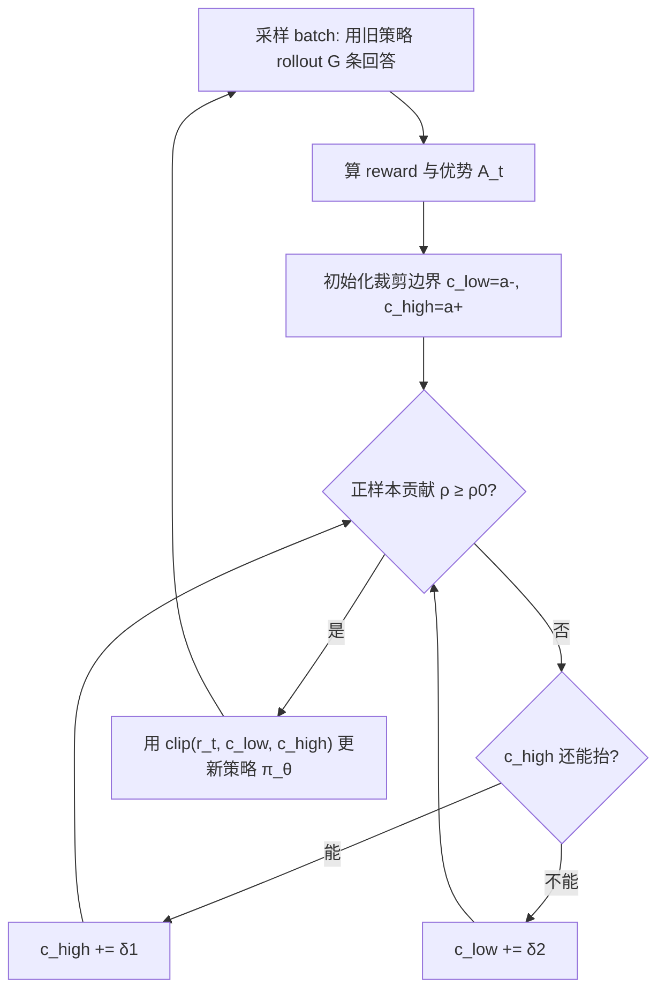

# BAPO: Stabilizing Off-Policy Reinforcement Learning for LLMs via Balanced Policy Optimization with Adaptive Clipping

**会议**: ICLR 2026  
**OpenReview**: [https://openreview.net/forum?id=jIeJJqG7dz](https://openreview.net/forum?id=jIeJJqG7dz)  
**代码**: [https://github.com/WooooDyy/BAPO](https://github.com/WooooDyy/BAPO)  
**领域**: 强化学习 / LLM 后训练  
**关键词**: off-policy RL, 自适应裁剪, 熵坍缩, GRPO, 策略梯度平衡, LLM 推理  

## 一句话总结
BAPO 通过逐步训练动态调整 PPO/GRPO 的上下裁剪边界 $c_{high}$、$c_{low}$，让正样本对策略梯度损失的贡献占比维持在目标值 $\rho_0$，从而在离线（off-policy）RL 中同时抑制负样本主导和熵坍缩，让 7B/32B 推理模型的训练稳定且高效。

## 研究背景与动机

**领域现状**：RL 已成为对齐和增强 LLM 推理能力的核心范式，而其中 off-policy RL（rollout 行为策略与训练目标策略不一致，即用过去策略产生的"陈旧"数据训练）因为样本利用率高、容忍数据延迟，特别适配 partial rollout、样本回放等现代训练基础设施，被寄予厚望。

**现有痛点**：可一旦把 off-policy 用到 LLM 上，问题就来了——作者用 GRPO 做的预实验（Figure 2）显示，随着数据陈旧度（staleness）从 0 增大到 8×，训练奖励震荡、梯度爆炸、策略熵急速下降，甚至出现训练崩溃；而 on-policy 训练在各项指标上都稳如老狗。也就是说，off-policy 想要的"高效率"是以"不稳定"为代价的。

**核心矛盾**：作者把不稳定拆成两个互相关联的机理。其一是**优化失衡**：在 PPO 类目标里把正负优势 token 分开看（公式 5），实测正样本无论在数量还是对策略梯度损失的贡献上都是少数派——因为难题上模型倾向生成更长轨迹（产出更多负 token），且训练早期能力不足导致负样本占比高。负样本主导会过度惩罚甚至压制中性/正确的行为，且低概率负 token（$\pi_\theta(y_t)\to 0$ 使 $\log$ 项趋于 $-\infty$）会触发梯度爆炸。其二是 **Entropy-Clip Rule**：作者推导出策略熵变化 $\Delta H(\pi_\theta)\approx -\eta\cdot\mathrm{Cov}[\log\pi_\theta(y_t), A_t\cdot X(y_t)+C]$，其中只有"未被裁剪"的 token 才影响熵。而 PPO 固定对称裁剪区间（如 $[0.8,1.2]$）系统性地把大量"低概率正 token"挡在优化之外、又过度惩罚低概率负 token，结果就是分布持续被锐化、熵单调下降，模型从"探索"滑向"过度利用"，最终撞上性能瓶颈。

**本文目标**：在不引入复杂手调超参的前提下，让 off-policy RL 既平衡正负贡献、防止梯度爆炸，又保住策略熵以维持探索。

**核心 idea**：作者先做了一个关键观察（Figure 5）——重要性采样权重 $r_t$ 偏离 1 越远的 token 概率越低、熵越高。基于此提出 **自适应非对称裁剪**：不再固定裁剪边界，而是每个 batch 动态地一起抬高 $c_{high}$ 和 $c_{low}$，先放更多低概率正 token 进来（保熵），再适度过滤低概率负 token（防爆），直到正样本损失贡献占比达到预设目标 $\rho_0$ 才停。

## 方法详解

### 整体框架
BAPO 建立在 GRPO 之上，把 PPO 类目标里那对**固定、对称**的裁剪边界 $\varepsilon$ 换成一对**逐步搜索、非对称**的边界 $c_{low}$ 与 $c_{high}$。每个训练 step 先采样并算出每条回答的优势，然后进入一个内层循环：从初始边界 $(a^-, a^+)$ 出发，按步长 $\delta_1$、$\delta_2$ 逐步抬高上界和下界，每抬一次就重新评估"正样本贡献占比 $\rho$"，直到 $\rho$ 达到目标 $\rho_0$（或边界顶到上限），再用这对边界做一次策略更新。整套机制把"维持熵、平衡正负"这个目标从手动调参变成了每步自动求解。

### 关键设计

**1. 正样本贡献占比作为调节目标：把"保熵"变成可量化的约束**。BAPO 不直接调熵，而是抓住一个更可控的代理量——正优势 token 对策略梯度损失的贡献占比。形式化地，方法要为每个 batch 找一对 $(c_{high}, c_{low})$ 使得

$$\frac{\sum_{A_t>0}\pi_{\theta_{rollout}}(y_t)\cdot|\min(r_t A_t,\ \mathrm{clip}(r_t,0,c_{high})A_t)|}{\sum_{A_t}\pi_{\theta_{rollout}}(y_t)\cdot|\min(r_t A_t,\ \mathrm{clip}(r_t,c_{low},c_{high})A_t)|}\ \ge\ \rho_0,$$

其中 $\rho_0$（实验取 0.4）是正信号占比的目标值。这个设计的巧妙在于它把前面两个机理统一了：占比太低意味着负样本主导（失衡）且低概率正 token 被裁掉（熵降），把占比顶到 $\rho_0$ 就同时缓解两者。同时设上限又能防止占比失控——避免正 token 反过来淹没损失导致"尾部退化"（模型只会做简单题、做不动难题）。

**2. 上界优先、下界跟进的逐步搜索：兼顾保熵与防爆的次序**。求解 $\rho_0$ 时 BAPO 不是一起抬，而是**先抬 $c_{high}$、抬到头才抬 $c_{low}$**（Algorithm 1 的内层循环）。这个次序来自验证实验（Figure 7）的发现：抬高上界 $c_{high}$ 会把更多低概率正 token 纳入更新，既提性能又对冲熵的下滑；而放松下界 $c_{low}$ 会引入更多低概率负 token，不仅掉性能还加速熵坍缩。所以 BAPO 把"扩上界"作为提升正贡献的主力手段，只在上界顶到 $b^+$ 仍不够时才小幅放下界。可移动范围设为 $[a^-,b^-]=[0.6,0.9]$、$[a^+,b^+]=[1.2,3.0]$，步长 $\delta_1=0.05$、$\delta_2=0.02$——上界范围和步长都明显大于下界，体现"上界为主、下界为辅"。

**3. 非对称裁剪平滑分布以反转熵的走向**。把 BAPO 放回 Entropy-Clip Rule 的视角看（Figure 3），标准 GRPO 用对称边界，强化高概率正 token 同时惩罚低概率负 token，正好是锐化分布、降熵的两类更新；而 BAPO 的非对称边界做的恰恰相反——纳入此前被裁掉的低概率正 token、剔除过度的低概率负 token，对应的是平滑分布、增熵的更新。配合 Figure 5/9 的观察（IS 权重越偏离 1、token 概率越低、熵越高），BAPO 实际上是在系统性地"召回高熵 token"。作者还指出这把若干前人技巧统一进了一个框架：DAPO 的 Clip-Higher（固定把上界设到 1.28）、只保留 top-20% 高熵 token 训练、以及 target-entropy 技术，都可看作 BAPO 自适应机制的特例或近似，区别在于 BAPO 无需手动指定、逐步自适应。

## 实验关键数据

### 主实验表格（AIME 2024 / 2025，pass@... 16 rollouts 平均）

| 模型 | 规模 | AIME 2024 | AIME 2025 | 平均 |
|------|------|-----------|-----------|------|
| DeepSeek-R1 | 671B | 79.8 | 70.0 | 74.9 |
| o3-mini-medium | - | 79.6 | 76.7 | 78.2 |
| Gemini-2.5-Flash-Thinking | - | 82.3 | 72.0 | 77.2 |
| Qwen3-32B | 32B | 81.4 | 72.9 | 77.2 |
| SkyWork-OR1-32B | 32B | 82.2 | 73.3 | 77.8 |
| BP-Math-32B (SFT) | 32B | 84.4 | 78.1 | 81.3 |
| BP-Math-32B (GRPO) | 32B | 84.6 | 78.8 | 81.7 |
| **BP-Math-32B (BAPO)** | 32B | **87.1** | **80.0** | **83.5** |
| SkyWork-OR1-7B | 7B | 70.2 | 54.6 | 62.4 |
| BP-Math-7B (SFT) | 7B | 66.9 | 59.0 | 62.9 |
| BP-Math-7B (GRPO) | 7B | 69.2 | 59.2 | 64.2 |
| **BP-Math-7B (BAPO)** | 7B | **70.8** | **62.5** | **66.7** |

7B 的 BAPO 模型超过开源同规模 SkyWork-OR1-7B（AIME25 上 +7.9 点）；32B 的 BAPO 模型在同规模开源里 SOTA，且 AIME24/25 上分别超 DeepSeek-R1 7.3/10.0 点，逼近 o3-mini。

### 消融 / 验证实验

| 设置 | AIME24 (Stale 2) | AIME24 (Stale 4) | AIME25 (Stale 2) | AIME25 (Stale 4) |
|------|------|------|------|------|
| Base Model | 54.2 | 54.2 | 38.4 | 38.4 |
| 固定对称 Clip $[0.8,1.2]$ | 58.3 | 54.2 | 39.4 | 40.2 |
| Clip-Higher $[0.8,1.28]$ | 58.3 | 59.2 | 39.7 | 40.2 |
| **BAPO** | **60.9** | **62.0** | **44.2** | **43.3** |

不同陈旧度下 BAPO 都稳定超过固定裁剪和 clip-higher，且 staleness 越大优势越明显。

### 关键发现
- **训练动态对照**（Figure 8 vs Figure 2）：BAPO 把奖励快速上升、梯度范数平稳、熵稳定三件事同时做到，而 GRPO 在 staleness 增大时熵坍缩、梯度爆炸。
- **边界确实在动**（Figure 10）：训练中 $c_{high}$、$c_{low}$ 的均值持续波动，证明 BAPO 是在逐 step 自适应平衡正负贡献，而非退化成固定值。
- **GRPO 对强 SFT 模型几乎无增益**（32B 上仅 +0.2/+0.7），而 BAPO 仍能再提 2.7/1.9 点，说明收益来自机制而非简单的 RL 续训。
- **partial rollout 场景**（Figure 12）：在 2k/4k token 预算的分段 rollout 下，BAPO 相比 baseline 同样维持更高奖励和更稳的熵。

## 亮点与洞察
- **把"训练不稳"归因到可操作的两条机理**：优化失衡 + Entropy-Clip Rule，且 Entropy-Clip Rule 有理论推导（协方差形式）支撑，不是纯经验调参。
- **用"正样本贡献占比 $\rho_0$"作为单一控制旋钮**，优雅地把"平衡正负"和"保熵"两个目标耦合成一个可在线求解的约束，避免了 DAPO 那种手调多个裁剪超参。
- **统一视角**：把 Clip-Higher、高熵 token 筛选、target-entropy 等一系列看似零散的技巧解释成自适应裁剪的特例，理论增量清晰。
- **实证强**：7B/32B 双规模、多 backbone、多 off-policy 场景（样本回放 + partial rollout + 多档 staleness）全覆盖，32B 结果能打 o3-mini。

## 局限与展望
- **超参虽少但仍存在**：$\rho_0$、可移动范围 $[a^-,b^-]/[a^+,b^+]$、步长 $\delta_1/\delta_2$ 仍需设定，作者称"未精调"，但跨任务/跨模型的普适性还需更多验证。
- **任务面偏窄**：评测集中在 AIME 数学推理，coding、agentic 等其他 RL 重点场景未覆盖，泛化性待验证。
- **内层搜索开销**：每 step 逐步抬边界并反复评估 $\rho$ 会带来额外计算，论文未充分讨论其相对 GRPO 的训练时间代价。
- **理论近似**：Entropy-Clip Rule 是一阶近似（$\approx$），在大步长或强 off-policy 下的精确性边界尚不明确。

## 相关工作与启发
- **PPO / GRPO**（Schulman 2017；Shao 2024）：BAPO 的直接基座，核心改动就在裁剪机制。
- **DAPO 的 Clip-Higher**（Yu 2025）：固定抬高上界以纳入低概率正 token，BAPO 将其推广为逐 step 自适应、且额外约束负样本贡献。
- **熵控制 / 高熵 token 训练**（Wang 2025a；He 2025 的 target-entropy）：与 BAPO 的保熵动机一致，被纳入统一解释框架。
- **课程学习**（Xi 2024a；Yuan 2025）：BAPO 对"早期负样本占比高"的分析，为课程式方法的有效性提供了新解释视角。
- **启发**：把"训练稳定性"问题转化为"某个可量化代理量（正贡献占比）的在线约束"，是一种值得迁移到其他 RL 不稳定场景（如 RLHF、agentic RL）的思路。

## 评分
- **新颖性**: ⭐⭐⭐⭐ — Entropy-Clip Rule 的理论刻画 + 以 $\rho_0$ 为旋钮的自适应非对称裁剪，是对 PPO 裁剪机制的有洞察的再设计，并统一了多个已有技巧。
- **实验充分度**: ⭐⭐⭐⭐ — 双规模、多 backbone、多 off-policy 场景齐全，训练动态可视化扎实；扣分在任务局限于数学推理、缺训练开销分析。
- **写作质量**: ⭐⭐⭐⭐ — 机理分析层层递进（失衡→Entropy-Clip→非对称验证→BAPO），图表支撑到位。
- **价值**: ⭐⭐⭐⭐ — 直击 off-policy RL 落地的核心痛点，方法简单可复现（已开源），对长程/高效 RL 训练有实用价值。

<!-- RELATED:START -->

## 相关论文

- [\[ICLR 2026\] Revisiting Group Relative Policy Optimization: Insights into On-Policy and Off-Policy Training](revisiting_group_relative_policy_optimization_insights_into_on-policy_and_off-po.md)
- [\[ICLR 2026\] TRAPO: Trust-Region Adaptive Policy Optimization](trust-region_adaptive_policy_optimization.md)
- [\[ICLR 2026\] On-Policy RL Meets Off-Policy Experts: Harmonizing Supervised Fine-Tuning and Reinforcement Learning via Dynamic Weighting](on-policy_rl_meets_off-policy_experts_harmonizing_supervised_fine-tuning_and_rei.md)
- [\[ICLR 2026\] Single-stream Policy Optimization](single-stream_policy_optimization.md)
- [\[ICLR 2026\] Off-Policy Safe Reinforcement Learning with Constrained Optimistic Exploration](off-policy_safe_reinforcement_learning_with_cost-constrained_optimistic_explorat.md)

<!-- RELATED:END -->
